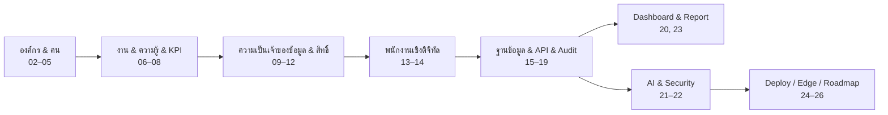

# 00 — README / Index (สารบัญสถาปัตยกรรม NEXUS OS)

## Saduak Suay Mai PCL — Enterprise AI Workforce OS · Architecture Document Set

> **บริษัท / Company:** Saduak Suay Mai PCL — เครือคลินิกเสริมความงาม + ทันตกรรม (แฟรนไชส์ / franchise chain)
> **ระบบฐาน / Base system:** NEXUS OS (Next.js 16 `nexus-web` + Express/TS `nexus-api` + PostgreSQL บน Railway)
> **Deploy model:** `railway up` ต่อ service (services: `nexus-web`, `nexus-api`, `Postgres`) — **ไม่ใช่** GitHub auto-deploy; แต่ละ service build จาก Dockerfile ของตัวเอง
> **สถานะ / Status:** PRODUCTION-READY architecture blueprint — grounded กับโค้ดจริงในรีโป `/Users/paul/Desktop/nexus-os-deploy` (`backend/src/`, `nexasos/`)
> **ภาษา / Language convention:** Thai narrative + English technical identifiers (ตรงกับ bilingual style ของบริษัท)
> **เวอร์ชันเอกสาร / Doc set version:** 1.0 · last indexed 2026-06-25

---

## 0. วิธีอ่านเอกสารชุดนี้ / How to read this set

เอกสารชุดนี้คือ **architecture of record** สำหรับการยกระดับ NEXUS OS จากสถานะปัจจุบัน (current-state) ไปสู่ **enterprise target** ที่ strict, exhaustive, deny-by-default และพร้อม production จริง — ไม่ใช่ demo/MVP

**โครงสร้างการเล่าเรื่อง (narrative arc):** เอกสารเรียงจาก **องค์กร → คน → ข้อมูล → สิทธิ์ → ระบบ → AI → ความปลอดภัย → deploy → roadmap**

**ป้ายกำกับสถานะ (status tags) ที่ใช้ทุกเอกสาร** — ทุก table / API / feature ที่เสนอ ต้องติดป้ายอย่างใดอย่างหนึ่ง:

| Tag | ความหมาย | ตัวอย่าง |
|---|---|---|
| `EXISTS` | มีในโค้ดจริงแล้ว ใช้งานได้ | `audit_log`, `users`, `org_units`, `ai_logs`, RBAC `ROLES[13]` |
| `PARTIAL` | มีบางส่วน ต้องเสริมให้ครบ enterprise spec | `audit_log` (ขาด before/after, ขาด append-only), `ai_logs` (metering ปลอม), RBAC (ขาด policy engine) |
| `NEW` | ต้องสร้างใหม่ผ่าน migration / เขียนใหม่ | `data_ownership`, `consent_logs`, `login_logs`, `file_access_logs`, `permission_change_logs`, `ai_query_logs`, soft-delete columns |

> หลักการอ้างอิง ground truth: เลขตาราง/ฟิลด์/ไฟล์ทุกตัวอ้างจาก **discovery inventory** และไฟล์จริงใน `backend/src/` — ที่ใดข้อมูลจริงไม่ทราบ (ชื่อพนักงาน, KPI target/สูตรเป๊ะ ๆ, รายชื่อสาขา, headcount, salary band, SLA) จะติดป้าย **[ASSUMPTION]** และคงความสมจริงสำหรับคลินิกความงาม+ทันตกรรมแบบแฟรนไชส์ในไทย

---

## 1. สารบัญหลัก / Master Index (reading order)

> ทุกไฟล์อยู่ใน `docs/architecture/`. เอกสารชุดย่อย **03-department-breakdown** อยู่ในโฟลเดอร์ย่อยชื่อเดียวกัน (10 ไฟล์ ครบ 10 departments)

### ส่วน A — รากฐาน & องค์กร / Foundation & Organization

| # | เอกสาร / Document | คำอธิบายหนึ่งบรรทัด / One-line description | Status focus |
|---|---|---|---|
| **00** | `00-README-index.md` | **(ไฟล์นี้)** สารบัญ + reading order + การ map ไป 30 required deliverables + แผนที่สถานะ EXISTS/PARTIAL/NEW | meta |
| **02** | `02-organization-tree.md` | Org tree เต็ม `Company → Department → Sub-Department → Team/Unit → Position → Employee` ครบ 10 departments — grounded กับ `DEPARTMENT_DEFINITIONS` + `hr-init.ts` | `EXISTS`/`PARTIAL` |
| **03/** | `03-department-breakdown/` | **โฟลเดอร์ย่อย** — เจาะลึกรายแผนกทั้ง 10 (ดูตาราง §1.1 ด้านล่าง): ภารกิจ, sub-unit, position, workflow, ความเสี่ยง, AI use-case ต่อแผนก | `EXISTS`/`NEW` |
| **04** | `04-position-structure.md` | โครงสร้างตำแหน่งงานทุก position: job family, grade/level, reporting line, span-of-control, mapping ตำแหน่ง→system role 13 ตัว | `PARTIAL` |
| **05** | `05-responsibility-matrix.md` | Responsibility / RACI matrix — ใครรับผิดชอบ/อนุมัติ/ปรึกษา/แจ้ง ในแต่ละ business process ข้ามแผนก | `NEW` |

#### 1.1 เอกสารชุดย่อย 03-department-breakdown (10 ไฟล์)

> เรียงตามลำดับ canonical ของ 10 departments. Operations มี 3 sub-unit (Customer Support+Admin, Personal Care, Telesales) อยู่ภายในไฟล์ 02-operations

| # | ไฟล์ | แผนก / Department | สาระสำคัญ |
|---|---|---|---|
| 03/01 | `01-ceo-office.md` | CEO Office | สำนักผู้บริหาร: กลยุทธ์, executive notes (RESTRICTED), board, governance |
| 03/02 | `02-operations.md` | Operations | รวม sub-unit: Customer Support+Admin, Personal Care, Telesales — หัวใจการบริการลูกค้าหน้าร้าน |
| 03/03 | `03-marketing.md` | Marketing | แคมเปญ, lead, brand, ช่องทางดิจิทัล, performance marketing |
| 03/04 | `04-medical.md` | Medical | งานการแพทย์/หัตถการความงาม, patient records (RESTRICTED), แพทย์/พยาบาล |
| 03/05 | `05-finance-accounting.md` | Finance & Accounting | บัญชี/การเงิน, payroll, tax, contract (RESTRICTED), approval workflow |
| 03/06 | `06-people-hr.md` | People (HR) | สรรหา, onboarding, ประเมิน, HR investigation (RESTRICTED), leave/OT/attendance |
| 03/07 | `07-it.md` | IT | ระบบ, ความปลอดภัย, access provisioning, audit, infra |
| 03/08 | `08-warehouse-purchasing.md` | Warehouse & Purchasing | คลังสินค้า/เวชภัณฑ์, จัดซื้อ, สต็อก, supplier |
| 03/09 | `09-franchise.md` | Franchise | บริหารแฟรนไชส์ซี, franchise audit, มาตรฐานสาขา, royalty |
| 03/10 | `10-dental.md` | Dental | งานทันตกรรม, dental patient records (RESTRICTED), หมอฟัน/ผู้ช่วย |

### ส่วน B — งาน, ความรู้, KPI / Work · Knowledge · KPI

| # | เอกสาร / Document | คำอธิบายหนึ่งบรรทัด / One-line description | Status focus |
|---|---|---|---|
| **06** | `06-workflow-matrix.md` | Workflow matrix — business process หลักทุกแผนก: trigger, ขั้นตอน, ผู้เกี่ยวข้อง, จุดอนุมัติ, SLA `[ASSUMPTION]`, ระบบที่เกี่ยวข้อง | `NEW`/`PARTIAL` |
| **07** | `07-kpi-matrix.md` | KPI matrix รายแผนก/ตำแหน่ง: metric, สูตร, target `[ASSUMPTION]`, ความถี่, แหล่งข้อมูล, mapping ไป `kpi_entries` | `PARTIAL` |
| **08** | `08-knowledge-matrix.md` | Knowledge matrix — ความรู้/SOP/เอกสารที่แต่ละแผนกต้องมี, owner, security level, mapping ไป `knowledge_items` + RAG | `EXISTS`/`PARTIAL` |

### ส่วน C — ความเป็นเจ้าของข้อมูล, ความปลอดภัย, สิทธิ์, AI access / Data · Security · Permission · AI

| # | เอกสาร / Document | คำอธิบายหนึ่งบรรทัด / One-line description | Status focus |
|---|---|---|---|
| **09** | `09-data-ownership-matrix.md` | Data-ownership matrix — ทุกตารางหลัก: owner role/department, การ scope ตามเจ้าของข้อมูล, โมเดล `data_ownership` ใหม่ | `NEW` |
| **10** | `10-security-matrix.md` | Security matrix — จัด 4 ระดับ BASIC / MEDIUM / HARD / RESTRICTED ให้ทุกตาราง/ฟิลด์; กฎ default RESTRICTED (medical/dental/patient, salary/payroll/contract/tax, HR investigation, AI evaluation, executive notes) | `NEW`/`PARTIAL` |
| **11** | `11-permission-matrix.md` | Permission matrix — RBAC + ABAC + data-ownership ต่อ resource/action; deny-by-default; mapping ไป `MODULE_ACCESS`/`permission_groups` | `PARTIAL` |
| **12** | `12-ai-access-matrix.md` | AI access matrix — ต่อ role/department: AI เข้าถึงตาราง/ฟิลด์ใดได้, filter ก่อนส่งโมเดล, redaction, output policy; AI ไม่เคยเห็นข้อมูลที่ user เห็นไม่ได้ | `NEW` |

### ส่วน D — พนักงานเชิงดิจิทัล / Digital Employee

| # | เอกสาร / Document | คำอธิบายหนึ่งบรรทัด / One-line description | Status focus |
|---|---|---|---|
| **13** | `13-employee-digital-twin.md` | Employee Digital Twin model — รวม profile, skill, capacity, KPI, memory ของพนักงานเป็นแบบจำลองเดียว; mapping ไป `employee_profiles` + `skill_scores` + `user_capacity` + `user_ai_memory` | `EXISTS`/`PARTIAL` |
| **14** | `14-employee-data-collection-form.md` | แบบฟอร์มเก็บข้อมูลพนักงาน (data collection form) — ทุก field, ระดับความลับ, consent, validation; ป้อนเข้า digital twin | `NEW`/`PARTIAL` |

### ส่วน E — ระบบ: ฐานข้อมูล, API, Audit, Permission logic / System internals

| # | เอกสาร / Document | คำอธิบายหนึ่งบรรทัด / One-line description | Status focus |
|---|---|---|---|
| **15** | `15-database-schema.md` | Database schema เต็ม — ทุกตาราง (EXISTS ~55 + NEW) พร้อม column, FK, UNIQUE, CHECK, composite index, soft-delete, versioning, security_level; กำกับ EXISTS/PARTIAL/NEW ทุกตาราง | `EXISTS`/`PARTIAL`/`NEW` |
| **16** | `16-er-diagram.md` | ER diagram (mermaid) — ความสัมพันธ์ระหว่างตารางหลัก, tenancy (`company_id`), org hierarchy, ownership, audit/AI linkage | derived |
| **17** | `17-audit-log-design.md` | Audit-log design — append-only, before/after JSON, hash-chain tamper-evidence, ครบทุก action, ip/device/request_id/session_id, retention, AI logs แยกแต่ link ด้วย `request_id` | `PARTIAL`→`NEW` |
| **18** | `18-api-specification.md` | API specification — ทุก endpoint: method, path, auth, RBAC/ABAC gate, request/response schema, error, audit hook; กำกับ EXISTS/NEW | `EXISTS`/`NEW` |
| **19** | `19-permission-logic.md` | Permission logic — policy engine กลาง (RBAC+ABAC+ownership), ลำดับการตัดสิน, deny-by-default, row-level scoping, การบังคับใน backend ทุก API + ทุก AI query | `NEW` |

### ส่วน F — ส่วนติดต่อผู้ใช้: Dashboard & Report / Presentation layer

| # | เอกสาร / Document | คำอธิบายหนึ่งบรรทัด / One-line description | Status focus |
|---|---|---|---|
| **20** | `20-dashboard-design.md` | Dashboard design — role-based dashboards 5 persona (CEO, HR, Manager, Employee, IT/Security); ทุก widget ระบุ data source + permission/security filtering + map ไปหน้า NEXUS OS จริง | `EXISTS`/`PARTIAL` |
| **23** | `23-report-design.md` | Report design — รายงานมาตรฐานรายแผนก/ผู้บริหาร: เนื้อหา, แหล่งข้อมูล, สิทธิ์การเข้าถึง, export + audit (export = action ที่ถูกบันทึก) | `NEW`/`PARTIAL` |

### ส่วน G — AI & Security architecture

| # | เอกสาร / Document | คำอธิบายหนึ่งบรรทัด / One-line description | Status focus |
|---|---|---|---|
| **21** | `21-ai-architecture.md` | AI architecture — flow: query → identify user → ตรวจ role/department/position/clearance → filter ข้อมูล → ส่งเฉพาะที่อนุญาต → response → redaction → audit; provider/fallback, RAG grounding, `ai_query_logs` | `PARTIAL`→`NEW` |
| **22** | `22-security-architecture.md` | Security architecture — auth/JWT/MFA, token rotation/revocation, CSRF, rate limit แบบ distributed, encryption/secrets, tenancy isolation, data classification, threat model | `PARTIAL`→`NEW` |

### ส่วน H — Deploy, Edge, Roadmap / Operations

| # | เอกสาร / Document | คำอธิบายหนึ่งบรรทัด / One-line description | Status focus |
|---|---|---|---|
| **24** | `24-railway-deployment-plan.md` | Railway deployment plan — `nexus-web` + `nexus-api` + `Postgres`, `railway up` ต่อ service, Dockerfile, boot sequence, healthcheck, env vars, migration/backup workers | `EXISTS` |
| **25** | `25-cloudflare-security-plan.md` | Cloudflare security plan — zero-trust perimeter หน้า Railway: WAF, DDoS, rate limit, bot, TLS, IP allow-list, edge rules | `NEW` |
| **26** | `26-development-roadmap.md` | Development roadmap — แผนเป็นเฟสจาก current-state → enterprise target: entry/exit criteria, deliverables, dependencies, effort sizing, rollback; ทุก deliverable ติดป้าย EXISTS/PARTIAL/NEW | meta/plan |

> **หมายเหตุการเรียงเลข:** ชุดเอกสารเริ่มที่ **02** (มี 00 = ไฟล์นี้). หมายเลข **01** ถูกใช้เป็น "บทนำองค์กร" ซึ่งเนื้อหากระจายอยู่ใน 02-organization-tree.md + โฟลเดอร์ 03-department-breakdown/ (ไม่มีไฟล์ `01-*.md` เดี่ยวที่ root โดยตั้งใจ). เอกสารหลักจบที่ **26** โดย 30 required deliverables ถูก map ลงบนชุด 02–26 + ไฟล์รายแผนก 10 ไฟล์ (ดู §2)

---

## 2. การ map ไป 30 required deliverables / Mapping to the 30 deliverables

> **โจทย์ต้นทาง** กำหนด 30 deliverables. เนื่องจากบาง deliverable ถูกขยายเป็นหลายไฟล์ (เช่น department breakdown = 10 ไฟล์) และบางคู่ถูกควบรวมเชิงตรรกะ เอกสารชุดนี้ครอบคลุม **ครบทั้ง 30** โดย map ดังนี้

| # | Required deliverable (30) | เอกสารที่ครอบคลุม / Covered by | สถานะ |
|---|---|---|---|
| 1 | README / Index | `00-README-index.md` | ✅ ไฟล์นี้ |
| 2 | Organization tree | `02-organization-tree.md` | ✅ |
| 3 | Department breakdown (รวม) | `03-department-breakdown/` (index + 10 ไฟล์) | ✅ |
| 4 | Position structure | `04-position-structure.md` | ✅ |
| 5 | Responsibility / RACI matrix | `05-responsibility-matrix.md` | ✅ |
| 6 | Workflow matrix | `06-workflow-matrix.md` | ✅ |
| 7 | KPI matrix | `07-kpi-matrix.md` | ✅ |
| 8 | Knowledge matrix | `08-knowledge-matrix.md` | ✅ |
| 9 | Data-ownership matrix | `09-data-ownership-matrix.md` | ✅ |
| 10 | Security matrix (4 levels) | `10-security-matrix.md` | ✅ |
| 11 | Permission matrix (RBAC+ABAC+ownership) | `11-permission-matrix.md` | ✅ |
| 12 | AI access matrix | `12-ai-access-matrix.md` | ✅ |
| 13 | Employee digital twin | `13-employee-digital-twin.md` | ✅ |
| 14 | Employee data collection form | `14-employee-data-collection-form.md` | ✅ |
| 15 | Database schema (full) | `15-database-schema.md` | ✅ |
| 16 | ER diagram | `16-er-diagram.md` | ✅ |
| 17 | Audit-log design | `17-audit-log-design.md` | ✅ |
| 18 | API specification | `18-api-specification.md` | ✅ |
| 19 | Permission logic / policy engine | `19-permission-logic.md` | ✅ |
| 20 | Dashboard design | `20-dashboard-design.md` | ✅ |
| 21 | AI architecture | `21-ai-architecture.md` | ✅ |
| 22 | Security architecture | `22-security-architecture.md` | ✅ |
| 23 | Report design | `23-report-design.md` | ✅ |
| 24 | Railway deployment plan | `24-railway-deployment-plan.md` | ✅ |
| 25 | Cloudflare / edge security plan | `25-cloudflare-security-plan.md` | ✅ |
| 26 | Development roadmap | `26-development-roadmap.md` | ✅ |
| 27 | Department deep-dive: Operations sub-units (Customer Support+Admin / Personal Care / Telesales) | `03-department-breakdown/02-operations.md` | ✅ (ครอบคลุมใน #3) |
| 28 | Medical & Dental patient-data handling (RESTRICTED) | `03-.../04-medical.md` + `03-.../10-dental.md` + `10-security-matrix.md` + `12-ai-access-matrix.md` | ✅ |
| 29 | Finance/HR sensitive-data handling (payroll/tax/contract/investigation, RESTRICTED) | `03-.../05-finance-accounting.md` + `03-.../06-people-hr.md` + `10` + `17` | ✅ |
| 30 | Franchise multi-branch governance & audit | `03-department-breakdown/09-franchise.md` + `franchise_audits` ใน `15-database-schema.md` | ✅ |

> **สรุปการ map:** 30 deliverables → **26 เอกสารหลัก (00, 02–26)** + **10 ไฟล์ใน `03-department-breakdown/`**. Deliverables #27–#30 เป็น "เจาะลึกเฉพาะทาง" ที่ไม่มีไฟล์เดี่ยวแยก แต่ถูกครอบคลุมเต็มภายในเอกสารรายแผนก + เอกสาร security/audit/AI ที่ระบุ (cross-reference ชัดเจน ไม่มี deliverable ใดตกหล่น)

---

## 3. หลักออกแบบที่บังคับใช้ทุกเอกสาร / Global rules enforced across the set

เอกสารทุกฉบับในชุดนี้ยึด 5 หลักการกลางต่อไปนี้ (ใช้เป็น checklist เวลา review):

1. **Org model เดียวกัน** — `Company → Department → Sub-Department → Team/Unit → Position → Employee`, 10 departments (CEO Office, Operations[+3 sub-unit], Marketing, Medical, Finance & Accounting, People/HR, IT, Warehouse & Purchasing, Franchise, Dental)
2. **4 ระดับความปลอดภัย** — `BASIC` (ทุกคน) · `MEDIUM` (ระดับแผนก) · `HARD` (owner/manager/HR) · `RESTRICTED` (direct grant เท่านั้น). ค่า default RESTRICTED: medical/dental/patient records, salary/payroll/contract/tax, HR investigation, AI evaluation, executive notes
3. **Permission = RBAC + ABAC + Data-Ownership** — deny-by-default, บังคับใน **backend** ทุก API และ **ทุก AI query** (ไม่ใช่ frontend-only)
4. **Audit = append-only** — บันทึกทุก action (login/logout/view/search/CRUD/soft-delete/restore/upload/download/export/approve/reject/permission-change/role-change/ai-query/ai-response/failed-access/blocked-access) พร้อม actor, role, target table/id, target security_level, before/after JSON, changed fields, ip, device, user_agent, request_id, session_id, endpoint, http_method, result, failure_reason, created_at — แก้/ลบไม่ได้, มี retention; AI log แยกตารางแต่ link ด้วย `request_id`
5. **AI ไม่อ่าน DB ตรง** — flow: query → identify user → check role/department/position/clearance → filter ข้อมูลที่อนุญาต → ส่งเฉพาะที่อนุญาตให้โมเดล → response → redaction check → audit log; AI ต้องไม่เปิดเผยข้อมูลที่ user เห็นไม่ได้

**Core-table contract** — ทุกตารางหลักต้องมี: `id, company_id, created_at, updated_at, deleted_at, created_by, updated_by, deleted_by, is_active, version, security_level` พร้อม FK / UNIQUE / composite index / NOT NULL / CHECK / soft-delete / versioning

---

## 4. แผนที่สถานะระบบ (current-state → target) / At-a-glance gap map

> ดึงจาก discovery inventory — ใช้เป็นเข็มทิศว่าเอกสารใดอธิบาย "ของที่มี" vs "ของที่ต้องสร้าง"

| โดเมน | สถานะปัจจุบัน (EXISTS/PARTIAL) | ช่องว่างสำคัญ (→ NEW) | เอกสารหลักที่กล่าวถึง |
|---|---|---|---|
| Schema | ~55 ตาราง (core + HR + ops + entity) | soft-delete columns ทั้งระบบ, versioning, `data_ownership` | 15, 16 |
| Audit | `audit_log` (best-effort, มี `meta` JSON) | before/after, append-only enforcement, hash-chain, ip/UA/request_id, retention | 17 |
| RBAC/ABAC | `ROLES[13]`, `MODULE_ACCESS`, `permission_groups` | policy engine กลาง, row-level scoping, ownership model | 11, 19 |
| AI | `ai-router`, `ai_logs`, fallback chain | redaction ก่อนส่ง provider, `ai_query_logs`, per-field AI policy, real metering | 12, 21 |
| Security | helmet, CORS, in-mem rate limit, JWT | MFA, token rotation/revocation, CSRF, distributed rate limit, secrets manager, edge WAF | 22, 25 |
| Logs (ใหม่) | — | `consent_logs`, `login_logs`, `file_access_logs`, `permission_change_logs` | 14, 17, 22 |
| Org wiring | `org_units`, `departments`, `branches` (เป็น data) | ผูกเข้า RBAC/ABAC, `sub_departments`/`teams`, FK membership แทน free-text `users.department` | 02, 04, 09, 11 |

---

## 5. Changelog / ผู้รับผิดชอบ

| เวอร์ชัน | วันที่ | การเปลี่ยนแปลง | ผู้จัดทำ |
|---|---|---|---|
| 1.0 | 2026-06-25 | สร้างชุดเอกสารสถาปัตยกรรมครบ 00, 02–26 + `03-department-breakdown/` (10 ไฟล์); index + 30-deliverable mapping | Principal Architecture Panel `[ASSUMPTION]` |

> **เจ้าของเอกสาร (document owner):** CEO Office + IT `[ASSUMPTION]` · **รอบ review:** ก่อนเริ่มแต่ละ phase ใน `26-development-roadmap.md`
> เอกสารทั้งหมดเป็น **architecture of record** — การแก้ไขต้องผ่าน review และบันทึกใน changelog นี้
