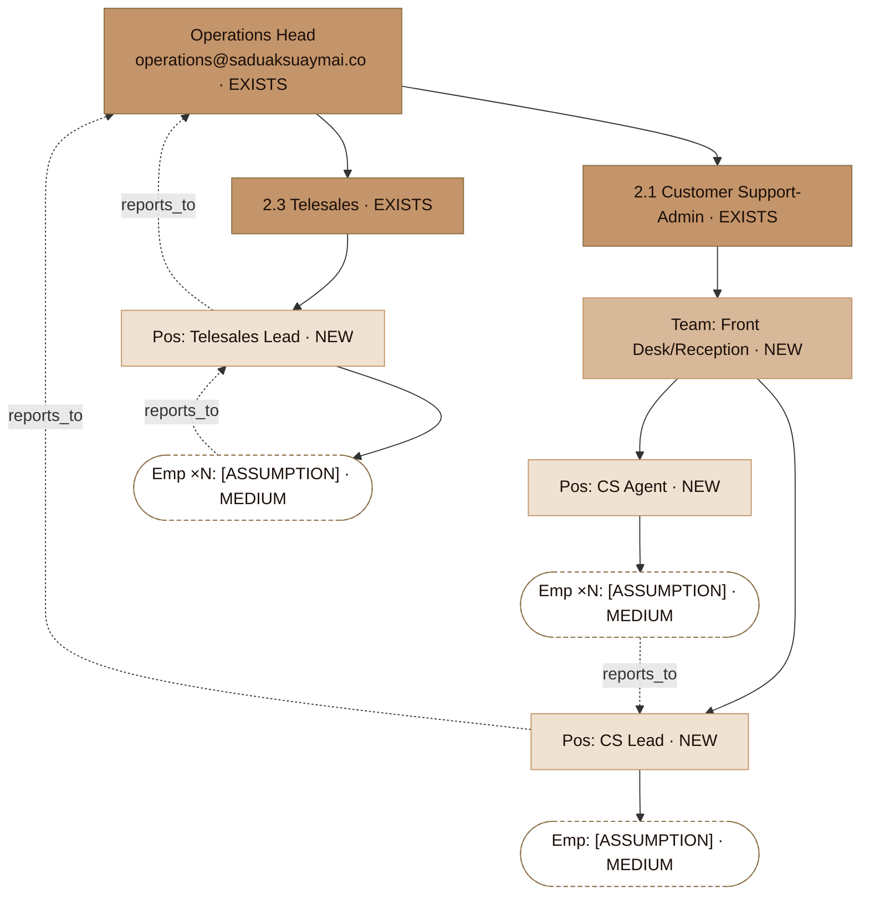

# 02 — Organization Tree (Saduak Suay Mai PCL)

> **เอกสารสถาปัตยกรรม / Architecture Document** · NEXUS OS AI Workforce OS
> **ขอบเขต / Scope:** Full organization tree — `Company → Department → Sub-Department → Team/Unit → Position → Employee` ครบทั้ง **10 departments**
> **สถานะกราวด์ดิ้ง / Grounding:** อ้างอิงโครงสร้างที่ seed จริงในระบบ (`backend/src/lib/departments.ts` `DEPARTMENT_DEFINITIONS`, `backend/src/lib/hr-init.ts` `ensureHrDefaults()`, `backend/scripts/seed-saduak.ts`)
> **หมายเหตุข้อมูลสมมติ / Assumptions:** จำนวนพนักงาน (headcount), รายชื่อสาขา (branches), ชื่อพนักงานจริง, และตำแหน่งระดับ Team/Position ที่ลึกกว่าที่ seed ไว้ — ทำเครื่องหมาย **[ASSUMPTION]** ทุกจุด ไม่ปั้นเป็นข้อเท็จจริง

---

## 0. สรุปผู้บริหาร / Executive Summary

องค์กร **Saduak Suay Mai PCL** (สะดวกสวยมาย / `saduaksuaymai.co`) เป็นเครือคลินิกความงาม + ทันตกรรมแบบแฟรนไชส์ โครงสร้างองค์กรถูกออกแบบเป็น **6 ชั้นตามลำดับชั้น (6-level hierarchy)**:

```
Company → Department → Sub-Department → Team/Unit → Position → Employee
  (L0)        (L1)          (L2)            (L3)        (L4)       (L5)
```

ใน NEXUS OS ปัจจุบัน **3 ชั้นแรกถูก seed จริง** ลงตาราง `org_units` (level 1 = ROOT/Company, level 2 = Department, level 3 = Sub-Department) และ **Position** เป็นรายการแยก (flat list) ในตาราง `positions` ส่วน **Employee** ผูกกับ org/position ผ่าน `employee_profiles.org_unit_id` + `employee_profiles.position_id`. ชั้น **Team/Unit (L3 ในเชิงตรรกะ)** และ **Position-per-department ที่ละเอียด** ยังไม่ถูก seed เป็น first-class — เอกสารนี้กำหนดเป็น **target design** และทำเครื่องหมาย **[NEW / migration]** ตามจริง.

| ชั้น / Level | ชื่อ | เก็บที่ไหนในระบบปัจจุบัน | สถานะ |
|---|---|---|---|
| **L0** Company | นิติบุคคล Saduak Suay Mai PCL | `companies` (1 row) | **EXISTS** — seed ใน `seed-saduak.ts` |
| **L1** Department | 10 แผนกหลัก | `org_units` (level=2), `departments` | **EXISTS** — `DEPARTMENT_DEFINITIONS` |
| **L2** Sub-Department | หน่วยย่อย (เฉพาะ Operations มี 3) | `org_units` (level=3) | **EXISTS (partial)** — มีเฉพาะ Operations |
| **L3** Team/Unit | ทีม/ยูนิตปฏิบัติงาน | — | **[NEW / migration]** + **[ASSUMPTION]** |
| **L4** Position | ตำแหน่ง | `positions` (flat, 4 default) | **EXISTS (generic)** — ต้องขยายต่อแผนก **[NEW]** |
| **L5** Employee | พนักงาน | `users` + `employee_profiles` | **EXISTS** — 1 login/แผนก seed แล้ว |

> **[ASSUMPTION]** Saduak Suay Mai PCL เป็นบริษัทมหาชน (PCL) ที่ดำเนินการคลินิกความงาม + ทันตกรรมแบบแฟรนไชส์ในไทย — headcount, จำนวนสาขา, salary bands ทั้งหมดในเอกสารนี้เป็นค่าสมมติที่สมเหตุสมผลกับธุรกิจประเภทนี้ ต้องยืนยันกับ HR/CEO Office ก่อนใช้งานจริง.

---

## 1. Grounding — โครงสร้างที่ seed จริงในโค้ด (Source of Truth)

โครงสร้างแผนกถูกนิยามครั้งเดียวที่ `backend/src/lib/departments.ts`:

```ts
// DEPARTMENT_DEFINITIONS — 10 departments, 1 department = 1 system role
[
  { name: 'CEO Office', systemRole: 'ceo',        label_th: 'สำนักซีอีโอ' },
  { name: 'Operations', systemRole: 'operations', label_th: 'ปฏิบัติการ',
    subUnits: [
      { name: 'Customer Support-Admin', label_th: 'ลูกค้าสัมพันธ์ / แอดมิน' },
      { name: 'Personal Care',          label_th: 'ดูแลส่วนบุคคล' },
      { name: 'Telesales',              label_th: 'เทเลเซลส์' },
    ] },
  { name: 'Marketing',  systemRole: 'marketing',  label_th: 'การตลาด' },
  { name: 'Medical',    systemRole: 'medical',    label_th: 'การแพทย์' },
  { name: 'Finance',    systemRole: 'finance',    label_th: 'การเงินและบัญชี' },
  { name: 'HR',         systemRole: 'hr',         label_th: 'ทรัพยากรบุคคล (People)' },
  { name: 'IT',         systemRole: 'it',         label_th: 'เทคโนโลยีสารสนเทศ' },
  { name: 'Warehouse',  systemRole: 'warehouse',  label_th: 'คลังสินค้าและจัดซื้อ' },
  { name: 'Franchise',  systemRole: 'franchise',  label_th: 'แฟรนไชส์' },
  { name: 'Dental',     systemRole: 'dental',     label_th: 'ทันตกรรม' },
]
```

**ข้อเท็จจริงที่ตรวจสอบได้จากโค้ด (verified facts):**

1. **10 departments เป๊ะ** — 1 department map 1:1 กับ system role ผ่าน `getSystemRoleForDepartment()`.
2. **มีเพียง Operations เท่านั้น** ที่มี `subUnits` (3 หน่วย) — แผนกอื่นยังไม่มี sub-department ใน seed.
3. **`ensureHrDefaults()`** (`hr-init.ts`) สร้าง `org_units` 3 ชั้น: `ROOT` (level 1) → 10 departments (level 2) → sub-units ของ Operations (level 3). รวม **1 + 10 + 3 = 14 org_units**.
4. **`positions`** ถูก seed เป็น generic 4 ตำแหน่ง เท่านั้น: `ผู้จัดการ`, `เจ้าหน้าที่`, `หัวหน้าแผนก`, `ผู้ช่วย` — ยังไม่แยกตามแผนก.
5. **`seed-saduak.ts`** สร้าง **1 owner (`admin@saduaksuaymai.co`, role=admin, dept=CEO Office)** + **1 login ต่อแผนก** (`{role}@saduaksuaymai.co`, ชื่อ `หัวหน้า{label_th}`) รวม **11 users** (password `test1234`).
6. CEO Office ได้ `head_user_id` = owner; แผนกอื่น head ถูก auto-assign ให้คนแรกที่ถูกสร้างในแผนกนั้น (`createDepartmentEmployee` / `assignDepartmentHead`).

> **ช่องว่างที่ต้องอุดเชิงสถาปัตยกรรม (gap):** ชั้น **Team/Unit (L3)** และ **Position ละเอียดต่อแผนก (L4)** ยังไม่มีใน seed. เอกสารนี้กำหนดเป็น target และต้อง migration เพิ่ม (ดู §6).

---

## 2. Legend — สัญลักษณ์และนิยามชั้น

| สัญลักษณ์ | ความหมาย |
|---|---|
| **[EXISTS]** | มีอยู่จริงในระบบ/seed แล้ว — ไม่ต้อง migration |
| **[NEW]** | ต้องสร้างใหม่ / migration |
| **[ASSUMPTION]** | ข้อมูลสมมติ (headcount, ชื่อ, สาขา, ตำแหน่งย่อย) — ต้องยืนยันก่อนใช้จริง |
| **RESTRICTED / HARD / MEDIUM / BASIC** | security_level เริ่มต้นของข้อมูลที่หน่วยนั้นเป็นเจ้าของ |
| `reports_to` | สายบังคับบัญชา (โยงใน mermaid) |
| **HC** | Headcount **[ASSUMPTION]** |

**6 ชั้นตามลำดับ:**
- **L0 Company** — นิติบุคคล (multi-tenant `company_id`)
- **L1 Department** — 10 แผนกหลัก (= system role)
- **L2 Sub-Department** — หน่วยย่อยภายในแผนก
- **L3 Team/Unit** — ทีมปฏิบัติงาน/สาขา
- **L4 Position** — ตำแหน่งงาน (job title)
- **L5 Employee** — บุคคล (1 user account)

---

## 3. Indented Text Tree — โครงสร้างองค์กรเต็มทั้ง 10 แผนก

> ระดับ L0–L2 = **[EXISTS]** (seed จริง) เว้นแต่ระบุ. L3 (Team/Unit), L4 (Position ละเอียด), L5 (ชื่อพนักงาน) และ HC = **[ASSUMPTION]** / **[NEW]** ทั้งหมด.
> รูปแบบบรรทัดพนักงาน: `Position — ชื่อ [ASSUMPTION] · security_level`

```
Saduak Suay Mai PCL  [L0 · EXISTS · company_id]                          ── BASIC (org public) / RESTRICTED (exec notes)
│   นิติบุคคล · domain saduaksuaymai.co · multi-branch franchise
│   reports_to: (Board of Directors) [ASSUMPTION · นอกระบบ NEXUS]
│
├── 1. CEO Office  [L1 · EXISTS · role=ceo]                              ── RESTRICTED (executive notes / strategy)
│   │   head: admin@saduaksuaymai.co (Owner) [EXISTS]
│   │   HC: 4 [ASSUMPTION]
│   ├── (no sub-department in seed) [EXISTS=ไม่มี subUnits]
│   ├── Team/Unit: Executive Office  [L3 · NEW · ASSUMPTION]
│   │   ├── Position: Chief Executive Officer (CEO)  [L4 · NEW]
│   │   │   └── Employee: [ชื่อ-ASSUMPTION] · RESTRICTED       reports_to → Board
│   │   ├── Position: Executive Assistant to CEO  [L4 · NEW]
│   │   │   └── Employee: [ชื่อ-ASSUMPTION] · HARD             reports_to → CEO
│   │   └── Position: Chief Operating Officer (COO) [L4 · NEW · ASSUMPTION]
│   │       └── Employee: [ชื่อ-ASSUMPTION] · RESTRICTED       reports_to → CEO
│   └── Team/Unit: Strategy & PMO  [L3 · NEW · ASSUMPTION]
│       └── Position: Strategy / Business Planning Lead  [L4 · NEW]
│           └── Employee: [ชื่อ-ASSUMPTION] · RESTRICTED       reports_to → CEO
│
├── 2. Operations  [L1 · EXISTS · role=operations]                      ── MEDIUM (dept) / RESTRICTED (customer PII)
│   │   head: operations@saduaksuaymai.co (หัวหน้าปฏิบัติการ) [EXISTS]
│   │   HC: 28 [ASSUMPTION]   reports_to → COO/CEO
│   ├── 2.1 Sub-Dept: Customer Support-Admin  [L2 · EXISTS · subUnit]   ── MEDIUM / RESTRICTED (customer records)
│   │   │   label_th: ลูกค้าสัมพันธ์ / แอดมิน
│   │   ├── Team/Unit: Front Desk / Reception  [L3 · NEW · ASSUMPTION]
│   │   │   ├── Position: Customer Support Lead  [L4 · NEW]
│   │   │   │   └── Employee: [ชื่อ-ASSUMPTION] · MEDIUM       reports_to → Operations Head
│   │   │   ├── Position: Customer Support Agent (CSR)  [L4 · NEW]
│   │   │   │   └── Employee ×N [ASSUMPTION] · MEDIUM          reports_to → CS Lead
│   │   │   └── Position: Clinic Admin / Coordinator  [L4 · NEW]
│   │   │       └── Employee ×N [ASSUMPTION] · MEDIUM          reports_to → CS Lead
│   │   └── Team/Unit: Booking & Scheduling  [L3 · NEW · ASSUMPTION]
│   │       └── Position: Booking Coordinator  [L4 · NEW]
│   │           └── Employee ×N [ASSUMPTION] · MEDIUM          reports_to → CS Lead
│   ├── 2.2 Sub-Dept: Personal Care  [L2 · EXISTS · subUnit]            ── RESTRICTED (links to patient care)
│   │   │   label_th: ดูแลส่วนบุคคล
│   │   └── Team/Unit: Aftercare / Concierge  [L3 · NEW · ASSUMPTION]
│   │       ├── Position: Personal Care Lead  [L4 · NEW]
│   │       │   └── Employee: [ชื่อ-ASSUMPTION] · RESTRICTED   reports_to → Operations Head
│   │       └── Position: Personal Care Specialist  [L4 · NEW]
│   │           └── Employee ×N [ASSUMPTION] · RESTRICTED      reports_to → Personal Care Lead
│   └── 2.3 Sub-Dept: Telesales  [L2 · EXISTS · subUnit]                ── MEDIUM / RESTRICTED (lead PII)
│       │   label_th: เทเลเซลส์
│       └── Team/Unit: Outbound Telesales  [L3 · NEW · ASSUMPTION]
│           ├── Position: Telesales Team Lead  [L4 · NEW]
│           │   └── Employee: [ชื่อ-ASSUMPTION] · MEDIUM       reports_to → Operations Head
│           └── Position: Telesales Agent  [L4 · NEW]
│               └── Employee ×N [ASSUMPTION] · MEDIUM          reports_to → Telesales Lead
│
├── 3. Marketing  [L1 · EXISTS · role=marketing]                        ── MEDIUM (dept) / RESTRICTED (ad spend strategy)
│   │   head: marketing@saduaksuaymai.co (หัวหน้าการตลาด) [EXISTS]
│   │   HC: 12 [ASSUMPTION]   reports_to → CEO/COO
│   ├── (no sub-department in seed) [EXISTS=ไม่มี subUnits]
│   ├── 3.1 Sub-Dept: Digital / Performance Marketing  [L2 · NEW · ASSUMPTION] ── MEDIUM
│   │   └── Team/Unit: Paid Ads & SEO  [L3 · NEW]
│   │       ├── Position: Marketing Manager  [L4 · NEW]
│   │       │   └── Employee: [ชื่อ-ASSUMPTION] · MEDIUM       reports_to → CEO
│   │       ├── Position: Performance Marketer  [L4 · NEW]
│   │       │   └── Employee ×N [ASSUMPTION] · MEDIUM          reports_to → Mkt Manager
│   │       └── Position: SEO / Web Specialist  [L4 · NEW]
│   │           └── Employee ×N [ASSUMPTION] · MEDIUM
│   ├── 3.2 Sub-Dept: Content & Creative  [L2 · NEW · ASSUMPTION]       ── MEDIUM
│   │   └── Team/Unit: Creative Studio  [L3 · NEW]
│   │       ├── Position: Content Lead  [L4 · NEW]
│   │       ├── Position: Graphic Designer  [L4 · NEW]
│   │       └── Position: Social Media / Community  [L4 · NEW]
│   │           └── Employee ×N [ASSUMPTION] · MEDIUM
│   └── 3.3 Sub-Dept: CRM & Branch Marketing  [L2 · NEW · ASSUMPTION]   ── MEDIUM / RESTRICTED (customer list)
│       └── Team/Unit: Loyalty & Promotions  [L3 · NEW]
│           └── Position: CRM Specialist  [L4 · NEW]
│               └── Employee ×N [ASSUMPTION] · RESTRICTED (customer PII)
│
├── 4. Medical  [L1 · EXISTS · role=medical]                            ── RESTRICTED (patient / clinical records)
│   │   head: medical@saduaksuaymai.co (หัวหน้าการแพทย์) [EXISTS]
│   │   HC: 30 [ASSUMPTION]   reports_to → CEO (clinical governance)
│   ├── (no sub-department in seed) [EXISTS=ไม่มี subUnits]
│   ├── 4.1 Sub-Dept: Physician / Aesthetic Doctors  [L2 · NEW · ASSUMPTION] ── RESTRICTED
│   │   └── Team/Unit: Clinical Team (per branch)  [L3 · NEW · per-branch]
│   │       ├── Position: Chief Medical Officer / Medical Director  [L4 · NEW]
│   │       │   └── Employee: [แพทย์-ASSUMPTION] · RESTRICTED   reports_to → CEO
│   │       ├── Position: Aesthetic Physician (แพทย์ผิวหนัง/ความงาม)  [L4 · NEW]
│   │       │   └── Employee ×N [ASSUMPTION] · RESTRICTED       reports_to → Medical Director
│   │       └── Position: Nurse / Practitioner (พยาบาลวิชาชีพ)  [L4 · NEW]
│   │           └── Employee ×N [ASSUMPTION] · RESTRICTED
│   ├── 4.2 Sub-Dept: Aesthetic / Treatment Services  [L2 · NEW · ASSUMPTION] ── RESTRICTED
│   │   └── Team/Unit: Treatment Room Staff  [L3 · NEW]
│   │       ├── Position: Therapist / Beautician  [L4 · NEW]
│   │       └── Position: Laser / Device Technician  [L4 · NEW]
│   │           └── Employee ×N [ASSUMPTION] · RESTRICTED
│   └── 4.3 Sub-Dept: Clinical Quality & Compliance  [L2 · NEW · ASSUMPTION] ── RESTRICTED
│       └── Position: Clinical QA / Infection Control  [L4 · NEW]
│           └── Employee ×N [ASSUMPTION] · RESTRICTED
│
├── 5. Finance  [L1 · EXISTS · role=finance]                            ── RESTRICTED (payroll/tax/contract) / HARD (reports)
│   │   head: finance@saduaksuaymai.co (หัวหน้าการเงินและบัญชี) [EXISTS]
│   │   HC: 10 [ASSUMPTION]   reports_to → CEO (CFO line)
│   ├── (no sub-department in seed) [EXISTS=ไม่มี subUnits]
│   ├── 5.1 Sub-Dept: Accounting  [L2 · NEW · ASSUMPTION]              ── RESTRICTED
│   │   └── Team/Unit: AP / AR / GL  [L3 · NEW]
│   │       ├── Position: Finance & Accounting Manager  [L4 · NEW]
│   │       │   └── Employee: [ชื่อ-ASSUMPTION] · RESTRICTED   reports_to → CEO/CFO
│   │       ├── Position: Accountant (สมุห์บัญชี)  [L4 · NEW]
│   │       └── Position: AP/AR Officer  [L4 · NEW]
│   │           └── Employee ×N [ASSUMPTION] · RESTRICTED
│   ├── 5.2 Sub-Dept: Payroll & Tax  [L2 · NEW · ASSUMPTION]           ── RESTRICTED (salary/payroll/tax)
│   │   └── Position: Payroll Officer  [L4 · NEW]
│   │       └── Employee ×N [ASSUMPTION] · RESTRICTED
│   └── 5.3 Sub-Dept: Treasury / Cashier  [L2 · NEW · ASSUMPTION]      ── HARD / RESTRICTED
│       └── Position: Cashier / Branch Finance  [L4 · NEW]
│           └── Employee ×N [ASSUMPTION] · HARD
│
├── 6. HR (People)  [L1 · EXISTS · role=hr]                             ── RESTRICTED (HR investigation/contract) / HARD
│   │   head: hr@saduaksuaymai.co (หัวหน้าทรัพยากรบุคคล) [EXISTS]
│   │   HC: 8 [ASSUMPTION]   reports_to → CEO
│   ├── (no sub-department in seed) [EXISTS=ไม่มี subUnits]
│   ├── 6.1 Sub-Dept: People Operations  [L2 · NEW · ASSUMPTION]       ── HARD / RESTRICTED
│   │   └── Team/Unit: Recruiting & Onboarding  [L3 · NEW]
│   │       ├── Position: HR Manager  [L4 · NEW]
│   │       │   └── Employee: [ชื่อ-ASSUMPTION] · RESTRICTED   reports_to → CEO
│   │       ├── Position: Recruiter (สรรหา)  [L4 · NEW]
│   │       └── Position: HR Officer / Payroll Liaison  [L4 · NEW]
│   │           └── Employee ×N [ASSUMPTION] · HARD
│   ├── 6.2 Sub-Dept: Learning & Development  [L2 · NEW · ASSUMPTION]   ── MEDIUM
│   │   └── Position: L&D / Training Specialist  [L4 · NEW]
│   │       └── Employee ×N [ASSUMPTION] · MEDIUM
│   └── 6.3 Sub-Dept: Employee Relations & Compliance  [L2 · NEW · ASSUMPTION] ── RESTRICTED (investigation)
│       └── Position: ER / Compliance Officer  [L4 · NEW]
│           └── Employee ×N [ASSUMPTION] · RESTRICTED
│
├── 7. IT  [L1 · EXISTS · role=it]                                      ── HARD (infra/config) / RESTRICTED (security/keys)
│   │   head: it@saduaksuaymai.co (หัวหน้าเทคโนโลยีสารสนเทศ) [EXISTS]
│   │   HC: 7 [ASSUMPTION]   reports_to → CEO/COO
│   ├── (no sub-department in seed) [EXISTS=ไม่มี subUnits]
│   ├── 7.1 Sub-Dept: Infrastructure & Security  [L2 · NEW · ASSUMPTION] ── RESTRICTED
│   │   └── Team/Unit: SysOps / SecOps  [L3 · NEW]
│   │       ├── Position: IT Manager / Head of IT  [L4 · NEW]
│   │       │   └── Employee: [ชื่อ-ASSUMPTION] · RESTRICTED   reports_to → CEO
│   │       └── Position: SysAdmin / Security Engineer  [L4 · NEW]
│   │           └── Employee ×N [ASSUMPTION] · RESTRICTED
│   ├── 7.2 Sub-Dept: Applications / NEXUS Platform  [L2 · NEW · ASSUMPTION] ── HARD
│   │   └── Position: Software / Platform Engineer  [L4 · NEW]
│   │       └── Employee ×N [ASSUMPTION] · HARD
│   └── 7.3 Sub-Dept: IT Support / Helpdesk  [L2 · NEW · ASSUMPTION]    ── MEDIUM
│       └── Position: IT Support Technician  [L4 · NEW]
│           └── Employee ×N [ASSUMPTION] · MEDIUM
│
├── 8. Warehouse & Purchasing  [L1 · EXISTS · role=warehouse]           ── MEDIUM (dept) / HARD (cost/supplier price)
│   │   head: warehouse@saduaksuaymai.co (หัวหน้าคลังสินค้าและจัดซื้อ) [EXISTS]
│   │   HC: 9 [ASSUMPTION]   reports_to → COO/Operations
│   ├── (no sub-department in seed) [EXISTS=ไม่มี subUnits]
│   ├── 8.1 Sub-Dept: Warehouse / Inventory  [L2 · NEW · ASSUMPTION]   ── MEDIUM
│   │   └── Team/Unit: Stock & Logistics  [L3 · NEW]
│   │       ├── Position: Warehouse / Supply Chain Manager  [L4 · NEW]
│   │       │   └── Employee: [ชื่อ-ASSUMPTION] · HARD        reports_to → COO
│   │       └── Position: Stock Keeper / Inventory Officer  [L4 · NEW]
│   │           └── Employee ×N [ASSUMPTION] · MEDIUM
│   └── 8.2 Sub-Dept: Purchasing / Procurement  [L2 · NEW · ASSUMPTION] ── HARD (supplier price/contract)
│       └── Position: Purchasing Officer (จัดซื้อ)  [L4 · NEW]
│           └── Employee ×N [ASSUMPTION] · HARD
│
├── 9. Franchise  [L1 · EXISTS · role=franchise]                        ── HARD (franchise contract/audit) / RESTRICTED
│   │   head: franchise@saduaksuaymai.co (หัวหน้าแฟรนไชส์) [EXISTS]
│   │   HC: 8 [ASSUMPTION]   reports_to → CEO
│   ├── (no sub-department in seed) [EXISTS=ไม่มี subUnits]
│   ├── 9.1 Sub-Dept: Franchise Development  [L2 · NEW · ASSUMPTION]    ── HARD
│   │   └── Position: Franchise Manager / BD  [L4 · NEW]
│   │       └── Employee: [ชื่อ-ASSUMPTION] · HARD            reports_to → CEO
│   ├── 9.2 Sub-Dept: Franchise Operations & Audit  [L2 · NEW · ASSUMPTION] ── RESTRICTED (audit findings)
│   │   └── Position: Franchise Auditor / QA  [L4 · NEW]      (→ franchise_audits table [EXISTS])
│   │       └── Employee ×N [ASSUMPTION] · RESTRICTED
│   └── 9.3 Sub-Dept: Franchise Support / Training  [L2 · NEW · ASSUMPTION] ── MEDIUM
│       └── Position: Franchise Support Specialist  [L4 · NEW]
│           └── Employee ×N [ASSUMPTION] · MEDIUM
│
└── 10. Dental  [L1 · EXISTS · role=dental]                             ── RESTRICTED (dental/patient records)
    │   head: dental@saduaksuaymai.co (หัวหน้าทันตกรรม) [EXISTS]
    │   HC: 18 [ASSUMPTION]   reports_to → CEO (clinical governance)
    ├── (no sub-department in seed) [EXISTS=ไม่มี subUnits]
    ├── 10.1 Sub-Dept: Dentists  [L2 · NEW · ASSUMPTION]               ── RESTRICTED
    │   └── Team/Unit: Dental Clinical Team (per branch)  [L3 · NEW · per-branch]
    │       ├── Position: Chief Dental Officer / Dental Director  [L4 · NEW]
    │       │   └── Employee: [ทันตแพทย์-ASSUMPTION] · RESTRICTED  reports_to → CEO
    │       ├── Position: Dentist (ทันตแพทย์)  [L4 · NEW]
    │       │   └── Employee ×N [ASSUMPTION] · RESTRICTED
    │       └── Position: Dental Specialist (จัดฟัน/รากเทียม)  [L4 · NEW]
    │           └── Employee ×N [ASSUMPTION] · RESTRICTED
    ├── 10.2 Sub-Dept: Dental Assisting & Hygiene  [L2 · NEW · ASSUMPTION] ── RESTRICTED
    │   └── Position: Dental Assistant / Hygienist (ผู้ช่วยทันตแพทย์)  [L4 · NEW]
    │       └── Employee ×N [ASSUMPTION] · RESTRICTED
    └── 10.3 Sub-Dept: Dental Lab & Materials  [L2 · NEW · ASSUMPTION] ── MEDIUM
        └── Position: Dental Lab Technician  [L4 · NEW]
            └── Employee ×N [ASSUMPTION] · MEDIUM
```

> **หมายเหตุชั้น L3 per-branch:** Medical และ Dental มี Team/Unit ที่ขยายตามสาขา (per-branch clinical team). ระบบมีตาราง `branches` (migration v8) แต่ยัง **ไม่ wired เข้า authz** — ดู §6.4. รายชื่อสาขาจริงเป็น **[ASSUMPTION]**.

---

## 4. Mermaid — แผนภาพสายบังคับบัญชา (reports_to)

### 4.1 ภาพรวมองค์กร L0–L2 (ทั้ง 10 departments + sub-departments)

```mermaid
graph TD
  classDef company fill:#3E2723,stroke:#1B0F0A,color:#fff
  classDef dept fill:#8B6F47,stroke:#5D4037,color:#fff
  classDef sub fill:#C4956A,stroke:#8B6F47,color:#1B0F0A
  classDef restricted fill:#B71C1C,stroke:#7F0000,color:#fff
  classDef hard fill:#E65100,stroke:#BF360C,color:#fff

  CO["Saduak Suay Mai PCL<br/>L0 · company_id · EXISTS"]:::company

  %% ===== L1 Departments (EXISTS · 1 dept = 1 role) =====
  CEO["1 · CEO Office<br/>role=ceo · RESTRICTED"]:::restricted
  OPS["2 · Operations<br/>role=operations · MEDIUM"]:::dept
  MKT["3 · Marketing<br/>role=marketing · MEDIUM"]:::dept
  MED["4 · Medical<br/>role=medical · RESTRICTED"]:::restricted
  FIN["5 · Finance<br/>role=finance · RESTRICTED"]:::restricted
  HR["6 · HR (People)<br/>role=hr · RESTRICTED"]:::restricted
  IT["7 · IT<br/>role=it · HARD"]:::hard
  WH["8 · Warehouse &amp; Purchasing<br/>role=warehouse · HARD"]:::hard
  FR["9 · Franchise<br/>role=franchise · HARD"]:::hard
  DEN["10 · Dental<br/>role=dental · RESTRICTED"]:::restricted

  CO --> CEO
  CEO --> OPS
  CEO --> MKT
  CEO --> MED
  CEO --> FIN
  CEO --> HR
  CEO --> IT
  CEO --> WH
  CEO --> FR
  CEO --> DEN

  %% ===== L2 Sub-Departments =====
  %% Operations — EXISTS in seed (3 subUnits)
  OPS_CS["2.1 Customer Support-Admin<br/>L2 · EXISTS"]:::sub
  OPS_PC["2.2 Personal Care<br/>L2 · EXISTS · RESTRICTED"]:::restricted
  OPS_TS["2.3 Telesales<br/>L2 · EXISTS"]:::sub
  OPS --> OPS_CS
  OPS --> OPS_PC
  OPS --> OPS_TS

  %% Marketing — NEW
  MKT_DIG["3.1 Digital/Perf<br/>L2 · NEW"]:::sub
  MKT_CON["3.2 Content &amp; Creative<br/>L2 · NEW"]:::sub
  MKT_CRM["3.3 CRM/Branch Mkt<br/>L2 · NEW · RESTRICTED"]:::restricted
  MKT --> MKT_DIG
  MKT --> MKT_CON
  MKT --> MKT_CRM

  %% Medical — NEW
  MED_DOC["4.1 Physicians<br/>L2 · NEW · RESTRICTED"]:::restricted
  MED_TRT["4.2 Treatment Svc<br/>L2 · NEW · RESTRICTED"]:::restricted
  MED_QA["4.3 Clinical QA<br/>L2 · NEW · RESTRICTED"]:::restricted
  MED --> MED_DOC
  MED --> MED_TRT
  MED --> MED_QA

  %% Finance — NEW
  FIN_ACC["5.1 Accounting<br/>L2 · NEW · RESTRICTED"]:::restricted
  FIN_PAY["5.2 Payroll &amp; Tax<br/>L2 · NEW · RESTRICTED"]:::restricted
  FIN_TRE["5.3 Treasury/Cashier<br/>L2 · NEW · HARD"]:::hard
  FIN --> FIN_ACC
  FIN --> FIN_PAY
  FIN --> FIN_TRE

  %% HR — NEW
  HR_PO["6.1 People Ops<br/>L2 · NEW · HARD"]:::hard
  HR_LD["6.2 L&amp;D<br/>L2 · NEW"]:::sub
  HR_ER["6.3 ER &amp; Compliance<br/>L2 · NEW · RESTRICTED"]:::restricted
  HR --> HR_PO
  HR --> HR_LD
  HR --> HR_ER

  %% IT — NEW
  IT_INF["7.1 Infra &amp; Security<br/>L2 · NEW · RESTRICTED"]:::restricted
  IT_APP["7.2 Applications<br/>L2 · NEW · HARD"]:::hard
  IT_SUP["7.3 Helpdesk<br/>L2 · NEW"]:::sub
  IT --> IT_INF
  IT --> IT_APP
  IT --> IT_SUP

  %% Warehouse — NEW
  WH_INV["8.1 Warehouse/Inv<br/>L2 · NEW"]:::sub
  WH_PUR["8.2 Purchasing<br/>L2 · NEW · HARD"]:::hard
  WH --> WH_INV
  WH --> WH_PUR

  %% Franchise — NEW
  FR_DEV["9.1 Franchise Dev<br/>L2 · NEW · HARD"]:::hard
  FR_AUD["9.2 Ops &amp; Audit<br/>L2 · NEW · RESTRICTED"]:::restricted
  FR_SUP["9.3 Support/Training<br/>L2 · NEW"]:::sub
  FR --> FR_DEV
  FR --> FR_AUD
  FR --> FR_SUP

  %% Dental — NEW
  DEN_DEN["10.1 Dentists<br/>L2 · NEW · RESTRICTED"]:::restricted
  DEN_AST["10.2 Assisting/Hygiene<br/>L2 · NEW · RESTRICTED"]:::restricted
  DEN_LAB["10.3 Dental Lab<br/>L2 · NEW"]:::sub
  DEN --> DEN_DEN
  DEN --> DEN_AST
  DEN --> DEN_LAB
```



> **หมายเหตุสายบังคับบัญชา:** ในแผนภาพข้างต้น CEO Office วาดเป็น parent ของทุกแผนกเพื่อสะท้อน `reports_to` (ทุกหัวหน้าแผนก report to CEO/COO). เชิงข้อมูล (`org_units`) parent ของ 10 departments คือ `ROOT` (Company) ไม่ใช่ CEO Office — CEO Office เป็นแผนกพี่น้องระดับเดียวกัน แต่มีสาย authority เหนือกว่า. ความแตกต่างนี้คือ **org-data hierarchy ≠ reports_to authority line** และต้องแยกใน policy engine (ดู §6.3).

### 4.2 ตัวอย่าง Drill-down L3–L5 (Operations · per-employee reports_to)



---

## 5. ตารางสรุปแผนก / Department Summary Matrix

| # | Department (L1) | role (system) | label_th | Sub-Depts (L2) | Default security | head login [EXISTS] | HC [ASSUMPTION] |
|---|---|---|---|---|---|---|---|
| 1 | CEO Office | `ceo` | สำนักซีอีโอ | 0 (seed) · +2 [NEW] | **RESTRICTED** | `admin@saduaksuaymai.co` (owner) | 4 |
| 2 | Operations | `operations` | ปฏิบัติการ | **3 [EXISTS]** | MEDIUM / RESTRICTED | `operations@saduaksuaymai.co` | 28 |
| 3 | Marketing | `marketing` | การตลาด | 0 seed · 3 [NEW] | MEDIUM | `marketing@saduaksuaymai.co` | 12 |
| 4 | Medical | `medical` | การแพทย์ | 0 seed · 3 [NEW] | **RESTRICTED** | `medical@saduaksuaymai.co` | 30 |
| 5 | Finance | `finance` | การเงินและบัญชี | 0 seed · 3 [NEW] | **RESTRICTED** | `finance@saduaksuaymai.co` | 10 |
| 6 | HR (People) | `hr` | ทรัพยากรบุคคล | 0 seed · 3 [NEW] | **RESTRICTED** | `hr@saduaksuaymai.co` | 8 |
| 7 | IT | `it` | เทคโนโลยีสารสนเทศ | 0 seed · 3 [NEW] | HARD / RESTRICTED | `it@saduaksuaymai.co` | 7 |
| 8 | Warehouse & Purchasing | `warehouse` | คลังสินค้าและจัดซื้อ | 0 seed · 2 [NEW] | HARD | `warehouse@saduaksuaymai.co` | 9 |
| 9 | Franchise | `franchise` | แฟรนไชส์ | 0 seed · 3 [NEW] | HARD / RESTRICTED | `franchise@saduaksuaymai.co` | 8 |
| 10 | Dental | `dental` | ทันตกรรม | 0 seed · 3 [NEW] | **RESTRICTED** | `dental@saduaksuaymai.co` | 18 |
| — | **รวม / Total** | 11 logins | — | **3 EXISTS + 25 NEW** | — | 11 users seeded | **~134 [ASSUMPTION]** |

> **หมายเหตุ:** `sales` เป็น role ที่มีใน `ROLES` (rbac.ts) แต่ **ไม่ map กับแผนกใด** ใน `DEPARTMENT_DEFINITIONS` — งานขายอยู่ใต้ Operations → Telesales. role `sales` จึงเป็น legacy/standby; ในโครงสร้างนี้ใช้ `operations` แทน. `staff` = fallback role สำหรับพนักงานที่ยังไม่ map แผนก.

---

## 6. ช่องว่าง & งาน Migration (Grounding gaps → target)

### 6.1 สิ่งที่ **มีอยู่จริง [EXISTS]**
- `companies`, `users`, `departments`, `org_units` (3-level), `positions` (flat 4), `employee_profiles`, `branches` (v8), `franchise_audits` — ทั้งหมดมีในสคีมาแล้ว.
- การ seed: 1 company + 11 users + 14 org_units + 4 positions (generic) ผ่าน `seed-saduak.ts` + `ensureHrDefaults()`.

### 6.2 สิ่งที่ **ต้องสร้างใหม่ [NEW / migration]**
1. **Sub-Departments ที่เหลือ (25 หน่วย)** — ปัจจุบัน seed เฉพาะ Operations 3 หน่วย. ต้อง INSERT `org_units` level=3 สำหรับ Marketing/Medical/Finance/HR/IT/Warehouse/Franchise/Dental ตาม §3.
2. **ชั้น Team/Unit (L3 ตรรกะ)** — `org_units` รองรับได้ด้วยการเพิ่ม `level=4` rows (สคีมาใช้ `level INTEGER`, ไม่จำกัดความลึก) — **ไม่ต้อง ALTER table**, แค่ seed เพิ่ม.
3. **Positions ละเอียดต่อแผนก** — ขยาย `positions` จาก 4 generic เป็นรายการตาม §3 (เพิ่ม `org_unit_id`/`dept` scope ที่ positions เพื่อผูกตำแหน่งกับแผนก = **[NEW column]**, ปัจจุบัน positions เป็น company-wide flat).
4. **Employee → org/position mapping** — ผูก `employee_profiles.org_unit_id` + `position_id` ให้ทุก user (ปัจจุบัน seed users ยังไม่ได้ผูก org_unit/position จริง — `syncEmployeeProfiles()` สร้าง profile เปล่าเท่านั้น).

### 6.3 ช่องว่างเชิง authz (จาก inventory gap #6)
- `org_units` / `departments` / `branches` **ยังไม่ wired เข้า RBAC/ABAC** — membership ปัจจุบันคือ free-text `users.department` string ไม่ใช่ FK. ต้องเพิ่ม `users.org_unit_id` (FK) + ใช้ใน `departmentScope()`/policy engine.
- ต้องแยก **org-data hierarchy (parent_id ใน org_units)** ออกจาก **reports_to authority line** — ปัจจุบันไม่มีคอลัมน์ `reports_to` / `manager_user_id`. เสนอเพิ่ม `employee_profiles.manager_user_id` (FK self) เพื่อรองรับ ABAC แบบ "ดูได้เฉพาะลูกทีมของตน".

### 6.4 per-branch (Medical/Dental clinical teams)
- ตาราง `branches` มีแล้ว (v8) แต่ Team/Unit ระดับสาขายัง **[ASSUMPTION]** — รายชื่อสาขาจริง, จำนวนสาขา, และการ map พนักงานคลินิก ↔ สาขา ต้องยืนยันกับ Franchise/Operations ก่อน.

---

## 7. สรุปข้อมูล [ASSUMPTION] ทั้งหมด (ต้องยืนยันก่อนใช้จริง)

| รายการ | ค่าในเอกสาร | สถานะ |
|---|---|---|
| Headcount รวม | ~134 | **[ASSUMPTION]** — ปั้นให้สมจริงกับคลินิกแฟรนไชส์ |
| HC ต่อแผนก | 4/28/12/30/10/8/7/9/8/18 | **[ASSUMPTION]** |
| ชื่อพนักงานจริง | ไม่ระบุ (`[ชื่อ-ASSUMPTION]`) | **[ASSUMPTION]** — ไม่ปั้นเป็นข้อเท็จจริง |
| รายชื่อ/จำนวนสาขา | ไม่ระบุ (per-branch) | **[ASSUMPTION]** |
| Sub-departments นอก Operations | 25 หน่วย | **[NEW]** + โครงสร้าง **[ASSUMPTION]** |
| ตำแหน่ง (Positions) ละเอียด | ตาม §3 | **[NEW]** + ชื่อตำแหน่ง **[ASSUMPTION]** |
| Salary bands | ไม่ระบุในเอกสารนี้ | **[ASSUMPTION]** — อยู่ใน Finance/HR doc แยก |
| สาย reports_to ระดับ exec (COO/CFO/CMO) | สมมติ | **[ASSUMPTION]** — Board อยู่นอก NEXUS |

**ข้อเท็จจริงที่ไม่ใช่ assumption (verified จากโค้ด):** 10 departments, 1 dept = 1 role, Operations มี 3 sub-units, 11 logins seeded, password `test1234`, domain `saduaksuaymai.co`, org_units 3-level (14 rows), positions generic 4 ตัว.

---

*— จบเอกสาร 02-organization-tree.md —*
