# 03 — Department Breakdown · 01 · CEO Office (สำนักซีอีโอ)

> **ขอบเขตเอกสาร (Scope):** เอกสารฉบับนี้คือ "ระดับลึกที่สุด" (deepest breakdown) ของ **CEO Office** ภายใต้ NEXUS OS Workforce Architecture ของ **Saduak Suay Mai PCL** — คลินิกความงาม + ทันตกรรม แบบแฟรนไชส์ในประเทศไทย
> **มาตรฐาน:** Production-grade · deny-by-default · RBAC + ABAC + Data-Ownership · append-only audit · AI-mediated access
> **ระดับชั้นข้อมูล (Security Levels):** `BASIC` · `MEDIUM` · `HARD` · `RESTRICTED`
> **กฎประจำแผนกนี้ (department default):** **Executive notes, Board material, M&A, AI evaluation ของผู้บริหาร, Succession plan = `RESTRICTED` โดย default** — เข้าถึงด้วย direct grant เท่านั้น ห้าม inherit จาก department scope
> **ภาษา:** ไทย narrative + English technical identifiers ตามสไตล์องค์กร

---

## 0. สถานะใน NEXUS OS ปัจจุบัน (Grounding — EXISTS vs NEW)

| องค์ประกอบ | สถานะใน NEXUS OS วันนี้ | หมายเหตุ migration |
|---|---|---|
| Department `CEO Office` | **EXISTS** — `DEPARTMENT_DEFINITIONS[0]` ใน `backend/src/lib/departments.ts` (`name: 'CEO Office', systemRole: 'ceo', label_th: 'สำนักซีอีโอ'`) | seeded ผ่าน `initCompanyDepartments()` ตอน signup; `head_user_id = adminUserId` |
| System role `ceo` | **EXISTS** — `ROLES` ใน `rbac.ts` (admin bypass อยู่เหนือ ceo); module `ceo/readiness/feasibility = ['admin','ceo']` | — |
| org_unit ระดับ 2 = CEO Office | **EXISTS** — srow level-2 ใน `org_units` (seeded `hr-init.ts`) **แต่ไม่มี subUnits** (CEO Office ถูก seed แบบ flat) | **NEW**: ต้องเพิ่ม org_units level-3 (sub-department) + level-4 (team) สำหรับ EA/Strategy/PMO/BizDev/Governance/Reporting/Special Projects |
| Sub-departments (8 ตัวในเอกสารนี้) | **NEW (migration)** — ปัจจุบัน CEO Office ไม่มี `subUnits[]` ใน code | ต้องเพิ่มใน `DEPARTMENT_DEFINITIONS` + seed org_units |
| `positions` เฉพาะ CEO Office | **PARTIAL** — มี positions generic 4 ตัว (`ผู้จัดการ/เจ้าหน้าที่/หัวหน้าแผนก/ผู้ช่วย`) | **NEW**: เพิ่ม position rows เฉพาะ (CEO, Chief of Staff, EA, Head of Strategy ฯลฯ) |
| `entities`, `tamada_cases`, `franchise_audits`, `readiness` | **EXISTS** — `nexus-entity-schema.ts`; CEO Office เป็น viewer หลักของ Readiness dashboard (tamada taxonomy: `'Nexus OS System · CEO viewer','T1','daily'`) | — |
| `executive_notes` table | **NEW (migration)** | RESTRICTED by default; ดูข้อ 12 |
| `board_packets`, `strategic_initiatives`, `okrs`, `decisions_log`, `bizdev_pipeline`, `governance_register` | **NEW (migration)** | ดู DDL ข้อ 12 |
| Append-only audit + before/after + hash-chain + ip/ua/request_id | **NEW** — ปัจจุบัน `audit_log` มีแค่ `action/resource/security_tier/meta`, best-effort, ไม่ append-only | ใช้ spec กลางของ Audit Architecture (ข้อ 11) |
| AI access control + redaction + `ai_query_logs` | **NEW** — ปัจจุบัน `ai_logs` faked metering, ส่ง prompt ดิบไป provider | CEO Office เป็น tier ที่ sensitive ที่สุด → redaction บังคับ (ข้อ 10) |

> **[ASSUMPTION]** ชื่อบุคคล เช่น "CEO (พี่นัท)" ปรากฏใน `tamada-data-taxonomy.ts` เป็น placeholder — เอกสารนี้อ้างถึงตำแหน่ง (position) ไม่ใช่ชื่อจริง headcount/ชื่อจริง/เงินเดือนทั้งหมดเป็น **[ASSUMPTION]**

---

## 1. ภาพรวมแผนก (Department Overview)

**CEO Office (สำนักซีอีโอ)** คือศูนย์บัญชาการเชิงกลยุทธ์ขององค์กร ทำหน้าที่ (1) กำหนดทิศทางและกลยุทธ์ระดับองค์กร (2) แปลงกลยุทธ์เป็นโครงการที่วัดผลได้ผ่าน PMO และ OKR (3) กำกับดูแลธรรมาภิบาล (Corporate Governance) ความเสี่ยง และการ compliance (4) ขับเคลื่อนการเติบโตผ่าน Business Development / M&A / การขยายแฟรนไชส์ (5) รวบรวมและกลั่นกรองข้อมูลทั้งองค์กรเป็น **Executive Reporting / Readiness** สำหรับการตัดสินใจ

CEO Office อยู่ **ระดับสูงสุดของ org tree** (parent ของทุก department) จึงเป็น department เดียวที่ **read-across ทั้งองค์กรได้** แต่ภายใต้กฎเข้มงวด: การมองเห็นข้อมูล RESTRICTED ของแผนกอื่น (เช่น Medical/Patient, Payroll, HR investigation) **ต้องผ่าน redaction/aggregation** — CEO เห็น "ภาพรวมเชิงสถิติ" ไม่ใช่ raw PII เว้นแต่มี direct grant + เหตุผลบันทึก audit

### 1.1 ตำแหน่งใน Org Tree

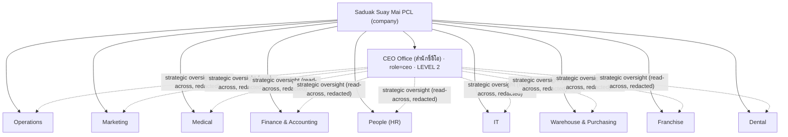

### 1.2 Sub-departments / Teams ของ CEO Office (NEW)

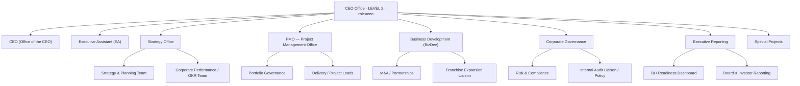

### 1.3 หลักการเข้าถึงข้อมูลของ CEO Office (Access Principles)

1. **Read-across ≠ Read-raw.** CEO/Chief of Staff เห็น cross-department **aggregate/redacted** เป็น default; raw RESTRICTED ของแผนกอื่นต้อง direct grant + reason
2. **Executive content = RESTRICTED by default.** `executive_notes`, board packets, succession, M&A, AI-evaluation ของผู้บริหาร → direct grant only (ไม่ inherit จาก department membership)
3. **EA acts on behalf, never owns.** EA เข้าถึง CEO calendar/inbox/draft ได้ผ่าน **delegation grant** (scoped, มีวันหมดอายุ, log ทุก action ในนาม CEO ด้วย `acting_for`)
4. **Deny-by-default + backend-enforced.** ทุก API + ทุก AI query ตรวจ role/department/position/clearance ที่ backend เท่านั้น

---

## 2. รายชื่อตำแหน่ง (Position Catalog ทั้งแผนก)

> ทุก position ผูกกับ `positions` (NEW rows) + `employee_profiles.position_id`; `clearance` = security level สูงสุดที่ตำแหน่งนั้นเข้าถึงได้ผ่าน role (ยังต้องผ่าน ABAC/ownership)

| # | Position (EN) | ตำแหน่ง (TH) | Sub-unit | system role | Clearance default | หมายเหตุ |
|---|---|---|---|---|---|---|
| 1 | Chief Executive Officer | ประธานเจ้าหน้าที่บริหาร | CEO | `ceo` | RESTRICTED | สูงสุด; owner ของ executive_notes |
| 2 | Chief of Staff | หัวหน้าสำนักซีอีโอ | CEO | `ceo` | RESTRICTED (delegated) | ขยาย/ลด grant แทน CEO ได้ตาม policy |
| 3 | Executive Assistant | เลขานุการบริหาร | EA | `ceo`(scoped) / `staff` | HARD + delegated RESTRICTED on calendar/inbox | acting_for CEO |
| 4 | Head of Strategy | หัวหน้าฝ่ายกลยุทธ์ | Strategy Office | `ceo` | HARD | owner strategic_initiatives |
| 5 | Strategy Analyst | นักวิเคราะห์กลยุทธ์ | Strategy Office | `staff`(dept=CEO Office) | MEDIUM | aggregate data only |
| 6 | Head of Corporate Performance (OKR Lead) | หัวหน้าผลการดำเนินงานองค์กร | Strategy Office | `ceo` | HARD | owner okrs |
| 7 | Head of PMO | หัวหน้า PMO | PMO | `ceo` | HARD | owner portfolio |
| 8 | Portfolio Governance Officer | เจ้าหน้าที่กำกับพอร์ตโครงการ | PMO | `staff`(CEO Office) | MEDIUM | — |
| 9 | Senior Project Manager / Project Lead | ผู้จัดการโครงการอาวุโส | PMO | `staff`(CEO Office) | MEDIUM | per-project owner |
| 10 | Head of Business Development | หัวหน้าพัฒนาธุรกิจ | BizDev | `ceo` | RESTRICTED (M&A) | owner bizdev_pipeline |
| 11 | M&A / Partnerships Manager | ผู้จัดการ M&A/พันธมิตร | BizDev | `staff`(CEO Office) | RESTRICTED (grant) | NDA-gated |
| 12 | Franchise Expansion Liaison | ผู้ประสานงานขยายแฟรนไชส์ | BizDev | `staff`(CEO Office) | MEDIUM | bridge → Franchise dept |
| 13 | Head of Corporate Governance | หัวหน้าธรรมาภิบาลองค์กร | Governance | `ceo` | RESTRICTED | owner governance_register |
| 14 | Risk & Compliance Officer | เจ้าหน้าที่ความเสี่ยง/กำกับ | Governance | `staff`(CEO Office) | HARD | — |
| 15 | Internal Audit Liaison | ผู้ประสานงานตรวจสอบภายใน | Governance | `staff`(CEO Office) | HARD | read audit_log (scoped) |
| 16 | Head of Executive Reporting (BI Lead) | หัวหน้ารายงานผู้บริหาร | Exec Reporting | `ceo` | HARD | owner board_packets/dashboards |
| 17 | BI / Data Analyst (Exec) | นักวิเคราะห์ข้อมูลผู้บริหาร | Exec Reporting | `staff`(CEO Office) | MEDIUM (aggregate) | no raw PII |
| 18 | Special Projects Lead | หัวหน้าโครงการพิเศษ | Special Projects | `ceo` | HARD | per-initiative owner |

> **[ASSUMPTION]** headcount จริงต่อ sub-unit ในคลินิกแฟรนไชส์ขนาดนี้น่าจะ 1–3 คน/sub-unit; CEO Office รวม ~ 8–14 คน

---

## 3. Sub-department: **CEO (Office of the CEO)**

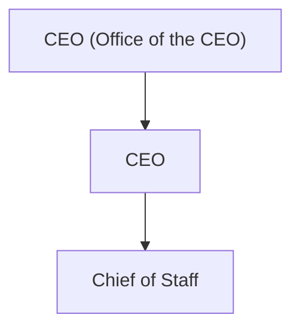

### 3.1 หน้าที่ (Responsibilities)
- กำหนดวิสัยทัศน์ พันธกิจ กลยุทธ์องค์กร และอนุมัติ OKR ระดับองค์กร
- ตัดสินใจขั้นสุดท้าย (final approver) สำหรับงบลงทุน, M&A, การขยายแฟรนไชส์, นโยบายองค์กร, การแต่งตั้งผู้บริหาร
- จด/เก็บ **Executive notes** (บันทึกการตัดสินใจ, ข้อสังเกตเชิงบุคคล, succession) — RESTRICTED
- กำกับ Chief of Staff ให้ขับเคลื่อน CEO Office ทั้งหมด

### 3.2 Workflow หลัก — Strategic Decision (input → process → output → receiver → approver)

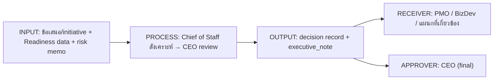

| ขั้น | รายละเอียด |
|---|---|
| Input | strategic_initiative draft, readiness snapshot, board packet, risk memo |
| Process | Chief of Staff รวบรวม → ทำ option analysis → CEO ตัดสิน |
| Output | `decisions_log` row + `executive_notes` (RESTRICTED) + งานส่ง PMO |
| Receiver | PMO (แปลงเป็นโครงการ), BizDev, แผนกเจ้าของงาน |
| Approver | **CEO** (สิ่งที่เกินอำนาจ CEO → Board) |

### 3.3 KPI + แหล่งข้อมูล (Data Source)

| KPI | สูตร/นิยาม | Data Source (table) | ความถี่ |
|---|---|---|---|
| Strategic Initiative Completion % | initiatives done / committed | `strategic_initiatives` | quarterly |
| Org OKR Attainment | avg(key_result.progress) | `okrs`, `key_results` | quarterly |
| Company Readiness Score | aggregated L0–L5 (มีอยู่แล้ว) | `readiness` / entity aggregation (EXISTS) | daily |
| Decision Cycle Time | avg(decided_at − raised_at) | `decisions_log` | monthly |
| EBITDA / Revenue Growth **[ASSUMPTION]** | finance rollup | `transactions` + finance reporting (redacted) | monthly |

### 3.4 Data ของ sub-unit นี้

| Data | ทำอะไร | Security Level | Data Owner | Table |
|---|---|---|---|---|
| Executive notes | บันทึกผู้บริหาร/succession | **RESTRICTED** | CEO | `executive_notes` (NEW) |
| Decisions log | บันทึกการตัดสินใจ | **HARD** (บาง field RESTRICTED) | CEO / Chief of Staff | `decisions_log` (NEW) |
| Org OKR (top) | OKR ระดับองค์กร | **HARD** | CEO / OKR Lead | `okrs` (NEW) |
| Strategy planning doc | EXISTS ใน taxonomy ('T1') | **HARD** | CEO | `documents` + `knowledge_items` |

**Data Used (อ่าน):** readiness (aggregate), finance summary (redacted), HR succession (RESTRICTED grant), franchise audits, cross-dept KPIs (aggregate)

### 3.5 Approval Flow
- งบ/นโยบาย ≤ threshold องค์กร → CEO อนุมัติเอง
- เกิน threshold / M&A / share issuance → **CEO เสนอ → Board อนุมัติ** (Board เป็น external approver, บันทึกใน `decisions_log` + board minutes)
- การแต่งตั้งผู้บริหาร → CEO + HR Chief co-sign (RESTRICTED)

### 3.6 Audit Log events ที่ต้อง capture
`login`, `logout`, `view executive_note`, `create/update executive_note`, `view decisions_log`, `create decision`, `approve/reject` (initiative/budget/appointment), `grant/revoke permission` (delegation ให้ EA/Chief of Staff), `ai_query` (executive), `failed_access`, `blocked_access`, `export board_packet`, `impersonation start/stop` — ทุก event บันทึก `target_security_level=RESTRICTED` เมื่อ target เป็น executive content

---

## 4. Sub-department: **Executive Assistant (EA)**

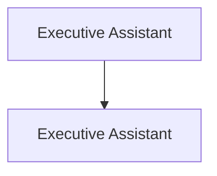

### 4.1 หน้าที่
- จัดการปฏิทิน, การประชุม, การเดินทาง, inbox ของ CEO (ในนาม CEO ผ่าน delegation)
- จัดเตรียม briefing packet ก่อนประชุม; จดบันทึก action items; ติดตามงานค้าง
- **ไม่ใช่เจ้าของข้อมูล** — เป็น delegate; ทุก action ในนาม CEO ต้องมี `acting_for_user_id`

### 4.2 Workflow — Meeting & Action-Item Lifecycle

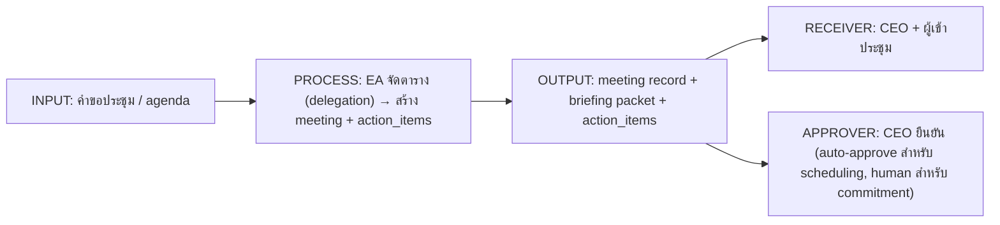

### 4.3 KPI + Data Source

| KPI | นิยาม | Data Source | ความถี่ |
|---|---|---|---|
| Meeting prep on-time % | packets ready ก่อน T-24h | `meetings`, `documents` | weekly |
| Action-item closure rate | closed / total | `action_items` (EXISTS) | weekly |
| CEO calendar conflict rate | conflicts / scheduled | `meetings` | monthly |
| Inbox SLA **[ASSUMPTION]** | % response ≤ 24h | mailbox integration (NEW) | weekly |

### 4.4 Data

| Data | Security Level | Owner | Table |
|---|---|---|---|
| CEO calendar/meetings | **HARD** (delegated) | CEO (EA = delegate) | `meetings` (EXISTS) |
| Action items | **MEDIUM/HARD** | CEO | `action_items` (EXISTS) |
| Briefing packets | **HARD/RESTRICTED** (ถ้ามี exec note) | CEO | `documents` (EXISTS) |
| Delegation grant | **RESTRICTED** | CEO / Chief of Staff | `permission_groups`/`user_permission_groups` + `delegations` (NEW) |

**Data Used:** ทุกอย่างที่ CEO มอบหมาย (scoped, expiring delegation)

### 4.5 Approval Flow
- Scheduling/admin → **auto** (decision right = auto) แต่ทุก action log `acting_for`
- การ commit แทน CEO (อนุมัติงบ/ตอบ commitment) → **ห้าม**; ต้อง escalate ให้ CEO เป็น human-decision
- Delegation grant ออก/หมดอายุ → CEO หรือ Chief of Staff อนุมัติ + `permission-change` audit

### 4.6 Audit events
`login/logout`, `view/create/update meeting (acting_for)`, `create/update/close action_item`, `view executive material (delegated)`, `download/export packet`, `delegation granted/revoked/expired`, `failed_access`, `blocked_access`, `acting_for begin/end` — ทุก delegated action ต้องมี `acting_for_user_id` + `request_id`

---

## 5. Sub-department: **Strategy Office**

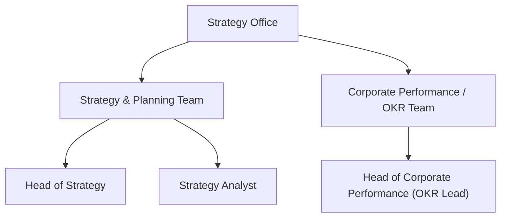

### 5.1 หน้าที่
- จัดทำแผนกลยุทธ์ 1–3 ปี, แผนประจำปี, market/competitive analysis (คลินิกความงาม+ทันตกรรม)
- ออกแบบ/ดูแล **OKR cascade** ทั้งองค์กร และ Corporate Performance Review
- แปลงทิศทาง CEO เป็น strategic_initiatives ส่งต่อ PMO

### 5.2 Workflow — Annual Strategy & OKR Cycle

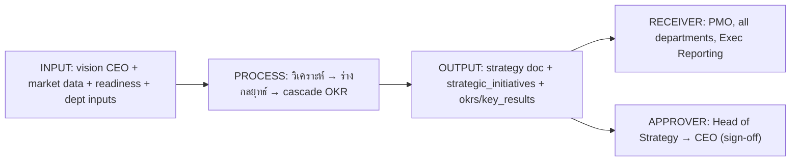

### 5.3 KPI + Data Source

| KPI | นิยาม | Data Source | ความถี่ |
|---|---|---|---|
| OKR coverage | % depts with aligned OKRs | `okrs` (NEW) | quarterly |
| Plan-to-initiative conversion | initiatives created / strategy items | `strategic_initiatives` (NEW) | quarterly |
| Forecast accuracy **[ASSUMPTION]** | 1 − |actual−forecast|/forecast | `kpi_entries` (EXISTS) + finance | quarterly |
| Strategy review cadence adherence | reviews on schedule | `okrs`, calendar | quarterly |

### 5.4 Data

| Data | Security Level | Owner | Table |
|---|---|---|---|
| Strategy planning docs | **HARD** | Head of Strategy | `documents`/`knowledge_items` (EXISTS) |
| OKRs / Key Results | **HARD** (top-org), **MEDIUM** (dept-published) | OKR Lead | `okrs`, `key_results` (NEW) |
| Strategic initiatives | **HARD** | Head of Strategy | `strategic_initiatives` (NEW) |
| Market/competitive analysis | **MEDIUM/HARD** | Strategy Analyst | `knowledge_items` (EXISTS) |

**Data Used:** readiness (aggregate, EXISTS), cross-dept KPI (`kpi_entries`, aggregate), finance summary (redacted), franchise performance (aggregate)

### 5.5 Approval Flow
Analyst draft → Head of Strategy review → **CEO sign-off** (strategy/top OKR) → publish (MEDIUM) ให้แผนก. การแก้ top OKR หลัง sign-off → CEO approve + version bump + audit

### 5.6 Audit events
`view/create/update/delete strategy doc`, `create/update okr/key_result`, `publish okr (security downgrade HARD→MEDIUM)`, `create strategic_initiative`, `export`, `ai_query (strategy)`, `failed_access`, `version change` — capture before/after JSON ของ okr progress และ security_level change

---

## 6. Sub-department: **PMO (Project Management Office)**

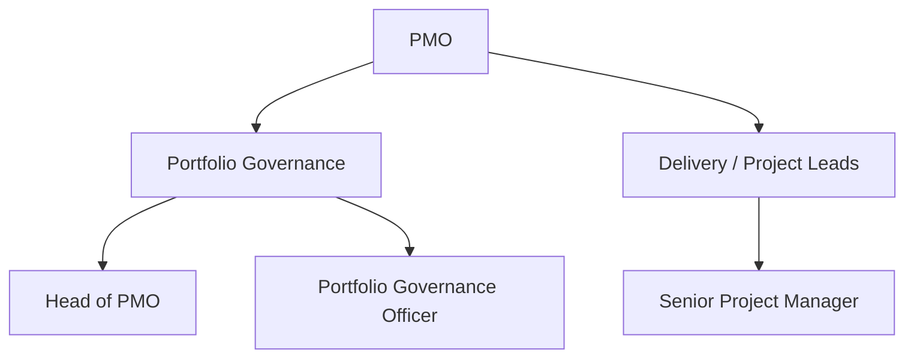

### 6.1 หน้าที่
- บริหาร portfolio โครงการเชิงกลยุทธ์ (stage-gate, prioritization, resource/budget tracking)
- กำหนดมาตรฐาน project (charter, RAID log, status reporting) และ governance ของ delivery
- รายงานสถานะ portfolio ให้ CEO/Exec Reporting

### 6.2 Workflow — Stage-Gate Project Governance

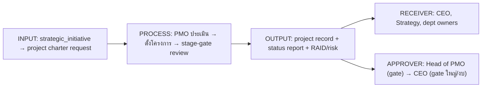

### 6.3 KPI + Data Source

| KPI | นิยาม | Data Source | ความถี่ |
|---|---|---|---|
| On-time delivery % | milestones on time | `projects`/`tasks` (EXISTS `tasks`) | monthly |
| On-budget % | actual ≤ budget | `projects` (NEW) + `transactions` | monthly |
| Portfolio health (R/A/G) | weighted status | `projects` (NEW) | weekly |
| Gate pass rate | gates passed first time | `project_gates` (NEW) | monthly |
| Resource utilization | from `user_capacity` (EXISTS) | `user_capacity` | weekly |

### 6.4 Data

| Data | Security Level | Owner | Table |
|---|---|---|---|
| Project portfolio | **MEDIUM** (HARD ถ้าผูก M&A) | Head of PMO | `projects` (NEW) |
| Project status/RAID | **MEDIUM** | Project Lead (per-project owner) | `project_status`, `project_risks` (NEW) |
| Budget vs actual | **HARD** | Head of PMO | `projects` + `transactions` (EXISTS) |
| Tasks | **BASIC/MEDIUM** | task owner | `tasks`, `task_assignments` (EXISTS) |

**Data Used:** strategic_initiatives, okrs, user_capacity, finance budget (scoped)

### 6.5 Approval Flow
Project charter → Head of PMO approve (gate-0) → CEO approve ถ้างบเกิน threshold. Stage-gate ผ่านแต่ละ gate ต้อง Head of PMO sign; gate ปิดโครงการ/เปลี่ยน scope ใหญ่ → CEO. Budget change → Finance + PMO co-approve

### 6.6 Audit events
`create/update project`, `gate pass/fail`, `assign/unassign task`, `update status (before/after R-A-G)`, `budget change (before/after)`, `close/cancel project (soft-delete)`, `restore`, `export portfolio report`, `failed_access`

---

## 7. Sub-department: **Business Development (BizDev)**

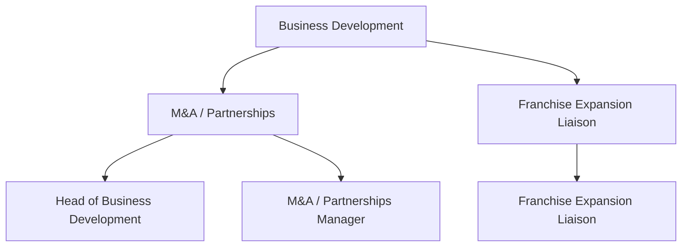

### 7.1 หน้าที่
- หาและประเมินโอกาสเติบโต: สาขาใหม่, แฟรนไชส์ใหม่, partnership, M&A, บริการใหม่ (ความงาม/ทันตกรรม)
- ทำ deal pipeline, due diligence, valuation, term negotiation (ภายใต้ NDA)
- ประสานกับ Franchise dept สำหรับการขยายสาขา

### 7.2 Workflow — Deal / Partnership Pipeline

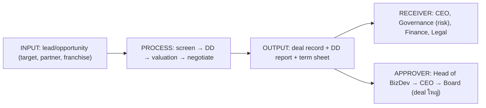

### 7.3 KPI + Data Source

| KPI | นิยาม | Data Source | ความถี่ |
|---|---|---|---|
| Pipeline value | sum(open deal value) | `bizdev_pipeline` (NEW) / `deals` (EXISTS) | monthly |
| Deals closed | won/quarter | `bizdev_pipeline`/`deals` | quarterly |
| New franchise signed | count | `bizdev_pipeline` + Franchise dept | quarterly |
| DD cycle time | avg days screen→close | `bizdev_pipeline` | quarterly |

### 7.4 Data

| Data | Security Level | Owner | Table |
|---|---|---|---|
| Deal pipeline (M&A) | **RESTRICTED** (NDA, direct grant) | Head of BizDev | `bizdev_pipeline` (NEW) |
| General deals/partnerships | **HARD** | Head of BizDev | `deals` (EXISTS) |
| DD reports / valuation | **RESTRICTED** | M&A Manager | `documents` + `bizdev_pipeline` |
| Franchise expansion plan | **MEDIUM/HARD** | Expansion Liaison | shared w/ `franchise_audits` (EXISTS) |

**Data Used:** finance (valuation inputs, redacted), franchise audits, market analysis (Strategy)

### 7.5 Approval Flow
Lead → Head of BizDev qualify. Term sheet/LOI → CEO approve. **Definitive M&A / acquisition / equity** → CEO + Board (RESTRICTED, NDA-signed access list). ทุก access ต้องอยู่ใน NDA grant list — เพิ่ม/ลบคนใน list = `permission-change` audit

### 7.6 Audit events
`view/create/update deal`, `view bizdev_pipeline (RESTRICTED)`, `grant/revoke NDA access`, `upload DD document`, `download/export (RESTRICTED — เฝ้าระวังพิเศษ)`, `approve/reject deal stage`, `failed_access`, `blocked_access` — RESTRICTED export ของ BizDev ต้อง trigger alert ไป Governance

---

## 8. Sub-department: **Corporate Governance**

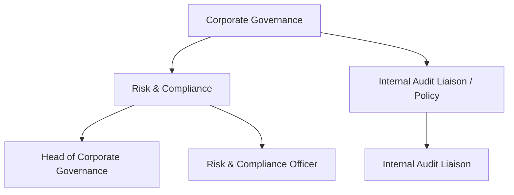

### 8.1 หน้าที่
- ดูแล governance framework, นโยบายองค์กร, delegation of authority, risk register
- กำกับ compliance: PDPA (สำคัญมากเพราะมี patient data + payroll), license คลินิก, ข้อกำหนดแฟรนไชส์ **[ASSUMPTION: ภายใต้ พ.ร.บ.สถานพยาบาล + PDPA ของไทย]**
- เป็น liaison กับ Internal Audit; ทบทวน audit_log เชิง governance; ดูแล policy lifecycle

### 8.2 Workflow — Risk & Compliance Management

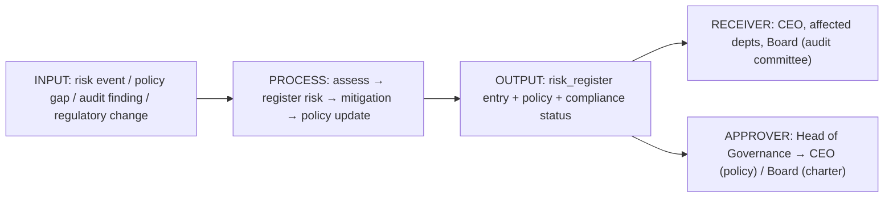

### 8.3 KPI + Data Source

| KPI | นิยาม | Data Source | ความถี่ |
|---|---|---|---|
| Open high-risk items | count(severity=high, open) | `governance_register` (NEW) | monthly |
| Policy coverage/freshness | % policies reviewed in cycle | `policies` (NEW) | quarterly |
| Compliance findings closed | closed / total | `governance_register` | monthly |
| Audit anomaly rate | flagged audit events | `audit_log` (EXISTS, scoped read) | monthly |

### 8.4 Data

| Data | Security Level | Owner | Table |
|---|---|---|---|
| Risk register | **HARD** (RESTRICTED ถ้าระบุบุคคล/legal) | Head of Governance | `governance_register` (NEW) |
| Policies / DoA matrix | **MEDIUM** (published), **HARD** (draft) | Head of Governance | `policies` (NEW) |
| Compliance evidence | **HARD** | Risk & Compliance Officer | `documents` |
| Audit log (read) | **RESTRICTED** | (read-only liaison) | `audit_log` (EXISTS) |

**Data Used:** audit_log (scoped read), HR investigation status (RESTRICTED grant), franchise_audits, all-dept policy adherence

### 8.5 Approval Flow
Risk logged → Risk Officer assess → Head of Governance approve mitigation. Policy ใหม่/แก้ → Head of Governance → **CEO approve → publish**. Governance charter/DoA matrix → Board. การเข้าถึง audit_log = read-only, ห้าม update/delete (DB-enforced append-only)

### 8.6 Audit events
`create/update risk`, `create/update/publish policy (version)`, `view audit_log (who-watches-the-watcher → ต้อง log การอ่าน audit เอง)`, `grant access to HR investigation`, `approve/reject policy`, `failed_access`, `blocked_access` — **การอ่าน audit_log โดย Governance ต้องถูก audit ด้วย** (meta-audit)

---

## 9. Sub-department: **Executive Reporting**

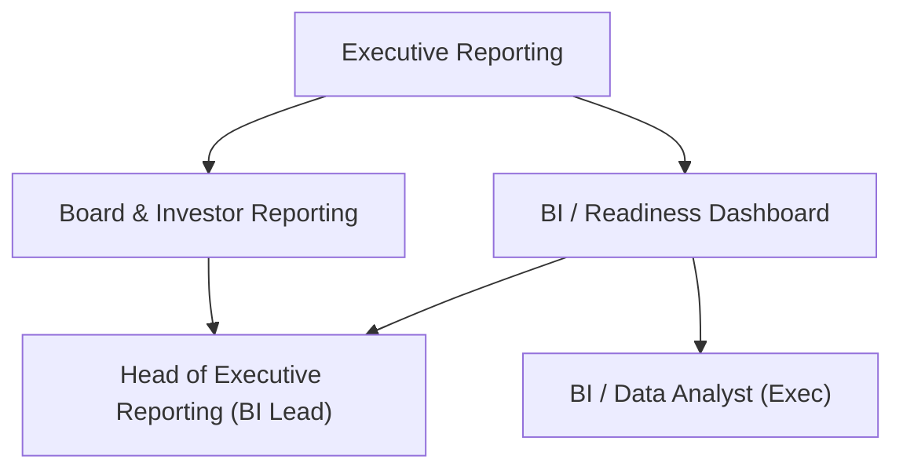

### 9.1 หน้าที่
- รวบรวม cross-department data → dashboard ผู้บริหาร + **Readiness score** (EXISTS, daily, CEO viewer)
- จัดทำ board packet, investor report, monthly business review (MBR)
- รับประกัน "single source of truth" และ **redaction** ก่อนแสดงต่อผู้บริหาร (no raw PII/patient/salary)

### 9.2 Workflow — Reporting & Board Packet Build

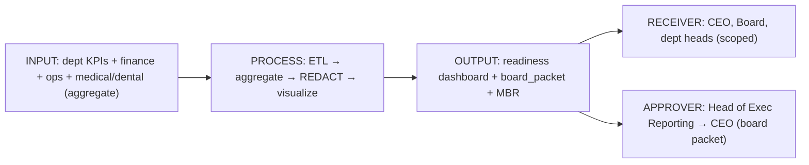

### 9.3 KPI + Data Source

| KPI | นิยาม | Data Source | ความถี่ |
|---|---|---|---|
| Readiness score | aggregated L0–L5 (EXISTS) | `readiness`/entity rollup | daily |
| Report on-time delivery | packets delivered on schedule | `board_packets` (NEW) | monthly |
| Data freshness/latency | max data age in dashboard | `kpi_entries`, `request_metrics` | daily |
| Redaction compliance | % reports passing redaction gate | `ai_query_logs`/report gate (NEW) | monthly |

### 9.4 Data

| Data | Security Level | Owner | Table |
|---|---|---|---|
| Readiness dashboard | **HARD** (CEO/exec) | BI Lead | `readiness`/entity rollup (EXISTS) |
| Board packet | **RESTRICTED** | Head of Exec Reporting | `board_packets` (NEW) |
| KPI aggregates | **MEDIUM** | BI Analyst | `kpi_entries` (EXISTS) |
| Investor report | **RESTRICTED** | Head of Exec Reporting | `board_packets`/`documents` |

**Data Used:** **aggregate/redacted ของทุกแผนก** — Medical/Dental/Patient → นับ/สถิติเท่านั้น (ห้าม raw PHI); Payroll → total/band เท่านั้น (ห้าม per-person salary); ใช้ผ่าน view/function ที่ redact ที่ backend

### 9.5 Approval Flow
Analyst build (aggregate, redaction gate บังคับ) → BI Lead QA → **CEO approve board packet** → distribute (RESTRICTED list). การเพิ่ม field ที่ลด aggregation (drill จาก aggregate → raw) ต้อง direct grant + reason + audit

### 9.6 Audit events
`generate/refresh dashboard`, `build/export board_packet (RESTRICTED export)`, `view report`, `redaction gate pass/fail`, `drill-down to raw (privileged — flag)`, `download/print`, `distribute (recipient list logged)`, `failed_access` — ทุกการ export RESTRICTED report บันทึก recipient + watermark id

---

## 10. Sub-department: **Special Projects**

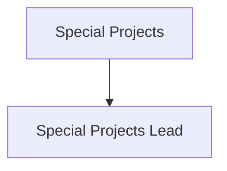

### 10.1 หน้าที่
- ดำเนินงานพิเศษตามคำสั่ง CEO ที่ข้ามแผนก/เป็นความลับ (transformation, new business line, crisis, confidential initiative)
- ตั้งทีมเฉพาะกิจ (cross-functional), จัด governance ชั่วคราว, รายงานตรงต่อ CEO

### 10.2 Workflow — Confidential Initiative

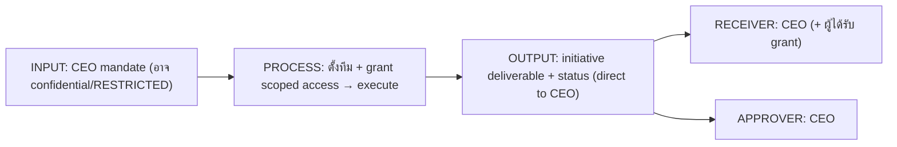

### 10.3 KPI + Data Source

| KPI | นิยาม | Data Source | ความถี่ |
|---|---|---|---|
| Initiative milestone completion | done / planned | `strategic_initiatives`/`projects` (NEW) | per-initiative |
| Time-to-mandate-delivery | actual vs target | `strategic_initiatives` | per-initiative |
| Confidentiality integrity | 0 unauthorized access | `audit_log` (EXISTS) | continuous |

### 10.4 Data

| Data | Security Level | Owner | Table |
|---|---|---|---|
| Special project workspace | **RESTRICTED** (direct grant per-initiative) | Special Projects Lead | `strategic_initiatives`/`projects` + `documents` |
| Confidential deliverables | **RESTRICTED** | CEO / Lead | `documents`, `executive_notes` |

**Data Used:** ตามที่ CEO grant per-initiative (scoped, expiring)

### 10.5 Approval Flow
CEO mandate → CEO grant scoped RESTRICTED access ให้ทีม (expiring) → Lead execute → CEO approve deliverable. การ grant access เข้า workspace = direct grant only + reason + audit; ปิดโครงการ → revoke ทุก grant อัตโนมัติ

### 10.6 Audit events
`grant/revoke scoped access (per member)`, `view/create/update confidential deliverable`, `access expired auto-revoke`, `export (RESTRICTED — alert)`, `failed_access`, `blocked_access` — confidentiality breach attempts → real-time alert ไป CEO + Governance

---

## 11. Permission Model (RBAC + ABAC + Ownership) สำหรับ CEO Office

### 11.1 Matrix (deny-by-default)

| Resource / data | role `ceo` | Chief of Staff | EA (delegate) | Strategy/PMO/BizDev staff (dept=CEO Office) | role อื่น (แผนกอื่น) |
|---|---|---|---|---|---|
| executive_notes | CRUD (owner) | R (+grant) | R เฉพาะที่ delegate | ✗ | ✗ |
| decisions_log | CRUD | RU | R (acting_for) | R (own initiative) | ✗ |
| okrs (top, HARD) | CRUD | CRUD | R | R/U (own) | R (published MEDIUM เท่านั้น) |
| projects/portfolio | R | R | R | CRUD (own) | R (own dept project) |
| bizdev_pipeline (RESTRICTED) | R | R (+grant) | ✗ | R เฉพาะ NDA-grant | ✗ |
| governance_register | R | R | ✗ | R/U (Governance staff) | ✗ |
| board_packets (RESTRICTED) | R | R | R (delegate) | CR (Exec Reporting) | ✗ |
| cross-dept raw RESTRICTED (patient/salary/HR-invest) | **redacted/aggregate** เท่านั้น; raw = direct grant + reason | เช่นเดียวกับ CEO | ✗ | ✗ | ✗ (เห็นเฉพาะของตน) |
| audit_log | R (scoped) | R | ✗ | R (Governance/IA liaison เท่านั้น) | per role (`audit` module = admin/ceo/it/hr) |

> **ABAC rules:** (1) `record.company_id = user.company_id` (tenant) (2) `record.security_level <= user.effective_clearance` (3) RESTRICTED → ต้องมี `grant(user_id, resource_id)` ใน `data_ownership`/`resource_grants` (4) delegated action → `acting_for_user_id` set + grant ยังไม่ expired
> **Ownership:** ใช้ `data_ownership(resource_type, resource_id, owner_user_id)` (NEW) — owner CRUD; others ตาม grant. เลิกพึ่ง free-text `users.department` compare

### 11.2 Enforcement
- Backend middleware `requireModule('ceo'|'reports'|'org')` (EXISTS) + **NEW** `requirePolicy(resource, action)` policy engine ที่รวม RBAC+ABAC+ownership ก่อนทุก handler
- ทุก query ต้องมี `company_id = $1` + `deleted_at IS NULL` + clearance/grant check; raw cross-dept ผ่าน redaction view เท่านั้น

---

## 12. AI Access Control สำหรับ CEO Office

CEO Office เป็น tier ที่ AI สามารถถูกถามคำถามที่ "กว้างที่สุดทั้งองค์กร" จึงต้องคุมเข้มที่สุด — **AI ไม่อ่าน DB ตรง**:

```mermaid
flowchart LR
  Q["CEO/Chief of Staff query"] --> ID["identify user + role=ceo + clearance"]
  ID --> POL["policy filter: เลือกเฉพาะ record ที่ user เห็น (clearance+grant+tenant)"]
  POL --> RED["redact: ตัด patient PHI / per-person salary / HR-invest detail → เหลือ aggregate"]
  RED --> CTX["build allowed context (redacted)"]
  CTX --> M["model (askWithFallback)"]
  M --> OUT["output redaction re-check"]
  OUT --> LOG["ai_query_logs + audit (request_id linked)"]
  LOG --> A["answer ≤ ที่ user เห็นได้เท่านั้น"]
```

- AI ตอบ CEO **ไม่เกิน** สิ่งที่ CEO ดูได้ในระบบ (เช่น ถ้าถาม "เงินเดือนหมอ X" → ปฏิเสธ/ตอบ band เว้นแต่มี grant)
- **Redaction บังคับก่อนส่ง prompt** ออก external provider (OpenAI/Claude/Gemini/Typhoon) — ปัจจุบันยังไม่มี (gap) → NEW
- `ai_query_logs` (NEW): prompt, response, provider, model, tokens, latency, decision (`auto/suggest/human`), grounded flag, redaction status, request_id ↔ audit_log
- Decision rights สำหรับ executive query = **`suggest`/`human`** (ไม่ auto) — "Copilot not Autopilot"

---

## 13. Data Model (NEW migrations) — ตัวอย่าง DDL

> ทุกตารางมี base columns ตามมาตรฐาน: `id, company_id, created_at, updated_at, deleted_at, created_by, updated_by, deleted_by, is_active, version, security_level` + FK/UNIQUE/CHECK/composite index

```sql
-- executive_notes : RESTRICTED by default (direct grant only)
CREATE TABLE executive_notes (
  id            TEXT PRIMARY KEY,
  company_id    TEXT NOT NULL REFERENCES companies(id),
  author_id     TEXT NOT NULL REFERENCES users(id),
  subject_type  TEXT,                       -- 'person'|'decision'|'succession'|'board'
  subject_id    TEXT,
  title         TEXT NOT NULL,
  body          TEXT NOT NULL,              -- encrypted at rest
  security_level TEXT NOT NULL DEFAULT 'RESTRICTED'
                 CHECK (security_level IN ('BASIC','MEDIUM','HARD','RESTRICTED')),
  created_at    TIMESTAMPTZ NOT NULL DEFAULT now(),
  updated_at    TIMESTAMPTZ NOT NULL DEFAULT now(),
  deleted_at    TIMESTAMPTZ,
  created_by    TEXT NOT NULL,
  updated_by    TEXT,
  deleted_by    TEXT,
  is_active     BOOLEAN NOT NULL DEFAULT true,
  version       INTEGER NOT NULL DEFAULT 1
);
CREATE INDEX ix_exec_notes_co_active ON executive_notes(company_id) WHERE deleted_at IS NULL;
CREATE INDEX ix_exec_notes_subject   ON executive_notes(company_id, subject_type, subject_id);

-- decisions_log
CREATE TABLE decisions_log (
  id TEXT PRIMARY KEY, company_id TEXT NOT NULL REFERENCES companies(id),
  title TEXT NOT NULL, context TEXT, decision TEXT NOT NULL,
  raised_at TIMESTAMPTZ, decided_at TIMESTAMPTZ,
  decided_by TEXT REFERENCES users(id), approver_id TEXT REFERENCES users(id),
  status TEXT CHECK (status IN ('raised','decided','deferred','rejected')),
  security_level TEXT NOT NULL DEFAULT 'HARD'
    CHECK (security_level IN ('BASIC','MEDIUM','HARD','RESTRICTED')),
  created_at TIMESTAMPTZ NOT NULL DEFAULT now(), updated_at TIMESTAMPTZ NOT NULL DEFAULT now(),
  deleted_at TIMESTAMPTZ, created_by TEXT, updated_by TEXT, deleted_by TEXT,
  is_active BOOLEAN NOT NULL DEFAULT true, version INTEGER NOT NULL DEFAULT 1
);

-- okrs + key_results (cascade)
CREATE TABLE okrs (
  id TEXT PRIMARY KEY, company_id TEXT NOT NULL REFERENCES companies(id),
  org_unit_id TEXT REFERENCES org_units(id), period TEXT NOT NULL, objective TEXT NOT NULL,
  owner_id TEXT REFERENCES users(id),
  security_level TEXT NOT NULL DEFAULT 'HARD'
    CHECK (security_level IN ('BASIC','MEDIUM','HARD','RESTRICTED')),
  created_at TIMESTAMPTZ NOT NULL DEFAULT now(), updated_at TIMESTAMPTZ NOT NULL DEFAULT now(),
  deleted_at TIMESTAMPTZ, created_by TEXT, updated_by TEXT, deleted_by TEXT,
  is_active BOOLEAN NOT NULL DEFAULT true, version INTEGER NOT NULL DEFAULT 1,
  UNIQUE (company_id, org_unit_id, period, objective)
);
CREATE TABLE key_results (
  id TEXT PRIMARY KEY, company_id TEXT NOT NULL REFERENCES companies(id),
  okr_id TEXT NOT NULL REFERENCES okrs(id), description TEXT NOT NULL,
  target NUMERIC, current_value NUMERIC, progress NUMERIC,
  created_at TIMESTAMPTZ NOT NULL DEFAULT now(), updated_at TIMESTAMPTZ NOT NULL DEFAULT now(),
  deleted_at TIMESTAMPTZ, created_by TEXT, updated_by TEXT, deleted_by TEXT,
  is_active BOOLEAN NOT NULL DEFAULT true, version INTEGER NOT NULL DEFAULT 1
);

-- strategic_initiatives, projects, project_gates, bizdev_pipeline,
-- governance_register, policies, board_packets : ตามแม่แบบเดียวกัน (base columns + CHECK security_level + FK company_id)

-- data_ownership / resource_grants (ABAC core, NEW)
CREATE TABLE resource_grants (
  id TEXT PRIMARY KEY, company_id TEXT NOT NULL REFERENCES companies(id),
  resource_type TEXT NOT NULL, resource_id TEXT NOT NULL,
  grantee_user_id TEXT NOT NULL REFERENCES users(id),
  grant_kind TEXT NOT NULL CHECK (grant_kind IN ('read','write','owner','delegate')),
  reason TEXT, expires_at TIMESTAMPTZ,
  granted_by TEXT NOT NULL, created_at TIMESTAMPTZ NOT NULL DEFAULT now(),
  revoked_at TIMESTAMPTZ, revoked_by TEXT,
  UNIQUE (company_id, resource_type, resource_id, grantee_user_id, grant_kind)
);
CREATE INDEX ix_grants_lookup ON resource_grants(company_id, resource_type, resource_id, grantee_user_id) WHERE revoked_at IS NULL;
```

---

## 14. Audit Log — events รวมของ CEO Office (mapping)

ใช้ **append-only audit (central spec)**: ทุก record มี `actor_id, actor_role, action, target_table, target_id, target_security_level, before_json, after_json, changed_fields, ip, device, user_agent, request_id, session_id, endpoint, http_method, result, failure_reason, acting_for_user_id, prev_hash, created_at` — immutable (revoke UPDATE/DELETE + hash-chain). AI logs แยกตาราง (`ai_query_logs`) แต่ link ด้วย `request_id`.

| หมวด event | ตัวอย่าง action | target_security_level |
|---|---|---|
| Auth | `login`, `logout`, `failed_login`, `impersonation_start/stop` | per session |
| Executive content | `view/create/update/delete executive_note`, `restore` | RESTRICTED |
| Decisions/Strategy | `create decision`, `approve/reject`, `create/update/publish okr` | HARD/RESTRICTED |
| PMO | `create project`, `gate pass/fail`, `budget change`, `soft-delete project` | MEDIUM/HARD |
| BizDev | `view bizdev_pipeline`, `grant/revoke NDA`, `export DD` | RESTRICTED |
| Governance | `create policy`, `view audit_log` (meta-audit), `grant HR-invest access` | HARD/RESTRICTED |
| Exec Reporting | `build/export board_packet`, `redaction gate pass/fail`, `drill-to-raw` | RESTRICTED |
| Special Projects | `grant/revoke scoped access`, `export confidential` | RESTRICTED |
| Permission | `permission-change`, `role-change`, `delegation grant/revoke/expire` | RESTRICTED |
| Data ops | `view/search/create/update/delete/soft-delete/restore/upload/download/export` | inherit target |
| Access control | `failed_access`, `blocked_access` (deny-by-default hit) | inherit target |
| AI | `ai_query`, `ai_response` (→ `ai_query_logs`, request_id-linked) | inherit allowed-context level |

> **กฎพิเศษ CEO Office:** (1) ทุก **RESTRICTED export** ออก alert ไป Governance + ฝัง watermark/recipient (2) **การอ่าน audit_log เอง** (โดย Governance/IA) ต้องถูก audit (who-watches-the-watcher) (3) ทุก delegated/impersonated action ต้องมี `acting_for_user_id` (4) executive_note ทุก mutation เก็บ before/after JSON เต็ม

---

## 15. สรุป Migration Checklist (NEW)

1. เพิ่ม `subUnits[]` ของ CEO Office ใน `DEPARTMENT_DEFINITIONS` (8 sub-units) + seed `org_units` level-3/4
2. เพิ่ม `positions` rows เฉพาะ (18 positions ในข้อ 2) + ผูก `employee_profiles.position_id`
3. สร้างตาราง NEW: `executive_notes`, `decisions_log`, `okrs`, `key_results`, `strategic_initiatives`, `projects`, `project_gates`, `bizdev_pipeline`, `governance_register`, `policies`, `board_packets`, `delegations`, `resource_grants/data_ownership`
4. wire `org_units`/`departments` เข้า policy engine (`requirePolicy`) — เลิกพึ่ง free-text `users.department`
5. เปิด append-only audit (before/after + ip/ua/request_id/session_id + hash-chain + revoke UPDATE/DELETE) ครอบ CEO Office resources
6. สร้าง `ai_query_logs` + redaction gate ใน AI path สำหรับ executive queries (decision right = suggest/human)
7. redaction views/functions สำหรับ cross-dept aggregate (patient/salary/HR-invest → masked) ให้ Exec Reporting/CEO ใช้

> **ยึดหลัก:** Executive notes/Board/M&A/AI-evaluation = **RESTRICTED by default · direct grant only · backend-enforced · fully audited**
