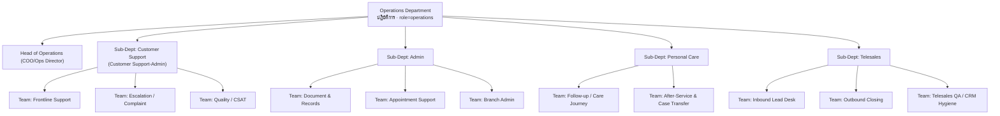
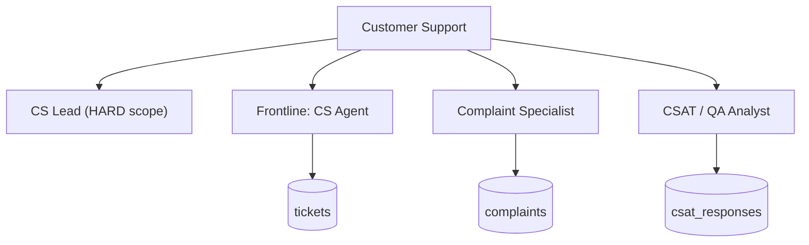
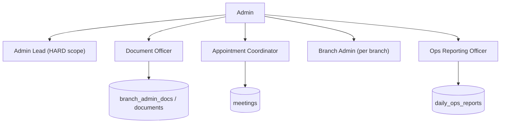
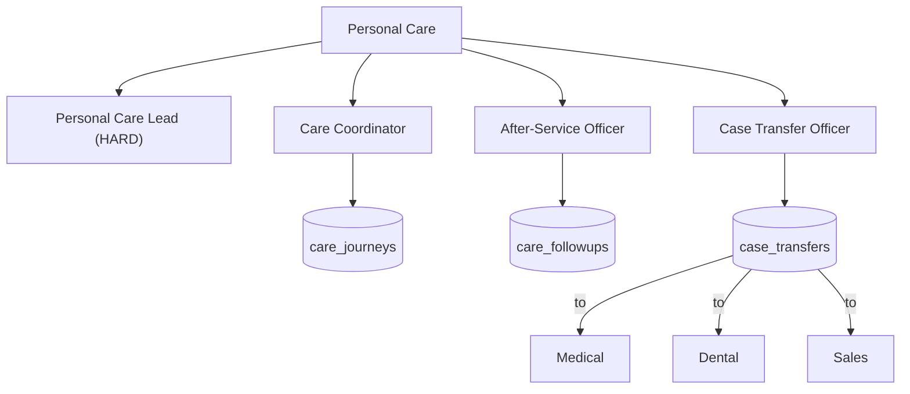
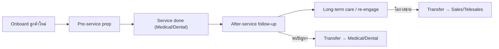
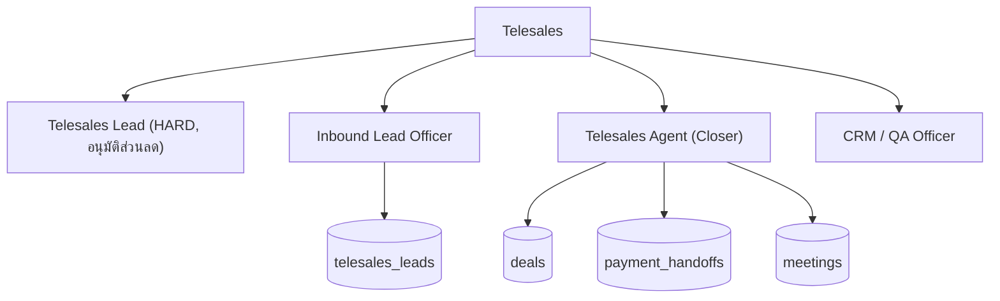
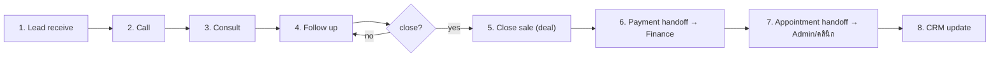
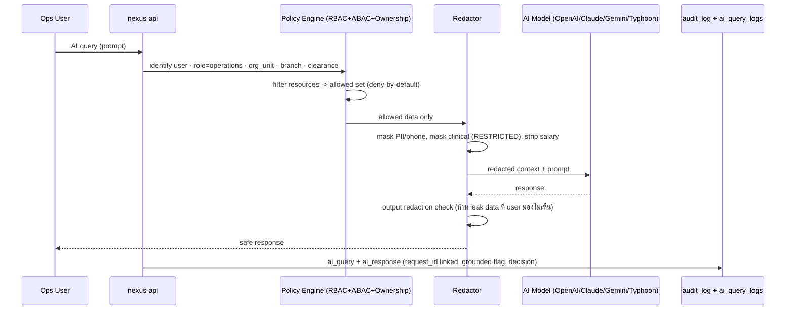

# Department Breakdown — Operations Department (ปฏิบัติการ)

> เอกสารสถาปัตยกรรมระดับ Production สำหรับ **Saduak Suay Mai PCL** — AI Workforce OS บน **NEXUS OS**
> ขอบเขต: แผนก **Operations** และทุก Sub-Department / Team / Position
> รูปแบบ: ภาษาไทยเชิงบรรยาย + ศัพท์เทคนิค/identifier เป็นภาษาอังกฤษ
> หลักการบังคับ: RBAC + ABAC + Data-Ownership, **deny-by-default**, enforce ที่ **Backend** ทุก API และทุก **AI query**, Audit Log แบบ **append-only**

---

## 0. Grounding กับ NEXUS OS ที่มีอยู่ (Current-State Mapping)

แผนก Operations ถูกนิยามไว้แล้วใน codebase ปัจจุบัน — เป็นฐานที่เราต่อยอด (ไม่ใช่สร้างใหม่ทั้งหมด):

| สิ่งที่อ้างถึง | สถานะใน NEXUS OS | ที่อยู่ | หมายเหตุ |
|---|---|---|---|
| Department `Operations` → system role `operations` | **EXISTS** | `backend/src/lib/departments.ts` `DEPARTMENT_DEFINITIONS` | label_th = "ปฏิบัติการ" |
| Sub-units: `Customer Support-Admin`, `Personal Care`, `Telesales` | **EXISTS (data only)** | `departments.ts` `subUnits` | seed ผ่าน `hr-init.ts` เป็น `org_units` level-3 |
| 1 แผนก = 1 system role | **EXISTS** | `getSystemRoleForDepartment()` | Operations = role เดียวสำหรับ 3 sub-unit |
| `departmentScope(user)` | **EXISTS (ad-hoc)** | `departments.ts` | admin/hr เห็นทั้ง org, อื่น ๆ เห็นเฉพาะ `users.department` (string) |
| `canReviewWorkLog()` | **EXISTS (narrow)** | `departments.ts` | same-department + not-self |
| ตาราง `org_units`, `positions`, `employee_profiles` | **EXISTS** | `nexus-hr-schema.ts` | ยังไม่ wire เข้า RBAC/ABAC |
| `tasks`, `task_assignments`, `daily_ai_tasks`, `work_logs` | **EXISTS** | core / `nexus-ai-schema.ts` / `nexus-schema.ts` | ใช้เป็นฐาน workflow |
| `deals`, `transactions`, `meetings`, `patients` | **EXISTS** | core / `nexus-full-schema.ts` | Telesales/Personal Care อ้างอิง |
| `audit_log` | **EXISTS (gap)** | `nexus-schema.ts` | ยังไม่มี before/after, ip, request_id, append-only enforce |
| `ai_logs` / `ai-router.ts` | **EXISTS (gap)** | core / `lib/ai-router.ts` | ยังไม่มี redaction, ไม่มี per-table AI policy |

> **ข้อจำกัดที่ต้องปิด (NEW migrations) เพื่อให้แผนกนี้ production-ready:** ตาราง operational ใหม่ (`tickets`, `complaints`, `care_journeys`, `telesales_leads`, `branch_admin_docs`, `daily_ops_reports` ฯลฯ) พร้อมคอลัมน์มาตรฐานเต็มชุด (`security_level`, soft-delete, version, ownership), การ wire `org_units` เข้า ABAC, และ `data_ownership` model ต่อ resource. ทุกตารางใหม่จะระบุ **[NEW migration]** ไว้ชัดเจน

### 0.1 คอลัมน์มาตรฐานที่ "ทุก core table" ของแผนกนี้ต้องมี

ตามกฎ Global ทุกตาราง operational ใหม่ในเอกสารนี้ DDL ต้องมีฐานนี้เสมอ:

```sql
-- BASE COLUMN CONTRACT (ทุกตาราง operational ใหม่ใน Operations)
id            TEXT PRIMARY KEY,                 -- randomUUID() (สอดคล้อง NEXUS OS)
company_id    TEXT NOT NULL REFERENCES companies(id),
created_at    TIMESTAMPTZ NOT NULL DEFAULT now(),
updated_at    TIMESTAMPTZ NOT NULL DEFAULT now(),
deleted_at    TIMESTAMPTZ,                      -- soft-delete (NEW pattern; codebase ยังไม่มี)
created_by    TEXT NOT NULL REFERENCES users(id),
updated_by    TEXT REFERENCES users(id),
deleted_by    TEXT REFERENCES users(id),
is_active     BOOLEAN NOT NULL DEFAULT true,
version       INTEGER NOT NULL DEFAULT 1,       -- optimistic lock
security_level TEXT NOT NULL DEFAULT 'BASIC'
  CHECK (security_level IN ('BASIC','MEDIUM','HARD','RESTRICTED')),
owner_user_id TEXT REFERENCES users(id),        -- Data-Ownership (ABAC)
org_unit_id   TEXT REFERENCES org_units(id),    -- sub-unit scoping (ABAC)
branch_code   TEXT REFERENCES branches(code)    -- branch scoping (ABAC)
```

> **Security Level (4 ระดับ)** ที่ใช้ตลอดเอกสาร: `BASIC` (ทุกคน) · `MEDIUM` (ทั้งแผนก) · `HARD` (owner/manager/HR) · `RESTRICTED` (grant ตรงเท่านั้น). ข้อมูล Patient/Medical-Dental, Salary/Payroll, HR investigation, AI evaluation, Executive notes = **RESTRICTED** by default.

---

## 1. ภาพรวมแผนก Operations (Department Overview)

### 1.1 พันธกิจ (Mission)
แผนก Operations คือ **กระดูกสันหลังการให้บริการลูกค้าและการประสานงานภายใน** ของเครือคลินิกความงาม + ทันตกรรม Saduak Suay Mai เป็นจุดที่ "ลูกค้าสัมผัสองค์กร" และ "องค์กรหมุนงานประจำวัน" — รับเรื่อง, แก้ปัญหา, ดูแลความสัมพันธ์, ขายทางโทรศัพท์, และส่งต่อเคสไปยังแผนกผู้เชี่ยวชาญ (Medical / Dental / Sales / Finance) อย่างไม่ตกหล่นและตรวจสอบย้อนกลับได้ทุกขั้น

### 1.2 หน้าที่หลักของแผนก (Department Responsibilities)
1. รับและบริหารทุก **inbound contact** ของลูกค้า (โทร, LINE OA, walk-in, web form) — `line_events` มีอยู่แล้วใน NEXUS OS
2. บริหาร **Ticket / Complaint / Inquiry / Escalation** จนปิดเคส พร้อม **CSAT** วัดความพึงพอใจ
3. งาน **Admin**: เอกสาร, สนับสนุนการนัดหมาย, ประสานงานภายใน, ดูแล branch admin, ออก **Daily Operation Report**
4. งาน **Personal Care**: ติดตามลูกค้าหลังบริการ, ดูแล **care journey** ตลอด lifecycle, ส่งต่อเคสไป Medical/Dental/Sales
5. งาน **Telesales**: รับ lead → โทร → ให้คำปรึกษา → ติดตาม → ปิดการขาย → ส่งต่อ payment + นัดหมาย → update CRM
6. รักษา **data hygiene** ของ CRM/Customer record และ **SLA** การตอบกลับ
7. เป็นต้นทาง (source) ของ audit trail การติดต่อลูกค้าทุกครั้ง

### 1.3 ตำแหน่งโครงสร้าง (Position ในระบบ NEXUS OS)
- system role: **`operations`** (จาก `getSystemRoleForDepartment('Operations')`)
- `MANAGER_ROLES` ครอบ `operations` → จึงเข้าถึง `POST /api/ai-router/route` ได้ (ดู `rbac.ts`)
- module access: `operations` ใน `MODULE_ACCESS` (`rbac.ts`)

### 1.4 Mermaid — โครงสร้างแผนก Operations



### 1.5 KPI ระดับแผนก (Department-level KPIs)

| KPI | สูตร / นิยาม | Data Source | Target **[ASSUMPTION]** | Owner |
|---|---|---|---|---|
| First Response Time (FRT) | avg(first_agent_reply_at − created_at) ของ tickets | `tickets` **[NEW]** | ≤ 15 นาที (เวลาทำการ) | Head of Ops |
| SLA Compliance | % tickets ปิดภายใน SLA | `tickets`, `ticket_sla` **[NEW]** | ≥ 95% | Head of Ops |
| Overall CSAT | avg(csat_score) | `csat_responses` **[NEW]** | ≥ 4.5 / 5 | Head of Ops |
| Telesales Conversion | closed_deals / qualified_leads | `telesales_leads`, `deals` | ≥ 22% | Head of Ops |
| Case-Transfer Accuracy | % เคสส่งต่อที่ปลายทางรับโดยไม่ตีกลับ | `case_transfers` **[NEW]** | ≥ 98% | Head of Ops |
| Daily Report On-time | % สาขาส่ง daily report ตรงเวลา | `daily_ops_reports` **[NEW]** | 100% | Head of Ops |

### 1.6 Data Ownership & Approval — ภาพรวมแผนก
- **Data Owner รวมของแผนก**: Head of Operations (มี grant `RESTRICTED` เฉพาะ field ที่จำเป็น เช่น executive note ที่เกี่ยวกับ ops)
- **Approval ระดับแผนก**: เรื่องที่ข้ามแผนก (refund, compensation, escalation ถึงผู้บริหาร) ต้องผ่าน Head of Ops และ/หรือ Finance/CEO Office ตาม threshold
- **Tenant isolation**: ทุก query ต้องมี `company_id = $1` (บังคับผ่าน policy layer ใหม่ ไม่พึ่ง predicate มือ)

---

## 2. Sub-Department: Customer Support (ลูกค้าสัมพันธ์)

> ครอบ flow: **Ticket · Complaint · Inquiry · Escalation · CSAT**
> ใน NEXUS OS sub-unit นี้รวมกับ Admin เป็น `Customer Support-Admin` (org_unit) — ในเอกสารสถาปัตยกรรมเราแยกเป็น 2 sub-dept เชิงตรรกะ แต่ map กลับไป org_unit เดียวกันได้ (`org_unit_id`)

### 2.1 หน้าที่ (Responsibilities)
- รับ inbound ทุกช่องทาง สร้าง/จัดหมวด **Ticket**
- ตอบ **Inquiry** ทั่วไป (บริการ, ราคา, โปรโมชัน, เวลาทำการ) ภายใน SLA
- รับ **Complaint** บันทึก, จัดระดับ severity, ขับเคลื่อนการแก้ไข
- ทำ **Escalation** เมื่อเกินอำนาจ/SLA เสี่ยงหลุด → Manager/แผนกที่เกี่ยวข้อง
- ส่ง **CSAT survey** หลังปิดเคส และรวบรวมผล
- รักษา **SLA** และ data hygiene ของ ticket

### 2.2 Position List

| Position | role (NEXUS) | Security Clearance ปกติ | หมายเหตุ |
|---|---|---|---|
| Customer Support Lead | operations | HARD (เฉพาะ scope sub-unit) | manager ของ sub-unit |
| Senior CS Agent | operations | MEDIUM | จัดการ escalation tier-1 |
| CS Agent (Frontline) | operations | MEDIUM | รับ ticket/inquiry |
| Complaint Specialist | operations | MEDIUM | เคส complaint โดยเฉพาะ |
| CSAT / QA Analyst | operations | MEDIUM | วิเคราะห์ CSAT, ไม่เห็น PII เกินจำเป็น |

### 2.3 Mermaid sub-tree



### 2.4 Flow 1 — Ticket Lifecycle (รับเรื่อง → ปิด)

| ขั้น | Input | Process | Output | Receiver | Approver |
|---|---|---|---|---|---|
| 1. Capture | inbound (LINE/โทร/web) | สร้าง ticket, จัด category + channel | `tickets` row (status=`open`) | CS Agent | — |
| 2. Triage | open ticket | กำหนด priority/SLA, assign | ticket assigned | CS Agent / Lead | Lead (ถ้า P1) |
| 3. Handle | assigned ticket | ตอบ/แก้ไข, log การติดต่อ | `ticket_messages` | ลูกค้า | — |
| 4. Resolve | handled ticket | mark `resolved`, สรุป root cause | resolution note | Lead | Lead (P1/P2) |
| 5. Close + CSAT | resolved ticket | ส่ง CSAT, ปิดเป็น `closed` | `csat_responses` (รอ) | ลูกค้า | — |

**DDL (ตัวอย่าง) — `tickets` [NEW migration]**
```sql
CREATE TABLE tickets (
  -- BASE COLUMN CONTRACT ...
  ticket_no    TEXT NOT NULL,
  channel      TEXT NOT NULL CHECK (channel IN ('line','phone','web','walkin','email')),
  category     TEXT NOT NULL CHECK (category IN ('inquiry','complaint','request','escalation')),
  customer_id  TEXT REFERENCES entities(id),     -- ลูกค้า (entities มีอยู่แล้ว)
  priority     TEXT NOT NULL DEFAULT 'P3' CHECK (priority IN ('P1','P2','P3','P4')),
  status       TEXT NOT NULL DEFAULT 'open'
               CHECK (status IN ('open','assigned','pending','resolved','closed','reopened')),
  assigned_to  TEXT REFERENCES users(id),
  sla_due_at   TIMESTAMPTZ,
  first_reply_at TIMESTAMPTZ,
  resolved_at  TIMESTAMPTZ,
  CONSTRAINT uq_ticket UNIQUE (company_id, ticket_no)
);
CREATE INDEX ix_tickets_scope ON tickets (company_id, org_unit_id, status, sla_due_at);
CREATE INDEX ix_tickets_cust  ON tickets (company_id, customer_id) WHERE deleted_at IS NULL;
```
> `security_level` ปกติ = **MEDIUM** (ทั้ง sub-unit เห็น). ticket ที่พัวพัน Medical/Dental/Patient → **RESTRICTED** (field อาการ/ประวัติถูก mask, ดู §6 AI)

**API:** `POST /api/ops/tickets` (NEW), `PATCH /api/ops/tickets/:id`, `GET /api/ops/tickets` — ทุกตัว guard ด้วย `requireModule('operations')` + ABAC scope (`org_unit_id`/`branch_code`) + ownership (assignee/lead เท่านั้นแก้ได้)

### 2.5 Flow 2 — Complaint Handling

| ขั้น | Input | Process | Output | Receiver | Approver |
|---|---|---|---|---|---|
| 1. Log | ticket category=complaint | สร้าง `complaints`, ประเมิน severity | complaint (status=`new`) | Complaint Specialist | — |
| 2. Investigate | complaint | รวบรวมหลักฐาน, ระบุสาเหตุ | findings (มี security_level ตามเนื้อหา) | Specialist | Lead |
| 3. Remedy | findings | เสนอแนวทาง (refund/นัดแก้/ชดเชย) | remedy proposal | Lead / Finance | **Lead → Head Ops → (Finance ถ้าเงิน)** |
| 4. Resolve | approved remedy | ดำเนินการ, แจ้งลูกค้า | resolution | ลูกค้า | — |
| 5. Verify | resolution | ยืนยันลูกค้าพอใจ, ปิด | closed + CSAT | ลูกค้า | — |

> หาก complaint แตะข้อมูล **Medical/Dental/Patient** → security_level = **RESTRICTED**, Specialist ต้องมี **grant ตรง** จึงเห็นรายละเอียดทางคลินิก มิเช่นนั้นเห็นเฉพาะ metadata

### 2.6 Flow 3 — Inquiry (Q&A)
Input: คำถามลูกค้า → Process: ตอบจาก knowledge base (`knowledge_items` มีอยู่แล้ว) → Output: คำตอบ + (ถ้าซับซ้อน) แปลงเป็น ticket → Receiver: ลูกค้า → Approver: ไม่ต้อง (เว้นแต่ให้ข้อมูลราคาพิเศษ → Lead). **AI assist:** ตอบ inquiry ผ่าน AI ได้ แต่ต้องผ่าน redaction + ห้ามเปิดเผยข้อมูลที่ผู้ถาม (agent) ไม่มีสิทธิ์เห็น (ดู §6)

### 2.7 Flow 4 — Escalation

| ขั้น | Input | Process | Output | Receiver | Approver |
|---|---|---|---|---|---|
| 1. Trigger | SLA เสี่ยงหลุด / เกินอำนาจ / VIP | สร้าง escalation record, ระบุเหตุ | `escalations` row | CS Lead | — |
| 2. Route | escalation | ส่งไป Manager หรือแผนกปลายทาง (Medical/Finance) | routed | ปลายทาง | Head of Ops |
| 3. Resolve | routed | ปลายทางจัดการ, feedback กลับ | resolution | CS | Head of Ops (ปิด) |

### 2.8 Flow 5 — CSAT

| ขั้น | Input | Process | Output | Receiver | Approver |
|---|---|---|---|---|---|
| 1. Send | ticket closed | ส่งแบบสำรวจ (LINE/SMS) | survey sent | ลูกค้า | — |
| 2. Collect | response | บันทึก score + comment | `csat_responses` | QA Analyst | — |
| 3. Analyze | responses | รวม trend, low-score alert | CSAT report | Head of Ops | Head of Ops |

### 2.9 KPI — Customer Support

| KPI | สูตร | Data Source | Target **[ASSUMPTION]** |
|---|---|---|---|
| FRT | avg(first_reply_at − created_at) | `tickets` | ≤ 15 นาที |
| Resolution Time | avg(resolved_at − created_at) | `tickets` | ≤ 24 ชม. (P3) |
| SLA hit % | resolved within sla_due_at | `tickets`, `ticket_sla` | ≥ 95% |
| Reopen rate | reopened / closed | `tickets` | ≤ 5% |
| CSAT | avg(csat_score) | `csat_responses` | ≥ 4.5 |
| Complaint closure | closed_complaints / total | `complaints` | ≥ 90% ใน 7 วัน |

### 2.10 Data Created / Used / Owner / Security

| Data | Created/Used | Security Level | Data Owner |
|---|---|---|---|
| `tickets`, `ticket_messages` | created | MEDIUM (RESTRICTED ถ้าแตะ medical) | CS Lead (per org_unit) |
| `complaints` + findings | created | HARD (findings), RESTRICTED ถ้า medical/HR | CS Lead |
| `escalations` | created | HARD | Head of Ops |
| `csat_responses` | created | MEDIUM (comment ที่มี PII → HARD) | CS Lead / QA |
| `entities` (customer) | used | MEDIUM | (shared CRM) Head of Ops |
| `knowledge_items` | used | BASIC | IT/owner ของบทความ |

### 2.11 Audit Log Events ที่ต้อง capture (Customer Support)
`ticket.create`, `ticket.view`, `ticket.search`, `ticket.update` (before/after + changed_fields), `ticket.assign`, `ticket.reassign`, `ticket.status_change`, `ticket.soft_delete`, `ticket.restore`, `complaint.create`, `complaint.investigate_view` (target security_level), `complaint.remedy_propose`, `complaint.remedy_approve`/`reject`, `escalation.create`, `escalation.route`, `csat.send`, `csat.response_view`, `inquiry.ai_query`, `inquiry.ai_response`, `customer.pii_view`, `blocked_access` (เมื่อ agent พยายามเปิด RESTRICTED โดยไม่มี grant), `export.tickets` (export มี approval).

---

## 3. Sub-Department: Admin (แอดมิน)

> ครอบ: **Document · Appointment support · Internal coordination · Branch admin · Daily operation report**

### 3.1 หน้าที่ (Responsibilities)
- บริหาร **เอกสาร** (รับเข้า, จัดเก็บ, แจกจ่าย, version) — ต่อยอด `documents` / `user_files` ที่มีอยู่
- **สนับสนุนการนัดหมาย** (ยืนยัน/เลื่อน/ยกเลิก, ประสานหน้าคลินิก) — ต่อยอด `meetings`
- **ประสานงานภายใน** ระหว่างแผนก/สาขา
- งาน **Branch Admin**: ดูแลข้อมูลสาขา, สต็อกธุรการ, ตาราง
- ออก **Daily Operation Report** ต่อสาขา/รวม

### 3.2 Position List

| Position | role | Security Clearance | หมายเหตุ |
|---|---|---|---|
| Admin Lead | operations | HARD (scope sub-unit) | manager |
| Document Officer | operations | MEDIUM | จัดการเอกสาร |
| Appointment Coordinator | operations | MEDIUM | นัดหมาย (เห็นเฉพาะ scheduling field ของ patient ไม่เห็นเวชระเบียน) |
| Branch Admin (per สาขา) | operations | MEDIUM (scope = branch_code) | ผูกกับ `branches` |
| Ops Reporting Officer | operations | MEDIUM | รวบรวม daily report |

### 3.3 Mermaid sub-tree



### 3.4 Flow 1 — Document Management

| ขั้น | Input | Process | Output | Receiver | Approver |
|---|---|---|---|---|---|
| 1. Intake | เอกสารเข้า | สร้าง record, classify security_level | `branch_admin_docs`/`documents` | Document Officer | — |
| 2. Store | doc | จัดเก็บ + version, set retention | versioned doc | — | Admin Lead (ถ้า HARD) |
| 3. Distribute | doc | แจกจ่ายตามสิทธิ์ (grant) | shared record | ผู้รับที่มีสิทธิ์ | Admin Lead |
| 4. Archive/Dispose | doc | soft-delete ตาม retention | deleted_at set | — | Admin Lead |

> เอกสารสัญญา/เงินเดือน/ภาษี/เวชระเบียน = **RESTRICTED** — Admin **ไม่** มีสิทธิ์เปิดเนื้อหา เห็นได้แค่ metadata เพื่อ routing; การเปิดต้อง grant ตรงจาก owner แผนกนั้น

### 3.5 Flow 2 — Appointment Support

| ขั้น | Input | Process | Output | Receiver | Approver |
|---|---|---|---|---|---|
| 1. Receive | คำขอนัด/เปลี่ยนนัด | ตรวจคิว, สร้าง/แก้ `meetings` | appointment | ลูกค้า + คลินิก | — |
| 2. Confirm | appointment | ส่งยืนยัน (LINE) | confirmation | ลูกค้า | — |
| 3. Coordinate | appointment | ประสานหน้าคลินิก/หมอ | scheduled | Medical/Dental | Medical/Dental owner ถ้าแตะ slot คลินิก |

> Appointment Coordinator เห็นเฉพาะ **scheduling fields** (วัน/เวลา/สาขา/บริการ) ของ patient → field อาการ/ประวัติ = **RESTRICTED**, mask เสมอ

### 3.6 Flow 3 — Internal Coordination
Input: คำขอประสานงาน (task/ข้อความ) → Process: สร้าง `tasks`/`task_assignments` (มีอยู่), route ไปแผนกปลายทาง → Output: task assigned → Receiver: ผู้รับผิดชอบ → Approver: Admin Lead (ถ้าข้ามแผนก) / Head of Ops (ถ้ากระทบหลายสาขา)

### 3.7 Flow 4 — Branch Admin
Input: ข้อมูลสาขา (สต็อกธุรการ, ตารางเวร) → Process: บันทึก/อัปเดต, scope = `branch_code` → Output: branch admin record → Receiver: Head of Ops / Branch Manager → Approver: Admin Lead. **ABAC:** Branch Admin เห็นเฉพาะสาขาตน (`branch_code` ของ user) ผ่าน policy

### 3.8 Flow 5 — Daily Operation Report

| ขั้น | Input | Process | Output | Receiver | Approver |
|---|---|---|---|---|---|
| 1. Collect | metric รายวันต่อสาขา | รวบรวม (tickets, นัด, ยอดขาย, CSAT) | draft report | Reporting Officer | — |
| 2. Compile | draft | สร้าง `daily_ops_reports` | report (status=`submitted`) | Head of Ops | Admin Lead |
| 3. Review | report | ตรวจ, approve | report (`approved`) | CEO Office | **Head of Ops** |

**DDL — `daily_ops_reports` [NEW migration]**
```sql
CREATE TABLE daily_ops_reports (
  -- BASE COLUMN CONTRACT ...
  report_date  DATE NOT NULL,
  metrics      JSONB NOT NULL,        -- {tickets_open, csat_avg, sales_thb, ...}
  status       TEXT NOT NULL DEFAULT 'draft'
               CHECK (status IN ('draft','submitted','approved','rejected')),
  submitted_by TEXT REFERENCES users(id),
  approved_by  TEXT REFERENCES users(id),
  CONSTRAINT uq_daily_report UNIQUE (company_id, branch_code, report_date)
);
```
> security_level = **MEDIUM** (รวม) — แต่ถ้า metrics รวมยอดเงิน/payroll → **HARD**

### 3.9 KPI — Admin

| KPI | สูตร | Data Source | Target **[ASSUMPTION]** |
|---|---|---|---|
| Daily Report On-time | reports submitted ก่อน cutoff / สาขา | `daily_ops_reports` | 100% |
| Appointment Confirm Rate | confirmed / scheduled | `meetings` | ≥ 95% |
| Doc Turnaround | avg(processed − received) | `branch_admin_docs` | ≤ 1 วันทำการ |
| Coordination SLA | tasks ปิดในกำหนด | `tasks` | ≥ 90% |

### 3.10 Data Created / Used / Owner / Security

| Data | C/U | Security | Owner |
|---|---|---|---|
| `branch_admin_docs` / `documents` | created/used | BASIC→RESTRICTED ตามเนื้อหา | Admin Lead |
| `meetings` (scheduling) | used/created | MEDIUM | Admin Lead / Medical owner |
| `daily_ops_reports` | created | MEDIUM/HARD | Admin Lead / Head Ops |
| `tasks`, `task_assignments` | created | BASIC/MEDIUM | ผู้สร้าง task |
| `branches` | used | MEDIUM | Head of Ops |

### 3.11 Audit Log Events (Admin)
`document.create`, `document.view`, `document.download`, `document.distribute`, `document.version_update`, `document.soft_delete`, `document.restore`, `appointment.create`, `appointment.update`, `appointment.cancel`, `coordination.task_create`, `branch_admin.update`, `daily_report.create`, `daily_report.submit`, `daily_report.approve`/`reject`, `export.report`, `blocked_access` (Admin เปิด RESTRICTED doc), `failed_access`.

---

## 4. Sub-Department: Personal Care (ดูแลส่วนบุคคล)

> ครอบ: **Customer follow-up · Care journey · After-service follow-up · Case transfer → Medical / Dental / Sales**

### 4.1 หน้าที่ (Responsibilities)
- ติดตามลูกค้า (proactive follow-up) ตาม care plan
- ดูแล **care journey** ตลอด lifecycle (ก่อน–ระหว่าง–หลังบริการ)
- **After-service follow-up**: เช็คผลลัพธ์, ความพอใจ, อาการข้างเคียง (ส่งต่อ Medical/Dental ถ้าจำเป็น)
- **Case transfer** ไปยังแผนกผู้เชี่ยวชาญ พร้อม handoff ที่ตรวจสอบได้

### 4.2 Position List

| Position | role | Security Clearance | หมายเหตุ |
|---|---|---|---|
| Personal Care Lead | operations | HARD (scope sub-unit) | manager |
| Care Coordinator | operations | MEDIUM (+ grant ตรงสำหรับ care field ที่ต้องเห็น) | ติดตามลูกค้า |
| After-Service Officer | operations | MEDIUM | follow-up หลังบริการ |
| Case Transfer Officer | operations | MEDIUM | จัดการ handoff |

> **สำคัญ:** Personal Care แตะ "ข้อมูลผลลัพธ์/อาการ" ของลูกค้า = ก้ำกึ่ง Patient data. Field ที่เป็น **clinical/medical** = **RESTRICTED** เสมอ; Personal Care เห็นได้เฉพาะ **care-journey summary fields** ที่ Medical/Dental owner เปิด grant ให้ (ไม่ใช่เวชระเบียนเต็ม)

### 4.3 Mermaid sub-tree



### 4.4 Flow 1 — Customer Follow-up

| ขั้น | Input | Process | Output | Receiver | Approver |
|---|---|---|---|---|---|
| 1. Schedule | care plan / trigger | สร้าง follow-up task | `care_followups` (due) | Care Coordinator | — |
| 2. Contact | due follow-up | โทร/LINE, บันทึกผล | follow-up log | ลูกค้า | — |
| 3. Act | result | ถ้าพบปัญหา → สร้าง transfer/ticket | next-step record | ปลายทาง | Lead (ถ้า medical) |

### 4.5 Flow 2 — Care Journey (lifecycle)



**DDL — `care_journeys` [NEW migration]**
```sql
CREATE TABLE care_journeys (
  -- BASE COLUMN CONTRACT ...  (security_level DEFAULT 'HARD')
  customer_id  TEXT NOT NULL REFERENCES entities(id),
  stage        TEXT NOT NULL CHECK (stage IN
               ('onboard','pre_service','in_service','after_service','long_term','closed')),
  care_plan    JSONB,                 -- สรุประดับ care (ไม่ใช่เวชระเบียน)
  next_action_at TIMESTAMPTZ,
  linked_patient_id TEXT REFERENCES patients(id),  -- ลิงก์ แต่ field clinical = RESTRICTED
  CONSTRAINT uq_journey UNIQUE (company_id, customer_id)
);
```

### 4.6 Flow 3 — After-Service Follow-up
Input: เคสที่บริการเสร็จ → Process: ติดต่อเช็คผล/ความพอใจ/อาการ → Output: `care_followups` + (ถ้าอาการผิดปกติ) transfer ไป Medical/Dental → Receiver: ลูกค้า / Medical owner → Approver: Personal Care Lead (ถ้า clinical) → ปลายทาง Medical/Dental ต้อง accept

### 4.7 Flow 4 — Case Transfer (Medical / Dental / Sales)

| ขั้น | Input | Process | Output | Receiver | Approver |
|---|---|---|---|---|---|
| 1. Initiate | เคสที่ต้องส่งต่อ | สร้าง `case_transfers`, ระบุปลายทาง + เหตุผล + payload (เฉพาะ field ที่ปลายทางควรเห็น) | transfer (`pending`) | ปลายทาง | Personal Care Lead |
| 2. Accept/Reject | transfer | ปลายทาง accept/reject (ตีกลับพร้อมเหตุ) | transfer (`accepted`/`rejected`) | Personal Care | **ปลายทาง owner** |
| 3. Handoff complete | accepted | ปิด, owner เปลี่ยนเป็นปลายทาง | transfer (`done`) | — | — |

**DDL — `case_transfers` [NEW migration]**
```sql
CREATE TABLE case_transfers (
  -- BASE COLUMN CONTRACT ...  (security_level ตาม target_domain)
  customer_id  TEXT NOT NULL REFERENCES entities(id),
  from_unit    TEXT NOT NULL DEFAULT 'Personal Care',
  to_domain    TEXT NOT NULL CHECK (to_domain IN ('medical','dental','sales')),
  reason       TEXT NOT NULL,
  payload      JSONB,                 -- เฉพาะ field ที่ปลายทาง "ควร" เห็น (กรองแล้ว)
  status       TEXT NOT NULL DEFAULT 'pending'
               CHECK (status IN ('pending','accepted','rejected','done')),
  accepted_by  TEXT REFERENCES users(id),
  rejected_reason TEXT
);
CREATE INDEX ix_transfer_scope ON case_transfers (company_id, to_domain, status);
```
> เมื่อ `to_domain IN ('medical','dental')` → transfer record มี `security_level = 'RESTRICTED'`; payload ต้องถูก **redact** เหลือเฉพาะที่จำเป็นต่อการรับเคส; Personal Care **ไม่เห็น** clinical detail ที่ปลายทางเพิ่มเข้าไปภายหลัง

### 4.8 KPI — Personal Care

| KPI | สูตร | Data Source | Target **[ASSUMPTION]** |
|---|---|---|---|
| Follow-up Completion | done / scheduled follow-ups | `care_followups` | ≥ 95% |
| Transfer Acceptance | accepted / total transfers | `case_transfers` | ≥ 98% |
| After-service Reach | reached / serviced customers | `care_followups`, `meetings` | ≥ 90% ใน 7 วัน |
| Re-engagement (upsell lead) | leads ส่งไป Sales / journeys | `case_transfers`(sales) | ≥ 10% **[ASSUMPTION]** |
| Care CSAT | avg score follow-up | `csat_responses` | ≥ 4.6 |

### 4.9 Data Created / Used / Owner / Security

| Data | C/U | Security | Owner |
|---|---|---|---|
| `care_journeys` | created/used | HARD (clinical field RESTRICTED) | Personal Care Lead |
| `care_followups` | created | MEDIUM/HARD | Care Coordinator → Lead |
| `case_transfers` | created | MEDIUM (sales) / RESTRICTED (medical,dental) | Personal Care Lead → ปลายทาง owner |
| `patients` (linked) | used (masked) | RESTRICTED | Medical/Dental owner |
| `entities` (customer) | used | MEDIUM | Head of Ops |

### 4.10 Audit Log Events (Personal Care)
`care_journey.create`, `care_journey.view`, `care_journey.stage_change`, `followup.create`, `followup.contact_log`, `followup.view`, `case_transfer.initiate`, `case_transfer.payload_redact` (บันทึกว่ากรอง field ใดออก), `case_transfer.accept`/`reject`, `case_transfer.handoff_done`, `patient.linked_view` (target security_level=RESTRICTED), `blocked_access` (เปิด clinical field โดยไม่มี grant), `ai_query`/`ai_response` (กรณีใช้ AI ช่วยร่าง follow-up).

---

## 5. Sub-Department: Telesales (เทเลเซลส์)

> Flow เต็ม: **Lead receive → Call → Consult → Follow up → Close sale → Payment handoff → Appointment handoff → CRM update**

### 5.1 หน้าที่ (Responsibilities)
- รับ lead (จาก Marketing, web, walk-in, referral) จัดคิว
- โทรหา lead, ให้คำปรึกษาบริการ/แพ็กเกจ
- ติดตามจน close หรือ disqualify
- ส่งต่อ **payment** ไป Finance และ **นัดหมาย** ไป Admin/คลินิก
- update CRM/customer record ให้สะอาดและครบ

### 5.2 Position List

| Position | role | Security Clearance | หมายเหตุ |
|---|---|---|---|
| Telesales Lead | operations | HARD (scope sub-unit) | manager, อนุมัติส่วนลด |
| Telesales Agent (Closer) | operations | MEDIUM | โทรปิดการขาย |
| Inbound Lead Officer | operations | MEDIUM | รับ/แจกจ่าย lead |
| CRM / QA Officer | operations | MEDIUM | data hygiene, ฟังสายคุณภาพ |

### 5.3 Mermaid sub-tree



### 5.4 Flow เต็ม — Lead → Close → Handoff → CRM



| ขั้น | Input | Process | Output | Receiver | Approver |
|---|---|---|---|---|---|
| 1. Lead receive | lead (Marketing/web/referral) | สร้าง `telesales_leads`, dedupe, assign | lead (`new`→`assigned`) | Telesales Agent | Lead (ถ้า reassign) |
| 2. Call | assigned lead | โทร, log outcome, disposition | `lead_calls` | ลูกค้า | — |
| 3. Consult | contacted lead | เสนอแพ็กเกจ/บริการ, quote | quote/offer | ลูกค้า | Lead (ถ้าส่วนลดเกิน threshold) |
| 4. Follow up | interested lead | นัดโทรซ้ำ, nurture | follow-up tasks | ลูกค้า | — |
| 5. Close sale | accepted offer | สร้าง `deals` (closed), บันทึกมูลค่า | deal (`won`) | Finance / Admin | **Lead** (ส่วนลด), Finance (ราคา) |
| 6. Payment handoff | won deal | สร้าง `payment_handoffs` → Finance | handoff (`pending`) | Finance | Finance owner รับ |
| 7. Appointment handoff | paid/confirmed | สร้าง `meetings` → Admin/คลินิก | appointment | Admin / Medical / Dental | Admin / clinic owner |
| 8. CRM update | closed cycle | อัปเดต `entities`/customer, mark journey | clean CRM record | Head of Ops / Personal Care | QA Officer |

**DDL — `telesales_leads` [NEW migration]**
```sql
CREATE TABLE telesales_leads (
  -- BASE COLUMN CONTRACT ...  (security_level DEFAULT 'MEDIUM')
  source       TEXT NOT NULL CHECK (source IN ('marketing','web','walkin','referral','line','import')),
  customer_id  TEXT REFERENCES entities(id),
  contact_name TEXT NOT NULL,
  contact_phone TEXT NOT NULL,         -- PII → mask ใน AI/redaction
  interest     TEXT,
  stage        TEXT NOT NULL DEFAULT 'new' CHECK (stage IN
               ('new','assigned','contacted','consulting','follow_up','won','lost','disqualified')),
  assigned_to  TEXT REFERENCES users(id),
  deal_id      TEXT REFERENCES deals(id),
  CONSTRAINT uq_lead UNIQUE (company_id, contact_phone, source)
);
CREATE INDEX ix_lead_scope ON telesales_leads (company_id, org_unit_id, stage, assigned_to);
```

**DDL — `payment_handoffs` [NEW migration]**
```sql
CREATE TABLE payment_handoffs (
  -- BASE COLUMN CONTRACT ...  (security_level DEFAULT 'HARD' — เกี่ยวเงิน)
  deal_id      TEXT NOT NULL REFERENCES deals(id),
  amount_thb   NUMERIC(12,2) NOT NULL,
  method       TEXT CHECK (method IN ('cash','transfer','card','installment')),
  status       TEXT NOT NULL DEFAULT 'pending'
               CHECK (status IN ('pending','received','reconciled','rejected')),
  received_by  TEXT REFERENCES users(id)        -- Finance
);
```
> Telesales **ไม่** เห็นข้อมูล payment/financial รายละเอียดหลัง handoff — owner เปลี่ยนเป็น Finance, field จำนวนเงินใน reconciliation = **HARD/RESTRICTED** ฝั่ง Finance

### 5.5 KPI — Telesales

| KPI | สูตร | Data Source | Target **[ASSUMPTION]** |
|---|---|---|---|
| Conversion Rate | won / qualified leads | `telesales_leads`, `deals` | ≥ 22% |
| Contact Rate | contacted / assigned | `lead_calls` | ≥ 85% |
| Avg Deal Value | sum(deal.value)/won | `deals` | ฿ **[ASSUMPTION]** ตามแพ็กเกจ |
| Follow-up Discipline | follow-ups done on-time | `telesales_leads` tasks | ≥ 90% |
| Payment Handoff Success | reconciled / handoffs | `payment_handoffs` | ≥ 99% |
| CRM Completeness | leads ที่ field ครบ | `telesales_leads` | ≥ 95% |

### 5.6 Data Created / Used / Owner / Security

| Data | C/U | Security | Owner |
|---|---|---|---|
| `telesales_leads`, `lead_calls` | created | MEDIUM (phone/PII → mask) | Telesales Lead |
| `deals` | created/used | HARD | Telesales Lead → Finance |
| `payment_handoffs` | created | HARD (post-handoff: Finance RESTRICTED) | Finance owner |
| `meetings` (appt handoff) | created | MEDIUM | Admin / clinic owner |
| `entities` (CRM) | used/updated | MEDIUM | Head of Ops |
| `transactions` | used (read result) | HARD | Finance |

### 5.7 Approval Flow — Telesales (เน้นจุดควบคุม)
- **ส่วนลด/ราคาพิเศษ**: Agent เสนอ → **Telesales Lead** อนุมัติ (เกิน threshold X% → Head of Ops; เกิน Y% → Finance/CEO Office) **[ASSUMPTION thresholds]**
- **Refund/ยกเลิกดีล**: Lead → Head of Ops → Finance
- **Payment**: ต้อง Finance **รับ (accept)** จึงถือว่า reconciled

### 5.8 Audit Log Events (Telesales)
`lead.create`, `lead.import`, `lead.assign`/`reassign`, `lead.view`, `lead.search`, `call.log`, `consult.quote_create`, `discount.request`, `discount.approve`/`reject`, `deal.create`, `deal.win`, `deal.update` (before/after), `payment.handoff_create`, `payment.handoff_accept` (Finance), `appointment.handoff_create`, `crm.update` (changed_fields), `lead.export` (approval), `customer.phone_view` (PII), `ai_query`/`ai_response` (เช่น AI ช่วยร่าง pitch), `blocked_access`, `failed_access`.

---

## 6. AI Access Control เฉพาะ Operations (บังคับทุก AI query)

แผนก Operations ใช้ AI มากที่สุด (ตอบ inquiry, ร่าง pitch, สรุป follow-up, แนะนำ next-best-action). ทุกครั้งต้องผ่าน flow บังคับนี้ (ต่อยอด `ai-router.ts` — เพิ่ม redaction + per-table policy ที่ codebase ยังไม่มี):



**กฎเฉพาะแผนก:**
- AI **ไม่อ่าน DB ตรง** — รับเฉพาะ allowed set ที่ Policy Engine กรองตาม `org_unit_id`/`branch_code`/clearance ของผู้ถาม
- ข้อมูล **RESTRICTED** (clinical/patient/payroll/HR/exec note) **ห้ามเข้า prompt** เด็ดขาด แม้ผู้ถามจะอยู่ Operations
- **PII** (เบอร์โทรลูกค้าใน `telesales_leads`, ชื่อใน complaint) ต้อง mask ก่อนส่ง external provider
- ทุก AI call เขียน `ai_query_logs` **[NEW]** (prompt, response, provider, model, tokens, latency, decision auto/suggest/human, grounded, redaction_status) + ลิงก์ `audit_log` ด้วย `request_id`
- Decision rights ปริยายของงาน Ops = **suggest/human** (Copilot not Autopilot) — การกระทำที่มีผลเงิน/ส่งต่อเคส clinical ต้อง human approve

---

## 7. Audit Log — มาตรฐานที่ Operations ต้องยึด (สรุป)

ทุก event ของ Operations เขียนลง `audit_log` เวอร์ชัน enterprise (append-only, ต่อยอดจากของเดิมที่ยังขาด before/after, ip, request_id):

| field | ค่าในบริบท Operations |
|---|---|
| actor (`user_id`), role | ผู้ทำ + `operations` |
| action | ตามรายการ event ในแต่ละ §2.11 / §3.11 / §4.10 / §5.8 |
| target table/id | `tickets`/`telesales_leads`/`case_transfers`/... + id |
| **target security_level** | BASIC/MEDIUM/HARD/RESTRICTED ของ resource นั้น |
| before/after JSON, changed_fields | ทุก update/soft-delete/restore |
| ip, device, user_agent, session_id, request_id | ทุก request (NEW — เดิมไม่มี) |
| endpoint, http_method, result, failure_reason | สำหรับ `blocked_access`/`failed_access` |
| created_at | server time |

**บังคับ:** append-only (revoke UPDATE/DELETE + hash-chain `prev_hash`), การเขียน audit **ห้าม fire-and-forget แบบกลืน error** สำหรับ event ระดับ HARD/RESTRICTED (ต้อง guaranteed), มี retention policy, AI logs แยกตารางแต่ลิงก์ด้วย `request_id`. ทุกการเปิด RESTRICTED ที่ไม่มี grant → บันทึก `blocked_access` พร้อม `failure_reason`.

---

## 8. สรุปตารางใหม่ที่ต้องสร้าง (NEW migrations) สำหรับ Operations

| ตาราง | Sub-dept | Default security_level | สถานะ |
|---|---|---|---|
| `tickets`, `ticket_messages`, `ticket_sla` | Customer Support | MEDIUM | NEW |
| `complaints` | Customer Support | HARD | NEW |
| `escalations` | Customer Support | HARD | NEW |
| `csat_responses` | Customer Support | MEDIUM | NEW |
| `branch_admin_docs` | Admin | ตามเนื้อหา | NEW |
| `daily_ops_reports` | Admin | MEDIUM | NEW |
| `care_journeys` | Personal Care | HARD | NEW |
| `care_followups` | Personal Care | MEDIUM | NEW |
| `case_transfers` | Personal Care | MEDIUM/RESTRICTED | NEW |
| `telesales_leads`, `lead_calls` | Telesales | MEDIUM | NEW |
| `payment_handoffs` | Telesales | HARD | NEW |
| `ai_query_logs` | ทั้งแผนก (cross) | — | NEW (เสริม `ai_logs`) |

**ใช้ของเดิม (EXISTS):** `org_units`, `positions`, `employee_profiles`, `branches`, `entities`, `meetings`, `deals`, `transactions`, `tasks`, `task_assignments`, `documents`, `user_files`, `knowledge_items`, `patients` (linked, masked), `line_events`, `audit_log` (ต้อง extend), `ai_logs` (ต้อง extend).

> ทุกตาราง NEW ใช้ **BASE COLUMN CONTRACT** (§0.1) ครบ: soft-delete, version, ownership, org_unit/branch scope, security_level, FK/UNIQUE/CHECK/composite index — เพื่อให้ ABAC + audit + AI redaction ทำงานสม่ำเสมอทั้งแผนก
