# 03 — Department Breakdown: ฝ่ายการตลาด (Marketing Department)

> **เอกสารสถาปัตยกรรมระดับ Production** — Saduak Suay Mai PCL × NEXUS OS AI Workforce OS
> **ขอบเขต:** Marketing Department, 10 sub-units, full data-governance + RBAC/ABAC + Audit + AI access control
> **สถานะ NEXUS OS:** ระบุชัดทุก artifact ว่า **[EXISTS]** (มีอยู่แล้วใน codebase) หรือ **[NEW — migration]** (ต้องสร้าง migration ใหม่)
> **ภาษา:** ไทย narrative + English technical identifiers (bilingual house style)
> **หมายเหตุข้อมูลสมมุติ:** ตัวเลข KPI target, headcount, salary band, SLA ที่ไม่ทราบจริง จะ mark ว่า **[ASSUMPTION]** และตั้งให้สมจริงสำหรับเชน aesthetic + dental clinic ในไทย

---

## 0. Executive Summary (สรุปผู้บริหาร)

ฝ่ายการตลาดของ Saduak Suay Mai คือ **เครื่องยนต์สร้าง Lead (Demand Generation Engine)** ของทั้งเชน คลินิกความงาม + ทันตกรรม แบบแฟรนไชส์ หน้าที่หลักคือ แปลง **งบโฆษณา (ad budget) → การรับรู้ (awareness) → lead ที่มีคุณภาพ (qualified leads)** แล้วส่งต่อ ("handoff") ให้ **Telesales / Franchise / Operations** ปิดการขายและจองคิวบริการ

จุดที่ต้องระวังที่สุดในเชิง governance: ฝ่ายการตลาด **แตะข้อมูลที่อ่อนไหวสูง** อย่างน้อย 3 ชั้น:

1. **PII ของ Lead** (ชื่อ–เบอร์–LINE–ความสนใจหัตถการ) → ตาม PDPA ของไทย ถือเป็น **personal data** และบางส่วน (เช่น "สนใจฉีดฟิลเลอร์/รักษารากฟัน") เข้าข่าย **health-adjacent sensitive data** ⇒ **security_level = RESTRICTED**
2. **Before/After ภาพคนไข้** ที่ใช้ในโฆษณา → ต้องมี **consent** เฉพาะ ⇒ **RESTRICTED** + consent gate
3. **งบโฆษณา/ผลตอบแทน (ROAS, CAC)** → ข้อมูลการเงินเชิงกลยุทธ์ ⇒ **HARD** (manager/finance/CEO เท่านั้น)

ใน NEXUS OS ปัจจุบันมีเพียงตาราง `campaigns` แบบ basic (`id, name, channel, budget, spent, reach, clicks, conversions, status`) **[EXISTS]** ซึ่งไม่พอสำหรับ workflow ที่ต้องการ เอกสารนี้จึงเสนอ **schema ใหม่ทั้งชุด (NEW migrations)** พร้อมผูกเข้ากับ RBAC/ABAC, append-only audit, และ AI access-control layer ตาม global spec

---

## 1. ตำแหน่งในผัง Org (Position in Org Hierarchy)

```
Company (Saduak Suay Mai PCL)
└── Department: Marketing  [role: marketing]   label_th: "การตลาด"   [EXISTS in departments.ts]
    ├── Sub-Dept: Brand
    ├── Sub-Dept: Content
    ├── Sub-Dept: Performance (Ads)
    ├── Sub-Dept: Social Media
    ├── Sub-Dept: CRM Marketing
    ├── Sub-Dept: Graphic Design
    ├── Sub-Dept: Video Production
    ├── Sub-Dept: KOL / Influencer
    ├── Sub-Dept: Event
    └── Sub-Dept: Marketing Analytics
```

**สถานะใน NEXUS OS:**
- Department `Marketing` → system role `marketing` มีอยู่แล้ว **[EXISTS]** (`departments.ts` line 21; `rbac.ts` `MODULE_ACCESS.marketing = ['admin','ceo','marketing']`)
- Sub-departments ทั้ง 10 หน่วย **ยังไม่มีเป็น first-class** — ปัจจุบันมีได้แค่ระดับ `org_units` level-3 และ membership เป็น free-text `users.department` ⇒ ต้องสร้าง `sub_departments` + `teams` **[NEW — migration]** (ดู §13)

### 1.1 Mermaid — Department Master Tree

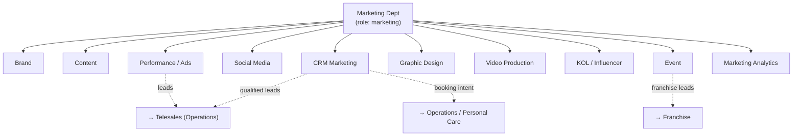

---

## 2. End-to-End Flow ของทั้งฝ่าย (Master Workflow)

> Flow มาตรฐาน: **Campaign Planning → Creative Brief → Content Production → Approval → Publish → Ads → Lead Gen → Report → Handoff**

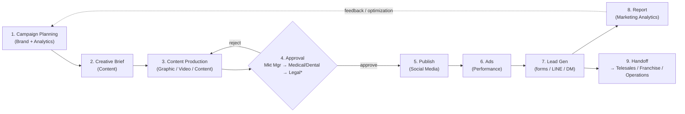

\* **Medical/Dental review** เป็น **mandatory gate** สำหรับเนื้อหาที่อ้างผลการรักษา/หัตถการ (โฆษณาสถานพยาบาลในไทยอยู่ใต้ พ.ร.บ.สถานพยาบาล + ประกาศ อย. ⇒ ทุก claim ทางการแพทย์ต้องผ่านผู้ประกอบวิชาชีพ) — **[ASSUMPTION: บังคับใช้กับทุก creative ที่มี medical/dental claim]**

### 2.1 Stage → Owner → Security Map (สรุประดับฝ่าย)

| # | Stage | Sub-unit เจ้าภาพ | Output หลัก | Data Owner | security_level ของ output |
|---|-------|------------------|-------------|------------|---------------------------|
| 1 | Campaign Planning | Brand + Analytics | `campaign_plan` | Marketing Manager | **MEDIUM** |
| 2 | Creative Brief | Content | `creative_brief` | Content Lead | **MEDIUM** |
| 3 | Content Production | Graphic / Video / Content | `creative_asset` (draft) | Asset creator | **MEDIUM** (RESTRICTED ถ้ามี patient before/after) |
| 4 | Approval | Mkt Mgr + Medical/Dental | `approval_record` | Mkt Manager | **HARD** |
| 5 | Publish | Social Media | `published_post` | Social Lead | **BASIC** (public) / meta = MEDIUM |
| 6 | Ads | Performance | `ad_campaign` + spend | Performance Lead | **HARD** (budget/ROAS) |
| 7 | Lead Gen | Performance / CRM | `marketing_lead` (PII) | CRM Lead | **RESTRICTED** |
| 8 | Report | Analytics | `marketing_report` | Analytics Lead | **HARD** |
| 9 | Handoff | CRM | `lead_handoff` | CRM Lead | **RESTRICTED** |

---

## 3. หน้าที่ระดับฝ่าย (Department Responsibilities)

1. วาง **Marketing Strategy & Calendar** รายไตรมาส/รายเดือน ให้สอดคล้องเป้าหมายรายได้ของเชน
2. บริหาร **งบโฆษณา (ad budget)** ทุกช่องทาง (Meta, Google, TikTok, LINE) ให้ได้ **ROAS / CAC** ตามเป้า
3. ผลิต **creative** (ภาพ/วิดีโอ/คอนเทนต์) ที่ on-brand และ **ผ่าน medical/dental compliance**
4. สร้างและ **คัดกรอง lead (lead qualification)** ก่อนส่งต่อ Telesales/Franchise/Operations
5. ดูแล **brand consistency** ทุก touchpoint และทุกสาขาแฟรนไชส์
6. รายงานผล **attribution / funnel / KPI** ต่อ CEO Office และ Finance
7. **กำกับ PDPA + consent** สำหรับ lead data และภาพ before/after คนไข้

---

## 4. Sub-Department Breakdown (รายละเอียดรายหน่วย)

> แต่ละหน่วยระบุครบ: หน้าที่ · Position list · Workflow (input→process→output→receiver→approver) · KPI + data source · Data Created · Data Used · Security Level · Data Owner · Approval Flow · Audit events · mermaid sub-tree

ระดับ Position มาตรฐาน (อ้าง `positions` table **[EXISTS]** ใน `nexus-hr-schema.ts`): `Head/Manager → Lead/Senior → Specialist → Junior/Associate`

---

### 4.1 Brand (แบรนด์)

**หน้าที่:** เป็นผู้รักษา **brand DNA** — guideline, tone, visual identity, positioning, naming; อนุมัติว่า creative ใด on-brand; วาง campaign theme รายไตรมาส

**Position list [ASSUMPTION headcount]:**
| Position | Level | จำนวน |
|----------|-------|-------|
| Brand Manager | Head | 1 |
| Brand Strategist | Senior | 1 |
| Brand Guardian (Associate) | Junior | 1 |

**Workflow — Campaign Theme & Guideline:**
| ขั้น | รายละเอียด |
|------|-----------|
| Input | เป้ารายได้/โปรโมชันจาก CEO Office + insight จาก Analytics |
| Process | กำหนด theme, key message, brand do/don't, mood board |
| Output | `campaign_plan` (brand-approved theme), `brand_guideline` |
| Receiver | Content, Graphic Design, Video Production |
| Approver | Marketing Manager (→ CEO Office สำหรับ rebrand) |

**KPI + data source:**
| KPI | Target [ASSUMPTION] | Data source |
|-----|---------------------|-------------|
| Brand Awareness (aided) | +5 pp/ปี | survey (`marketing_report`) **[NEW]** |
| Brand Consistency Score | ≥ 95% creative ผ่าน guideline | `approval_records` ratio **[NEW]** |
| Net Promoter Score (NPS) | ≥ 50 | CRM survey **[NEW]** |

**Data Created:** `brand_guideline`, `campaign_plan(theme)`
**Data Used:** `marketing_report`, competitor scans
**Security Level:** brand_guideline = **MEDIUM** (internal); pre-launch rebrand = **RESTRICTED**
**Data Owner:** Brand Manager
**Approval Flow:** Brand Strategist → Brand Manager → (Marketing Manager) → CEO Office (rebrand only)
**Audit events:** `create/update brand_guideline`, `approve/reject campaign_plan`, `view` (MEDIUM), `export guideline`

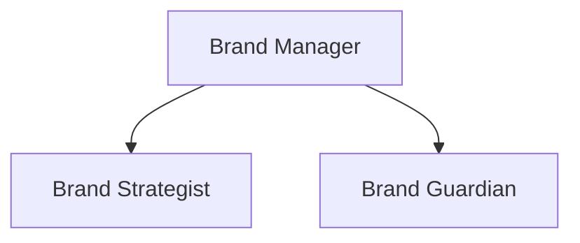

---

### 4.2 Content (คอนเทนต์)

**หน้าที่:** เขียน **creative brief**, copywriting, script, caption, blog/SEO, content calendar; เป็นต้นน้ำของ creative production

**Position list:**
| Position | Level | จำนวน [ASSUMPTION] |
|----------|-------|------|
| Content Lead | Lead | 1 |
| Senior Copywriter | Senior | 1 |
| Copywriter / SEO Writer | Specialist | 2 |

**Workflow — Creative Brief → Copy:**
| ขั้น | รายละเอียด |
|------|-----------|
| Input | `campaign_plan` (จาก Brand) + KPI target |
| Process | เขียน `creative_brief` (objective, audience, message, CTA, channel, deadline) → ส่ง brief; เขียน copy/script |
| Output | `creative_brief`, `content_draft` (copy/caption/script) |
| Receiver | Graphic Design, Video Production, Social Media |
| Approver | Content Lead → Marketing Manager → **Medical/Dental** (ถ้ามี medical claim) |

**KPI + data source:**
| KPI | Target [ASSUMPTION] | Data source |
|-----|---------------------|-------------|
| Content output / สัปดาห์ | ≥ 12 ชิ้น | `creative_assets` count **[NEW]** |
| Engagement rate / post | ≥ 4% | `social_post_metrics` **[NEW]** |
| SEO organic sessions | +10% Q/Q | GA4 → `marketing_report` **[NEW]** |
| Brief→Asset cycle time | ≤ 3 วัน | `creative_assets.created_at − brief.created_at` |

**Data Created:** `creative_brief`, `content_draft`
**Data Used:** `campaign_plan`, `brand_guideline`, persona/insight
**Security Level:** **MEDIUM**; brief ที่อ้างถึง patient testimonial = **RESTRICTED**
**Data Owner:** Content Lead
**Approval Flow:** Copywriter → Content Lead → Marketing Manager → (Medical/Dental gate)
**Audit events:** `create/update creative_brief`, `submit_for_approval`, `approve/reject`, `ai-query` (AI-assisted copy), `ai-response`

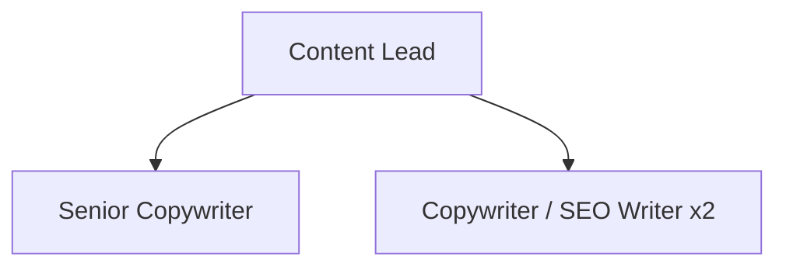

---

### 4.3 Performance (Ads)

**หน้าที่:** ซื้อสื่อ (media buying) Meta/Google/TikTok/LINE Ads; bid & budget optimization; ดูแล **ROAS / CAC / CPL**; เป็นผู้สร้าง lead เชิงปริมาณ

**Position list:**
| Position | Level | จำนวน [ASSUMPTION] |
|----------|-------|------|
| Performance Lead | Lead | 1 |
| Media Buyer (Paid Social) | Specialist | 2 |
| Media Buyer (Search/Google) | Specialist | 1 |

**Workflow — Ads → Lead Gen:**
| ขั้น | รายละเอียด |
|------|-----------|
| Input | `creative_asset` (approved) + budget allocation + `campaign_plan` |
| Process | สร้าง `ad_campaign`, ตั้ง audience/bid/budget, launch, optimize รายวัน |
| Output | `ad_campaign` (+ spend metrics), `marketing_lead` (raw PII) |
| Receiver | CRM Marketing (lead routing), Marketing Analytics |
| Approver | Marketing Manager (budget > threshold → Finance co-sign) |

**KPI + data source:**
| KPI | Target [ASSUMPTION] | Data source |
|-----|---------------------|-------------|
| ROAS | ≥ 4.0x | `ad_campaigns.revenue / spend` **[NEW]** ← attribution |
| Cost per Lead (CPL) | ≤ ฿120 | `spend / leads` |
| CAC | ≤ ฿1,500 | `spend / new_customers` (ผูก Finance) |
| Lead Volume / เดือน | ≥ 3,000 | `marketing_leads` count |
| Budget pacing variance | ±5% | `ad_campaigns.spent vs budget` |

**Data Created:** `ad_campaign`, spend ledger, `marketing_lead`
**Data Used:** `creative_asset`, budget, audience data
**Security Level:** ad_campaign budget/ROAS = **HARD** (manager/finance/CEO); `marketing_lead` PII = **RESTRICTED**
**Data Owner:** Performance Lead (ads) / CRM Lead (lead PII)
**Approval Flow:** Media Buyer → Performance Lead → Marketing Manager → (Finance co-approve ถ้า budget > **฿100,000/เดือน** [ASSUMPTION])
**Audit events:** `create/update ad_campaign`, `budget-change` (HARD → capture before/after), `approve/reject budget`, `create marketing_lead`, `export leads` (RESTRICTED — high-risk), `failed-access`, `blocked-access`

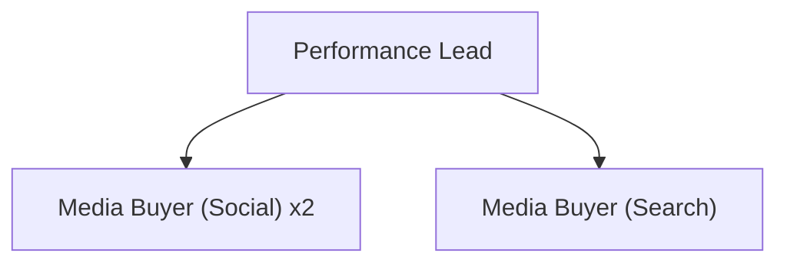

---

### 4.4 Social Media (โซเชียลมีเดีย)

**หน้าที่:** บริหารเพจ/บัญชี (FB, IG, TikTok, LINE OA, YouTube); จัดตาราง **publish**; community management; ตอบ inbox/comment ชั้นแรก

**Position list:**
| Position | Level | จำนวน [ASSUMPTION] |
|----------|-------|------|
| Social Media Lead | Lead | 1 |
| Social Media Executive | Specialist | 2 |
| Community / Moderator | Junior | 1 |

**Workflow — Publish & Community:**
| ขั้น | รายละเอียด |
|------|-----------|
| Input | `creative_asset` (approved) + `content_draft` (caption) + schedule |
| Process | ตั้งเวลา/โพสต์, ตอบคอมเมนต์, จับ lead จาก DM/inbox |
| Output | `published_post`, `social_post_metrics`, `marketing_lead` (จาก DM) |
| Receiver | Marketing Analytics, CRM Marketing |
| Approver | Social Media Lead (โพสต์ปกติ) → Marketing Manager (sensitive/crisis) |

**KPI + data source:**
| KPI | Target [ASSUMPTION] | Data source |
|-----|---------------------|-------------|
| Follower growth | +8% Q/Q | platform API → `social_post_metrics` **[NEW]** |
| Engagement rate | ≥ 4% | `social_post_metrics` |
| Inbox response time | ≤ 15 นาที (เวลาทำการ) | inbox log **[NEW]** |
| Posts published on-time | ≥ 98% | `published_post.scheduled vs published_at` |

**Data Created:** `published_post`, `social_post_metrics`, lead จาก DM
**Data Used:** `creative_asset`, `content_draft`, brand voice
**Security Level:** published_post = **BASIC** (public); inbox/DM ที่มี PII = **RESTRICTED**; metrics = **MEDIUM**
**Data Owner:** Social Media Lead
**Approval Flow:** Executive → Social Lead → Marketing Manager (crisis/medical-claim)
**Audit events:** `publish post`, `update/delete post` (soft-delete + version), `view DM thread` (RESTRICTED), `create lead from DM`, `crisis-escalation`

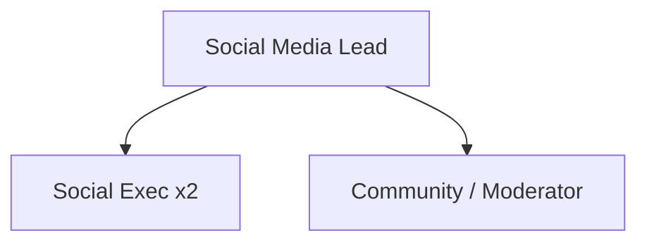

---

### 4.5 CRM Marketing (ซีอาร์เอ็ม)

**หน้าที่:** เป็น **เจ้าของ lifecycle ของ lead** — dedup, scoring, segmentation, nurture (LINE/email/SMS), และ **handoff ไป Telesales/Franchise/Operations**; ดูแล **consent (PDPA)**

**Position list:**
| Position | Level | จำนวน [ASSUMPTION] |
|----------|-------|------|
| CRM Lead | Lead | 1 |
| CRM Automation Specialist | Specialist | 1 |
| Lifecycle / Retention Specialist | Specialist | 1 |

**Workflow — Lead Qualification → Handoff:**
| ขั้น | รายละเอียด |
|------|-----------|
| Input | `marketing_lead` (raw จาก Performance/Social/Event) |
| Process | dedup → enrich → score (`lead_score`) → segment → check consent → nurture |
| Output | `qualified_lead`, `lead_handoff` (พร้อม consent flag) |
| Receiver | **Telesales** (operations), **Franchise**, **Operations/Personal Care** |
| Approver | CRM Lead → Marketing Manager (สำหรับ bulk export/handoff) |

**KPI + data source:**
| KPI | Target [ASSUMPTION] | Data source |
|-----|---------------------|-------------|
| Lead → Qualified rate (MQL) | ≥ 60% | `qualified_leads / marketing_leads` **[NEW]** |
| MQL → SQL handoff accept rate | ≥ 80% | `lead_handoff.accepted` **[NEW]** |
| Nurture conversion uplift | +15% | A/B `marketing_report` |
| Consent coverage | 100% ก่อน handoff | `marketing_leads.consent_id NOT NULL` |
| Dedup rate | ≤ 3% duplicate | dedup job log |

**Data Created:** `qualified_lead`, `lead_score`, `lead_handoff`, `consent_log` (link)
**Data Used:** `marketing_lead`, behavioral data, `consent_logs` **[NEW global]**
**Security Level:** **RESTRICTED** (PII + health-intent + consent) — ชั้นความอ่อนไหวสูงสุดในฝ่าย
**Data Owner:** CRM Lead
**Approval Flow:** CRM Specialist → CRM Lead → Marketing Manager (bulk/export); **consent gate ก่อน handoff ทุกครั้ง**
**Audit events:** `create/update lead`, `lead-score-change`, `view lead PII` (RESTRICTED — every view logged), `export leads`, `handoff lead` (capture receiver dept + consent_id), `consent-grant/revoke`, `blocked-access`, `ai-query` (segmentation)

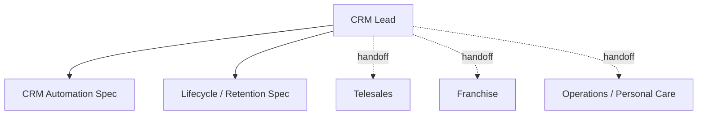

---

### 4.6 Graphic Design (กราฟิก)

**หน้าที่:** ผลิต **visual asset** (ภาพนิ่ง, key visual, banner, carousel, print) ตาม brief และ brand guideline

**Position list:**
| Position | Level | จำนวน [ASSUMPTION] |
|----------|-------|------|
| Art Director / Design Lead | Lead | 1 |
| Senior Graphic Designer | Senior | 1 |
| Graphic Designer | Specialist | 2 |

**Workflow — Brief → Visual Asset:**
| ขั้น | รายละเอียด |
|------|-----------|
| Input | `creative_brief` + `brand_guideline` |
| Process | ออกแบบ → revise → ส่ง draft asset |
| Output | `creative_asset` (image, type=graphic) |
| Receiver | Approval flow → Social Media / Performance |
| Approver | Art Director → Marketing Manager → (Medical/Dental ถ้ามี before/after คนไข้) |

**KPI + data source:**
| KPI | Target [ASSUMPTION] | Data source |
|-----|---------------------|-------------|
| Asset throughput / สัปดาห์ | ≥ 20 | `creative_assets` count |
| First-pass approval rate | ≥ 70% | `approval_records` (0 revision) |
| On-time delivery | ≥ 95% | `creative_assets.due vs delivered` |

**Data Created:** `creative_asset` (graphic)
**Data Used:** `creative_brief`, `brand_guideline`, stock/patient photos
**Security Level:** **MEDIUM**; ถ้ามี **patient before/after** → **RESTRICTED** + consent_id required
**Data Owner:** Art Director
**Approval Flow:** Designer → Art Director → Marketing Manager → (Medical/Dental)
**Audit events:** `upload creative_asset`, `update/version asset`, `submit_for_approval`, `approve/reject`, `download asset`, `consent-link` (เมื่อใช้ภาพคนไข้)

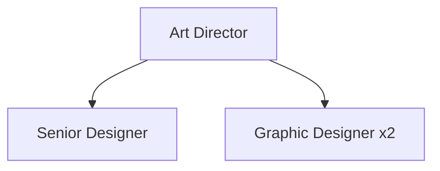

---

### 4.7 Video Production (วิดีโอ)

**หน้าที่:** ถ่าย/ตัดต่อ video, reels, TikTok, testimonial, ad film; motion graphic

**Position list:**
| Position | Level | จำนวน [ASSUMPTION] |
|----------|-------|------|
| Video Lead / Producer | Lead | 1 |
| Videographer | Specialist | 1 |
| Video Editor / Motion | Specialist | 2 |

**Workflow — Brief → Video Asset:**
| ขั้น | รายละเอียด |
|------|-----------|
| Input | `creative_brief` (script) + shot list |
| Process | pre-production → shoot → edit → revise |
| Output | `creative_asset` (video) |
| Receiver | Approval → Social Media / Performance / KOL |
| Approver | Video Lead → Marketing Manager → (Medical/Dental สำหรับ testimonial/ผลการรักษา) |

**KPI + data source:**
| KPI | Target [ASSUMPTION] | Data source |
|-----|---------------------|-------------|
| Video output / เดือน | ≥ 12 | `creative_assets` (type=video) |
| Avg view-through rate (VTR) | ≥ 25% | platform → `social_post_metrics` |
| Production cycle time | ≤ 7 วัน | asset timestamps |

**Data Created:** `creative_asset` (video), raw footage
**Data Used:** `creative_brief`, patient/KOL footage (consent)
**Security Level:** **MEDIUM**; **patient testimonial / before-after footage = RESTRICTED** + consent
**Data Owner:** Video Lead
**Approval Flow:** Editor → Video Lead → Marketing Manager → (Medical/Dental)
**Audit events:** `upload video asset`, `version asset`, `approve/reject`, `download`, `consent-link`, `export` (raw footage = RESTRICTED)

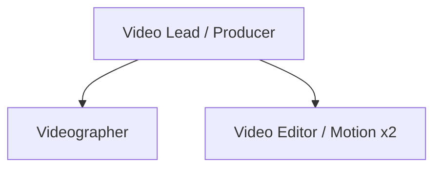

---

### 4.8 KOL / Influencer (เคโอแอล)

**หน้าที่:** คัด/ดีล KOL & influencer; บริหารสัญญา, brief, ค่าตอบแทน; วัดผล KOL campaign

**Position list:**
| Position | Level | จำนวน [ASSUMPTION] |
|----------|-------|------|
| KOL / Influencer Lead | Lead | 1 |
| Influencer Coordinator | Specialist | 2 |

**Workflow — KOL Campaign:**
| ขั้น | รายละเอียด |
|------|-----------|
| Input | `campaign_plan` + budget + brief |
| Process | shortlist KOL → เจรจา → สัญญา → ส่ง brief → KOL ผลิต → วัดผล |
| Output | `kol_engagement` (deal + deliverable + fee), `social_post_metrics` |
| Receiver | Marketing Analytics, Finance (จ่ายค่าตอบแทน) |
| Approver | KOL Lead → Marketing Manager → **Finance** (payment) → (Legal สำหรับสัญญา) |

**KPI + data source:**
| KPI | Target [ASSUMPTION] | Data source |
|-----|---------------------|-------------|
| KOL ROAS / Earned media value | ≥ 3.0x | `kol_engagements` **[NEW]** |
| Engagement per ฿1,000 fee | ≥ 500 | metrics / fee |
| On-brief deliverable rate | ≥ 95% | `kol_engagements.delivered` |

**Data Created:** `kol_engagement` (มี fee, contract ref)
**Data Used:** `campaign_plan`, budget, KOL contact (PII)
**Security Level:** KOL contact/PII = **RESTRICTED**; **fee/contract = HARD** (finance-grade); metrics = MEDIUM
**Data Owner:** KOL Lead (campaign) / Finance (contract & payment)
**Approval Flow:** Coordinator → KOL Lead → Marketing Manager → Finance (pay) → Legal (contract)
**Audit events:** `create/update kol_engagement`, `fee-change` (HARD before/after), `view contract` (RESTRICTED), `approve payment`, `export KOL list`

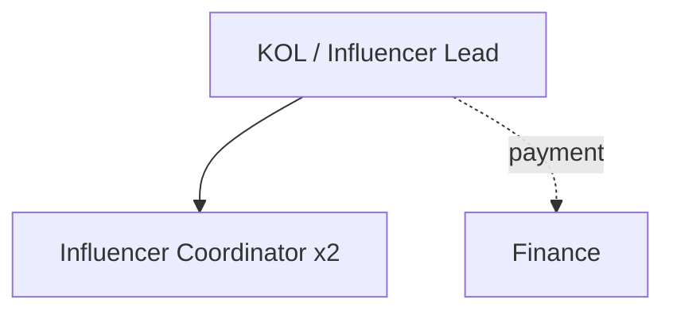

---

### 4.9 Event (อีเวนต์)

**หน้าที่:** จัด event / booth / โรดโชว์ / open house สาขา / งานแฟรนไชส์; เก็บ lead หน้างาน (on-site lead capture)

**Position list:**
| Position | Level | จำนวน [ASSUMPTION] |
|----------|-------|------|
| Event Lead | Lead | 1 |
| Event Coordinator | Specialist | 2 |

**Workflow — Event → On-site Lead:**
| ขั้น | รายละเอียด |
|------|-----------|
| Input | `campaign_plan` + budget + สาขา/พื้นที่เป้าหมาย |
| Process | วางแผน → จัดงาน → เก็บ lead (form/QR/LINE) → สรุปผล |
| Output | `event_record`, `marketing_lead` (on-site, RESTRICTED) |
| Receiver | CRM Marketing, **Franchise** (lead แฟรนไชส์), Marketing Analytics |
| Approver | Event Lead → Marketing Manager → Finance (budget) |

**KPI + data source:**
| KPI | Target [ASSUMPTION] | Data source |
|-----|---------------------|-------------|
| Leads / event | ≥ 150 | `marketing_leads` (source=event) |
| Cost per on-site lead | ≤ ฿200 | event budget / leads |
| Event ROI | ≥ 2.0x | `event_records` ↔ Finance |

**Data Created:** `event_record`, on-site `marketing_lead`, consent (เซ็นหน้างาน)
**Data Used:** `campaign_plan`, branch list, budget
**Security Level:** event_record = **MEDIUM**; on-site lead PII + consent = **RESTRICTED**
**Data Owner:** Event Lead (event) / CRM Lead (lead PII)
**Approval Flow:** Coordinator → Event Lead → Marketing Manager → Finance (budget)
**Audit events:** `create/update event_record`, `bulk-import on-site leads`, `consent-capture`, `handoff to franchise`, `export`

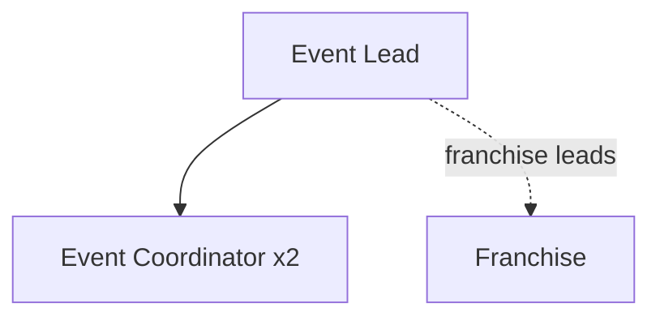

---

### 4.10 Marketing Analytics (วิเคราะห์การตลาด)

**หน้าที่:** รวมข้อมูลทุกช่องทาง → attribution, funnel, dashboard, รายงาน KPI; เป็น **single source of truth** ของผลการตลาด; feed insight กลับ Brand/Performance

**Position list:**
| Position | Level | จำนวน [ASSUMPTION] |
|----------|-------|------|
| Marketing Analytics Lead | Lead | 1 |
| Marketing Data Analyst | Specialist | 2 |

**Workflow — Data → Report:**
| ขั้น | รายละเอียด |
|------|-----------|
| Input | `ad_campaigns`, `social_post_metrics`, `marketing_leads`, `lead_handoff` (+ revenue จาก Finance) |
| Process | ETL → attribution model → funnel → dashboard |
| Output | `marketing_report`, `marketing_dashboard` |
| Receiver | Marketing Manager, **CEO Office**, **Finance** |
| Approver | Analytics Lead → Marketing Manager (sign-off ก่อนส่ง exec) |

**KPI + data source:**
| KPI | Target [ASSUMPTION] | Data source |
|-----|---------------------|-------------|
| Report SLA | ส่งทุกจันทร์ 10:00 | report timestamps |
| Data accuracy / reconciliation | ≥ 99% vs Finance | recon log |
| Attribution coverage | ≥ 90% conversions matched | `lead_handoff` join rate |

**Data Created:** `marketing_report`, `marketing_dashboard`
**Data Used:** ทุกตารางการตลาด + revenue (Finance, read-only, masked)
**Security Level:** report = **HARD** (มี spend/ROAS/CAC); raw lead access ต้องผ่าน RESTRICTED policy แม้เป็น analyst
**Data Owner:** Analytics Lead
**Approval Flow:** Analyst → Analytics Lead → Marketing Manager → (exec distribution)
**Audit events:** `generate report`, `view report` (HARD), `export report`, `query cross-dept revenue` (logged + masked), `ai-query` (insight gen), `ai-response`

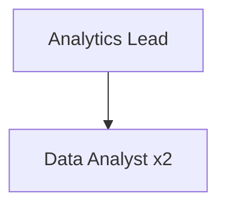

---

## 5. Position List — Department Roll-up

| Sub-unit | Head/Lead | Senior | Specialist | Junior | รวม [ASSUMPTION] |
|----------|-----------|--------|------------|--------|------|
| Brand | 1 | 1 | – | 1 | 3 |
| Content | 1 | 1 | 2 | – | 4 |
| Performance | 1 | – | 3 | – | 4 |
| Social Media | 1 | – | 2 | 1 | 4 |
| CRM Marketing | 1 | – | 2 | – | 3 |
| Graphic Design | 1 | 1 | 2 | – | 4 |
| Video Production | 1 | – | 3 | – | 4 |
| KOL/Influencer | 1 | – | 2 | – | 3 |
| Event | 1 | – | 2 | – | 3 |
| Marketing Analytics | 1 | – | 2 | – | 3 |
| **Marketing Manager (Dept Head)** | 1 | | | | 1 |
| **รวมทั้งฝ่าย** | | | | | **36** |

---

## 6. Data Model — ตารางที่เสนอ (Schema)

> ทุกตารางใหม่ยึด **global core columns**: `id, company_id, created_at, updated_at, deleted_at, created_by, updated_by, deleted_by, is_active, version, security_level` + FK/UNIQUE/CHECK/composite index ตาม spec

### 6.1 สถานะตารางที่เกี่ยวข้อง

| ตาราง | สถานะ | หมายเหตุ |
|-------|-------|----------|
| `campaigns` | **[EXISTS]** | basic; เก็บไว้เป็น legacy/aggregate หรือ migrate เข้า `ad_campaigns` |
| `sub_departments` | **[NEW]** | first-class sub-unit (ดู §13) |
| `teams` | **[NEW]** | team/unit ใต้ sub-dept |
| `campaign_plans` | **[NEW]** | theme/plan ระดับแคมเปญ |
| `creative_briefs` | **[NEW]** | brief |
| `creative_assets` | **[NEW]** | graphic/video/copy asset + version |
| `approval_records` | **[NEW]** | generic approval (ใช้ร่วม medical/dental gate) |
| `ad_campaigns` | **[NEW]** | media buying + spend + ROAS |
| `social_posts` / `social_post_metrics` | **[NEW]** | publish + metrics |
| `marketing_leads` | **[NEW]** | lead PII (RESTRICTED) |
| `lead_handoffs` | **[NEW]** | handoff record → telesales/franchise/ops |
| `kol_engagements` | **[NEW]** | KOL deal + fee |
| `event_records` | **[NEW]** | event |
| `marketing_reports` | **[NEW]** | report (HARD) |
| `consent_logs` | **[NEW global]** | PDPA consent (shared) |
| `audit_log` | **[EXISTS — ต้อง upgrade]** | ต้องเพิ่ม before/after, ip, request_id, hash-chain (ดู §9) |
| `ai_query_logs` | **[NEW global]** | prompt/response/redaction (ดู §10) |

### 6.2 ตัวอย่าง DDL — `marketing_leads` (RESTRICTED, หัวใจ governance)

```sql
-- [NEW — migration] : marketing_leads
CREATE TABLE IF NOT EXISTS marketing_leads (
  id              TEXT PRIMARY KEY,
  company_id      TEXT NOT NULL REFERENCES companies(id),
  sub_department_id TEXT REFERENCES sub_departments(id),
  -- PII (RESTRICTED) — เก็บ encrypted-at-rest, mask ตาม tier
  full_name       TEXT NOT NULL,
  phone           TEXT,
  line_user_id    TEXT,
  email           TEXT,
  interest        TEXT,              -- e.g. "filler", "root canal" (health-intent → sensitive)
  source          TEXT NOT NULL CHECK (source IN ('meta','google','tiktok','line','dm','event','referral')),
  ad_campaign_id  TEXT REFERENCES ad_campaigns(id),
  lead_score      INTEGER DEFAULT 0 CHECK (lead_score BETWEEN 0 AND 100),
  stage           TEXT DEFAULT 'new' CHECK (stage IN ('new','mql','sql','handoff','won','lost')),
  consent_id      TEXT REFERENCES consent_logs(id),   -- ต้อง NOT NULL ก่อน handoff
  assigned_to     TEXT REFERENCES users(id),
  -- global core columns
  security_level  TEXT NOT NULL DEFAULT 'RESTRICTED'
                  CHECK (security_level IN ('BASIC','MEDIUM','HARD','RESTRICTED')),
  is_active       BOOLEAN NOT NULL DEFAULT TRUE,
  version         INTEGER NOT NULL DEFAULT 1,
  created_at      TIMESTAMPTZ NOT NULL DEFAULT NOW(),
  updated_at      TIMESTAMPTZ NOT NULL DEFAULT NOW(),
  deleted_at      TIMESTAMPTZ,                          -- soft-delete
  created_by      TEXT REFERENCES users(id),
  updated_by      TEXT REFERENCES users(id),
  deleted_by      TEXT REFERENCES users(id),
  CONSTRAINT uq_lead_dedup UNIQUE (company_id, phone, ad_campaign_id)
);
CREATE INDEX idx_mleads_company_stage ON marketing_leads (company_id, stage) WHERE deleted_at IS NULL;
CREATE INDEX idx_mleads_assigned ON marketing_leads (assigned_to) WHERE deleted_at IS NULL;
CREATE INDEX idx_mleads_campaign ON marketing_leads (ad_campaign_id);
```

### 6.3 ตัวอย่าง DDL — `ad_campaigns` (HARD — budget/ROAS)

```sql
-- [NEW — migration] : ad_campaigns (replaces basic `campaigns` over time)
CREATE TABLE IF NOT EXISTS ad_campaigns (
  id              TEXT PRIMARY KEY,
  company_id      TEXT NOT NULL REFERENCES companies(id),
  campaign_plan_id TEXT REFERENCES campaign_plans(id),
  name            TEXT NOT NULL,
  channel         TEXT NOT NULL CHECK (channel IN ('meta','google','tiktok','line','youtube')),
  budget          NUMERIC(14,2) NOT NULL DEFAULT 0 CHECK (budget >= 0),
  spent           NUMERIC(14,2) NOT NULL DEFAULT 0 CHECK (spent >= 0),
  reach           INTEGER DEFAULT 0,
  clicks          INTEGER DEFAULT 0,
  leads           INTEGER DEFAULT 0,
  conversions     INTEGER DEFAULT 0,
  revenue         NUMERIC(14,2) DEFAULT 0,   -- attribution ↔ Finance
  roas            NUMERIC(8,2)  GENERATED ALWAYS AS
                  (CASE WHEN spent > 0 THEN revenue / spent ELSE 0 END) STORED,
  status          TEXT NOT NULL DEFAULT 'active'
                  CHECK (status IN ('draft','active','paused','ended')),
  security_level  TEXT NOT NULL DEFAULT 'HARD'
                  CHECK (security_level IN ('BASIC','MEDIUM','HARD','RESTRICTED')),
  is_active       BOOLEAN NOT NULL DEFAULT TRUE,
  version         INTEGER NOT NULL DEFAULT 1,
  created_at      TIMESTAMPTZ NOT NULL DEFAULT NOW(),
  updated_at      TIMESTAMPTZ NOT NULL DEFAULT NOW(),
  deleted_at      TIMESTAMPTZ,
  created_by      TEXT REFERENCES users(id),
  updated_by      TEXT REFERENCES users(id),
  deleted_by      TEXT REFERENCES users(id)
);
CREATE INDEX idx_adcamp_company_status ON ad_campaigns (company_id, status) WHERE deleted_at IS NULL;
```

### 6.4 ตัวอย่าง DDL — `lead_handoffs` (RESTRICTED — cross-department)

```sql
-- [NEW — migration] : lead_handoffs
CREATE TABLE IF NOT EXISTS lead_handoffs (
  id              TEXT PRIMARY KEY,
  company_id      TEXT NOT NULL REFERENCES companies(id),
  lead_id         TEXT NOT NULL REFERENCES marketing_leads(id),
  to_department   TEXT NOT NULL CHECK (to_department IN ('telesales','franchise','operations')),
  to_user_id      TEXT REFERENCES users(id),
  consent_id      TEXT NOT NULL REFERENCES consent_logs(id),  -- gate: ห้าม handoff ถ้าไม่มี consent
  accepted        BOOLEAN DEFAULT FALSE,
  accepted_at     TIMESTAMPTZ,
  security_level  TEXT NOT NULL DEFAULT 'RESTRICTED',
  is_active       BOOLEAN NOT NULL DEFAULT TRUE,
  version         INTEGER NOT NULL DEFAULT 1,
  created_at      TIMESTAMPTZ NOT NULL DEFAULT NOW(),
  updated_at      TIMESTAMPTZ NOT NULL DEFAULT NOW(),
  deleted_at      TIMESTAMPTZ,
  created_by      TEXT REFERENCES users(id),
  updated_by      TEXT REFERENCES users(id),
  deleted_by      TEXT REFERENCES users(id)
);
CREATE INDEX idx_handoff_lead ON lead_handoffs (lead_id);
CREATE INDEX idx_handoff_dept ON lead_handoffs (company_id, to_department);
```

---

## 7. Data Classification Matrix (สรุประดับความปลอดภัยของข้อมูลทั้งฝ่าย)

| Data / ตาราง | security_level | เหตุผล | ใครเห็นได้ (default) |
|--------------|----------------|--------|----------------------|
| `published_post` (เนื้อหา public) | **BASIC** | เผยแพร่สาธารณะอยู่แล้ว | ทุกคนในบริษัท |
| `campaign_plan`, `creative_brief`, `brand_guideline` | **MEDIUM** | ความลับเชิงปฏิบัติการของฝ่าย | คนในฝ่าย Marketing |
| `creative_asset` (ไม่มีคนไข้) | **MEDIUM** | internal asset | Marketing + ผู้เกี่ยวข้อง workflow |
| `social_post_metrics` | **MEDIUM** | ผลเชิงปฏิบัติ | Marketing |
| `ad_campaigns` (budget/ROAS/CAC), `marketing_reports`, `approval_records`, `kol_engagements.fee` | **HARD** | การเงินเชิงกลยุทธ์/อนุมัติ | Manager + Finance + CEO |
| `marketing_leads` (PII + health-intent), `lead_handoffs`, DM/inbox PII, KOL contact, patient before/after asset, `consent_logs` | **RESTRICTED** | PII/PDPA + health-adjacent + consent | direct grant เท่านั้น (assigned_to / CRM Lead / Mkt Manager) |

**กฎ default ตาม global spec:** Patient records / AI evaluation / Executive notes ⇒ RESTRICTED — ในฝ่ายนี้ map กับ patient before/after asset และ AI lead-scoring output

---

## 8. RBAC + ABAC + Data-Ownership (Deny-by-default, Backend-enforced)

> **หลักการ:** RBAC (role) ∧ ABAC (department/sub-dept/position/security clearance) ∧ Data-Ownership (owner_id / assigned_to) — **deny by default**, บังคับใน **backend ทุก API และทุก AI query** ไม่ใช่ frontend

### 8.1 RBAC layer (มีอยู่ — ต้องขยาย)
- `MODULE_ACCESS.marketing = ['admin','ceo','marketing']` **[EXISTS]** — gating ระดับ module
- **ขยาย [NEW]:** เพิ่ม sub-module keys: `marketing.brand`, `marketing.performance`, `marketing.crm`, `marketing.analytics` เพื่อ scope ภายในฝ่าย

### 8.2 ABAC layer (ใหม่เกือบทั้งหมด)
ปัจจุบัน ABAC เป็น ad-hoc (`departmentScope` คืน department string) **[EXISTS but narrow]**. เสนอ policy แบบ attribute:

```json
// [NEW] policy rule — อ่าน marketing_leads (RESTRICTED)
{
  "resource": "marketing_leads",
  "action": "read",
  "effect": "allow",
  "when": {
    "all": [
      { "user.company_id": "== resource.company_id" },
      { "user.department": "in ['marketing','operations']" },
      { "any": [
        { "user.position_level": "in ['manager','lead']" },
        { "resource.assigned_to": "== user.id" }
      ]},
      { "user.security_clearance": ">= RESTRICTED_for_marketing_leads" }
    ]
  },
  "default": "deny"
}
```

### 8.3 Data-Ownership
- `marketing_leads.assigned_to`, `creative_assets.created_by`, `ad_campaigns.created_by` = owner
- Specialist เห็น/แก้ได้เฉพาะ **row ที่ตน own**; Lead เห็นทั้ง sub-unit; Manager เห็นทั้งฝ่าย; CEO/Finance เห็น HARD-level cross-dept (masked PII)
- Cross-tenant: ทุก query **บังคับ** `company_id = :ctx.company_id` ผ่าน guard layer **[NEW — แก้ gap ที่ inventory ระบุว่าไม่มี enforcement]**

### 8.4 Access Matrix (ตัวอย่าง)

| Resource (level) | Specialist (own) | Sub-unit Lead | Mkt Manager | Finance | CEO | Telesales |
|------------------|------------------|---------------|-------------|---------|-----|-----------|
| `creative_asset` (MEDIUM) | R/W own | R/W unit | R/W all | – | R | – |
| `ad_campaigns` (HARD) | R own | R/W unit | R/W all | R | R | – |
| `marketing_leads` (RESTRICTED) | R/W assigned | R/W unit | R/W all | – (masked) | R masked | R **เฉพาะหลัง handoff** |
| `marketing_reports` (HARD) | – | R | R/W | R | R | – |
| `consent_logs` (RESTRICTED) | R linked | R unit | R/W all | – | R | R linked |

(R=read, W=write; "–" = deny by default; ต้อง direct-grant จึงเข้าได้)

---

## 9. Audit Log Events (Append-only, ครบทุก action)

> ใช้ตาราง `audit_log` **[EXISTS]** แต่ต้อง **upgrade [NEW migration]** ให้มี: `before_state`/`after_state` JSON, `changed_fields`, `ip_address`, `user_agent`, `request_id`, `session_id`, `endpoint`, `http_method`, `result`, `failure_reason`, `prev_hash` (hash-chain), `target_security_level` + **REVOKE UPDATE/DELETE** + trigger กัน mutate (ปัจจุบันเป็น plain table, writes ถูก swallow — ต้องแก้ให้ guaranteed)

### 9.1 รายการ event ที่ต้องจับ (Marketing scope)

| Action group | Events | จับเมื่อ level | before/after |
|--------------|--------|----------------|--------------|
| **Auth** | login, logout, failed-login | ทุกครั้ง | – |
| **Read** | view, search | MEDIUM+ (RESTRICTED **บังคับทุก view**) | – |
| **Write** | create, update, soft-delete, restore | ทุก mutation | ✅ ทุกครั้ง |
| **Asset** | upload, download, version | ทุกครั้ง | ✅ (update) |
| **Approval** | submit_for_approval, approve, reject (incl. medical/dental gate) | ทุกครั้ง | ✅ |
| **Budget/Money** | budget-change, fee-change, approve-payment | HARD | ✅ before/after numeric |
| **Lead/PII** | create-lead, view-lead, export-leads, handoff-lead | RESTRICTED (ทุก action) | ✅ |
| **Consent** | consent-grant, consent-revoke, consent-link | RESTRICTED | ✅ |
| **Permission** | permission-change, role-change | ทุกครั้ง | ✅ |
| **AI** | ai-query, ai-response, ai-redaction-applied | ทุกครั้ง (link `request_id`) | snapshot |
| **Security** | failed-access, blocked-access | ทุกครั้ง | reason |
| **Export** | export (report/leads/asset) | HARD/RESTRICTED | record scope |

### 9.2 ตัวอย่าง audit entry — export leads (high-risk)

```json
{
  "id": "aud_...",
  "company_id": "co_saduak",
  "actor_user_id": "usr_crm_lead",
  "actor_role": "marketing",
  "action": "export-leads",
  "target_table": "marketing_leads",
  "target_id": "bulk:campaign=adc_123",
  "target_security_level": "RESTRICTED",
  "before_state": null,
  "after_state": { "exported_count": 412, "fields": ["full_name","phone","interest"] },
  "changed_fields": [],
  "ip_address": "203.0.113.5",
  "user_agent": "Mozilla/5.0 ...",
  "request_id": "req_abc",
  "session_id": "sess_xyz",
  "endpoint": "/api/marketing/leads/export",
  "http_method": "POST",
  "result": "success",
  "failure_reason": null,
  "prev_hash": "sha256:...",
  "created_at": "2026-06-25T03:00:00Z"
}
```

**Retention:** RESTRICTED audit ≥ **3 ปี** [ASSUMPTION เทียบเคียง PDPA practice]; append-only; AI log แยกตาราง แต่ link ด้วย `request_id`

---

## 10. AI Access Control (สำหรับ AI agent ของฝ่ายการตลาด)

> **กฎเหล็ก:** AI **ไม่อ่าน DB ตรง** — ทุก query ผ่าน flow: identify user → check role/dept/position/clearance → filter to allowed data → ส่งเฉพาะ data ที่อนุญาต → response → **redaction check** → audit log. AI **ห้ามเปิดเผยข้อมูลที่ user เห็นเองไม่ได้**

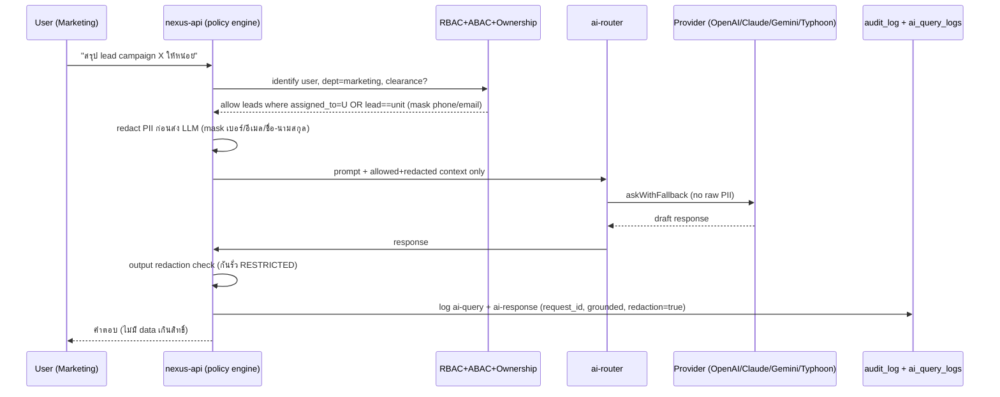

**สถานะปัจจุบัน vs ที่ต้องทำ:**
- `ai-router.ts` + `ai-providers.ts` **[EXISTS]** — มี routing + fallback แล้ว
- **[NEW] ต้องเพิ่ม:** (1) PII redaction ใน AI path ก่อนส่ง external provider (ปัจจุบัน `sanitize.ts` strip แค่ password — ไม่อยู่ใน AI path); (2) `ai_query_logs` เก็บ prompt/response/provider/model/tokens/latency/decision/grounded/redaction; (3) output filter กัน RESTRICTED leak; (4) policy check ก่อน build RAG context (ปัจจุบัน `buildOrgContext` ส่ง full org context)
- **Decision rights:** lead-scoring/segmentation = `suggest` (human-in-loop); auto-publish creative = `human` (ห้าม auto) — "Copilot not Autopilot" **[EXISTS principle]**

---

## 11. Approval Flows (สรุป Gate ของฝ่าย)

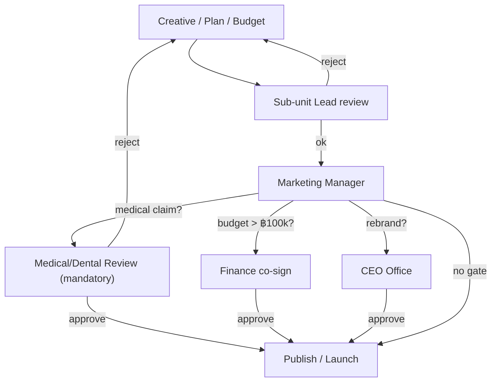

| Object | Gate ขั้นต่ำ | Gate เพิ่มเติม |
|--------|--------------|----------------|
| creative_asset (มี medical/dental claim) | Lead → Mkt Manager | **Medical/Dental (mandatory)** |
| ad budget > ฿100k/เดือน [ASSUMPTION] | Lead → Mkt Manager | **Finance co-sign** |
| KOL contract & fee | KOL Lead → Mkt Manager | **Finance + Legal** |
| Rebrand / brand identity change | Brand Manager → Mkt Manager | **CEO Office** |
| Lead handoff (RESTRICTED) | CRM Lead | **Consent gate (เทคนิค — `consent_id NOT NULL`)** |
| Patient before/after asset | Lead → Mkt Manager | **Medical/Dental + Consent** |

---

## 12. Handoff Contract (ส่งต่อ Telesales / Franchise / Operations)

> Output สุดท้ายของฝ่าย = `lead_handoff` ที่ผ่าน consent gate

| ปลายทาง | เงื่อนไข handoff | Payload | security_level | audit |
|---------|------------------|---------|----------------|-------|
| **Telesales** (Operations) | stage = MQL/SQL + consent | lead PII (unmasked เฉพาะ assignee), interest, score | RESTRICTED | `handoff-lead` |
| **Franchise** | source = event/franchise inquiry + consent | lead + พื้นที่/สาขาสนใจ | RESTRICTED | `handoff-lead` |
| **Operations / Personal Care** | booking intent + consent | lead + บริการที่สนใจ | RESTRICTED | `handoff-lead` |

**SLA handoff [ASSUMPTION]:** lead ใหม่ที่ qualified ต้อง handoff ≤ **30 นาที** ในเวลาทำการ; Telesales ต้อง accept ≤ **2 ชม.** มิฉะนั้น SLA-escalation (มี `sla-escalation.ts` worker **[EXISTS]** ใช้ต่อยอดได้)

---

## 13. Org-structure Wiring (แก้ gap: sub-unit เป็น first-class)

ปัจจุบัน sub-unit เป็น `org_units` level-3 + free-text `users.department` **[EXISTS but not referential]**. เสนอ:

```sql
-- [NEW — migration] sub_departments + teams (wired into RBAC/ABAC)
CREATE TABLE IF NOT EXISTS sub_departments (
  id            TEXT PRIMARY KEY,
  company_id    TEXT NOT NULL REFERENCES companies(id),
  department    TEXT NOT NULL,              -- 'marketing'
  name          TEXT NOT NULL,              -- 'Performance', 'CRM Marketing', ...
  lead_user_id  TEXT REFERENCES users(id),
  security_level TEXT NOT NULL DEFAULT 'MEDIUM',
  is_active     BOOLEAN NOT NULL DEFAULT TRUE,
  version       INTEGER NOT NULL DEFAULT 1,
  created_at    TIMESTAMPTZ NOT NULL DEFAULT NOW(),
  updated_at    TIMESTAMPTZ NOT NULL DEFAULT NOW(),
  deleted_at    TIMESTAMPTZ,
  created_by TEXT, updated_by TEXT, deleted_by TEXT,
  CONSTRAINT uq_subdept UNIQUE (company_id, department, name)
);
-- seed 10 sub-units ของ Marketing: Brand, Content, Performance, Social Media,
-- CRM Marketing, Graphic Design, Video Production, KOL/Influencer, Event, Marketing Analytics
```

จากนั้นเพิ่ม FK `users.sub_department_id` / `employee_profiles.sub_department_id` และให้ ABAC อ่าน scope จาก `sub_departments` แทน free-text string

---

## 14. Migration Checklist (Railway — `railway up` per service)

> Deploy ผ่าน `railway up` ต่อ service (ไม่ใช่ GitHub auto-deploy) **[per MEMORY]**. Migration ใหม่ลงผ่าน `migrations.ts` (tracked ใน `schema_migrations`), รันตอน boot ของ **nexus-api**

1. **[NEW] v11** — `sub_departments`, `teams` + seed Marketing 10 units + FK `users.sub_department_id`
2. **[NEW] v12** — `campaign_plans`, `creative_briefs`, `creative_assets` (+version/soft-delete)
3. **[NEW] v13** — `ad_campaigns`, `social_posts`, `social_post_metrics`
4. **[NEW] v14** — `marketing_leads`, `lead_handoffs`, `consent_logs` (RESTRICTED + encrypted-at-rest)
5. **[NEW] v15** — `kol_engagements`, `event_records`, `marketing_reports`, `approval_records`
6. **[NEW] v16** — **upgrade `audit_log`**: add before/after/ip/request_id/prev_hash + REVOKE UPDATE/DELETE + immutability trigger
7. **[NEW] v17** — `ai_query_logs` + wire redaction into `ai-router.ts`
8. **[NEW]** policy engine + tenant `company_id` guard layer (backend middleware)

**Verify as production build** [per MEMORY]: ทดสอบบน prod build (Docker) ไม่ใช่ `next dev` เพื่อกัน render-loop/fatal bug ที่ถูก mask

---

## 15. สรุป Gap → Action (Marketing-specific)

| Gap (จาก inventory) | ผลกระทบต่อ Marketing | Action |
|---------------------|----------------------|--------|
| ไม่มี soft-delete/version | ลบ asset/lead แล้วหายถาวร, ไม่มี history | เพิ่ม `deleted_at`/`version` ทุกตารางใหม่ |
| audit ไม่มี before/after + swallow error | export lead/แก้ budget ไม่ถูกตรวจสอบได้ | upgrade audit_log (v16) |
| AI ส่ง PII ดิบไป provider | lead PII รั่วออก external LLM | redaction layer + ai_query_logs (v17) |
| ABAC ad-hoc, ไม่มี ownership model | analyst เห็น lead ทุก row | policy engine + assigned_to ownership |
| sub-unit ไม่ referential | scope ผิด, นับ KPI ไม่ได้ | sub_departments (v11) |
| ไม่มี consent framework | ผิด PDPA เมื่อ handoff | consent_logs + handoff gate (v14) |

---

*End of document — 03-marketing.md*
