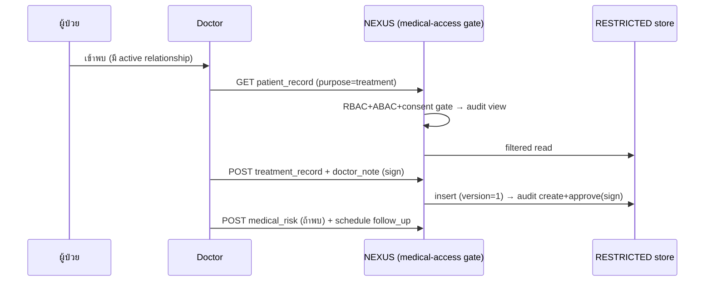
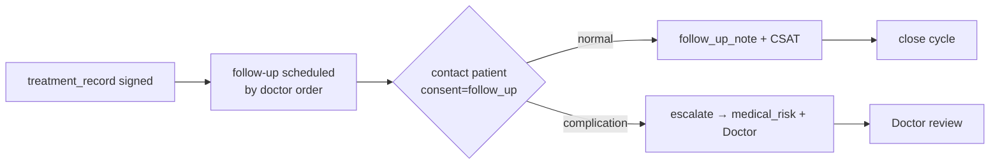
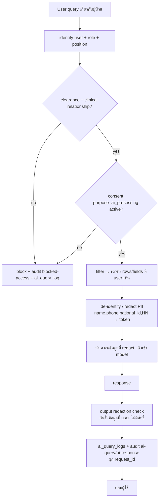

# 04 — Department Breakdown: แผนกแพทย์ (Medical Department)

> **เอกสารสถาปัตยกรรมระดับ Production** — Saduak Suay Mai PCL · NEXUS OS AI Workforce OS
> **Classification ของเอกสารนี้:** `HARD` (internal architecture) — แต่ **ข้อมูลที่อธิบาย** ส่วนใหญ่เป็น `RESTRICTED`
> **Scope:** Medical Department ทั้งแผนก + 8 sub-unit · กฎ Consent / Access / Audit บนทุกการอ่านเวชระเบียน
> **กฎหมายที่บังคับใช้:** PDPA (พ.ร.บ.คุ้มครองข้อมูลส่วนบุคคล พ.ศ. 2562), พ.ร.บ.สถานพยาบาล, ประกาศแพทยสภาว่าด้วยเวชระเบียน

---

## 0. หลักการบังคับ (Non-negotiable Principles) สำหรับแผนกแพทย์

แผนกแพทย์เป็นแผนกที่ถือ **ข้อมูลสุขภาพ (Health Data / Sensitive Personal Data ตาม PDPA มาตรา 26)** ทั้งหมด จึงอยู่ภายใต้กฎเข้มที่สุดของระบบ:

1. **RESTRICTED-by-default** — ตารางหลักทุกตารางในแผนกนี้ (`patient_records`, `treatment_records`, `doctor_notes`, `medical_consents`, `medical_risks`, `follow_up_notes`) มี `security_level = 'RESTRICTED'` เป็นค่าเริ่มต้น **เปลี่ยนเป็นต่ำกว่านี้ไม่ได้** การเข้าถึงต้องผ่าน **direct grant + clinical relationship** เท่านั้น ไม่มีการเข้าถึงด้วย "department-wide" เหมือน MEDIUM
2. **Consent-gated read** — ทุกการ "อ่าน/ค้นหา/ส่งออก" ข้อมูลผู้ป่วย ต้องตรวจ `medical_consents.scope` ที่ยัง `active` และครอบคลุม purpose ที่ร้องขอ ก่อน return ข้อมูล (deny-by-default ถ้าไม่มี consent ที่ตรง purpose)
3. **Clinical-relationship ABAC** — แพทย์/พยาบาล/นักบำบัด เห็นได้เฉพาะผู้ป่วยที่มี **active care relationship** กับตน (assigned doctor, treating nurse, สาขาที่ดูแล) ไม่ใช่ "ทุกผู้ป่วยในแผนก"
4. **Encryption at rest** — ฟิลด์ระบุตัวตน + เนื้อหาทางคลินิก (`name`, `phone`, `national_id`, `medical_notes`, `diagnosis`, `doctor_note_body`) ถูก **เข้ารหัสด้วย `ENCRYPTION_KEY` (AES-256-GCM)** ต่อยอดจาก pattern เดิมในตาราง `patients` (`name_encrypted`, `phone_encrypted`, `medical_notes_encrypted`)
5. **AI ห้ามอ่าน DB ตรง** — AI เห็นข้อมูลผู้ป่วยได้เฉพาะหลังผ่าน clearance + consent + filter + **redaction (de-identification)** และทุก AI query ที่แตะข้อมูล RESTRICTED ต้อง log แยกใน `ai_query_logs` ผูกด้วย `request_id`
6. **Audit ทุก view** — ต่างจากแผนกอื่นที่ audit เน้น write; **แผนกแพทย์ audit ทุกการ READ/VIEW/SEARCH/EXPORT** ของข้อมูลผู้ป่วย (`action = 'view'/'search'/'export'`) แบบ append-only พร้อม `before/after`, `ip`, `request_id`, `consent_id` ที่ใช้อ้างสิทธิ์
7. **Break-the-glass** — กรณีฉุกเฉิน (เช่น แพ้ยา/ช็อก) แพทย์เวรเข้าถึงผู้ป่วยที่ไม่ได้ assigned ตนได้ผ่าน flow `EMERGENCY_OVERRIDE` ที่บังคับใส่เหตุผล และสร้าง audit `result = 'emergency_override'` ให้ Medical Director + DPO รีวิวภายใน 24 ชม.

> **Grounding หมายเหตุ:** วันนี้ NEXUS OS มีตาราง `patients` (T3, encrypted, `consent_given/consent_at`) เป็นจุดเริ่ม — เพียงพอสำหรับ demo แต่ **ไม่พอ** สำหรับ production clinical record ที่ต้องแยก patient / treatment / note / consent / risk / follow-up, มี versioning, soft-delete, clinical-relationship, และ consent แบบ purpose-scoped จึงเสนอ migration ชุดใหม่ทั้งหมดด้านล่าง (ทำเครื่องหมาย **[NEW]**) โดย `patients` เดิมถูก migrate ไปเป็น `patient_records` (**[NEW · migrate-from `patients`]**).

---

## 1. ภาพรวมแผนก (Department Overview)

### 1.1 ตำแหน่งในผังองค์กร

```
Company (Saduak Suay Mai PCL)
└── Department: Medical (รหัส DEPT-MED · system role `medical`)
    ├── Sub-Dept: Medical Director Office       (กำกับคลินิก, คุณภาพ, จริยธรรม)
    ├── Sub-Dept: Doctor (แพทย์)                 (วินิจฉัย/สั่งการรักษา)
    ├── Sub-Dept: Nurse (พยาบาล)                 (ดูแล/หัตถการพยาบาล)
    ├── Sub-Dept: Therapist (นักบำบัด)           (หัตถการความงาม/ฟื้นฟู)
    ├── Sub-Dept: Medical Coordinator           (ประสานคิว/สาขา/แพทย์)
    ├── Sub-Dept: Treatment Consultant          (ที่ปรึกษาแผนรักษา + ขายแพ็กเกจ)
    ├── Sub-Dept: Medical Quality Control (QC)   (มาตรฐาน/ความปลอดภัย/AE)
    └── Sub-Dept: Patient Follow-up             (ติดตามผลหลังรักษา)
```

> **[ASSUMPTION]** โครงสร้าง 8 sub-unit นี้สมเหตุผลกับ "คลินิกความงาม + ทันตกรรม แบบแฟรนไชส์" ในไทย จำนวนหัวคน/สาขาจริงไม่ทราบ — ทุกตัวเลข headcount/KPI target ด้านล่างเป็น **[ASSUMPTION]**

### 1.2 Mermaid — Sub-tree ของ Medical Department

```mermaid
graph TD
    MED["🏥 Medical Department<br/>role: medical · DEPT-MED"]

    MED --> MD["Medical Director Office<br/>clearance: HARD→RESTRICTED grant"]
    MED --> DOC["Doctor / แพทย์"]
    MED --> NUR["Nurse / พยาบาล"]
    MED --> THE["Therapist / นักบำบัด"]
    MED --> COORD["Medical Coordinator"]
    MED --> TC["Treatment Consultant"]
    MED --> QC["Medical Quality Control"]
    MED --> FU["Patient Follow-up"]

    MD --> MD1["Chief Medical Officer (CMO)"]
    MD --> MD2["Deputy Medical Director"]
    MD --> MD3["Clinical Governance Lead"]

    DOC --> DOC1["Aesthetic Physician"]
    DOC --> DOC2["Dermatologist"]
    DOC --> DOC3["Anti-aging / IV Physician"]
    DOC --> DOC4["Visiting / Part-time MD"]

    NUR --> NUR1["Head Nurse (สาขา)"]
    NUR --> NUR2["Registered Nurse (RN)"]
    NUR --> NUR3["Practical Nurse / ผู้ช่วยพยาบาล"]

    THE --> THE1["Senior Aesthetic Therapist"]
    THE --> THE2["Aesthetic Therapist"]
    THE --> THE3["Laser / Device Operator"]

    COORD --> CO1["Lead Coordinator"]
    COORD --> CO2["Branch Medical Coordinator"]

    TC --> TC1["Senior Treatment Consultant"]
    TC --> TC2["Treatment Consultant"]

    QC --> QC1["Medical QC Lead"]
    QC --> QC2["Infection Control / Safety Officer"]

    FU --> FU1["Follow-up Lead"]
    FU --> FU2["Patient Follow-up Officer"]

    classDef restricted fill:#7f1d1d,stroke:#fca5a5,color:#fff;
    class MD,DOC,NUR,THE,QC restricted;
```



### 1.3 หน้าที่ระดับแผนก (Department Responsibilities)

| # | หน้าที่ | คำอธิบาย |
|---|---------|----------|
| D1 | ให้บริการทางการแพทย์/ความงาม | วินิจฉัย วางแผน และทำหัตถการตามมาตรฐานวิชาชีพ |
| D2 | ถือครองเวชระเบียน | สร้าง/รักษา/ปกป้องเวชระเบียนผู้ป่วยตามแพทยสภา + PDPA |
| D3 | บริหาร Consent | จัดเก็บความยินยอมแบบ purpose-scoped, ถอนได้, มี audit |
| D4 | บริหารความเสี่ยงทางคลินิก | ขึ้นทะเบียน allergy/contraindication/adverse event และเตือนก่อนรักษา |
| D5 | คุณภาพ & ความปลอดภัย | QC, infection control, รายงาน AE (adverse event) ต่อ Director |
| D6 | ติดตามผลหลังรักษา | follow-up ตาม protocol, วัด outcome, จัดการภาวะแทรกซ้อน |
| D7 | กำกับจริยธรรม/มาตรฐานสาขา | Medical Director กำกับทุกสาขาแฟรนไชส์ให้ได้มาตรฐานเดียว |

### 1.4 KPI ระดับแผนก (มี Data Source)

| KPI | สูตร / นิยาม | Data Source (table) | Target **[ASSUMPTION]** |
|-----|--------------|---------------------|--------------------------|
| Clinical Safety Rate | `1 − (adverse_events ÷ total_procedures)` | `medical_risks` (type=adverse_event) ÷ `treatment_records` | ≥ 99.5% |
| Consent Coverage | `procedures_with_valid_consent ÷ total_procedures` | `treatment_records` ⋈ `medical_consents` | 100% (hard gate) |
| Follow-up Completion | `followups_done ÷ followups_due` | `follow_up_notes` | ≥ 90% |
| Record Completeness | `records_with_doctor_note ÷ visits` | `treatment_records` ⋈ `doctor_notes` | ≥ 98% |
| Patient Satisfaction (clinical) | avg CSAT จาก follow-up survey | `follow_up_notes.csat` | ≥ 4.5 / 5 |
| Audit Integrity | `% RESTRICTED reads with linked consent_id` | `audit_log` (target_security_level=RESTRICTED) | 100% |

> KPI เขียนลง `kpi_entries` (มีอยู่แล้ว) ด้วย `metric_key` เช่น `med.clinical_safety_rate`, ผูก `branch_code` (มีแล้วจาก migration); **[NEW]** เพิ่ม `security_level` column ใน `kpi_entries` (เพราะ KPI บางตัว เช่น AE count เป็น RESTRICTED)

---

## 2. Data Model ของแผนกแพทย์ (Core Tables)

ทุกตารางมีคอลัมน์มาตรฐานองค์กร: `id, company_id, created_at, updated_at, deleted_at, created_by, updated_by, deleted_by, is_active, version, security_level` + constraints เข้ม

### 2.1 ตารางหลัก — สถานะเทียบของเดิม

| ตาราง | สถานะ | security_level (default) | Data Owner |
|-------|-------|--------------------------|------------|
| `patient_records` | **[NEW · migrate-from `patients`]** | `RESTRICTED` | Medical Director (custodian) · ผู้ป่วย (data subject) |
| `treatment_records` | **[NEW]** | `RESTRICTED` | Assigned Doctor |
| `doctor_notes` | **[NEW]** | `RESTRICTED` | Authoring Doctor |
| `medical_consents` | **[NEW]** | `RESTRICTED` | DPO + Medical Director |
| `medical_risks` | **[NEW]** | `RESTRICTED` | Assigned Doctor + QC |
| `follow_up_notes` | **[NEW]** | `RESTRICTED` | Follow-up Officer (under Doctor) |
| `clinical_relationships` | **[NEW]** | `HARD` | Medical Coordinator |
| `patients` (เดิม) | **DEPRECATE** หลัง migrate | T3→RESTRICTED | — |
| `ai_query_logs` | **[NEW]** (ใช้ทั้งระบบ) | `HARD` | IT / Security |

### 2.2 DDL ตัวอย่าง (PostgreSQL) — `patient_records` + `medical_consents`

```sql
-- [NEW] migrate-from patients
CREATE TABLE patient_records (
  id              TEXT PRIMARY KEY,
  company_id      TEXT NOT NULL REFERENCES companies(id),
  hn              TEXT NOT NULL,                       -- Hospital Number (per company)
  name_encrypted  TEXT NOT NULL,                       -- AES-256-GCM (ENCRYPTION_KEY)
  phone_encrypted TEXT,
  national_id_enc TEXT,
  dob             DATE,
  primary_branch  TEXT REFERENCES branches(code),
  security_level  TEXT NOT NULL DEFAULT 'RESTRICTED'
                  CHECK (security_level = 'RESTRICTED'),  -- ห้ามลดชั้น
  is_active       BOOLEAN NOT NULL DEFAULT TRUE,
  version         INTEGER NOT NULL DEFAULT 1,
  created_at      TIMESTAMPTZ NOT NULL DEFAULT now(),
  updated_at      TIMESTAMPTZ NOT NULL DEFAULT now(),
  deleted_at      TIMESTAMPTZ,                          -- soft-delete only
  created_by      TEXT NOT NULL REFERENCES users(id),
  updated_by      TEXT REFERENCES users(id),
  deleted_by      TEXT REFERENCES users(id),
  CONSTRAINT uq_hn UNIQUE (company_id, hn)
);
CREATE INDEX idx_pr_company_branch ON patient_records(company_id, primary_branch) WHERE deleted_at IS NULL;

-- [NEW] consent — purpose-scoped, withdrawable
CREATE TABLE medical_consents (
  id             TEXT PRIMARY KEY,
  company_id     TEXT NOT NULL REFERENCES companies(id),
  patient_id     TEXT NOT NULL REFERENCES patient_records(id),
  purpose        TEXT NOT NULL,        -- 'treatment' | 'photo_marketing' | 'data_processing' | 'follow_up' | 'ai_processing'
  scope          JSONB NOT NULL,       -- {tables:[...], fields:[...], branches:[...]}
  granted_at     TIMESTAMPTZ NOT NULL,
  expires_at     TIMESTAMPTZ,
  withdrawn_at   TIMESTAMPTZ,          -- ถ้าไม่ null = ถอนแล้ว → deny
  consent_doc_id TEXT REFERENCES user_files(id),  -- ใบยินยอมที่เซ็น/อัปโหลด
  status         TEXT NOT NULL DEFAULT 'active'
                 CHECK (status IN ('active','withdrawn','expired')),
  security_level TEXT NOT NULL DEFAULT 'RESTRICTED',
  version        INTEGER NOT NULL DEFAULT 1,
  is_active      BOOLEAN NOT NULL DEFAULT TRUE,
  created_at     TIMESTAMPTZ NOT NULL DEFAULT now(),
  updated_at     TIMESTAMPTZ NOT NULL DEFAULT now(),
  deleted_at     TIMESTAMPTZ,
  created_by     TEXT NOT NULL REFERENCES users(id),
  updated_by     TEXT REFERENCES users(id),
  deleted_by     TEXT REFERENCES users(id)
);
CREATE INDEX idx_consent_lookup ON medical_consents(patient_id, purpose, status);
```

### 2.3 Consent + Access Gate (pseudo-code — บังคับใน BACKEND ทุก API)

```typescript
// [NEW] backend/src/lib/medical-access.ts — ต้องเรียกก่อน return ข้อมูลผู้ป่วยทุกครั้ง
async function assertMedicalRead(ctx: {
  user: User; patientId: string; purpose: Purpose;
  table: string; requestId: string; ip: string; ua: string; sessionId: string;
}): Promise<{ consentId: string } | never> {
  // 1) deny-by-default RBAC: role ต้องอยู่ใน medical cluster
  if (!['medical','dental','admin'].includes(ctx.user.role))
    return blockAndAudit(ctx, 'role_not_permitted');

  // 2) ABAC: clinical relationship ต้อง active (ยกเว้น Medical Director / break-the-glass)
  const rel = await getActiveRelationship(ctx.user.id, ctx.patientId);
  const isDirector = await isMedicalDirector(ctx.user.id);
  if (!rel && !isDirector)
    return blockAndAudit(ctx, 'no_clinical_relationship');

  // 3) Consent gate: ต้องมี consent active ที่ครอบคลุม purpose + table นี้
  const consent = await findActiveConsent(ctx.patientId, ctx.purpose, ctx.table);
  if (!consent)
    return blockAndAudit(ctx, 'consent_missing_or_withdrawn');

  // 4) ผ่าน → audit READ พร้อม consent_id ที่ใช้อ้างสิทธิ์ (append-only)
  await writeAudit({
    action: ctx.table === 'export' ? 'export' : 'view',
    target_table: ctx.table, target_id: ctx.patientId,
    target_security_level: 'RESTRICTED', result: 'allowed',
    meta: { consent_id: consent.id, purpose: ctx.purpose, relationship: rel?.type ?? 'director' },
    ...ctx
  });
  return { consentId: consent.id };
}
```

> **[NEW]** วันนี้ NEXUS OS ยังไม่มี consent-gate หรือ clinical-relationship check — `requireRole('medical')` อนุญาตทั้ง role เห็นทุกแถวที่ query ดึงมา ดังนั้นชั้นนี้คือ migration ที่ critical ที่สุดของแผนก

---

## 3. นิยามข้อมูล RESTRICTED 6 ชนิด (Consent + Access + Audit ต่อชนิด)

ตารางสรุปกฎต่อชนิดข้อมูล — **ทุกชนิด `security_level = RESTRICTED`**:

| Data | นิยาม | ใครเขียนได้ (write) | ใครอ่านได้ (read) | Consent ที่ต้องมี | Audit events |
|------|-------|---------------------|--------------------|--------------------|--------------|
| **Patient Record** | ตัวตน + ประวัติพื้นฐานผู้ป่วย | Coordinator (สร้าง), Doctor/Nurse (แก้คลินิก) | Assigned care team + Director (+ consent) | `data_processing` | view, search, create, update, soft-delete, restore, export, failed-access |
| **Treatment Record** | หัตถการ/รักษาแต่ละครั้ง | Doctor (ลงนาม), Nurse/Therapist (ช่วยลง) | Care team + QC + Director | `treatment` | view, create, update, approve(sign), export, failed-access |
| **Doctor Note** | บันทึกแพทย์/วินิจฉัย | Authoring Doctor เท่านั้น | Doctor + Director (อ่าน), nurse เห็น summary | `treatment` | view, create, update(addendum-only), failed-access |
| **Medical Consent** | ความยินยอม purpose-scoped | DPO/Coordinator (สร้าง), ผู้ป่วย (ถอน) | Care team + DPO + Director | meta-consent (กระบวนการ consent เอง) | view, create, update, withdraw, export, permission-change |
| **Medical Risk** | allergy/contraindication/AE | Doctor + QC | Care team (เตือนก่อนรักษา) + Director | `treatment` | view, create, update, escalate, failed-access |
| **Follow-up Note** | บันทึกติดตามผล | Follow-up Officer (under Doctor) | Care team + Director | `follow_up` | view, create, update, export, failed-access |

### 3.1 กฎ Audit-on-every-view (สำคัญสุด)

ต่อ schema audit ระดับองค์กร — เมื่อแตะข้อมูล RESTRICTED ทุกครั้ง บันทึก:

```json
{
  "actor_user_id": "u_123",
  "actor_role": "medical",
  "actor_position": "Aesthetic Physician",
  "action": "view",
  "target_table": "treatment_records",
  "target_id": "tr_889",
  "target_patient_id": "pr_4521",
  "target_security_level": "RESTRICTED",
  "before_state": null,
  "after_state": null,
  "changed_fields": [],
  "consent_id": "cons_props_77",
  "clinical_relationship": "assigned_doctor",
  "result": "allowed",
  "failure_reason": null,
  "ip": "203.0.113.5", "device": "iPad-Clinic-3", "user_agent": "...",
  "request_id": "req_abc", "session_id": "sess_x", "endpoint": "/api/medical/treatment/tr_889",
  "http_method": "GET", "created_at": "2026-06-25T08:00:00Z"
}
```

> **[NEW]** audit_log เดิมมีแค่ `action/resource/security_tier/meta` — ต้องเพิ่มคอลัมน์: `before_state, after_state, changed_fields, target_security_level, consent_id, ip, user_agent, request_id, session_id, endpoint, http_method, result, failure_reason` + **append-only enforcement** (REVOKE UPDATE/DELETE, trigger กัน mutate, hash-chain `prev_hash`) ตาม GLOBAL RULE

---

## 4. รายละเอียดต่อ Sub-Department

แต่ละ sub-unit ระบุ: หน้าที่ · Position list · Workflow (input→process→output→receiver→approver) · KPI+source · Data Created/Used + Security + Owner · Approval Flow · Audit events

---

### 4.1 Medical Director Office

**หน้าที่:** กำกับมาตรฐานคลินิกทุกสาขา, อนุมัติ protocol, รีวิว adverse event, เป็น custodian เวชระเบียน, เป็นผู้อนุมัติ break-the-glass/RESTRICTED grant, ทำงานคู่ DPO เรื่อง PDPA

**Positions:**
- Chief Medical Officer (CMO) — *clearance: RESTRICTED (org-wide medical)*
- Deputy Medical Director
- Clinical Governance Lead

**Workflow — รีวิว Adverse Event:**

| Stage | รายละเอียด |
|-------|-----------|
| Input | AE report จาก `medical_risks (type=adverse_event)` + QC escalation |
| Process | สอบสวน root cause → ออกมาตรการ → ปรับ protocol |
| Output | CAPA (corrective/preventive action) + protocol update ใน `knowledge_items` (category=SOP) |
| Receiver | Doctors, Nurses, QC, สาขา |
| Approver | CMO (final) |

**KPI:** Clinical Safety Rate ≥99.5% (`medical_risks`÷`treatment_records`); Protocol Compliance ≥98% (`treatment_records` ⋈ SOP)

| | Data | Security | Owner |
|--|------|----------|-------|
| Created | CAPA reports, protocol SOPs, executive medical notes | RESTRICTED | CMO |
| Used | ทุกตาราง RESTRICTED ของแผนก (org-wide clinical read) | RESTRICTED | (custodian) |

**Approval Flow:** Protocol/Grant → Governance Lead เสนอ → CMO อนุมัติ → audit `permission-change`/`approve`
**Audit events:** view(org-wide), approve, reject, permission-change, role-change, emergency_override-review, export

---

### 4.2 Doctor (แพทย์)

**หน้าที่:** ซักประวัติ วินิจฉัย วางแผนรักษา ทำหัตถการ ลงนามใน treatment record + doctor note สั่ง follow-up ขึ้นทะเบียน risk

**Positions:** Aesthetic Physician · Dermatologist · Anti-aging/IV Physician · Visiting/Part-time MD

**Workflow — Consultation → Treatment:**



| Stage | input | process | output | receiver | approver |
|-------|-------|---------|--------|----------|----------|
| Treat | patient_record + consent(treatment) | วินิจฉัย+ทำหัตถการ | treatment_record (signed) + doctor_note | Nurse/Coordinator/Follow-up | Doctor เอง (sign) ; AE → Director |

**KPI:** Record Completeness ≥98% (`treatment_records`⋈`doctor_notes`); Re-treatment/Complication Rate ≤ **[ASSUMPTION]** 2% (`medical_risks`⋈`treatment_records`)

| | Data | Security | Owner |
|--|------|----------|-------|
| Created | treatment_records, doctor_notes, medical_risks, follow-up orders | RESTRICTED | Authoring Doctor |
| Used | patient_records, medical_consents, medical_risks (own patients) | RESTRICTED | care-team scope |

**Approval Flow:** Doctor sign = self-approve clinical; แพ็กเกจราคา/ส่วนลด → Treatment Consultant + Finance; AE → Director
**Audit events:** view, search, create, update(addendum-only on signed note), approve(sign), export, failed-access, emergency_override

---

### 4.3 Nurse (พยาบาล)

**หน้าที่:** เตรียมผู้ป่วย, วัด vital signs, ช่วยหัตถการ, ดูแลก่อน-หลังทำ, บันทึกการพยาบาล, ตรวจ allergy/risk ก่อนรักษา

**Positions:** Head Nurse (สาขา) · Registered Nurse (RN) · Practical Nurse/ผู้ช่วยพยาบาล

**Workflow — Pre-procedure Safety Check:**

| input | process | output | receiver | approver |
|-------|---------|--------|----------|----------|
| คิวผู้ป่วย + `medical_risks` | ตรวจ allergy/contra → vital signs → ยืนยันพร้อม | nursing note ใน treatment_record + risk flag | Doctor | Head Nurse (sign-off) ; Doctor (clear to proceed) |

**KPI:** Pre-procedure Safety Check 100% (treatment_records ที่มี nursing-check flag); Vital recording completeness ≥99%

| | Data | Security | Owner |
|--|------|----------|-------|
| Created | nursing notes (ส่วนของ treatment_record), vital signs | RESTRICTED | Treating Nurse (under Doctor) |
| Used | patient_records (summary), medical_risks, doctor_notes (summary view เท่านั้น) | RESTRICTED | care-team |

**Approval Flow:** Head Nurse sign-off → Doctor clears to proceed; ผิดปกติ → escalate Doctor/QC
**Audit events:** view, create, update, escalate(risk), failed-access

> หมายเหตุ ABAC: Nurse เห็น **summary** ของ doctor_note (วินิจฉัย/แผน) แต่ไม่เห็น executive/clinical full note ที่ Doctor mark `private`

---

### 4.4 Therapist (นักบำบัด)

**หน้าที่:** ทำหัตถการความงาม/ฟื้นฟูตามแผนที่แพทย์สั่ง (เลเซอร์, หัตถการผิว, ฟื้นฟู), บันทึกผลหัตถการ, รายงานปฏิกิริยาผิดปกติ

**Positions:** Senior Aesthetic Therapist · Aesthetic Therapist · Laser/Device Operator

**Workflow — Procedure Execution:**

| input | process | output | receiver | approver |
|-------|---------|--------|----------|----------|
| doctor order (treatment plan) + device settings | ทำหัตถการตาม protocol | procedure log ใน treatment_record + outcome photo (ถ้ามี consent `photo_marketing`) | Doctor/Follow-up | Doctor (order) ; Senior Therapist (technique sign-off) |

**KPI:** Protocol Adherence ≥98% (treatment_records ⋈ SOP); Immediate AE rate ≤ **[ASSUMPTION]** 1% (`medical_risks`)

| | Data | Security | Owner |
|--|------|----------|-------|
| Created | procedure logs, device settings, outcome photos | RESTRICTED | Therapist (under Doctor) |
| Used | treatment plan (จาก doctor order), risk flags | RESTRICTED | care-team |

**Approval Flow:** ต้องมี doctor order ก่อนเริ่ม (gate); รูปขึ้นการตลาด → consent `photo_marketing` active เท่านั้น (deny-by-default)
**Audit events:** view(order), create(procedure log), upload(photo→ต้อง consent), failed-access

---

### 4.5 Medical Coordinator

**หน้าที่:** ลงทะเบียนผู้ป่วยใหม่ (สร้าง patient_record), จัดคิว/นัด, สร้าง `clinical_relationships` (จับคู่ผู้ป่วย-แพทย์/สาขา), เก็บ consent เบื้องต้น, ประสานสาขา

**Positions:** Lead Coordinator · Branch Medical Coordinator

**Workflow — Registration & Assignment:**

| input | process | output | receiver | approver |
|-------|---------|--------|----------|----------|
| ผู้ป่วยใหม่ + บัตร ปชช. + ใบยินยอม | สร้าง patient_record (encrypted) + consent + clinical_relationship | HN + appointment | Doctor/Nurse | Lead Coordinator (data quality) ; DPO (consent validity) |

**KPI:** Registration accuracy ≥99% (patient_records ที่ผ่าน QC); Consent-at-registration 100% (patient_records ⋈ medical_consents)

| | Data | Security | Owner |
|--|------|----------|-------|
| Created | patient_records, clinical_relationships, consent (draft) | RESTRICTED / HARD(relationship) | Coordinator |
| Used | branch schedule, doctor availability | MEDIUM | Coordinator |

**Approval Flow:** สร้าง consent → DPO ตรวจความถูกต้อง; assignment relationship → Lead Coordinator อนุมัติ
**Audit events:** create(patient/relationship/consent), update, permission-change(relationship), view, search

> Coordinator เป็น **เพียง role เดียวที่สร้าง patient_record ได้** — เพื่อ control จุดเข้าข้อมูล; ไม่เห็น doctor_note full content

---

### 4.6 Treatment Consultant

**หน้าที่:** อธิบายแผนรักษาที่แพทย์วางให้ผู้ป่วยเข้าใจ, เสนอแพ็กเกจ/ราคา/โปรโมชั่น, ปิดการขายแพ็กเกจการรักษา (เชื่อม Finance/Sales)

**Positions:** Senior Treatment Consultant · Treatment Consultant

**Workflow — Plan-to-Package:**

| input | process | output | receiver | approver |
|-------|---------|--------|----------|----------|
| doctor treatment plan (summary) | จัดแพ็กเกจ + ราคา + payment plan | package quote + deal | Finance/ผู้ป่วย | Senior TC (ราคา) ; Finance (ส่วนลด > threshold) |

**KPI:** Package Conversion **[ASSUMPTION]** ≥35% (`deals` ⋈ treatment plans); Avg package value (`deals`); Plan-explanation CSAT (`follow_up_notes`)

| | Data | Security | Owner |
|--|------|----------|-------|
| Created | package quotes, deals | MEDIUM (commercial) | Treatment Consultant |
| Used | doctor treatment plan **(SUMMARY only, ไม่เห็นวินิจฉัยละเอียด)** | RESTRICTED→filtered | care-team (limited) |

**Approval Flow:** ราคามาตรฐาน → Senior TC; ส่วนลดเกิน threshold **[ASSUMPTION]** >15% → Finance/Director
**Audit events:** view(plan summary), create(quote/deal), update, export, failed-access(หากพยายามดูวินิจฉัยเต็ม)

> **ABAC สำคัญ:** Treatment Consultant ต้องขายได้โดย **เห็นเฉพาะ summary แผนรักษา** ไม่ใช่เวชระเบียนเต็ม — backend filter ตัด field คลินิกออกก่อน return (least-privilege)

---

### 4.7 Medical Quality Control (QC)

**หน้าที่:** ตรวจมาตรฐานเวชระเบียน, infection control, รับ-สอบ adverse event, ตรวจ consent completeness, audit คลินิกภายใน, รายงาน Director

**Positions:** Medical QC Lead · Infection Control / Safety Officer

**Workflow — Clinical Audit:**

| input | process | output | receiver | approver |
|-------|---------|--------|----------|----------|
| สุ่ม treatment_records + consents + AE | ตรวจครบถ้วน/ปลอดภัย/มี consent | QC findings + CAPA request | Director/Doctors | QC Lead ; CMO (final) |

**KPI:** Record Completeness audit ≥98%; Consent Coverage 100%; AE closure time ≤ **[ASSUMPTION]** 7 วัน (`medical_risks`)

| | Data | Security | Owner |
|--|------|----------|-------|
| Created | QC findings, AE investigations, CAPA | RESTRICTED | QC + Director |
| Used | treatment_records, medical_consents, medical_risks (read-only audit scope) | RESTRICTED | (audit grant) |

**Approval Flow:** Findings → QC Lead → CMO อนุมัติ CAPA → ลง knowledge_items (SOP)
**Audit events:** view(audit-scope read = ต้อง log ทุกครั้ง), create(finding), escalate, approve(CAPA), export

> QC มี **read grant กว้าง** จึงเป็นจุดเสี่ยง — ทุก QC read ต้อง audit + รีวิว access ของ QC โดย Director รายเดือน

---

### 4.8 Patient Follow-up

**หน้าที่:** ติดตามผลหลังรักษาตาม protocol (โทร/แชท/นัด), วัด outcome+CSAT, จับภาวะแทรกซ้อน → escalate, ปิด follow-up cycle

**Positions:** Follow-up Lead · Patient Follow-up Officer

**Workflow — Follow-up Cycle:**



| input | process | output | receiver | approver |
|-------|---------|--------|----------|----------|
| follow-up due list (จาก doctor order) | ติดต่อผู้ป่วย + ประเมินผล | follow_up_note + CSAT / escalation | Doctor/QC | Follow-up Lead ; Doctor (escalation) |

**KPI:** Follow-up Completion ≥90% (`follow_up_notes`÷due); Complication-detection lead time; Clinical CSAT ≥4.5

| | Data | Security | Owner |
|--|------|----------|-------|
| Created | follow_up_notes, CSAT, escalations | RESTRICTED | Follow-up Officer (under Doctor) |
| Used | treatment_record (summary), contact info (จาก patient_record + consent `follow_up`) | RESTRICTED | care-team |

**Approval Flow:** ติดต่อได้เฉพาะมี consent `follow_up` active; escalation → Doctor; close → Follow-up Lead
**Audit events:** view, create(note), update, escalate, export, failed-access(no consent)

---

## 5. AI Access Control เฉพาะแผนกแพทย์ (เข้มสุด)

แผนกแพทย์เป็น **highest-risk** สำหรับ AI เพราะ prompt อาจรั่ว health data ไปยัง external provider (OpenAI/Claude/Gemini/Typhoon)



**กฎ AI เฉพาะแผนก:**
1. AI **ห้าม**คืน raw `name/phone/national_id/HN/diagnosis` — ต้อง de-identify ก่อนเข้า model (ต่อยอด `sanitize.ts`/`encryption.ts` ให้รันใน AI path — **[NEW]**, ปัจจุบันไม่รัน)
2. consent purpose `ai_processing` ต้อง active แยกจาก consent รักษา (deny-by-default)
3. ทุก AI query แตะ RESTRICTED → row ใน **`ai_query_logs` [NEW]** (`prompt, response, provider, model, tokens, latency, decision, grounded, redaction_status, consent_id, request_id`) + audit `ai-query`/`ai-response`/`blocked-access`
4. output redaction: ถ้า model พยายามคืนข้อมูลผู้ป่วยอื่น/field ที่ user ไม่มีสิทธิ์ → strip + audit
5. decision rights ของ medical = **`human`** (Copilot not Autopilot) — AI ห้ามตัดสินใจคลินิก/แก้เวชระเบียนเอง

---

## 6. Approval Matrix รวมระดับแผนก

| การกระทำ | ผู้เสนอ | ผู้อนุมัติ | Security gate |
|----------|---------|-----------|----------------|
| สร้าง patient_record | Coordinator | Lead Coordinator + DPO(consent) | RESTRICTED + consent |
| Sign treatment/doctor note | Doctor | Self (clinical) | RESTRICTED |
| แก้ signed note | Doctor | addendum-only (เพิ่มได้ ลบไม่ได้) | version++ |
| ส่วนลดแพ็กเกจ > threshold | Treatment Consultant | Finance/Director | MEDIUM→approval |
| Photo → marketing | Therapist | consent `photo_marketing` | RESTRICTED gate |
| RESTRICTED grant (เข้าถึงผู้ป่วยพิเศษ) | Coordinator/Director | CMO | direct grant + audit |
| Emergency override | แพทย์เวร | post-hoc CMO+DPO ≤24ชม. | break-the-glass audit |
| CAPA / protocol change | QC Lead | CMO | knowledge_items SOP |
| Consent withdrawal | ผู้ป่วย/DPO | DPO | ทันที → deny ทุก read ที่อิง consent นั้น |

---

## 7. Audit Log Events — รายการครบ (แผนกแพทย์)

ต้องจับทุก event ต่อไปนี้ลง `audit_log` (append-only, hash-chain) — แผนกนี้ **บังคับ audit READ ด้วย**:

`login, logout, view, search, create, update, soft-delete, restore, upload, download, export, approve(sign/CAPA), reject, permission-change(grant/relationship), role-change, ai-query, ai-response, failed-access, blocked-access, emergency_override, consent-grant, consent-withdraw`

ทุก row ต้องมี: `actor, role, position, target_table, target_id, target_patient_id, target_security_level=RESTRICTED, before_state, after_state, changed_fields, consent_id, clinical_relationship, ip, device, user_agent, request_id, session_id, endpoint, http_method, result, failure_reason, created_at` — **AI logs แยกใน `ai_query_logs` ผูกด้วย `request_id`** · retention ≥ ตามกฎหมายเวชระเบียน (**[ASSUMPTION]** ≥10 ปีหลัง visit สุดท้าย ตามแนวเวชระเบียนไทย)

---

## 8. Migration Checklist (NEW vs EXISTING)

| Item | สถานะ | Action |
|------|-------|--------|
| `patients` (T3, encrypted) | EXISTING | migrate → `patient_records` (RESTRICTED, +std columns) |
| `treatment_records / doctor_notes / medical_risks / follow_up_notes` | **NEW** | migration ใหม่ทั้งหมด |
| `medical_consents` (purpose-scoped, withdrawable) | **NEW** | แทนที่ flag `consent_given` เดิม |
| `clinical_relationships` | **NEW** | ABAC จับคู่ care-team |
| consent-gate + relationship ABAC ใน backend | **NEW** | `medical-access.ts` บังคับทุก API |
| audit before/after + append-only + hash-chain + IP/UA/request_id | **NEW** (ขยาย `audit_log`) | + audit-on-READ |
| `ai_query_logs` + redaction ใน AI path | **NEW** | de-identify ก่อนเข้า model |
| soft-delete (`deleted_at`) + `version` ทุกตาราง | **NEW** | ปัจจุบัน 0 `deleted_at` ในโค้ด |
| KPI keys `med.*` ใน `kpi_entries` (+`security_level`) | EXISTING table, NEW columns/keys | self-entry + auto |
| role `medical` + `MODULE_ACCESS` (medical, mydata, deptai) | EXISTING | + wire ABAC clinical-relationship เข้า authz |

---

*จบเอกสาร 04 — Medical Department. อ้างอิง GLOBAL DESIGN RULES และ NEXUS OS current-state inventory; รายการ **[NEW]** คือ migration ที่ต้องทำ, **[ASSUMPTION]** คือค่าที่ต้องยืนยันกับธุรกิจจริงก่อน production.*
