# 05 — Department Breakdown: Finance & Accounting Department (ฝ่ายการเงินและบัญชี)

> **เอกสารฉบับนี้** เป็น Production-grade department breakdown ของ **Finance & Accounting Department** สำหรับ **Saduak Suay Mai PCL** บน **NEXUS OS** (Next.js 16 `nexus-web` + Express/TS `nexus-api` + PostgreSQL on Railway).
> **หลักการบังคับ (non-negotiable):** เงิน / รายได้ / payroll / ภาษี / สัญญา = **RESTRICTED** โดย default. Permission = RBAC + ABAC + Data-Ownership, **deny-by-default**, บังคับใน **backend ทุก API และทุก AI query**. Audit log = **append-only**. AI **ไม่อ่าน DB โดยตรง** — ผ่าน clearance filter + redaction เสมอ.
>
> **Legend สถานะ schema:** `[EXISTS]` = มีอยู่แล้วใน NEXUS OS · `[NEW]` = ต้อง migration ใหม่ · `[ALTER]` = ต้องเพิ่ม column/constraint กับตารางเดิม.
> **Legend security:** `BASIC` (ทุกคน) · `MEDIUM` (ระดับ department) · `HARD` (owner/manager/HR) · `RESTRICTED` (direct grant only).

---

## 0. Grounding กับ NEXUS OS ปัจจุบัน (Current-State Mapping)

ฝ่ายการเงินและบัญชีในระบบปัจจุบันมี foundation บางส่วนแล้ว แต่ **ยังไม่ครบ enterprise spec**:

| ความสามารถ | ตารางที่เกี่ยวข้อง | สถานะ | Gap ที่ต้องปิด |
|---|---|---|---|
| บันทึกรายรับรายจ่าย | `transactions` (`db.ts` core) | `[EXISTS]` | ขาด `security_level`, `deleted_at`, `version`, `created_by/updated_by`, FK ไป `chart_of_accounts`, double-entry, branch FK |
| Payroll / เงินเดือน | `payroll_settings`, `payroll_periods`, `payroll_runs`, `payroll_items`, `payslips`, `salary_history`, `salary_advances` (`nexus-hr-schema.ts`) | `[EXISTS]` | ทั้งหมดต้อง classify เป็น **RESTRICTED**, ขาด soft-delete/version/append-only audit hook |
| Payroll calculation engine | `payroll-engine.ts` (`calculatePayslip`, `calculateSSO`, `calculateMonthlyTax`, `detectAnomalies`) | `[EXISTS]` | ต้อง wire เข้า approval flow + audit ทุกครั้ง |
| RBAC role | `finance` (1 ใน 13 roles, `rbac.ts`) | `[EXISTS]` | role เดียว — ยังไม่มี sub-unit scoping (AP/AR/Treasury/Tax/Audit แยกสิทธิ์ไม่ได้) |
| Module gating | module key `finance`, `payroll`, `advances`, `reports`, `audit` (`MODULE_ACCESS`) | `[EXISTS]` | ขาด ABAC ระดับ sub-department + data-ownership |
| Audit log | `audit_log` (`nexus-schema.ts`) | `[EXISTS]` | ขาด before/after JSON, hash-chain, ip/ua/request_id, append-only enforcement |

**ตารางใหม่ที่ Finance ต้องเพิ่ม (สรุป — รายละเอียดในแต่ละ sub-unit):**
`chart_of_accounts` `[NEW]`, `journal_entries` `[NEW]`, `journal_lines` `[NEW]`, `fiscal_periods` `[NEW]`, `vendors` `[NEW]`, `vendor_invoices` `[NEW]`, `vendor_payments` `[NEW]`, `customer_invoices` `[NEW]`, `customer_receipts` `[NEW]`, `bank_accounts` `[NEW]`, `bank_transactions` `[NEW]`, `cash_positions` `[NEW]`, `tax_filings` `[NEW]`, `wht_certificates` `[NEW]`, `budgets` `[NEW]`, `budget_lines` `[NEW]`, `revenue_reconciliation` `[NEW]`, `internal_audit_findings` `[NEW]`, `approval_requests` `[NEW]`, `approval_steps` `[NEW]`.

---

## 1. ภาพรวมฝ่าย (Department Overview)

### 1.1 ตำแหน่งในโครงสร้างองค์กร
```
Company (Saduak Suay Mai PCL)
└── Finance & Accounting Department (ฝ่ายการเงินและบัญชี)   [security baseline: HARD → ข้อมูลการเงินส่วนใหญ่ RESTRICTED]
    ├── Accounting (บัญชี)
    ├── Finance (การเงิน)
    ├── Accounts Payable — AP (เจ้าหนี้ / จ่ายเงิน)
    ├── Accounts Receivable — AR (ลูกหนี้ / รับเงิน)
    ├── Treasury (บริหารเงินสด/ธนาคาร)
    ├── Tax (ภาษี)
    ├── Internal Audit (ตรวจสอบภายใน)   [independence: รายงานตรง CEO/Audit Committee]
    ├── Budget Control (ควบคุมงบประมาณ)
    └── Revenue Reconciliation (กระทบยอดรายได้)
```

### 1.2 หน้าที่ระดับฝ่าย (Department Responsibilities)
- ปิดบัญชีรายเดือน/ไตรมาส/ปี (month-end / quarter-end / year-end close) และจัดทำงบการเงินตาม **TFRS for NPAEs/PAEs** **[ASSUMPTION: NPAEs จนกว่าจะเข้าตลาด]**.
- ควบคุม cash flow, จ่ายเจ้าหนี้, เก็บลูกหนี้, บริหารสภาพคล่องและความสัมพันธ์ธนาคาร.
- ยื่นภาษีตามกฎหมายไทย: **PND.1/3/53** (WHT), **PP.30** (VAT), **PND.50/51** (CIT), นำส่ง **SSO (ประกันสังคม)**.
- กระทบยอดรายได้จากทุกสาขา/คลินิก (POS, นัดหมาย, แพ็กเกจ) กับเงินเข้าธนาคารจริง — ป้องกัน revenue leakage.
- จัดทำและควบคุมงบประมาณ (budget vs actual), วิเคราะห์ความแตกต่าง (variance analysis).
- ตรวจสอบภายใน, ควบคุมภายใน (internal control), ป้องกันทุจริต (fraud), บังคับ **Segregation of Duties (SoD)**.
- ประมวลผลเงินเดือน (payroll) ร่วมกับ People (HR) — โดย **คำนวณ/จ่าย = Finance, ข้อมูลพนักงาน = HR** (dual-control).

### 1.3 Data Owner ระดับฝ่าย
- **Department Data Owner:** Chief Financial Officer (CFO) / Finance Director.
- **Tenant boundary:** ทุก row บังคับ `company_id = <Saduak>` (enforced ใน policy layer, ไม่ใช่แค่ WHERE manual).
- **System role mapping:** `getSystemRoleForDepartment('Finance') → finance`. Sub-unit แยกด้วย `position` + `permission_groups` + ABAC attribute (`finance_subunit`).

### 1.4 หลักการความปลอดภัยเฉพาะฝ่าย (Finance Security Doctrine)
1. **RESTRICTED-by-default:** ทุก row ที่มี amount/rate/salary/tax/contract → `security_level = 'RESTRICTED'` เว้นแต่จัดประเภทเป็นข้อมูลสรุปไม่ระบุตัวตน.
2. **Segregation of Duties (SoD):** ผู้สร้าง ≠ ผู้อนุมัติ ≠ ผู้จ่าย. บังคับใน `approval_requests` ด้วย CHECK + policy.
3. **Maker-Checker บนทุกการจ่ายเงิน:** ไม่มี payment ใดออกได้ด้วยคนเดียว.
4. **Internal Audit independence:** Internal Audit อ่านได้ทุก sub-unit (read-only forensic) แต่แก้ไข transaction ไม่ได้ — ป้องกัน conflict of interest.
5. **AI guardrail:** ทุก AI query ที่แตะข้อมูล RESTRICTED ต้องผ่าน clearance check + redaction; ค่า salary/amount จะถูก mask ก่อนส่งเข้า model หากผู้ถามไม่มี direct grant.

### 1.5 Mermaid — Department Tree
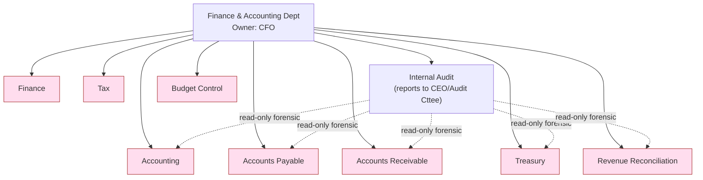

### 1.6 Position List ระดับฝ่าย (สรุป)
| Position | ระดับ | จำนวน [ASSUMPTION] | Clearance สูงสุด |
|---|---|---|---|
| Chief Financial Officer (CFO) | Department Head | 1 | RESTRICTED (all sub-units) |
| Finance Controller (สมุห์บัญชี) | Sub-dept Lead | 1 | RESTRICTED (Accounting+Reporting) |
| Sub-unit Managers (×9) | Team Lead | 9 | RESTRICTED (own sub-unit) |
| Senior/Junior Officers | Position | ~25 | HARD/MEDIUM ตาม grant |

---

## 2. Sub-Department: Accounting (บัญชี)

### 2.1 หน้าที่ (Responsibilities)
- ดูแล **Chart of Accounts (ผังบัญชี)**, ลงบัญชีแยกประเภท (General Ledger), บันทึก journal entries.
- ปิดบัญชี (month/quarter/year-end close), จัดทำ trial balance และงบการเงิน (P&L, Balance Sheet, Cash Flow).
- บันทึก accrual, prepaid, depreciation, deferred revenue, intercompany.
- ควบคุม fiscal period (เปิด/ปิดงวด) เพื่อล็อก post หลังปิดงบ.

### 2.2 Workflow — Month-End Close
| ขั้น | Input | Process | Output | Receiver | Approver |
|---|---|---|---|---|---|
| 1 | sub-ledger ทั้งหมด (AP/AR/Payroll/Bank) | รวบรวมรายการค้างจ่าย/ค้างรับ | accrual entries (draft) | Accountant | Finance Controller |
| 2 | draft entries | post เข้า `journal_entries`/`journal_lines` | posted GL | GL | Finance Controller (maker-checker) |
| 3 | posted GL | run trial balance, ตรวจ debit=credit | trial balance | Controller | CFO |
| 4 | trial balance | ปิด `fiscal_periods` (status=closed) | locked period | ทุก sub-unit | CFO |
| 5 | งวดที่ปิด | สร้างงบการเงิน | P&L/BS/CF | CEO Office, Audit Committee | CFO |

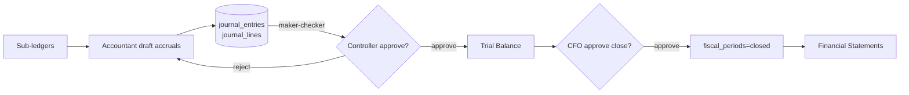

### 2.3 KPIs
| KPI | สูตร / นิยาม | Data Source | เป้า [ASSUMPTION] |
|---|---|---|---|
| Close cycle time | จำนวนวันทำการตั้งแต่สิ้นงวดถึงปิดงบ | `fiscal_periods.closed_at − period_end` | ≤ 5 วันทำการ |
| Journal accuracy | 1 − (entries แก้ไขหลัง post / entries ทั้งหมด) | `journal_entries.version`, audit | ≥ 99% |
| Unreconciled GL accounts | จำนวนบัญชีที่ยังไม่กระทบยอด ณ close | `journal_lines` vs sub-ledger | 0 |

### 2.4 Data Created / Used
| ตาราง | สถานะ | บทบาท | Security | Data Owner |
|---|---|---|---|---|
| `chart_of_accounts` | `[NEW]` | created | RESTRICTED | Finance Controller |
| `journal_entries` | `[NEW]` | created | RESTRICTED | Finance Controller |
| `journal_lines` | `[NEW]` | created | RESTRICTED | Finance Controller |
| `fiscal_periods` | `[NEW]` | created | HARD | CFO |
| `transactions` | `[EXISTS]`/`[ALTER]` | used (feed) | RESTRICTED | Accounting |
| `payroll_runs`, `vendor_payments`, `customer_receipts` | mixed | used | RESTRICTED | sub-units |

**DDL ตัวอย่าง (journal_entries) `[NEW]`:**
```sql
CREATE TABLE journal_entries (
  id TEXT PRIMARY KEY,
  company_id TEXT NOT NULL REFERENCES companies(id),
  branch_code TEXT REFERENCES branches(code),
  entry_no TEXT NOT NULL,
  entry_date DATE NOT NULL,
  fiscal_period_id TEXT NOT NULL REFERENCES fiscal_periods(id),
  memo TEXT,
  status TEXT NOT NULL DEFAULT 'draft' CHECK (status IN ('draft','posted','reversed')),
  security_level TEXT NOT NULL DEFAULT 'RESTRICTED'
    CHECK (security_level IN ('BASIC','MEDIUM','HARD','RESTRICTED')),
  is_active BOOLEAN NOT NULL DEFAULT TRUE,
  version INTEGER NOT NULL DEFAULT 1,
  created_at TIMESTAMPTZ NOT NULL DEFAULT NOW(),
  updated_at TIMESTAMPTZ NOT NULL DEFAULT NOW(),
  deleted_at TIMESTAMPTZ,
  created_by TEXT NOT NULL REFERENCES users(id),
  updated_by TEXT REFERENCES users(id),
  deleted_by TEXT REFERENCES users(id),
  CONSTRAINT uq_je UNIQUE (company_id, entry_no)
);
-- บังคับ debit = credit ผ่าน trigger หรือ application-level check บน journal_lines
CREATE INDEX idx_je_period ON journal_entries(company_id, fiscal_period_id, status);
```

### 2.5 Approval Flow
`Accountant (maker) → Finance Controller (checker/post) → CFO (close approval)`. SoD: maker ≠ checker (`approval_requests` CHECK `requester_id <> approver_id`).

### 2.6 Audit Log events
`journal.create`, `journal.update` (capture before/after lines), `journal.post`, `journal.reverse`, `journal.soft_delete`, `fiscal_period.close`, `fiscal_period.reopen` (RESTRICTED — flag high-severity), `coa.create/update`, `financial_statement.export`, `failed_access`, `blocked_access`.

### 2.7 Position List
| Position | สิทธิ์ |
|---|---|
| Finance Controller / สมุห์บัญชี | RESTRICTED — post, close, reverse |
| Senior Accountant (GL) | HARD — create/draft, ห้าม post |
| Accountant (AP/AR support) | MEDIUM — draft entries เฉพาะ scope |
| Accounting Clerk | MEDIUM — data entry, ห้ามดู salary |

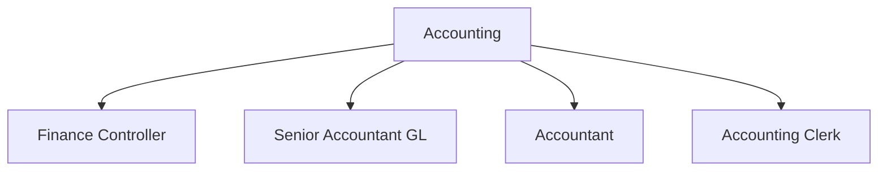

---

## 3. Sub-Department: Finance (การเงิน)

### 3.1 หน้าที่
- บริหารการเงินเชิงกลยุทธ์: cash flow forecasting, financial planning & analysis (FP&A), ลงทุน/กู้ยืม.
- ประสานงาน budget, variance, รายงานต่อ CEO/board.
- กำหนด financial policy, credit terms, capital expenditure (CapEx) review.

### 3.2 Workflow — Cash Flow Forecast & CapEx Approval
| ขั้น | Input | Process | Output | Receiver | Approver |
|---|---|---|---|---|---|
| 1 | AR aging, AP aging, bank balances | รวม inflow/outflow คาดการณ์ 13 สัปดาห์ | cash forecast | Finance Manager | CFO |
| 2 | CapEx request จากสาขา | ประเมิน ROI/payback | CapEx memo | CFO | CEO (เกินวงเงิน) |
| 3 | forecast + actual | variance analysis | FP&A report | CEO Office | CFO |

### 3.3 KPIs
| KPI | สูตร | Data Source | เป้า [ASSUMPTION] |
|---|---|---|---|
| Forecast accuracy | 1 − \|actual − forecast\| / actual | `cash_positions`, `bank_transactions` | ≥ 90% |
| Days Cash on Hand | cash / (operating expense/day) | `cash_positions` | ≥ 45 วัน |
| CapEx approval lead time | approve − submit | `approval_requests` | ≤ 3 วันทำการ |

### 3.4 Data Created / Used
| ตาราง | สถานะ | บทบาท | Security | Owner |
|---|---|---|---|---|
| `cash_positions` | `[NEW]` | created | RESTRICTED | Finance Manager |
| `approval_requests` (CapEx) | `[NEW]` | created | HARD | CFO |
| `budgets`, `budget_lines` | `[NEW]` | used | RESTRICTED | Budget Control |
| `bank_transactions` | `[NEW]` | used | RESTRICTED | Treasury |

### 3.5 Approval Flow
`Finance Manager → CFO → CEO (เกินวงเงิน [ASSUMPTION: > 1,000,000 THB))`.

### 3.6 Audit Log events
`forecast.create/update`, `capex.submit/approve/reject`, `fpa_report.export`, `financial_policy.change` (RESTRICTED), `failed_access`.

### 3.7 Position List
| Position | สิทธิ์ |
|---|---|
| Finance Manager | RESTRICTED — forecast, FP&A |
| FP&A Analyst | HARD — analysis, no payment rights |
| Treasury Liaison | MEDIUM — bank balance read |

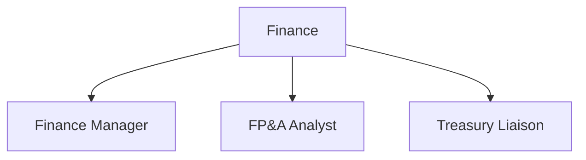

---

## 4. Sub-Department: Accounts Payable — AP (เจ้าหนี้/จ่ายเงิน)

### 4.1 หน้าที่
- รับ vendor invoice, ทำ **3-way match** (PO ↔ GR/รับของ ↔ invoice), ตั้งหนี้, จัดตารางจ่าย.
- จัดการ vendor master, หัก WHT, จ่ายเงิน (ร่วมกับ Treasury).

### 4.2 Workflow — Invoice-to-Pay (P2P)
| ขั้น | Input | Process | Output | Receiver | Approver |
|---|---|---|---|---|---|
| 1 | vendor invoice + PO (จาก Warehouse) | 3-way match | matched invoice | AP Officer | AP Manager |
| 2 | matched invoice | คำนวณ WHT, ตั้งหนี้ใน `vendor_invoices` | payable record | AP | AP Manager |
| 3 | payable record | สร้าง payment batch | `vendor_payments` (draft) | Treasury | CFO (maker-checker) |
| 4 | approved batch | จ่ายผ่านธนาคาร, ออก WHT cert | payment + `wht_certificates` | Vendor, Tax | Treasury |

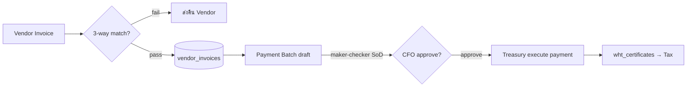

### 4.3 KPIs
| KPI | สูตร | Data Source | เป้า [ASSUMPTION] |
|---|---|---|---|
| Days Payable Outstanding (DPO) | (AP / COGS) × วัน | `vendor_invoices`, `journal_lines` | 30–45 วัน |
| On-time payment rate | จ่ายตรงเทอม / ทั้งหมด | `vendor_payments` | ≥ 98% |
| Invoice match exception rate | exceptions / invoices | `vendor_invoices` | ≤ 2% |
| Duplicate payment rate | dup detected / payments | `vendor_payments` + `detectAnomalies` | 0% |

### 4.4 Data Created / Used
| ตาราง | สถานะ | บทบาท | Security | Owner |
|---|---|---|---|---|
| `vendors` | `[NEW]` | created | HARD (bank acct = RESTRICTED) | AP Manager |
| `vendor_invoices` | `[NEW]` | created | RESTRICTED | AP Manager |
| `vendor_payments` | `[NEW]` | created | RESTRICTED | CFO |
| `wht_certificates` | `[NEW]` | created | RESTRICTED | Tax |
| PO / GR (Warehouse) | `[EXISTS via entities]` | used | MEDIUM | Warehouse |

### 4.5 Approval Flow
`AP Officer (maker) → AP Manager (verify match) → CFO (payment approve, checker) → Treasury (execute)`. **SoD บังคับ**: ผู้สร้าง invoice ≠ ผู้อนุมัติจ่าย ≠ ผู้จ่ายจริง.

### 4.6 Audit Log events
`vendor.create/update`, `vendor_bank_account.change` (RESTRICTED, high-severity — fraud vector), `invoice.create`, `invoice.match_exception`, `payment.batch_create`, `payment.approve/reject`, `payment.execute`, `wht_cert.issue`, `duplicate_payment.blocked`, `failed_access`.

### 4.7 Position List
| Position | สิทธิ์ |
|---|---|
| AP Manager | RESTRICTED — verify, ห้าม execute payment |
| AP Officer (Senior) | HARD — create invoice, match |
| AP Clerk | MEDIUM — data entry |

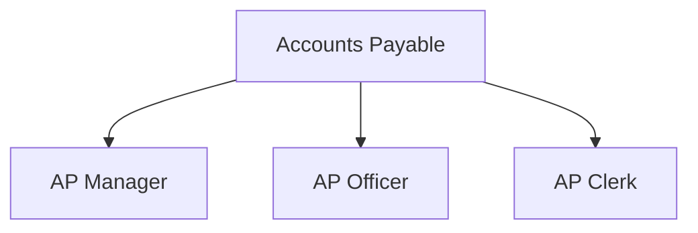

---

## 5. Sub-Department: Accounts Receivable — AR (ลูกหนี้/รับเงิน)

### 5.1 หน้าที่
- ออกใบแจ้งหนี้/ใบกำกับภาษี (tax invoice), รับชำระ, ติดตามหนี้ (collections/dunning), AR aging.
- กระทบยอดเงินรับกับ revenue ของคลินิก/แพ็กเกจ (ส่งต่อ Revenue Reconciliation).

### 5.2 Workflow — Order-to-Cash (O2C)
| ขั้น | Input | Process | Output | Receiver | Approver |
|---|---|---|---|---|---|
| 1 | บริการ/แพ็กเกจที่ขาย (จาก Medical/Dental/POS) | ออก `customer_invoices` + tax invoice | invoice | ลูกค้า/สาขา | AR Manager |
| 2 | เงินเข้า (POS/โอน/บัตร) | match กับ invoice → `customer_receipts` | receipt | AR | AR Manager |
| 3 | invoice ค้าง | dunning อัตโนมัติ (AI suggest, human approve) | reminder | ลูกค้า | AR Manager |
| 4 | overdue | escalate / write-off proposal | bad-debt entry | Accounting | CFO |

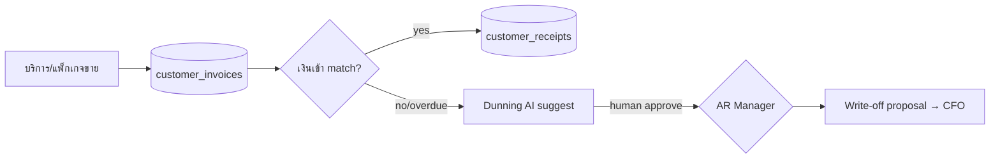

### 5.3 KPIs
| KPI | สูตร | Data Source | เป้า [ASSUMPTION] |
|---|---|---|---|
| Days Sales Outstanding (DSO) | (AR / revenue) × วัน | `customer_invoices`, `transactions` | ≤ 30 วัน |
| Collection effectiveness (CEI) | เก็บได้ / ที่ครบกำหนด | `customer_receipts` | ≥ 95% |
| Bad debt ratio | write-off / revenue | `journal_lines` | ≤ 0.5% |
| Unapplied cash | เงินรับที่ยัง match ไม่ได้ | `customer_receipts` | ≤ 1% |

### 5.4 Data Created / Used
| ตาราง | สถานะ | บทบาท | Security | Owner |
|---|---|---|---|---|
| `customer_invoices` | `[NEW]` | created | RESTRICTED (มี PII ลูกค้า) | AR Manager |
| `customer_receipts` | `[NEW]` | created | RESTRICTED | AR Manager |
| `patients` (เชื่อมโยงผู้รับบริการ) | `[EXISTS]` | used (read-min) | RESTRICTED | Medical/Dental |
| POS/แพ็กเกจ revenue | `[EXISTS via transactions]` | used | RESTRICTED | Operations |

> **หมายเหตุ cross-department:** AR เข้าถึง `patients` ได้เฉพาะ field ที่จำเป็นต่อการออกใบเสร็จ (ชื่อ-เลขที่ผู้ป่วย-ยอด) ผ่าน ABAC field-mask — **ห้าม** เห็นข้อมูล clinical. การ join ต้องผ่าน policy layer และถูก audit.

### 5.5 Approval Flow
`AR Officer (maker) → AR Manager (verify/receipt) → CFO (write-off > [ASSUMPTION: 20,000 THB))`.

### 5.6 Audit Log events
`invoice.issue`, `tax_invoice.issue`, `receipt.apply`, `receipt.unapply`, `dunning.send`, `writeoff.propose/approve`, `patient_billing.access` (RESTRICTED — log field-level), `failed_access`, `blocked_access`.

### 5.7 Position List
| Position | สิทธิ์ |
|---|---|
| AR Manager | RESTRICTED — receipt, write-off propose |
| AR Officer / Collections | HARD — invoice, dunning |
| Billing Clerk | MEDIUM — issue invoice เฉพาะ scope |

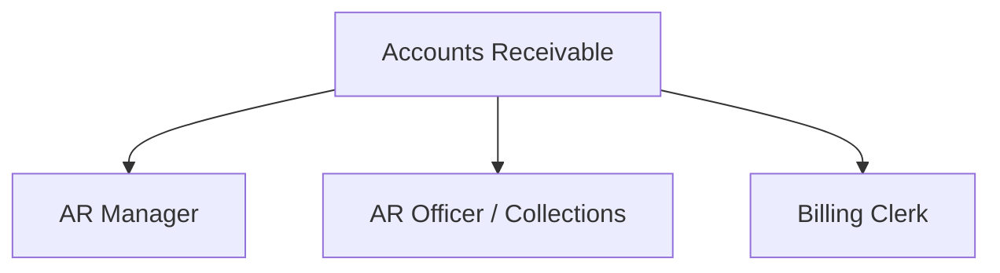

---

## 6. Sub-Department: Treasury (บริหารเงินสด/ธนาคาร)

### 6.1 หน้าที่
- บริหารบัญชีธนาคารทุกบัญชี, cash pooling, จ่ายเงินจริง (execution), ดูแล banking facility/วงเงิน.
- ดึง bank statement, นำเข้า `bank_transactions`, ทำ bank reconciliation ร่วม Accounting.

### 6.2 Workflow — Bank Reconciliation & Payment Execution
| ขั้น | Input | Process | Output | Receiver | Approver |
|---|---|---|---|---|---|
| 1 | approved payment batch (จาก AP) | execute โอนผ่าน bank/host-to-host | payment confirmation | Vendor/Payroll | Treasury Manager |
| 2 | bank statement | import → `bank_transactions` | bank ledger | Treasury | — |
| 3 | bank ledger vs GL | reconcile | recon report + exceptions | Accounting | Treasury Manager |
| 4 | exceptions | สอบ/แก้ | cleared items | Accounting | CFO |

### 6.3 KPIs
| KPI | สูตร | Data Source | เป้า [ASSUMPTION] |
|---|---|---|---|
| Bank recon completion | บัญชีกระทบยอดเสร็จ / ทั้งหมด | `bank_transactions` vs GL | 100% ภายใน 2 วันหลังสิ้นเดือน |
| Idle cash ratio | เงินไม่ก่อดอกผล / cash รวม | `cash_positions` | ≤ 10% |
| Payment execution error rate | failed/recalled / payments | `vendor_payments`, `bank_transactions` | 0% |

### 6.4 Data Created / Used
| ตาราง | สถานะ | บทบาท | Security | Owner |
|---|---|---|---|---|
| `bank_accounts` | `[NEW]` | created | RESTRICTED (เลขบัญชี/credential) | Treasury Manager |
| `bank_transactions` | `[NEW]` | created | RESTRICTED | Treasury Manager |
| `cash_positions` | `[NEW]` | created | RESTRICTED | Treasury Manager |
| `vendor_payments`, `payroll_runs` | mixed | used (execute) | RESTRICTED | AP / Payroll |

### 6.5 Approval Flow
`Treasury Officer (prepare) → Treasury Manager (verify) → CFO (release)`. การ execute payment ต้องอ้างอิง `approval_requests` ที่ approve แล้วเท่านั้น — Treasury **สร้าง payable เองไม่ได้** (SoD).

### 6.6 Audit Log events
`bank_account.create/update` (RESTRICTED, high-severity), `bank_statement.import`, `payment.execute`, `payment.recall`, `recon.complete`, `recon.exception`, `cash_position.snapshot`, `failed_access`.

### 6.7 Position List
| Position | สิทธิ์ |
|---|---|
| Treasury Manager | RESTRICTED — verify, release |
| Treasury Officer | HARD — prepare, import statement |
| Cashier (สาขา) | MEDIUM — petty cash เฉพาะสาขา |

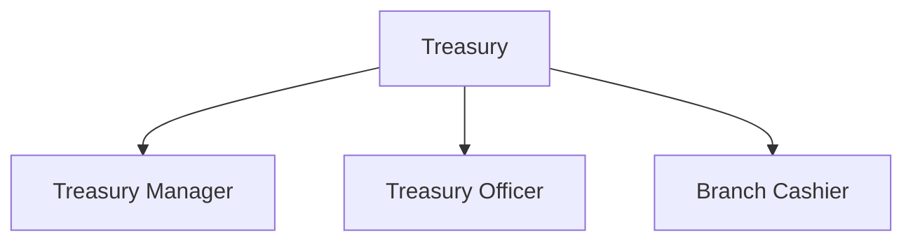

---

## 7. Sub-Department: Tax (ภาษี)

### 7.1 หน้าที่
- จัดทำและยื่นภาษีไทย: **PND.1** (WHT เงินเดือน), **PND.3/53** (WHT บริการ), **PP.30** (VAT), **PND.50/51** (CIT), นำส่ง **SSO**.
- ออก/รวบรวม WHT certificate, จัดการ tax invoice ขาเข้า-ออก, รับมือสรรพากร (tax audit), tax planning.

### 7.2 Workflow — Monthly Tax Filing
| ขั้น | Input | Process | Output | Receiver | Approver |
|---|---|---|---|---|---|
| 1 | `wht_certificates`, payroll, vendor payments | คำนวณ WHT/VAT | tax computation | Tax Officer | Tax Manager |
| 2 | tax computation | กรอกแบบ PND/PP | tax filing draft | Tax Manager | CFO |
| 3 | approved filing | ยื่น e-Filing สรรพากร, จ่ายภาษี | filed return + receipt | สรรพากร | CFO/Treasury |
| 4 | filed return | บันทึก `tax_filings`, archive | tax record | Accounting/Audit | Tax Manager |

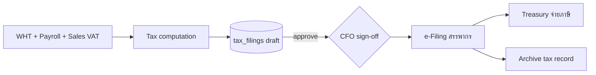

### 7.3 KPIs
| KPI | สูตร | Data Source | เป้า [ASSUMPTION] |
|---|---|---|---|
| On-time filing rate | ยื่นตรงกำหนด / ทั้งหมด | `tax_filings` | 100% |
| Penalty/surcharge incurred | ค่าปรับสะสม | `tax_filings`, `journal_lines` | 0 THB |
| WHT cert completeness | cert ออกครบ / payment ที่ต้องหัก | `wht_certificates` vs `vendor_payments` | 100% |
| Effective tax rate variance | \|ETR − planned\| | `tax_filings` | ≤ 2% |

### 7.4 Data Created / Used
| ตาราง | สถานะ | บทบาท | Security | Owner |
|---|---|---|---|---|
| `tax_filings` | `[NEW]` | created | RESTRICTED | Tax Manager |
| `wht_certificates` | `[NEW]` | used/created | RESTRICTED | Tax Manager |
| `payroll_runs`/`payslips` (WHT/SSO) | `[EXISTS]` | used | RESTRICTED | Payroll |
| `vendor_payments`, `customer_invoices` | `[NEW]` | used | RESTRICTED | AP/AR |

> **เชื่อมกับ engine เดิม:** `payroll-engine.ts` มี `calculateSSO` และ `calculateMonthlyTax` แล้ว `[EXISTS]` — Tax sub-unit ใช้ผลลัพธ์นี้เป็น source ของ PND.1/SSO โดยต้อง wire ผ่าน audit ทุกครั้ง.

### 7.5 Approval Flow
`Tax Officer (prepare) → Tax Manager (review) → CFO (sign-off ก่อนยื่น)`.

### 7.6 Audit Log events
`tax.compute`, `tax_filing.create/update`, `tax_filing.submit`, `tax_payment.execute`, `wht_cert.issue/collect`, `tax_audit.respond` (RESTRICTED), `failed_access`.

### 7.7 Position List
| Position | สิทธิ์ |
|---|---|
| Tax Manager | RESTRICTED — review, submit |
| Tax Officer | HARD — compute, draft |
| Tax Clerk | MEDIUM — รวบรวมเอกสาร |

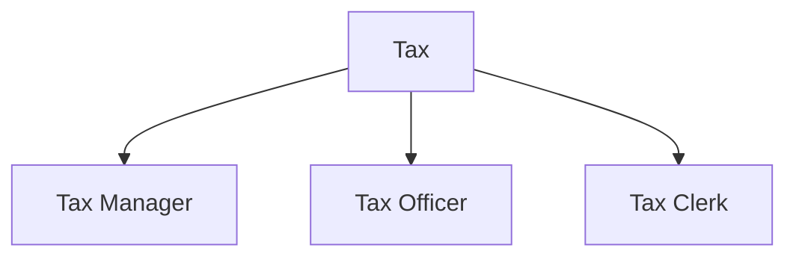

---

## 8. Sub-Department: Internal Audit (ตรวจสอบภายใน)

> **Independence:** Internal Audit รายงานตรงต่อ **CEO / Audit Committee** ไม่ขึ้นกับ CFO ในเชิง audit finding. ในระบบ: read-only forensic access ทุก sub-unit, **ห้ามแก้ transaction**.

### 8.1 หน้าที่
- ตรวจสอบการควบคุมภายใน (internal control), ทดสอบ SoD, ตรวจ compliance, สืบสวนทุจริต (fraud).
- ตรวจ audit trail, สุ่มทดสอบ payment/journal/revenue, ออก audit findings + ติดตามแก้ไข.

### 8.2 Workflow — Control Testing & Finding
| ขั้น | Input | Process | Output | Receiver | Approver |
|---|---|---|---|---|---|
| 1 | annual audit plan | สุ่ม sample (payment/journal/recon) | sample set | Auditor | Head of Internal Audit |
| 2 | sample + `audit_log` | ทดสอบ control, ตรวจ before/after | exceptions | Auditor | Head of IA |
| 3 | exceptions | จัดทำ `internal_audit_findings` (severity) | finding report | sub-unit + CFO + CEO | Head of IA |
| 4 | finding | ติดตาม remediation | closed/open status | Audit Committee | Head of IA |

### 8.3 KPIs
| KPI | สูตร | Data Source | เป้า [ASSUMPTION] |
|---|---|---|---|
| Audit plan completion | งานตรวจเสร็จ / แผน | `internal_audit_findings` | 100% |
| Finding remediation rate | finding ปิด / ทั้งหมด | `internal_audit_findings` | ≥ 90% ภายใน SLA |
| SoD violation detected | จำนวน violation พบ | `audit_log`, `approval_requests` | ติดตามแนวโน้มลดลง |
| Audit trail integrity | hash-chain ผ่าน / ตรวจ | `audit_log.prev_hash` | 100% |

### 8.4 Data Created / Used
| ตาราง | สถานะ | บทบาท | Security | Owner |
|---|---|---|---|---|
| `internal_audit_findings` | `[NEW]` | created | RESTRICTED | Head of Internal Audit |
| `audit_log` | `[EXISTS]`/`[ALTER]` | used (read-only) | RESTRICTED | System/IA |
| ทุก finance table | mixed | used (read-only forensic) | RESTRICTED | sub-unit owners |

> **ALTER `audit_log` `[ALTER]`:** เพิ่ม `before_state JSONB`, `after_state JSONB`, `changed_fields TEXT[]`, `ip_address`, `user_agent`, `request_id`, `session_id`, `endpoint`, `http_method`, `result`, `failure_reason`, `prev_hash`, `row_hash` (hash-chain tamper-evidence), `security_level`; REVOKE UPDATE/DELETE + trigger ป้องกันแก้ไข → **append-only**.

### 8.5 Approval Flow
`Auditor (draft finding) → Head of Internal Audit (issue) → Audit Committee (review)`. IA ไม่ผ่าน CFO ในการ issue finding (independence).

### 8.6 Audit Log events
`audit.sample_pull`, `audit.control_test`, `finding.create/update/close`, `forensic.access` (log ทุกการเปิดดูข้อมูล sub-unit), `sod_violation.flag`, `audit_log.integrity_check`.

### 8.7 Position List
| Position | สิทธิ์ |
|---|---|
| Head of Internal Audit | RESTRICTED — read-all (forensic), issue findings |
| Senior Internal Auditor | RESTRICTED — read-all, draft findings |
| IT Auditor | RESTRICTED — audit_log + ITGC |

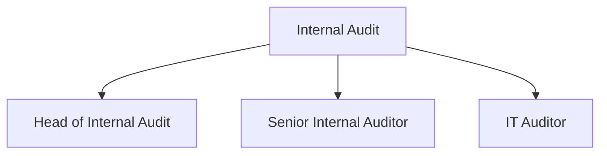

---

## 9. Sub-Department: Budget Control (ควบคุมงบประมาณ)

### 9.1 หน้าที่
- จัดทำงบประมาณประจำปี/สาขา, ควบคุม budget vs actual, อนุมัติ/บล็อกค่าใช้จ่ายเกินงบ (budget gatekeeping), variance analysis.

### 9.2 Workflow — Budget Cycle & Commitment Control
| ขั้น | Input | Process | Output | Receiver | Approver |
|---|---|---|---|---|---|
| 1 | strategic plan + historical actual | สร้าง `budgets`/`budget_lines` ต่อสาขา | draft budget | Budget Analyst | CFO |
| 2 | draft budget | board review | approved budget | ทุก sub-unit | CEO |
| 3 | ใบขอใช้จ่าย (จาก AP/sub-units) | ตรวจ budget availability | approve/block | requester | Budget Manager |
| 4 | actual (จาก GL) | budget vs actual | variance report | CFO/CEO | Budget Manager |

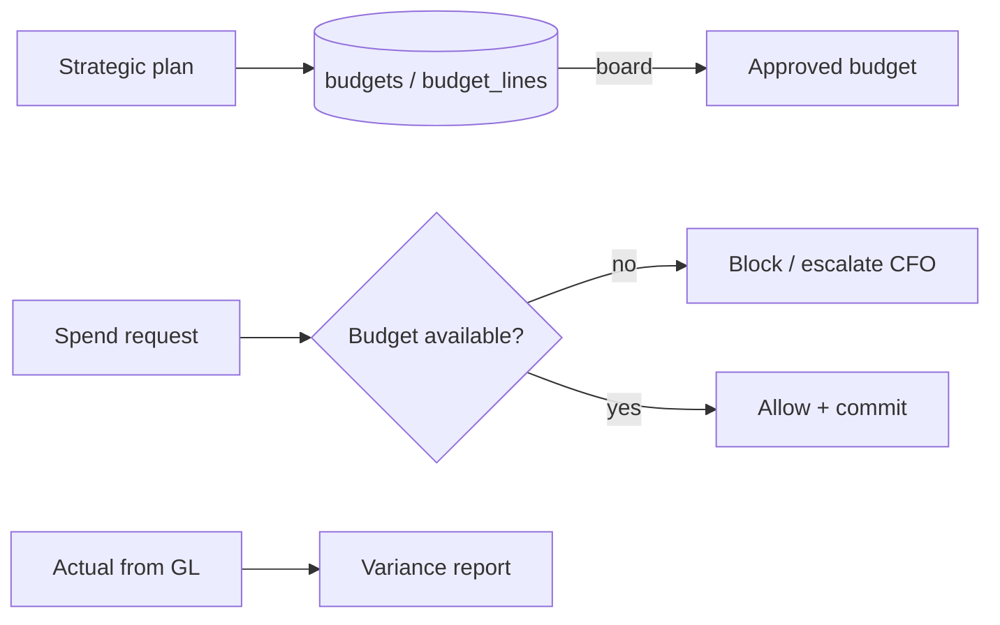

### 9.3 KPIs
| KPI | สูตร | Data Source | เป้า [ASSUMPTION] |
|---|---|---|---|
| Budget variance | (actual − budget)/budget | `budget_lines` vs `journal_lines` | ภายใน ±5% |
| Over-budget blocked | คำขอเกินงบที่ถูกบล็อก | `approval_requests`, `budget_lines` | 100% ถูกบล็อก |
| Budget cycle time | วันจัดทำงบเสร็จ | `budgets` | ≤ 30 วัน |

### 9.4 Data Created / Used
| ตาราง | สถานะ | บทบาท | Security | Owner |
|---|---|---|---|---|
| `budgets` | `[NEW]` | created | RESTRICTED | Budget Manager |
| `budget_lines` | `[NEW]` | created | RESTRICTED | Budget Manager |
| `journal_lines` (actual) | `[NEW]` | used | RESTRICTED | Accounting |
| `kpi_entries` | `[EXISTS]` | used | MEDIUM | Owner |

### 9.5 Approval Flow
`Budget Analyst (draft) → Budget Manager (commit control) → CFO → CEO (annual budget)`.

### 9.6 Audit Log events
`budget.create/update`, `budget.approve`, `spend.budget_check`, `spend.blocked` (over-budget), `variance_report.export`, `failed_access`.

### 9.7 Position List
| Position | สิทธิ์ |
|---|---|
| Budget Manager | RESTRICTED — commit control |
| Budget Analyst | HARD — draft, variance |

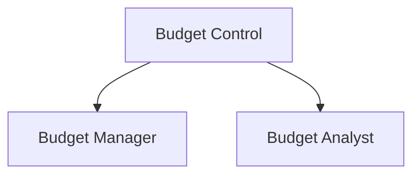

---

## 10. Sub-Department: Revenue Reconciliation (กระทบยอดรายได้)

### 10.1 หน้าที่
- กระทบยอดรายได้จากทุก **touchpoint** (POS สาขา, ระบบนัดหมาย, แพ็กเกจ/คอร์ส, e-commerce, แฟรนไชส์) กับเงินเข้าธนาคารจริง.
- ตรวจหา **revenue leakage**, ส่วนต่าง, discount ผิดปกติ, void/refund ที่ผิดปกติ — สำคัญมากสำหรับคลินิกแฟรนไชส์ที่มีหลายสาขา.

### 10.2 Workflow — Daily Revenue Reconciliation (3-way: POS ↔ System ↔ Bank)
| ขั้น | Input | Process | Output | Receiver | Approver |
|---|---|---|---|---|---|
| 1 | POS sales, นัดหมายที่ปิด, package redemption | รวมยอดขายต่อสาขาต่อวัน | expected revenue | Recon Officer | Recon Manager |
| 2 | `customer_receipts` + `bank_transactions` | match expected vs actual cash | `revenue_reconciliation` rows | Recon | Recon Manager |
| 3 | ส่วนต่าง | จัดประเภท (timing/leakage/error/fraud) | exception list | AR/Treasury/IA | Recon Manager |
| 4 | exception | escalate / แก้ไข | cleared / fraud case → IA | CFO/IA | Recon Manager |

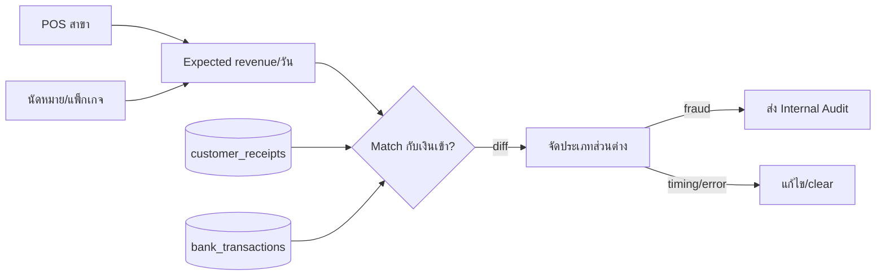

### 10.3 KPIs
| KPI | สูตร | Data Source | เป้า [ASSUMPTION] |
|---|---|---|---|
| Daily recon completion | สาขาที่กระทบยอดเสร็จ / ทั้งหมด | `revenue_reconciliation` | 100% ภายใน T+1 |
| Revenue leakage rate | leakage / รายได้รวม | `revenue_reconciliation` | ≤ 0.3% |
| Unmatched revenue (aging) | ยอด unmatched > 3 วัน | `revenue_reconciliation` | ≈ 0 |
| Suspicious void/refund flagged | รายการผิดปกติที่ flag | `revenue_reconciliation` + AI anomaly | ติดตามทุกราย |

### 10.4 Data Created / Used
| ตาราง | สถานะ | บทบาท | Security | Owner |
|---|---|---|---|---|
| `revenue_reconciliation` | `[NEW]` | created | RESTRICTED | Recon Manager |
| `transactions` (income, POS feed) | `[EXISTS]`/`[ALTER]` | used | RESTRICTED | Operations/Finance |
| `customer_receipts`, `bank_transactions` | `[NEW]` | used | RESTRICTED | AR/Treasury |
| `branches` | `[EXISTS]` (v8) | used (scope) | MEDIUM | Operations |

### 10.5 Approval Flow
`Recon Officer (match) → Recon Manager (verify exceptions) → CFO (sign-off) / IA (fraud escalation)`.

### 10.6 Audit Log events
`recon.run`, `recon.match`, `recon.exception_flag`, `revenue_leakage.detect`, `void_refund.suspicious_flag`, `fraud_case.escalate` (→ IA), `failed_access`.

### 10.7 Position List
| Position | สิทธิ์ |
|---|---|
| Revenue Recon Manager | RESTRICTED — verify, sign-off |
| Recon Officer | HARD — match, flag |
| Branch Revenue Clerk | MEDIUM — รายงานยอดสาขาตน |

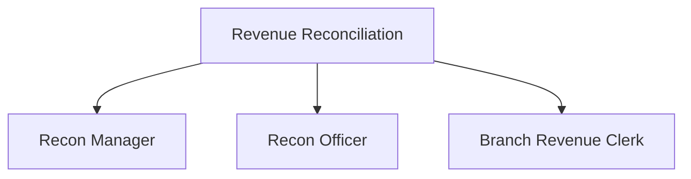

---

## 11. Payroll Note (เงินเดือน — joint Finance × HR)

Payroll เป็น cross-department: **ข้อมูลพนักงาน/อัตรา = People (HR)** แต่ **คำนวณ/อนุมัติ/จ่าย = Finance** (dual-control). ตารางมีอยู่แล้ว `[EXISTS]` (`payroll_runs`, `payroll_items`, `payslips`, `salary_history`, `salary_advances`) + engine `[EXISTS]` (`calculatePayslip`, `calculateOT`, `calculateSSO`, `calculateMonthlyTax`, `detectAnomalies`).

**Security:** ทุกตาราง payroll = **RESTRICTED**. Field salary mask อยู่แล้วบางส่วนใน `encryption.ts` (T2/T3) `[EXISTS]` — ต้อง map T-tier เดิม → 4 ระดับใหม่ (`RESTRICTED`) และ enforce ใน AI path (ปัจจุบัน mask ไม่ทำงานใน AI path — gap).

**Approval Flow:** `HR (ยืนยันข้อมูล/วันทำงาน) → Payroll Officer (run engine) → Finance Controller (verify, anomaly review) → CFO (approve run) → Treasury (execute)`.

**Audit Log:** `payroll.run`, `payroll.anomaly_flag`, `payslip.generate`, `payslip.access` (RESTRICTED, field-level), `salary.change`, `advance.request/approve`, `payroll.approve`, `payroll.execute`.

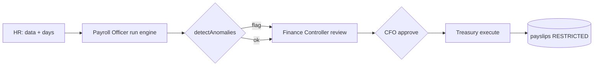

---

## 12. RBAC + ABAC + Data-Ownership Model (Finance scope)

### 12.1 Resolution order (deny-by-default)
1. **Tenant:** `company_id = session.company_id` (บังคับใน policy layer, ไม่พึ่ง WHERE manual) — ถ้าไม่ match → deny.
2. **RBAC:** `role ∈ {finance, admin, ceo}` หรือ `permission_group` ที่ grant → ผ่าน module gate.
3. **ABAC:** attribute `finance_subunit` ของ user ต้องตรงกับ resource sub-unit (เช่น AP officer เห็นเฉพาะ AP) เว้น CFO/IA.
4. **Data-Ownership:** action ที่ระดับ HARD/RESTRICTED ต้องเป็น owner หรือมี explicit grant ใน `approval_requests`/grant table.
5. **Security-level gate:** RESTRICTED ต้อง **direct grant** เท่านั้น — แม้ role finance ก็ไม่เห็น cross-subunit RESTRICTED โดยอัตโนมัติ.

### 12.2 ABAC attributes ที่ต้องเพิ่ม `[NEW]`
`finance_subunit` (accounting|finance|ap|ar|treasury|tax|internal_audit|budget|revenue_recon), `branch_scope` (สาขา/ทั้งหมด), `payment_authority_limit` (THB), `can_approve` (bool).

### 12.3 Segregation of Duties Matrix (highlight)
| การกระทำ | สร้าง (Maker) | อนุมัติ (Checker) | จ่ายจริง (Executor) |
|---|---|---|---|
| Vendor payment | AP Officer | CFO | Treasury |
| Payroll | Payroll Officer | CFO (via Controller) | Treasury |
| Journal post | Accountant | Finance Controller | — |
| Write-off | AR Officer | CFO | — |
> เงื่อนไขบังคับ: `requester_id <> approver_id <> executor_id` (CHECK + policy + IA monitoring).

---

## 13. AI Access Control (Finance-specific)

AI **ไม่อ่าน DB โดยตรง**. Flow บังคับสำหรับทุกคำถามที่แตะ Finance data:
```
user query
 → identify user (JWT)
 → resolve role + finance_subunit + clearance + branch_scope
 → policy filter: เลือกเฉพาะ row/field ที่ user เห็นได้ (RESTRICTED ต้อง direct grant)
 → redaction: mask amount/salary/bank_acct/tax_id ก่อนส่ง prompt เข้า external model
 → askWithFallback (ai-providers.ts)
 → output redaction check: ห้าม leak ข้อมูลที่ user เห็นไม่ได้
 → audit: บันทึก ai_query_logs (prompt+response+provider+model+tokens+latency+grounded+redaction_status) linked by request_id
```
**Gaps ที่ต้องปิด (ground กับ inventory):** ปัจจุบัน `ai-router.ts` ส่ง full org context + raw prompt เข้า provider **โดยไม่ redact** (`sanitize.ts`/`encryption.ts` ไม่ได้อยู่ใน AI path) และ `ai_logs` ไม่เก็บ prompt/response/provider. ต้องเพิ่ม `ai_query_logs` `[NEW]` + Finance redaction policy (PII/PDPA + financial figures) ก่อน production.

**Finance redaction rules:** salary, bank account, tax ID (เลขผู้เสียภาษี), vendor/customer bank, payment amount > threshold → **mask** เว้น user มี RESTRICTED grant ตรง field นั้น. ทุกการ AI access ข้อมูล RESTRICTED → audit `ai_query` + `ai_response` พร้อม `redaction_status`.

---

## 14. Audit Log — Finance Events Catalogue (append-only)

ทุก event เขียนลง `audit_log` (ต้อง `[ALTER]` ให้ append-only + before/after + hash-chain ตาม §8.4) พร้อม: `actor, role, finance_subunit, target_table, target_id, target_security_level, before_state, after_state, changed_fields, ip, device, user_agent, request_id, session_id, endpoint, http_method, result, failure_reason, created_at`. AI events แยกไป `ai_query_logs` `[NEW]` linked by `request_id`. Retention: financial/tax records ≥ **5 ปี** **[ASSUMPTION: ตามประมวลรัษฎากร/พรบ.บัญชี]**, audit_log ≥ **7 ปี [ASSUMPTION]**, immutable.

| หมวด | Events (ตัวอย่าง) | Security |
|---|---|---|
| Auth | `login`, `logout`, `failed_login`, `impersonation` | HARD |
| Journal/GL | `journal.create/update/post/reverse`, `fiscal_period.close/reopen` | RESTRICTED |
| Payment (AP/Treasury) | `payment.batch_create/approve/reject/execute/recall`, `vendor_bank_account.change` | RESTRICTED |
| Receivable (AR) | `invoice.issue`, `receipt.apply/unapply`, `writeoff.propose/approve`, `patient_billing.access` | RESTRICTED |
| Tax | `tax_filing.create/submit`, `tax_payment.execute`, `wht_cert.issue` | RESTRICTED |
| Payroll | `payroll.run/approve/execute`, `payslip.access`, `salary.change` | RESTRICTED |
| Budget | `budget.approve`, `spend.blocked`, `variance_report.export` | RESTRICTED |
| Revenue Recon | `recon.run/exception_flag`, `revenue_leakage.detect`, `fraud_case.escalate` | RESTRICTED |
| Internal Audit | `forensic.access`, `finding.create/close`, `sod_violation.flag`, `audit_log.integrity_check` | RESTRICTED |
| Access control | `permission_change`, `role_change`, `grant.create/revoke`, `failed_access`, `blocked_access` | HARD/RESTRICTED |
| Data lifecycle | `soft_delete`, `restore`, `export`, `download`, `upload` | ตาม target |
| AI | `ai_query`, `ai_response`, `ai_redaction_applied`, `ai_blocked_access` (→ `ai_query_logs`) | RESTRICTED |

---

## 15. Migration Checklist (Finance Department)

| # | Migration | สถานะ | หมายเหตุ |
|---|---|---|---|
| 1 | `[ALTER]` `transactions` + `chart_of_accounts`/`journal_*`/`fiscal_periods` | `[NEW]`+`[ALTER]` | double-entry GL, security_level, soft-delete, version |
| 2 | `vendors`, `vendor_invoices`, `vendor_payments`, `wht_certificates` | `[NEW]` | P2P + WHT |
| 3 | `customer_invoices`, `customer_receipts` | `[NEW]` | O2C |
| 4 | `bank_accounts`, `bank_transactions`, `cash_positions` | `[NEW]` | Treasury |
| 5 | `tax_filings` | `[NEW]` | PND/PP/CIT/SSO |
| 6 | `budgets`, `budget_lines` | `[NEW]` | Budget control |
| 7 | `revenue_reconciliation` | `[NEW]` | leakage prevention |
| 8 | `internal_audit_findings` | `[NEW]` | IA independence |
| 9 | `approval_requests`, `approval_steps` (SoD/maker-checker) | `[NEW]` | ใช้ร่วมทุก sub-unit |
| 10 | `[ALTER]` `audit_log` → append-only + before/after + hash-chain + ip/ua/request_id | `[ALTER]` | ปิด gap #1 |
| 11 | `ai_query_logs` + Finance redaction policy | `[NEW]` | ปิด gap #4 |
| 12 | ABAC attributes (`finance_subunit`, `payment_authority_limit`, …) + policy engine | `[NEW]` | ปิด gap #2 |

> ทุกตารางใหม่ต้องมี standard columns: `id, company_id, created_at, updated_at, deleted_at, created_by, updated_by, deleted_by, is_active, version, security_level` + FK/UNIQUE/CHECK/composite index. Deploy ผ่าน `railway up` ต่อ service (ไม่ใช่ GitHub auto-deploy) — migration รันใน `runMigrations()` ตอน boot ของ `nexus-api`.

---

*สิ้นสุดเอกสาร — Finance & Accounting Department Breakdown (Production-Ready).*
