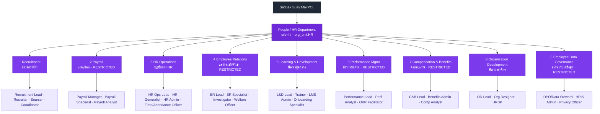
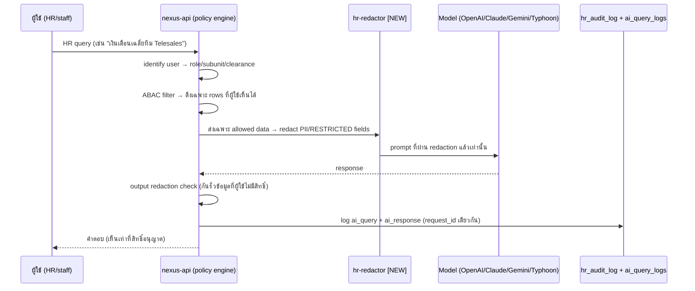

# 06 — Department Breakdown: People (HR) Department

> เอกสารสถาปัตยกรรมระดับ **Production-Grade** สำหรับ "ฝ่ายบุคคล (People / HR)" ของ **Saduak Suay Mai PCL** บน **NEXUS OS** (Next.js 16 + Express + PostgreSQL, Railway: `nexus-web`, `nexus-api`, Postgres)
>
> หลักการบังคับ: **deny-by-default**, RBAC + ABAC + Data-Ownership บังคับใน **backend** ทุก API และ **ทุก AI query**, audit log แบบ **append-only**, security 4 ระดับ (BASIC / MEDIUM / HARD / RESTRICTED). ข้อมูล HR ส่วนใหญ่คือ **PII + ข้อมูลการเงินบุคคล** ดังนั้น **ทุก view/edit/download/export ต้องถูก audit ทั้งหมด**
>
> สัญลักษณ์สถานะระบบ: **[EXISTS]** = มีในโค้ดปัจจุบัน · **[NEW]** = ต้องสร้าง migration ใหม่ · **[ASSUMPTION]** = สมมติฐานที่สมจริงสำหรับคลินิกความงาม+ทันตกรรมในไทย (ยังไม่ยืนยันข้อมูลจริง)

---

## 0. บทสรุปผู้บริหาร (Executive Summary)

ฝ่าย People (HR) เป็น **เจ้าของข้อมูลที่อ่อนไหวที่สุดในองค์กรรองจาก Medical/Dental** — ครอบคลุม PII พนักงาน, เงินเดือน/สัญญา/ภาษี, การประเมินผล, การสืบสวนวินัย และข้อมูลสุขภาพพนักงาน (ใบรับรองแพทย์, ลาคลอด, ลาป่วย). ภายใต้กฎหมายไทย ฝ่ายนี้ต้องสอดคล้องกับ **PDPA (พ.ร.บ.คุ้มครองข้อมูลส่วนบุคคล 2562)**, **พ.ร.บ.คุ้มครองแรงงาน 2541**, **พ.ร.บ.ประกันสังคม 2533**, และ **ประมวลรัษฎากร (ภ.ง.ด.1/1ก, 50 ทวิ, ก.ท.20)**.

ฝ่าย HR แบ่งเป็น **9 sub-units**:

| # | Sub-Unit (EN) | ชื่อไทย | Security เด่น | Data Owner |
|---|---------------|---------|---------------|------------|
| 1 | Recruitment | สรรหาว่าจ้าง | HARD (ผู้สมัคร = RESTRICTED) | Recruitment Lead |
| 2 | Payroll | เงินเดือน | **RESTRICTED** | Payroll Manager |
| 3 | HR Operations | ปฏิบัติการ HR | MEDIUM–HARD | HR Ops Lead |
| 4 | Employee Relations | แรงงานสัมพันธ์ | **RESTRICTED** (สืบสวน) | ER Lead |
| 5 | Learning & Development | พัฒนาบุคลากร | MEDIUM | L&D Lead |
| 6 | Performance Management | บริหารผลงาน | **RESTRICTED** (AI eval) | Perf. Lead |
| 7 | Compensation & Benefits | ค่าตอบแทน-สวัสดิการ | **RESTRICTED** | C&B Lead |
| 8 | Organization Development | พัฒนาองค์กร | HARD | OD Lead |
| 9 | Employee Data Governance | ธรรมาภิบาลข้อมูลพนักงาน | **RESTRICTED** | DPO / HR Data Steward |

**Mapping กับ NEXUS OS ปัจจุบัน:** role `hr` **[EXISTS]** ใน `rbac.ts`; module `people`, `payroll`, `advances`, `org`, `reports` **[EXISTS]**; ตาราง HR ~30 ตาราง **[EXISTS]** (`employee_profiles`, `payroll_*`, `payslips`, `leave_*`, `time_attendance`, `salary_history` ฯลฯ). สิ่งที่ **[NEW]** หลัก: ระบบ recruitment (ATS), performance/OKR, training/LMS, ER/case management, การฝัง `security_level` + soft-delete + version ในทุกตาราง HR, และ `data_ownership` model.

---

## 1. ตำแหน่งในผังองค์กร & Mermaid Sub-Tree

โครงสร้าง: **Company → Department → Sub-Department → Team/Unit → Position → Employee**



**Mapping กับ `org_units` [EXISTS]:** ปัจจุบัน HR ถูก seed เป็น org_unit level-2 จาก `DEPARTMENT_DEFINITIONS` (`hr-init.ts`). Sub-units 9 ตัวข้างต้นเป็น **[NEW]** ที่ต้อง insert เป็น level-3 (`parent_id = HR`) และ positions ต่อ sub-unit เป็น **[NEW]** rows ใน `positions` (ปัจจุบัน seed เพียง 4 ตำแหน่ง generic).

---

## 2. หน้าที่ของฝ่าย HR (Department-Level Responsibilities)

| # | หน้าที่ (responsibility) | ระบบ NEXUS ที่เกี่ยวข้อง |
|---|--------------------------|--------------------------|
| 1 | บริหารวงจรชีวิตพนักงานเต็มรูปแบบ (Hire→Retire) | `employee_profiles` [EXISTS], ATS [NEW] |
| 2 | จ่ายเงินเดือน + ประกันสังคม + หัก ณ ที่จ่าย ถูกต้องตรงเวลา | `payroll_runs`/`payslips` [EXISTS] |
| 3 | บริหารเวลาทำงาน, การลา, OT, กะ | `time_attendance`,`leave_requests`,`overtime_requests` [EXISTS] |
| 4 | สรรหาและจ้างงานตาม headcount plan | ATS [NEW] |
| 5 | พัฒนาทักษะพนักงาน + onboarding | `onboarding_state`,`skill_scores` [EXISTS], LMS [NEW] |
| 6 | บริหารผลงาน/KPI/OKR + AI evaluation | `kpi_entries` [EXISTS], OKR+eval [NEW] |
| 7 | ออกแบบโครงสร้างค่าตอบแทน + สวัสดิการ | `salary_history`,`payroll_items` [EXISTS], comp band [NEW] |
| 8 | แรงงานสัมพันธ์ + วินัย + สืบสวน + ร้องทุกข์ | ER case mgmt [NEW] |
| 9 | พัฒนาองค์กร + ผังตำแหน่ง + succession | `org_units`,`positions` [EXISTS] |
| 10 | ธรรมาภิบาลข้อมูลพนักงาน + PDPA + consent + DSAR | `consent_logs` [NEW], data classification [NEW] |
| 11 | รายงานต่อ CEO Office / Finance / หน่วยงานรัฐ (สปส./สรรพากร) | `reports` module [EXISTS] |

**RESTRICTED by default ในฝ่ายนี้:** Salary/Payroll/Contract/Tax, HR investigation (ER), AI evaluation (Performance), Executive notes, ข้อมูลผู้สมัคร, ข้อมูลสุขภาพพนักงาน. การเข้าถึงต้อง **direct grant** เท่านั้น แม้แต่ role `hr` ทั่วไปก็ไม่เห็นถ้าไม่อยู่ใน sub-unit เจ้าของและไม่มี clearance.

---

## 3. Data Classification Matrix (ฝ่าย HR)

| Data Domain | ตาราง (สถานะ) | Security Level | Data Owner | เหตุผล |
|-------------|----------------|----------------|------------|--------|
| โปรไฟล์พนักงานพื้นฐาน (ชื่อ, ตำแหน่ง, แผนก) | `employee_profiles` [EXISTS+ALTER] | **MEDIUM** | HR Ops Lead | เปิดในแผนกได้บางส่วน |
| PII อ่อนไหว (เลขบัตร ปชช., บัญชีธนาคาร, ที่อยู่) | `employee_profiles.personal_tax_id/bank_account` [EXISTS] | **RESTRICTED** | DPO | PDPA ข้อมูลอ่อนไหว |
| เงินเดือน / payslip / สัญญา / ภาษี | `payslips`,`payroll_items`,`salary_history` [EXISTS] | **RESTRICTED** | Payroll Manager | การเงินบุคคล |
| ใบสมัคร / ประวัติผู้สมัคร | `applicants`,`applications` [NEW] | **RESTRICTED** | Recruitment Lead | PII บุคคลภายนอก |
| เวลา/ลา/OT | `time_attendance`,`leave_requests`,`overtime_requests` [EXISTS] | **MEDIUM** (มี medical cert = RESTRICTED) | HR Ops Lead | บางส่วนมีข้อมูลสุขภาพ |
| ผลประเมิน / OKR / AI eval | `performance_reviews`,`okrs`,`ai_evaluations` [NEW] | **RESTRICTED** | Performance Lead | AI evaluation |
| เคสวินัย/สืบสวน/ร้องทุกข์ | `er_cases`,`er_case_notes` [NEW] | **RESTRICTED** | ER Lead | HR investigation |
| สวัสดิการ/เคลม | `benefit_enrollments`,`benefit_claims` [NEW] | **HARD** (เคลมสุขภาพ = RESTRICTED) | C&B Lead | บางส่วนข้อมูลสุขภาพ |
| โครงสร้างองค์กร/ตำแหน่ง | `org_units`,`positions` [EXISTS] | **BASIC**–MEDIUM | OD Lead | เปิดทั่วไป (ผังตำแหน่ง) |
| Consent / DSAR / data map | `consent_logs`,`dsar_requests` [NEW] | **HARD** | DPO | กำกับ PDPA |

> **กฎเหล็ก:** ทุกฟิลด์ RESTRICTED ที่ออกนอกระบบ (download/export/AI prompt) ต้องผ่าน **redaction layer [NEW]** ก่อนเสมอ. ปัจจุบัน `sanitize.ts` ลบเฉพาะ `password_hash` และ `encryption.ts` mask salary ตาม tier — **ยังไม่อยู่ใน AI path** จึงต้องสร้าง `hr-redactor` ใหม่.

---

## 4. มาตรฐานตาราง HR (Core Table Contract) — [NEW migration]

ทุกตาราง HR ต้อง ALTER/CREATE ให้มีคอลัมน์มาตรฐานองค์กร (ปัจจุบันตาราง HR **ไม่มี** `deleted_at`/`version`/`security_level`):

```sql
-- Template ที่ทุกตาราง HR ต้องมี (NEW)
ALTER TABLE <hr_table>
  ADD COLUMN IF NOT EXISTS company_id     TEXT NOT NULL REFERENCES companies(id),
  ADD COLUMN IF NOT EXISTS created_at     TIMESTAMPTZ NOT NULL DEFAULT NOW(),
  ADD COLUMN IF NOT EXISTS updated_at     TIMESTAMPTZ NOT NULL DEFAULT NOW(),
  ADD COLUMN IF NOT EXISTS deleted_at     TIMESTAMPTZ,                 -- soft-delete
  ADD COLUMN IF NOT EXISTS created_by     TEXT REFERENCES users(id),
  ADD COLUMN IF NOT EXISTS updated_by     TEXT REFERENCES users(id),
  ADD COLUMN IF NOT EXISTS deleted_by     TEXT REFERENCES users(id),
  ADD COLUMN IF NOT EXISTS is_active      BOOLEAN NOT NULL DEFAULT TRUE,
  ADD COLUMN IF NOT EXISTS version        INTEGER NOT NULL DEFAULT 1, -- optimistic lock
  ADD COLUMN IF NOT EXISTS security_level TEXT NOT NULL DEFAULT 'MEDIUM'
       CHECK (security_level IN ('BASIC','MEDIUM','HARD','RESTRICTED'));

-- composite index มาตรฐานทุกตาราง
CREATE INDEX IF NOT EXISTS ix_<t>_company_active
  ON <hr_table>(company_id, is_active) WHERE deleted_at IS NULL;
```

**Append-only HR audit (เสริมจาก `audit_log` [EXISTS] ที่ยังขาด before/after/ip/hash-chain):**

```sql
-- NEW: ตาราง audit เฉพาะ HR ที่ทุก event ทุก field ต้องลง พร้อม hash-chain
CREATE TABLE hr_audit_log (
  id              TEXT PRIMARY KEY,
  company_id      TEXT NOT NULL,
  actor_user_id   TEXT NOT NULL,
  actor_role      TEXT NOT NULL,
  actor_subunit   TEXT,                          -- recruitment/payroll/...
  action          TEXT NOT NULL,                 -- view/search/create/update/delete/soft_delete/restore/upload/download/export/approve/reject/permission_change/role_change/ai_query/ai_response/failed_access/blocked_access/login/logout
  target_table    TEXT NOT NULL,
  target_id       TEXT,
  target_security_level TEXT NOT NULL,
  before_json     JSONB,
  after_json      JSONB,
  changed_fields  TEXT[],
  ip              INET,
  device          TEXT,
  user_agent      TEXT,
  request_id      TEXT NOT NULL,
  session_id      TEXT,
  endpoint        TEXT,
  http_method     TEXT,
  result          TEXT NOT NULL CHECK (result IN ('success','denied','error')),
  failure_reason  TEXT,
  prev_hash       TEXT,                           -- tamper-evident chain
  row_hash        TEXT NOT NULL,
  created_at      TIMESTAMPTZ NOT NULL DEFAULT NOW()
);
-- บังคับ append-only: revoke UPDATE/DELETE + trigger ป้องกัน
REVOKE UPDATE, DELETE ON hr_audit_log FROM PUBLIC;
-- AI logs แยกตาราง แต่ link ด้วย request_id (ดู §6)
```

---

## 5. การบังคับสิทธิ์ (RBAC + ABAC + Data-Ownership) สำหรับ HR

**Policy decision (backend, ทุก request):**

```
allow = RBAC(role,module) AND ABAC(department,subunit,clearance,record_security)
        AND OWNERSHIP(owner_id|subunit_id) AND TENANT(company_id)
default = DENY
```

| มิติ | กฎ HR | สถานะ |
|------|-------|-------|
| RBAC | role `hr` เข้าถึง module `people/payroll/advances/org/reports`; `staff` เห็นเฉพาะ self (`mydata`) | [EXISTS] บางส่วน |
| ABAC department | `departmentScope(hr)` คืน `null` (เห็นทั้งองค์กร) — **ต้องจำกัด**: HR ทั่วไปไม่ควรเห็น payroll/ER โดยอัตโนมัติ | [EXISTS→ต้องแก้] |
| ABAC sub-unit | RESTRICTED records เห็นได้เฉพาะ actor ที่ `subunit = owner_subunit` **และ** มี clearance | [NEW] |
| ABAC security_level | BASIC≤MEDIUM(dept)≤HARD(mgr/HR)≤RESTRICTED(direct grant) | [NEW] |
| Data-Ownership | ทุกเคส ER, payslip, eval มี `owner_id`/`owner_subunit`; self-access ผ่าน `subject_user_id = actor` | [NEW] |
| Tenant | `company_id = $1` ทุก query (ปัจจุบัน manual) → ต้องมี guard helper | [EXISTS→harden] |

> **ห้าม self-approval / self-evaluation:** actor ที่เป็น subject ของเคส (เช่น ประเมินตัวเอง, อนุมัติเงินเดือนตัวเอง, สืบสวนเคสที่ตัวเองเกี่ยวข้อง) ต้องถูก block อัตโนมัติ — บังคับใน policy engine และลง `blocked_access`.

---

## 6. AI Access Control สำหรับ HR (บังคับทุก query)

AI **ห้ามอ่าน DB ตรง**. Flow บังคับ:



**`ai_query_logs` [NEW]** (แยกจาก `hr_audit_log` แต่ link ด้วย `request_id`): เก็บ `prompt_redacted`, `response`, `provider`, `model`, `tokens_in/out`, `latency_ms`, `decision (auto/suggest/human)`, `grounded`, `redaction_applied`, `blocked_fields[]`, `clearance_at_query`. หลักการ NEXUS: **"Copilot not Autopilot"** — งาน HR ที่กระทบเงิน/วินัย/สัญญา = `decision=human` เสมอ.

> ตัวอย่างกฎ redaction: query เงินเดือนรายบุคคลโดย HR ที่ไม่ใช่ Payroll sub-unit → AI ตอบได้เฉพาะ **aggregate/band** ไม่ใช่ตัวเลขรายคน, และต้องมี n≥5 (k-anonymity) มิฉะนั้น block.

---

## 7. รายละเอียดราย Sub-Unit

แต่ละ sub-unit ระบุ: หน้าที่, Workflow (input→process→output→receiver→approver), KPI+data source, Data Created, Data Used, Security Level, Data Owner, Approval Flow, Audit events.

---

### 7.1 Recruitment (สรรหาว่าจ้าง)

```mermaid
graph TD
  R["Recruitment"]:::s
  R --> a["Recruitment Lead"]:::p
  R --> b["Senior Recruiter / Recruiter"]:::p
  R --> c["Sourcer"]:::p
  R --> d["Recruitment Coordinator"]:::p
  classDef s fill:#7c3aed,color:#fff; classDef p fill:#ede9fe,color:#312e81;
```

**หน้าที่:** วางแผน headcount ร่วม OD, เปิดรับสมัคร (job requisition), sourcing, คัดกรอง, สัมภาษณ์, ทำ offer, ส่งต่อ onboarding. รักษาความเป็นกลาง/ไม่เลือกปฏิบัติ (PDPA + แรงงาน).

**Workflow — Requisition → Hire:**

| ขั้น | Input | Process | Output | Receiver | Approver |
|------|-------|---------|--------|----------|----------|
| 1 ขอเปิดอัตรา | headcount plan (OD), budget (Finance) | สร้าง `requisitions` | requisition (pending) | Recruitment Lead | Dept Manager + Finance + CEO Office (ถ้าเกิน budget) |
| 2 ประกาศ/sourcing | requisition (approved) | post + sourcing | candidate pool | Recruiter | — |
| 3 คัดกรอง/สัมภาษณ์ | applications | screen, schedule, scorecard | shortlist + `interview_feedback` | Hiring Manager | Recruitment Lead |
| 4 Offer | final candidate, comp band (C&B) | สร้าง `offers` | offer letter | Candidate | Recruitment Lead + C&B (เกิน band → CEO Office) |
| 5 รับเข้า | accepted offer | สร้าง `employee_profiles` + onboarding | new employee record | HR Ops / L&D | HR Ops Lead |

**KPI:**

| KPI | สูตร/นิยาม | Data Source |
|-----|-----------|-------------|
| Time-to-Hire | วันที่รับ − วันเปิด req | `requisitions`,`offers` |
| Offer Acceptance Rate | accepted / offered | `offers` |
| Cost-per-Hire **[ASSUMPTION]** | ค่าใช้จ่ายสรรหา / จำนวนจ้าง | `requisitions` + Finance |
| Quality-of-Hire (ผ่านโปร) **[ASSUMPTION]** | ผ่านทดลองงาน / จ้างทั้งหมด | `employee_profiles`,`performance_reviews` |

**Data Created [NEW]:** `requisitions`, `applicants`, `applications`, `interview_feedback`, `offers`.
**Data Used:** `org_units`,`positions` [EXISTS], comp band [NEW], `employee_profiles` [EXISTS].
**Security Level:** ผู้สมัคร (applicants/applications/offers) = **RESTRICTED** (PII บุคคลภายนอก, ยินยอมจำกัดวัตถุประสงค์); requisition (จำนวน/ตำแหน่ง) = MEDIUM.
**Data Owner:** Recruitment Lead (offers ร่วม C&B).
**Approval Flow:** req → Dept Mgr + Finance (+CEO ถ้าเกิน budget); offer → Recruitment Lead + C&B (+CEO ถ้าเกิน band).
**Audit events:** `create/view/search/update` requisition; `view/download/export` applicant PII (ทุกครั้ง); `create/approve/reject` offer; `permission_change` (ให้ hiring manager ดูเคส); `ai_query` (AI screen resume → ต้องลง grounded + bias-check flag); `failed_access`/`blocked_access` เมื่อ non-recruiter พยายามดู applicant. **ลบผู้สมัคร = soft-delete + retention** (เก็บตามที่ยินยอม **[ASSUMPTION: 6–12 เดือน]**).

---

### 7.2 Payroll (เงินเดือน) — **RESTRICTED**

```mermaid
graph TD
  P["Payroll"]:::s
  P --> a["Payroll Manager"]:::p
  P --> b["Payroll Specialist"]:::p
  P --> c["Payroll Analyst"]:::p
  classDef s fill:#7c3aed,color:#fff; classDef p fill:#ede9fe,color:#312e81;
```

**หน้าที่:** คำนวณเงินเดือน/OT/หัก, ประกันสังคม (5% cap 15,000), ภาษีหัก ณ ที่จ่าย (ภ.ง.ด.1), ออก payslip, นำส่งสปส.+สรรพากร, จัดการเงินทดรองจ่าย (`salary_advances`).

**Workflow — Payroll Run (รายเดือน):**

| ขั้น | Input | Process | Output | Receiver | Approver |
|------|-------|---------|--------|----------|----------|
| 1 ปิดรอบเวลา | `time_attendance`,`leave_requests`,`overtime_requests` [EXISTS] | รวมชั่วโมง/วันลา/OT เข้า `employee_daily_calendar` | period closed | Payroll Specialist | HR Ops Lead |
| 2 ตั้งรายการ | base salary, `payroll_items` [EXISTS] | คำนวณ income/deduction | draft `payroll_run` | Payroll Analyst | Payroll Manager |
| 3 คำนวณภาษี/สปส. | `payroll_settings` [EXISTS] | progressive tax + SSO | `payslips` draft | Payroll Manager | — |
| 4 ตรวจสอบ | draft payslips | reconcile vs budget | verified run | Payroll Manager | Finance Manager (cross-dept) |
| 5 อนุมัติจ่าย | verified run | lock + generate bank file | payment file + payslips | Finance (จ่าย) / พนักงาน (payslip) | CFO / CEO Office (ยอดรวม) |
| 6 นำส่งรัฐ | finalized run | สร้าง ภ.ง.ด.1, สปส.1-10 | gov filings | สรรพากร/สปส. | Payroll Manager + Finance |

**KPI:**

| KPI | นิยาม | Data Source |
|-----|-------|-------------|
| Payroll Accuracy | 1 − (จ่ายผิด / รายการทั้งหมด) | `payslips`,`payroll_items` |
| On-time Pay Rate | จ่ายตรงรอบ / รอบทั้งหมด | `payroll_runs.finished_at` |
| Statutory Filing On-time | ยื่นทันกำหนด / ครั้ง | gov filing log [NEW] |
| Advance Repayment Health **[ASSUMPTION]** | คงค้าง / อนุมัติ | `salary_advances` |

**Data Created:** `payroll_runs`,`payslips`,`payroll_items`,`salary_advances`,`salary_history` [EXISTS]; gov filings [NEW].
**Data Used:** time/leave/OT [EXISTS], `payroll_settings` [EXISTS], `employee_profiles.bank_account/personal_tax_id` [EXISTS, RESTRICTED].
**Security Level:** **RESTRICTED** ทั้งหมด (เงินเดือน/ภาษี/บัญชี). เห็นได้เฉพาะ Payroll sub-unit + พนักงานเจ้าของ payslip ของตน (`subject_user_id = actor`).
**Data Owner:** Payroll Manager.
**Approval Flow:** Specialist→Analyst→Payroll Manager→Finance Manager→CFO/CEO (ยอดรวม). **ห้าม** ผู้คำนวณอนุมัติรอบของตนเอง (segregation of duties).
**Audit events:** `view/download/export` payslip ของผู้อื่น (ทุกครั้ง, ต้องมี request_id); `update` payroll_item (before/after เลขเงิน); `approve/reject` run; `export` bank file / gov filing; `update` salary → ต้องเขียน `salary_history` + `hr_audit_log`; `ai_query` ใด ๆ ที่แตะเงินเดือน → redact + k-anon. **mask ตาม tier** (`encryption.ts` [EXISTS]) ต่อยอดเป็น full redaction.

---

### 7.3 HR Operations (ปฏิบัติการ HR)

```mermaid
graph TD
  O["HR Operations"]:::s
  O --> a["HR Ops Lead"]:::p
  O --> b["HR Generalist"]:::p
  O --> c["HR Admin"]:::p
  O --> d["Time & Attendance Officer"]:::p
  classDef s fill:#7c3aed,color:#fff; classDef p fill:#ede9fe,color:#312e81;
```

**หน้าที่:** จัดการข้อมูลพนักงาน day-to-day, เวลา/กะ/ลา/OT, หนังสือรับรอง, สัญญาจ้าง, ขึ้นทะเบียน/แจ้งออกสปส., สนับสนุน multi-branch (คลินิกหลายสาขา).

**Workflow — Leave Request (ลา):**

| ขั้น | Input | Process | Output | Receiver | Approver |
|------|-------|---------|--------|----------|----------|
| 1 ยื่นลา | พนักงานกรอก `leave_requests` [EXISTS] + ใบรับรองแพทย์ (ถ้าลาป่วย) | ตรวจ quota (`employee_leave_quota` [EXISTS]) | request (pending) | หัวหน้าสายงาน | ตาม `leave_approval_config`/`leave_approval_steps` [EXISTS] |
| 2 อนุมัติ | request | manager review | approved/rejected | พนักงาน + Payroll | Line Manager (+HR Ops ถ้าเกินโควตา) |
| 3 บันทึก | approved | update calendar | `employee_daily_calendar` [EXISTS] | Payroll | HR Ops Lead |

**Workflow — Time/Attendance:** clock-in/out (`attendance_locations` [EXISTS] geofence) → `time_attendance` [EXISTS] → ตรวจสาย/ขาด → ส่ง Payroll.

**KPI:**

| KPI | นิยาม | Data Source |
|-----|-------|-------------|
| Data Accuracy (โปรไฟล์ครบถ้วน) | profile fields ครบ / พนักงาน | `employee_profiles` |
| Leave SLA | อนุมัติภายใน X ชม. **[ASSUMPTION: 24h]** | `leave_requests`,`leave_approval_steps` |
| Attendance Compliance | วันที่ตอกบัตรครบ / วันทำงาน | `time_attendance` |
| Cert Issuance TAT **[ASSUMPTION]** | เวลาเฉลี่ยออกหนังสือรับรอง | doc requests [NEW] |

**Data Created/Used:** `time_attendance`,`leave_requests`,`overtime_requests`,`employee_daily_calendar`,`work_shifts` [EXISTS]; contracts/letters [NEW].
**Security Level:** โปรไฟล์พื้นฐาน = MEDIUM; ใบรับรองแพทย์/เหตุผลลาป่วย/สัญญา = **RESTRICTED**; เวลา/กะ = MEDIUM.
**Data Owner:** HR Ops Lead.
**Approval Flow:** ลา → line manager (+HR Ops เกินโควตา); OT → `ot_approval_steps` [EXISTS]; แก้โปรไฟล์อ่อนไหว → HR Ops Lead + (เปลี่ยนบัญชีธนาคาร → Payroll co-approve).
**Audit events:** `view/edit/download` employee profile (ทุกครั้ง — โดยเฉพาะฟิลด์ PII); `upload/download` ใบรับรองแพทย์/สัญญา; `approve/reject` ลา/OT; `update` เปลี่ยนบัญชีธนาคาร (high-risk, ต้อง alert + before/after); `export` รายชื่อพนักงาน; `failed_access` ข้ามสาขา/ข้ามแผนก.

---

### 7.4 Employee Relations (แรงงานสัมพันธ์) — **RESTRICTED**

```mermaid
graph TD
  E["Employee Relations"]:::s
  E --> a["ER Lead"]:::p
  E --> b["ER Specialist"]:::p
  E --> c["Investigator"]:::p
  E --> d["Welfare Officer"]:::p
  classDef s fill:#7c3aed,color:#fff; classDef p fill:#ede9fe,color:#312e81;
```

**หน้าที่:** จัดการเรื่องร้องเรียน/ร้องทุกข์, วินัย/ตักเตือน, สืบสวนข้อกล่าวหา (ล่วงละเมิด/ทุจริต), ไกล่เกลี่ย, เลิกจ้าง, ดูแลความเป็นอยู่พนักงาน, whistleblower channel.

**Workflow — Investigation Case:**

| ขั้น | Input | Process | Output | Receiver | Approver |
|------|-------|---------|--------|----------|----------|
| 1 รับเรื่อง | grievance/report (อาจ anonymous) | สร้าง `er_cases` (RESTRICTED) | case (open) | ER Lead | — |
| 2 มอบหมาย | case | assign investigator (ไม่มี conflict) | case assigned | Investigator | ER Lead |
| 3 สืบสวน | สัมภาษณ์, หลักฐาน | `er_case_notes`, evidence files | findings | ER Lead | ER Lead + (ร้ายแรง) CEO Office/HR Director |
| 4 ตัดสิน | findings | กำหนดบทลงโทษ/ปิดเคส | disciplinary action | พนักงาน + HR Ops (บันทึก) | HR Director + (เลิกจ้าง) CEO Office + Legal **[ASSUMPTION]** |
| 5 ปิด/อุทธรณ์ | decision | บันทึก + retention | closed case | Audit | ER Lead |

**KPI:**

| KPI | นิยาม | Data Source |
|-----|-------|-------------|
| Case Resolution Time | ปิดเคส − เปิดเคส | `er_cases` |
| Recurrence Rate **[ASSUMPTION]** | เคสซ้ำบุคคล/หน่วย | `er_cases` |
| Grievance Volume / Trend | จำนวนตามหน่วย/เดือน | `er_cases` |

**Data Created:** `er_cases`,`er_case_notes`, evidence files [NEW — RESTRICTED].
**Data Used:** `employee_profiles`,`performance_reviews`,`time_attendance` (เฉพาะที่จำเป็นต่อเคส, least-privilege).
**Security Level:** **RESTRICTED — direct grant ต่อเคส** (per-case ACL). แม้ ER Lead เห็นได้เฉพาะเคสที่ตนรับผิดชอบ; ผู้ถูกกล่าวหา/ผู้ร้องไม่เห็นโน้ตภายใน.
**Data Owner:** ER Lead (per-case `owner_id`).
**Approval Flow:** assign → ER Lead; decision → HR Director; เลิกจ้าง → CEO Office + Legal. **Conflict-of-interest block:** investigator ที่เกี่ยวข้องกับเคสถูกตัดสิทธิ์อัตโนมัติ.
**Audit events:** **ทุก** `view/open/search` เคส (RESTRICTED — log แม้แค่เปิดอ่าน); `create/update` case note (before/after); `upload/download/export` หลักฐาน; `permission_change` (grant ดูเคส) — ต้อง log ผู้ให้/ผู้รับ/เหตุผล; `failed_access`/`blocked_access` (conflict/no-grant); AI **ห้าม** ใช้เนื้อหาเคสในการตอบทั่วไป — query ER ผ่าน `decision=human` เท่านั้น.

---

### 7.5 Learning & Development (พัฒนาบุคลากร)

```mermaid
graph TD
  L["Learning & Development"]:::s
  L --> a["L&D Lead"]:::p
  L --> b["Trainer"]:::p
  L --> c["LMS Admin"]:::p
  L --> d["Onboarding Specialist"]:::p
  classDef s fill:#7c3aed,color:#fff; classDef p fill:#ede9fe,color:#312e81;
```

**หน้าที่:** ออกแบบหลักสูตร, onboarding พนักงานใหม่, อบรมทักษะ (โดยเฉพาะ Medical/Dental — ใบประกอบวิชาชีพ/CE), ติดตามใบรับรอง/ใบอนุญาตหมดอายุ, จัดการ LMS, วัดผลการเรียนรู้.

**Workflow — Training Cycle:**

| ขั้น | Input | Process | Output | Receiver | Approver |
|------|-------|---------|--------|----------|----------|
| 1 วิเคราะห์ช่องว่าง | `skill_scores`,`skill_evidence` [EXISTS], perf gaps | training needs analysis | training plan | L&D Lead | HR Director |
| 2 จัดอบรม | plan, budget | จัดคอร์ส/มอบหมาย | `training_assignments` [NEW] | พนักงาน | L&D Lead |
| 3 ติดตาม | enrollment | track completion + คะแนน | `training_records` [NEW] | manager | L&D Lead |
| 4 ประเมินผล | results | update `skill_scores` [EXISTS] | skill uplift | Performance | L&D Lead |
| 5 ใบอนุญาต | license/CE data | แจ้งเตือนหมดอายุ | renewal alert | Medical/Dental | L&D Lead |

**KPI:**

| KPI | นิยาม | Data Source |
|-----|-------|-------------|
| Onboarding Completion | onboarding เสร็จตามเวลา | `onboarding_state` [EXISTS] |
| Training Completion Rate | จบ / มอบหมาย | `training_records` [NEW] |
| Skill Uplift | Δ `skill_scores` ก่อน-หลัง | `skill_scores` [EXISTS] |
| License Compliance | ใบอนุญาตไม่หมดอายุ / ทั้งหมด | license registry [NEW] |

**Data Created:** courses, `training_assignments`,`training_records`, license registry [NEW].
**Data Used:** `skill_scores`,`skill_evidence`,`onboarding_state` [EXISTS].
**Security Level:** หลักสูตร/มอบหมาย = MEDIUM; คะแนนรายบุคคล/ใบประกอบวิชาชีพ = HARD; ผลที่ผูกกับการประเมิน = RESTRICTED.
**Data Owner:** L&D Lead.
**Approval Flow:** training plan → HR Director; งบ → Finance; license renewal → Medical/Dental Director.
**Audit events:** `view/edit` training record; `view` คะแนนรายบุคคล; `upload/download` certificate/license; `export` รายงานการอบรม; `ai_query` (AI แนะนำหลักสูตร — grounded บน skill gap, ไม่เปิดเผยคะแนนผู้อื่น).

---

### 7.6 Performance Management (บริหารผลงาน) — **RESTRICTED (AI eval)**

```mermaid
graph TD
  M["Performance Management"]:::s
  M --> a["Performance Lead"]:::p
  M --> b["Performance Analyst"]:::p
  M --> c["OKR Facilitator"]:::p
  classDef s fill:#7c3aed,color:#fff; classDef p fill:#ede9fe,color:#312e81;
```

**หน้าที่:** ออกแบบรอบประเมิน, ตั้ง/ติดตาม KPI & OKR, รวบรวมผล, **AI-assisted evaluation** (ต้อง human-in-the-loop), จัดการ PIP (Performance Improvement Plan), เชื่อมผลกับ C&B (ขึ้นเงิน/โบนัส).

**Workflow — Review Cycle:**

| ขั้น | Input | Process | Output | Receiver | Approver |
|------|-------|---------|--------|----------|----------|
| 1 ตั้งเป้า | strategy (CEO Office), role | สร้าง `okrs`/`kpi_entries` [EXISTS] | objectives | พนักงาน+manager | manager + Perf Lead |
| 2 ติดตาม | actuals, work logs [EXISTS] | สะสมผล | progress | manager | — |
| 3 ประเมิน | results + self-assessment | manager review + **AI draft** | `performance_reviews` [NEW] | พนักงาน (calibrated) | Perf Lead + Dept Head |
| 4 Calibrate | ผลทั้งแผนก | calibration meeting | final rating | C&B | HR Director |
| 5 ผลลัพธ์ | final rating | PIP / promo / merit | action | พนักงาน + C&B | Dept Head + CEO Office (promo) |

**KPI (meta):**

| KPI | นิยาม | Data Source |
|-----|-------|-------------|
| Review Completion On-time | เสร็จตามรอบ / พนักงาน | `performance_reviews` [NEW] |
| Goal Attainment | KPI/OKR บรรลุ | `kpi_entries`,`okrs` |
| Calibration Spread **[ASSUMPTION]** | การกระจาย rating | `performance_reviews` |
| PIP Success Rate **[ASSUMPTION]** | ผ่าน PIP / เข้า PIP | PIP records [NEW] |

**Data Created:** `performance_reviews`,`okrs`,`ai_evaluations`, PIP records [NEW].
**Data Used:** `kpi_entries`,`work_logs`,`skill_scores` [EXISTS], goals.
**Security Level:** **RESTRICTED** — ผลประเมิน + AI evaluation เห็นเฉพาะ subject, manager สายตรง, Perf Lead, HR Director. AI draft ต้องมี human override; ห้ามใช้ AI ตัดสินใจ promote/PIP เดี่ยว ๆ.
**Data Owner:** Performance Lead.
**Approval Flow:** rating → manager → calibration (HR Director); promo/merit → Dept Head + CEO Office; PIP → HR Director.
**Audit events:** `view/edit` review; `ai_query`/`ai_response` ของ AI evaluation (เก็บ prompt redacted + model + grounded + **human_approved flag**); `update` rating (before/after); `export` calibration; `blocked_access` self-evaluation; `permission_change` (เปิดให้ skip-level เห็น).

---

### 7.7 Compensation & Benefits (ค่าตอบแทน-สวัสดิการ) — **RESTRICTED**

```mermaid
graph TD
  C["Compensation & Benefits"]:::s
  C --> a["C&B Lead"]:::p
  C --> b["Benefits Administrator"]:::p
  C --> c["Compensation Analyst"]:::p
  classDef s fill:#7c3aed,color:#fff; classDef p fill:#ede9fe,color:#312e81;
```

**หน้าที่:** ออกแบบโครงสร้างเงินเดือน (salary bands), pay equity, โบนัส/commission (สำคัญสำหรับ Telesales/Personal Care), benchmark ตลาด, บริหารสวัสดิการ (ประกันกลุ่ม, ทันตกรรมพนักงาน, เคลม), merit increase ประจำปี.

**Workflow — Annual Comp Review:**

| ขั้น | Input | Process | Output | Receiver | Approver |
|------|-------|---------|--------|----------|----------|
| 1 Benchmark | market data **[ASSUMPTION]**, budget | วิเคราะห์ band | comp band proposal | C&B Lead | HR Director + Finance |
| 2 Merit | perf ratings (calibrated) | จัดสรร merit pool | merit recommendations | manager | Dept Head + CEO Office |
| 3 อนุมัติ | recommendations | review equity | approved increases | Payroll | CFO + CEO Office |
| 4 ปรับใช้ | approved | update `salary_history` [EXISTS] | new salary | พนักงาน | Payroll Manager |

**Workflow — Benefit Claim:**
input เคลม (อาจมีข้อมูลสุขภาพ) → ตรวจสิทธิ์ `benefit_enrollments` [NEW] → อนุมัติ → จ่าย/เบิก → บันทึก `benefit_claims` [NEW].

**KPI:**

| KPI | นิยาม | Data Source |
|-----|-------|-------------|
| Pay Equity Ratio **[ASSUMPTION]** | gap ระหว่างกลุ่ม | `salary_history`,`employee_profiles` |
| Compa-Ratio | salary / band midpoint | comp band [NEW] |
| Benefit Utilization | เคลมใช้ / สิทธิ์ | `benefit_claims` [NEW] |
| Merit Budget Adherence | จ่ายจริง / งบ | merit pool + Finance |

**Data Created:** salary bands, merit pool, `benefit_enrollments`,`benefit_claims` [NEW]; `salary_history` [EXISTS].
**Data Used:** `payslips`,`salary_history` [EXISTS], perf ratings [NEW].
**Security Level:** **RESTRICTED** — bands/individual comp; benefit claim ที่มีข้อมูลสุขภาพ = RESTRICTED (PDPA sensitive).
**Data Owner:** C&B Lead (salary_history co-owned กับ Payroll).
**Approval Flow:** band → HR Director + Finance; merit → Dept Head + CEO + CFO; benefit claim → C&B Lead (+Finance จ่าย).
**Audit events:** `view/export` salary band/comp data (ทุกครั้ง); `update` salary → `salary_history` + audit before/after; `view/download` benefit claim ที่มีข้อมูลสุขภาพ; `ai_query` comp (เฉพาะ aggregate, k-anon n≥5, redact ตัวเลขรายคน); `blocked_access` non-C&B ดู band.

---

### 7.8 Organization Development (พัฒนาองค์กร)

```mermaid
graph TD
  D["Organization Development"]:::s
  D --> a["OD Lead"]:::p
  D --> b["Organization Designer"]:::p
  D --> c["HR Business Partner (HRBP)"]:::p
  classDef s fill:#7c3aed,color:#fff; classDef p fill:#ede9fe,color:#312e81;
```

**หน้าที่:** ออกแบบโครงสร้างองค์กร/ผังตำแหน่ง, workforce & headcount planning, succession planning, การจัดการการเปลี่ยนแปลง (เปิดสาขาแฟรนไชส์ใหม่), engagement survey, วัฒนธรรมองค์กร, job architecture/grade.

**Workflow — Org/Headcount Planning:**

| ขั้น | Input | Process | Output | Receiver | Approver |
|------|-------|---------|--------|----------|----------|
| 1 วิเคราะห์ | strategy (CEO), อัตรากำลังปัจจุบัน (`org_units`/`positions` [EXISTS]) | gap + design | proposed org + headcount | OD Lead | CEO Office + Finance |
| 2 อนุมัติ | proposal | review budget | approved structure | Recruitment + HR Ops | CEO Office |
| 3 ปรับใช้ | approved | update `org_units`/`positions` | live structure | ทั้งองค์กร | OD Lead (+ HR Director) |
| 4 Succession | perf + potential | สร้าง succession map (RESTRICTED) | successors | CEO Office | HR Director + CEO |

**KPI:**

| KPI | นิยาม | Data Source |
|-----|-------|-------------|
| Span of Control **[ASSUMPTION]** | ลูกทีมเฉลี่ย/หัวหน้า | `org_units`,`employee_profiles` |
| Headcount Plan Accuracy | จริง vs แผน | requisitions + plan |
| Succession Coverage | ตำแหน่งวิกฤตมี successor | succession map [NEW] |
| Engagement Score **[ASSUMPTION]** | survey | engagement survey [NEW] |

**Data Created:** org designs, headcount plans, succession maps, survey results [NEW].
**Data Used:** `org_units`,`positions`,`employee_profiles` [EXISTS], perf [NEW].
**Security Level:** ผังตำแหน่ง/โครงสร้าง = BASIC–MEDIUM; succession map + potential rating = **RESTRICTED**; engagement (รายบุคคล) = HARD (รายงานรวมต้อง anonymize).
**Data Owner:** OD Lead.
**Approval Flow:** โครงสร้าง/headcount → CEO Office + Finance; succession → HR Director + CEO.
**Audit events:** `update` org structure (before/after — กระทบ RBAC/ABAC ทั้งระบบ → high-risk); `view` succession map; `export` org chart; `create/view` engagement (ต้อง anonymize ที่ n<5); `role_change`/`permission_change` ที่ตามมาจากการปรับโครงสร้าง.

---

### 7.9 Employee Data Governance (ธรรมาภิบาลข้อมูลพนักงาน) — **RESTRICTED**

```mermaid
graph TD
  G["Employee Data Governance"]:::s
  G --> a["DPO / HR Data Steward"]:::p
  G --> b["HRIS Administrator"]:::p
  G --> c["Privacy Officer"]:::p
  classDef s fill:#7c3aed,color:#fff; classDef p fill:#ede9fe,color:#312e81;
```

**หน้าที่:** กำกับ PDPA สำหรับข้อมูลพนักงาน, จัดการความยินยอม (consent), จัดการคำขอเจ้าของข้อมูล (DSAR — เข้าถึง/แก้ไข/ลบ), data classification & retention, ดูแล HRIS (สิทธิ์/integrity), ตรวจสอบ audit trail, breach response. **เป็นเจ้าของ control ของการ audit ทุก view/edit/download/export ของข้อมูล HR.**

**Workflow — DSAR (คำขอเจ้าของข้อมูล):**

| ขั้น | Input | Process | Output | Receiver | Approver |
|------|-------|---------|--------|----------|----------|
| 1 รับคำขอ | พนักงาน/อดีตพนักงาน | สร้าง `dsar_requests` [NEW] + ยืนยันตัวตน | request (verified) | DPO | — |
| 2 รวบรวม | data map | ดึงข้อมูลทุกตารางของ subject | data package (redacted บุคคลที่สาม) | DPO | DPO |
| 3 ตอบ | package | ส่งภายในกำหนด **[ASSUMPTION: 30 วัน]** | response | เจ้าของข้อมูล | DPO + Legal (ลบ) |
| 4 บันทึก | response | log + retention | closed DSAR | Audit | DPO |

**Workflow — Consent & Retention:** เก็บ `consent_logs` [NEW] ทุก purpose; รัน retention job ลบ/anonymize ข้อมูลเกินกำหนด (soft-delete → purge ตามนโยบาย).

**KPI:**

| KPI | นิยาม | Data Source |
|-----|-------|-------------|
| DSAR On-time Rate | ตอบทันกำหนด / คำขอ | `dsar_requests` [NEW] |
| Consent Coverage | พนักงานมี consent ครบ purpose | `consent_logs` [NEW] |
| Audit Completeness | action ที่มี audit / action ทั้งหมด | `hr_audit_log` |
| Data Quality Score **[ASSUMPTION]** | ฟิลด์ valid / ทั้งหมด | `employee_profiles` |
| Breach MTTR **[ASSUMPTION]** | เวลาเฉลี่ยตอบสนอง breach | incident log [NEW] |

**Data Created:** `consent_logs`,`dsar_requests`, data classification registry, retention policy, breach incidents [NEW].
**Data Used:** **ทุกตาราง HR** (least-privilege, อ่านเพื่อ audit/DSAR เท่านั้น — ไม่แก้ business data).
**Security Level:** **RESTRICTED** — consent/DSAR/audit config. DPO มีสิทธิ์ "ดูเพื่อกำกับ" แต่ทุกการเข้าถึงของ DPO เองก็ถูก audit (watch-the-watcher).
**Data Owner:** DPO / HR Data Steward.
**Approval Flow:** DSAR ลบ/แก้ → DPO + Legal; เปลี่ยน retention/classification → DPO + HR Director + CEO Office; breach disclosure → DPO + CEO Office + (สคส. ภายใน 72 ชม.).
**Audit events:** **ทุก** `view/edit/download/export` ของข้อมูล HR ทั้งองค์กร (นี่คือ sub-unit ที่นิยาม event เหล่านี้); `create/update` consent; `create/respond/close` DSAR; `update` retention/classification; `permission_change`/`role_change` ใน HRIS; `failed_access`/`blocked_access`; การเข้าถึง audit log โดย DPO เอง (self-audit). **Append-only + hash-chain** บังคับที่นี่.

---

## 8. สรุป Audit-Event Coverage (ฝ่าย HR — ทุก view/edit/download/export ถูกบันทึก)

| Event | บันทึกที่ไหน | ระดับที่ต้องจับเสมอ |
|-------|-------------|---------------------|
| login / logout | `login_logs` [NEW] + `hr_audit_log` | ทุกครั้ง + ความล้มเหลว/lockout |
| view / search | `hr_audit_log` | **ทุกครั้งสำหรับ HARD/RESTRICTED** (เปิดอ่านก็ต้อง log) |
| create / update / delete | `hr_audit_log` (before/after + changed_fields) | ทุกครั้ง |
| soft_delete / restore | `hr_audit_log` | ทุกครั้ง (ห้าม hard delete ข้อมูล HR) |
| upload / download / export | `file_access_logs` [NEW] + `hr_audit_log` | **ทุกครั้ง** (payslip, สัญญา, หลักฐาน ER, ใบรับรองแพทย์) |
| approve / reject | `hr_audit_log` | ทุก approval flow |
| permission_change / role_change | `permission_change_logs` [NEW] + `hr_audit_log` | ทุกครั้ง + เหตุผล |
| ai_query / ai_response | `ai_query_logs` [NEW] (link request_id) | ทุก AI query ที่แตะข้อมูล HR |
| failed_access / blocked_access | `hr_audit_log` (result='denied', failure_reason) | ทุกครั้ง (deny-by-default) |

**Immutability:** `hr_audit_log` = append-only (REVOKE UPDATE/DELETE + trigger + `prev_hash`/`row_hash` chain). Retention: audit ≥ **[ASSUMPTION: 5–7 ปี]** (สอดคล้องอายุความแรงงาน/ภาษีไทย). AI logs แยกตารางแต่ link ด้วย `request_id`.

---

## 9. แผนการ Migration (จากปัจจุบัน → เป้าหมาย)

| Phase | ขอบเขต | สถานะฐาน |
|-------|--------|----------|
| H0 Harden | ALTER ตาราง HR ทั้งหมดเพิ่ม `deleted_at/version/security_level/...`; เลิก `ON DELETE CASCADE` ของข้อมูล HR → soft-delete | [EXISTS→ALTER] |
| H1 Audit | สร้าง `hr_audit_log` + hash-chain + REVOKE; middleware capture before/after, ip, ua, request_id | เสริม `audit_log` [EXISTS] |
| H2 Policy | policy engine RBAC+ABAC+ownership; จำกัด `departmentScope(hr)`; per-case/per-record ACL | [EXISTS→refactor] |
| H3 AI guard | `hr-redactor` + `ai_query_logs` ใน AI path; k-anon; decision=human สำหรับงานเงิน/วินัย | [NEW] |
| H4 New modules | ATS, Performance/OKR, LMS, ER case mgmt, C&B bands, Governance (consent/DSAR) | [NEW] |
| H5 Sub-units | seed org_units level-3 (9 sub-units) + positions ต่อ sub-unit; wire เข้า ABAC | ต่อจาก `hr-init.ts` [EXISTS] |

> Deploy: ทุก migration รันผ่าน `runMigrations()` ตอน boot ของ `nexus-api` (Railway `railway up`, ไม่ใช่ GitHub auto-deploy). ทดสอบบน **production build** ก่อน (next dev อาจบัง render-loop bug ตาม MEMORY).

---

## 10. ข้อสมมติฐานที่ต้องยืนยันกับธุรกิจ (ASSUMPTIONS Register)

ค่าทั้งหมดต่อไปนี้เป็น **[ASSUMPTION]** สมจริงสำหรับคลินิกความงาม+ทันตกรรมแฟรนไชส์ในไทย — **ห้ามถือเป็นข้อเท็จจริง** จนกว่าจะยืนยัน: รายชื่อ/headcount พนักงาน, salary bands, สูตร/เป้า KPI, SLA (ลา 24h, DSAR 30 วัน, breach 72 ชม.), retention (applicant 6–12 เดือน, audit 5–7 ปี), รายชื่อสาขา, market benchmark, โครงสร้างโบนัส/commission ของ Telesales/Personal Care, สิทธิประกันกลุ่ม/ทันตกรรมพนักงาน, และการมีอยู่ของทีม Legal ภายใน. โครงสร้าง 9 sub-units และ position list เป็นการออกแบบมาตรฐาน ควร calibrate กับ headcount จริงของบริษัท.
