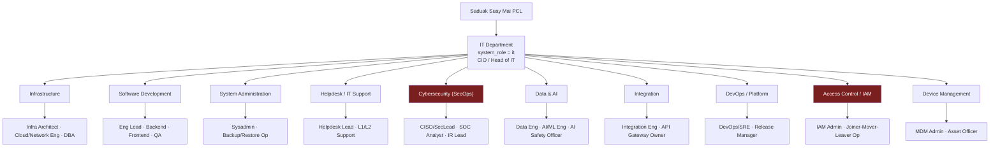
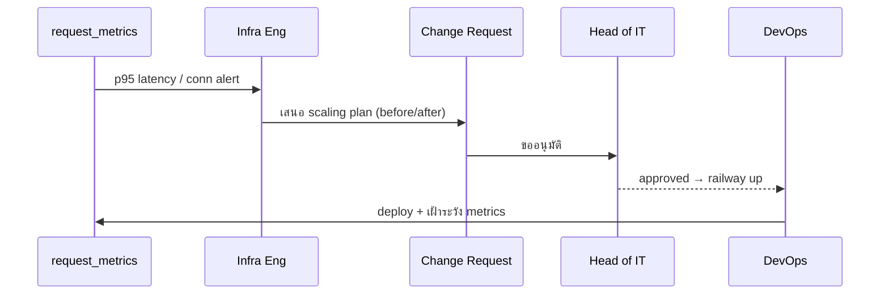
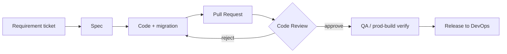
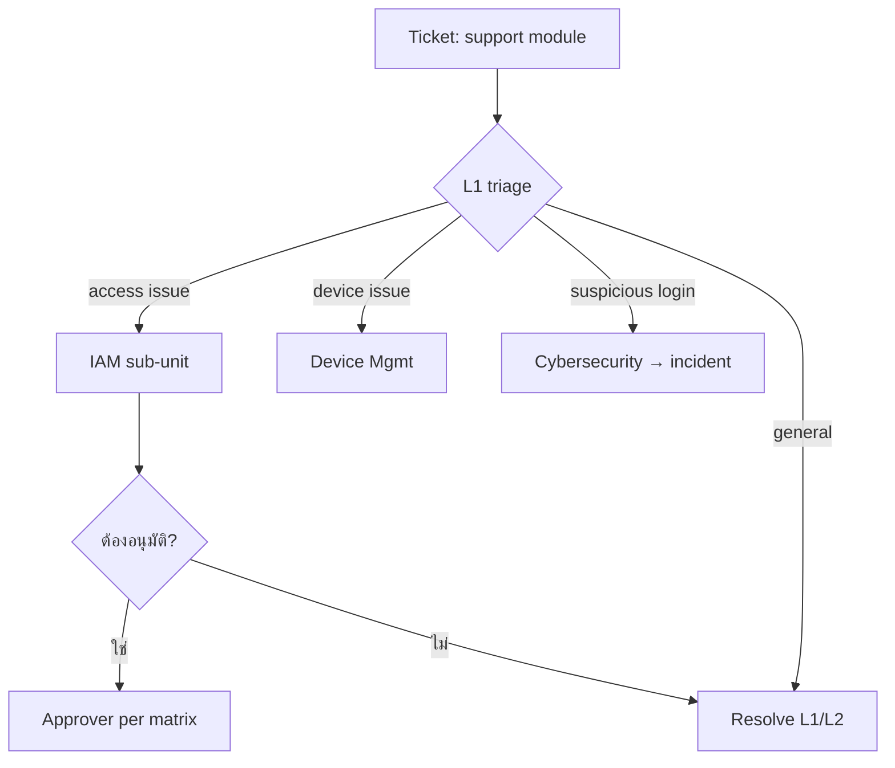
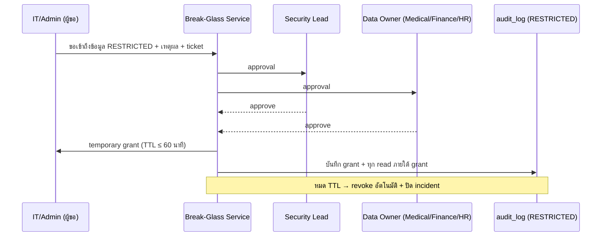
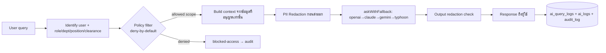
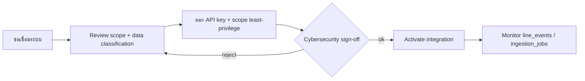
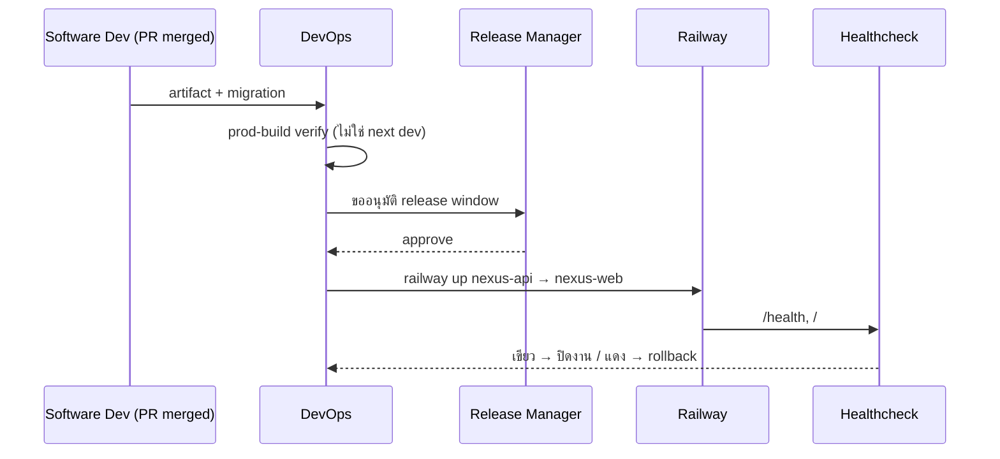
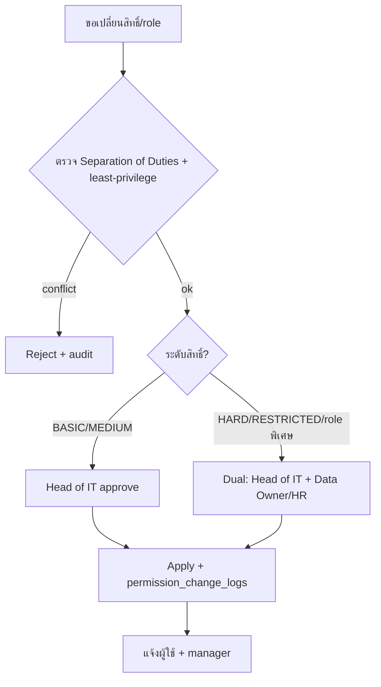
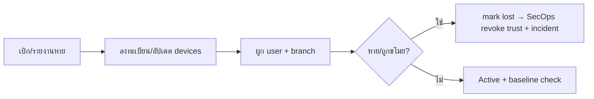

# Department Breakdown — IT Department (เทคโนโลยีสารสนเทศ)

> **เอกสารชุด:** 03 — Department Breakdown · **ลำดับ:** 07 · **แผนก:** IT (`department = 'IT'`, `system_role = 'it'`, `label_th = 'เทคโนโลยีสารสนเทศ'`)
> **บริษัท:** Saduak Suay Mai PCL (คลินิกความงาม + ทันตกรรม แฟรนไชส์)
> **แพลตฟอร์ม:** NEXUS OS — Next.js 16 (`nexus-web`) + Express/TS (`nexus-api`) + PostgreSQL บน Railway (deploy ผ่าน `railway up` ต่อ service)
> **สถานะ Grounding:** ทุกตาราง/API/feature ในเอกสารนี้ระบุชัดว่า **EXISTS** (มีใน NEXUS OS แล้ว) หรือ **NEW (migration)** ที่ต้องสร้างเพิ่ม

---

## 0. บทสรุปผู้บริหาร (Executive Summary)

แผนก IT คือ **เจ้าของกลไกความปลอดภัยและสิทธิ์ (security & permission backbone) ของทั้ง NEXUS OS** ไม่ใช่แค่ "ฝ่ายซ่อมคอม". ในสถาปัตยกรรม AI Workforce OS แผนก IT เป็นผู้ครอบครอง (Data Owner) ของวัตถุดิบที่ระบบทั้งใบใช้ตัดสินใจเรื่องการเข้าถึง ได้แก่ **User Account, Permission, Role, Device, Login, API Key, Integration, Security Incident, System Log**.

ผลที่ตามมาเชิงสถาปัตยกรรม:

1. IT เป็น **ผู้บังคับใช้ deny-by-default** — RBAC + ABAC + Data-Ownership ทั้งหมดถูก enforce ใน backend (`backend/src/lib/rbac.ts`, `backend/src/middleware/rbac.ts`, `backend/src/lib/user-permissions.ts`) ซึ่งเป็นโค้ดที่ IT เป็นเจ้าของ.
2. IT เป็น **ผู้คุม append-only audit + AI access control** — ทุก action ในระบบ และทุก AI query ต้องไหลผ่าน policy/redaction layer ที่ IT ดูแล.
3. IT มี **อำนาจ RESTRICTED-by-default** ในหลายโดเมน (Security Incident, permission-change, API Key secret) — แต่ **ห้ามใช้สิทธิ์ดูข้อมูลธุรกิจของแผนกอื่น** (Medical/Dental/Patient, Salary/Payroll) โดยอาศัยตำแหน่ง admin — การเข้าถึงข้อมูลคนไข้/เงินเดือนของ IT ต้องเป็น **direct grant + break-glass + audit** เท่านั้น.

> ⚠️ **ช่องโหว่ปัจจุบันที่ IT ต้องปิด (จาก discovery):** `admin` ใน `rbac.ts` เป็น hard super-user ที่ short-circuit ทุก check; `requireRole` มี admin bypass. ในสเปก production นี้ "IT = admin = เห็นทุกอย่าง" **ไม่เป็นที่ยอมรับ** — ต้องแยก *operate the system* ออกจาก *read the business data*. แก้ด้วย Break-Glass model (ดู §3.5 Cybersecurity และ §6 Cross-Cutting).

---

## 1. ตำแหน่งของ IT ในโครงสร้างองค์กร

```
Company (Saduak Suay Mai PCL)
└── Department: IT (เทคโนโลยีสารสนเทศ)  [system_role = 'it']
    ├── Sub-Dept: Infrastructure (โครงสร้างพื้นฐาน)
    ├── Sub-Dept: Software Development (พัฒนาซอฟต์แวร์)
    ├── Sub-Dept: System Administration (ดูแลระบบ)
    ├── Sub-Dept: Helpdesk / IT Support (ศูนย์ช่วยเหลือ)
    ├── Sub-Dept: Cybersecurity (ความมั่นคงปลอดภัยไซเบอร์)
    ├── Sub-Dept: Data & AI (ข้อมูลและปัญญาประดิษฐ์)
    ├── Sub-Dept: Integration (เชื่อมต่อระบบภายนอก)
    ├── Sub-Dept: DevOps / Platform (แพลตฟอร์มและการนำขึ้นระบบ)
    ├── Sub-Dept: Access Control / IAM (บริหารสิทธิ์การเข้าถึง)
    └── Sub-Dept: Device Management (บริหารอุปกรณ์)
```

### 1.1 Mermaid — IT Department Sub-Tree เต็ม



> **[ASSUMPTION]** สำหรับคลินิกแฟรนไชส์ขนาดกลางในไทย headcount จริงของ IT น่าจะ ~6–12 คน คนหนึ่งสวมหลายหมวก (เช่น Sysadmin + Helpdesk Lead, หรือ DevOps + Infra). โครงนี้คือ *functional sub-units* ไม่ใช่ headcount 10 ทีมแยกขาด — แต่ทุก sub-unit ต้องมี **ผู้รับผิดชอบที่ระบุชื่อได้ (named owner)** เพื่อให้ approval flow และ data-ownership ทำงาน.

---

## 2. มาตรฐานข้อมูลของแผนก IT (Data Standards)

### 2.1 คอลัมน์มาตรฐานทุก core table (Global rule)

ทุกตารางที่ IT เป็นเจ้าของต้องมี:

```sql
id            TEXT PRIMARY KEY,            -- randomUUID() (ตรงกับ pattern ปัจจุบันใน NEXUS OS)
company_id    TEXT NOT NULL REFERENCES companies(id),
created_at    TIMESTAMPTZ NOT NULL DEFAULT now(),
updated_at    TIMESTAMPTZ NOT NULL DEFAULT now(),
deleted_at    TIMESTAMPTZ,                 -- soft-delete (ปัจจุบัน NEXUS OS ยังไม่มี → NEW ทุกตาราง)
created_by    TEXT REFERENCES users(id),
updated_by    TEXT REFERENCES users(id),
deleted_by    TEXT REFERENCES users(id),
is_active     BOOLEAN NOT NULL DEFAULT true,
version       INTEGER NOT NULL DEFAULT 1,  -- optimistic lock
security_level TEXT NOT NULL DEFAULT 'MEDIUM'
              CHECK (security_level IN ('BASIC','MEDIUM','HARD','RESTRICTED'))
```

> **สถานะ:** คอลัมน์ `deleted_at/version/security_level/created_by/...` เหล่านี้ **NEW (migration)** — discovery ยืนยันว่า NEXUS OS มี *zero* `deleted_at` columns วันนี้ และ delete เป็น hard-delete + `ON DELETE CASCADE`. IT เป็นเจ้าของ migration ชุดนี้ (เพิ่มเป็น `migrations.ts` v11+).

### 2.2 ระดับความปลอดภัย (Security Levels) — mapping ของข้อมูล IT

| Security Level | นิยาม | ตัวอย่างข้อมูล IT |
|---|---|---|
| **BASIC** | ทุกคนในบริษัทเห็นได้ | สถานะระบบ (system status page), ประกาศ maintenance, FAQ helpdesk |
| **MEDIUM** | เห็นได้ในระดับแผนก IT | ticket helpdesk ทั่วไป, device inventory (non-sensitive), integration ที่ไม่มี secret |
| **HARD** | owner / manager / HR / Head of IT | login logs ของพนักงาน, permission group definition, role assignment, device assignment ผูกบุคคล |
| **RESTRICTED** | direct grant only + break-glass | **API Key secret, Security Incident, permission-change log, IAM credential, AI evaluation, ค่า encryption/JWT secret** |

> **กฎตายตัว:** `api_keys.secret_hash`, `security_incidents.*`, `permission_change_logs.*`, และ payload ที่มี PII คนไข้/เงินเดือน = **RESTRICTED by default** เสมอ.

### 2.3 ตารางที่ IT เป็นเจ้าของ (Ownership map → สถานะ EXISTS / NEW)

| โดเมน (Owns) | ตาราง | สถานะ | Data Owner (sub-unit) | Default Security |
|---|---|---|---|---|
| User Account | `users` | **EXISTS** (core `db.ts`) | IAM | HARD |
| User Account (HR profile) | `employee_profiles` | **EXISTS** (`nexus-hr-schema`) | HR เป็นเจ้าของ; IT จัดการแค่ account flag | HARD |
| Permission | `permission_groups`, `user_permission_groups` | **EXISTS** (`nexus-hr-schema`) | IAM | HARD |
| Role | static `ROLES`/`MODULE_ACCESS` (`rbac.ts`) + (NEW) `role_assignments` | **EXISTS (static)** + **NEW (audit table)** | IAM | HARD |
| Device | `devices` | **NEW (migration)** | Device Management | HARD |
| Login | `login_logs` | **NEW (migration)** | Cybersecurity | HARD |
| API Key | `api_keys` | **NEW (migration)** | Integration / SecOps | RESTRICTED |
| Integration | `integrations`, `line_events` | **NEW** + **EXISTS (`line_events`)** | Integration | MEDIUM (config) / RESTRICTED (secret) |
| Security Incident | `security_incidents` | **NEW (migration)** | Cybersecurity | RESTRICTED |
| System Log | `audit_log`, `request_metrics`, `ai_logs`, (NEW) `ai_query_logs`, `system_logs` | **EXISTS** + **NEW** | Cybersecurity / Data&AI | HARD–RESTRICTED |
| Permission-change trail | `permission_change_logs` | **NEW (migration)** | IAM + Cybersecurity | RESTRICTED |
| Consent / data classification | `consent_logs`, `data_classification` | **NEW (migration)** | Data & AI | HARD |

---

## 3. รายละเอียดแต่ละ Sub-Department

> รูปแบบมาตรฐานของแต่ละ sub-unit: **หน้าที่ · Position list · Workflow(s) · KPI(s)+data source · Data Created · Data Used · Security Level · Data Owner · Approval Flow · Audit Log events**.

---

### 3.1 Infrastructure (โครงสร้างพื้นฐาน)

#### หน้าที่ (Responsibilities)
- ดูแล Railway services (`nexus-web`, `nexus-api`, Postgres), networking, DNS, TLS, scaling, capacity planning.
- ดูแล PostgreSQL instance: storage, connection pool, replicas/backup target, performance tuning.
- กำหนด baseline ของ infra-as-config; ดูแล `DATABASE_URL`, SSL settings (หมายเหตุ: ปัจจุบัน pool ใช้ `rejectUnauthorized:false` — Infra ต้องวางแผนปิดช่องนี้).

#### Position list
| ตำแหน่ง | label_th | ความรับผิดชอบหลัก |
|---|---|---|
| Infrastructure Architect | สถาปนิกโครงสร้างพื้นฐาน | ออกแบบ topology, scaling policy |
| Cloud / Network Engineer | วิศวกรคลาวด์/เครือข่าย | Railway services, DNS, TLS, CORS allow-list |
| Database Administrator (DBA) | ผู้ดูแลฐานข้อมูล | tuning, index, replica, backup verify |

#### Workflow: Capacity Scaling
`Input` (alert จาก `request_metrics` p95 latency เกิน threshold / DB conn เกิน 80%) → `Process` (Infra วิเคราะห์ → เสนอ scaling plan) → `Output` (Change Request เพิ่ม replica / pool size) → `Receiver` (DevOps นำขึ้น via `railway up`) → `Approver` **Head of IT** (และ Finance ถ้ากระทบ cost).



#### KPI(s)
| KPI | เป้า [ASSUMPTION] | Data Source |
|---|---|---|
| Uptime (`nexus-api` `/health`, `nexus-web` `/`) | ≥ 99.9%/เดือน | Railway healthcheck + `request_metrics` |
| API p95 latency | ≤ 800 ms | `request_metrics` (**EXISTS**) |
| DB backup verified restore | 100% ของ backup ที่ถูก verify | `backup_records` (**EXISTS**) |
| Connection-pool saturation | < 80% peak | `request_metrics` / infra monitor |

#### Data Created
- Infra change records, scaling decisions → เก็บใน (NEW) `infra_changes` หรือ generic `change_requests`. **Security: MEDIUM** (config) / **HARD** (ถ้ามี secret).

#### Data Used
- `request_metrics` (**EXISTS**, MEDIUM), `backup_records` (**EXISTS**, HARD), `job_queue` (**EXISTS**).

#### Data Owner
**Infrastructure sub-unit lead** (escalate → Head of IT).

#### Approval Flow
Scaling/network change → **Head of IT**; ถ้ากระทบ cost > [ASSUMPTION] ฿X/เดือน → co-approve **Finance**.

#### Audit Log events
`infra.change.create/approve/reject`, `infra.scaling.apply`, `db.pool.config_change`, `backup.verify`, `failed-access` (เมื่อมีคนนอก IT พยายามแตะ config) — ทุก event บันทึก actor, before/after JSON, request_id.

---

### 3.2 Software Development (พัฒนาซอฟต์แวร์)

#### หน้าที่
- พัฒนา/ดูแล codebase `backend/` + `nexasos/`; เป็นเจ้าของ enforcement logic ของ RBAC/ABAC (`rbac.ts`, `middleware/rbac.ts`, `user-permissions.ts`), audit (`audit.ts`), sanitize/encryption.
- เขียน migration (`migrations.ts`) — รวมถึง migration ชุดความปลอดภัยใหม่ทั้งหมดในเอกสารชุดนี้.
- รับ requirement จากทุกแผนก แปลงเป็น feature; รักษา deny-by-default ใน API ทุกเส้น.

#### Position list
| ตำแหน่ง | label_th |
|---|---|
| Engineering Lead | หัวหน้าทีมพัฒนา |
| Backend Engineer | วิศวกร Backend (Express/TS) |
| Frontend Engineer | วิศวกร Frontend (Next.js 16) |
| QA / Test Engineer | วิศวกรทดสอบ |

#### Workflow: Feature → Production
`Input` (requirement ticket จากแผนกเจ้าของ business) → `Process` (spec → code → PR → code review → test) → `Output` (PR merged + migration) → `Receiver` (DevOps deploy) → `Approver` **Engineering Lead** (code) + **Head of IT** (release ที่แตะ security/permission).



> **[Memory rule]** การ verify ต้องทำบน **production build** ไม่ใช่ `next dev` (dev mask fatal render-loop). QA gate นี้บังคับ.

#### KPI(s)
| KPI | เป้า [ASSUMPTION] | Data Source |
|---|---|---|
| Change failure rate | < 15% | release records / `security_incidents` ที่โยงกับ deploy |
| Lead time (PR→prod) | ≤ 5 วันทำการ | git + release log |
| Critical bug escape | 0 ต่อ release | helpdesk tickets + incidents |
| Coverage ของ deny-by-default API | 100% ของ endpoint ใหม่มี `requireRole`/`requireModule` | code review checklist |

#### Data Created
- Source code, migrations, release notes (BASIC สำหรับ note ทั่วไป; secret/config = RESTRICTED, ไม่อยู่ใน repo).

#### Data Used
- Schema dictionary `data_dictionary` (**EXISTS**), ticket จากทุกแผนก.

#### Data Owner
**Engineering Lead**.

#### Approval Flow
PR ต้อง ≥1 reviewer; release ที่แตะ `rbac.ts`/`audit`/`permission_groups`/AI policy → **Head of IT + Cybersecurity sign-off** บังคับ.

#### Audit Log events
`code.release.deploy`, `migration.apply` (record schema_migrations version), `permission_logic.change` (RESTRICTED — แก้ rbac/policy), `ai_policy.change`. *การแก้ logic สิทธิ์ ถือเป็น permission-change → ต้องลง `permission_change_logs`.*

---

### 3.3 System Administration (ดูแลระบบ)

#### หน้าที่
- ดูแลการ run รายวันของระบบ: background workers (job queue, daily backup, monthly skill review, SLA escalation — ที่ boot ใน `index.ts`), idempotency keys, การ restore.
- เป็นเจ้าของ runbook สำหรับ backup/restore, incident remediation step.

#### Position list
| ตำแหน่ง | label_th |
|---|---|
| System Administrator | ผู้ดูแลระบบ |
| Backup / Restore Operator | เจ้าหน้าที่สำรอง/กู้คืนข้อมูล |

#### Workflow: Backup & Verified Restore
`Input` (daily backup worker → `backup_records`) → `Process` (sysadmin verify integrity + ทดสอบ restore ลง staging) → `Output` (verified flag) → `Receiver` Infra/Head of IT → `Approver` **Head of IT** (restore ลง production ต้องอนุมัติ + break-glass log).

#### KPI(s)
| KPI | เป้า [ASSUMPTION] | Data Source |
|---|---|---|
| Backup success rate | 100%/วัน | `backup_records` (**EXISTS**) |
| Restore test cadence | ≥ 1 ครั้ง/เดือน | `backup_records` + restore log |
| Job queue dead-letter rate | < 1% | `job_queue` (**EXISTS**) |
| Mean time to restore (MTTR) | ≤ 4 ชม. [ASSUMPTION] | incident + restore log |

#### Data Created
- `backup_records` entries (**EXISTS**, HARD), restore logs (NEW, HARD).

#### Data Used
- `job_queue`, `idempotency_keys`, `backup_records` (ทั้งหมด **EXISTS**).

#### Data Owner
**System Administrator** (restore → Head of IT).

#### Approval Flow
Production restore / data rollback → **Head of IT** + บันทึก break-glass; ถ้า restore กระทบ patient/payroll data → แจ้ง DPO/HR ด้วย.

#### Audit Log events
`backup.create`, `backup.verify`, `restore.request`, `restore.execute` (RESTRICTED, break-glass), `worker.restart`, `job.requeue`.

---

### 3.4 Helpdesk / IT Support (ศูนย์ช่วยเหลือ)

#### หน้าที่
- รับ ticket จากพนักงานทุกแผนก (login ไม่ได้, สิทธิ์ผิด, อุปกรณ์เสีย, ขอ reset password).
- เป็น L1 triage; ส่งต่อ IAM (สิทธิ์), Device Mgmt (อุปกรณ์), SecOps (เหตุน่าสงสัย).
- เป็น **first signal** ของ security incident (เช่น "บัญชีผมโดน lock", "มี login แปลก").

#### Position list
| ตำแหน่ง | label_th |
|---|---|
| Helpdesk Lead | หัวหน้าศูนย์ช่วยเหลือ |
| L1 Support Agent | เจ้าหน้าที่สนับสนุน ระดับ 1 |
| L2 Support Engineer | วิศวกรสนับสนุน ระดับ 2 |

#### Workflow: Support Ticket (with security routing)
`Input` (พนักงานเปิด ticket ผ่าน `support` module — **EXISTS** ใน `MODULE_ACCESS`, ทุก role เข้าได้) → `Process` (L1 triage → จัดประเภท) → `Output` (resolve / escalate) → `Receiver` (IAM / Device / SecOps) → `Approver` (เฉพาะ ticket ที่ขอเพิ่มสิทธิ์ → ต้องผ่าน IAM approval flow §3.9; password reset ของ HARD/RESTRICTED account → Head of IT).



#### KPI(s)
| KPI | เป้า [ASSUMPTION] | Data Source |
|---|---|---|
| First response time | ≤ 30 นาที (เวลาทำการ) | ticket timestamps |
| Resolution within SLA | ≥ 90% | ticket SLA + `notification_deliveries` |
| Reopen rate | < 10% | ticket data |
| % security tickets escalated correctly | 100% | ticket → incident linkage |

#### Data Created
- Support tickets (NEW table `support_tickets` หรือใช้ `tasks`/`action_items` ที่ **EXISTS** เป็นฐาน). **Security: MEDIUM** (เนื้อหา ticket อาจมี PII → ห้ามใส่ secret; reset password ไม่เก็บรหัสจริง).

#### Data Used
- `users` (HARD), `login_logs` (อ่านเฉพาะของผู้ร้อง, HARD), device assignment.

#### Data Owner
**Helpdesk Lead**.

#### Approval Flow
Reset password บัญชี BASIC/MEDIUM → Helpdesk Lead; บัญชี HARD/RESTRICTED หรือบัญชีของ CEO/Finance/Medical/HR → **Head of IT**.

#### Audit Log events
`ticket.create/update/resolve`, `password.reset.request`, `password.reset.execute`, `support.escalate.security` (→ สร้าง incident), `failed-access` (พนักงานพยายามเข้าเมนูที่ไม่มีสิทธิ์ → กลายเป็น ticket).

---

### 3.5 Cybersecurity / SecOps (ความมั่นคงปลอดภัยไซเบอร์)  🔴 RESTRICTED

#### หน้าที่
- เป็นเจ้าของ **Security Incident, Login monitoring, append-only audit integrity, break-glass governance**.
- ตรวจ login ผิดปกติ (brute force, impossible travel), จัดการ lockout, สอบสวนเหตุ.
- บังคับ tamper-evidence ของ `audit_log` (hash-chain), ดูแล secrets posture (JWT/ENCRYPTION key rotation), MFA, token revocation.
- **คุม Break-Glass:** เมื่อ IT/admin จำเป็นต้องเข้าถึงข้อมูล RESTRICTED ของแผนกอื่น (patient/payroll) ต้องผ่าน break-glass + dual-approval + audit.

#### Position list
| ตำแหน่ง | label_th |
|---|---|
| Security Lead / CISO | หัวหน้าความมั่นคงปลอดภัย |
| SOC Analyst | นักวิเคราะห์ศูนย์เฝ้าระวัง |
| Incident Response Lead | หัวหน้าตอบสนองเหตุการณ์ |

#### Workflow A: Login Anomaly → Incident
`Input` (`login_logs` + rate-limit signals) → `Process` (detect rule: ≥N failed/15min, impossible travel, new-device) → `Output` (lock account + `security_incidents` row) → `Receiver` ผู้ใช้ที่ถูกกระทบ + Head of IT + HR (ถ้าเป็นพนักงาน) → `Approver` **Security Lead** (จัดประเภทความรุนแรง), unlock ต้อง **Head of IT**.

#### Workflow B: Break-Glass Access (เข้าถึงข้อมูล RESTRICTED ของแผนกอื่น)
`Input` (คำขอ break-glass พร้อมเหตุผล + ticket อ้างอิง) → `Process` (dual-approval) → `Output` (grant ชั่วคราว TTL สั้น เช่น ≤ 60 นาที) → `Receiver` ผู้ขอ → `Approver` **Security Lead + Data Owner ของโดเมนนั้น** (เช่น Medical Head สำหรับ patient, Finance Head สำหรับ payroll).



#### KPI(s)
| KPI | เป้า [ASSUMPTION] | Data Source |
|---|---|---|
| Mean time to detect (MTTD) | ≤ 15 นาที | `login_logs` + detection rules |
| Mean time to respond (MTTR incident) | ≤ 1 ชม. (Sev1) | `security_incidents` |
| Audit hash-chain integrity | 100% verify pass/วัน | `audit_log` prev_hash verifier |
| Break-glass grants ที่ปิดถูกต้อง | 100% | break-glass + `audit_log` |
| MFA enrollment ของ HARD/RESTRICTED roles | 100% | `users`/IAM |

#### Data Created
- `security_incidents` (NEW, **RESTRICTED**): `id, company_id, severity, type, source_login_log_id, affected_user_id, status, detected_at, resolved_at, root_cause, before/after, security_level='RESTRICTED'`.
- `audit_log.prev_hash` chain (NEW column, **RESTRICTED** integrity), break-glass grants (NEW `break_glass_grants`, **RESTRICTED**).

#### Data Used
- `login_logs` (NEW, HARD), `audit_log` (**EXISTS**, อ่านทั้งหมดได้ — module `audit` gated `admin/ceo/it/hr`), `request_metrics` (rate-limit signal), `ai_query_logs` (redaction failures).

#### Data Owner
**Security Lead / CISO**. (Incident data = RESTRICTED, direct grant only.)

#### Approval Flow
สร้าง/ปิด incident → Security Lead; unlock account → Head of IT; break-glass → dual (Security Lead + Domain Owner); การเปลี่ยน detection rule → Head of IT.

#### Audit Log events
`login.failed`, `login.locked`, `login.unlock`, `incident.create/triage/resolve`, `breakglass.request/approve/deny/grant/revoke`, `audit.integrity.verify`, `secret.rotate` (JWT/ENCRYPTION key — RESTRICTED), `mfa.enroll/reset`. **ทุก event ของ sub-unit นี้ = RESTRICTED และ append-only.**

---

### 3.6 Data & AI (ข้อมูลและปัญญาประดิษฐ์)

#### หน้าที่
- เป็นเจ้าของ **AI access control flow + redaction layer** ที่อยู่ใน path `ai-router.ts` / `ai-providers.ts`.
- บังคับหลักการ: **AI ไม่อ่าน DB ตรง** — flow คือ `user query → identify user → check role/department/position/clearance → filter allowed data → ส่งเฉพาะที่อนุญาตเข้าโมเดล → response → redaction check → audit`.
- เป็นเจ้าของ `ai_query_logs` (NEW), data classification, consent, AI evaluation (RESTRICTED).

#### Position list
| ตำแหน่ง | label_th |
|---|---|
| Data Engineer | วิศวกรข้อมูล |
| AI / ML Engineer | วิศวกร AI/ML |
| AI Safety / Governance Officer | เจ้าหน้าที่กำกับความปลอดภัย AI |

#### Workflow: Guarded AI Query (บังคับใช้ใน backend)


`Input` user prompt → `Process` identify+policy+filter+redact+model+output-filter → `Output` คำตอบที่ผู้ใช้มีสิทธิ์เห็น → `Receiver` ผู้ใช้ → `Approver` (decision rights `auto|suggest|human` ต่อ task; งานเสี่ยงสูง = `human` → ผู้จัดการแผนกเจ้าของข้อมูลอนุมัติ).

> **ช่องโหว่ปัจจุบันที่ต้องปิด:** discovery ระบุว่า raw prompt + full org RAG context ถูกส่งออกไปยัง provider ภายนอก **โดยไม่ redact** (`sanitize.ts` strip แค่ `password_hash`, ไม่อยู่ใน AI path). Data&AI ต้องแทรก redaction layer + บังคับ policy filter ก่อน `buildOrgContext` → `askWithFallback`.

#### KPI(s)
| KPI | เป้า [ASSUMPTION] | Data Source |
|---|---|---|
| AI redaction coverage (PII masked ก่อนออก) | 100% | `ai_query_logs.redaction_status` |
| AI policy-violation blocks logged | 100% | `ai_query_logs` + `audit_log (blocked-access)` |
| Grounded-response rate | ≥ เป้าที่กำหนด | `ai_query_logs.grounded` |
| Cost metering accuracy | จริงตาม provider (ไม่ใช่ 0.5 THB hardcode) | `ai_query_logs.tokens/cost` |

#### Data Created
- `ai_query_logs` (NEW, **HARD–RESTRICTED**): `id, company_id, user_id, request_id (link to audit_log), prompt_redacted, response_redacted, provider, model, tokens_prompt, tokens_completion, latency_ms, decision (auto/suggest/human), grounded BOOLEAN, redaction_status, blocked BOOLEAN, block_reason, created_at`.
- `data_classification` (NEW), `consent_logs` (NEW, HARD).

#### Data Used
- `ai_logs` (**EXISTS** — แต่ metering เป็นของปลอม, ต้องแทนที่/เสริม), `knowledge_items`/`user_ai_memory` (**EXISTS**), org context (กรองแล้ว).

#### Data Owner
**AI Safety / Governance Officer** (สำหรับ AI evaluation = RESTRICTED); Data Engineer สำหรับ pipeline.

#### Approval Flow
เปลี่ยน AI decision-rights (`companies.settings.ai_decision_rights`) หรือ provider/model default → **Head of IT + AI Safety Officer**; เปิด data scope ใหม่ให้ AI → **Data Owner ของโดเมนนั้น** + Cybersecurity.

#### Audit Log events
`ai-query`, `ai-response`, `ai.blocked-access`, `ai.redaction.fail`, `ai.policy.change`, `ai.decision_rights.change`, `consent.grant/revoke`, `ai.evaluation.run` (RESTRICTED). AI logs แยกตารางแต่ link ด้วย `request_id` กับ `audit_log` (ตามกฎ global).

---

### 3.7 Integration (เชื่อมต่อระบบภายนอก)

#### หน้าที่
- ดูแลการเชื่อมต่อภายนอก: LINE (`LINE_CHANNEL_SECRET`/`ACCESS_TOKEN`, ใช้ `line_events` **EXISTS**), payment/clinic systems, AI providers' keys, webhook ingest (`ingestion_jobs` **EXISTS**).
- เป็นเจ้าของ `integrations` registry + ดูแล **API Key** ร่วมกับ SecOps.

#### Position list
| ตำแหน่ง | label_th |
|---|---|
| Integration Engineer | วิศวกรเชื่อมต่อระบบ |
| API Gateway Owner | ผู้ดูแล API Gateway |

#### Workflow: Onboard New Integration
`Input` (คำขอเชื่อมระบบใหม่ จากแผนก business) → `Process` (review scope + ออก API key + กำหนด least-privilege scope) → `Output` (integration active + key issued) → `Receiver` แผนกผู้ขอ → `Approver` **Head of IT + Cybersecurity** (เพราะมี secret = RESTRICTED).



#### KPI(s)
| KPI | เป้า [ASSUMPTION] | Data Source |
|---|---|---|
| Integration uptime | ≥ 99.5% | `line_events`/`ingestion_jobs` + monitor |
| Webhook ingest failure rate | < 2% | `ingestion_jobs` (**EXISTS**) |
| Keys ที่หมุนตามรอบ (rotation) | 100% ภายในรอบ [ASSUMPTION 90 วัน] | `api_keys.rotated_at` |
| Orphaned/unused keys | 0 | `api_keys.last_used_at` |

#### Data Created
- `integrations` (NEW, MEDIUM config): `id, company_id, name, type, status, config_json, owner_user_id, security_level`.
- `api_keys` (NEW, **RESTRICTED**): `id, company_id, integration_id, name, key_prefix, secret_hash, scopes_json, status, last_used_at, rotated_at, expires_at, created_by`. **เก็บเฉพาะ hash ไม่เก็บ secret ดิบ.**

#### Data Used
- `line_events` (**EXISTS**), `ingestion_jobs` (**EXISTS**), env secrets (จาก secrets manager — ไม่อยู่ใน DB).

#### Data Owner
**Integration Engineer** (config); **API Key secret = SecOps co-owner, RESTRICTED**.

#### Approval Flow
สร้าง/ออก API key → **Head of IT + Cybersecurity**; revoke key → Integration Eng (immediate) + แจ้ง SecOps.

#### Audit Log events
`integration.create/update/disable`, `apikey.issue` (RESTRICTED, log key_prefix เท่านั้น ห้าม log secret), `apikey.rotate`, `apikey.revoke`, `apikey.use.failed`, `webhook.ingest.fail`.

---

### 3.8 DevOps / Platform (แพลตฟอร์มและการนำขึ้นระบบ)

#### หน้าที่
- เป็นเจ้าของ deploy mechanism: `railway up` ต่อ service (`nexus-web`, `nexus-api`) — **ไม่ใช่ GitHub auto-deploy** (ตาม Memory).
- ดูแล Dockerfile, healthcheck, restart policy, build args (`NEXT_PUBLIC_API_URL`), env var management, release gating.

#### Position list
| ตำแหน่ง | label_th |
|---|---|
| DevOps / SRE Engineer | วิศวกร DevOps/SRE |
| Release Manager | ผู้จัดการการปล่อยรุ่น |

#### Workflow: Production Release
`Input` (PR merged + migration พร้อม จาก Software Dev) → `Process` (build → prod-build verify → `railway up nexus-api` แล้ว `nexus-web`) → `Output` (deploy live, healthcheck เขียว) → `Receiver` ผู้ใช้ทั้งระบบ → `Approver` **Release Manager + Head of IT** (release ที่แตะ security → Cybersecurity sign-off).



#### KPI(s)
| KPI | เป้า [ASSUMPTION] | Data Source |
|---|---|---|
| Deployment frequency | ตามแผน sprint | release log |
| Failed deploy / rollback rate | < 10% | release log + `/health` |
| Healthcheck recovery time | ≤ 5 นาที | Railway healthcheck (300s timeout) |
| Migration applied cleanly | 100% | `schema_migrations` (**EXISTS**) |

#### Data Created
- Release records (NEW, MEDIUM), env var change requests (RESTRICTED ถ้าเป็น secret).

#### Data Used
- `schema_migrations` (**EXISTS**), `backup_records` (pre-deploy backup), Railway config (`railway.json`, Dockerfile).

#### Data Owner
**Release Manager** (release); secrets = SecOps.

#### Approval Flow
Production deploy → Release Manager + Head of IT; env/secret change → **Cybersecurity** (RESTRICTED); rollback → Head of IT (emergency: post-hoc audit ภายใน 24 ชม.).

#### Audit Log events
`deploy.start/success/fail`, `rollback.execute`, `env.change` (RESTRICTED — log key name ไม่ใช่ค่า), `migration.apply`, `healthcheck.fail`.

---

### 3.9 Access Control / IAM (บริหารสิทธิ์การเข้าถึง)  🔴 RESTRICTED

#### หน้าที่
- เป็นเจ้าของ **User Account, Role, Permission lifecycle** — Joiner / Mover / Leaver (JML).
- จัดการ `users`, `permission_groups`, `user_permission_groups` (**EXISTS**), role assignment, module access.
- เป็นเจ้าของ **permission-change trail** (`permission_change_logs` NEW) — ทุกการเปลี่ยนสิทธิ์/role ต้องถูกบันทึก append-only.

#### Position list
| ตำแหน่ง | label_th |
|---|---|
| IAM Administrator | ผู้ดูแลสิทธิ์การเข้าถึง |
| JML Operator (Joiner-Mover-Leaver) | เจ้าหน้าที่เข้า-ย้าย-ออก |

#### Workflow A: Joiner (พนักงานใหม่)
`Input` (HR แจ้งพนักงานใหม่ + department/position) → `Process` (สร้าง `users` row → map `system_role` ตาม department ผ่าน `getSystemRoleForDepartment` → assign permission_groups least-privilege) → `Output` (account active) → `Receiver` พนักงาน + manager → `Approver` **HR (data) + Head of IT (provisioning)**.

#### Workflow B: Permission Change / Role Change
`Input` (คำขอเพิ่ม/ลดสิทธิ์ พร้อมเหตุผล) → `Process` (ตรวจ least-privilege + แยกหน้าที่ SoD) → `Output` (สิทธิ์ใหม่ + permission_change_log) → `Receiver` ผู้ใช้ → `Approver` **Head of IT**; สิทธิ์ระดับ HARD/RESTRICTED หรือ role admin/ceo/finance/hr/medical/dental → ต้อง **dual-approval (Head of IT + Data Owner/HR)**.



#### Workflow C: Leaver (พนักงานลาออก)
`Input` (HR แจ้งวันสุดท้าย) → `Process` (deactivate `users.is_active=false` + revoke groups + soft-delete ตาม retention + คืนอุปกรณ์ผ่าน Device Mgmt) → `Output` account ปิด → `Approver` **HR + Head of IT**. (ห้าม hard-delete — ใช้ soft-delete เพื่อรักษา audit/ownership.)

#### KPI(s)
| KPI | เป้า [ASSUMPTION] | Data Source |
|---|---|---|
| Leaver deprovision ภายใน SLA | 100% ภายในวันสุดท้าย | HR record + `users.is_active`/`deleted_at` |
| Permission changes ที่มี log ครบ | 100% | `permission_change_logs` |
| Orphan accounts (ไม่มีเจ้าของ/ไม่ใช้งาน) | 0 | `users.last_login` + `login_logs` |
| Access reviews ตามรอบ | ≥ 1/ไตรมาส | review records |
| SoD violations | 0 | review + assignment data |

#### Data Created
- Role/permission assignments บน `user_permission_groups` (**EXISTS**, HARD).
- `permission_change_logs` (NEW, **RESTRICTED**): `id, company_id, target_user_id, change_type (role/group/module), before_json, after_json, changed_fields, reason, actor_id, approver_id, request_id, created_at`. **Append-only.**

#### Data Used
- `users` (**EXISTS**, HARD), `permission_groups`/`user_permission_groups` (**EXISTS**), `org_units`/`departments` (**EXISTS** — ต้อง wire เข้า authz, ปัจจุบันยังไม่ผูก), `employee_profiles` (อ่าน department/position จาก HR).

#### Data Owner
**IAM Administrator**; การอนุมัติสิทธิ์ HARD/RESTRICTED = ร่วมกับ Data Owner ของโดเมน + HR.

#### Approval Flow
ดู Workflow B matrix. กฎ: **deny-by-default + least-privilege + Separation of Duties** (ผู้ขอ ≠ ผู้อนุมัติ ≠ ผู้ apply ในกรณี RESTRICTED).

#### Audit Log events
`account.create`, `account.deactivate`, `account.delete (soft)`, `account.restore`, `role.change`, `permission-change`, `group.assign/unassign`, `access.review`, `failed-access`/`blocked-access`. **ทุก event = RESTRICTED, append-only, before/after JSON บังคับ.**

---

### 3.10 Device Management (บริหารอุปกรณ์)

#### หน้าที่
- ลงทะเบียน/ติดตามอุปกรณ์ (โน้ตบุ๊ก, แท็บเล็ตเครื่องคนไข้/แอดมิน, อุปกรณ์ POS สาขา), ผูกอุปกรณ์กับผู้ใช้/สาขา (`branches` **EXISTS** v8).
- บังคับ baseline ความปลอดภัยอุปกรณ์ (disk encryption, screen lock), จัดการ trusted-device สำหรับ login (เชื่อมกับ SecOps new-device detection).

#### Position list
| ตำแหน่ง | label_th |
|---|---|
| MDM / Device Admin | ผู้ดูแลอุปกรณ์ |
| IT Asset Officer | เจ้าหน้าที่ทรัพย์สินไอที |

#### Workflow: Device Lifecycle (Issue → Return/Lost)
`Input` (คำขอเบิกอุปกรณ์ / รายงานหาย) → `Process` (ลงทะเบียน `devices` + ผูก user/branch → ถ้าหาย: mark lost + แจ้ง SecOps revoke trust) → `Output` device record updated → `Receiver` ผู้ใช้/manager สาขา → `Approver` **Helpdesk Lead** (เบิกทั่วไป) / **Head of IT** (อุปกรณ์เข้าถึงข้อมูล RESTRICTED เช่น เครื่องดูเวชระเบียน).



#### KPI(s)
| KPI | เป้า [ASSUMPTION] | Data Source |
|---|---|---|
| Device inventory accuracy | ≥ 98% | `devices` reconciliation |
| Lost-device → trust revoked | ≤ 1 ชม. | `devices.status` + `security_incidents` |
| Devices ตาม baseline (encryption/lock) | 100% | MDM compliance report |
| Untracked devices accessing API | 0 | `login_logs.device` vs `devices` |

#### Data Created
- `devices` (NEW, **HARD**): `id, company_id, asset_tag, type, assigned_user_id, branch_id, os, status (active/lost/retired), trusted BOOLEAN, last_seen_at, security_level='HARD'`.

#### Data Used
- `users` (**EXISTS**), `branches` (**EXISTS** v8), `login_logs` (device fingerprint), `security_incidents` (lost device).

#### Data Owner
**MDM / Device Admin**.

#### Approval Flow
เบิกอุปกรณ์ทั่วไป → Helpdesk Lead; อุปกรณ์ที่จะเข้าถึงข้อมูล RESTRICTED (เครื่องเวชระเบียน/payroll) → **Head of IT** + ต้องผ่าน baseline + trusted-device.

#### Audit Log events
`device.register`, `device.assign/unassign`, `device.mark_lost`, `device.retire`, `device.trust.grant/revoke`, `device.baseline.fail`.

---

## 4. ตารางสรุปการครอบครองข้อมูล (IT Ownership × Security × Approver)

| Owns (โดเมน) | ตาราง (สถานะ) | Security Level | Data Owner (sub-unit) | Approver การเปลี่ยนแปลง |
|---|---|---|---|---|
| User Account | `users` (EXISTS) | HARD | IAM | Head of IT + HR |
| Permission | `permission_groups`, `user_permission_groups` (EXISTS) | HARD | IAM | Head of IT (+Data Owner ถ้า RESTRICTED) |
| Role | `rbac.ts` static + `permission_change_logs` (NEW) | HARD | IAM | Head of IT + HR (dual for special roles) |
| Device | `devices` (NEW) | HARD | Device Mgmt | Helpdesk Lead / Head of IT |
| Login | `login_logs` (NEW) | HARD | Cybersecurity | Security Lead |
| API Key | `api_keys` (NEW) | **RESTRICTED** | Integration + SecOps | Head of IT + Cybersecurity |
| Integration | `integrations` (NEW), `line_events` (EXISTS) | MEDIUM / RESTRICTED (secret) | Integration | Head of IT + Cybersecurity |
| Security Incident | `security_incidents` (NEW) | **RESTRICTED** | Cybersecurity | Security Lead |
| System Log | `audit_log` (EXISTS), `ai_query_logs` (NEW), `request_metrics` (EXISTS), `system_logs` (NEW) | HARD–RESTRICTED | Cybersecurity / Data&AI | — (append-only, read by grant) |
| Permission-change trail | `permission_change_logs` (NEW) | **RESTRICTED** | IAM + SecOps | append-only |

---

## 5. Audit Log — ข้อกำหนดที่ IT ต้องส่งมอบ (cross-department)

> IT เป็นเจ้าของ table `audit_log` และต้องยกระดับจากสถานะปัจจุบันให้ตรงสเปก. **Discovery ปัจจุบัน:** `audit_log` มีแค่ `id, company_id, user_id, action, resource, resource_id, security_tier, meta, created_at`; เขียนแบบ fire-and-forget (`writeAudit()` swallow error); ไม่มี before/after, ไม่มี immutability, ไม่มี IP/UA/request_id.

#### Migration ที่ IT ต้องทำ (NEW)

```sql
-- v11+ : ยกระดับ audit_log เป็น append-only tamper-evident
ALTER TABLE audit_log
  ADD COLUMN actor_role        TEXT,
  ADD COLUMN target_table      TEXT,
  ADD COLUMN target_id         TEXT,
  ADD COLUMN target_security_level TEXT
       CHECK (target_security_level IN ('BASIC','MEDIUM','HARD','RESTRICTED')),
  ADD COLUMN before_state      JSONB,
  ADD COLUMN after_state       JSONB,
  ADD COLUMN changed_fields    TEXT[],
  ADD COLUMN ip_address        TEXT,
  ADD COLUMN device            TEXT,
  ADD COLUMN user_agent        TEXT,
  ADD COLUMN request_id        TEXT,
  ADD COLUMN session_id        TEXT,
  ADD COLUMN endpoint          TEXT,
  ADD COLUMN http_method       TEXT,
  ADD COLUMN result            TEXT CHECK (result IN ('success','failure','blocked')),
  ADD COLUMN failure_reason    TEXT,
  ADD COLUMN prev_hash         TEXT,   -- hash-chain tamper-evidence
  ADD COLUMN row_hash          TEXT;

-- บังคับ append-only ในชั้น DB:
REVOKE UPDATE, DELETE ON audit_log FROM PUBLIC;       -- ห้ามแก้/ลบ
-- + trigger ปฏิเสธ UPDATE/DELETE และคำนวณ row_hash = H(prev_hash || payload)
-- retention: เก็บขั้นต่ำตามกฎหมาย/นโยบาย [ASSUMPTION ≥ 1–7 ปี], archive แล้ว seal
```

#### Audit events ที่ต้องจับ (ครบตาม global rule)
`login`, `logout`, `view`, `search`, `create`, `update`, `delete`, `soft-delete`, `restore`, `upload`, `download`, `export`, `approve`, `reject`, `permission-change`, `role-change`, `ai-query`, `ai-response`, `failed-access`, `blocked-access`.
ทุก event บันทึก: actor, role, target table/id, target security_level, before/after JSON, changed fields, ip, device, user_agent, request_id, session_id, endpoint, http_method, result, failure_reason, created_at. **AI logs แยกตาราง (`ai_query_logs`) แต่ link ด้วย `request_id`.**

> **กฎสำคัญ:** ปัจจุบัน writeAudit swallow error → **ในสเปกนี้ การ audit ของ action RESTRICTED ต้องเป็น blocking** (ถ้า audit เขียนไม่สำเร็จ ให้ปฏิเสธ action สำหรับ RESTRICTED; action ระดับต่ำกว่าอาจ degrade เป็น async แต่ต้องมี dead-letter ใน `job_queue`).

---

## 6. Cross-Cutting: หลักการบังคับใช้ของ IT (Enforcement Principles)

1. **Deny-by-default ใน backend ทุกเส้น** — ทุก endpoint ต้องผ่าน `requireRole`/`requireModule` + ABAC scope; frontend gating ไม่นับเป็น security. (เจ้าของ: Software Dev.)
2. **แยก "operate" ออกจาก "read business data"** — `admin`/`it` ใช้ดูแลระบบได้ แต่การอ่านข้อมูล RESTRICTED ของแผนกอื่น (patient/payroll/HR investigation/AI evaluation/executive notes) ต้องผ่าน **break-glass + dual-approval + audit** เท่านั้น. ต้องลบ/จำกัด admin short-circuit ใน `rbac.ts` สำหรับโดเมน RESTRICTED. (เจ้าของ: Cybersecurity + IAM.)
3. **Tenant isolation บังคับ** — ทุก query ต้องมี `company_id` predicate; เพิ่ม guard/Row-Level Security เพื่อกัน cross-tenant leak (ปัจจุบันพึ่ง predicate มือ). (เจ้าของ: Software Dev + DBA.)
4. **Soft-delete + versioning ทุกที่** — แทน hard-delete/CASCADE; ใช้ `deleted_at` + `version` (optimistic lock). (เจ้าของ: Software Dev.)
5. **AI never reads DB directly** — บังคับ policy filter + redaction รอบ `ai-router`. (เจ้าของ: Data & AI.)
6. **Secrets** — ย้ายออกจาก fallback chain ที่อ่อน (`ENCRYPTION_KEY` → `JWT_SECRET` → hardcoded), บังคับ secrets manager + rotation. (เจ้าของ: Cybersecurity + DevOps.)
7. **Secondary hardening** — distributed rate-limiter (แทน in-memory ต่อ instance), MFA สำหรับ HARD/RESTRICTED roles, token rotation/revocation, CSRF, `request_id` correlation. (เจ้าของ: Cybersecurity + Software Dev.)

---

## 7. Mapping กับ NEXUS OS modules ปัจจุบัน

IT (`role = 'it'`) มีสิทธิ์ module เหล่านี้ใน `MODULE_ACCESS` (`rbac.ts`, **EXISTS**): `org, ai, settings, user-groups, users-admin, audit, ingest, taxonomy, memory, guardian, meeting, mydata, myai, deptai, home, support, worklog, skills, dictionary, onboarding`.

| Module (EXISTS) | Sub-unit IT ที่ใช้ | หมายเหตุ enforcement |
|---|---|---|
| `users-admin`, `user-groups` | IAM | ต้องเสริม permission_change_logs + dual-approval |
| `audit` | Cybersecurity | เพิ่ม append-only/hash-chain/IP-UA |
| `ai`, `memory`, `deptai` | Data & AI | เพิ่ม redaction + ai_query_logs |
| `settings` | DevOps / Infra | env/secret change = RESTRICTED |
| `ingest`, `taxonomy` | Integration / Data&AI | webhook + data classification |
| `guardian` | Cybersecurity | incident/monitoring surface |
| `org` | IAM | wire `org_units`/`departments`/`branches` เข้า authz (ปัจจุบันยังไม่ผูก) |
| `support` | Helpdesk | ticket intake (ทุก role เข้าได้) |

---

## 8. สรุปรายการ Migration ที่แผนก IT เป็นเจ้าของ (NEW)

1. **Global columns** — เพิ่ม `deleted_at, created_by, updated_by, deleted_by, version, security_level` ทุก core table (+ soft-delete แทน CASCADE).
2. `audit_log` upgrade → append-only + before/after + IP/UA/request_id + hash-chain (§5).
3. `login_logs` (HARD) — auth events/failures.
4. `security_incidents` (RESTRICTED).
5. `devices` (HARD).
6. `api_keys` (RESTRICTED) + `integrations` (MEDIUM).
7. `permission_change_logs` (RESTRICTED, append-only).
8. `ai_query_logs` (HARD–RESTRICTED) + redaction layer ใน AI path.
9. `consent_logs`, `data_classification`, `file_access_logs` (HARD).
10. `break_glass_grants` (RESTRICTED) + dual-approval service.
11. Wire `org_units`/`departments`/`branches` (EXISTS) เข้า RBAC/ABAC scope.

> **Deploy note (Memory):** migration ทั้งหมดเพิ่มใน `backend/src/lib/migrations.ts` (tracked ใน `schema_migrations`), รัน auto ตอน boot (`initSchema()` → `runMigrations()`), นำขึ้นด้วย `railway up` ที่ service `nexus-api` — **ไม่ใช่ GitHub auto-deploy** — และต้อง verify บน production build.

---

*จบเอกสาร 07-it.md — Department Breakdown: IT (เทคโนโลยีสารสนเทศ), Saduak Suay Mai PCL / NEXUS OS.*
