# 08 — Department Breakdown: Warehouse & Purchasing Department (แผนกคลังสินค้าและจัดซื้อ)

> **Saduak Suay Mai PCL — NEXUS OS AI Workforce Architecture**
> เอกสารชุด: `03-department-breakdown` · ไฟล์: `08-warehouse-purchasing.md`
> ระดับเอกสาร: **Production-Ready / Enterprise / Strict** · ผู้รับผิดชอบ: Chief Data Architect + Warehouse Director
> Org Path: `Company → Department(Warehouse & Purchasing) → Sub-Department → Team/Unit → Position → Employee`
> System Role (RBAC): `warehouse` (ดู `backend/src/lib/rbac.ts` `ROLES`) — **EXISTS**

---

## 0. หลักการกำกับเอกสาร (Document Governance)

เอกสารนี้อธิบายแผนก **Warehouse & Purchasing (คลังสินค้าและจัดซื้อ)** อย่างละเอียดในทุกระดับ ตั้งแต่ระดับแผนกลงไปถึง Sub-Department / Team / Position โดยยึดกรอบ NEXUS OS เดิมเป็นฐาน และระบุชัดเจนทุกครั้งว่าสิ่งที่ออกแบบ **ALREADY EXISTS** (มีในระบบแล้ว) หรือ **NEW (migration)** (ต้องสร้าง migration ใหม่)

> **กฎทองที่ใช้ตลอดเอกสาร**
> 1. **Deny-by-default** — ทุก API / ทุก AI query ตรวจสิทธิ์ที่ **backend** เท่านั้น ไม่เชื่อ frontend
> 2. **Permission = RBAC + ABAC + Data-Ownership** — role (`warehouse`) + attribute (branch / sub-unit / position) + ownership (owner_id)
> 3. **4 Security Levels** — `BASIC` (ทุกคน) · `MEDIUM` (ระดับแผนก) · `HARD` (owner/manager/HR) · `RESTRICTED` (direct grant เท่านั้น)
> 4. **Audit Log = append-only** — capture ทุก action พร้อม before/after JSON, actor, ip, ua, request_id ฯลฯ
> 5. **AI ไม่อ่าน DB ตรง** — flow: query → identify user → check clearance → filter allowed data → ส่งเฉพาะที่อนุญาต → redaction check → audit
> 6. ข้อมูลจริงที่ไม่ทราบ (ชื่อพนักงาน, KPI target จริง, จำนวน headcount, supplier จริง) ทำเครื่องหมาย **[ASSUMPTION]**

### 0.1 หมายเหตุการ Map กับ NEXUS OS ปัจจุบัน (Grounding)

| สิ่งที่อ้างถึง | สถานะใน NEXUS OS | หมายเหตุ |
|---|---|---|
| Role `warehouse` | **EXISTS** (`rbac.ts` ROLES, MODULE_ACCESS key `warehouse`) | ใช้เป็น system role ของแผนกนี้ |
| Module `warehouse` | **EXISTS** (`MODULE_ACCESS`) | route gating ผ่าน `canAccessModule()` |
| ตาราง `org_units`, `positions`, `employee_profiles` | **EXISTS** (`nexus-hr-schema.ts`) | ใช้ผูกโครงสร้าง sub-unit/position (ปัจจุบันยังไม่ wire เข้า authz — เป็น **GAP**) |
| ตาราง `departments` | **EXISTS** (`nexus-extended-schema.ts`) | แผนก Warehouse เป็น 1 row |
| ตาราง `branches` | **EXISTS** (migration v8) | ใช้เป็น `branch_id` scoping |
| ตาราง `entities` | **EXISTS** (`nexus-entity-schema.ts`) | generic; แต่ inventory ควรมีตารางเฉพาะ (ดูข้อ 11) |
| ตาราง `audit_log` | **EXISTS** แต่ขาด before/after/ip/ua/request_id + ไม่ append-only | ต้อง **EXTEND (migration)** ตามมาตรฐานเอกสาร |
| ตาราง `ai_logs` / `ai_query_logs` | `ai_logs` **EXISTS** (faked metering); `ai_query_logs` **NEW** | AI access control ของแผนกนี้พึ่ง `ai_query_logs` ใหม่ |
| ทุกตาราง inventory/PO/PR ด้านล่าง | **NEW (migration)** เกือบทั้งหมด | ระบุราย table ในข้อ 11 |
| Soft-delete / version / security_level ทุกตาราง | **NEW** (โค้ดเดิมไม่มี `deleted_at` เลย — เป็น GAP หลัก) | ทุกตารางใหม่ต้องมีครบ |

---

## 1. ภาพรวมแผนก (Department Overview)

### 1.1 พันธกิจ (Mission)

แผนก **Warehouse & Purchasing** รับผิดชอบ **วงจรพัสดุ-สินค้าครบวงจร (end-to-end supply chain)** ของเครือคลินิกความงาม + ทันตกรรม Saduak Suay Mai ตั้งแต่การ **จัดซื้อ (Procurement)**, **บริหารซัพพลายเออร์ (Supplier Management)**, **รับเข้า (Receiving)**, **ควบคุมสต๊อก (Inventory Control)**, **ปฏิบัติการคลัง (Warehouse Operation)**, **โลจิสติกส์/กระจายสินค้าไปสาขา (Logistics)**, **ตรวจนับ/ตรวจสอบสต๊อก (Stock Audit)** จนถึง **ควบคุมทรัพย์สินถาวร (Asset Control)**

> **[ASSUMPTION]** เครือมีคลังกลาง (Central Warehouse) 1 แห่ง + สาขาแฟรนไชส์/สาขาตรงที่ถือสต๊อกหน้าร้าน (consumables, ยา/เวชภัณฑ์, วัสดุทันตกรรม, ผลิตภัณฑ์ขายปลีก) จำนวนสาขาผูกกับตาราง `branches` (จริงตาม master data)

### 1.2 ลักษณะข้อมูลที่อ่อนไหวเป็นพิเศษของแผนกนี้

แผนกนี้แตะข้อมูลที่ต้องระวังสูง 2 กลุ่ม:

1. **ราคา/ต้นทุน/เงื่อนไขซัพพลายเออร์** (unit cost, margin, rebate, payment terms) → **HARD / RESTRICTED** (ป้องกันรั่วต่อรองราคา + ป้องกันทุจริตจัดซื้อ)
2. **เวชภัณฑ์/ยา/วัสดุการแพทย์-ทันตกรรมควบคุม** (controlled drugs, lot/expiry ของยาฉีด, สารเติมเต็ม filler) → เชื่อมโยง Medical/Dental ระดับ **RESTRICTED** บางรายการ และต้องมี lot/expiry/traceability ตามกฎ อย.

> **[ASSUMPTION]** ยา/สารควบคุมบางรายการ (เช่น Botulinum toxin, lidocaine) อยู่ใต้กฎ อย. ต้องมี batch traceability + บันทึกผู้เบิก — บังคับ audit ระดับ field

### 1.3 Org Sub-Tree (Mermaid)

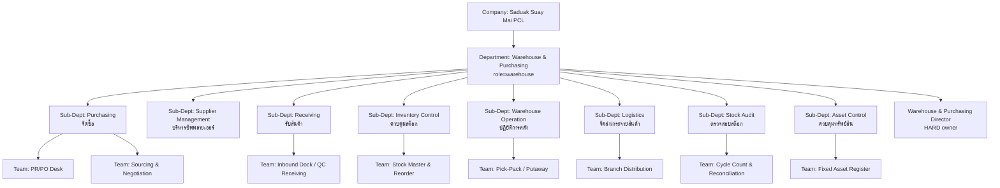

### 1.4 Flow ระดับแผนก (End-to-End Supply Chain)

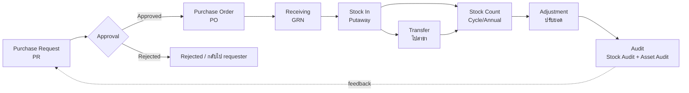

### 1.5 ตำแหน่งระดับแผนก (Department-level Positions)

| Position | จำนวน [ASSUMPTION] | Security Clearance | หมายเหตุ |
|---|---|---|---|
| Warehouse & Purchasing Director (ผอ.ฝ่ายคลังและจัดซื้อ) | 1 | **HARD** (department owner) + grant RESTRICTED ราคา/contract | อนุมัติ PO เกิน threshold, เจ้าของข้อมูลระดับแผนก |
| Deputy Manager / Warehouse Manager | 1 | HARD | รักษาการ approval, คุมปฏิบัติการ |
| Department Coordinator / Admin | 1–2 | MEDIUM | ประสานงาน, ออกเอกสาร, ไม่เห็นต้นทุน |

---

## 2. Sub-Department: Purchasing (จัดซื้อ)

### 2.1 หน้าที่ (Responsibilities)

- รับ **Purchase Request (PR)** จากทุกแผนก (Medical, Dental, Operations, Marketing ฯลฯ) แล้วรวบรวม consolidate
- แปลง PR ที่อนุมัติแล้วเป็น **Purchase Order (PO)** ส่งซัพพลายเออร์
- จัดทำ **RFQ (Request for Quotation)** / เปรียบเทียบราคา 3 เจ้า (3-bid policy) **[ASSUMPTION]**
- ควบคุม **budget vs actual** ต่อหมวด/ต่อสาขา ร่วมกับ Finance
- บริหาร **payment terms** และส่งต่อ PO+GRN ให้ Finance ตั้งหนี้ (3-way match)

### 2.2 Position List

| Position | Security Clearance | Data Ownership |
|---|---|---|
| Purchasing Manager | HARD + RESTRICTED (cost/terms) | owner ของ `purchase_orders` |
| Senior Buyer / Buyer (PR/PO Desk) | MEDIUM→HARD (เห็น cost เฉพาะที่ได้รับมอบ) | owner ของ PR ที่ตนดูแล |
| Sourcing & Negotiation Specialist | HARD (RESTRICTED contract terms by grant) | — |
| Purchasing Admin | MEDIUM (ไม่เห็น unit cost) | — |

### 2.3 Workflow: PR → RFQ → PO

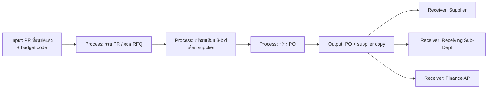

| ขั้น | Input | Process | Output | Receiver | Approver |
|---|---|---|---|---|---|
| 1 | PR (approved) | Validate budget + spec | RFQ | Supplier(s) | Buyer |
| 2 | Quotations | 3-bid compare + scoring | Supplier selection memo | Purchasing Mgr | Purchasing Mgr |
| 3 | Selected quote | Create PO + assign terms | PO (PDF + record) | Supplier, Receiving, Finance | ตาม PO threshold (ดู 2.6) |

### 2.4 KPI (พร้อม Data Source)

| KPI | สูตร [ASSUMPTION target] | Data Source (table/field) | ความถี่ |
|---|---|---|---|
| PR→PO Cycle Time | avg(po.created_at − pr.approved_at) ≤ 2 วันทำการ | `purchase_requests`, `purchase_orders` | รายสัปดาห์ |
| Cost Saving vs Baseline | (baseline_cost − negotiated_cost)/baseline_cost ≥ 5% | `po_lines.unit_cost`, `price_baseline` | รายเดือน |
| 3-Bid Compliance | %PO ที่มี ≥3 quotes ≥ 90% | `rfq_quotes` count per `purchase_orders` | รายเดือน |
| Budget Adherence | actual ≤ budget ต่อ cost center | `po_lines`, Finance budget | รายเดือน |
| On-time PO Issue | %PO ออกภายใน SLA ≥ 95% | `purchase_orders.created_at` vs PR SLA | รายสัปดาห์ |

> KPI เก็บผ่านตาราง `kpi_entries` (**EXISTS**, มี `branch_code` แล้วใน migration) — เพิ่ม metric keys ใหม่ของ Purchasing (NEW seed)

### 2.5 ข้อมูล (Data Created / Used / Security / Owner)

| Data | สถานะ | สร้าง/ใช้ | Security Level | Data Owner |
|---|---|---|---|---|
| `purchase_requests` | **NEW** | Created | MEDIUM (header) / HARD (cost lines) | Requester dept → Purchasing |
| `purchase_orders` | **NEW** | Created | **HARD** (unit cost, terms) | Purchasing Manager |
| `po_lines` | **NEW** | Created | HARD | Purchasing Manager |
| `rfq_quotes` | **NEW** | Created | **RESTRICTED** (competitor pricing) | Sourcing Specialist (direct grant) |
| `price_baseline` | **NEW** | Used | RESTRICTED | Purchasing Manager |
| Supplier master (`suppliers`) | **NEW** | Used | MEDIUM (name) / HARD (terms) | Supplier Mgmt |
| Budget code | from Finance | Used | HARD | Finance (cross-dept read grant) |

### 2.6 Approval Flow (PO Threshold) **[ASSUMPTION ตัวเลข]**

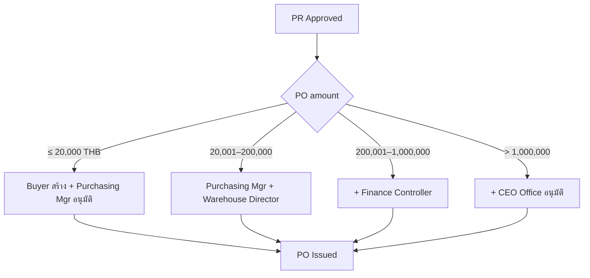

### 2.7 Audit Log Events (capture)

`pr.create`, `pr.submit`, `rfq.create`, `quote.upload`, `quote.view` (RESTRICTED), `po.create`, `po.update`, `po.approve`, `po.reject`, `po.cancel`, `po.export`, `po.download`, `supplier_selection.decide`, `cost.view` (HARD), `price_baseline.view` (RESTRICTED), `blocked_access` (เมื่อ role ต่ำกว่าพยายามดู cost)

---

## 3. Sub-Department: Supplier Management (บริหารซัพพลายเออร์)

### 3.1 หน้าที่

- จัดการ **supplier master data** (onboarding, KYC/นิติบุคคล, เลขผู้เสียภาษี, บัญชีธนาคาร)
- ประเมินซัพพลายเออร์ (**vendor scorecard**: คุณภาพ, ตรงเวลา, ราคา, การตอบสนอง)
- ดูแลสัญญา/ข้อตกลงราคา (**contracts, price agreements, SLA**)
- จัดการ **blacklist / approved vendor list (AVL)**

### 3.2 Position List

| Position | Security Clearance | Data Ownership |
|---|---|---|
| Supplier Relations Manager | HARD + RESTRICTED (contract/bank) | owner `suppliers`, `supplier_contracts` |
| Vendor Evaluation Officer | MEDIUM (scorecard) | owner `supplier_scorecards` |
| Compliance/KYC Officer | RESTRICTED (เอกสารนิติบุคคล/bank) | — |

### 3.3 Workflow: Supplier Onboarding & Evaluation

| ขั้น | Input | Process | Output | Receiver | Approver |
|---|---|---|---|---|---|
| Onboard | เอกสารบริษัท + bank | KYC verify + create master | Supplier record (status=active) | Purchasing, Finance | Supplier Mgr |
| Evaluate | GRN quality, on-time, defects | คำนวณ scorecard | Vendor rating | Purchasing (sourcing) | Supplier Mgr |
| Contract | quote/term sheet | ทำสัญญา + price agreement | Signed contract | Purchasing, Legal/CEO | Director + CEO Office (มูลค่าสูง) |
| Blacklist | incident log | review + decide | AVL update | All buyers | Director |

### 3.4 KPI

| KPI | สูตร [ASSUMPTION] | Data Source | ความถี่ |
|---|---|---|---|
| Supplier On-time Delivery | %GRN ตรงกำหนด ≥ 92% | `goods_receipts`, `po.expected_date` | รายเดือน |
| Supplier Defect Rate | qty_rejected/qty_received ≤ 2% | `goods_receipt_lines` | รายเดือน |
| Active AVL Coverage | %หมวดที่มี ≥2 supplier | `suppliers`, category | รายไตรมาส |
| Contract Renewal Lead-time | สัญญาต่ออายุก่อนหมด ≥ 30 วัน | `supplier_contracts.end_date` | รายเดือน |

### 3.5 ข้อมูล

| Data | สถานะ | Security Level | Data Owner |
|---|---|---|---|
| `suppliers` | **NEW** | MEDIUM (name/contact) / HARD (terms) | Supplier Mgr |
| `supplier_contracts` | **NEW** | **RESTRICTED** | Supplier Mgr (direct grant) |
| `supplier_bank_accounts` / KYC docs | **NEW** | **RESTRICTED** | Compliance Officer |
| `supplier_scorecards` | **NEW** | MEDIUM | Vendor Eval Officer |

### 3.6 Approval Flow

Supplier onboarding → Compliance verify → Supplier Mgr approve → (ถ้ามี contract มูลค่าสูง) → Director → CEO Office. Blacklist ต้อง Director อนุมัติเสมอ.

### 3.7 Audit Log Events

`supplier.create`, `supplier.update`, `supplier.view`, `kyc.upload`, `kyc.view` (RESTRICTED), `bank_account.view`/`bank_account.update` (RESTRICTED), `contract.create`, `contract.view` (RESTRICTED), `scorecard.update`, `supplier.blacklist`, `supplier.activate`, `failed_access`

---

## 4. Sub-Department: Receiving (รับสินค้า)

### 4.1 หน้าที่

- รับสินค้าตาม PO ที่ inbound dock, ตรวจ **3-way reference** (PO ↔ Delivery Note ↔ Physical)
- ตรวจ **QC รับเข้า**: ปริมาณ, สภาพ, **lot/batch, expiry** (สำคัญสำหรับยา/เวชภัณฑ์/วัสดุทันตกรรม)
- ออก **GRN (Goods Receipt Note)**; แจ้ง discrepancy/short/over/damage
- ส่งของไป putaway (Stock In)

### 4.2 Position List

| Position | Security Clearance | Data Ownership |
|---|---|---|
| Receiving Supervisor | HARD | owner `goods_receipts` |
| QC Receiving Officer | MEDIUM | owner `gr_qc_results` |
| Inbound Clerk | MEDIUM (ไม่เห็น unit cost) | — |

### 4.3 Workflow: Receiving → GRN

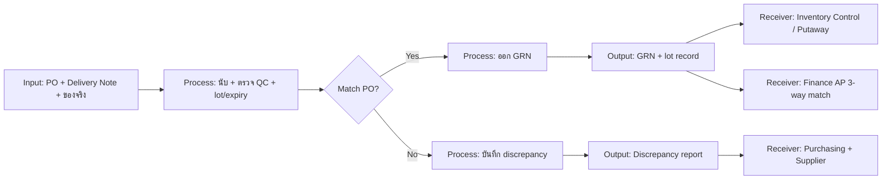

| ขั้น | Input | Process | Output | Receiver | Approver |
|---|---|---|---|---|---|
| Receive | PO + DN + goods | count + QC + lot/expiry | GRN | Inventory, Finance | Receiving Supervisor |
| Discrepancy | mismatch | log short/over/damage | Discrepancy report | Purchasing, Supplier | Receiving Supervisor → Purchasing Mgr |

### 4.4 KPI

| KPI | สูตร [ASSUMPTION] | Data Source | ความถี่ |
|---|---|---|---|
| Receiving Accuracy | %GRN ไม่มี discrepancy ≥ 98% | `goods_receipts`, `gr_discrepancies` | รายสัปดาห์ |
| Dock-to-Stock Time | avg(putaway − GRN) ≤ 4 ชม. | `goods_receipts`, `stock_movements` | รายสัปดาห์ |
| Expiry-Capture Compliance | %line ที่มี lot+expiry ครบ (รายการที่ต้องมี) = 100% | `goods_receipt_lines.lot,expiry` | รายเดือน |

### 4.5 ข้อมูล

| Data | สถานะ | Security Level | Data Owner |
|---|---|---|---|
| `goods_receipts` (GRN) | **NEW** | MEDIUM | Receiving Supervisor |
| `goods_receipt_lines` (qty, lot, expiry) | **NEW** | MEDIUM / HARD (ยาควบคุม → RESTRICTED) | Receiving Supervisor |
| `gr_qc_results` | **NEW** | MEDIUM | QC Officer |
| `gr_discrepancies` | **NEW** | HARD | Receiving Supervisor |

### 4.6 Approval Flow

GRN ปกติ → Receiving Supervisor ยืนยัน. Discrepancy → Receiving Supervisor → Purchasing Mgr (เพื่อ claim/return). ของยา/สารควบคุม → ต้องลงนามผู้รับเพิ่มและแจ้ง Medical/Dental owner.

### 4.7 Audit Log Events

`grn.create`, `grn.update`, `grn.confirm`, `qc.record`, `discrepancy.create`, `lot.record`, `expiry.record`, `controlled_item.receive` (RESTRICTED), `grn.view`, `grn.export`, `blocked_access`

---

## 5. Sub-Department: Inventory Control (ควบคุมสต๊อก)

### 5.1 หน้าที่

- ดูแล **stock master / item master** (SKU, UoM, category, min/max, reorder point, safety stock)
- คำนวณ **reorder** และสร้าง PR อัตโนมัติ (auto-replenishment) ส่งให้ Purchasing
- บริหาร **lot/expiry (FEFO)**, ตรวจ near-expiry, ของเสีย/ทำลาย
- เป็น **system of record ของยอดสต๊อก** (on-hand, reserved, available) ทุกคลัง/สาขา

### 5.2 Position List

| Position | Security Clearance | Data Ownership |
|---|---|---|
| Inventory Control Manager | HARD | owner `inventory_items`, `inventory_balances` |
| Stock Master Analyst | MEDIUM→HARD | owner `inventory_items` |
| Reorder/Planner | MEDIUM | owner auto-PR drafts |

### 5.3 Workflow: Reorder & Stock-Level Control

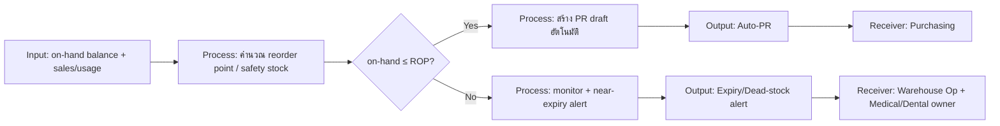

### 5.4 KPI

| KPI | สูตร [ASSUMPTION] | Data Source | ความถี่ |
|---|---|---|---|
| Inventory Accuracy | 1 − abs(system−physical)/system ≥ 98% | `inventory_balances`, `stock_counts` | รายเดือน |
| Stockout Rate | %SKU·วัน ที่ available=0 ≤ 1% | `inventory_balances` | รายสัปดาห์ |
| Near-Expiry Loss | มูลค่าหมดอายุ/มูลค่าสต๊อก ≤ 1% | `inventory_lots.expiry` | รายเดือน |
| Inventory Turnover | COGS/avg inventory (target ตามหมวด) | `stock_movements`, Finance | รายไตรมาส |
| Reorder Lead Accuracy | %auto-PR ที่ไม่ต้องแก้ ≥ 85% | `purchase_requests.source=auto` | รายเดือน |

### 5.5 ข้อมูล

| Data | สถานะ | Security Level | Data Owner |
|---|---|---|---|
| `inventory_items` (item master) | **NEW** | BASIC (ชื่อ/UoM) / HARD (cost) | Inventory Control Mgr |
| `inventory_balances` (on-hand/reserved) | **NEW** | MEDIUM | Inventory Control Mgr |
| `inventory_lots` (lot/expiry) | **NEW** | MEDIUM / RESTRICTED (controlled) | Inventory Control Mgr |
| `stock_movements` (ledger) | **NEW** | MEDIUM | Inventory Control Mgr |
| Auto-PR drafts | **NEW** (`purchase_requests.source`) | MEDIUM | Planner |

### 5.6 Approval Flow

Auto-PR ต้องผ่าน human review (Planner → Purchasing) เสมอ — **ตามหลัก "Copilot not Autopilot" (`ai-router.ts`)**. การปรับ min/max/ROP ที่กระทบต้นทุน → Inventory Mgr อนุมัติ; เปลี่ยน item cost method → Director + Finance.

### 5.7 Audit Log Events

`item.create`, `item.update`, `item.cost_view` (HARD), `balance.adjust` (→ ดู Adjustment ข้อ 9), `reorder.calc`, `auto_pr.create`, `expiry.alert`, `lot.flag_expired`, `min_max.update`, `item.view`, `blocked_access`

---

## 6. Sub-Department: Warehouse Operation (ปฏิบัติการคลัง)

### 6.1 หน้าที่

- **Putaway / Stock In** ของจาก Receiving เข้าตำแหน่ง (bin/location)
- **Pick-Pack** ตาม transfer order / branch demand
- จัดการ **location/bin master**, layout, FEFO picking
- ความปลอดภัยคลัง (cold-chain สำหรับเวชภัณฑ์ **[ASSUMPTION]**, 5S, อุณหภูมิ)

### 6.2 Position List

| Position | Security Clearance | Data Ownership |
|---|---|---|
| Warehouse Operation Supervisor | HARD | owner `stock_movements` (op) |
| Putaway Operator | MEDIUM | — |
| Picker/Packer | MEDIUM | — |
| Cold-chain/Storage Officer | MEDIUM | owner `storage_condition_logs` |

### 6.3 Workflow: Stock In (Putaway) & Pick-Pack

| ขั้น | Input | Process | Output | Receiver | Approver |
|---|---|---|---|---|---|
| Stock In | GRN-confirmed goods | putaway → bin + update balance | `stock_movements(type=IN)` | Inventory Control | Op Supervisor |
| Pick-Pack | Transfer/branch order | FEFO pick + pack | Packed shipment | Logistics | Op Supervisor |

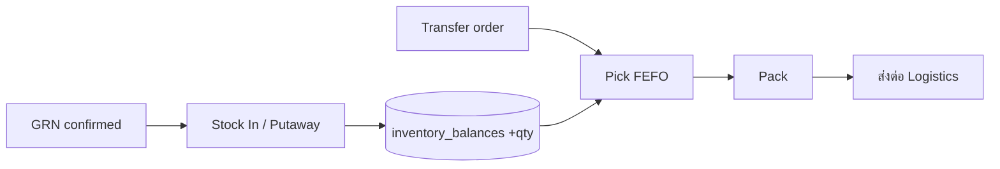

### 6.4 KPI

| KPI | สูตร [ASSUMPTION] | Data Source | ความถี่ |
|---|---|---|---|
| Putaway Accuracy | %ของลง bin ถูกต้อง ≥ 99% | `stock_movements`, location | รายสัปดาห์ |
| Pick Accuracy | 1 − pick_error/total_picks ≥ 99.5% | `stock_movements(type=PICK)`, returns | รายสัปดาห์ |
| Order Fulfillment Time | avg(packed − order) ≤ SLA | transfer order timestamps | รายสัปดาห์ |
| Cold-chain Excursion | จำนวนครั้งอุณหภูมิเกิน = 0 | `storage_condition_logs` | รายวัน |

### 6.5 ข้อมูล

| Data | สถานะ | Security Level | Data Owner |
|---|---|---|---|
| `stock_movements` (IN/PICK/PUTAWAY) | **NEW** | MEDIUM | Op Supervisor |
| `warehouse_locations` (bin master) | **NEW** | BASIC | Op Supervisor |
| `storage_condition_logs` (temp/cold-chain) | **NEW** | MEDIUM | Cold-chain Officer |

### 6.6 Approval Flow

Stock In/Putaway/Pick ปกติ → operator ทำ, Supervisor ยืนยัน batch. เปลี่ยน bin master/layout → Op Supervisor → Inventory Mgr. Cold-chain excursion → แจ้ง Medical/Dental + Director ทันที (potential write-off).

### 6.7 Audit Log Events

`stockin.create`, `putaway.assign`, `pick.create`, `pack.confirm`, `location.create`, `location.update`, `storage_condition.log`, `coldchain.excursion` (alert), `stock_movement.view`, `blocked_access`

---

## 7. Sub-Department: Logistics (จัดส่ง/กระจายสินค้าไปสาขา)

### 7.1 หน้าที่

- วางแผน **distribution ไปสาขา** (route, รอบส่ง, รถ/ขนส่งภายนอก)
- ออก **Transfer / Dispatch / Delivery Order**, ติดตามสถานะถึงปลายทาง
- ยืนยัน **proof of delivery (POD)** จากสาขา; จัดการ return/recall
- เชื่อม Operations (สาขา) เป็นผู้รับปลายทาง

### 7.2 Position List

| Position | Security Clearance | Data Ownership |
|---|---|---|
| Logistics Supervisor | HARD | owner `stock_transfers`, `delivery_orders` |
| Dispatch Coordinator | MEDIUM | owner dispatch records |
| Fleet/Carrier Officer | MEDIUM (carrier cost → HARD) | — |

### 7.3 Workflow: Transfer → Dispatch → POD

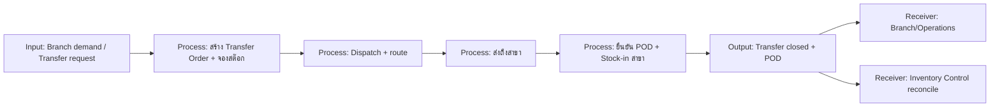

| ขั้น | Input | Process | Output | Receiver | Approver |
|---|---|---|---|---|---|
| Transfer | demand/request | create transfer + reserve | Transfer Order | Warehouse Op (pick) | Logistics Supervisor |
| Dispatch | packed shipment | assign carrier + route | Delivery Order | Branch | Logistics Supervisor |
| POD | receipt at branch | confirm + branch stock-in | Closed transfer | Inventory Control | Branch Manager (รับ) |

### 7.4 KPI

| KPI | สูตร [ASSUMPTION] | Data Source | ความถี่ |
|---|---|---|---|
| On-time Delivery to Branch | %ส่งตรงรอบ ≥ 95% | `delivery_orders` timestamps | รายสัปดาห์ |
| Transfer Accuracy | 1 − qty_diff/qty_sent ≤ 0.5% | `stock_transfers` vs POD | รายเดือน |
| In-transit Loss/Damage | มูลค่าเสียหายระหว่างส่ง ≤ 0.2% | `delivery_orders`, claims | รายเดือน |
| POD Completion | %transfer ที่มี POD ครบ = 100% | `delivery_orders.pod` | รายสัปดาห์ |

### 7.5 ข้อมูล

| Data | สถานะ | Security Level | Data Owner |
|---|---|---|---|
| `stock_transfers` | **NEW** | MEDIUM | Logistics Supervisor |
| `delivery_orders` (+POD) | **NEW** | MEDIUM | Logistics Supervisor |
| Carrier/freight cost | **NEW** | HARD | Logistics Supervisor |

### 7.6 Approval Flow

Transfer ภายในเครือ → Logistics Supervisor. Transfer มูลค่าสูง/recall → Director. POD ฝั่งรับ → Branch Manager (Operations) ยืนยัน; ถ้า qty ไม่ตรง → เปิด adjustment + audit.

### 7.7 Audit Log Events

`transfer.create`, `transfer.dispatch`, `transfer.receive`, `pod.confirm`, `transfer.cancel`, `recall.initiate`, `delivery.view`, `transfer.export`, `blocked_access`

---

## 8. Sub-Department: Stock Audit (ตรวจสอบสต๊อก)

### 8.1 หน้าที่

- ดำเนินการ **cycle count** (รายวัน/สัปดาห์แบบ ABC) และ **physical count ประจำปี**
- **Reconcile** system vs physical, ระบุ variance, สอบหาสาเหตุ
- เสนอ **stock adjustment** (เข้าสู่ flow Adjustment) ที่ผ่านการตรวจสอบ
- เป็น **independent check** (segregation of duties: ไม่ใช่คนเดียวกับ Inventory Control ที่ถือยอด)

> **หลักสำคัญ:** Stock Audit ต้องแยกหน้าที่ (SoD) จาก Inventory Control เพื่อความเที่ยงตรง — เป็น control เชิงป้องกันทุจริต

### 8.2 Position List

| Position | Security Clearance | Data Ownership |
|---|---|---|
| Stock Audit Manager | HARD (อ่านทุก balance) | owner `stock_counts`, `count_variances` |
| Cycle Count Auditor | MEDIUM | owner count sheet ของตน |
| Reconciliation Analyst | HARD | owner `count_variances` |

### 8.3 Workflow: Stock Count → Variance → Recommend Adjustment

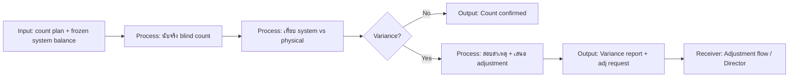

| ขั้น | Input | Process | Output | Receiver | Approver |
|---|---|---|---|---|---|
| Count | count plan + freeze | blind physical count | Count sheet | Audit Mgr | Audit Mgr |
| Reconcile | count vs system | variance + cause | Variance report | Director, Finance | Audit Mgr |
| Recommend | variance | propose adjustment | Adjustment request | Adjustment flow | Director (+Finance) |

### 8.4 KPI

| KPI | สูตร [ASSUMPTION] | Data Source | ความถี่ |
|---|---|---|---|
| Count Coverage | %SKU นับตามแผน ≥ 100% (ABC) | `stock_counts` | รายเดือน |
| Inventory Record Accuracy (IRA) | %line ตรง ≥ 98% | `count_variances` | รายเดือน |
| Variance Resolution Time | avg(adj_approved − variance_logged) ≤ 3 วัน | `count_variances`, `stock_adjustments` | รายเดือน |
| Shrinkage Rate | abs(neg variance value)/inventory ≤ 0.5% | `count_variances` | รายไตรมาส |

### 8.5 ข้อมูล

| Data | สถานะ | Security Level | Data Owner |
|---|---|---|---|
| `stock_counts` (count header) | **NEW** | MEDIUM | Stock Audit Mgr |
| `stock_count_lines` (counted qty) | **NEW** | MEDIUM | Auditor |
| `count_variances` | **NEW** | **HARD** (ชี้ทุจริต/shrinkage) | Stock Audit Mgr |

### 8.6 Approval Flow

Count sheet → Audit Mgr lock. Variance → Audit Mgr → Director; ถ้ามูลค่าเกิน threshold หรือสงสัยทุจริต → **HR investigation (RESTRICTED) + Finance + CEO Office**. การปรับยอดจริงเกิดใน Adjustment (ข้อ 9) — Stock Audit เสนอ ไม่ใช่ปรับเอง (SoD).

### 8.7 Audit Log Events

`count.plan`, `count.start`, `count.line_submit`, `count.lock`, `variance.create`, `variance.investigate`, `variance.escalate` (→ HR/CEO RESTRICTED), `adjustment.recommend`, `count.view`, `blocked_access`

---

## 9. Adjustment Flow (กระบวนการปรับยอดสต๊อก — cross-unit control)

> Adjustment เป็น **control จุดเสี่ยงสูงสุด** ของแผนก (เปิดช่องทุจริตหากปรับยอดได้อิสระ) จึงบังคับ deny-by-default + dual approval + audit RESTRICTED

### 9.1 Workflow

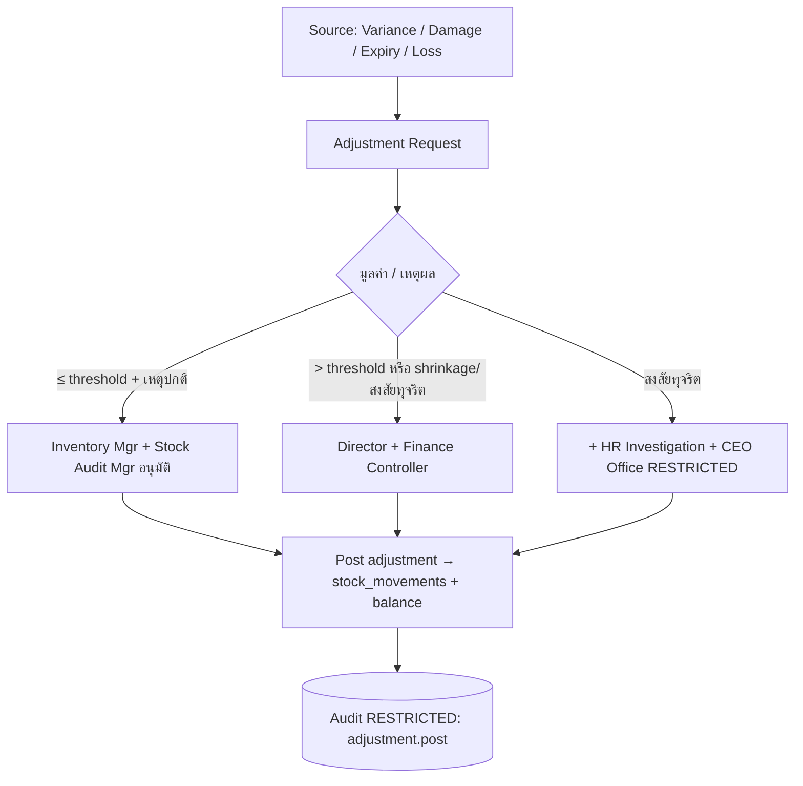

| ขั้น | Input | Process | Output | Receiver | Approver |
|---|---|---|---|---|---|
| Request | variance/damage/loss reason | สร้าง adjustment request | Adjustment request | Approver chain | ตามมูลค่า (ข้างบน) |
| Approve | request | dual control review | Approved adj | Inventory Control | Inventory Mgr + Audit Mgr (+Director/Finance) |
| Post | approved adj | update balance + ledger | `stock_movements(type=ADJ)` | Inventory/Finance | — (auto หลังอนุมัติ) |

### 9.2 ข้อมูล & Security

| Data | สถานะ | Security Level | Data Owner |
|---|---|---|---|
| `stock_adjustments` | **NEW** | **RESTRICTED** (มูลค่าสูง/shrinkage) ม.HARD (เหตุปกติ) | Inventory Control Mgr |
| `stock_movements(type=ADJ)` | **NEW** | HARD | Inventory Control Mgr |

### 9.3 Audit Log Events

`adjustment.request`, `adjustment.approve`, `adjustment.reject`, `adjustment.post` (RESTRICTED, capture before/after balance), `adjustment.reverse`, `adjustment.view`, `blocked_access`, `permission_change` (ถ้ามีการ grant สิทธิ์ปรับยอด)

---

## 10. Sub-Department: Asset Control (ควบคุมทรัพย์สินถาวร)

### 10.1 หน้าที่

- ทะเบียน **fixed asset register** (เครื่องเลเซอร์, ยูนิตทันตกรรม, เครื่องมือแพทย์, IT, เฟอร์นิเจอร์)
- **asset tagging** (barcode/QR), จัดสรรไปสาขา, ติดตามตำแหน่ง/ผู้ถือครอง
- **depreciation schedule** (ร่วม Finance), maintenance, transfer, disposal/write-off
- **annual asset audit** (นับทรัพย์สินจริง vs ทะเบียน)

### 10.2 Position List

| Position | Security Clearance | Data Ownership |
|---|---|---|
| Asset Control Manager | HARD (cost/depreciation) | owner `fixed_assets` |
| Asset Register Officer | MEDIUM | owner tag records |
| Maintenance Coordinator | MEDIUM | owner `asset_maintenance` |

### 10.3 Workflow: Asset Lifecycle

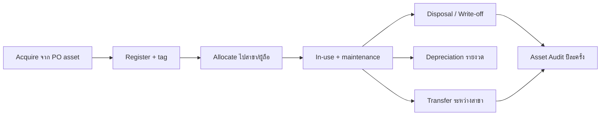

| ขั้น | Input | Process | Output | Receiver | Approver |
|---|---|---|---|---|---|
| Register | GRN asset + cost | สร้าง asset + tag | Asset record | Finance, Branch | Asset Mgr |
| Allocate | request | assign custodian/branch | Allocation record | Branch Manager | Asset Mgr |
| Transfer | move request | update custodian/location | Asset transfer | Branch | Asset Mgr (+Director มูลค่าสูง) |
| Disposal | EOL/damaged | write-off + remove | Disposal record | Finance | Director + Finance + CEO (มูลค่าสูง) |

### 10.4 KPI

| KPI | สูตร [ASSUMPTION] | Data Source | ความถี่ |
|---|---|---|---|
| Asset Register Accuracy | %asset พบจริงตรงทะเบียน ≥ 99% | `fixed_assets`, asset audit | รายปี |
| Tagging Compliance | %asset มี tag = 100% | `fixed_assets.tag` | รายไตรมาส |
| Maintenance On-schedule | %งาน PM ตรงเวลา ≥ 90% | `asset_maintenance` | รายเดือน |
| Disposal Approval Compliance | %disposal มี approval ครบ = 100% | `asset_disposals` | รายไตรมาส |

### 10.5 ข้อมูล

| Data | สถานะ | Security Level | Data Owner |
|---|---|---|---|
| `fixed_assets` | **NEW** | HARD (cost/NBV) / MEDIUM (location) | Asset Control Mgr |
| `asset_allocations` | **NEW** | MEDIUM | Asset Control Mgr |
| `asset_maintenance` | **NEW** | MEDIUM | Maintenance Coordinator |
| `asset_disposals` | **NEW** | **RESTRICTED** (write-off มูลค่าสูง) | Asset Control Mgr |

### 10.6 Approval Flow

Register/allocate → Asset Mgr. Transfer มูลค่าสูง → +Director. **Disposal/write-off → Director + Finance Controller + CEO Office (RESTRICTED)** เสมอ (จุดเสี่ยงทุจริต).

### 10.7 Audit Log Events

`asset.create`, `asset.tag`, `asset.allocate`, `asset.transfer`, `asset.maintenance_log`, `asset.depreciation_post`, `asset.disposal_request`, `asset.disposal_approve` (RESTRICTED), `asset.cost_view` (HARD), `asset.view`, `blocked_access`

---

## 11. Data Model — รายตารางใหม่ (Migrations) + มาตรฐานคอลัมน์

### 11.1 มาตรฐานคอลัมน์บังคับทุกตาราง (Standard Envelope)

ทุกตาราง core ของแผนกนี้ **ต้องมี** (สอดคล้องกฎ global; โค้ดเดิม **ไม่มี** soft-delete/version/security_level — จึงเป็น **NEW** ทั้งหมด):

```sql
-- Standard envelope ใช้ซ้ำทุกตาราง (NEW)
id            TEXT PRIMARY KEY,              -- randomUUID() (ตามแบบ NEXUS)
company_id    TEXT NOT NULL REFERENCES companies(id),
branch_id     TEXT REFERENCES branches(id), -- ABAC scoping (branches EXISTS v8)
created_at    TIMESTAMPTZ NOT NULL DEFAULT now(),
updated_at    TIMESTAMPTZ NOT NULL DEFAULT now(),
deleted_at    TIMESTAMPTZ,                   -- soft-delete (NEW concept ทั้งระบบ)
created_by    TEXT NOT NULL REFERENCES users(id),
updated_by    TEXT REFERENCES users(id),
deleted_by    TEXT REFERENCES users(id),
is_active     BOOLEAN NOT NULL DEFAULT true,
version       INTEGER NOT NULL DEFAULT 1,    -- optimistic lock
security_level TEXT NOT NULL DEFAULT 'MEDIUM'
              CHECK (security_level IN ('BASIC','MEDIUM','HARD','RESTRICTED')),
owner_id      TEXT REFERENCES users(id)      -- data-ownership (ABAC)
```

### 11.2 รายการตารางใหม่ (Migration Set: `warehouse_purchasing`)

| # | Table | Sub-Unit | Status | Default security_level |
|---|---|---|---|---|
| 1 | `suppliers` | Supplier Mgmt | NEW | MEDIUM |
| 2 | `supplier_contracts` | Supplier Mgmt | NEW | RESTRICTED |
| 3 | `supplier_bank_accounts` | Supplier Mgmt | NEW | RESTRICTED |
| 4 | `supplier_scorecards` | Supplier Mgmt | NEW | MEDIUM |
| 5 | `purchase_requests` | Purchasing | NEW | MEDIUM |
| 6 | `purchase_request_lines` | Purchasing | NEW | HARD |
| 7 | `rfq_quotes` | Purchasing | NEW | RESTRICTED |
| 8 | `price_baseline` | Purchasing | NEW | RESTRICTED |
| 9 | `purchase_orders` | Purchasing | NEW | HARD |
| 10 | `po_lines` | Purchasing | NEW | HARD |
| 11 | `goods_receipts` | Receiving | NEW | MEDIUM |
| 12 | `goods_receipt_lines` | Receiving | NEW | MEDIUM |
| 13 | `gr_qc_results` | Receiving | NEW | MEDIUM |
| 14 | `gr_discrepancies` | Receiving | NEW | HARD |
| 15 | `inventory_items` | Inventory Control | NEW | BASIC (cost field HARD) |
| 16 | `inventory_balances` | Inventory Control | NEW | MEDIUM |
| 17 | `inventory_lots` | Inventory Control | NEW | MEDIUM |
| 18 | `stock_movements` | Warehouse Op | NEW | MEDIUM |
| 19 | `warehouse_locations` | Warehouse Op | NEW | BASIC |
| 20 | `storage_condition_logs` | Warehouse Op | NEW | MEDIUM |
| 21 | `stock_transfers` | Logistics | NEW | MEDIUM |
| 22 | `delivery_orders` | Logistics | NEW | MEDIUM |
| 23 | `stock_counts` | Stock Audit | NEW | MEDIUM |
| 24 | `stock_count_lines` | Stock Audit | NEW | MEDIUM |
| 25 | `count_variances` | Stock Audit | NEW | HARD |
| 26 | `stock_adjustments` | Adjustment | NEW | RESTRICTED |
| 27 | `fixed_assets` | Asset Control | NEW | HARD |
| 28 | `asset_allocations` | Asset Control | NEW | MEDIUM |
| 29 | `asset_maintenance` | Asset Control | NEW | MEDIUM |
| 30 | `asset_disposals` | Asset Control | NEW | RESTRICTED |

### 11.3 ตัวอย่าง DDL หลัก (purchase_orders + stock_movements)

```sql
-- (NEW) purchase_orders
CREATE TABLE purchase_orders (
  -- standard envelope --
  id TEXT PRIMARY KEY,
  company_id TEXT NOT NULL REFERENCES companies(id),
  branch_id TEXT REFERENCES branches(id),
  created_at TIMESTAMPTZ NOT NULL DEFAULT now(),
  updated_at TIMESTAMPTZ NOT NULL DEFAULT now(),
  deleted_at TIMESTAMPTZ,
  created_by TEXT NOT NULL REFERENCES users(id),
  updated_by TEXT REFERENCES users(id),
  deleted_by TEXT REFERENCES users(id),
  is_active BOOLEAN NOT NULL DEFAULT true,
  version INTEGER NOT NULL DEFAULT 1,
  security_level TEXT NOT NULL DEFAULT 'HARD'
    CHECK (security_level IN ('BASIC','MEDIUM','HARD','RESTRICTED')),
  owner_id TEXT REFERENCES users(id),
  -- domain --
  po_number TEXT NOT NULL,
  supplier_id TEXT NOT NULL REFERENCES suppliers(id),
  pr_id TEXT REFERENCES purchase_requests(id),
  status TEXT NOT NULL DEFAULT 'draft'
    CHECK (status IN ('draft','pending_approval','approved','issued',
                      'partially_received','received','closed','cancelled','rejected')),
  currency TEXT NOT NULL DEFAULT 'THB',
  subtotal NUMERIC(14,2) NOT NULL DEFAULT 0 CHECK (subtotal >= 0),
  tax NUMERIC(14,2) NOT NULL DEFAULT 0 CHECK (tax >= 0),
  total NUMERIC(14,2) NOT NULL DEFAULT 0 CHECK (total >= 0),
  payment_terms TEXT,
  expected_date DATE,
  approved_by TEXT REFERENCES users(id),
  approved_at TIMESTAMPTZ,
  UNIQUE (company_id, po_number)
);
CREATE INDEX ix_po_company_status ON purchase_orders (company_id, status)
  WHERE deleted_at IS NULL;
CREATE INDEX ix_po_supplier ON purchase_orders (company_id, supplier_id);

-- (NEW) stock_movements — immutable ledger (append-only ในเชิงธุรกิจ)
CREATE TABLE stock_movements (
  id TEXT PRIMARY KEY,
  company_id TEXT NOT NULL REFERENCES companies(id),
  branch_id TEXT REFERENCES branches(id),
  created_at TIMESTAMPTZ NOT NULL DEFAULT now(),
  created_by TEXT NOT NULL REFERENCES users(id),
  security_level TEXT NOT NULL DEFAULT 'MEDIUM',
  item_id TEXT NOT NULL REFERENCES inventory_items(id),
  lot_id TEXT REFERENCES inventory_lots(id),
  location_id TEXT REFERENCES warehouse_locations(id),
  movement_type TEXT NOT NULL
    CHECK (movement_type IN ('IN','PUTAWAY','PICK','TRANSFER_OUT','TRANSFER_IN','ADJ','DISPOSAL')),
  qty NUMERIC(14,3) NOT NULL CHECK (qty <> 0),
  ref_table TEXT,    -- 'goods_receipts' | 'stock_transfers' | 'stock_adjustments' ...
  ref_id TEXT,
  reason TEXT
);
CREATE INDEX ix_mov_item ON stock_movements (company_id, item_id, created_at);
-- ปรับยอดผ่าน adjustment เท่านั้น; ledger ห้าม UPDATE/DELETE (revoke grant + trigger)
```

### 11.4 ความสัมพันธ์ (ER ย่อ)

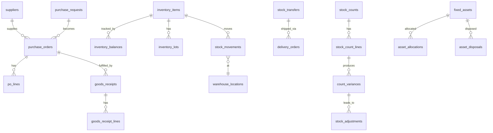

---

## 12. Permission Model (RBAC + ABAC + Data-Ownership) สำหรับแผนกนี้

### 12.1 หลักการบังคับใช้ (Backend-only, deny-by-default)

ทุก endpoint ของแผนก (`/api/warehouse/*`, `/api/purchasing/*` — **NEW routes**) ต้องผ่าน 3 ชั้น:

1. **RBAC** — `requireModule('warehouse')` (มี `requireRole`/`requireModule` ใน `middleware/rbac.ts` แล้ว — **EXISTS**; route ใหม่ต้อง wire)
2. **ABAC** — ตรวจ `branch_id` ∈ branches ที่ user เข้าถึง + `sub_unit`/`position` (ต้องสร้าง policy helper **NEW** ต่อยอด `departmentScope()` ที่ปัจจุบันคืน department string)
3. **Data-Ownership** — ตรวจ `owner_id`/`created_by` หรือ manager-of-owner สำหรับ HARD; RESTRICTED ต้องมี **direct grant** ใน `user_permission_groups` หรือ resource-ACL (**NEW** — ระบบเดิมยังไม่มี resource ACL)

### 12.2 Security Level Matrix (รายความอ่อนไหว)

| ข้อมูล | BASIC | MEDIUM | HARD | RESTRICTED |
|---|---|---|---|---|
| item ชื่อ/UoM/location | ✅ ทุกคนในแผนก | | | |
| on-hand balance, movements | | ✅ ทั้งแผนก | | |
| unit cost, PO total, margin | | | ✅ owner/mgr/Director | |
| supplier contract/bank/KYC | | | | ✅ direct grant |
| RFQ competitor quotes, price baseline | | | | ✅ direct grant |
| count variance, shrinkage | | | ✅ Audit Mgr/Director | |
| stock adjustment (มูลค่าสูง/ทุจริต) | | | | ✅ Director+Finance+CEO/HR |
| asset cost/NBV, disposal/write-off | | | ✅ (cost) | ✅ (disposal) |
| controlled drug lot/expiry/ผู้เบิก | | | | ✅ + Medical/Dental owner |

### 12.3 Policy ตัวอย่าง (pseudo)

```json
{
  "resource": "purchase_orders",
  "rules": [
    { "effect": "allow", "action": "read",  "when": "user.module('warehouse') AND record.branch_id IN user.branches AND record.security_level <= 'MEDIUM'" },
    { "effect": "allow", "action": "read",  "when": "record.security_level == 'HARD' AND (user.is(owner) OR user.manages(owner) OR user.role IN ['warehouse_director','finance','admin'])" },
    { "effect": "allow", "action": "approve","when": "user.position.approval_limit >= record.total" },
    { "effect": "deny",  "action": "*",      "when": "default" }
  ]
}
```

---

## 13. AI Access Control เฉพาะแผนก (AI ไม่อ่าน DB ตรง)

### 13.1 Flow บังคับ (ผูกกับ `ai-router.ts` EXISTS + `ai_query_logs` NEW)

```mermaid
flowchart LR
  Q[User query เช่น 'สต๊อก filler สาขา A เหลือเท่าไหร่'] --> ID[Identify user + role/dept/position/clearance]
  ID --> CHK[Check: warehouse module? branch scope? security_level?]
  CHK --> FIL[Filter: คืนเฉพาะ item/branch ที่ allowed<br/>ตัด cost ถ้า < HARD]
  FIL --> RED[Redaction: mask supplier price/bank/contract/controlled-drug]
  RED --> MODEL[ส่งเฉพาะ allowed data → model]
  MODEL --> OUT[Response]
  OUT --> RED2[Output redaction check ซ้ำ]
  RED2 --> LOG[(ai_query_logs + audit linked by request_id)]
```

### 13.2 กฎ AI ของแผนกนี้

- AI **ห้ามเปิดเผย**: unit cost / margin / supplier contract / bank / RFQ quotes / price baseline / count variance / adjustment มูลค่าสูง / controlled-drug custody ให้ผู้ที่ clearance ไม่ถึง — แม้ผู้ใช้จะถามตรง ๆ
- ก่อนส่ง prompt ออก external provider → **redaction** mask ฟิลด์ RESTRICTED/HARD (ระบบเดิม `sanitize.ts` strip แค่ password — **ต้องเพิ่ม warehouse redactor NEW**)
- ทุก AI query/response ลง `ai_query_logs` (**NEW**): `request_id, user_id, role, prompt_redacted, response, provider, model, tokens, latency, decision(auto|suggest|human), grounded, redaction_applied, allowed_scope, created_at` — และ link เข้า `audit_log` ผ่าน `request_id`
- Action ที่ AI เสนอ (เช่น auto-PR, suggest reorder) = **decision rights = human/suggest** เสมอ (Copilot not Autopilot) — ไม่ post movement/adjustment อัตโนมัติ

### 13.3 Audit Log Events (AI)

`ai_query` (warehouse scope), `ai_response`, `ai_blocked` (พยายามดึง RESTRICTED), `ai_redaction_applied`, `ai_suggestion_created` (auto-PR draft), `failed_access`

---

## 14. Audit Log — มาตรฐานเหตุการณ์ของแผนก (สรุปรวม)

### 14.1 โครงสร้าง `audit_log` ที่ต้องขยาย (EXTEND migration)

ตาราง `audit_log` เดิม (**EXISTS**) มีแค่ `action, resource, resource_id, security_tier, meta, created_at` — ต้อง **EXTEND (NEW migration)** ให้มีครบ:

```sql
ALTER TABLE audit_log ADD COLUMN actor_role     TEXT;
ALTER TABLE audit_log ADD COLUMN target_table   TEXT;
ALTER TABLE audit_log ADD COLUMN target_id      TEXT;
ALTER TABLE audit_log ADD COLUMN target_security_level TEXT
  CHECK (target_security_level IN ('BASIC','MEDIUM','HARD','RESTRICTED'));
ALTER TABLE audit_log ADD COLUMN before_state   JSONB;
ALTER TABLE audit_log ADD COLUMN after_state    JSONB;
ALTER TABLE audit_log ADD COLUMN changed_fields TEXT[];
ALTER TABLE audit_log ADD COLUMN ip_address     INET;
ALTER TABLE audit_log ADD COLUMN device         TEXT;
ALTER TABLE audit_log ADD COLUMN user_agent     TEXT;
ALTER TABLE audit_log ADD COLUMN request_id     TEXT;
ALTER TABLE audit_log ADD COLUMN session_id     TEXT;
ALTER TABLE audit_log ADD COLUMN endpoint       TEXT;
ALTER TABLE audit_log ADD COLUMN http_method    TEXT;
ALTER TABLE audit_log ADD COLUMN result         TEXT CHECK (result IN ('success','failure','blocked'));
ALTER TABLE audit_log ADD COLUMN failure_reason TEXT;
ALTER TABLE audit_log ADD COLUMN prev_hash      TEXT;  -- hash-chain tamper-evidence
ALTER TABLE audit_log ADD COLUMN row_hash       TEXT;
-- บังคับ append-only: REVOKE UPDATE,DELETE + trigger ป้องกัน + retention policy
REVOKE UPDATE, DELETE ON audit_log FROM PUBLIC;
```

> หมายเหตุ: ปัจจุบัน `writeAudit()` เป็น fire-and-forget swallow error — สำหรับ action **RESTRICTED/HARD** ของแผนกนี้ต้องเปลี่ยนเป็น **guaranteed write** (ถ้า audit ล้มเหลว → ปฏิเสธ action) **[NEW behavior]**

### 14.2 Event Catalog รวมของแผนก (action keys)

| กลุ่ม | Events |
|---|---|
| Auth/Session | `login`, `logout`, `failed_access`, `blocked_access` |
| Purchasing | `pr.create/submit/approve/reject`, `rfq.create`, `quote.view`(RESTRICTED), `po.create/update/approve/reject/cancel/export/download`, `cost.view`(HARD), `price_baseline.view`(RESTRICTED) |
| Supplier | `supplier.create/update/view/blacklist/activate`, `kyc.view`(RESTRICTED), `bank_account.view/update`(RESTRICTED), `contract.create/view`(RESTRICTED), `scorecard.update` |
| Receiving | `grn.create/update/confirm/view/export`, `qc.record`, `discrepancy.create`, `controlled_item.receive`(RESTRICTED) |
| Inventory | `item.create/update/view`, `item.cost_view`(HARD), `reorder.calc`, `auto_pr.create`, `expiry.alert`, `min_max.update` |
| Warehouse Op | `stockin.create`, `putaway.assign`, `pick.create`, `pack.confirm`, `location.create/update`, `coldchain.excursion` |
| Logistics | `transfer.create/dispatch/receive/cancel`, `pod.confirm`, `recall.initiate`, `delivery.view/export` |
| Stock Audit | `count.plan/start/lock`, `variance.create/investigate/escalate`, `adjustment.recommend` |
| Adjustment | `adjustment.request/approve/reject/post`(RESTRICTED, before/after)/`reverse`/`view` |
| Asset | `asset.create/tag/allocate/transfer/maintenance_log/depreciation_post`, `asset.disposal_request/approve`(RESTRICTED), `asset.cost_view`(HARD) |
| Permission | `permission_change`, `role_change`, `grant.add/remove` (RESTRICTED grants) |
| AI | `ai_query`, `ai_response`, `ai_blocked`, `ai_redaction_applied`, `ai_suggestion_created` |
| Data | `view/search/create/update/delete/soft_delete/restore/upload/download/export` (generic, ทุกตาราง) |

ทุก event บันทึก: `actor, actor_role, target_table, target_id, target_security_level, before_state, after_state, changed_fields, ip, device, user_agent, request_id, session_id, endpoint, http_method, result, failure_reason, created_at` + hash-chain.

---

## 15. Segregation of Duties (SoD) — Control Matrix สำคัญ

| กิจกรรม | ผู้ทำ | ผู้สอบ/อนุมัติ (ต้องคนละคน) |
|---|---|---|
| สร้าง PR | Requester dept | Purchasing approve |
| สร้าง PO / เลือก supplier | Buyer | Purchasing Mgr / Director |
| รับของ (GRN) | Receiving | ≠ ผู้สร้าง PO |
| ถือยอดสต๊อก (balance) | Inventory Control | **Stock Audit (independent)** |
| ตรวจนับ | Stock Audit | ≠ Inventory Control |
| ปรับยอด (adjustment) | Inventory Control post | **dual: Inventory Mgr + Audit Mgr (+Director/Finance)** |
| จ่ายเงิน supplier | Finance AP | ≠ Purchasing (3-way match PO+GRN+Invoice) |
| disposal ทรัพย์สิน | Asset Control | Director + Finance + CEO Office |

> **หลัก:** ไม่มีบุคคลใดควบคุมครบทั้ง create → approve → record → reconcile ในสายเดียว เพื่อกันทุจริตจัดซื้อ/สต๊อก

---

## 16. สรุปสถานะ Build (EXISTS vs NEW)

| องค์ประกอบ | EXISTS | NEW (migration/dev) |
|---|---|---|
| Role/module `warehouse` | ✅ | wire route ใหม่ |
| โครงสร้าง org (`org_units`/`positions`) | ✅ data | wire เข้า ABAC |
| `branches` scoping | ✅ table | wire เข้า authz |
| ตาราง PR/PO/GRN/inventory/transfer/count/adjustment/asset (30 ตาราง) | — | ✅ ทั้งหมด |
| Standard envelope (soft-delete/version/security_level/owner_id) | — | ✅ ทั้งระบบ |
| `audit_log` ครบ before/after/ip/ua/request_id/hash-chain + append-only | ⚠️ บางส่วน | ✅ EXTEND |
| Guaranteed audit write สำหรับ HARD/RESTRICTED | — | ✅ |
| `ai_query_logs` + warehouse redactor | — | ✅ |
| Policy engine (RBAC+ABAC+ownership+resource ACL) | ⚠️ ad-hoc | ✅ |

---

> **บทสรุป:** แผนก Warehouse & Purchasing ครอบคลุม 8 sub-unit ตาม flow `PR → Approval → PO → Receiving → Stock In → Transfer → Stock Count → Adjustment → Audit` โดยจุดควบคุมเข้มสุดคือ **ราคา/สัญญาซัพพลายเออร์ (RESTRICTED)**, **adjustment/shrinkage (RESTRICTED + dual approval)**, **disposal ทรัพย์สิน (RESTRICTED)** และ **controlled-drug traceability** — บังคับ deny-by-default + SoD + append-only audit + AI redaction ทุกจุด บนฐาน NEXUS OS เดิมพร้อมรายการ migration ที่ระบุชัดเจน 30 ตารางใหม่ + การ EXTEND `audit_log`.
