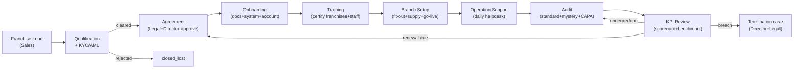
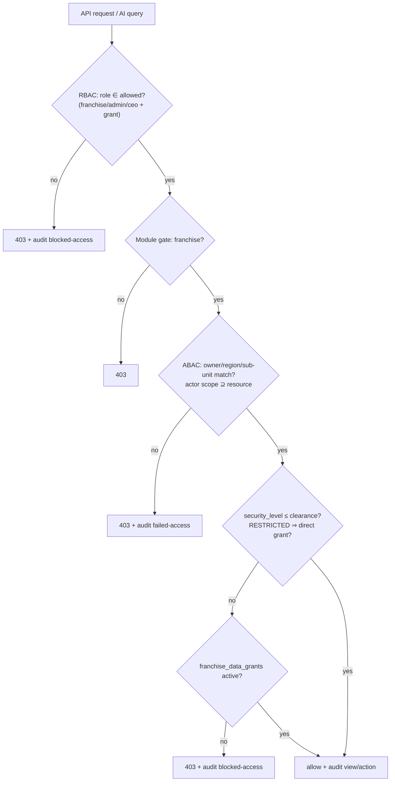
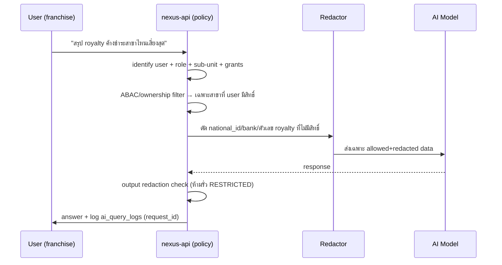

# 09 — Department Breakdown: แผนกแฟรนไชส์ (Franchise Department)

> **เอกสารสถาปัตยกรรมระดับ Production** — Saduak Suay Mai PCL · NEXUS OS AI Workforce OS
> **Classification ของเอกสารนี้:** `HARD` (internal architecture) — ข้อมูลที่อธิบายไล่ตั้งแต่ `BASIC` → `RESTRICTED`
> **Scope:** Franchise Department ทั้งแผนก + 8 sub-unit · ครอบคลุม lifecycle ตั้งแต่ Lead → Qualification → Agreement → Onboarding → Training → Branch Setup → Operation Support → Audit → KPI Review
> **กฎหมาย/มาตรฐานที่บังคับใช้:** PDPA (พ.ร.บ.คุ้มครองข้อมูลส่วนบุคคล พ.ศ. 2562), พ.ร.บ.ว่าด้วยข้อสัญญาที่ไม่เป็นธรรม, ประมวลกฎหมายแพ่งและพาณิชย์ (สัญญาแฟรนไชส์/license), แนวปฏิบัติ Franchise Disclosure (FDD-style) ของกรมพัฒนาธุรกิจการค้า, AML/KYC สำหรับ franchisee นิติบุคคล

---

## 0. หลักการบังคับ (Non-negotiable Principles) สำหรับแผนกแฟรนไชส์

แผนกแฟรนไชส์เป็นแผนกที่ **ขยายแบรนด์ออกนอกองค์กร** ไปอยู่ในมือพาร์ตเนอร์ภายนอก (franchisee) จึงถือข้อมูล 3 กลุ่มที่ sensitivity ต่างกันมาก: (1) **prospect PII + เอกสารการเงินส่วนบุคคล** ของผู้สนใจซื้อแฟรนไชส์, (2) **สัญญา/ค่าธรรมเนียม/royalty/เงื่อนไขการเงิน** ของแต่ละสาขา, (3) **brand IP / SOP / playbook / สูตรราคา** ที่เป็นความลับทางการค้า กฎเข้มของแผนกนี้:

1. **Deny-by-default + ownership chain** — franchisee แต่ละราย "เป็นเจ้าของ" data ของตน (`data_ownership.owner_id = franchise_lead_id / franchisee_id`) franchisee เห็นได้เฉพาะ data สาขาตน; พนักงาน HQ เห็นได้ตาม sub-unit ที่รับผิดชอบ deal/สาขานั้นเท่านั้น (ABAC `assigned_owner` / `assigned_region`) — **ไม่มี department-wide read** สำหรับ data ระดับ HARD/RESTRICTED
2. **RESTRICTED-by-default สำหรับสัญญา-การเงิน-IP** — `franchise_agreements`, `franchise_financials`, `royalty_invoices`, `franchise_disclosure_docs`, `brand_playbooks (confidential)`, `franchise_termination_cases` มี `security_level = 'RESTRICTED'` เป็นค่าเริ่มต้น เข้าถึงต้องผ่าน **direct grant** (Franchise Director / Legal / CFO / assigned owner) เท่านั้น
3. **KYC/AML gate ก่อน Agreement** — ห้ามออกสัญญาให้ franchise lead ที่ยังไม่ผ่าน `kyc_status = 'cleared'` (verify นิติบุคคล/แหล่งเงินทุน/ประวัติ) — บังคับใน backend ที่ state transition `QUALIFIED → AGREEMENT`
4. **Segregation of Duties (SoD)** — ผู้ **ขาย** แฟรนไชส์ (Franchise Sales) ห้ามเป็นผู้ **อนุมัติ** สัญญา/ราคา/ส่วนลด คนเดียวกัน; ผู้ **ตรวจ** สาขา (Audit) ห้ามเป็นผู้ **ดูแล** สาขาเดียวกัน (Success/Support) — บังคับด้วย ABAC `actor_id != owner_id` + approval chain
5. **AI ห้ามอ่าน DB ตรง** — AI เห็น franchise data ได้เฉพาะหลัง clearance + ownership filter + **redaction** (ปกปิด national_id, bank account, ตัวเลข royalty รายสาขาเมื่อผู้ถามไม่มีสิทธิ์); ทุก AI query ที่แตะ RESTRICTED log แยกใน `ai_query_logs` ผูกด้วย `request_id`
6. **Audit ทุก mutation + ทุก read ของ RESTRICTED** — เปิด/ดู/ส่งออก สัญญา, royalty, financial, disclosure doc ต้อง audit แบบ append-only พร้อม `before/after`, `ip`, `request_id`, `grant_id` ที่ใช้อ้างสิทธิ์
7. **Immutable agreement versioning** — สัญญาแฟรนไชส์เป็น **versioned + e-sign hash**; แก้แล้วต้องสร้าง version ใหม่ (`version++`) ห้าม overwrite; เก็บ `signed_pdf_hash` (SHA-256) tamper-evidence
8. **Conflict-of-interest / territory exclusivity** — ระบบบังคับตรวจ `territory_overlap` ก่อนอนุมัติสาขาใหม่ (ห้ามเปิดทับเขต exclusivity ของ franchisee เดิม)

> **Grounding หมายเหตุ:** วันนี้ NEXUS OS มีเพียงตาราง **`franchise_audits`** (entity schema; T1; columns `branch_code, checklist_passed/total, mystery_score, notes, audit_date`) — ครอบคลุมแค่ขั้น **Audit** และยัง **ไม่มี** soft-delete / versioning / before-after / owner model นอกจากนี้มี data taxonomy entries `franchise_kpi_benchmark`, `royalty_payment_status`, `brand_compliance` (ใน `tamada-data-taxonomy.ts`) ที่เป็นแค่ KPI definition; RBAC มี role `franchise` ผูก module `franchise` (`['admin','ceo','franchise']`) และ `departments.ts` มี dept `Franchise` (`แฟรนไชส์`). **ทั้ง lead/agreement/onboarding/royalty/training/success/support pipeline ยังไม่มีตารางรองรับ** จึงเสนอ migration ชุดใหม่ทั้งหมดด้านล่าง (ทำเครื่องหมาย **[NEW]**) โดย `franchise_audits` เดิมถูกยกระดับเป็น `franchise_audits_v2` (**[NEW · migrate-from `franchise_audits`]**) ให้มีคอลัมน์มาตรฐาน (company_id, soft-delete, version, security_level, before/after-friendly)

---

## 1. ภาพรวมแผนก (Department Overview)

### 1.1 ตำแหน่งในผังองค์กร

```
Company (Saduak Suay Mai PCL)
└── Department: Franchise (รหัส DEPT-FRA · system role `franchise`)
    ├── Sub-Dept: Franchise Sales        (หา/ปิดดีลผู้ซื้อแฟรนไชส์)
    ├── Sub-Dept: Onboarding             (รับเข้าระบบ + เอกสาร + setup)
    ├── Sub-Dept: Success (Partner Success) (ดูแลความสำเร็จระยะยาว/ต่ออายุ)
    ├── Sub-Dept: Operations             (มาตรฐานปฏิบัติการ + royalty + supply)
    ├── Sub-Dept: Training               (อบรม franchisee + ทีมสาขา)
    ├── Sub-Dept: Audit                  (ตรวจมาตรฐาน/mystery shopper/compliance)
    ├── Sub-Dept: Support (Helpdesk)     (รับเรื่อง/แก้ปัญหารายวันของสาขา)
    └── Sub-Dept: Performance (Analytics) (KPI review/benchmark/scorecard)
```

> **[ASSUMPTION]** โครงสร้าง 8 sub-unit นี้สมเหตุผลกับเชนคลินิกความงาม+ทันตกรรมแบบแฟรนไชส์ในไทย จำนวน franchisee/สาขา/headcount จริงไม่ทราบ — ทุกตัวเลข headcount/KPI target/fee ด้านล่างเป็น **[ASSUMPTION]** (สมมติเชิงสมเหตุผล: ~25 สาขาแฟรนไชส์, royalty 5–7% ของรายได้, franchise fee 1.5–3.0 ลบ./สาขา)

### 1.2 Mermaid — Sub-tree ของ Franchise Department

```mermaid
graph TD
    FRA["🏪 Franchise Department<br/>role: franchise · DEPT-FRA"]

    FRA --> FS["Franchise Sales<br/>clearance: MEDIUM→HARD grant"]
    FRA --> ONB["Onboarding"]
    FRA --> SUC["Partner Success"]
    FRA --> OPS["Franchise Operations"]
    FRA --> TRN["Training"]
    FRA --> AUD["Audit / Compliance"]
    FRA --> SUP["Support (Helpdesk)"]
    FRA --> PERF["Performance (Analytics)"]

    FS --> FS1["Head of Franchise Sales"]
    FS --> FS2["Franchise Sales Executive"]
    FS --> FS3["Franchise Development Analyst"]

    ONB --> ONB1["Onboarding Manager"]
    ONB --> ONB2["Onboarding Coordinator"]
    ONB --> ONB3["Legal/Contract Officer*"]

    SUC --> SUC1["Partner Success Manager"]
    SUC --> SUC2["Account Manager (Franchisee)"]

    OPS --> OPS1["Franchise Operations Manager"]
    OPS --> OPS2["Royalty & Billing Officer"]
    OPS --> OPS3["Supply Coordinator*"]

    TRN --> TRN1["Franchise Training Lead"]
    TRN --> TRN2["Field Trainer"]

    AUD --> AUD1["Franchise Audit Lead"]
    AUD --> AUD2["Field Auditor / Mystery Shopper Coordinator"]

    SUP --> SUP1["Franchise Support Lead"]
    SUP --> SUP2["Support Agent (Tier 1/2)"]

    PERF --> PERF1["Franchise Performance Analyst"]

    FRA --> DIR["Franchise Director / Head of Franchise<br/>(เจ้าของ data RESTRICTED ของแผนก)"]
```



> `*` = ตำแหน่งที่ทำงานข้ามสายกับแผนกอื่น (Legal/Contract → ร่วม People/Legal; Supply Coordinator → ร่วม Warehouse & Purchasing) แต่ในบริบทแฟรนไชส์รายงานสายงานที่ Franchise Director

### 1.3 หน้าที่ระดับแผนก (Department-level Responsibilities)

| # | หน้าที่ (หน้าที่หลัก) | ผลลัพธ์ที่ส่งมอบ |
|---|---|---|
| 1 | สร้างและบริหาร pipeline การขายแฟรนไชส์ ตั้งแต่ lead จนเซ็นสัญญา | จำนวนสาขาแฟรนไชส์ใหม่ตามเป้า, คุณภาพ partner |
| 2 | Onboarding franchisee เข้าสู่มาตรฐาน NEXUS OS + setup สาขา | สาขาเปิดได้ตรงเวลา, ครบเอกสาร/ระบบ |
| 3 | บริหารสัญญา ค่าธรรมเนียม royalty และการต่ออายุ | royalty เก็บได้ตามกำหนด, renewal rate สูง |
| 4 | บังคับใช้ brand standard / SOP / compliance ทุกสาขา | brand compliance score, ความสม่ำเสมอของประสบการณ์ลูกค้า |
| 5 | Train franchisee + ทีมงานสาขา ให้ปฏิบัติงานตามมาตรฐาน | certified staff %, ลด deviation |
| 6 | Audit + mystery shopper + corrective action | audit pass rate, ปิด CAPA ตรงเวลา |
| 7 | Support รายวันของสาขา (operational helpdesk) | SLA ตอบ/ปิดเรื่อง, partner CSAT |
| 8 | วิเคราะห์ KPI/benchmark + scorecard ราย franchisee | early warning สาขาเสี่ยง, แผนแก้ไข |
| 9 | บริหารความเสี่ยง: territory exclusivity, conflict, termination | ไม่มีข้อพิพาทเขต, จัดการเลิกสัญญาถูกกฎหมาย |

### 1.4 ขอบเขตการมองเห็นข้อมูล (Department Data Visibility Matrix)

| Data Domain | BASIC | MEDIUM (dept) | HARD (mgr/owner) | RESTRICTED (grant) |
|---|---|---|---|---|
| Franchise lead (ชื่อ/สถานะ) | — | ทีมแฟรนไชส์ | — | — |
| Lead PII + เอกสารการเงินส่วนตัว | — | — | assigned owner | Director/Legal grant |
| Franchise agreement / fee / royalty rate | — | — | — | ✅ direct grant |
| Royalty invoice / payment | — | — | Ops mgr (aggregate) | รายสาขา = grant |
| Branch setup checklist | — | ทีม Onboarding | — | — |
| Training records | — | ทีม Training | — | — |
| Audit result / CAPA | — | ทีม Audit | Director | mystery raw evidence = grant |
| Support tickets | — | ทีม Support | — | ticket แนบ PII = HARD |
| KPI scorecard (aggregate) | summary | ✅ ทีม Perf | Director | per-branch financial = grant |
| Brand playbook / SOP (confidential) | public SOP | — | — | ✅ IP grant |
| Termination / dispute case | — | — | — | ✅ Director+Legal grant |

---

## 2. Data Model — ตารางที่เสนอ (Schema Design)

> ทุกตาราง core ของแผนกนี้มีคอลัมน์มาตรฐานองค์กร: `id (TEXT/UUID PK)`, `company_id`, `created_at`, `updated_at`, `deleted_at`, `created_by`, `updated_by`, `deleted_by`, `is_active`, `version`, `security_level`. ระบุเฉพาะคอลัมน์เด่นด้านล่างเพื่อความกระชับ; constraint มาตรฐาน (FK, UNIQUE, CHECK, NOT NULL, composite index, soft-delete) บังคับทุกตาราง

### 2.1 ตารางหลัก (สถานะ EXISTS / NEW)

| ตาราง | สถานะ | security_level (default) | owner |
|---|---|---|---|
| `franchise_leads` | **[NEW]** | MEDIUM (PII → HARD) | assigned Sales Exec |
| `franchise_lead_documents` | **[NEW]** | HARD (financial PII → RESTRICTED) | assigned owner |
| `franchise_qualifications` (KYC/scoring) | **[NEW]** | HARD | Sales / Compliance |
| `franchise_agreements` | **[NEW]** | **RESTRICTED** | Franchise Director |
| `franchise_agreement_versions` | **[NEW]** | RESTRICTED | Franchise Director |
| `franchisees` (master พาร์ตเนอร์ที่เซ็นแล้ว) | **[NEW]** | HARD | Franchise Director |
| `franchise_branches` | **[NEW · link `branches` v8]** | MEDIUM | Ops Manager |
| `franchise_onboarding_tasks` | **[NEW]** | MEDIUM | Onboarding Mgr |
| `franchise_branch_setup` | **[NEW]** | MEDIUM | Onboarding Mgr |
| `franchise_training_sessions` | **[NEW]** | MEDIUM | Training Lead |
| `franchise_training_records` | **[NEW]** | MEDIUM | Training Lead |
| `royalty_invoices` | **[NEW]** | **RESTRICTED** | Royalty Officer / CFO |
| `royalty_payments` | **[NEW]** | **RESTRICTED** | Royalty Officer / CFO |
| `franchise_financials` (สาขา P&L feed) | **[NEW]** | **RESTRICTED** | CFO + Franchise Director |
| `franchise_audits_v2` | **[NEW · migrate `franchise_audits`]** | MEDIUM (raw evidence → HARD) | Audit Lead |
| `franchise_capa` (corrective action) | **[NEW]** | HARD | Audit Lead |
| `franchise_support_tickets` | **[NEW]** | MEDIUM (PII attach → HARD) | Support Lead |
| `franchise_kpi_scores` | **[NEW]** | MEDIUM (financial → RESTRICTED) | Performance Analyst |
| `brand_playbooks` | **[NEW]** | RESTRICTED (confidential) / BASIC (public SOP) | Franchise Director |
| `franchise_termination_cases` | **[NEW]** | **RESTRICTED** | Director + Legal |
| `franchise_data_grants` (direct grant) | **[NEW]** | HARD | Franchise Director |

### 2.2 DDL ตัวอย่าง (PostgreSQL) — ตารางหัวใจ

```sql
-- [NEW] franchise_leads : ต้นทาง pipeline
CREATE TABLE IF NOT EXISTS franchise_leads (
  id              TEXT PRIMARY KEY,
  company_id      TEXT NOT NULL REFERENCES companies(id),
  lead_code       TEXT NOT NULL,                       -- FRL-2026-0001
  prospect_name   TEXT NOT NULL,
  prospect_type   TEXT NOT NULL CHECK (prospect_type IN ('individual','company')),
  contact_phone_enc  TEXT,                             -- AES-256-GCM (ENCRYPTION_KEY)
  contact_email_enc  TEXT,
  national_id_enc    TEXT,                             -- RESTRICTED field
  target_province TEXT,
  target_territory_code TEXT,                          -- ผูก exclusivity
  source_channel  TEXT,                                -- event/web/referral/ads
  investment_capacity_thb NUMERIC,                     -- HARD
  stage           TEXT NOT NULL DEFAULT 'lead'
                  CHECK (stage IN ('lead','qualification','agreement',
                                   'onboarding','training','branch_setup',
                                   'operation','closed_won','closed_lost')),
  kyc_status      TEXT NOT NULL DEFAULT 'pending'
                  CHECK (kyc_status IN ('pending','in_review','cleared','rejected')),
  assigned_owner  TEXT REFERENCES users(id),           -- ABAC owner
  assigned_region TEXT,
  lost_reason     TEXT,
  -- standard columns
  created_at TIMESTAMPTZ DEFAULT NOW(),
  updated_at TIMESTAMPTZ DEFAULT NOW(),
  deleted_at TIMESTAMPTZ,
  created_by TEXT, updated_by TEXT, deleted_by TEXT,
  is_active  BOOLEAN DEFAULT TRUE,
  version    INTEGER NOT NULL DEFAULT 1,
  security_level TEXT NOT NULL DEFAULT 'MEDIUM'
                 CHECK (security_level IN ('BASIC','MEDIUM','HARD','RESTRICTED')),
  UNIQUE (company_id, lead_code)
);
CREATE INDEX idx_frl_company_stage ON franchise_leads(company_id, stage) WHERE deleted_at IS NULL;
CREATE INDEX idx_frl_owner ON franchise_leads(company_id, assigned_owner) WHERE deleted_at IS NULL;
CREATE INDEX idx_frl_territory ON franchise_leads(company_id, target_territory_code);

-- [NEW] franchise_agreements : RESTRICTED + versioned + e-sign hash
CREATE TABLE IF NOT EXISTS franchise_agreements (
  id              TEXT PRIMARY KEY,
  company_id      TEXT NOT NULL REFERENCES companies(id),
  agreement_code  TEXT NOT NULL,                       -- FRA-2026-0007
  franchisee_id   TEXT NOT NULL REFERENCES franchisees(id),
  lead_id         TEXT REFERENCES franchise_leads(id),
  territory_code  TEXT NOT NULL,
  exclusivity     BOOLEAN DEFAULT TRUE,
  franchise_fee_thb NUMERIC NOT NULL,
  royalty_rate_pct  NUMERIC NOT NULL CHECK (royalty_rate_pct BETWEEN 0 AND 30),
  marketing_fee_pct NUMERIC DEFAULT 0,
  term_years      INTEGER NOT NULL,
  start_date      DATE, end_date DATE,
  status          TEXT NOT NULL DEFAULT 'draft'
                  CHECK (status IN ('draft','legal_review','approved',
                                    'signed','active','renewed','terminated','expired')),
  signed_pdf_hash TEXT,                                -- SHA-256 tamper-evidence
  signed_at       TIMESTAMPTZ,
  approved_by     TEXT REFERENCES users(id),           -- ≠ created_by (SoD)
  created_at TIMESTAMPTZ DEFAULT NOW(),
  updated_at TIMESTAMPTZ DEFAULT NOW(),
  deleted_at TIMESTAMPTZ,
  created_by TEXT, updated_by TEXT, deleted_by TEXT,
  is_active  BOOLEAN DEFAULT TRUE,
  version    INTEGER NOT NULL DEFAULT 1,
  security_level TEXT NOT NULL DEFAULT 'RESTRICTED'
                 CHECK (security_level = 'RESTRICTED'),     -- ห้ามลดระดับ
  UNIQUE (company_id, agreement_code),
  CHECK (approved_by IS NULL OR approved_by <> created_by) -- SoD: ผู้ทำ≠ผู้อนุมัติ
);

-- [NEW] royalty_invoices : RESTRICTED, อ้างอิงรายได้สาขา
CREATE TABLE IF NOT EXISTS royalty_invoices (
  id            TEXT PRIMARY KEY,
  company_id    TEXT NOT NULL REFERENCES companies(id),
  franchisee_id TEXT NOT NULL REFERENCES franchisees(id),
  branch_code   TEXT NOT NULL,
  period_month  TEXT NOT NULL,                         -- 2026-05
  reported_revenue_thb NUMERIC NOT NULL,
  royalty_rate_pct NUMERIC NOT NULL,
  royalty_due_thb  NUMERIC NOT NULL,
  marketing_due_thb NUMERIC DEFAULT 0,
  due_date      DATE NOT NULL,
  status        TEXT NOT NULL DEFAULT 'issued'
                CHECK (status IN ('issued','paid','partial','overdue','disputed','written_off')),
  created_at TIMESTAMPTZ DEFAULT NOW(),
  updated_at TIMESTAMPTZ DEFAULT NOW(),
  deleted_at TIMESTAMPTZ,
  created_by TEXT, updated_by TEXT, deleted_by TEXT,
  is_active  BOOLEAN DEFAULT TRUE,
  version    INTEGER NOT NULL DEFAULT 1,
  security_level TEXT NOT NULL DEFAULT 'RESTRICTED',
  UNIQUE (company_id, franchisee_id, branch_code, period_month)
);

-- [NEW · migrate-from franchise_audits] franchise_audits_v2
CREATE TABLE IF NOT EXISTS franchise_audits_v2 (
  id            TEXT PRIMARY KEY,
  company_id    TEXT NOT NULL REFERENCES companies(id),
  branch_code   TEXT NOT NULL,
  franchisee_id TEXT REFERENCES franchisees(id),
  auditor_id    TEXT REFERENCES users(id),
  audit_type    TEXT CHECK (audit_type IN ('scheduled','mystery','followup','complaint')),
  checklist_passed INTEGER DEFAULT 0,
  checklist_total  INTEGER DEFAULT 0,
  compliance_score NUMERIC,                            -- 0-100
  mystery_score    NUMERIC,
  result        TEXT CHECK (result IN ('pass','conditional','fail')),
  notes         TEXT,
  audit_date    DATE DEFAULT CURRENT_DATE,
  created_at TIMESTAMPTZ DEFAULT NOW(),
  updated_at TIMESTAMPTZ DEFAULT NOW(),
  deleted_at TIMESTAMPTZ,
  created_by TEXT, updated_by TEXT, deleted_by TEXT,
  is_active  BOOLEAN DEFAULT TRUE,
  version    INTEGER NOT NULL DEFAULT 1,
  security_level TEXT NOT NULL DEFAULT 'MEDIUM',
  CHECK (auditor_id IS NULL OR auditor_id <> created_by OR audit_type = 'mystery') -- SoD
);
```

### 2.3 API surface (สถานะ NEW ทั้งหมด เว้นที่ระบุ)

| Endpoint | Method | Module gate | สถานะ |
|---|---|---|---|
| `/api/franchise/leads` | GET/POST | `franchise` | **[NEW]** |
| `/api/franchise/leads/:id/transition` | POST | `franchise` + state guard | **[NEW]** |
| `/api/franchise/qualifications/:leadId` | POST | `franchise` | **[NEW]** |
| `/api/franchise/agreements` | GET/POST | `franchise` + grant | **[NEW]** |
| `/api/franchise/agreements/:id/approve` | POST | SoD: Director/CFO | **[NEW]** |
| `/api/franchise/onboarding/:franchiseeId` | GET/POST | `franchise` | **[NEW]** |
| `/api/franchise/training` | GET/POST | `franchise` | **[NEW]** |
| `/api/franchise/royalty/invoices` | GET/POST | `franchise` + grant | **[NEW]** |
| `/api/franchise/audits` | GET/POST | `franchise` | **[NEW · replaces franchise_audits read]** |
| `/api/franchise/capa` | GET/POST | `franchise` | **[NEW]** |
| `/api/franchise/support/tickets` | GET/POST | `franchise` | **[NEW]** |
| `/api/franchise/kpi/scores` | GET | `franchise`+`reports` | **[NEW]** |
| `/api/franchise/grants` | POST | Director only | **[NEW]** |
| `/api/audit` | GET | `requireRole('admin','ceo','it','hr')` | **EXISTS** |
| `/api/ai-router/route` | POST | MANAGER_ROLES | **EXISTS** (เพิ่ม redaction franchise) |

---

## 3. Lifecycle Flow ระดับแผนก (End-to-End)



**Decision rights (AI):** ทุกขั้นใช้หลัก **"Copilot not Autopilot"** — AI ช่วย score lead / สรุปเอกสาร / ร่าง CAPA / ตรวจจับสาขาเสี่ยง แต่ **การตัดสินใจ approve สัญญา / ปรับ royalty / terminate = `human` decision เท่านั้น** (override `companies.settings.ai_decision_rights` ไม่ได้สำหรับ action เหล่านี้)

---

## 4. Sub-Department Breakdown (ละเอียดราย sub-unit)

> รูปแบบมาตรฐานต่อ sub-unit: หน้าที่ · Position list · Workflow (input→process→output→receiver→approver) · KPI + data source · Data Created · Data Used · Security Level · Data Owner · Approval Flow · Audit events

---

### 4.1 Franchise Sales

**หน้าที่:** หา lead, qualify เบื้องต้น, นำเสนอ FDD/disclosure, เจรจาเงื่อนไข, ปิดดีลสู่ขั้น Agreement; ดูแล pipeline และ forecast สาขาใหม่

**Position list:**
| ตำแหน่ง | จำนวน [ASSUMPTION] | clearance |
|---|---|---|
| Head of Franchise Sales | 1 | HARD |
| Franchise Sales Executive | 3 | MEDIUM (+owner HARD) |
| Franchise Development Analyst | 1 | MEDIUM |

**Workflow — Lead → Qualification handoff:**
| Input | Process | Output | Receiver | Approver |
|---|---|---|---|---|
| Inbound inquiry (web/event/referral) | สร้าง `franchise_leads`, จัด owner, นัด discovery call, ส่ง disclosure doc | qualified lead (stage=`qualification`) | Onboarding/Compliance สำหรับ KYC | Head of Franchise Sales |
| ข้อเสนอเงื่อนไข (fee/royalty/territory) | ตรวจ `territory_overlap`, ขออนุมัติส่วนลด | deal terms ที่อนุมัติแล้ว | Onboarding + Legal | Franchise Director (SoD: ไม่ใช่ผู้ขาย) |

**KPI + data source:**
| KPI | สูตร | Data source |
|---|---|---|
| Qualified Leads / เดือน | count stage≥qualification | `franchise_leads` |
| Lead→Signed Conversion % | signed ÷ leads | `franchise_leads` + `franchise_agreements` |
| Avg Deal Cycle (วัน) | signed_at − created_at | `franchise_leads` |
| New Branch Signed vs Target | count closed_won | `franchise_agreements` **[ASSUMPTION target: 8 สาขา/ปี]** |

- **Data Created:** `franchise_leads`, `franchise_lead_documents` (disclosure ส่งออก), deal-terms draft
- **Data Used:** `brand_playbooks (public SOP)`, KPI benchmark, territory map
- **Security Level:** lead = MEDIUM; PII/financial capacity = HARD; disclosure doc = RESTRICTED (IP)
- **Data Owner:** assigned Sales Executive (per lead); แผนก = Head of Franchise Sales
- **Approval Flow:** discount/territory exception → Head Sales → Franchise Director (SoD)
- **Audit events:** `create/update franchise_leads`, `view/export lead PII`, `download disclosure_doc`, `permission-change owner reassign`, `transition lead→qualification`, `blocked-access` (ขอดู lead ที่ไม่ใช่ owner)

---

### 4.2 Onboarding

**หน้าที่:** รับ qualified lead, ดำเนินการ KYC/AML, ร่าง+เก็บสัญญา (versioned), สร้าง franchisee + branch records, เปิด account ในระบบ NEXUS OS, จัดเอกสารตั้งต้น

**Position list:** Onboarding Manager (1), Onboarding Coordinator (2), Legal/Contract Officer (1*)

**Workflow — Qualification → Agreement → Onboarding:**
| Input | Process | Output | Receiver | Approver |
|---|---|---|---|---|
| qualified lead + KYC docs | verify KYC (`kyc_status=cleared`), ร่าง `franchise_agreements` (draft→legal_review) | agreement signed (status=`signed/active`) | Training + Ops | Legal Officer → Franchise Director (CFO ร่วมเรื่องเงิน) |
| signed agreement | สร้าง `franchisees`+`franchise_branches`, เปิด user/branch account, เปิด `franchise_onboarding_tasks` | onboarding checklist active | Branch Setup / Training | Onboarding Manager |

**KPI + data source:**
| KPI | สูตร | Data source |
|---|---|---|
| KYC Pass Rate | cleared ÷ submitted | `franchise_qualifications` |
| Contract Cycle Time | signed_at − legal_review start | `franchise_agreement_versions` |
| Onboarding Completion % | tasks done ÷ total | `franchise_onboarding_tasks` |
| Time-to-Account-Active | account_active − signed | NEXUS user provisioning log |

- **Data Created:** `franchise_qualifications`, `franchise_agreements`(+versions), `franchisees`, `franchise_branches`, `franchise_onboarding_tasks`, account credentials
- **Data Used:** lead data, disclosure docs, payment of franchise fee (→ Finance)
- **Security Level:** KYC/qualification = HARD; agreement/fee = RESTRICTED; onboarding tasks = MEDIUM
- **Data Owner:** Onboarding Manager (process); สัญญา = Franchise Director
- **Approval Flow:** `draft→legal_review` (Legal) → `approved` (Director) → `signed` (e-sign hash) — **SoD บังคับ `approved_by ≠ created_by`**
- **Audit events:** `create/update agreement (before/after + version++)`, `approve/reject agreement`, `view/export agreement`, `kyc cleared/rejected`, `create franchisee/branch`, `permission grant (account)`, `download signed_pdf` (with `signed_pdf_hash`)

---

### 4.3 Partner Success

**หน้าที่:** ดูแลความสัมพันธ์ระยะยาว, รักษา health score, ผลักดัน upsell/expansion, จัดการ renewal และความเสี่ยงเลิกสัญญา

**Position list:** Partner Success Manager (1), Account Manager / Franchisee (2)

**Workflow — Operation → Renewal/Expansion:**
| Input | Process | Output | Receiver | Approver |
|---|---|---|---|---|
| KPI scorecard + audit + support trend | คำนวณ health score, QBR (quarterly business review), แผน success | success plan + renewal recommendation | franchisee + Director | Partner Success Manager → Director (renewal=Director) |
| renewal due | เปิด agreement version ใหม่ (renew) | renewed agreement | Onboarding/Legal | Franchise Director |

**KPI + data source:**
| KPI | สูตร | Data source |
|---|---|---|
| Franchisee Health Score | weighted(KPI, audit, royalty timeliness, CSAT) | `franchise_kpi_scores`+`franchise_audits_v2`+`royalty_*` |
| Renewal Rate % | renewed ÷ due | `franchise_agreements` |
| Net Branch Retention | active − churned | `franchise_branches` |
| Partner CSAT / NPS | survey | survey feed **[ASSUMPTION]** |

- **Data Created:** health score snapshot, success plan, QBR notes, renewal recommendation
- **Data Used:** KPI, audit, royalty, support tickets, financials (aggregate)
- **Security Level:** health score = MEDIUM; per-branch financial input = RESTRICTED; QBR exec note = HARD
- **Data Owner:** Partner Success Manager (per account); renewal = Franchise Director
- **Approval Flow:** renewal/term change → Director (+CFO ถ้าแก้ royalty)
- **Audit events:** `create success_plan`, `view per-branch financial (grant)`, `update health_score`, `renewal recommend/approve`, `ai-query` (health prediction), `blocked-access`

---

### 4.4 Franchise Operations

**หน้าที่:** บังคับใช้ SOP ปฏิบัติการ, บริหาร royalty billing/collection, ประสาน supply/สินค้าให้สาขา, ดูแลมาตรฐานข้อมูลปฏิบัติการ

**Position list:** Franchise Operations Manager (1), Royalty & Billing Officer (1), Supply Coordinator (1*)

**Workflow — Royalty cycle:**
| Input | Process | Output | Receiver | Approver |
|---|---|---|---|---|
| รายได้รายเดือน franchisee (`franchise_financials`) | คำนวณ royalty/marketing due, ออก `royalty_invoices` | invoice ส่ง franchisee | Finance + franchisee | Royalty Officer → CFO (write-off=CFO) |
| การชำระ | บันทึก `royalty_payments`, reconcile, mark overdue/dispute | payment status | Finance + Success | Operations Manager |

**KPI + data source:**
| KPI | สูตร | Data source |
|---|---|---|
| Royalty Collection Rate % | paid ÷ due | `royalty_invoices`+`royalty_payments` |
| Royalty Overdue Aging | days past due | `royalty_invoices` |
| Revenue Report Compliance | reported on time ÷ branches | `franchise_financials` |
| Supply Fulfillment SLA | on-time orders ÷ total | Warehouse feed (cross-dept) |

- **Data Created:** `royalty_invoices`, `royalty_payments`, supply requests, ops deviation logs
- **Data Used:** `franchise_financials`, agreement (royalty rate), Warehouse inventory
- **Security Level:** royalty invoice/payment/financial = **RESTRICTED**; supply request = MEDIUM
- **Data Owner:** Royalty Officer / CFO (financial); Ops Manager (operational)
- **Approval Flow:** invoice issue → Royalty Officer; write-off/dispute resolve → CFO + Director
- **Audit events:** `create/update royalty_invoice (before/after)`, `view royalty (grant)`, `record payment`, `write-off (approve)`, `export financial`, `failed-access`, `ai-query (collection forecast)`

---

### 4.5 Training

**หน้าที่:** ออกแบบ+ส่งมอบหลักสูตร franchisee+ทีมสาขา, ออก certification, refresh training, อัปเดต playbook ฝั่ง training

**Position list:** Franchise Training Lead (1), Field Trainer (2)

**Workflow — Agreement → Certify:**
| Input | Process | Output | Receiver | Approver |
|---|---|---|---|---|
| onboarded franchisee + staff list | schedule `franchise_training_sessions`, สอน, ประเมิน, ออก cert | `franchise_training_records` (certified) | Branch Setup gate | Training Lead |
| audit finding (skill gap) | refresh/re-train | updated cert | Audit/Success | Training Lead |

**KPI + data source:**
| KPI | สูตร | Data source |
|---|---|---|
| Certification Coverage % | certified staff ÷ required | `franchise_training_records` |
| Pre-Go-Live Training On-time % | done before go-live | `franchise_training_sessions` |
| Training Pass Rate | passed ÷ assessed | `franchise_training_records` |
| Post-Training Compliance Lift | audit score Δ post-train | `franchise_audits_v2` |

- **Data Created:** `franchise_training_sessions`, `franchise_training_records`, certs, training material versions
- **Data Used:** `brand_playbooks`, staff roster, audit gaps
- **Security Level:** training records/sessions = MEDIUM; staff PII = HARD; confidential playbook = RESTRICTED
- **Data Owner:** Training Lead
- **Approval Flow:** new curriculum/playbook change → Training Lead → Director (IP gate)
- **Audit events:** `create session`, `issue/revoke certification`, `update playbook (version++)`, `view confidential playbook (grant)`, `export training material`

---

### 4.6 Audit / Compliance

**หน้าที่:** ตรวจมาตรฐานแบรนด์ตามรอบ, mystery shopper, ออก CAPA, ติดตามปิด non-conformance, รายงาน compliance

**Position list:** Franchise Audit Lead (1), Field Auditor / Mystery Shopper Coordinator (2)

**Workflow — Audit → CAPA → close:**
| Input | Process | Output | Receiver | Approver |
|---|---|---|---|---|
| audit schedule / complaint | ตรวจ checklist, mystery visit, ให้คะแนน `franchise_audits_v2` | audit result (pass/conditional/fail) | Success + franchisee | Audit Lead |
| fail/conditional | ออก `franchise_capa`, นัดแก้ไข, verify | CAPA closed | Director + Success | Audit Lead → Director (repeat fail=Director) |

**KPI + data source:**
| KPI | สูตร | Data source |
|---|---|---|
| Audit Pass Rate % | pass ÷ audited | `franchise_audits_v2` |
| Brand Compliance Score | avg compliance_score | `franchise_audits_v2` |
| CAPA On-time Closure % | closed on time ÷ total | `franchise_capa` |
| Mystery Shopper Score | avg mystery_score | `franchise_audits_v2` |

- **Data Created:** `franchise_audits_v2`, `franchise_capa`, mystery evidence (photo/recording)
- **Data Used:** SOP/checklist, prior audits, support tickets
- **Security Level:** audit result = MEDIUM; mystery raw evidence (อาจมีลูกค้า/พนักงาน) = HARD; repeat-fail/termination input = RESTRICTED
- **Data Owner:** Audit Lead
- **Approval Flow:** CAPA close → Audit Lead; escalate repeat-fail → Director + Legal (อาจเข้า termination)
- **SoD:** auditor ≠ ผู้ดูแลสาขา (Success/Support) เดียวกัน — บังคับ ABAC
- **Audit events:** `create audit`, `upload mystery_evidence`, `view evidence (grant)`, `create/close CAPA`, `escalate to termination`, `ai-query (anomaly detect)`, `blocked-access`

---

### 4.7 Support (Helpdesk)

**หน้าที่:** รับเรื่อง/แก้ปัญหารายวันของสาขา (ระบบ, สินค้า, ขั้นตอน, ลูกค้า), จัดลำดับ SLA, escalate, สร้าง knowledge base

**Position list:** Franchise Support Lead (1), Support Agent Tier 1/2 (3)

**Workflow — Operation Support:**
| Input | Process | Output | Receiver | Approver |
|---|---|---|---|---|
| ticket จากสาขา (LINE/web/phone) | จัดประเภท/priority, แก้/escalate, ติดตามจนปิด | resolved ticket + KB article | franchisee + relevant dept | Support Lead (escalation) |

**KPI + data source:**
| KPI | สูตร | Data source |
|---|---|---|
| First Response SLA % | within SLA ÷ tickets | `franchise_support_tickets` |
| Resolution Time (median) | resolved − created | `franchise_support_tickets` |
| Ticket Reopen Rate | reopened ÷ resolved | `franchise_support_tickets` |
| Partner Support CSAT | post-ticket survey | survey feed **[ASSUMPTION]** |

- **Data Created:** `franchise_support_tickets`, KB articles, escalation records
- **Data Used:** SOP, training material, branch profile
- **Security Level:** ticket = MEDIUM; ticket แนบ PII ลูกค้า/พนักงาน = HARD; financial-dispute ticket = RESTRICTED reference
- **Data Owner:** Support Lead
- **Approval Flow:** escalation cross-dept → Support Lead; financial/legal issue → Ops/Director
- **Audit events:** `create/update ticket`, `view ticket with PII attach (HARD)`, `escalate`, `close ticket`, `ai-query (suggested resolution)`, `export ticket log`

---

### 4.8 Performance (Analytics)

**หน้าที่:** รวบรวม KPI ทุกสาขา, สร้าง scorecard/benchmark, early-warning สาขาเสี่ยง, รายงานต่อ Director/CEO Office

**Position list:** Franchise Performance Analyst (1)

**Workflow — KPI Review:**
| Input | Process | Output | Receiver | Approver |
|---|---|---|---|---|
| KPI feeds (sales, royalty, audit, support, training) | normalize, weight, คำนวณ `franchise_kpi_scores`, จัดอันดับ benchmark | franchise scorecard + risk list | Director + Success + CEO Office | Performance Analyst → Director |

**KPI + data source:**
| KPI (meta-KPI) | สูตร | Data source |
|---|---|---|
| Franchise KPI vs Benchmark | Actual − Benchmark (per metric) | `franchise_kpi_scores` (ref taxonomy `franchise_kpi_benchmark`) |
| Composite Franchise Score | weighted KPI | multi-table rollup |
| % Branches On-target | on-target ÷ total | `franchise_kpi_scores` |
| At-risk Branch Count | score < threshold | `franchise_kpi_scores` |

- **Data Created:** `franchise_kpi_scores`, scorecards, benchmark snapshots, risk reports
- **Data Used:** **ทุก** sub-unit data (read-aggregate ภายใต้ ownership filter), `franchise_financials`
- **Security Level:** aggregate scorecard = MEDIUM; per-branch financial detail = **RESTRICTED**
- **Data Owner:** Performance Analyst; per-branch financial = CFO + Director
- **Approval Flow:** publish scorecard → Director; share to CEO Office → Director
- **Audit events:** `compute kpi_scores`, `view per-branch financial (grant)`, `export scorecard`, `ai-query (risk prediction)`, `publish report`, `blocked-access`

---

## 5. Permission Model — RBAC + ABAC + Ownership (สรุปบังคับใช้ backend)



**กฎสรุป:**
- `deny-by-default`; ทุก query ต้องมี `company_id = $tenant` (tenant isolation) บังคับผ่าน policy wrapper (ปิดช่องที่ inventory เตือนว่า predicate มือทำให้ leak ได้)
- RESTRICTED (agreement, royalty, financial, termination, confidential playbook) → ต้องมี row ใน `franchise_data_grants` (grantor=Director/CFO, scope, expiry)
- SoD บังคับที่ DB CHECK + service layer: `approved_by ≠ created_by`, `auditor_id ≠ branch_owner`
- ตัวอย่างขยาย `MODULE_ACCESS` (rbac.ts): `franchise` คงไว้ `['admin','ceo','franchise']`; เพิ่ม sub-scope ผ่าน `permission_groups` (เช่น `franchise_royalty`, `franchise_agreement`, `franchise_audit`) layered บน static map ตาม `user-permissions.ts` ที่มีอยู่

---

## 6. Audit Log — Events ที่ต้องจับทั้งแผนก (append-only)

> ต่อยอดจาก `audit_log` เดิม (inventory gap: ไม่มี before/after, ip, request_id, append-only) — แผนกนี้ต้องใช้สเปกเต็ม: `actor, role, target table/id, target security_level, before/after JSON, changed fields, ip, device, user_agent, request_id, session_id, endpoint, http_method, result, failure_reason, created_at` + hash-chain `prev_hash`

| Sub-unit | Audit actions ที่บังคับจับ |
|---|---|
| Sales | create/update/soft-delete lead, view/export lead PII, download disclosure, owner reassign, stage transition, blocked-access |
| Onboarding | create/approve/reject/version agreement, kyc cleared/rejected, create franchisee/branch, account grant, download signed_pdf (hash) |
| Success | create success_plan, update health_score, renewal recommend/approve, view per-branch financial (grant), ai-query |
| Operations | create/update royalty_invoice (before/after), record payment, write-off approve, export financial, dispute, failed-access |
| Training | create session, issue/revoke cert, update playbook (version), view confidential playbook (grant) |
| Audit | create audit, upload/view mystery evidence (grant), create/close CAPA, escalate-to-termination |
| Support | create/update/close ticket, view PII-attached ticket, escalate, export ticket log |
| Performance | compute kpi_scores, view per-branch financial (grant), export/publish scorecard |
| Director (RESTRICTED) | issue/revoke `franchise_data_grants`, open/close termination_case, override |

**ตัวอย่าง audit record (JSON):**
```json
{
  "actor": "u_2931", "role": "franchise",
  "action": "view", "endpoint": "/api/franchise/royalty/invoices",
  "http_method": "GET", "target_table": "royalty_invoices",
  "target_id": "ri_88210", "target_security_level": "RESTRICTED",
  "result": "allow", "grant_id": "grant_5521",
  "before_state": null, "after_state": null, "changed_fields": [],
  "ip": "203.0.113.41", "device": "web", "user_agent": "Mozilla/5.0...",
  "request_id": "req_a91f", "session_id": "sess_77c2",
  "failure_reason": null, "prev_hash": "9af2...", "created_at": "2026-06-25T03:11:09Z"
}
```

---

## 7. AI Access Control เฉพาะแผนกแฟรนไชส์



**บังคับ:** AI ไม่อ่าน DB ตรง; prompt+context ผ่าน redaction (ปิดช่อง inventory gap #4 ที่ส่ง context ดิบไป provider ภายนอก); ทุก AI query แตะ RESTRICTED → log แยกใน `ai_query_logs` (prompt, response, provider, model, tokens, latency, decision, grounded, redaction_status) ผูก `request_id` กับ `audit_log`; AI **ห้าม** เปิดเผยตัวเลข royalty/financial/สัญญาของสาขาที่ผู้ถามไม่มี grant

---

## 8. Migration Plan (Railway · `railway up` per service)

1. เพิ่มไฟล์ schema `nexus-franchise-schema.ts` (ตาราง [NEW] ทั้งหมด ข้อ 2) + register ใน boot `initSchema()`
2. เพิ่ม versioned migration (`migrations.ts` v11+): สร้างตารางใหม่, migrate `franchise_audits → franchise_audits_v2` (เติม company_id/standard cols/backfill), เพิ่ม `franchise_data_grants`, ขยาย `permission_groups` sub-scopes
3. เพิ่ม append-only enforcement (trigger ห้าม UPDATE/DELETE + `prev_hash` chain) บน `audit_log` (cross-cutting, แชร์ทุกแผนก)
4. wire ABAC ownership + SoD ใน service layer + DB CHECK; เพิ่ม redaction ใน AI path
5. deploy: `railway up` ที่ `backend/` (nexus-api) ก่อน, ตาม healthcheck `/health`; ฝั่ง `nexasos/` (nexus-web) เพิ่มหน้า/route franchise แล้ว `railway up`
6. seed: ผูกกับ org seeding ของ Saduak (dept Franchise + role franchise มีอยู่แล้ว)

> **[ASSUMPTION]** ลำดับ migration และ backfill rule ของ `franchise_audits → v2` สมมติว่า branch_code เดิม map ตรงกับ `franchise_branches.branch_code`; ต้องยืนยันกับข้อมูลจริงก่อนรัน production

---

## 9. สรุปตาราง Ownership · Security · Approver (Quick Reference)

| Data | Security | Owner | Approver (mutation) |
|---|---|---|---|
| franchise_leads | MEDIUM (PII→HARD) | Sales Exec | Head Sales |
| franchise_agreements | RESTRICTED | Franchise Director | Legal→Director (SoD) |
| royalty_invoices/payments | RESTRICTED | Royalty Officer/CFO | CFO (write-off) |
| franchise_financials | RESTRICTED | CFO+Director | CFO |
| franchise_onboarding_tasks | MEDIUM | Onboarding Mgr | Onboarding Mgr |
| training_records | MEDIUM | Training Lead | Training Lead |
| franchise_audits_v2 / CAPA | MEDIUM/HARD | Audit Lead | Audit Lead→Director |
| support_tickets | MEDIUM (PII→HARD) | Support Lead | Support Lead |
| franchise_kpi_scores | MEDIUM (fin→RESTRICTED) | Perf Analyst | Director |
| brand_playbooks (confidential) | RESTRICTED | Director | Director |
| termination_cases | RESTRICTED | Director+Legal | Director+Legal |
| franchise_data_grants | HARD | Director | Director |

---

*จบเอกสาร 09 — Franchise Department. ทุก data/feature ทำเครื่องหมายสถานะ EXISTS/NEW เทียบ NEXUS OS inventory; ตัวเลข headcount/fee/KPI target ที่ไม่ทราบจริงทำเครื่องหมาย **[ASSUMPTION]** ตามกฎ.*
