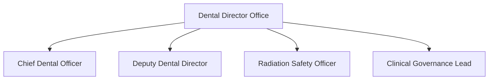
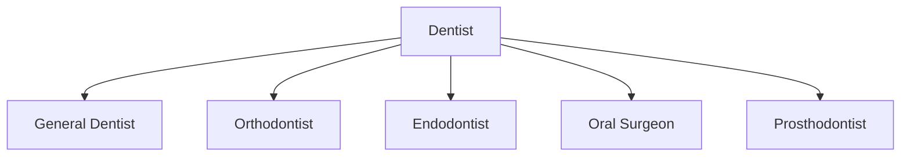
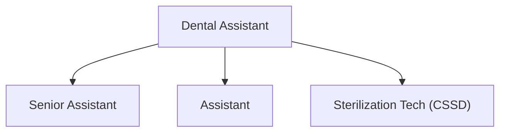
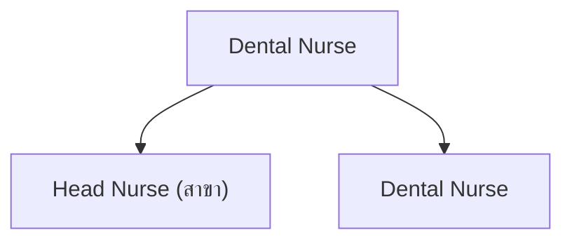
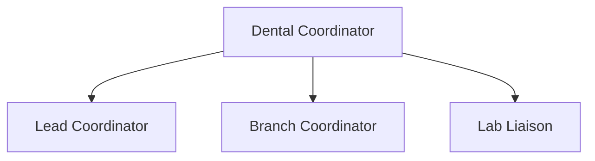
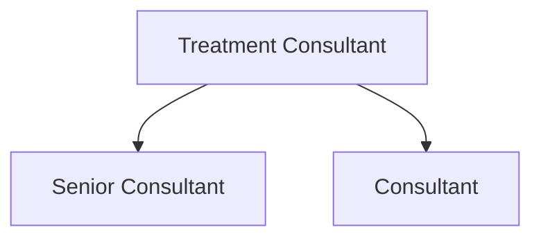
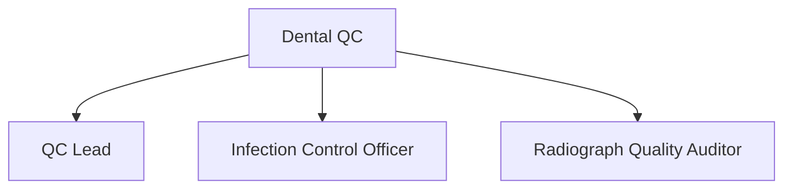
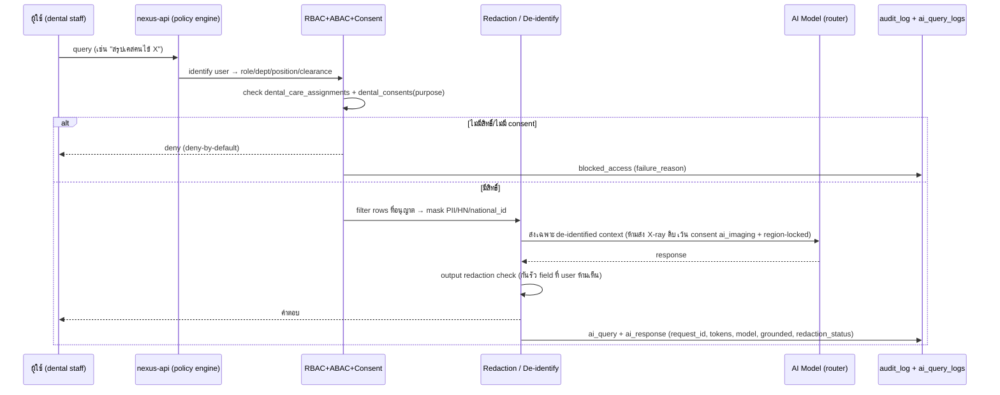

# 10 — Department Breakdown: แผนกทันตกรรม (Dental Department)

> **เอกสารสถาปัตยกรรมระดับ Production** — Saduak Suay Mai PCL · NEXUS OS AI Workforce OS
> **Classification ของเอกสารนี้:** `HARD` (internal architecture) — แต่ **ข้อมูลที่อธิบาย** (เวชระเบียนทันตกรรม / แผนรักษา / ภาพ X-ray / ใบยินยอม) ส่วนใหญ่เป็น `RESTRICTED`
> **Scope:** Dental Department ทั้งแผนก + 7 sub-unit · กฎ Consent / Access / Audit บนทุกการอ่านเวชระเบียนทันตกรรม
> **Entity mapping:** ฝั่งธุรกิจ **SDX (Dental)** — `entities.entity_key = 'sdx'`, ตาราง operational เดิม `sdx_cases`, default `branch_code = 'SDX-HQ'`
> **กฎหมายที่บังคับใช้:** PDPA (พ.ร.บ.คุ้มครองข้อมูลส่วนบุคคล พ.ศ. 2562 — มาตรา 26 sensitive data), พ.ร.บ.สถานพยาบาล พ.ศ. 2541, ข้อบังคับทันตแพทยสภาว่าด้วยจรรยาบรรณ + การจัดทำเวชระเบียน, พ.ร.บ.พลังงานนิวเคลียร์เพื่อสันติ (กำกับเครื่อง X-ray)

---

## 0. หลักการบังคับ (Non-negotiable Principles) สำหรับแผนกทันตกรรม

แผนกทันตกรรมถือ **ข้อมูลสุขภาพช่องปาก (Oral Health / Sensitive Personal Data ตาม PDPA ม.26)** + **ภาพถ่ายรังสี (Dental Radiograph)** ซึ่งเป็นข้อมูลชีวมาตร/สุขภาพที่อ่อนไหวที่สุด จึงอยู่ภายใต้กฎเข้มสุดของระบบเทียบเท่าแผนกแพทย์:

1. **RESTRICTED-by-default** — ตารางหลักทุกตารางในแผนกนี้ (`dental_patient_records`, `dental_treatment_plans`, `dental_charts`, `dental_radiographs`, `dental_consents`, `dental_clinical_notes`, `dental_lab_orders`) มี `security_level = 'RESTRICTED'` เป็นค่าเริ่มต้น **ลดต่ำกว่านี้ไม่ได้** การเข้าถึงต้องผ่าน **direct grant + clinical relationship** เท่านั้น ไม่มี department-wide read แบบ MEDIUM
2. **Consent-gated read** — ทุกการ `view/search/export` ข้อมูลผู้ป่วย ต้องตรวจ `dental_consents` ที่ยัง `active` และครอบคลุม `purpose` ที่ร้องขอ (treatment / imaging / marketing-before-after / insurance-claim) ก่อน return — deny-by-default ถ้าไม่มี consent ตรง purpose
3. **Clinical-relationship ABAC** — ทันตแพทย์/ผู้ช่วย/พยาบาล เห็นได้เฉพาะผู้ป่วยที่มี **active care relationship** (assigned dentist, treating assistant, สาขาที่ปฏิบัติงาน) ไม่ใช่ทุกผู้ป่วยในแผนก
4. **Encryption at rest (AES-256-GCM)** — ฟิลด์ระบุตัวตน + เนื้อหาคลินิก (`name`, `phone`, `national_id`, `clinical_note_body`, `diagnosis`, `radiograph_blob_key`) เข้ารหัสด้วย `ENCRYPTION_KEY` ต่อยอดจาก pattern เดิมในตาราง `patients` (`name_encrypted`, `phone_encrypted`, `medical_notes_encrypted`) — ภาพ X-ray เก็บใน object store แล้วเก็บเฉพาะ `blob_key` ที่เข้ารหัส ไม่เก็บ binary ใน Postgres
5. **AI ห้ามอ่าน DB ตรง** — AI เห็นข้อมูลผู้ป่วยได้เฉพาะหลังผ่าน clearance + consent + filter + **redaction (de-identification)**; ทุก AI query ที่แตะ RESTRICTED ต้อง log แยกใน `ai_query_logs` ผูกด้วย `request_id`; AI **ห้ามส่งภาพ X-ray ดิบ** ออกไป provider ภายนอกเว้นมี consent `purpose='ai_imaging'` + on-prem/region-locked model
6. **Audit ทุก view** — ต่างจากแผนกขายที่ audit เน้น write; แผนกนี้ audit **ทุก READ/VIEW/SEARCH/EXPORT/DOWNLOAD** ของเวชระเบียน/ภาพรังสี แบบ append-only พร้อม `before/after`, `ip`, `request_id`, `consent_id` ที่ใช้อ้างสิทธิ์
7. **Break-the-glass (EMERGENCY_OVERRIDE)** — กรณีฉุกเฉิน (เลือดออกหลังถอนฟัน, ติดเชื้อเฉียบพลัน, แพ้ยาชา) ทันตแพทย์เวรเข้าถึงผู้ป่วยที่ไม่ได้ assigned ได้ผ่าน flow บังคับใส่เหตุผล → สร้าง audit `result = 'emergency_override'` ให้ Dental Director + DPO รีวิวภายใน 24 ชม.
8. **Radiation-record integrity** — ทุกการเปิดถ่าย X-ray ต้องผูก `radiation_dose` + `device_id` + `operator_id` เพื่อรองรับการตรวจสอบของหน่วยงานกำกับ และ **ห้ามแก้ย้อนหลัง** (append-only + version)

> **Grounding หมายเหตุ:** วันนี้ NEXUS OS มี `patients` (T3, encrypted, `consent_given/consent_at`) + `sdx_cases` (operational: `treatment_type`, `amount`, `chair_minutes`, `doctor_id`, `branch_code`) เป็นจุดเริ่ม — เพียงพอ demo แต่ **ไม่พอ** สำหรับ production dental record ที่ต้องแยก patient / treatment-plan / tooth-chart / radiograph / consent / clinical-note / lab-order, มี versioning, soft-delete, clinical-relationship, consent แบบ purpose-scoped จึงเสนอ migration ชุดใหม่ (ทำเครื่องหมาย **[NEW]**) โดย `patients` เดิม → migrate เป็น `dental_patient_records` (**[NEW · migrate-from `patients` where `entity='sdx'`]**) และ `sdx_cases` ยังคงไว้เป็น financial/operational fact-table ผูก `treatment_plan_id` ใหม่ (**[EXTEND]**).

---

## 1. ภาพรวมแผนก (Department Overview)

### 1.1 ตำแหน่งในผังองค์กร

```
Company (Saduak Suay Mai PCL)
└── Department: Dental (รหัส DEPT-DEN · system role `dental` · entity SDX)
    ├── Sub-Dept: Dental Director Office          (กำกับคลินิก / คุณภาพ / จริยธรรม / รังสี)
    ├── Sub-Dept: Dentist (ทันตแพทย์)              (วินิจฉัย/วางแผน/ทำหัตถการทันตกรรม)
    ├── Sub-Dept: Dental Assistant (ผู้ช่วยทันตแพทย์) (ช่วยข้างเก้าอี้ / sterilization / set-up)
    ├── Sub-Dept: Dental Nurse (พยาบาลทันตกรรม)     (ดูแลผู้ป่วย / ยา / infection control)
    ├── Sub-Dept: Dental Coordinator              (ประสานคิว / สาขา / lab / นัดหมาย)
    ├── Sub-Dept: Dental Treatment Consultant     (ที่ปรึกษาแผนรักษา + ขายแพ็กเกจ + วางแผนการเงิน)
    └── Sub-Dept: Dental Quality Control (QC)     (มาตรฐาน / sterilization audit / รังสีปลอดภัย / AE)
```

> **[ASSUMPTION]** โครงสร้าง 7 sub-unit นี้สมเหตุผลกับคลินิกทันตกรรมแฟรนไชส์ในไทย จำนวนหัวคน/สาขา/เก้าอี้ทำฟัน (chair) จริงไม่ทราบ — ทุกตัวเลข headcount/KPI target ด้านล่างเป็น **[ASSUMPTION]** ที่ตั้งให้สมจริงสำหรับเชนคลินิก

### 1.2 Mermaid — Sub-tree ของ Dental Department

```mermaid
graph TD
    DEN["🦷 Dental Department<br/>role: dental · DEPT-DEN · entity SDX"]

    DEN --> DIR["Dental Director Office<br/>clearance: HARD→RESTRICTED grant"]
    DEN --> DDS["Dentist / ทันตแพทย์"]
    DEN --> DA["Dental Assistant / ผู้ช่วยฯ"]
    DEN --> DN["Dental Nurse / พยาบาลทันตกรรม"]
    DEN --> DC["Dental Coordinator"]
    DEN --> DTC["Dental Treatment Consultant"]
    DEN --> QC["Dental Quality Control"]

    DIR --> DIR1["Chief Dental Officer (CDO)"]
    DIR --> DIR2["Deputy Dental Director"]
    DIR --> DIR3["Radiation Safety Officer (RSO)"]

    DDS --> DDS1["General Dentist (GP)"]
    DDS --> DDS2["Orthodontist / จัดฟัน"]
    DDS --> DDS3["Endodontist / รักษาราก"]
    DDS --> DDS4["Oral Surgeon / ศัลยกรรมช่องปาก"]
    DDS --> DDS5["Prosthodontist / ทันตกรรมประดิษฐ์"]
    DDS --> DDS6["Visiting / Part-time Dentist"]

    DA --> DA1["Senior Dental Assistant"]
    DA --> DA2["Dental Assistant"]
    DA --> DA3["Sterilization Technician (CSSD)"]

    DN --> DN1["Head Dental Nurse (สาขา)"]
    DN --> DN2["Dental Nurse"]

    DC --> DC1["Lead Dental Coordinator"]
    DC --> DC2["Branch Dental Coordinator"]
    DC --> DC3["Lab Liaison Officer"]

    DTC --> DTC1["Senior Treatment Consultant"]
    DTC --> DTC2["Treatment Consultant"]

    QC --> QC1["Dental QC Lead"]
    QC --> QC2["Infection Control Officer"]
    QC --> QC3["Radiograph Quality Auditor"]

    classDef restricted fill:#7f1d1d,stroke:#fca5a5,color:#fff;
    class DIR,DDS,DA,DN,QC restricted;
```



### 1.3 RBAC grounding

| สิ่งที่มีอยู่แล้ว (NEXUS OS) | สถานะ | หมายเหตุ |
|---|---|---|
| system role `dental` (rbac.ts `ROLES`) | **EXISTS** | 1:1 กับ `DEPARTMENT_DEFINITIONS` → `{ name:'Dental', systemRole:'dental', label_th:'ทันตกรรม' }` (departments.ts) |
| module key `dental` ใน `MODULE_ACCESS` | **EXISTS** | gate route `/dental/*` |
| entity `sdx` + `sdx_cases` | **EXISTS** | operational/financial fact ของฝั่ง dental |
| `patients` (encrypted, consent) | **EXISTS** | จะ migrate → `dental_patient_records` สำหรับแถว `entity='sdx'` |
| sub-department / team / position FK | **NEW** | ปัจจุบัน membership เป็น free-text `users.department` — ต้องผูก `org_units`/`positions` (มีตารางแล้วแต่ยังไม่ wire เข้า authz) |
| clinical-relationship table | **NEW** | `dental_care_assignments` (assigned dentist ↔ patient ↔ branch) |
| RESTRICTED row-level + consent gate | **NEW** | policy engine + `dental_consents` |

---

## 2. นโยบายความปลอดภัยข้อมูลของแผนก (Data Classification Matrix)

| ข้อมูล (Data) | ตารางหลัก | Security Level | Data Owner (role) | Consent ที่ต้องมีก่อน read |
|---|---|---|---|---|
| ทะเบียนผู้ป่วยทันตกรรม (ชื่อ/เบอร์/เลขบัตร) | `dental_patient_records` | **RESTRICTED** | Dental Director (custodian) / ผู้ป่วย (data subject) | `purpose IN ('treatment')` |
| แผนการรักษา (treatment plan + ราคา) | `dental_treatment_plans` | **RESTRICTED** | assigned Dentist | `purpose IN ('treatment')` |
| ผังฟัน / tooth chart / perio chart | `dental_charts` | **RESTRICTED** | assigned Dentist | `purpose IN ('treatment')` |
| ภาพรังสี X-ray / CBCT / pano | `dental_radiographs` | **RESTRICTED** | Dental Director + RSO | `purpose IN ('imaging')` |
| บันทึกคลินิก / progress note | `dental_clinical_notes` | **RESTRICTED** | assigned Dentist | `purpose IN ('treatment')` |
| ใบยินยอม (consent forms) | `dental_consents` | **RESTRICTED** | DPO + Dental Director | self-referential (เป็น source of truth) |
| ใบสั่ง Lab / งานประดิษฐ์ | `dental_lab_orders` | **RESTRICTED** | assigned Dentist / Lab Liaison | `purpose IN ('treatment')` |
| ความสัมพันธ์การดูแล (care assignment) | `dental_care_assignments` | **HARD** | Dental Coordinator | — (control data) |
| เคส operational/การเงิน | `sdx_cases` (extend) | **HARD** (มี patient_id) | Finance + Dental Director | — (aggregate-only สำหรับ non-clinical) |
| KPI / chair utilization (aggregate) | `kpi_entries` | **MEDIUM** | Dental Director | — (de-identified) |
| ภาพ before/after เพื่อการตลาด | `dental_radiographs` (flagged) | **RESTRICTED** | Marketing **ต้องมี** consent | `purpose='marketing_before_after'` |
| ตารางเวร / นัดหมาย (ไม่มีเนื้อหาคลินิก) | `daily_ai_tasks` / scheduling | **BASIC**/**MEDIUM** | Dental Coordinator | — |

> **กฎทอง:** ทุกตาราง core ของแผนกมีคอลัมน์มาตรฐาน `id, company_id, entity('sdx'), branch_code, created_at, updated_at, deleted_at, created_by, updated_by, deleted_by, is_active, version, security_level` + FK/UNIQUE/CHECK/composite index + soft-delete + optimistic-lock (`version`).

### 2.1 ตัวอย่าง DDL (NEW migration — Postgres)

```sql
-- [NEW] dental_patient_records : migrate-from patients WHERE entity='sdx'
CREATE TABLE IF NOT EXISTS dental_patient_records (
  id            TEXT PRIMARY KEY,
  company_id    TEXT NOT NULL REFERENCES companies(id),
  entity        TEXT NOT NULL DEFAULT 'sdx' CHECK (entity = 'sdx'),
  branch_code   TEXT NOT NULL,
  hn            TEXT NOT NULL,                         -- hospital/clinic number
  name_enc      TEXT NOT NULL,                         -- AES-256-GCM
  phone_enc     TEXT,
  national_id_enc TEXT,
  dob           DATE,
  allergy_flags TEXT,                                  -- ระวังแพ้ยาชา/latex
  medical_alert_enc TEXT,
  security_level TEXT NOT NULL DEFAULT 'RESTRICTED'
                 CHECK (security_level = 'RESTRICTED'),
  is_active     BOOLEAN NOT NULL DEFAULT TRUE,
  version       INTEGER NOT NULL DEFAULT 1,
  created_at    TIMESTAMPTZ NOT NULL DEFAULT NOW(),
  updated_at    TIMESTAMPTZ NOT NULL DEFAULT NOW(),
  deleted_at    TIMESTAMPTZ,
  created_by    TEXT NOT NULL REFERENCES users(id),
  updated_by    TEXT REFERENCES users(id),
  deleted_by    TEXT REFERENCES users(id),
  UNIQUE (company_id, branch_code, hn)
);
CREATE INDEX IF NOT EXISTS ix_dpr_company_branch ON dental_patient_records(company_id, branch_code) WHERE deleted_at IS NULL;

-- [NEW] dental_consents : purpose-scoped, append-only (revoke = new row)
CREATE TABLE IF NOT EXISTS dental_consents (
  id            TEXT PRIMARY KEY,
  company_id    TEXT NOT NULL REFERENCES companies(id),
  patient_id    TEXT NOT NULL REFERENCES dental_patient_records(id),
  purpose       TEXT NOT NULL CHECK (purpose IN
                 ('treatment','imaging','marketing_before_after','insurance_claim','ai_imaging','research')),
  granted       BOOLEAN NOT NULL,
  scope_json    JSONB NOT NULL DEFAULT '{}',
  granted_at    TIMESTAMPTZ NOT NULL DEFAULT NOW(),
  expires_at    TIMESTAMPTZ,
  evidence_blob_key TEXT,                              -- ลายเซ็น/แบบฟอร์ม
  security_level TEXT NOT NULL DEFAULT 'RESTRICTED' CHECK (security_level='RESTRICTED'),
  version       INTEGER NOT NULL DEFAULT 1,
  created_at    TIMESTAMPTZ NOT NULL DEFAULT NOW(),
  created_by    TEXT NOT NULL REFERENCES users(id)
);
CREATE INDEX IF NOT EXISTS ix_consent_active ON dental_consents(patient_id, purpose, granted, expires_at);

-- [NEW] dental_care_assignments : clinical relationship (ABAC source)
CREATE TABLE IF NOT EXISTS dental_care_assignments (
  id          TEXT PRIMARY KEY,
  company_id  TEXT NOT NULL REFERENCES companies(id),
  patient_id  TEXT NOT NULL REFERENCES dental_patient_records(id),
  provider_id TEXT NOT NULL REFERENCES users(id),
  role_in_care TEXT NOT NULL CHECK (role_in_care IN ('dentist','assistant','nurse','coordinator')),
  branch_code TEXT NOT NULL,
  active      BOOLEAN NOT NULL DEFAULT TRUE,
  security_level TEXT NOT NULL DEFAULT 'HARD',
  created_at  TIMESTAMPTZ NOT NULL DEFAULT NOW(),
  created_by  TEXT NOT NULL REFERENCES users(id),
  UNIQUE (patient_id, provider_id, role_in_care, active)
);

-- [NEW] dental_radiographs : metadata only, binary in object store
CREATE TABLE IF NOT EXISTS dental_radiographs (
  id            TEXT PRIMARY KEY,
  company_id    TEXT NOT NULL REFERENCES companies(id),
  patient_id    TEXT NOT NULL REFERENCES dental_patient_records(id),
  branch_code   TEXT NOT NULL,
  modality      TEXT NOT NULL CHECK (modality IN ('periapical','bitewing','panoramic','cbct','cephalometric')),
  blob_key_enc  TEXT NOT NULL,                         -- encrypted object key
  radiation_dose NUMERIC,                              -- µSv
  device_id     TEXT NOT NULL,
  operator_id   TEXT NOT NULL REFERENCES users(id),
  taken_at      TIMESTAMPTZ NOT NULL DEFAULT NOW(),
  marketing_optin BOOLEAN NOT NULL DEFAULT FALSE,
  security_level TEXT NOT NULL DEFAULT 'RESTRICTED' CHECK (security_level='RESTRICTED'),
  is_active     BOOLEAN NOT NULL DEFAULT TRUE,
  version       INTEGER NOT NULL DEFAULT 1,
  created_at    TIMESTAMPTZ NOT NULL DEFAULT NOW(),
  deleted_at    TIMESTAMPTZ,
  created_by    TEXT NOT NULL REFERENCES users(id)
);
-- (dental_treatment_plans, dental_charts, dental_clinical_notes, dental_lab_orders
--  follow the same column contract — omitted for brevity)
```

---

## 3. แผนกทันตกรรม — ระดับแผนก (Department-level)

### 3.1 หน้าที่ (Responsibilities)
- ให้บริการทันตกรรมครบวงจร (ตรวจ, อุด, ถอน, ขูดหินปูน, รักษาราก, จัดฟัน, รากเทียม, ฟันปลอม, ฟอกสีฟัน) ทุกสาขาในเครือ SDX
- กำกับ **มาตรฐานคลินิก + ความปลอดภัย** (sterilization, infection control, radiation safety) ให้เป็นไปตาม พ.ร.บ.สถานพยาบาล + ทันตแพทยสภา
- เป็นเจ้าของและผู้พิทักษ์ (custodian) เวชระเบียนทันตกรรม/ภาพรังสีทั้งหมด ภายใต้ PDPA ม.26
- รักษา **chair utilization** และ throughput ให้สอดคล้องกับเป้าหมายธุรกิจ โดยไม่ลดมาตรฐานคลินิก
- ประสานกับ Marketing (เคส before/after — ต้องมี consent), Finance (เก็บเงิน/ประกัน), Franchise (ตรวจสาขา)

### 3.2 Workflow ระดับแผนก (วงจรชีวิตผู้ป่วย)

| Stage | Input | Process | Output | Receiver | Approver |
|---|---|---|---|---|---|
| Intake | ผู้ป่วย walk-in/นัด + consent treatment | สร้าง/ค้น `dental_patient_records`, บันทึก consent | HN + record | Coordinator | — (auto) |
| Diagnosis | อาการ + X-ray (consent imaging) | ตรวจ, ถ่าย/อ่านภาพ, ลง tooth chart | diagnosis + chart | Dentist | Dentist |
| Plan | diagnosis | วางแผนรักษา + ราคา + ทางเลือก | `dental_treatment_plans` (draft) | Treatment Consultant | Dentist |
| Consent-to-treat | plan | อธิบาย risk + ขอ informed consent | signed consent | ผู้ป่วย | Dentist |
| Treatment | approved plan | ทำหัตถการ + lab order (ถ้ามี) | `dental_clinical_notes`, `sdx_cases` | Assistant/Nurse | Dentist |
| Billing | completed case | ออกบิล / เคลมประกัน | invoice | Finance | Finance Mgr |
| Follow-up | case history | นัดติดตาม / recall | recall task | Coordinator | Dentist |

### 3.3 KPI ระดับแผนก (พร้อม data source)

| KPI | สูตร/เป้า **[ASSUMPTION]** | Data Source | Security ของ source |
|---|---|---|---|
| Chair Utilization % | Σ`chair_minutes` ÷ available chair-minutes — เป้า ≥ 70% | `sdx_cases.chair_minutes` (aggregate) | MEDIUM (de-id) |
| Treatment Acceptance Rate | plan accepted ÷ plan presented — เป้า ≥ 55% | `dental_treatment_plans.status` | RESTRICTED → aggregate MEDIUM |
| Revenue per Chair / วัน | Σ`sdx_cases.amount` ÷ chairs ÷ วัน | `sdx_cases.amount` | HARD |
| Recall / Retention Rate | กลับมาตามนัด ÷ ที่นัด — เป้า ≥ 40% | recall tasks + `sdx_cases` | MEDIUM |
| Clinical Incident / AE Rate | AE ÷ cases — เป้า ≤ 0.5% | QC incident log | RESTRICTED |
| Sterilization Compliance % | passed cycles ÷ total — เป้า 100% | QC sterilization audit | HARD |
| Radiograph Reject Rate | retake ÷ total exposures — เป้า ≤ 5% | `dental_radiographs` QC flag | RESTRICTED → aggregate |

### 3.4 Approval Flow ระดับแผนก (Authority Matrix)

| การกระทำ | ผู้เสนอ | ผู้อนุมัติ | Security gate |
|---|---|---|---|
| แผนรักษา > [฿50,000] **[ASSUMPTION]** | Dentist | Dental Director | RESTRICTED + consent |
| ส่วนลดเกิน [15%] **[ASSUMPTION]** | Treatment Consultant | Dental Director + Finance | HARD |
| ลบ/แก้เวชระเบียน (soft-delete) | Dentist | Dental Director + DPO | RESTRICTED + dual-approve |
| ใช้เคส before/after การตลาด | Marketing | ผู้ป่วย (consent) + Dental Director | RESTRICTED `marketing_before_after` |
| EMERGENCY_OVERRIDE | Dentist เวร | post-hoc review 24h (Director+DPO) | break-the-glass |

### 3.5 Audit Log events ระดับแผนก
ทุก event เขียนแบบ append-only ลง `audit_log` (extended) + `ai_query_logs` (ผูก `request_id`) โดยจับ `actor, role, target_table, target_id, target_security_level, before_json, after_json, changed_fields, ip, device, user_agent, request_id, session_id, endpoint, http_method, result, failure_reason, consent_id, created_at`:
`login/logout`, `view/search` (เวชระเบียน, ทุกครั้ง), `export/download` (record + X-ray), `create/update/soft-delete/restore` (record/plan/note), `consent_grant/consent_revoke`, `radiograph_capture/radiograph_view`, `permission_change/role_change`, `ai_query/ai_response`, `failed_access/blocked_access`, `emergency_override`.

---

## 4. Sub-Department Breakdowns (7 หน่วย)

> รูปแบบเดียวกันทุกหน่วย: หน้าที่ · Position list · Workflow (input→process→output→receiver→approver) · KPI+source · Data Created · Data Used · Security · Data Owner · Approval Flow · Audit events · mermaid sub-tree.

---

### 4.1 Dental Director Office (สำนักผู้อำนวยการทันตกรรม)

**Positions:** Chief Dental Officer (CDO) · Deputy Dental Director · Radiation Safety Officer (RSO) · Clinical Governance Lead

**หน้าที่:** กำกับมาตรฐานคลินิก/จริยธรรม, อนุมัติแผนรักษามูลค่าสูง + dual-approve การลบเวชระเบียน, เป็น custodian ของ `dental_radiographs`/`dental_consents`, รีวิว EMERGENCY_OVERRIDE, กำกับความปลอดภัยทางรังสี (RSO).



| มิติ | รายละเอียด |
|---|---|
| **Workflow** | governance review → input: AE log/override log/QC report → process: รีวิว+ตัดสิน → output: directive/approval → receiver: sub-units → approver: CDO |
| **KPI** | AE rate ≤ 0.5% (QC log); override review ภายใน 24h 100% (audit_log); sterilization compliance 100% |
| **Data Created** | governance directives, approval decisions, override reviews, RSO dose reports |
| **Data Used** | ทุกตาราง RESTRICTED ของแผนก (full read **โดย direct grant**, ไม่ใช่ทุก row อัตโนมัติ — ยังต้อง consent gate) |
| **Security** | clearance สูงสุดในแผนก; แต่การอ่าน record ผู้ป่วยยังถูก audit + consent gate เหมือนกัน (no silent god-mode; `admin` super-user ถูก policy ของแผนกนี้ override ให้ต้อง log) |
| **Data Owner** | custodian ของ consents/radiographs/governance |
| **Approval Flow** | เป็นผู้อนุมัติขั้นสูงสุด; การกระทำของ Director เองต้อง peer/DPO review |
| **Audit events** | `view/export` record (ทุกครั้ง), `approve/reject` plan, `emergency_override review`, `permission_change`, `consent override` |

---

### 4.2 Dentist (ทันตแพทย์)

**Positions:** General Dentist (GP) · Orthodontist · Endodontist · Oral Surgeon · Prosthodontist · Visiting/Part-time Dentist

**หน้าที่:** วินิจฉัย, สั่ง/อ่าน X-ray, วางแผนรักษา, ทำหัตถการ, เขียน clinical note, สั่ง lab, ขอ informed consent.



| มิติ | รายละเอียด |
|---|---|
| **Workflow** | input: ผู้ป่วย assigned + consent → process: ตรวจ/ถ่าย/วินิจฉัย/รักษา → output: chart+plan+note+sdx_case → receiver: Assistant/Coordinator/Finance → approver: ตนเอง (clinical) / Director (high-value plan) |
| **KPI** | acceptance rate ≥ 55% (`dental_treatment_plans`); revenue/chair (`sdx_cases.amount`); AE ≤ 0.5%; note completeness 100% within 24h |
| **Data Created** | `dental_treatment_plans`, `dental_charts`, `dental_clinical_notes`, `dental_lab_orders`, `sdx_cases` |
| **Data Used** | `dental_patient_records`, `dental_radiographs`, `dental_consents`, history — **เฉพาะผู้ป่วยที่มี active `dental_care_assignments`** |
| **Security** | RESTRICTED + clinical-relationship ABAC + consent gate; เห็นเฉพาะผู้ป่วยตน/สาขาตน |
| **Data Owner** | owner ของ plan/chart/note/lab-order ที่ตนสร้าง |
| **Approval Flow** | plan ปกติ self-approve; > threshold → Director; แก้/ลบ note → Director+DPO dual-approve |
| **Audit events** | `view/search` record+X-ray (ทุกครั้ง), `create/update` plan/note/chart, `radiograph_view`, `lab_order_create`, `emergency_override`, `failed_access` |

---

### 4.3 Dental Assistant (ผู้ช่วยทันตแพทย์)

**Positions:** Senior Dental Assistant · Dental Assistant · Sterilization Technician (CSSD)

**หน้าที่:** เตรียมเก้าอี้/เครื่องมือ, ช่วยข้างเก้าอี้ (four-handed), sterilization + tracking, บันทึก inventory วัสดุ.



| มิติ | รายละเอียด |
|---|---|
| **Workflow** | input: คิว/แผนหัตถการของวัน → process: set-up + assist + sterilize → output: sterilization cycle log, material usage → receiver: Dentist/QC/Warehouse → approver: Head Assistant/QC |
| **KPI** | sterilization compliance 100% (cycle log); set-up turnaround ≤ [10 นาที] **[ASSUMPTION]**; material stock-out = 0 |
| **Data Created** | sterilization cycle logs, material usage, chairside vitals note (เบื้องต้น) |
| **Data Used** | `dental_treatment_plans` (เฉพาะ field หัตถการที่จำเป็น — masked ราคา), `dental_care_assignments` |
| **Security** | RESTRICTED record อ่านได้แบบ **need-to-know minimum** (เห็นชนิดหัตถการ/ฟันที่ทำ ไม่เห็น national_id/ราคา — field-level mask ต่อยอด `maskField`) |
| **Data Owner** | owner ของ sterilization log + material log |
| **Approval Flow** | sterilization exception → QC/Head Assistant; material reorder → Warehouse |
| **Audit events** | `view` (limited fields), `create` sterilization/material log, `failed_access` (ถ้าพยายามดู field เกินสิทธิ์) |

---

### 4.4 Dental Nurse (พยาบาลทันตกรรม)

**Positions:** Head Dental Nurse (สาขา) · Dental Nurse

**หน้าที่:** ดูแลผู้ป่วยก่อน/หลังหัตถการ, บริหารยา/ยาชาตามคำสั่ง, infection control, ดูแล vital signs + emergency response.



| มิติ | รายละเอียด |
|---|---|
| **Workflow** | input: คำสั่งแพทย์ + allergy_flags → process: เตรียม/ให้ยา + เฝ้าระวัง → output: nursing note, medication record → receiver: Dentist/Director → approver: Head Nurse/Dentist |
| **KPI** | medication error = 0; infection control compliance 100%; emergency response time ภายในเป้า |
| **Data Created** | nursing notes, medication records, vital sign records |
| **Data Used** | `dental_patient_records` (allergy/medical_alert), `dental_clinical_notes`, orders — เฉพาะผู้ป่วยที่ดูแล |
| **Security** | RESTRICTED + clinical-relationship; เห็น allergy/medical_alert (จำเป็นต่อความปลอดภัย) แต่ audit ทุก view |
| **Data Owner** | owner ของ nursing/medication record |
| **Approval Flow** | medication exception → Dentist; emergency → break-the-glass |
| **Audit events** | `view` record (allergy), `create` nursing/medication note, `emergency_override`, `failed_access` |

---

### 4.5 Dental Coordinator (ผู้ประสานงานทันตกรรม)

**Positions:** Lead Dental Coordinator · Branch Dental Coordinator · Lab Liaison Officer

**หน้าที่:** จัดคิว/นัดหมาย/recall, ประสานระหว่างสาขา-แพทย์-แล็บ, สร้าง `dental_care_assignments`, จัดการ no-show.



| มิติ | รายละเอียด |
|---|---|
| **Workflow** | input: คำขอนัด + แผนรักษา → process: จัดคิว/มอบหมาย/recall/ติดตามแล็บ → output: schedule, care_assignment, lab tracking → receiver: Dentist/Assistant/ผู้ป่วย → approver: Lead Coordinator |
| **KPI** | no-show rate ≤ [10%] **[ASSUMPTION]**; recall rate ≥ 40%; lab on-time ≥ 95%; chair fill rate ≥ 70% |
| **Data Created** | `dental_care_assignments` (HARD), schedules, recall tasks, lab tracking |
| **Data Used** | demographics minimal (ชื่อ/เบอร์ — เพื่อโทรนัด, masked clinical), plan status (ไม่เห็นเนื้อหาคลินิกเชิงลึก) |
| **Security** | record อ่านแบบ scheduling-scope: เห็นชื่อ/เบอร์/นัด ไม่เห็น clinical note/X-ray (field-mask) |
| **Data Owner** | owner ของ schedule + care_assignment |
| **Approval Flow** | reassign แพทย์ → Lead Coordinator; lab dispute → Lab Liaison + Dentist |
| **Audit events** | `create/update` care_assignment + schedule, `view` (contact fields), `permission-relevant` reassignments, `failed_access` |

---

### 4.6 Dental Treatment Consultant (ที่ปรึกษาแผนการรักษา)

**Positions:** Senior Treatment Consultant · Treatment Consultant

**หน้าที่:** นำเสนอแผนรักษา, อธิบายค่าใช้จ่าย/ทางเลือกผ่อนชำระ, ปิดการขายแพ็กเกจ, ประสานประกัน — **บนข้อมูลที่แพทย์อนุมัติแล้วเท่านั้น**.



| มิติ | รายละเอียด |
|---|---|
| **Workflow** | input: approved `dental_treatment_plans` → process: present + quote + payment plan + close → output: accepted plan, payment schedule → receiver: Finance/Coordinator → approver: Dentist (clinical) + Finance (ส่วนลด) |
| **KPI** | acceptance rate ≥ 55%; avg case value (`sdx_cases.amount`); discount leakage ภายในเป้า; collection rate |
| **Data Created** | quotes, accepted plan status, payment schedules |
| **Data Used** | `dental_treatment_plans` (procedure+price), demographics minimal — **ไม่เห็น X-ray/clinical note ดิบ** (เห็นเฉพาะสรุปที่แพทย์เปิดเผยให้) |
| **Security** | RESTRICTED scope จำกัด: ราคา/หัตถการ + สรุปเชิงพาณิชย์; clinical depth masked; consent `treatment` ต้อง active |
| **Data Owner** | owner ของ quote/payment-schedule |
| **Approval Flow** | ส่วนลด > 15% → Director + Finance; แผนต้องมีลายเซ็นแพทย์ก่อน present |
| **Audit events** | `view` plan, `create` quote/payment, `update` discount (จับ before/after), `export` quote, `failed_access` |

---

### 4.7 Dental Quality Control (QC)

**Positions:** Dental QC Lead · Infection Control Officer · Radiograph Quality Auditor

**หน้าที่:** ตรวจ sterilization/infection control, audit คุณภาพภาพรังสี + radiation dose, ติดตาม AE/incident, ตรวจความครบถ้วนเวชระเบียน, ป้อนข้อมูล franchise audit ฝั่งคลินิก.



| มิติ | รายละเอียด |
|---|---|
| **Workflow** | input: cycle logs / radiographs / incident reports → process: audit + วัด dose + ตรวจ note completeness → output: QC report, corrective action, AE log → receiver: Director/Franchise/RSO → approver: QC Lead → Director |
| **KPI** | sterilization compliance 100%; radiograph reject rate ≤ 5% (`dental_radiographs`); note completeness ≥ 98%; AE closure ภายในเป้า |
| **Data Created** | QC reports, AE/incident log, corrective actions, sterilization audit |
| **Data Used** | `dental_radiographs` (เพื่อ audit คุณภาพ — มี consent gate), `dental_clinical_notes` (completeness check, อ่าน metadata ไม่ใช่เนื้อหาเชิงวินิจฉัยเต็มเว้นจำเป็น), `sdx_cases` |
| **Security** | RESTRICTED + purpose `imaging`/quality; การอ่านเพื่อ audit ต้อง log result=`view` + เหตุผล QC |
| **Data Owner** | owner ของ QC report + AE log |
| **Approval Flow** | corrective action → QC Lead → Director; AE ร้ายแรง → Director + DPO + (อาจ) รายงานหน่วยงานกำกับ |
| **Audit events** | `view/export` radiograph (QC), `create` QC/AE report, `view` note metadata, `failed_access` |

---

## 5. การควบคุมการเข้าถึงของ AI สำหรับแผนกทันตกรรม

Flow บังคับ (ต่อยอด `ai-router.ts` + เพิ่ม redaction layer ที่ยังไม่มีในระบบ):



**ช่องว่างที่ต้องปิด (vs ระบบปัจจุบัน):** วันนี้ `ai-router.ts` ส่ง org context + prompt ดิบไป provider ภายนอกโดยไม่ redact; `ai_logs` ไม่เก็บ prompt/response/model/redaction → ต้องเพิ่มตาราง `ai_query_logs` **[NEW]** + redaction middleware ในเส้นทาง AI ก่อนใช้กับข้อมูลทันตกรรม RESTRICTED.

---

## 6. สรุป Migration ที่ต้องทำ (NEW vs EXISTS)

| รายการ | สถานะ | หมายเหตุ |
|---|---|---|
| role `dental`, module `dental`, entity `sdx`, `sdx_cases`, `patients` | **EXISTS** | ใช้เป็นฐาน |
| `dental_patient_records` (migrate-from `patients` where entity='sdx') | **NEW** | + encryption, soft-delete, version |
| `dental_treatment_plans` / `dental_charts` / `dental_clinical_notes` / `dental_lab_orders` | **NEW** | column contract มาตรฐาน |
| `dental_radiographs` (metadata + object-store key) | **NEW** | radiation dose + operator |
| `dental_consents` (purpose-scoped, append-only) | **NEW** | consent gate source |
| `dental_care_assignments` (clinical relationship ABAC) | **NEW** | wire เข้า policy engine |
| `sdx_cases` + `treatment_plan_id`, `security_level`, soft-delete cols | **EXTEND** | ผูก fact กับ plan |
| `audit_log` + before/after/ip/request_id/consent_id + append-only | **EXTEND** | ตาม global spec |
| `ai_query_logs` + redaction middleware | **NEW** | สำหรับ AI gate |
| RESTRICTED policy engine + consent gate + field-mask ต่อยอด `maskField` | **NEW** | บังคับใน backend ทุก endpoint |

> ทุก migration ลงทะเบียนใน `schema_migrations` (pattern เดิม v1–v10) และ deploy ผ่าน `railway up` ที่ service `nexus-api` (ไม่ใช่ GitHub auto-deploy).
