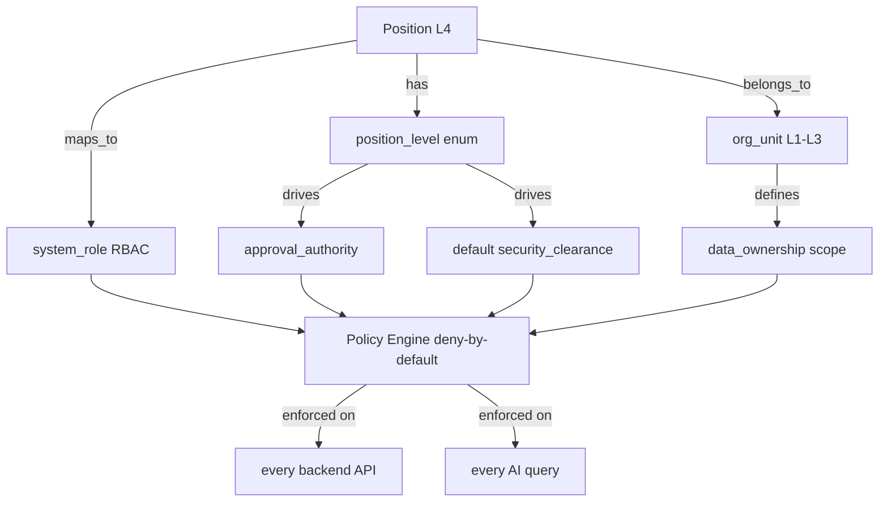
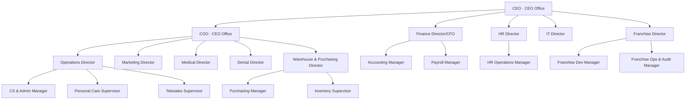
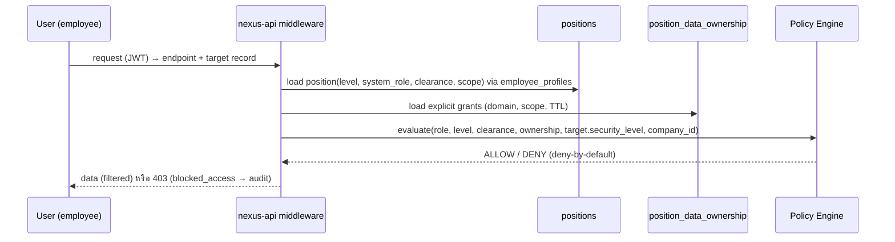

# NEXUS OS · เอกสารสถาปัตยกรรม 04 — โครงสร้างตำแหน่งงาน (Position Structure)

> **บริษัท:** Saduak Suay Mai PCL — เครือคลินิกเสริมความงาม + ทันตกรรม (แฟรนไชส์)
> **ระบบฐาน:** NEXUS OS (Next.js 16 `nexus-web` + Express/TS `nexus-api` + PostgreSQL บน Railway)
> **เอกสารชุด:** Enterprise AI Workforce OS — Document 04 / Position Structure
> **สถานะ:** Production-grade specification (ไม่ใช่ demo / ไม่ใช่ MVP)
> **ภาษา:** ไทย narrative + English technical identifiers (bilingual house style)

---

## 0. ขอบเขตและวัตถุประสงค์ (Scope & Purpose)

เอกสารนี้นิยาม **Position Structure** — taxonomy ของระดับตำแหน่ง (position level), แค็ตตาล็อกตำแหน่งงานตัวแทน (representative position catalog) ครบทุกแผนก, และ **mapping ระหว่างตำแหน่ง → security clearance / approval authority / data ownership** ซึ่งเป็น "ตัวเชื่อม" (binding layer) ระหว่างโครงสร้างองค์กร (Org Hierarchy) กับเครื่องยนต์สิทธิ์ (RBAC + ABAC + Data-Ownership) และ AI Access Control ของ NEXUS OS

ลำดับชั้นองค์กรของ Saduak Suay Mai PCL:

```
Company  →  Department  →  Sub-Department  →  Team / Unit  →  Position  →  Employee
(L0)        (L1)           (L2)               (L3)            (L4)         (L5)
```

**Position คือ entity ระดับ L4** — เป็น "แม่แบบของบทบาทงาน" (role template) ที่ผูกกับ `org_unit` (L1–L3) หนึ่งหน่วย และ Employee (L5) หนึ่งคนผูกกับ Position หนึ่งตำแหน่งผ่าน `employee_profiles.position_id`

> **หลักการสำคัญ:** สิทธิ์ในระบบ **ไม่ได้** มาจาก "ชื่อตำแหน่ง" โดยตรง แต่มาจาก **3 มิติประกอบกัน** ที่ผูกกับ position record:
> 1. **system_role** (RBAC) — 1 แผนก = 1 role (จาก `getSystemRoleForDepartment`)
> 2. **position_level** (ABAC attribute) — ใช้กำหนด `approval_authority` และ default `security_clearance`
> 3. **data_ownership scope** — ownership row-level (own / team / sub-department / department / company)
>
> ทั้งสามมิติบังคับใช้ใน **backend ทุก API และทุก AI query** แบบ deny-by-default (ดูเอกสาร 06 — Permission Engine / 07 — Audit & AI Control)

---

## 1. Position Level Taxonomy (มาตรฐาน 10 ระดับ)

Saduak Suay Mai PCL ใช้ **position level 10 ระดับ** เป็น enum กลางบังคับใช้ทั้งองค์กร ค่าระดับ (`level_rank`) ยิ่งน้อยยิ่งสูง ใช้เป็น attribute หลักของ ABAC สำหรับ approval chain และ default security clearance

| `level_rank` | `position_level` (code) | ไทย | นิยาม / ขอบเขตอำนาจโดยสรุป | Default Security Clearance | เป็น Manager? |
|---|---|---|---|---|---|
| 10 | `DIRECTOR` | ผู้อำนวยการ | หัวหน้าสายงาน/แผนกใหญ่ (Department head). อำนาจอนุมัติเชิงนโยบาย, งบประมาณแผนก, จ้าง/เลิกจ้างระดับ Manager ลงไป | `HARD` (RESTRICTED สำหรับ CEO Office/Medical/Finance/HR) | ✅ |
| 9 | `MANAGER` | ผู้จัดการ | หัวหน้า Sub-Department/Team หลายทีม. อนุมัติ leave/OT/advance ในขอบเขต, KPI owner ของ sub-dept | `HARD` | ✅ |
| 8 | `ASSISTANT_MANAGER` | ผู้ช่วยผู้จัดการ | รองหัวหน้า Sub-Department, รักษาการแทน Manager, อนุมัติชั้นที่ 1 | `MEDIUM` (HARD เฉพาะ field ในขอบเขต) | ✅ |
| 7 | `SUPERVISOR` | หัวหน้างาน | คุมหน่วยปฏิบัติการ (Unit), อนุมัติ time-attendance/OT ชั้นต้น | `MEDIUM` | ✅ |
| 6 | `TEAM_LEAD` | หัวหน้าทีม | นำทีมเล็ก (3–8 คน), review งานทีม, ไม่อนุมัติเงิน | `MEDIUM` | ✅ |
| 5 | `SENIOR` | อาวุโส | ผู้ปฏิบัติงานอาวุโส/ผู้เชี่ยวชาญ, mentor, ไม่มี direct report ถาวร | `MEDIUM` (own + team-read) | ❌ |
| 4 | `OFFICER` | เจ้าหน้าที่ | ผู้ปฏิบัติงานมาตรฐานที่ทำธุรกรรมในระบบ (create/update record) | `BASIC`–`MEDIUM` (own scope) | ❌ |
| 3 | `STAFF` | พนักงาน | พนักงานปฏิบัติงานทั่วไป, เห็นเฉพาะข้อมูลตนเอง | `BASIC` | ❌ |
| 2 | `INTERN` | นักศึกษาฝึกงาน | สิทธิ์จำกัด, view-only ในขอบเขตที่กำหนด, ห้าม export | `BASIC` (read-restricted) | ❌ |
| 1 | `EXTERNAL` | ภายนอก/เอาท์ซอร์ส | คู่สัญญา/แพทย์-ทันตแพทย์ visiting / vendor / agency. สิทธิ์ scoped + เวลาหมดอายุ (TTL) | `BASIC` (grant-only, ทุกอย่าง explicit) | ❌ |

> **[ASSUMPTION]** การจับคู่ default security clearance ↔ level เป็นค่าตั้งต้น (default), แต่สามารถ override per-position หรือ per-employee ได้ผ่าน explicit grant (`RESTRICTED` ต้อง direct grant เท่านั้น — ดูข้อ 4). ค่าจริงต่อตำแหน่งต้องผ่าน HR + ผู้ว่าจ้างยืนยัน

### 1.1 ความสัมพันธ์ระดับ ↔ ระบบสิทธิ์ (mermaid)



---

## 2. นิยามฟิลด์ของ Position Record (Required Fields Dictionary)

ทุกตำแหน่งในแค็ตตาล็อกบันทึกครบ **12 ฟิลด์บังคับ** ต่อไปนี้ (ตามที่ spec กำหนด) บวก audit/security columns มาตรฐานของ NEXUS OS

| ฟิลด์ | ชนิด | บังคับ | คำอธิบาย |
|---|---|---|---|
| `position_name` | TEXT | ✅ | ชื่อตำแหน่ง (EN + ผูก `name_th` ในตาราง) |
| `department` | TEXT/FK | ✅ | แผนก L1 (อ้าง `departments` / `org_units` level 1) |
| `sub_department` | TEXT/FK | ✅ | Sub-Department L2 (อ้าง `org_units` level 2/3); `—` ถ้าไม่มี |
| `reports_to` | FK→positions | ✅ | ตำแหน่งบังคับบัญชา (self-reference); CEO = NULL (top) |
| `direct_reports` | TEXT[] | ✅ | รายชื่อ position ที่อยู่ใต้บังคับบัญชา (derived) |
| `approval_authority` | JSONB | ✅ | ขอบเขตอำนาจอนุมัติ (leave/OT/advance/PO/payroll/hiring + วงเงิน) |
| `security_clearance` | ENUM | ✅ | `BASIC` / `MEDIUM` / `HARD` / `RESTRICTED` (default ตามระดับ; override ได้) |
| `required_skill` | TEXT[] | ✅ | ทักษะที่ตำแหน่งต้องมี (ผูก `skill_scores.skill_key`) |
| `required_knowledge` | TEXT[] | ✅ | องค์ความรู้/ใบรับรอง/SOP ที่ต้องรู้ (ผูก `knowledge_items`) |
| `main_system_used` | TEXT[] | ✅ | โมดูล NEXUS OS หลักที่ใช้ (ผูก `MODULE_ACCESS` keys) |
| `kpi_owner` | BOOL/scope | ✅ | เป็นเจ้าของ KPI หรือไม่ + ระดับ (own/team/sub-dept/dept) |
| `data_owner_or_data_user` | ENUM | ✅ | บทบาทต่อข้อมูล: **OWNER** (เขียน+ครอง) / **USER** (อ่าน/ใช้) / **STEWARD** (ดูแลคุณภาพ) ต่อ domain |

### 2.1 enum สำหรับ data role

| ค่า | ความหมาย | ผลต่อ ABAC |
|---|---|---|
| `DATA_OWNER` | เจ้าของ record/domain — เขียน, แก้, ลบ (soft), grant access | `owner_id == user.id` หรือ scope ครอบคลุม |
| `DATA_USER` | ใช้ข้อมูล — อ่าน/ค้นในขอบเขตที่ได้รับ, สร้าง record ของตน | read within scope, no cross-owner write |
| `DATA_STEWARD` | ผู้ดูแลคุณภาพ/นิยามข้อมูล (HR, IT, Finance บาง domain) | manage `data_dictionary`, classify, no business write |

---

## 3. โครงสร้างฟิสิคัล — DDL ที่เสนอ (กราวด์กับ NEXUS OS)

ตาราง `positions` ใน NEXUS OS **มีอยู่แล้ว** แต่ minimal (`id, company_id, code, name, created_at`) — ดู `backend/src/lib/nexus-hr-schema.ts`. ด้านล่างคือ **migration ใหม่ (NEW)** ที่ขยาย `positions` ให้รองรับ 12 ฟิลด์ + audit/security columns มาตรฐาน

> **EXISTS:** `positions`, `org_units`, `departments`, `employee_profiles`, `permission_groups`, `skill_scores`, `knowledge_items`, `kpi_entries`
> **NEW (migration):** คอลัมน์ขยายของ `positions`, ตาราง `position_data_ownership`, ตาราง `sub_departments`/`teams` (formalize L2/L3), seed catalog

```sql
-- ============================================================
-- MIGRATION v11 (NEW): formalize Position Structure
-- ภายใต้ schema_migrations tracking (runMigrations)
-- ============================================================

-- 3.1 Formalize Sub-Department (L2) & Team (L3) เป็น first-class
--     (ปัจจุบันอยู่ใน org_units level 2/3 เท่านั้น — gap #6 ใน discovery)
CREATE TABLE IF NOT EXISTS sub_departments (
  id              TEXT PRIMARY KEY,
  company_id      TEXT NOT NULL REFERENCES companies(id) ON DELETE CASCADE,
  department_id   TEXT NOT NULL REFERENCES departments(id),
  org_unit_id     TEXT REFERENCES org_units(id),     -- bridge to existing L2 row
  code            TEXT NOT NULL,
  name            TEXT NOT NULL,
  name_th         TEXT,
  head_position_id TEXT,                              -- FK added after positions exists
  security_level  TEXT NOT NULL DEFAULT 'MEDIUM'
                    CHECK (security_level IN ('BASIC','MEDIUM','HARD','RESTRICTED')),
  -- standard NEXUS audit/security columns
  created_at      TIMESTAMPTZ NOT NULL DEFAULT NOW(),
  updated_at      TIMESTAMPTZ NOT NULL DEFAULT NOW(),
  deleted_at      TIMESTAMPTZ,
  created_by      TEXT,
  updated_by      TEXT,
  deleted_by      TEXT,
  is_active       BOOLEAN NOT NULL DEFAULT TRUE,
  version         INTEGER NOT NULL DEFAULT 1,
  UNIQUE (company_id, department_id, code),
  CONSTRAINT sub_dept_code_nonblank CHECK (length(trim(code)) > 0)
);

-- 3.2 ขยาย positions (ALTER ตารางเดิม)
ALTER TABLE positions
  ADD COLUMN IF NOT EXISTS name_th            TEXT,
  ADD COLUMN IF NOT EXISTS department_id      TEXT REFERENCES departments(id),
  ADD COLUMN IF NOT EXISTS sub_department_id  TEXT REFERENCES sub_departments(id),
  ADD COLUMN IF NOT EXISTS position_level     TEXT NOT NULL DEFAULT 'STAFF'
        CHECK (position_level IN
          ('DIRECTOR','MANAGER','ASSISTANT_MANAGER','SUPERVISOR','TEAM_LEAD',
           'SENIOR','OFFICER','STAFF','INTERN','EXTERNAL')),
  ADD COLUMN IF NOT EXISTS level_rank         INTEGER NOT NULL DEFAULT 3
        CHECK (level_rank BETWEEN 1 AND 10),
  ADD COLUMN IF NOT EXISTS reports_to_id      TEXT REFERENCES positions(id),
  ADD COLUMN IF NOT EXISTS system_role        TEXT NOT NULL DEFAULT 'staff',
  ADD COLUMN IF NOT EXISTS security_clearance TEXT NOT NULL DEFAULT 'BASIC'
        CHECK (security_clearance IN ('BASIC','MEDIUM','HARD','RESTRICTED')),
  ADD COLUMN IF NOT EXISTS approval_authority JSONB NOT NULL DEFAULT '{}'::jsonb,
  ADD COLUMN IF NOT EXISTS required_skill     JSONB NOT NULL DEFAULT '[]'::jsonb,
  ADD COLUMN IF NOT EXISTS required_knowledge JSONB NOT NULL DEFAULT '[]'::jsonb,
  ADD COLUMN IF NOT EXISTS main_system_used   JSONB NOT NULL DEFAULT '[]'::jsonb,
  ADD COLUMN IF NOT EXISTS kpi_owner_scope    TEXT NOT NULL DEFAULT 'none'
        CHECK (kpi_owner_scope IN ('none','own','team','sub_department','department','company')),
  ADD COLUMN IF NOT EXISTS data_role          TEXT NOT NULL DEFAULT 'DATA_USER'
        CHECK (data_role IN ('DATA_OWNER','DATA_USER','DATA_STEWARD')),
  ADD COLUMN IF NOT EXISTS headcount_budget   INTEGER NOT NULL DEFAULT 1,
  -- standard NEXUS audit/security columns
  ADD COLUMN IF NOT EXISTS updated_at         TIMESTAMPTZ NOT NULL DEFAULT NOW(),
  ADD COLUMN IF NOT EXISTS deleted_at         TIMESTAMPTZ,
  ADD COLUMN IF NOT EXISTS created_by         TEXT,
  ADD COLUMN IF NOT EXISTS updated_by         TEXT,
  ADD COLUMN IF NOT EXISTS deleted_by         TEXT,
  ADD COLUMN IF NOT EXISTS is_active          BOOLEAN NOT NULL DEFAULT TRUE,
  ADD COLUMN IF NOT EXISTS version            INTEGER NOT NULL DEFAULT 1,
  ADD COLUMN IF NOT EXISTS security_level     TEXT NOT NULL DEFAULT 'MEDIUM'
        CHECK (security_level IN ('BASIC','MEDIUM','HARD','RESTRICTED'));

-- 3.3 ป้องกัน reports_to loop & ตำแหน่งสูงสุดต้อง NULL
ALTER TABLE positions
  ADD CONSTRAINT positions_no_self_report CHECK (reports_to_id IS NULL OR reports_to_id <> id);

-- 3.4 indexes (composite + lookups)
CREATE INDEX IF NOT EXISTS idx_positions_company_dept
  ON positions (company_id, department_id) WHERE deleted_at IS NULL;
CREATE INDEX IF NOT EXISTS idx_positions_reports_to
  ON positions (reports_to_id) WHERE deleted_at IS NULL;
CREATE INDEX IF NOT EXISTS idx_positions_level
  ON positions (company_id, position_level, level_rank);
CREATE UNIQUE INDEX IF NOT EXISTS uq_positions_company_code
  ON positions (company_id, code) WHERE deleted_at IS NULL;

-- 3.5 Per-position data-ownership grants (RESTRICTED domains require explicit row)
CREATE TABLE IF NOT EXISTS position_data_ownership (
  id              TEXT PRIMARY KEY,
  company_id      TEXT NOT NULL REFERENCES companies(id) ON DELETE CASCADE,
  position_id     TEXT NOT NULL REFERENCES positions(id),
  data_domain     TEXT NOT NULL,        -- e.g. 'patient_clinical','payroll','hr_investigation'
  data_role       TEXT NOT NULL CHECK (data_role IN ('DATA_OWNER','DATA_USER','DATA_STEWARD')),
  scope           TEXT NOT NULL CHECK (scope IN ('own','team','sub_department','department','company')),
  security_level  TEXT NOT NULL CHECK (security_level IN ('BASIC','MEDIUM','HARD','RESTRICTED')),
  granted_by      TEXT,                 -- explicit grant (required for RESTRICTED)
  expires_at      TIMESTAMPTZ,          -- TTL for EXTERNAL/temporary grants
  created_at      TIMESTAMPTZ NOT NULL DEFAULT NOW(),
  updated_at      TIMESTAMPTZ NOT NULL DEFAULT NOW(),
  deleted_at      TIMESTAMPTZ,
  is_active       BOOLEAN NOT NULL DEFAULT TRUE,
  version         INTEGER NOT NULL DEFAULT 1,
  UNIQUE (company_id, position_id, data_domain)
);
CREATE INDEX IF NOT EXISTS idx_pdo_position ON position_data_ownership (position_id, data_domain);
```

### 3.1 รูปแบบ `approval_authority` (JSONB schema)

```json
{
  "leave":            { "can_approve": true,  "max_days": 5,        "scope": "sub_department" },
  "overtime":         { "can_approve": true,  "max_hours": 24,      "scope": "team" },
  "salary_advance":   { "can_approve": true,  "max_amount_thb": 20000, "scope": "department" },
  "purchase_order":   { "can_approve": false, "max_amount_thb": 0 },
  "payroll_run":      { "can_approve": false },
  "hiring":           { "can_approve": true,  "max_level_rank": 5,  "scope": "department" },
  "clinical_signoff": { "can_approve": false }
}
```

> วงเงิน/วันลา/ระดับการจ้างทั้งหมดเป็น **[ASSUMPTION]** ที่ตั้งให้สมจริงสำหรับเครือคลินิกเสริมความงาม+ทันตกรรมในไทย — ต้องให้ CEO Office/Finance/HR ยืนยันก่อนใช้จริง

---

## 4. กฎ Security Clearance ผูกกับ Position (บังคับใน backend)

| Security Level | ใครเห็น (โดยตำแหน่ง) | ตัวอย่าง domain |
|---|---|---|
| `BASIC` | ทุก position (รวม INTERN/EXTERNAL ที่ active) | ประกาศบริษัท, knowledge base ทั่วไป, ตารางเวรของตน |
| `MEDIUM` | position ภายในแผนกเดียวกัน (department-scoped) | งานในแผนก, KPI ทีม, work logs ของแผนก |
| `HARD` | owner/manager (DIRECTOR/MANAGER/ASSISTANT_MANAGER) + HR + เจ้าของข้อมูล | leave ทั้งแผนก, advance, รายงานผลงานรายบุคคล |
| `RESTRICTED` | **direct grant เท่านั้น** ผ่าน `position_data_ownership` (ห้าม inherit จาก level) | **เวชระเบียน/ทันตกรรม/Patient PII, Salary/Payroll/Contract/Tax, HR investigation, AI evaluation, Executive notes** |

> **กฎเหล็ก:** ระดับตำแหน่งสูง (เช่น DIRECTOR) **ไม่ได้** เห็น `RESTRICTED` โดยอัตโนมัติ — ต้องมี explicit row ใน `position_data_ownership` ที่ `granted_by` ระบุชัด และทุกการเข้าถึง RESTRICTED ถูก audit แบบ append-only (actor, target, before/after, request_id). ดูเอกสาร 06/07

---

## 5. แค็ตตาล็อกตำแหน่งงานตัวแทน (Representative Position Catalog)

> ทุกตำแหน่งด้านล่างคือ **representative catalog** (โครงตำแหน่งมาตรฐาน) ของ Saduak Suay Mai PCL — ชื่อบุคคล, headcount จริง, salary band ไม่ถูกระบุเป็นข้อเท็จจริง (ดู **[ASSUMPTION]**). คอลัมน์ `main_system_used` อ้างอิง module keys จริงใน `MODULE_ACCESS` (`backend/src/lib/rbac.ts`). `system_role` อ้าง `getSystemRoleForDepartment` (1 แผนก = 1 role)

### 5.0 ตำนาน (Legend) ย่อในตาราง

- **SC** = security_clearance · **B**=BASIC, **M**=MEDIUM, **H**=HARD, **R**=RESTRICTED
- **Data** = data_owner_or_data_user · **O**=OWNER, **U**=USER, **S**=STEWARD
- **KPI** = kpi_owner scope · `own`/`team`/`sub`/`dept`/`company`/`none`
- `—` = ไม่มี / ไม่ระบุ

---

### 5.1 CEO OFFICE (สำนักซีอีโอ) · `system_role: ceo`

| position_name | department | sub_department | reports_to | direct_reports | approval_authority | SC | required_skill | required_knowledge | main_system_used | KPI | Data |
|---|---|---|---|---|---|---|---|---|---|---|---|
| Chief Executive Officer (CEO) | CEO Office | — | Board *(NULL in tree)* | All Directors | ทุกประเภท, ไม่มีวงเงิน | R | Strategic leadership, P&L, Governance | Corporate strategy, แฟรนไชส์ law, สุขภาพ-คลินิก regulation | `ceo`, `dashboard`, `readiness`, `feasibility`, `guardian`, `audit` | company | O (executive) |
| Chief Operating Officer (COO) | CEO Office | — | CEO | Ops/Medical/Dental/Warehouse Directors | budget, hiring ≤Director, PO สูง | R | Multi-site ops, Process design | คลินิก chain ops, SLA, แฟรนไชส์ ops | `dashboard`, `operations`, `reports`, `guardian` | company | O |
| Executive Assistant to CEO | CEO Office | — | CEO | — | leave (self-team) | H | Coordination, Calendar, Confidentiality | Exec protocol, board minute | `ceo`, `meeting`, `todos` | none | U (exec notes = R, grant) |
| Strategy & PMO Manager | CEO Office | — | COO | Strategy Analysts | hiring ≤Senior, project budget | H | Project mgmt, OKR design, Data literacy | OKR/KPI framework, แฟรนไชส์ expansion | `feasibility`, `readiness`, `reports`, `dashboard` | company | S |
| Business Strategy Analyst (Senior) | CEO Office | — | Strategy & PMO Manager | — | — | M | Financial modeling, Market analysis | คลินิก market TH, แฟรนไชส์ unit economics | `feasibility`, `reports`, `deptai` | dept | U |

---

### 5.2 OPERATIONS (ปฏิบัติการ) · `system_role: operations` · sub-units: Customer Support-Admin / Personal Care / Telesales

| position_name | department | sub_department | reports_to | direct_reports | approval_authority | SC | required_skill | required_knowledge | main_system_used | KPI | Data |
|---|---|---|---|---|---|---|---|---|---|---|---|
| Operations Director | Operations | — | COO | 3 Sub-Dept Managers | budget dept, hiring ≤Manager, advance ≤50k | H | Ops leadership, Capacity planning | Clinic chain SOP, SLA mgmt | `operations`, `reports`, `dashboard`, `guardian` | dept | O |
| Customer Support & Admin Manager | Operations | Customer Support-Admin | Operations Director | CS Supervisors, Admin Officers | leave ≤5d, OT ≤24h, advance ≤20k | H | CS leadership, Complaint resolution | CRM, นัดหมาย, PDPA consent | `operations`, `support`, `todos`, `deptai` | sub | O (booking/CRM) |
| CS Team Lead | Operations | Customer Support-Admin | CS & Admin Manager | CS Officers | review งานทีม | M | Live chat, De-escalation | LINE OA, FAQ/SOP | `support`, `operations`, `worklog` | team | U |
| Customer Support Officer | Operations | Customer Support-Admin | CS Team Lead | — | — | M | LINE/Phone support, Empathy | Service script, นัดหมาย flow | `support`, `operations`, `mydata` | own | U |
| Clinic Admin Officer | Operations | Customer Support-Admin | CS & Admin Manager | — | — | M | Scheduling, Data entry | Booking system, แฟ้มลูกค้า (PII) | `operations`, `support`, `worklog` | own | U (patient PII = R) |
| Personal Care Supervisor | Operations | Personal Care | Operations Director | Personal Care Staff | OT ชั้นต้น, time-attendance | M | Aesthetic care ops, Hospitality | บริการความงาม non-medical, hygiene SOP | `operations`, `worklog`, `todos` | sub | U |
| Personal Care Staff | Operations | Personal Care | Personal Care Supervisor | — | — | B | Client care, Treatment prep | Aftercare SOP, สุขอนามัย | `operations`, `mydata`, `worklog` | own | U |
| Telesales Supervisor | Operations | Telesales | Operations Director | Telesales Agents | leave ≤3d, KPI ทีม | M | Outbound sales, Coaching | Promotion package, ราคา/โปร, PDPA call consent | `sales`, `operations`, `reports`, `deptai` | sub | U (lead = O, scoped) |
| Telesales Agent (Senior) | Operations | Telesales | Telesales Supervisor | — | — | M | Phone closing, Upsell | Sales script, course/treatment menu | `sales`, `operations`, `mydata` | own | U |
| Telesales Agent | Operations | Telesales | Telesales Supervisor | — | — | B | Phone sales, Objection handling | Promo terms, lead pipeline | `sales`, `operations`, `mydata` | own | U |

---

### 5.3 MARKETING (การตลาด) · `system_role: marketing`

| position_name | department | sub_department | reports_to | direct_reports | approval_authority | SC | required_skill | required_knowledge | main_system_used | KPI | Data |
|---|---|---|---|---|---|---|---|---|---|---|---|
| Marketing Director | Marketing | — | COO | Brand/Digital/Content Managers | campaign budget, hiring ≤Manager | H | Brand strategy, Growth | คลินิก marketing TH, อย./ราชวิทยาลัย ad rules | `marketing`, `reports`, `dashboard`, `campaigns` | dept | O |
| Digital Marketing Manager | Marketing | Digital `[ASSUMPTION]` | Marketing Director | Performance/SEO/Social leads | ad spend ≤vงบ, leave ≤5d | H | Paid ads, Funnel, Analytics | Meta/Google/TikTok ads, LINE OA | `marketing`, `campaigns`, `reports`, `deptai` | sub | O (campaign) |
| Performance Marketing Specialist (Senior) | Marketing | Digital `[ASSUMPTION]` | Digital Marketing Manager | — | — | M | Ad ops, A/B test, Attribution | Pixel/Conversion API, ROAS | `marketing`, `campaigns`, `reports` | team | U |
| Content & Brand Team Lead | Marketing | Content `[ASSUMPTION]` | Marketing Director | Content Creators, Designers | review content | M | Copywriting, Creative direction | Brand guideline, โฆษณาเครื่องสำอาง/หัตถการ compliance | `marketing`, `campaigns`, `worklog` | team | U |
| Content Creator / Graphic Designer | Marketing | Content `[ASSUMPTION]` | Content & Brand Team Lead | — | — | B | Design, Video edit, Social copy | Visual identity, platform spec | `marketing`, `campaigns`, `mydata` | own | U |
| CRM / Marketing Automation Officer | Marketing | Digital `[ASSUMPTION]` | Digital Marketing Manager | — | — | M | Segmentation, Lifecycle mktg | PDPA marketing consent, LINE broadcast | `marketing`, `campaigns`, `support` | own | U (customer PII = R, scoped) |

> **[ASSUMPTION]** Marketing ใน NEXUS OS ปัจจุบันไม่มี sub-unit แยกใน `DEPARTMENT_DEFINITIONS` (มีเฉพาะ Operations ที่มี 3 sub-units). Sub-Department `Digital`/`Content` เป็นข้อเสนอ formalize ใน migration v11

---

### 5.4 MEDICAL (การแพทย์) · `system_role: medical` · **RESTRICTED-heavy (clinical PII)**

| position_name | department | sub_department | reports_to | direct_reports | approval_authority | SC | required_skill | required_knowledge | main_system_used | KPI | Data |
|---|---|---|---|---|---|---|---|---|---|---|---|
| Medical Director (แพทย์ผู้อำนวยการ) | Medical | — | COO | Clinic Physicians, Nurse Mgr | clinical sign-off, hiring แพทย์ | R | Aesthetic medicine, Clinical governance | พ.ร.บ.สถานพยาบาล, แพทยสภา, หัตถการ | `medical`, `reports`, `dashboard` | dept | O (clinical = R) |
| Physician / Aesthetic Doctor (แพทย์) | Medical | — | Medical Director | — | clinical sign-off (own cases) | R | Injectables, Laser, Diagnosis | เวชระเบียน, ข้อบ่งชี้/ภาวะแทรกซ้อน | `medical`, `mydata` | own | O (own patients = R) |
| Nurse Manager (หัวหน้าพยาบาล) | Medical | — | Medical Director | Registered Nurses | leave/OT พยาบาล, เวร | R | Nursing leadership, OR/recovery | Infection control, ยา/เวชภัณฑ์ควบคุม | `medical`, `worklog`, `todos` | sub | O (nursing records = R) |
| Registered Nurse (พยาบาลวิชาชีพ) | Medical | — | Nurse Manager | — | — | R | Assisting, Vital, Wound care | Pre/Post-op care, เวชระเบียน | `medical`, `mydata`, `worklog` | own | U (patient = R, scoped) |
| Medical Records & Compliance Officer | Medical | — | Medical Director | — | — | R | Health records mgmt, Audit | เวชระเบียน retention, PDPA health data | `medical`, `audit`, `dictionary` | none | S (clinical steward) |

> Medical/Dental/Patient records = **RESTRICTED by default**. แม้แต่ Medical Director เห็น patient ของแพทย์อื่นได้เฉพาะเมื่อมี grant + เหตุผล (break-glass) ที่ถูก audit. AI **ห้าม** ส่งข้อมูล clinical ออก external provider ก่อนผ่าน redaction (ดูเอกสาร 07)

---

### 5.5 DENTAL (ทันตกรรม) · `system_role: dental` · **RESTRICTED-heavy (clinical PII)**

| position_name | department | sub_department | reports_to | direct_reports | approval_authority | SC | required_skill | required_knowledge | main_system_used | KPI | Data |
|---|---|---|---|---|---|---|---|---|---|---|---|
| Dental Director (ทันตแพทย์ผู้อำนวยการ) | Dental | — | COO | Dentists, Dental Asst Lead | clinical sign-off, hiring ทันตแพทย์ | R | Restorative/Ortho, Governance | ทันตแพทยสภา, พ.ร.บ.สถานพยาบาล | `dental`, `reports`, `dashboard` | dept | O (clinical = R) |
| Dentist (ทันตแพทย์) | Dental | — | Dental Director | — | clinical sign-off (own) | R | Diagnosis, Restorative, Surgery | เวชระเบียนทันตกรรม, X-ray, treatment plan | `dental`, `mydata` | own | O (own patients = R) |
| Dental Hygienist (ทันตาภิบาล) | Dental | — | Dental Director | — | — | R | Scaling, Prophylaxis | Oral hygiene SOP, sterilization | `dental`, `mydata`, `worklog` | own | U (patient = R, scoped) |
| Dental Assistant Team Lead | Dental | — | Dental Director | Dental Assistants | review เวรผู้ช่วย | M | Chairside assist, Coaching | Instrument set, sterilization | `dental`, `worklog`, `todos` | team | U |
| Dental Assistant (ผู้ช่วยทันตแพทย์) | Dental | — | Dental Assistant Team Lead | — | — | M | Chairside, Sterilization | Instrument prep, X-ray assist | `dental`, `mydata`, `worklog` | own | U (patient = R, scoped) |

---

### 5.6 FINANCE & ACCOUNTING (การเงินและบัญชี) · `system_role: finance` · **RESTRICTED (payroll/tax)**

| position_name | department | sub_department | reports_to | direct_reports | approval_authority | SC | required_skill | required_knowledge | main_system_used | KPI | Data |
|---|---|---|---|---|---|---|---|---|---|---|---|
| Finance Director / CFO | Finance | — | CEO | Acct/AP-AR/Payroll Managers | งบ, PO ไม่จำกัด, payroll approve | R | Financial leadership, Treasury | TFRS, ภาษีนิติบุคคล, แฟรนไชส์ royalty | `finance`, `reports`, `guardian`, `dashboard`, `payroll` | dept | O (financial = R) |
| Accounting Manager | Finance | Accounting `[ASSUMPTION]` | Finance Director | Accountants | journal approve, leave ≤5d | H | GL, Closing, Reconciliation | TFRS for NPAEs, VAT/WHT | `finance`, `reports`, `ingest` | sub | O (GL) |
| Payroll Manager | Finance | Payroll `[ASSUMPTION]` | Finance Director | Payroll Officers | payroll run, advance ≤50k | R | Payroll, SSO, PND | ประกันสังคม, ภงด.1/3/53, กฎหมายแรงงาน | `payroll`, `advances`, `reports`, `people` | sub | O (payroll = R) |
| AP/AR Officer | Finance | Accounting `[ASSUMPTION]` | Accounting Manager | — | — | H | Billing, Collections | Invoice/Receipt, VAT | `finance`, `ingest`, `reports` | own | U |
| Payroll Officer | Finance | Payroll `[ASSUMPTION]` | Payroll Manager | — | — | R | Payroll calc, Time data | SSO rate, WHT bracket | `payroll`, `advances` | own | U (salary = R, scoped) |
| Financial Controller / Internal Audit (Senior) | Finance | — | Finance Director | — | — | R | Controls, Audit | SOX-like control, แฟรนไชส์ revenue assurance | `finance`, `audit`, `guardian`, `reports` | dept | S (financial steward) |

---

### 5.7 PEOPLE / HR (ทรัพยากรบุคคล) · `system_role: hr` · **RESTRICTED (contract/investigation)**

| position_name | department | sub_department | reports_to | direct_reports | approval_authority | SC | required_skill | required_knowledge | main_system_used | KPI | Data |
|---|---|---|---|---|---|---|---|---|---|---|---|
| HR Director (People Director) | HR | — | CEO | HR Ops / Recruitment / L&D leads | hiring policy, advance ≤30k, leave config | R | People strategy, ER | กฎหมายแรงงาน, PDPA employee data | `people`, `org`, `payroll`, `advances`, `reports`, `audit` | dept | O (HR master = R) |
| HR Operations Manager | HR | HR Ops `[ASSUMPTION]` | HR Director | HRBP, HR Officers | leave/OT approve org, advance ≤20k | R | HR ops, Comp & ben | leave/OT policy, time-attendance | `people`, `payroll`, `advances`, `reports` | sub | O (HR records = R) |
| Recruitment & L&D Lead | HR | Talent `[ASSUMPTION]` | HR Director | Recruiters, Trainers | hiring ≤Senior | H | Sourcing, Training design | onboarding flow, skill wallet | `people`, `org`, `skills`, `onboarding` | team | U |
| HR Business Partner (HRBP) | HR | HR Ops `[ASSUMPTION]` | HR Operations Manager | — | leave ชั้นต้น | H | ER, Coaching, Policy | grievance, discipline SOP | `people`, `org`, `worklog` | dept | U (investigation = R, grant) |
| HR Officer / Payroll-Time Officer | HR | HR Ops `[ASSUMPTION]` | HR Operations Manager | — | — | H | HR admin, Time mgmt | leave quota, attendance loc | `people`, `payroll`, `advances` | own | U (salary = R, scoped) |

---

### 5.8 IT (เทคโนโลยีสารสนเทศ) · `system_role: it` · **system steward / data classification owner**

| position_name | department | sub_department | reports_to | direct_reports | approval_authority | SC | required_skill | required_knowledge | main_system_used | KPI | Data |
|---|---|---|---|---|---|---|---|---|---|---|---|
| IT / Technology Director | IT | — | CEO/COO | InfraSec, AppDev, Support leads | IT budget, hiring ≤Manager, access policy | R | Tech leadership, Security | NEXUS OS arch, PDPA, Railway ops | `settings`, `users-admin`, `user-groups`, `ai`, `audit`, `memory`, `taxonomy` | dept | S (system steward) |
| Security & Infrastructure Lead | IT | InfraSec `[ASSUMPTION]` | IT Director | — | infra change, access grant | R | DevSecOps, Postgres, Railway | RBAC/ABAC engine, audit chain, secrets | `settings`, `audit`, `guardian`, `ai`, `users-admin` | team | S (security steward) |
| Application Developer (Senior) | IT | AppDev `[ASSUMPTION]` | IT Director | — | — | H | TS/Next/Express, SQL | NEXUS schema, migrations, AI router | `settings`, `taxonomy`, `dictionary`, `ai` | team | U (prod data masked) |
| Data / AI Engineer | IT | AppDev `[ASSUMPTION]` | IT Director | — | — | H | RAG, Prompt safety, Data eng | AI access control flow, redaction | `ai`, `memory`, `ingest`, `dictionary`, `taxonomy` | team | S (data steward) |
| IT Support Officer | IT | Support `[ASSUMPTION]` | IT Director | — | — | M | Helpdesk, Device mgmt | account lifecycle, MFA | `settings`, `users-admin`, `support` | own | U |

> หมายเหตุ: ใน RBAC ปัจจุบัน `admin` เป็น super-user แยกต่างหาก (short-circuit ทุก check). ตำแหน่ง IT ใช้ `system_role: it` ไม่ใช่ `admin` — สงวน `admin` ให้เจ้าขององค์กร/break-glass เท่านั้น (ดู `rbac.ts`)

---

### 5.9 WAREHOUSE & PURCHASING (คลังสินค้าและจัดซื้อ) · `system_role: warehouse`

| position_name | department | sub_department | reports_to | direct_reports | approval_authority | SC | required_skill | required_knowledge | main_system_used | KPI | Data |
|---|---|---|---|---|---|---|---|---|---|---|---|
| Warehouse & Purchasing Director | Warehouse | — | COO | Purchasing Mgr, Inventory Mgr | PO ≤vงบ, supplier contract, hiring ≤Manager | H | Supply chain, Procurement | เวชภัณฑ์/เครื่องสำอาง procurement, lot/expiry | `warehouse`, `reports`, `dashboard`, `ingest` | dept | O (inventory/PO) |
| Purchasing Manager | Warehouse | Purchasing `[ASSUMPTION]` | W&P Director | Purchasing Officers | PO ≤vงบ ชั้น, leave ≤5d | H | Sourcing, Vendor mgmt | supplier eval, ใบกำกับ, อย. product reg | `warehouse`, `ingest`, `reports` | sub | O (PO) |
| Inventory / Stock Supervisor | Warehouse | Inventory `[ASSUMPTION]` | W&P Director | Stock Officers | stock adjust, OT ชั้นต้น | M | WMS, Cycle count | lot/expiry, cold-chain, สต๊อกขั้นต่ำ | `warehouse`, `worklog`, `reports` | sub | O (stock) |
| Purchasing Officer | Warehouse | Purchasing `[ASSUMPTION]` | Purchasing Manager | — | — | M | PO processing, Negotiation | supplier list, ราคา/เงื่อนไข | `warehouse`, `ingest` | own | U |
| Stock / Inventory Officer | Warehouse | Inventory `[ASSUMPTION]` | Inventory Supervisor | — | — | M | Receiving, Picking, Count | barcode, expiry FIFO/FEFO | `warehouse`, `worklog` | own | U |

---

### 5.10 FRANCHISE (แฟรนไชส์) · `system_role: franchise`

| position_name | department | sub_department | reports_to | direct_reports | approval_authority | SC | required_skill | required_knowledge | main_system_used | KPI | Data |
|---|---|---|---|---|---|---|---|---|---|---|---|
| Franchise Director | Franchise | — | CEO/COO | Dev / Operations-Audit Managers | franchise contract, royalty, hiring ≤Manager | H | Franchise growth, Legal-comm | franchise agreement, royalty model, brand standard | `franchise`, `reports`, `dashboard` | dept | O (franchise master) |
| Franchise Development Manager | Franchise | Development `[ASSUMPTION]` | Franchise Director | BD Officers | lead/deal ชั้น, leave ≤5d | H | Sales, Site selection | territory, unit economics, สัญญา | `franchise`, `sales`, `reports`, `feasibility` | sub | O (pipeline) |
| Franchise Operations & Audit Manager | Franchise | Operations-Audit `[ASSUMPTION]` | Franchise Director | Field Auditors | audit sign-off, CAPA | H | Multi-site audit, QA | brand SOP, franchise_audits, SLA | `franchise`, `audit`, `reports`, `operations` | sub | O (audit findings) |
| Field Franchise Auditor (Senior) | Franchise | Operations-Audit `[ASSUMPTION]` | Franchise Ops & Audit Mgr | — | audit checklist | M | On-site audit, Coaching | franchise_audits schema, SOP checklist | `franchise`, `audit`, `worklog` | team | U |
| Franchise BD / Support Officer | Franchise | Development `[ASSUMPTION]` | Franchise Dev Manager | — | — | M | Onboarding, Relationship | onboarding kit, training schedule | `franchise`, `sales`, `onboarding` | own | U |

> NEXUS OS มีตาราง `franchise_audits` และ entity `tamada_cases`/`sdx_cases` (`nexus-entity-schema.ts`) ที่ตำแหน่ง Franchise Audit ใช้เป็น main system

---

## 6. ตำแหน่ง Cross-Cutting: INTERN & EXTERNAL/OUTSOURCE

ระดับ `INTERN` และ `EXTERNAL` ใช้ได้ในทุกแผนก แต่มีกฎพิเศษบังคับใน backend

| position_name (ตัวอย่าง) | level | department (ตัวอย่าง) | reports_to | approval_authority | SC | main_system_used | KPI | Data | กฎพิเศษ |
|---|---|---|---|---|---|---|---|---|---|
| Marketing Intern | INTERN | Marketing | Team Lead | — | B (view-only) | `marketing`,`mydata` | none | U (read scoped) | ห้าม export, ห้ามเห็น PII, TTL = ช่วงฝึกงาน |
| Finance Intern | INTERN | Finance | AP/AR Officer | — | B | `finance`(read),`mydata` | none | U | ไม่เห็น payroll/salary เด็ดขาด |
| Visiting Aesthetic Doctor (Outsource) | EXTERNAL | Medical | Medical Director | clinical sign-off (own cases เท่านั้น) | R (grant-only) | `medical`(own) | own | O (own patients, grant + TTL) | grant ผ่าน `position_data_ownership` + expires_at, ทุก access audit |
| Visiting Dentist (Outsource) | EXTERNAL | Dental | Dental Director | clinical sign-off (own) | R (grant-only) | `dental`(own) | own | O (own patients, grant + TTL) | เหมือนข้างต้น |
| Outsourced Accounting Firm (Vendor) | EXTERNAL | Finance | Accounting Manager | — | M (scoped, grant) | `finance`(scoped),`ingest` | none | U (scoped, no salary) | scope จำกัด GL ที่จำเป็น, TTL ตามสัญญา |
| Agency Performance Marketer (Outsource) | EXTERNAL | Marketing | Digital Mktg Manager | — | M (scoped) | `campaigns`,`marketing` | none | U (campaign only, no customer PII) | redaction บังคับ, no PII export |
| Contract IT / DevOps (Outsource) | EXTERNAL | IT | Security & Infra Lead | — | H (scoped, grant) | `settings`(scoped) | none | U (prod masked, no salary/clinical) | least-privilege, MFA, session TTL, full audit |

> **กฎ EXTERNAL (บังคับ backend):**
> 1. ทุก grant ต้องมี `granted_by` + `expires_at` (TTL) ใน `position_data_ownership`
> 2. ไม่มี implicit access จาก department หรือ level — ทุกอย่าง explicit
> 3. RESTRICTED domain (clinical/salary) ให้เฉพาะ "own records" ของ external นั้นเท่านั้น
> 4. ทุก action ของ EXTERNAL ติดธง `actor_type='external'` ใน audit log

---

## 7. Approval Chain & Reports-To Tree (มุมมองรวม)



### 7.1 ตัวอย่าง approval routing (leave request)

| ผู้ขอ (requester level) | ชั้นอนุมัติ 1 | ชั้นอนุมัติ 2 | ชั้นอนุมัติ 3 |
|---|---|---|---|
| STAFF / OFFICER | Team Lead / Supervisor | Sub-Dept Manager | — |
| SUPERVISOR / TEAM_LEAD | Sub-Dept Manager | Department Director | — |
| MANAGER / ASSISTANT_MANAGER | Department Director | HR Director (policy) | — |
| DIRECTOR | CEO/COO | — | — |
| > วันลาเกินวงเงิน Manager | (escalate) | Department Director | HR Director |

> ผูกกับตารางที่ **มีอยู่แล้ว**: `leave_approval_steps`, `leave_approval_config`, `ot_approval_steps` (`nexus-hr-phase5/6-schema.ts`). Position level เป็น attribute ที่ขับ routing นี้ (ABAC)

---

## 8. การ Map Position → ระบบสิทธิ์ NEXUS OS (Binding Table)

ตารางนี้คือ "สัญญา" ระหว่าง Position Structure กับเครื่องยนต์สิทธิ์ที่มีอยู่/ที่ต้องเพิ่ม

| มิติ | ผูกกับ (NEXUS OS) | สถานะ |
|---|---|---|
| `department → system_role` | `getSystemRoleForDepartment` (`departments.ts`), `ROLES` (`rbac.ts`) | **EXISTS** |
| `system_role → module access` | `MODULE_ACCESS` + `canAccessModule` (`rbac.ts`) | **EXISTS** |
| `position_level → approval_authority` | `leave_approval_steps`/`ot_approval_steps` + `approval_authority` JSONB | EXISTS (tables) / **NEW** (level binding) |
| `position → security_clearance` | `security_level` columns + `encryption.ts` tier mask | EXISTS (partial) / **NEW** (4-level enum on positions) |
| `position → data_ownership` | `position_data_ownership` + ABAC scope | **NEW** (migration v11) |
| `employee → position` | `employee_profiles.position_id` | **EXISTS** |
| `position → required_skill` | `skill_scores` / `skill_evidence` | EXISTS (data) / **NEW** (link) |
| `position → required_knowledge` | `knowledge_items` | EXISTS (data) / **NEW** (link) |
| `position → kpi_owner` | `kpi_entries` (+ `branch_code`) | EXISTS (data) / **NEW** (owner scope) |
| Enforcement | backend middleware `requireRole`/`requireModule` + Policy Engine (doc 06) | EXISTS (RBAC) / **NEW** (ABAC + ownership engine) |

### 8.1 ตัวอย่าง resolve สิทธิ์ของ Employee (pseudo-flow)



---

## 9. ความสอดคล้องกับ Global Rules (Compliance Checklist)

| Global Rule | สถานะในเอกสารนี้ |
|---|---|
| Org = Company→Dept→Sub-Dept→Team→Position→Employee | ✅ Position = L4; mapping ชัดทุกระดับ |
| 10 แผนก (ตาม `DEPARTMENT_DEFINITIONS`) | ✅ ครบ 10 แผนก + 3 sub-units ของ Operations ตรงโค้ดจริง |
| Security 4 ระดับ (BASIC/MEDIUM/HARD/RESTRICTED) | ✅ enum `security_clearance` + default ตาม level + RESTRICTED grant-only |
| Medical/Dental/Salary/HR-investigation = RESTRICTED | ✅ บังคับใน §5.4/5.5/5.6/5.7 + §4 |
| RBAC + ABAC + Data-Ownership, deny-by-default, backend + AI | ✅ §1.1, §8 (binding), §6 (external), §8.1 (flow) |
| ทุก core table มี audit/security columns | ✅ DDL §3 (created/updated/deleted_by, version, security_level, soft-delete) |
| FK/UNIQUE/CHECK/composite index/soft-delete/versioning | ✅ §3 (constraints + indexes + `deleted_at` + `version`) |
| ground กับ NEXUS OS + ระบุ EXISTS/NEW | ✅ §3, §7.1, §8 ระบุชัดทุกตาราง/feature |
| ไม่กุข้อมูลจริง → mark [ASSUMPTION] | ✅ sub-dept ที่ไม่อยู่ในโค้ด, วงเงิน, headcount, salary band, ชื่อบุคคล |
| ภาษาไทย + English technical | ✅ ทั้งเอกสาร |

---

## 10. ข้อจำกัด / สิ่งที่ต้องยืนยันก่อนใช้งานจริง (Open Items)

1. **[ASSUMPTION]** Sub-Department ของ Marketing/Finance/HR/IT/Warehouse/Franchise (Digital, Content, Accounting, Payroll, HR Ops, Talent, InfraSec, AppDev, Support, Purchasing, Inventory, Development, Operations-Audit) — ปัจจุบันโค้ดมี sub-unit จริงเฉพาะ **Operations** (Customer Support-Admin / Personal Care / Telesales). ส่วนที่เหลือเป็นข้อเสนอ formalize ผ่าน migration v11 — ต้องให้ HR/CEO Office ยืนยัน
2. **[ASSUMPTION]** วงเงินอนุมัติ (advance/PO/วันลา), `max_level_rank` ในการจ้าง, salary band, headcount budget ต่อตำแหน่ง — ทั้งหมดเป็นค่าสมจริงตั้งต้น ต้องผ่าน Finance + HR
3. ตำแหน่ง `admin` (super-user) สงวนไว้ต่างหากจาก position catalog — ไม่อยู่ในผังตำแหน่งงานปกติ (security boundary)
4. `data_owner_or_data_user` ต่อ "domain" ละเอียด (เช่น แพทย์เป็น OWNER เฉพาะ own patients) บังคับใช้จริงผ่าน `position_data_ownership` row-level — ตาราง catalog แสดงสรุประดับ position เท่านั้น
5. การ enforce ABAC + data-ownership ยังต้องสร้าง **Policy Engine กลาง** (ปัจจุบัน NEXUS OS เป็น RBAC + ABAC ad-hoc) — รายละเอียดอยู่ในเอกสาร 06 (Permission Engine) และ 07 (Audit & AI Access Control)

---

*จบเอกสาร 04 — Position Structure · Saduak Suay Mai PCL · NEXUS OS Enterprise AI Workforce OS*
