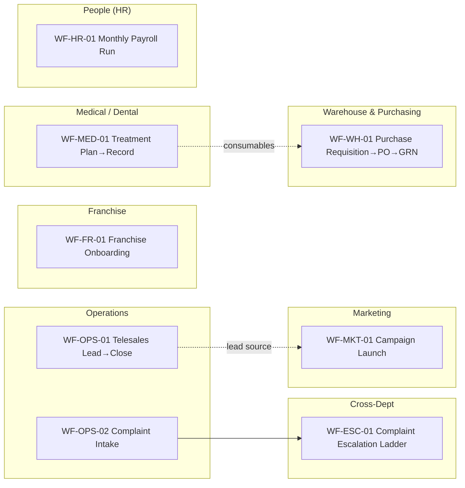
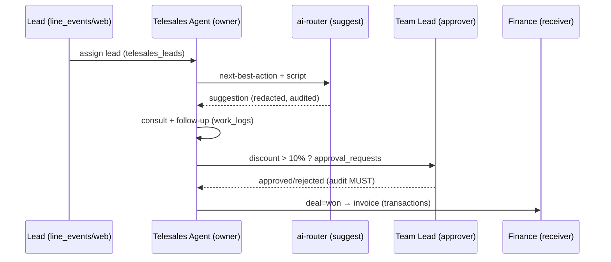
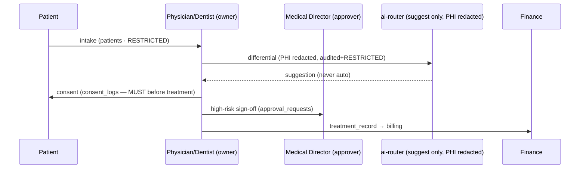
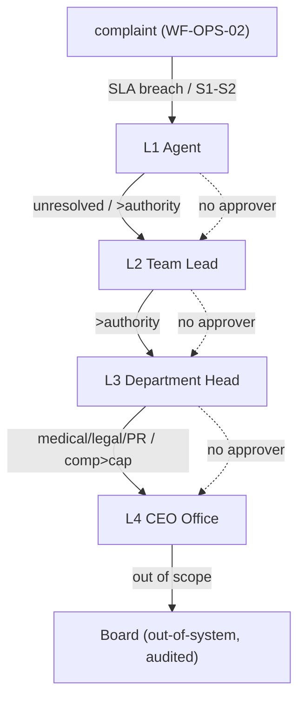

# 06 — Workflow Matrix (เมทริกซ์เวิร์กโฟลว์ข้ามแผนก)

> เอกสารสถาปัตยกรรมระดับ **Production** สำหรับ **Saduak Suay Mai PCL** — AI Workforce OS บน **NEXUS OS**
> ขอบเขต: **แค็ตตาล็อกเวิร์กโฟลว์หลัก (Workflow Catalog)** ทุกแผนก — input → process → output พร้อม Owner / Approver / Audit Log ครบทุกแถว
> รูปแบบ: ภาษาไทยเชิงบรรยาย + ศัพท์เทคนิค/identifier เป็นภาษาอังกฤษ
> หลักการบังคับ: RBAC + ABAC + Data-Ownership, **deny-by-default**, enforce ที่ **Backend** ทุก API และทุก **AI query**, Audit Log แบบ **append-only**

---

## 0. กฎเหล็กของ Workflow Matrix (Hard Rules)

ทุกเวิร์กโฟลว์ในเอกสารนี้ **ห้ามมี** แถวที่ขาด **Owner**, **Approver** หรือ **Audit Log** เด็ดขาด — ถ้างานใดยังไม่มีผู้รับผิดชอบ/ผู้อนุมัติ/ร่องรอยตรวจสอบ ถือว่า **ยังไม่ production-ready** และต้องถูกบล็อกที่ backend:

1. **No-Owner = Blocked** — ทุก workflow instance ต้องมี `owner_user_id` (Data-Ownership) ก่อนเริ่ม ถ้า null → API ปฏิเสธ (`422 OWNER_REQUIRED`)
2. **No-Approver = Blocked** — workflow ที่ต้องอนุมัติต้องมี approver-chain ที่ resolve ได้ ถ้าหา approver ไม่เจอ → escalate ขึ้น 1 ระดับ (ไม่ใช่ปล่อยผ่าน)
3. **No-Audit = Reject the action** — ถ้า audit write ล้มเหลวสำหรับ action ที่ `audit_log_required = MUST` → **rollback ทั้ง transaction** (เปลี่ยนจากพฤติกรรมเดิม `writeAudit()` ที่ swallow error — ดู §8)
4. **Backend-enforced** — ทุก gate (RBAC + ABAC + ownership + security_level) ตรวจที่ backend ทุก API และทุก AI query — frontend เป็นแค่ UX hint
5. **Security-level inheritance** — output/data_created สืบทอด `security_level` สูงสุดของ input ที่ใช้สร้าง (เช่น เอกสารที่อ้าง patient record = อย่างต่ำ `RESTRICTED`)

### 0.1 Grounding กับ NEXUS OS (สถานะของ building-block ที่ใช้ในทุก workflow)

| Building block | สถานะใน NEXUS OS | ที่อยู่ | ใช้ใน workflow |
|---|---|---|---|
| 13 system roles | **EXISTS** | `backend/src/lib/rbac.ts` `ROLES` | resolve Owner/Approver/receiver |
| 10 departments + Operations sub-units (Customer Support-Admin, Personal Care, Telesales) | **EXISTS** | `backend/src/lib/departments.ts` `DEPARTMENT_DEFINITIONS` | department / sub_department |
| `org_units`, `positions`, `employee_profiles` | **EXISTS** (ยังไม่ wire RBAC) | `nexus-hr-schema.ts` | position_owner, approver resolution **[NEW: wire เข้า ABAC]** |
| `tasks`, `task_assignments`, `daily_ai_tasks`, `work_logs` | **EXISTS** | core / `nexus-ai-schema.ts` / `nexus-schema.ts` | engine ของ process step + SLA |
| `deals`, `transactions`, `meetings`, `patients`, `campaigns` | **EXISTS** | core / `nexus-full-schema.ts` | data_created ของหลาย flow |
| `leave_requests`, `leave_approval_steps`, `leave_approval_config`, `employee_leave_quota` | **EXISTS** | core / `nexus-hr-phase5/6-schema.ts` | HR leave flow |
| `payroll_periods/items/runs/payslips`, `payroll-engine.ts` | **EXISTS** | `nexus-hr-schema.ts` / `lib/payroll-engine.ts` | Payroll flow (calculate/anomaly) |
| `franchise_audits`, `tamada_cases`, `sdx_cases`, `entities` | **EXISTS** | `nexus-entity-schema.ts` | Franchise / case flows |
| `sla-escalation.ts` (`processEscalations`, `computeSlaDue`) | **EXISTS** | `lib/sla-escalation.ts` | exception/escalation fallback |
| `ai-router.ts` (`routeAI`, decision rights auto/suggest/human) | **EXISTS** (ยังไม่ redact) | `lib/ai-router.ts` | AI step ในทุก workflow **[NEW: redaction]** |
| `audit_log` / `writeAudit()` | **EXISTS (gap)** | `nexus-schema.ts` / `lib/audit.ts` | audit ทุกแถว **[NEW: before/after, append-only, no-swallow]** |

> ตารางใหม่ที่ workflow ต้องใช้แต่ codebase **ยังไม่มี** (ทำเป็น NEW migration): `tickets`, `complaints`, `escalations`, `telesales_leads`, `purchase_requisitions`, `purchase_orders`, `goods_receipts`, `franchise_onboarding`, `treatment_plans`, `treatment_records`, `consent_logs`, `workflow_instances`, `workflow_steps`, `approval_requests`. ทุกตารางมี **BASE COLUMN CONTRACT** (id, company_id, created_at/updated_at/deleted_at, created_by/updated_by/deleted_by, is_active, version, security_level, owner_user_id, org_unit_id, branch_code).

### 0.2 Workflow Engine — โครงร่างกลาง (NEW migration)

ทุกเวิร์กโฟลว์ในเอกสารนี้รันบน engine กลางตัวเดียว เพื่อให้ Owner/Approver/Audit/SLA บังคับได้แบบ uniform:

```sql
-- [NEW migration] workflow_instances — หนึ่งแถว = หนึ่งครั้งที่ workflow ถูกรัน
CREATE TABLE workflow_instances (
  id             TEXT PRIMARY KEY,
  company_id     TEXT NOT NULL REFERENCES companies(id),
  workflow_key   TEXT NOT NULL,            -- เช่น 'telesales.lead_to_close'
  department     TEXT NOT NULL,
  sub_department TEXT,
  owner_user_id  TEXT NOT NULL REFERENCES users(id),   -- ห้าม null (กฎข้อ 1)
  status         TEXT NOT NULL DEFAULT 'open'
    CHECK (status IN ('open','in_progress','awaiting_approval','approved','rejected','blocked','done','cancelled')),
  security_level TEXT NOT NULL DEFAULT 'BASIC'
    CHECK (security_level IN ('BASIC','MEDIUM','HARD','RESTRICTED')),
  branch_code    TEXT REFERENCES branches(code),
  org_unit_id    TEXT REFERENCES org_units(id),
  sla_due_at     TIMESTAMPTZ,
  current_step   INTEGER NOT NULL DEFAULT 1,
  payload        JSONB NOT NULL DEFAULT '{}',
  created_at TIMESTAMPTZ NOT NULL DEFAULT now(),
  updated_at TIMESTAMPTZ NOT NULL DEFAULT now(),
  deleted_at TIMESTAMPTZ,
  created_by TEXT NOT NULL REFERENCES users(id),
  updated_by TEXT REFERENCES users(id),
  deleted_by TEXT REFERENCES users(id),
  is_active  BOOLEAN NOT NULL DEFAULT true,
  version    INTEGER NOT NULL DEFAULT 1,
  CONSTRAINT chk_owner_required CHECK (owner_user_id IS NOT NULL)
);

-- [NEW migration] approval_requests — ทุก approver step (ห้ามมี workflow ที่ต้องอนุมัติแต่ไม่มีแถวนี้)
CREATE TABLE approval_requests (
  id            TEXT PRIMARY KEY,
  company_id    TEXT NOT NULL REFERENCES companies(id),
  instance_id   TEXT NOT NULL REFERENCES workflow_instances(id),
  level         INTEGER NOT NULL,
  approver_role TEXT NOT NULL,                 -- resolve จาก role/position/org_unit
  approver_user_id TEXT REFERENCES users(id),  -- resolve เป็นคนจริงตอน assign
  decision      TEXT NOT NULL DEFAULT 'pending'
    CHECK (decision IN ('pending','approved','rejected','delegated','auto_escalated')),
  decided_at    TIMESTAMPTZ,
  reason        TEXT,
  security_level TEXT NOT NULL DEFAULT 'MEDIUM',
  created_at TIMESTAMPTZ NOT NULL DEFAULT now(),
  UNIQUE (instance_id, level)
);
```

### 0.3 ความหมายของคอลัมน์ในเมทริกซ์ (Schema ของแต่ละแถว)

ทุกตาราง workflow ในเอกสารนี้ใช้ 15 คอลัมน์เหมือนกัน (ตามสเปก) —
`workflow_name` · `department` · `sub_department` · `position_owner` · `input` · `process` · `output` · `receiver` · `approver` · `data_created` · `system_used` · `security_level` · `audit_log_required` · `exception_case` · `fallback_process`

- **position_owner** = ตำแหน่ง (position) เจ้าของงาน (ผูกกับ `owner_user_id`) — **บังคับมี**
- **approver** = chain ผู้อนุมัติ (resolve เป็นคนจริงผ่าน `approval_requests`) — **บังคับมี** (ถ้างานไม่ต้องอนุมัติเชิงธุรกิจ ยังต้องมี *reviewer of record* เพื่อ accountability)
- **audit_log_required** ค่า: `MUST` (rollback ถ้า audit fail) · `MUST+RESTRICTED` (MUST + บันทึก AI/redaction log แยกผูกด้วย `request_id`)
- **security_level**: `BASIC` (ทุกคน) · `MEDIUM` (ทั้งแผนก) · `HARD` (owner/manager/HR) · `RESTRICTED` (grant ตรง)

---

## 1. ดัชนีเวิร์กโฟลว์ (Master Index)



| # | workflow_key | ชื่อ (TH) | Department | Owner (position) | Security |
|---|---|---|---|---|---|
| WF-OPS-01 | `telesales.lead_to_close` | เทเลเซลส์: รับลีด → ปิดการขาย | Operations / Telesales | Telesales Agent | MEDIUM |
| WF-OPS-02 | `ops.complaint_intake` | รับเรื่องร้องเรียน (Intake) | Operations / Customer Support-Admin | Support Agent | MEDIUM |
| WF-MKT-01 | `marketing.campaign_launch` | เปิดแคมเปญการตลาด | Marketing | Campaign Manager | MEDIUM |
| WF-WH-01 | `purchasing.pr_to_grn` | จัดซื้อ: PR → PO → รับของ | Warehouse & Purchasing | Purchasing Officer | HARD |
| WF-FR-01 | `franchise.onboarding` | เปิดสาขาแฟรนไชส์ใหม่ | Franchise | Franchise Onboarding Lead | HARD |
| WF-MED-01 | `clinical.treatment` | แผน/บันทึกการรักษา (เวช+ทันต) | Medical / Dental | Attending Physician / Dentist | RESTRICTED |
| WF-HR-01 | `hr.payroll_run` | เงินเดือนรายเดือน (Payroll) | People (HR) | Payroll Officer | RESTRICTED |
| WF-ESC-01 | `ops.complaint_escalation` | บันไดยกระดับเรื่องร้องเรียน | Operations → Cross-Dept | Escalation Manager | HARD→RESTRICTED |

> ทุก workflow มี **AI assist step** (ผ่าน `routeAI()` ด้วย decision-right `auto|suggest|human`) — AI ไม่อ่าน DB ตรง, ผ่าน redaction + filter ตาม security clearance ของ owner เสมอ (ดู §7).

---

## 2. Operations / Telesales — WF-OPS-01: Lead → Close

> Sub-unit `Telesales` มีจริงใน `departments.ts`; flow อ้าง `telesales_leads` **[NEW]**, `deals` **EXISTS**, `transactions` **EXISTS**, `meetings` **EXISTS**.

| Field | Value |
|---|---|
| **workflow_name** | Telesales: Lead → Qualify → Consult → Follow-up → Close |
| **department** | Operations |
| **sub_department** | Telesales |
| **position_owner** | **Telesales Agent** (`owner_user_id`; role=`operations`) |
| **input** | Lead ใหม่ (จาก Marketing campaign / LINE OA `line_events` / inbound call / web form), customer phone, ความสนใจในบริการ (aesthetic/dental) |
| **process** | 1) รับ lead → assign owner · 2) qualify (budget/intent/branch) · 3) consult ทางโทร + บันทึกบทสนทนา · 4) AI suggest next-best-action + script (decision=`suggest`) · 5) follow-up ตาม cadence · 6) ปิดการขาย → สร้าง `deal` · 7) ส่งต่อ payment (Finance) + นัดหมาย (`meetings`) |
| **output** | `deal` (status=won), invoice draft, appointment, lead status=closed |
| **receiver** | Finance (เก็บเงิน), Personal Care (รับ care journey ต่อ), Medical/Dental (รับ appointment) |
| **approver** | Telesales Team Lead อนุมัติส่วนลด > **[ASSUMPTION] 10%**; Head of Ops อนุมัติ > **[ASSUMPTION] 20%** (resolve ผ่าน `approval_requests`) |
| **data_created** | `telesales_leads` **[NEW]**, `deals` **EXISTS**, `transactions` **EXISTS**, `meetings` **EXISTS**, `work_logs` **EXISTS** |
| **system_used** | NEXUS OS (CRM module `sales`/`operations`), `ai-router.ts`, LINE webhook |
| **security_level** | **MEDIUM** (customer PII = ทั้งแผนกเห็น; discount/margin = HARD; payment record → Finance RESTRICTED) |
| **audit_log_required** | **MUST** — `create_lead`, `view_customer`, `update_deal`, `approve_discount`, `ai_query` |
| **exception_case** | ลูกค้าขอ refund/cancel หลังปิด · ลีดซ้ำ (dedupe ชน) · ส่วนลดเกิน threshold · ลูกค้าขอลบข้อมูล (PDPA) |
| **fallback_process** | ส่วนลดเกิน → block + route approval ขึ้น Team Lead/Head of Ops; lead ตกค้างเกิน SLA → `processEscalations()` ยกระดับ; refund → เปิด WF-OPS-02 + Finance approval; PDPA delete → soft-delete + consent log |



---

## 3. Marketing — WF-MKT-01: Campaign Launch

> `campaigns` **EXISTS** (core `db.ts`). Flow เพิ่ม `campaign_assets`, `campaign_approvals` **[NEW]**.

| Field | Value |
|---|---|
| **workflow_name** | Marketing Campaign: Brief → Asset → Approve → Launch → Measure |
| **department** | Marketing |
| **sub_department** | — (แผนกเดี่ยว role=`marketing`) |
| **position_owner** | **Campaign Manager** (`owner_user_id`; role=`marketing`) |
| **input** | Campaign brief (objective, budget, target segment, channel: LINE OA/Meta/Google), promotion terms, ช่วงเวลา |
| **process** | 1) สร้าง brief · 2) AI generate copy/creative variants (decision=`suggest`, redact ข้อมูลภายใน) · 3) จัด asset + budget plan · 4) ขออนุมัติงบ/เนื้อหา · 5) launch ลง channel · 6) เก็บผล (impression/lead/CAC) · 7) ส่ง qualified lead → Telesales (เชื่อม WF-OPS-01) |
| **output** | `campaign` (status=active), creative assets, lead list, performance report |
| **receiver** | Operations/Telesales (รับ lead), Finance (เบิกงบ + reconcile spend), CEO Office (รายงานผล) |
| **approver** | Marketing Head อนุมัติเนื้อหา; Finance/CEO อนุมัติงบ > **[ASSUMPTION] ฿100,000**; Medical/Dental Head **co-sign** ถ้าโฆษณามี medical claim (บังคับตามกฎโฆษณาสถานพยาบาล) |
| **data_created** | `campaigns` **EXISTS**, `campaign_assets` **[NEW]**, `campaign_approvals` **[NEW]**, `telesales_leads` **[NEW]** |
| **system_used** | NEXUS OS (`marketing` module), `ai-router.ts` (task=`thai_market`), channel APIs **[ASSUMPTION]** |
| **security_level** | **MEDIUM** (เนื้อหา/งบ = ทั้งแผนก; medical-claim copy = **RESTRICTED** ต้อง Medical co-sign; CAC/margin = HARD) |
| **audit_log_required** | **MUST** — `create_campaign`, `approve_budget`, `approve_content`, `launch`, `ai_query` (model/provider/grounded ผูก `request_id`) |
| **exception_case** | โฆษณามี medical/efficacy claim ไม่มีหมอ co-sign · งบเกิน threshold · ใช้รูปก่อน/หลังจริงของคนไข้ (ต้อง consent) |
| **fallback_process** | Medical claim ไม่ co-sign → **block launch** (deny-by-default); งบเกิน → route Finance/CEO; ใช้ภาพคนไข้ → ต้อง `consent_logs` **[NEW]** ก่อน ไม่งั้น block |

---

## 4. Warehouse & Purchasing — WF-WH-01: PR → PO → GRN

> ตารางจัดซื้อยังไม่มีใน codebase — สร้าง `purchase_requisitions`, `purchase_orders`, `goods_receipts`, `suppliers` **[NEW]**.

| Field | Value |
|---|---|
| **workflow_name** | Purchasing: Requisition (PR) → Purchase Order (PO) → Goods Receipt (GRN) → 3-Way Match |
| **department** | Warehouse & Purchasing |
| **sub_department** | Purchasing / Warehouse (team) |
| **position_owner** | **Purchasing Officer** (`owner_user_id`; role=`warehouse`) |
| **input** | คำขอซื้อจากสาขา/แผนก (เวชภัณฑ์, consumable, อุปกรณ์ความงาม/ทันตกรรม), reorder-point alert, supplier quote |
| **process** | 1) สร้าง PR · 2) AI suggest supplier/ราคา-เปรียบเทียบ (decision=`suggest`) · 3) อนุมัติ PR ตาม budget tier · 4) ออก PO ถึง supplier · 5) รับของ → GRN + ตรวจ QC · 6) **3-way match** (PR↔PO↔GRN↔invoice) · 7) ส่ง invoice → Finance ตั้งเบิก |
| **output** | `purchase_order` (approved), `goods_receipt` (matched), stock เพิ่ม, invoice ส่ง Finance |
| **receiver** | Finance (จ่ายเงิน/AP), แผนกผู้ขอ (รับของ), Medical/Dental (เวชภัณฑ์) |
| **approver** | Warehouse Head อนุมัติ PR < **[ASSUMPTION] ฿50,000**; Finance Manager ฿50k–500k; CEO Office > **[ASSUMPTION] ฿500,000** (multi-tier ผ่าน `approval_requests`) |
| **data_created** | `purchase_requisitions` **[NEW]**, `purchase_orders` **[NEW]**, `goods_receipts` **[NEW]**, `suppliers` **[NEW]**, `transactions` **EXISTS** (AP) |
| **system_used** | NEXUS OS (`warehouse` module + `finance`), `ai-router.ts`, `ingestion_jobs` (import quote/invoice — **EXISTS**) |
| **security_level** | **HARD** (ราคาจัดซื้อ/supplier terms = owner/manager; cost data ไม่เปิดทั้งบริษัท) |
| **audit_log_required** | **MUST** — `create_pr`, `approve_pr`, `issue_po`, `receive_goods`, `three_way_match`, `view_supplier_price` |
| **exception_case** | ราคาเกิน budget · ของไม่ตรง PO (qty/spec) · supplier ส่งช้าเกิน SLA · 3-way match ไม่ผ่าน · เวชภัณฑ์ใกล้หมดอายุ |
| **fallback_process** | เกิน budget → block + escalate tier ถัดไป; match ไม่ผ่าน → hold payment + เปิด dispute (Finance); ของไม่ตรง → partial GRN + return-to-supplier; supplier ช้า → SLA escalation + flag supplier scorecard |

---

## 5. Franchise — WF-FR-01: Franchise Onboarding

> `franchise_audits` **EXISTS** (`nexus-entity-schema.ts`). เพิ่ม `franchise_onboarding`, `franchise_applicants` **[NEW]**; module `franchise` มีใน `rbac.ts`.

| Field | Value |
|---|---|
| **workflow_name** | Franchise Onboarding: Apply → Vet → Contract → Fit-out → Training → Go-Live |
| **department** | Franchise |
| **sub_department** | Franchise Development / Franchise Operations |
| **position_owner** | **Franchise Onboarding Lead** (`owner_user_id`; role=`franchise`) |
| **input** | ใบสมัครแฟรนไชส์ (ผู้ลงทุน, ทำเล/branch, เงินลงทุน), เอกสารนิติบุคคล, ผลตรวจทำเล |
| **process** | 1) รับใบสมัคร · 2) vet ผู้สมัคร (credit/background — RESTRICTED) · 3) อนุมัติเข้ารอบ · 4) ทำสัญญา (legal + CEO sign) · 5) fit-out สาขา + ตั้งค่าใน NEXUS (`branches` **EXISTS**) · 6) training ทีม · 7) baseline `franchise_audit` · 8) Go-Live |
| **output** | `branch` (active), franchise contract, onboarding checklist (done), baseline audit |
| **receiver** | CEO Office (อนุมัติสัญญา), Finance (franchise fee/royalty), IT (provision branch users/roles), Operations/Medical/Dental (สาขาใหม่เข้าระบบงาน) |
| **approver** | Franchise Head อนุมัติคุณสมบัติ; **CEO Office** ลงนามสัญญา (mandatory); Finance อนุมัติ fee structure |
| **data_created** | `franchise_applicants` **[NEW]**, `franchise_onboarding` **[NEW]**, `branches` **EXISTS**, `franchise_audits` **EXISTS**, users ของสาขา (`users`) |
| **system_used** | NEXUS OS (`franchise` + `org` + `users-admin`), `ai-router.ts` (research/feasibility), `entities`/`sdx_cases` **EXISTS** |
| **security_level** | **HARD** (สัญญา/financial terms/background = owner/CEO/Finance; PII ผู้สมัคร = **RESTRICTED**) |
| **audit_log_required** | **MUST** — `submit_application`, `vet_applicant`, `approve_franchise`, `sign_contract`, `provision_branch`, `view_background_check` |
| **exception_case** | ผู้สมัครไม่ผ่าน background · ทำเลซ้อนเขตสาขาเดิม · สัญญาค้างเซ็น · fit-out ล่าช้า · royalty ค้างจ่าย |
| **fallback_process** | ไม่ผ่าน vet → reject + บันทึกเหตุผล (audit) + soft-delete applicant; ทำเลซ้อน → block + Franchise Head ตัดสิน; สัญญาค้าง → SLA escalation ถึง CEO Office; royalty ค้าง → flag audit + Finance dunning |

---

## 6. Medical / Dental — WF-MED-01: Treatment Plan → Record

> ข้อมูลคนไข้ = **RESTRICTED by default**. `patients` **EXISTS** (`nexus-full-schema.ts`); เพิ่ม `treatment_plans`, `treatment_records`, `consent_logs` **[NEW]**. `tamada_cases`/`sdx_cases` **EXISTS** ใช้เป็น case container.

| Field | Value |
|---|---|
| **workflow_name** | Clinical: Intake → Diagnosis → Treatment Plan → Consent → Treatment → Record → Follow-up |
| **department** | Medical (เวชกรรม) / Dental (ทันตกรรม) |
| **sub_department** | Aesthetic Medicine / Dental Clinic (per branch) |
| **position_owner** | **Attending Physician / Dentist** (`owner_user_id`; role=`medical`/`dental`) |
| **input** | นัดหมาย (`meetings`/appointment จาก WF-OPS-01), ประวัติคนไข้ (`patients`), อาการ, ผลตรวจ/ภาพถ่าย |
| **process** | 1) intake + ประวัติ · 2) วินิจฉัย · 3) สร้าง treatment plan + ค่าใช้จ่าย · 4) **informed consent** (บังคับ บันทึก `consent_logs`) · 5) ทำหัตถการ · 6) บันทึก `treatment_record` · 7) สั่งเวชภัณฑ์ (เชื่อม WF-WH-01) · 8) follow-up / aftercare (เชื่อม Personal Care) |
| **output** | `treatment_plan`, `treatment_record`, prescription, follow-up appointment, billing → Finance |
| **receiver** | คนไข้, Finance (เก็บเงิน), Personal Care (aftercare), Warehouse (เบิกเวชภัณฑ์), Operations (นัดติดตาม) |
| **approver** | **Medical/Dental Director** review/sign-off สำหรับหัตถการความเสี่ยงสูง; **second-opinion** ตาม **[ASSUMPTION]** policy; ผู้ป่วยให้ consent (legal precondition) |
| **data_created** | `treatment_plans` **[NEW]**, `treatment_records` **[NEW]**, `consent_logs` **[NEW]**, `prescriptions` **[NEW]**, `patients` (update) **EXISTS** |
| **system_used** | NEXUS OS (`medical`/`dental` module), `ai-router.ts` (clinical-decision = **suggest/human เท่านั้น — ห้าม auto**) |
| **security_level** | **RESTRICTED** (ทุก field คนไข้; เปิดเฉพาะแพทย์เจ้าของเคส + direct grant; AI ต้อง redact PHI ก่อนทุกครั้ง) |
| **audit_log_required** | **MUST+RESTRICTED** — `view_patient`, `create_plan`, `capture_consent`, `perform_treatment`, `create_record`, `export_record`, `ai_query` (PHI redaction log แยกผูก `request_id`) |
| **exception_case** | ไม่มี consent · แพ้ยา/ภาวะแทรกซ้อน · ขอประวัติข้ามสาขา/ข้ามแพทย์ · ขอ export ออกนอกระบบ · ผู้ป่วยขอลบ (PDPA vs. กฎเก็บเวชระเบียน) |
| **fallback_process** | ไม่มี consent → **block treatment** (hard stop); ข้ามแพทย์ → ต้อง direct grant (RESTRICTED) + audit; complication → เปิด incident → WF-ESC-01 + Medical Director; PDPA delete → ปฏิเสธลบ (กฎหมายให้เก็บ) + บันทึกคำขอ + masking แทน |



---

## 7. People (HR) — WF-HR-01: Monthly Payroll Run

> Salary/Payroll = **RESTRICTED**. `payroll_periods/items/runs/payslips`, `salary_history`, `payroll-engine.ts` (`calculatePayslip`, `detectAnomalies`, SSO/tax) **EXISTS**.

| Field | Value |
|---|---|
| **workflow_name** | Payroll: Collect Attendance → Calculate → Anomaly Check → Approve → Disburse → Payslip |
| **department** | People (HR) |
| **sub_department** | Payroll & Compensation |
| **position_owner** | **Payroll Officer** (`owner_user_id`; role=`hr`) |
| **input** | `time_attendance`, `overtime_requests`, `leave_requests`, `salary_advances`, `payroll_settings`, salary base (`users.salary` — encrypted) — ทั้งหมด **EXISTS** |
| **process** | 1) ปิด period (`payroll_periods`) · 2) รวบรวม attendance/OT/leave/advance · 3) `calculatePayslip()` (prorata, OT, SSO, tax) · 4) `detectAnomalies()` (ค่าผิดปกติ) · 5) HR Manager review + approve `payroll_run` · 6) Finance disburse · 7) ออก `payslip` (มองเห็นเฉพาะเจ้าของ) |
| **output** | `payroll_run` (approved), `payroll_items`, `payslips`, bank transfer file, `salary_history` |
| **receiver** | พนักงานแต่ละคน (payslip ของตัวเองเท่านั้น), Finance (จ่ายเงิน), หน่วยงานรัฐ (SSO/ภ.ง.ด. — **[ASSUMPTION]**) |
| **approver** | **HR Manager** approve payroll run; **Finance Manager / CEO** อนุมัติยอดจ่ายรวม (dual-approval ผ่าน `approval_requests`) |
| **data_created** | `payroll_runs` **EXISTS**, `payroll_items` **EXISTS**, `payslips` **EXISTS**, `salary_history` **EXISTS** |
| **system_used** | NEXUS OS (`payroll` module), `payroll-engine.ts`, `encryption.ts` (mask salary by tier), `job-queue` (run batch — **EXISTS**) |
| **security_level** | **RESTRICTED** (ตัวเลขเงินเดือน/payslip = เจ้าของ + HR/Finance grant เท่านั้น; AI ห้ามเห็นยอดเงินเดือนรายคนแบบไม่ mask) |
| **audit_log_required** | **MUST+RESTRICTED** — `close_period`, `calculate_payroll`, `view_salary`, `approve_run`, `disburse`, `download_payslip`, `permission_change` |
| **exception_case** | anomaly เกิน threshold · เงินเดือนติดลบ (advance เกิน) · เปลี่ยน base กลางรอบ · พนักงานออกกลางเดือน · ยอดรวมไม่ตรง Finance |
| **fallback_process** | anomaly → **hold run** + ต้อง HR Manager override พร้อมเหตุผล (audit); ยอดไม่ตรง → block disburse จนกว่า reconcile; เปลี่ยน base → ต้อง `salary_history` + dual approve; พนักงานออก → prorata + final settlement flow |

---

## 8. Cross-Department — WF-OPS-02 / WF-ESC-01: Complaint Intake → Escalation Ladder

> ใช้ `work_logs` + `sla-escalation.ts` (`processEscalations` ยกระดับ L1→L4) **EXISTS**; เพิ่ม `complaints`, `escalations` **[NEW]**.

### 8.1 WF-OPS-02 — Complaint Intake (รับเรื่อง)

| Field | Value |
|---|---|
| **workflow_name** | Complaint Intake: Receive → Classify → Acknowledge → Triage → Route |
| **department** | Operations |
| **sub_department** | Customer Support-Admin |
| **position_owner** | **Support Agent** (`owner_user_id`; role=`operations`) |
| **input** | เรื่องร้องเรียน (โทร / LINE OA `line_events` / walk-in / web), customer id, สาขา, ประเภท |
| **process** | 1) รับเรื่อง → `complaint` · 2) AI classify ความรุนแรง/หมวด (decision=`suggest`) · 3) acknowledge ลูกค้า (SLA) · 4) triage → กำหนด severity (S1–S4) · 5) route ไปแผนกเจ้าของเรื่อง · 6) ถ้าเกิน authority → trigger WF-ESC-01 |
| **output** | `complaint` (status=routed), acknowledgement, severity tag |
| **receiver** | แผนกปลายทาง (Medical/Dental/Finance/Warehouse/Franchise ตามเรื่อง), Escalation Manager (ถ้า S1/S2) |
| **approver** | Support Team Lead รับรอง severity & routing; เรื่อง compensation → Head of Ops |
| **data_created** | `complaints` **[NEW]**, `work_logs` **EXISTS**, `notifications` **EXISTS** |
| **system_used** | NEXUS OS (`operations`/`support` module), `ai-router.ts`, `sla-escalation.ts`, LINE webhook |
| **security_level** | **MEDIUM** (เรื่องทั่วไป); ยกเป็น **RESTRICTED** อัตโนมัติถ้าพาดพิง patient/medical-dental harm หรือ HR/legal |
| **audit_log_required** | **MUST** — `create_complaint`, `classify`, `acknowledge`, `route`, `ai_query` |
| **exception_case** | severity ประเมินผิด · เรื่องเกี่ยวคนไข้/ผลข้างเคียงทางการแพทย์ · ขู่ทางกฎหมาย/สื่อ · ลูกค้าซ้ำ/troll |
| **fallback_process** | ประเมินผิด → reclassify (audit before/after); แตะ medical → upgrade RESTRICTED + route Medical Director; legal/PR → trigger WF-ESC-01 ทันที (skip ladder ขึ้น L3/L4) |

### 8.2 WF-ESC-01 — Complaint Escalation Ladder (บันไดยกระดับ)

| Field | Value |
|---|---|
| **workflow_name** | Complaint Escalation: L1 Agent → L2 Team Lead → L3 Dept Head → L4 CEO Office |
| **department** | Operations → Cross-Department |
| **sub_department** | Customer Support-Admin → แผนกเจ้าของเรื่อง |
| **position_owner** | **Escalation Manager** (`owner_user_id`; role=`operations`; ownership โอนตามระดับ) |
| **input** | `complaint` ที่เกิน SLA/authority, severity S1–S2, หรือ flag (medical/legal/PR/compensation > threshold) |
| **process** | 1) trigger จาก SLA breach (`processEscalations()`) หรือ manual · 2) ยก L+1 + reassign owner · 3) แจ้ง approver ระดับนั้น · 4) แก้ไข/ตัดสินใจ · 5) ปิดเคส + root-cause · 6) feedback ลง CSAT/quality |
| **output** | `escalation` (resolved), resolution + compensation decision, root-cause note, CSAT follow-up |
| **receiver** | ลูกค้า, แผนกเจ้าของเรื่อง, Finance (ถ้า refund/compensation), CEO Office (L4) |
| **approver** | **L2** Team Lead · **L3** Department Head · **L4** CEO Office (แต่ละระดับเป็น approver ของ action ที่ระดับนั้น ผ่าน `approval_requests`) |
| **data_created** | `escalations` **[NEW]**, `work_logs` (escalation_level — **EXISTS**), `transactions` (compensation) **EXISTS** |
| **system_used** | NEXUS OS, `sla-escalation.ts` (`escalation_level`, `escalated_at`, `sla_due_at`), `notifications`, `ai-router.ts` (root-cause = `suggest`) |
| **security_level** | **HARD → RESTRICTED** (ยกระดับตามเนื้อหา: medical/HR/legal/exec-note = RESTRICTED; compensation amount = HARD) |
| **audit_log_required** | **MUST** (RESTRICTED ถ้าแตะ medical/HR/legal) — `escalate`, `reassign_owner`, `approve_compensation`, `resolve`, `permission_change` |
| **exception_case** | ไม่มี approver ในระดับนั้น (ลาออก/ลา) · เกิน L4 · compensation เกินอำนาจ CEO Office · เคสซ้ำหลายแผนก · สื่อ/regulator เข้ามา |
| **fallback_process** | ไม่มี approver → auto-escalate ขึ้นอีกระดับ (ห้ามค้าง/ห้าม auto-approve); เกิน L4 → board-level (นอกระบบ) + บันทึก; compensation เกินอำนาจ → block + Finance/CEO dual-sign; regulator → trigger compliance hold + IT freeze export |



---

## 9. Audit, AI & Permission — กฎที่ใช้กับ *ทุก* แถวข้างบน

### 9.1 Audit-log contract (ทุก workflow action)

ทุก action ที่ `audit_log_required = MUST` เขียน `audit_log` (append-only) แบบ **fail-closed** — ต่างจากของเดิม `writeAudit()` ที่ swallow error:

```sql
-- [NEW migration] ส่วนขยาย audit_log ให้ครบสเปก enterprise
ALTER TABLE audit_log
  ADD COLUMN before_state  JSONB,
  ADD COLUMN after_state   JSONB,
  ADD COLUMN changed_fields TEXT[],
  ADD COLUMN actor_role    TEXT,
  ADD COLUMN target_table  TEXT,
  ADD COLUMN target_id     TEXT,
  ADD COLUMN target_security_level TEXT,
  ADD COLUMN ip_address    INET,
  ADD COLUMN user_agent    TEXT,
  ADD COLUMN device        TEXT,
  ADD COLUMN request_id    TEXT,
  ADD COLUMN session_id    TEXT,
  ADD COLUMN endpoint      TEXT,
  ADD COLUMN http_method   TEXT,
  ADD COLUMN result        TEXT CHECK (result IN ('success','failure','blocked')),
  ADD COLUMN failure_reason TEXT,
  ADD COLUMN prev_hash     TEXT,   -- tamper-evident hash chain
  ADD COLUMN row_hash      TEXT;
-- append-only: REVOKE UPDATE, DELETE ON audit_log; + BEFORE UPDATE/DELETE trigger RAISE EXCEPTION
```

- ทุกแถวบันทึก action ตาม spec: `login/logout/view/search/create/update/delete/soft-delete/restore/upload/download/export/approve/reject/permission-change/role-change/ai-query/ai-response/failed-access/blocked-access`
- AI logs แยกตาราง `ai_query_logs` **[NEW]** (prompt, response, provider, model, tokens, latency, decision, grounded, redaction_status) ผูกกับ audit ด้วย **`request_id`** เดียวกัน

### 9.2 AI access flow (บังคับทุก AI step ในทุก workflow)

```
user query
  → identify user (auth.ts)
  → check role + department + position + security clearance (RBAC+ABAC)
  → filter ข้อมูลให้เหลือเฉพาะที่ owner เห็นได้ (data-ownership + security_level)
  → redact PII/PHI/salary (NEW: sanitize ในเส้นทาง AI — ปัจจุบันยังไม่มี)
  → ส่งเฉพาะข้อมูลที่อนุญาตเข้า model (ai-router.ts askWithFallback)
  → response → redaction check ขาออก (AI ห้ามเปิดเผยสิ่งที่ user มองไม่เห็น)
  → audit log (ai_query + ai_response, ผูก request_id)
```

- **AI ไม่อ่าน DB ตรง** — ผ่าน filter layer เสมอ; decision-right `auto|suggest|human` ต่อ workflow (clinical = `suggest/human` เท่านั้น)
- หาก owner ไม่มีสิทธิ์เห็น field ใด → AI ต้องไม่เห็น field นั้น (ป้องกัน leak ผ่าน prompt)

### 9.3 Permission resolution (Owner & Approver ของทุกแถว)

- **Owner** = `workflow_instances.owner_user_id` (บังคับ NOT NULL) — resolve จาก position/`org_units`/role; ABAC ผูก `branch_code` + `org_unit_id`
- **Approver** = `approval_requests` resolve role → คนจริง (ตาม department head / position / leave-aware delegation); ถ้าไม่มี → **auto-escalate** (กฎข้อ 2) ไม่ใช่ auto-approve
- **Tenant isolation** = ทุก query บังคับ `company_id` ผ่าน policy layer (ไม่พึ่ง predicate มือ) — กันข้อมูลข้ามบริษัท

### 9.4 ตารางสรุป Owner / Approver / Audit ครบทุก workflow (Compliance Check)

| workflow_key | Owner ✔ | Approver ✔ | Audit ✔ | Security | Fail-closed audit |
|---|---|---|---|---|---|
| `telesales.lead_to_close` | Telesales Agent | Team Lead / Head of Ops | MUST | MEDIUM | ✅ rollback ถ้า fail |
| `ops.complaint_intake` | Support Agent | Support Team Lead | MUST | MEDIUM→RESTRICTED | ✅ |
| `marketing.campaign_launch` | Campaign Manager | Mkt Head + Finance/CEO + Medical co-sign | MUST | MEDIUM→RESTRICTED | ✅ |
| `purchasing.pr_to_grn` | Purchasing Officer | WH Head → Finance → CEO (tiered) | MUST | HARD | ✅ |
| `franchise.onboarding` | Franchise Onboarding Lead | Franchise Head + CEO sign + Finance | MUST | HARD→RESTRICTED | ✅ |
| `clinical.treatment` | Physician / Dentist | Medical/Dental Director + patient consent | MUST+RESTRICTED | RESTRICTED | ✅ |
| `hr.payroll_run` | Payroll Officer | HR Manager + Finance/CEO (dual) | MUST+RESTRICTED | RESTRICTED | ✅ |
| `ops.complaint_escalation` | Escalation Manager | L2/L3/L4 ตามระดับ | MUST(+RESTRICTED) | HARD→RESTRICTED | ✅ |

> **ผลตรวจ:** ทุก workflow มี Owner + Approver + Audit ครบ — ไม่มีแถวใดละเมิดกฎ §0. ทุกแถวมี `exception_case` และ `fallback_process` ที่ deny-by-default (block/escalate, ไม่มี auto-pass).

---

## 10. หมายเหตุการนำไปใช้ (Implementation Notes)

1. **NEW migrations ที่ workflow นี้ต้องการ:** `workflow_instances`, `workflow_steps`, `approval_requests`, `telesales_leads`, `complaints`, `escalations`, `campaign_assets`, `campaign_approvals`, `purchase_requisitions`, `purchase_orders`, `goods_receipts`, `suppliers`, `franchise_applicants`, `franchise_onboarding`, `treatment_plans`, `treatment_records`, `prescriptions`, `consent_logs`, `ai_query_logs` + ALTER `audit_log` (§9.1). รันผ่าน `migrations.ts` (tracked ใน `schema_migrations`).
2. **ต่อยอดของเดิม (ไม่สร้างซ้ำ):** `deals/transactions/meetings/patients/campaigns/payroll_*/franchise_audits/work_logs/line_events` — reuse ตามตารางใน §0.1.
3. **เปลี่ยนพฤติกรรมสำคัญ:** `writeAudit()` ต้องเลิก swallow error สำหรับ `MUST` actions (fail-closed + rollback); ใส่ redaction ในเส้นทาง `ai-router.ts` ก่อนส่ง prompt ออก external provider.
4. **[ASSUMPTION] ที่ต้องยืนยันกับธุรกิจ:** threshold ส่วนลด/งบ/จัดซื้อ/compensation, SLA จริง, นโยบาย second-opinion/high-risk procedure, รายการสาขา, headcount — ในเอกสารทำเครื่องหมาย **[ASSUMPTION]** ไว้ทั้งหมด ห้ามถือเป็นข้อเท็จจริง
5. **Deploy:** ไม่มีผลต่อ topology — ยังเป็น `railway up` ต่อ service (nexus-api / nexus-web) ตาม MEMORY; migrations รันตอน boot ของ nexus-api (`initSchema()` → `runMigrations()`).

---

*จบเอกสาร 06 — Workflow Matrix · Saduak Suay Mai PCL บน NEXUS OS · ทุก workflow บังคับ Owner + Approver + Audit Log แบบ append-only, deny-by-default, enforce ที่ backend.*
