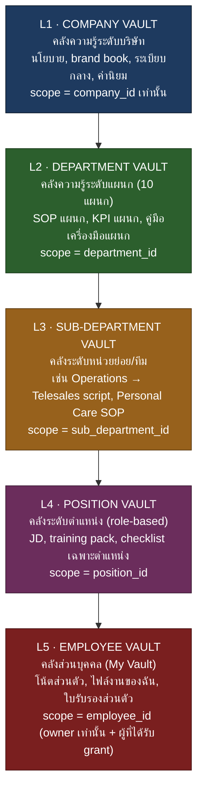
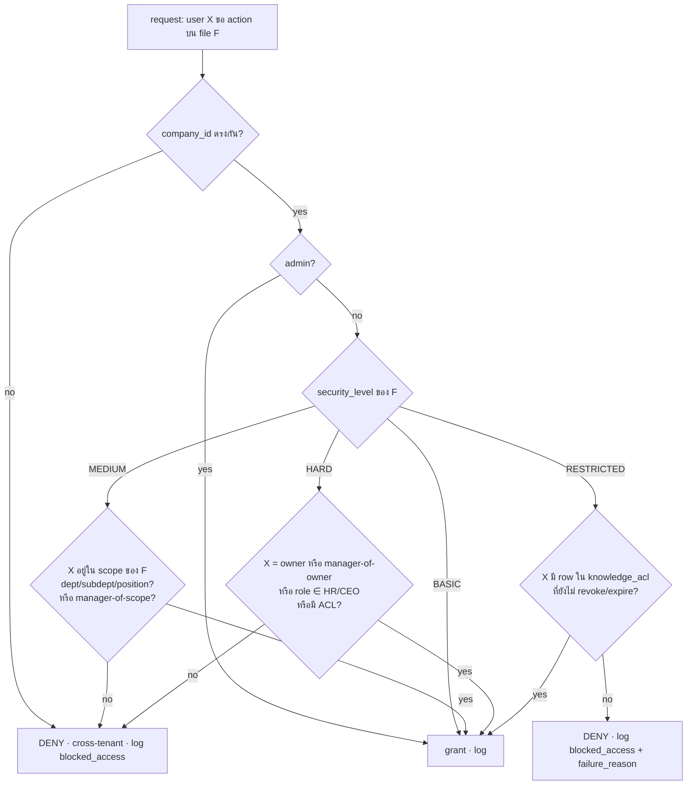
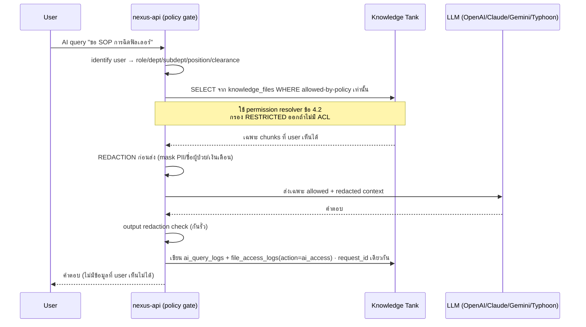

# 08 — Knowledge Matrix (Knowledge Tank 5 ระดับ + File Governance)

> **เอกสารสถาปัตยกรรม — Saduak Suay Mai PCL / NEXUS OS AI Workforce OS**
> **ขอบเขต:** Knowledge Tank (คลังความรู้) 5 ระดับ, File Metadata Schema, Storage Provider, Permission/Audit/Retention rules
> **สถานะ:** PRODUCTION-READY (ไม่ใช่ demo / ไม่ใช่ MVP) — deny-by-default, backend-enforced, append-only audit
> **เวอร์ชันเอกสาร:** 1.0 · **ผูกกับ:** `01-rbac-abac`, `04-audit-log`, `06-ai-access-control`, `07-org-structure`
> **หลักการกำกับสูงสุด:** *ไม่มีไฟล์ใดอยู่ในระบบได้ ถ้าไม่มี `owner_id` + `security_level` + `version` + `audit trail` ครบทั้งสี่*

---

## 0. Executive Summary (สรุปสำหรับผู้บริหาร)

NEXUS OS วันนี้เก็บ "ความรู้" และ "ไฟล์" กระจายอยู่ใน 3 ตารางที่ไม่ผูกกัน และ **ไม่ตรงสเปกองค์กร**:

| ตารางปัจจุบัน | สถานะ | ปัญหาเชิงองค์กร (Enterprise Gap) |
|---|---|---|
| `knowledge_items` | **EXISTS** (`nexus-full-schema.ts`) | มี `layer` เป็น free-text, `security_tier` แบบ T0–T3, **ไม่มี** `department_id`, `sub_department_id`, `position_id`, `owner_id`, `version`, `deleted_at`, `approved_by` |
| `user_files` | **EXISTS** (`nexus-ai-schema.ts`) | เก็บไฟล์เป็น `content_base64` ใน DB (!), มี `department` เป็น free-text string, **ไม่มี** owner/version/approval/retention/audit-flag; `storage_path` เพิ่มมาเปล่า ๆ (migration v? + `nexus-ops-schema.ts`) แต่ไม่มี provider |
| `documents` | **EXISTS** (`db.ts` core) | เป็นตาราง "วิเคราะห์ความเสี่ยงสัญญา" — `risk_score`/`summary`, ไม่ใช่ knowledge store, ไม่มี security/owner/version |

**Knowledge Matrix** คือชั้นกำกับ (governance layer) ที่ยกระดับทั้งสามให้เป็น **Knowledge Tank** เดียวที่มีโครงสร้าง 5 ระดับตามองค์กร — `Company → Department → Sub-Department → Position → Employee Vault` — โดย:

1. **ย้ายไบนารีของไฟล์ออกจาก PostgreSQL** ไปยัง **object storage จริง** (เลือก **Cloudflare R2** — เหตุผลในข้อ 7) เก็บเฉพาะ metadata + pointer ใน DB
2. แทนที่ `security_tier` แบบ T0–T3 ด้วย **4 SECURITY LEVELS** ตามสเปก: `BASIC / MEDIUM / HARD / RESTRICTED`
3. บังคับ **invariant 4 อย่าง** (owner, security_level, version, audit) ที่ระดับ schema (NOT NULL + CHECK + FK) และที่ระดับ API (deny-by-default)
4. ผูกทุกไฟล์เข้ากับ **org hierarchy แบบ referential FK** (ไม่ใช่ free-text `department` string อีกต่อไป) ผ่าน `org_units` / `positions` / `employee_profiles` ที่มีอยู่แล้ว
5. ทุก action บนไฟล์ (`view/search/create/update/delete/restore/upload/download/export/approve/reject/permission-change/ai-access`) → **append-only audit log** + แยก `file_access_logs`

---

## 1. Knowledge Tank — 5 ระดับ (The Knowledge Pyramid)

Knowledge Tank คือ "ปิรามิดความรู้" ที่ทุก node ผูกกับโครงสร้างองค์กรจริง (อ้างอิง `07-org-structure`). ทุกไฟล์/ทุก knowledge item ต้องสังกัด **อย่างน้อยหนึ่ง scope level** และ scope จะกำหนด *ใครเห็นได้โดย default* ก่อนชั้น security_level จะกรองซ้ำ.



### 1.1 นิยามแต่ละระดับ + การ map เข้ากับองค์กรจริง

| ระดับ | ชื่อ | Scope key | ตัวอย่างเนื้อหา (อาชีพคลินิกเสริมความงาม+ทันตกรรม) | ใครเห็น (default scope) | Security level โดยปริยาย |
|---|---|---|---|---|---|
| **L1** | Company Vault | `company_id` | นโยบายบริษัท, brand guideline, จรรยาบรรณ, ระเบียบความปลอดภัยผู้ป่วย (PDPA), โครงสร้างองค์กร | ทุกคนในบริษัท | `BASIC` (บาง item เป็น `HARD`/`RESTRICTED` เช่น executive memo) |
| **L2** | Department Vault | `department_id` | SOP แผนก, คู่มือเครื่องมือ, ปฏิทิน KPI, raw material spec (Warehouse), แคมเปญ (Marketing) | สมาชิกแผนกนั้น + ผู้บริหาร | `MEDIUM` |
| **L3** | Sub-Department Vault | `sub_department_id` | สคริปต์ Telesales, SOP Personal Care, checklist Customer Support, audit franchise template | สมาชิกหน่วยย่อยนั้น | `MEDIUM` (บาง item `HARD`) |
| **L4** | Position Vault | `position_id` | JD, training pack ตำแหน่ง, onboarding checklist, competency rubric | ผู้ดำรงตำแหน่งนั้น + manager สายงาน + HR | `MEDIUM`/`HARD` |
| **L5** | Employee Vault | `employee_id` | โน้ตส่วนตัว, ไฟล์งานร่าง, ใบรับรอง/วุฒิ, ผลประเมิน AI ของฉัน | เจ้าของเท่านั้น + ผู้ได้รับ direct grant | `HARD`/`RESTRICTED` |

> **[ASSUMPTION]** การ map L2 ↔ 10 แผนก ใช้ `org_units` ที่ seed อยู่แล้ว (`hr-init.ts`, level 1=Company, 2=Department, 3=Sub-Department). Operations มี 3 sub-units (Customer Support-Admin, Personal Care, Telesales) ตาม `DEPARTMENT_DEFINITIONS`. Medical/Dental เป็น L2 แยกกัน. ตัวเลข headcount/จำนวนสาขา ยังไม่ระบุ — ดู `branches` (migration v8).

### 1.2 หลักการ "Scope Inheritance" (การสืบทอดสิทธิ์ตามชั้น)

ไฟล์ที่อยู่ระดับสูงกว่า **มองลงล่างได้** ตาม role; ไฟล์ระดับล่าง **ไม่ทะลุขึ้นบน** โดยอัตโนมัติ:

- ผู้ที่อยู่ใน `department_id = X` เห็น L1(company) + L2(X) + L3(sub-units ของ X ที่ตนสังกัด) + L4(position ของตน) + L5(vault ของตน)
- Manager ของแผนก X เห็นเพิ่ม: L3 ทุก sub-unit ใต้ X, L4 ทุก position ใต้ X (แต่ **ไม่** เห็น L5 ของลูกน้องเว้นแต่ security_level อนุญาตหรือมี grant)
- HR/CEO/Admin มี cross-department scope (`departmentScope(user) = null`) แต่ยังถูกชั้น `security_level = RESTRICTED` กรองอยู่ดี (เช่น executive notes ที่ grant ตรง)

> **สำคัญ:** scope inheritance เป็นเพียง **ชั้นแรก (RBAC scope)**. ชั้นที่สอง (`security_level`) และชั้นที่สาม (`data ownership` / direct grant) ยังบังคับซ้ำเสมอ — รายละเอียดในข้อ 4.

---

## 2. SECURITY LEVELS — 4 ระดับ (แทนที่ T0–T3 เดิม)

ระบบเดิมใช้ `security_tier` แบบ `T0/T1/T2/T3` (ดู `encryption.ts` `canViewTier`). Knowledge Matrix **กำหนดมาตรฐานใหม่ 4 ระดับตามสเปกองค์กร** และ map ของเก่าเพื่อ migration:

| Security Level | คำอธิบาย | ใครเข้าถึง | map จาก tier เดิม | ตัวอย่างไฟล์ |
|---|---|---|---|---|
| **BASIC** | ทุกคนในบริษัทเห็นได้ | ทุก authenticated user (`company_id` ตรง) | `T0`, `T1` | ประกาศ, brand book, นโยบายทั่วไป |
| **MEDIUM** | ระดับแผนก/หน่วยย่อย | สมาชิก scope + manager สายงาน | `T1`/`T2` (department-bound) | SOP แผนก, KPI แผนก, training pack |
| **HARD** | เจ้าของ/หัวหน้า/HR | owner + manager-of-owner + HR + role ที่ระบุ | `T2`/`T3` | สัญญา, contract template, แผนกลยุทธ์, payroll setting |
| **RESTRICTED** | direct grant เท่านั้น | เฉพาะผู้ที่มี record ใน `knowledge_acl` (deny-by-default; ไม่มี implicit inheritance) | `T3` | เวชระเบียน/ทันตกรรมผู้ป่วย, payroll/contract/tax ราย บุคคล, HR investigation, AI evaluation, executive notes |

### 2.1 กฎ DEFAULT RESTRICTED (บังคับตามสเปก)

ไฟล์/knowledge item ที่จัดอยู่ในหมวดต่อไปนี้ **ต้องเป็น `RESTRICTED` โดยปริยาย** (enforced ด้วย CHECK + trigger):

- Medical / Dental / Patient records (เชื่อม `patients` — ข้อมูลถูกเข้ารหัสอยู่แล้ว: `name_encrypted`, `medical_notes_encrypted`)
- Salary / Payroll / Contract / Tax (เชื่อม `salary_history`, `payslips`, `payroll_items`)
- HR investigation (สอบสวนวินัย)
- AI evaluation (ผลประเมินพนักงานโดย AI)
- Executive notes (บันทึกผู้บริหาร / CEO Office)

```sql
-- กฎ: ถ้า knowledge_category อยู่ในหมวดอ่อนไหว -> ห้ามต่ำกว่า RESTRICTED
ALTER TABLE knowledge_files
  ADD CONSTRAINT chk_sensitive_must_be_restricted CHECK (
    knowledge_category NOT IN (
      'patient_record','medical','dental',
      'salary','payroll','contract','tax',
      'hr_investigation','ai_evaluation','executive_note'
    )
    OR security_level = 'RESTRICTED'
  );
```

---

## 3. File Metadata Schema — `knowledge_files` (ตารางหลักของ Knowledge Matrix)

> **STATUS: NEW (migration).** เป็นตารางใหม่ที่รวม/ยกระดับ `user_files` + `knowledge_items`. ไม่ลบของเก่าทันที — ดู backfill ในข้อ 8. ทุกคอลัมน์ที่สเปกองค์กรกำหนด (`file_id … audit_log_required`) มีครบ บวก base columns ที่ทุก core table ต้องมี (`company_id, created_at, updated_at, deleted_at, created_by, updated_by, deleted_by, is_active, version, security_level`).

### 3.1 รายการ field ตามสเปก (mapping)

| Field ที่สเปกกำหนด | คอลัมน์จริง | ชนิด | NOT NULL | หมายเหตุ |
|---|---|---|---|---|
| `file_id` | `id` | TEXT (UUID) | ✅ PK | app-generated `randomUUID()` ตามแบบ NEXUS |
| `file_name` | `file_name` | TEXT | ✅ | ชื่อแสดงผล (ไม่ใช่ path) |
| `file_type` | `file_type` | TEXT | ✅ | MIME เช่น `application/pdf` (CHECK whitelist) |
| `file_url` | `file_url` | TEXT | ✅ | **signed-URL pointer** ไป object storage (ไม่เก็บไบนารี) |
| `storage_provider` | `storage_provider` | TEXT | ✅ | `r2` (default) · ค่าอื่น `s3`/`gcs`/`db_legacy` |
| `company_id` | `company_id` | TEXT FK | ✅ | tenant isolation |
| `department_id` | `department_id` | TEXT FK→`org_units` | nullable* | * ต้องมีถ้า scope_level ≥ L2 |
| `sub_department_id` | `sub_department_id` | TEXT FK→`org_units` | nullable* | * ต้องมีถ้า scope_level = L3 |
| `employee_id` | `employee_id` | TEXT FK→`users` | nullable* | * ต้องมีถ้า scope_level = L5 |
| `owner_id` | `owner_id` | TEXT FK→`users` | ✅ **บังคับ** | **ไม่มีไฟล์ไร้เจ้าของ** |
| `security_level` | `security_level` | TEXT | ✅ **บังคับ** | CHECK ∈ 4 ระดับ |
| `version` | `version` | INTEGER | ✅ **บังคับ** | optimistic lock + version history |
| `created_by` | `created_by` | TEXT FK→`users` | ✅ | |
| `updated_by` | `updated_by` | TEXT FK→`users` | ✅ | |
| `approved_by` | `approved_by` | TEXT FK→`users` | nullable | NULL = ยังไม่อนุมัติ (สถานะ `draft`) |
| `created_at` | `created_at` | TIMESTAMPTZ | ✅ | |
| `updated_at` | `updated_at` | TIMESTAMPTZ | ✅ | |
| `deleted_at` | `deleted_at` | TIMESTAMPTZ | nullable | soft-delete (NULL = active) |
| `retention_policy` | `retention_policy` | TEXT | ✅ | FK→`retention_policies.code` |
| `audit_log_required` | `audit_log_required` | BOOLEAN | ✅ default TRUE | **บังคับ TRUE** สำหรับทุกไฟล์ (ดู trigger) |

บวก base/governance columns เพิ่มเติม: `scope_level`, `position_id`, `knowledge_category`, `status`, `deleted_by`, `is_active`, `checksum_sha256`, `size_bytes`, `storage_key`, `encryption_state`.

### 3.2 DDL (PostgreSQL — production)

```sql
-- ============================================================
-- NEW MIGRATION: knowledge_files  (Knowledge Matrix core table)
-- ============================================================
CREATE TABLE IF NOT EXISTS knowledge_files (
  -- identity
  id                  TEXT PRIMARY KEY,                       -- file_id (randomUUID)
  company_id          TEXT NOT NULL REFERENCES companies(id), -- tenant (NO cascade-delete: soft only)

  -- file descriptor
  file_name           TEXT NOT NULL CHECK (length(file_name) BETWEEN 1 AND 512),
  file_type           TEXT NOT NULL,                          -- MIME, whitelisted via CHECK below
  file_url            TEXT NOT NULL,                          -- signed-URL pointer (regenerated, never raw public)
  storage_provider    TEXT NOT NULL DEFAULT 'r2'
                        CHECK (storage_provider IN ('r2','s3','gcs','db_legacy')),
  storage_key         TEXT NOT NULL,                          -- object key/path inside bucket
  size_bytes          BIGINT NOT NULL DEFAULT 0 CHECK (size_bytes >= 0),
  checksum_sha256     TEXT NOT NULL,                          -- integrity (detect tamper / dedupe)
  encryption_state    TEXT NOT NULL DEFAULT 'sse'             -- sse=provider-managed, csek=customer-key, none
                        CHECK (encryption_state IN ('sse','csek','none')),

  -- KNOWLEDGE TANK 5-LEVEL SCOPE
  scope_level         TEXT NOT NULL
                        CHECK (scope_level IN ('L1_COMPANY','L2_DEPARTMENT','L3_SUBDEPT','L4_POSITION','L5_EMPLOYEE')),
  department_id       TEXT REFERENCES org_units(id),
  sub_department_id   TEXT REFERENCES org_units(id),
  position_id         TEXT REFERENCES positions(id),
  employee_id         TEXT REFERENCES users(id),
  knowledge_category  TEXT NOT NULL DEFAULT 'general',        -- SOP/policy/patient_record/salary/...

  -- OWNERSHIP & SECURITY (the 4 invariants)
  owner_id            TEXT NOT NULL REFERENCES users(id),     -- INVARIANT 1: every file has an owner
  security_level      TEXT NOT NULL                           -- INVARIANT 2: every file is classified
                        CHECK (security_level IN ('BASIC','MEDIUM','HARD','RESTRICTED')),
  version             INTEGER NOT NULL DEFAULT 1 CHECK (version >= 1), -- INVARIANT 3: versioned
  audit_log_required  BOOLEAN NOT NULL DEFAULT TRUE,          -- INVARIANT 4: audit mandatory (trigger forces TRUE)

  -- lifecycle / approval
  status              TEXT NOT NULL DEFAULT 'draft'
                        CHECK (status IN ('draft','pending_approval','published','archived','deleted')),
  approved_by         TEXT REFERENCES users(id),              -- NULL until approved
  approved_at         TIMESTAMPTZ,
  retention_policy    TEXT NOT NULL DEFAULT 'standard_5y'
                        REFERENCES retention_policies(code),

  -- audit columns (every core table)
  created_by          TEXT NOT NULL REFERENCES users(id),
  updated_by          TEXT NOT NULL REFERENCES users(id),
  deleted_by          TEXT REFERENCES users(id),
  created_at          TIMESTAMPTZ NOT NULL DEFAULT NOW(),
  updated_at          TIMESTAMPTZ NOT NULL DEFAULT NOW(),
  deleted_at          TIMESTAMPTZ,                            -- soft-delete
  is_active           BOOLEAN NOT NULL DEFAULT TRUE,

  -- ===== INVARIANT GUARDS (schema-level, deny-by-default) =====
  -- scope ↔ required FK
  CONSTRAINT chk_scope_dept   CHECK (scope_level <> 'L2_DEPARTMENT' OR department_id IS NOT NULL),
  CONSTRAINT chk_scope_sub    CHECK (scope_level <> 'L3_SUBDEPT'    OR sub_department_id IS NOT NULL),
  CONSTRAINT chk_scope_pos    CHECK (scope_level <> 'L4_POSITION'   OR position_id IS NOT NULL),
  CONSTRAINT chk_scope_emp    CHECK (scope_level <> 'L5_EMPLOYEE'   OR employee_id IS NOT NULL),
  -- sensitive categories are forced RESTRICTED
  CONSTRAINT chk_sensitive_restricted CHECK (
    knowledge_category NOT IN ('patient_record','medical','dental','salary','payroll',
                               'contract','tax','hr_investigation','ai_evaluation','executive_note')
    OR security_level = 'RESTRICTED'),
  -- published file MUST be approved
  CONSTRAINT chk_published_approved CHECK (status <> 'published' OR approved_by IS NOT NULL),
  -- soft-delete consistency
  CONSTRAINT chk_softdelete   CHECK ((deleted_at IS NULL) = (deleted_by IS NULL)),
  -- file_type whitelist
  CONSTRAINT chk_filetype CHECK (file_type IN (
    'application/pdf','image/png','image/jpeg','image/webp',
    'application/vnd.openxmlformats-officedocument.wordprocessingml.document',
    'application/vnd.openxmlformats-officedocument.spreadsheetml.sheet',
    'application/vnd.openxmlformats-officedocument.presentationml.presentation',
    'text/plain','text/markdown','text/csv','application/json','application/zip'))
);

-- ===== INDEXES (composite, tenant-first) =====
CREATE INDEX  idx_kf_company_scope    ON knowledge_files(company_id, scope_level) WHERE deleted_at IS NULL;
CREATE INDEX  idx_kf_dept             ON knowledge_files(company_id, department_id) WHERE deleted_at IS NULL;
CREATE INDEX  idx_kf_subdept          ON knowledge_files(company_id, sub_department_id) WHERE deleted_at IS NULL;
CREATE INDEX  idx_kf_owner            ON knowledge_files(company_id, owner_id) WHERE deleted_at IS NULL;
CREATE INDEX  idx_kf_employee_vault   ON knowledge_files(company_id, employee_id) WHERE scope_level = 'L5_EMPLOYEE' AND deleted_at IS NULL;
CREATE INDEX  idx_kf_security         ON knowledge_files(company_id, security_level);
CREATE INDEX  idx_kf_retention        ON knowledge_files(retention_policy, created_at);
-- uniqueness: same logical file name per scope+owner not duplicated while active
CREATE UNIQUE INDEX uq_kf_logical ON knowledge_files(company_id, scope_level,
    COALESCE(department_id,''), COALESCE(sub_department_id,''),
    COALESCE(position_id,''), COALESCE(employee_id,''), file_name, version)
  WHERE deleted_at IS NULL;
```

### 3.3 ตารางบริวาร (NEW migrations)

```sql
-- (A) นโยบายเก็บรักษา (retention) — reference table
CREATE TABLE IF NOT EXISTS retention_policies (
  code           TEXT PRIMARY KEY,            -- 'standard_5y','patient_10y','payroll_7y','legal_hold','ephemeral_90d'
  description    TEXT NOT NULL,
  retain_days    INTEGER NOT NULL CHECK (retain_days > 0 OR retain_days = -1), -- -1 = indefinite/legal hold
  legal_basis    TEXT,                        -- e.g. 'PDPA','Revenue Code','Labor Protection Act'
  auto_purge     BOOLEAN NOT NULL DEFAULT FALSE,
  created_at     TIMESTAMPTZ NOT NULL DEFAULT NOW()
);
INSERT INTO retention_policies(code,description,retain_days,legal_basis,auto_purge) VALUES
  ('standard_5y','เอกสารทั่วไป 5 ปี',1825,'internal',TRUE),
  ('patient_10y','เวชระเบียน/ทันตกรรม 10 ปี',3650,'Medical Records / PDPA',FALSE),   -- [ASSUMPTION] 10y
  ('payroll_7y','payroll/contract/tax 7 ปี',2555,'Revenue Code / Labor Law',FALSE),  -- [ASSUMPTION] 7y
  ('legal_hold','อายัดทางกฎหมาย ห้ามลบ',-1,'litigation hold',FALSE),
  ('ephemeral_90d','ไฟล์ชั่วคราว/ร่าง 90 วัน',90,'internal',TRUE)
ON CONFLICT (code) DO NOTHING;

-- (B) version history — ทุกการแก้ไฟล์สร้าง row ใหม่ (immutable snapshot ของ metadata + storage_key)
CREATE TABLE IF NOT EXISTS knowledge_file_versions (
  id              TEXT PRIMARY KEY,
  file_id         TEXT NOT NULL REFERENCES knowledge_files(id),
  company_id      TEXT NOT NULL REFERENCES companies(id),
  version         INTEGER NOT NULL,
  storage_key     TEXT NOT NULL,
  checksum_sha256 TEXT NOT NULL,
  size_bytes      BIGINT NOT NULL,
  security_level  TEXT NOT NULL,
  change_note     TEXT,
  created_by      TEXT NOT NULL REFERENCES users(id),
  created_at      TIMESTAMPTZ NOT NULL DEFAULT NOW(),
  UNIQUE (file_id, version)
);

-- (C) direct-grant ACL — บังคับใช้กับ RESTRICTED (และ override อื่น ๆ)
CREATE TABLE IF NOT EXISTS knowledge_acl (
  id            TEXT PRIMARY KEY,
  file_id       TEXT NOT NULL REFERENCES knowledge_files(id),
  company_id    TEXT NOT NULL REFERENCES companies(id),
  grantee_user_id TEXT REFERENCES users(id),    -- grant ให้ user
  grantee_role  TEXT,                            -- หรือ grant ให้ role (ออกฤทธิ์ระดับ MEDIUM/HARD)
  permission    TEXT NOT NULL CHECK (permission IN ('view','download','edit','approve','manage')),
  granted_by    TEXT NOT NULL REFERENCES users(id),
  expires_at    TIMESTAMPTZ,                     -- grant หมดอายุได้
  created_at    TIMESTAMPTZ NOT NULL DEFAULT NOW(),
  revoked_at    TIMESTAMPTZ,
  revoked_by    TEXT REFERENCES users(id),
  CHECK (grantee_user_id IS NOT NULL OR grantee_role IS NOT NULL)
);
CREATE INDEX idx_acl_file ON knowledge_acl(file_id) WHERE revoked_at IS NULL;
CREATE INDEX idx_acl_user ON knowledge_acl(company_id, grantee_user_id) WHERE revoked_at IS NULL;

-- (D) file access log (อ่าน/ดาวน์โหลด/ส่งออก) — แยกจาก audit_log หลัก, linked by request_id
CREATE TABLE IF NOT EXISTS file_access_logs (
  id             TEXT PRIMARY KEY,
  company_id     TEXT NOT NULL REFERENCES companies(id),
  file_id        TEXT NOT NULL REFERENCES knowledge_files(id),
  actor_user_id  TEXT NOT NULL REFERENCES users(id),
  actor_role     TEXT NOT NULL,
  action         TEXT NOT NULL CHECK (action IN
                   ('view','search','download','export','print','ai_access','blocked_access')),
  security_level TEXT NOT NULL,                  -- ของไฟล์ ณ ขณะเข้าถึง
  result         TEXT NOT NULL CHECK (result IN ('allow','deny')),
  failure_reason TEXT,
  ip_address     TEXT,
  user_agent     TEXT,
  request_id     TEXT NOT NULL,                  -- correlate กับ audit_log + ai_query_logs
  session_id     TEXT,
  created_at     TIMESTAMPTZ NOT NULL DEFAULT NOW()
);
CREATE INDEX idx_fal_file ON file_access_logs(file_id, created_at);
CREATE INDEX idx_fal_actor ON file_access_logs(company_id, actor_user_id, created_at);
```

### 3.4 Triggers — บังคับ invariant + append-only

```sql
-- (1) audit_log_required ต้องเป็น TRUE เสมอ (ห้ามปิด)
CREATE OR REPLACE FUNCTION enforce_audit_required() RETURNS trigger AS $$
BEGIN
  NEW.audit_log_required := TRUE;                       -- override ทุกกรณี
  RETURN NEW;
END; $$ LANGUAGE plpgsql;
CREATE TRIGGER trg_kf_audit_required
  BEFORE INSERT OR UPDATE ON knowledge_files
  FOR EACH ROW EXECUTE FUNCTION enforce_audit_required();

-- (2) ทุก UPDATE -> เด้ง version + เขียน version history + บังคับ updated_by/updated_at
CREATE OR REPLACE FUNCTION bump_file_version() RETURNS trigger AS $$
BEGIN
  IF (NEW.storage_key IS DISTINCT FROM OLD.storage_key)
     OR (NEW.checksum_sha256 IS DISTINCT FROM OLD.checksum_sha256) THEN
    NEW.version := OLD.version + 1;                      -- เนื้อไฟล์เปลี่ยน -> version ใหม่
  END IF;
  NEW.updated_at := NOW();
  INSERT INTO knowledge_file_versions(id, file_id, company_id, version, storage_key,
        checksum_sha256, size_bytes, security_level, change_note, created_by)
  VALUES (gen_random_uuid()::text, NEW.id, NEW.company_id, NEW.version, NEW.storage_key,
        NEW.checksum_sha256, NEW.size_bytes, NEW.security_level, 'auto', NEW.updated_by);
  RETURN NEW;
END; $$ LANGUAGE plpgsql;
CREATE TRIGGER trg_kf_version
  BEFORE UPDATE ON knowledge_files
  FOR EACH ROW EXECUTE FUNCTION bump_file_version();

-- (3) file_access_logs / knowledge_file_versions = append-only (revoke UPDATE/DELETE at grant level too)
CREATE OR REPLACE FUNCTION block_mutation() RETURNS trigger AS $$
BEGIN RAISE EXCEPTION 'append-only table: % blocked', TG_TABLE_NAME; END; $$ LANGUAGE plpgsql;
CREATE TRIGGER trg_fal_immutable BEFORE UPDATE OR DELETE ON file_access_logs
  FOR EACH ROW EXECUTE FUNCTION block_mutation();
CREATE TRIGGER trg_kfv_immutable BEFORE UPDATE OR DELETE ON knowledge_file_versions
  FOR EACH ROW EXECUTE FUNCTION block_mutation();
-- + at deploy time: REVOKE UPDATE, DELETE ON file_access_logs, knowledge_file_versions FROM app_role;
```

---

## 4. กฎกำกับ (Governance Rules) — "ไม่มีไฟล์ใดไร้ owner/security/version/audit"

### 4.1 The Four Invariants (บังคับทั้ง schema และ API)

| # | Invariant | บังคับที่ schema | บังคับที่ backend API |
|---|---|---|---|
| 1 | **ทุกไฟล์มี `owner_id`** | `owner_id NOT NULL` | `POST /files` reject ถ้าไม่ระบุ; default = ผู้อัปโหลด |
| 2 | **ทุกไฟล์มี `security_level`** | `NOT NULL` + CHECK 4 ค่า + CHECK sensitive→RESTRICTED | reject ถ้าไม่ระบุ; auto-set RESTRICTED ถ้า category อ่อนไหว |
| 3 | **ทุกไฟล์มี `version`** | `NOT NULL DEFAULT 1` + trigger bump | optimistic lock: `If-Match: version` บน update มิฉะนั้น 409 |
| 4 | **ทุกไฟล์ถูก audit** | `audit_log_required` forced TRUE | ทุก endpoint เขียน `audit_log` + `file_access_logs` ก่อน return |

> **ไม่มีทางลัด:** API layer **ไม่มี endpoint ที่ insert เข้า `knowledge_files` โดยข้าม validation**. การ insert ตรงผ่าน DB ถูก CHECK/trigger ดักไว้อยู่แล้ว (owner/security/sensitive/published-approved). audit เป็น fail-safe — แต่ **ต่างจาก `writeAudit()` เดิมที่ swallow error**: สำหรับ file access ที่เป็น `RESTRICTED`/`HARD` การเขียน audit ต้อง **commit ในทรานแซกชันเดียวกับการออก signed-URL** (ถ้า audit insert ล้ม → ไม่ออก URL).

### 4.2 Permission resolution — deny-by-default (RBAC + ABAC + Ownership)

ลำดับการตัดสิน (เหมือนกันทั้งฝั่ง user และฝั่ง AI; อ้างอิง `01-rbac-abac`, `06-ai-access-control`):



โค้ดสะพานเชื่อมของเดิม: ใช้ `departmentScope(user)` (`departments.ts`) เป็นชั้น scope, ยกระดับ `canViewTier` (`encryption.ts`) ให้รองรับ 4 ระดับใหม่, และเพิ่ม `knowledge_acl` lookup สำหรับ RESTRICTED. ทั้งหมดอยู่หลัง `requireModule('knowledge')` ใน `middleware/rbac.ts` (**NEW module key**).

### 4.3 Approval workflow (อนุมัติก่อน publish)

```
draft  --submit-->  pending_approval  --approve(by L4+ manager/HR)-->  published
                                       --reject-->  draft
published --archive--> archived --(retention reached)--> soft-delete --(purge)--> hard-delete
```

- ไฟล์ `RESTRICTED` (เวชระเบียน/payroll/HR investigation) **ต้องมี `approved_by` ที่เป็น role ที่กำกับโดเมนนั้น** (Medical→medical manager, payroll→finance+hr) — บังคับด้วย CHECK `chk_published_approved` + ABAC ใน service layer.
- ทุก approve/reject → `audit_log` action `approve`/`reject` พร้อม before/after JSON.

---

## 5. AI Access เข้าหา Knowledge Tank (สำคัญสุด)

**AI ไม่อ่าน `knowledge_files`/object storage โดยตรงเด็ดขาด.** ไหลผ่าน policy gate เดียวกับ user (ตามสเปก global + `06-ai-access-control`):



กฎเหล็ก:
- **AI ต้องไม่เปิดเผยไฟล์/เนื้อหาที่ user ผู้ถามเข้าถึงไม่ได้** — ใช้ permission resolver เดียวกับ UI (ไม่ใช่ logic แยก)
- ทุกครั้งที่ AI หยิบ knowledge chunk → `file_access_logs(action='ai_access')` + ผูก `request_id` กับ `ai_query_logs`
- RESTRICTED ไม่เข้าสู่ RAG context เว้นแต่ผู้ถามมี ACL ตรง (เวชระเบียน/payroll **ไม่** ถูกส่งออกไป external LLM แม้ผู้ถามมีสิทธิ์ — ปิดด้วย flag `ai_exportable=false` ที่ระดับ category)

---

## 6. การเชื่อมกับของเดิม (Grounding: EXISTS vs NEW)

| สิ่งที่ออกแบบ | สถานะ | เชื่อม/แทนที่อะไรในของเดิม |
|---|---|---|
| `knowledge_files` (core) | **NEW** | รวม `user_files` (`nexus-ai-schema.ts`) + ยก `knowledge_items` (`nexus-full-schema.ts`) |
| `knowledge_file_versions` | **NEW** | — (ของเดิมไม่มี versioning เลย) |
| `knowledge_acl` | **NEW** | ต่อยอด `permission_groups`/`user_permission_groups` (`nexus-hr-schema.ts`) ที่ระดับไฟล์ |
| `file_access_logs` | **NEW** | ปิด gap "user_files ไม่มี access trail" (ดู discovery §7.3) |
| `retention_policies` | **NEW** | — (ของเดิมไม่มี retention) |
| `security_level` 4 ระดับ | **NEW (มาตรฐาน)** | แทน `security_tier` T0–T3 (`encryption.ts`) — มี mapping ในข้อ 2 |
| scope ผูก org แบบ FK | **NEW** | ใช้ `org_units`/`positions`/`employee_profiles` ที่ seed แล้ว แทน free-text `users.department`/`user_files.department` |
| audit ทุก action | **EXTEND** | ขยาย `audit_log` (`nexus-schema.ts`) ด้วย before/after + ip/ua/request_id (ดู `04-audit-log`) |
| AI gate | **EXTEND** | เสริม `ai-router.ts`/`ai-context.ts` ให้กรองด้วย permission resolver + redaction ก่อนส่ง LLM |

> `documents` (core) คงไว้เป็น "contract risk analysis" ตามเดิม — **ไม่** ใช่ knowledge store; ถ้าต้องเก็บสัญญาเป็น knowledge ให้สร้าง row ใน `knowledge_files` (category=`contract`, RESTRICTED) ที่ point ไปไฟล์เดียวกัน.

---

## 7. Storage Provider — การเลือกผู้ให้บริการจริง

### 7.1 ปัญหาปัจจุบัน
`user_files.content_base64` เก็บ **ไบนารีไฟล์ใน PostgreSQL** — เป็น anti-pattern ร้ายแรง: bloat DB, backup ช้า, ดึง 50MB ผ่าน JSON, ไม่มี CDN, ไม่มี lifecycle. `storage_path` ถูก ALTER เพิ่มแต่ไม่เคยมี provider จริง.

### 7.2 ทางเลือกที่พิจารณา

| Provider | ข้อดี | ข้อเสีย | ค่า egress | เหมาะกับ NEXUS? |
|---|---|---|---|---|
| **Cloudflare R2** | **egress ฟรี**, S3-compatible API, signed URL, lifecycle rules, ราคานิ่ง, เข้ากับ Cloudflare (WAF/CDN) | ไม่มี region ในไทยตรง ๆ (แต่ global edge) | **$0** | ✅ **เลือกตัวนี้** |
| AWS S3 | มาตรฐาน, ครบ, region `ap-southeast-1` (สิงคโปร์) ใกล้ไทย | egress แพง, ค่าใช้จ่ายซับซ้อน | สูง | รอง |
| Google Cloud Storage | ดี, region asia-southeast1 | คล้าย S3, egress มีค่าใช้จ่าย | กลาง | รอง |
| Railway Volume | อยู่ที่เดียวกับ deploy | ไม่ใช่ object store, ไม่มี signed URL/CDN, ผูกกับ instance | — | ❌ |

### 7.3 ตัดสินใจ: **Cloudflare R2** (primary)

เหตุผล:
1. **Egress ฟรี** — คลินิกแฟรนไชส์ดึงไฟล์ภาพ before/after, เวชระเบียน, training video บ่อย → ค่า egress ของ S3 จะบาน R2 ตัดทิ้ง
2. **S3-compatible** — ใช้ `@aws-sdk/client-s3` ชี้ endpoint R2 ได้ทันที โค้ด/skill เดิมที่รู้จัก S3 ใช้ต่อได้
3. **Signed URL (presigned)** — `file_url` ใน schema คือ presigned URL อายุสั้น (เช่น 5 นาที) ออกใหม่ทุกครั้งหลังผ่าน permission gate → **ไม่มี public bucket, ไม่มี URL ถาวร**
4. เข้ากับ **Cloudflare WAF + Access** ที่หน้าบ้าน ปิด gap "ไม่มี WAF" ใน discovery §5
5. **Lifecycle rules** ของ R2 บังคับ `retention_policies` ได้ที่ระดับ bucket (auto-tier/expire สำหรับ `ephemeral_90d`)

โครงสร้าง bucket + object key:
```
นโยบาย: 1 bucket ต่อ company (tenant isolation ระดับ storage) — bucket = nexus-kb-{company_id}
object key (storage_key) = {scope_level}/{dept|subdept|position|employee}/{file_id}/v{version}/{file_name}
  เช่น  L5_EMPLOYEE/usr_8f2a/file_77ce/v3/cert_dental_license.pdf
```

Encryption: เปิด **SSE (provider-managed)** เป็น default (`encryption_state='sse'`); ไฟล์ `RESTRICTED` (เวชระเบียน) ใช้ **CSEK** (customer key จาก `ENCRYPTION_KEY` — ซึ่งต้องเลิก fallback เป็น `JWT_SECRET` ตาม gap §5; ใช้ secrets manager). object key + checksum กันการสลับไฟล์.

Env vars ใหม่ (เพิ่มใน Railway `nexus-api`):
```
R2_ACCOUNT_ID, R2_ACCESS_KEY_ID, R2_SECRET_ACCESS_KEY,
R2_ENDPOINT=https://{account}.r2.cloudflarestorage.com,
R2_BUCKET_PREFIX=nexus-kb, R2_SIGNED_URL_TTL=300
```
Fallback: ถ้า env ไม่ครบ → `storage_provider='db_legacy'` (เก็บ base64 ในตารางเดิม) เพื่อ dev/local ไม่พัง — แต่ production ต้องเป็น `r2` (CHECK ใน deploy guard).

---

## 8. แผนย้ายข้อมูล (Migration & Backfill)

ลงผ่านระบบ migration ที่มี (`migrations.ts` + `schema_migrations`, versioned), deploy ด้วย `railway up` ที่ `nexus-api` (boot รัน `runMigrations()` อัตโนมัติ):

1. **v-next.1** สร้าง `retention_policies`, `knowledge_files`, `knowledge_file_versions`, `knowledge_acl`, `file_access_logs` + triggers + grants (REVOKE UPDATE/DELETE บน append-only)
2. **v-next.2** backfill จาก `user_files`:
   - `owner_id := user_id`; `scope_level := 'L5_EMPLOYEE'` ถ้ามี `user_id` ไม่มี department, ไม่งั้น map `department` (string) → `org_units.id` (`L2_DEPARTMENT`)
   - `security_level`: map `security_tier` (T0/T1→BASIC, T2→HARD, T3→RESTRICTED); ตั้ง `version:=1`, `audit_log_required:=TRUE`, `retention_policy:='standard_5y'`
   - ย้าย `content_base64` → R2 (job ใน `job_queue` ที่มีอยู่), set `storage_provider`, `storage_key`, `checksum_sha256`; ถ้ายังไม่ย้าย คงไว้ `db_legacy`
3. **v-next.3** backfill `knowledge_items` → `knowledge_files` (category จาก `category`, `layer`→`scope_level`: Company/Department/...; content เก็บเป็น `.md` ใน R2)
4. **v-next.4** ผูก RBAC: เพิ่ม module key `knowledge` ใน `MODULE_ACCESS` (`rbac.ts`) + route `requireModule('knowledge')`
5. **rollout guard:** production refuse boot ถ้า `DATABASE_URL` ตั้งแต่ `R2_*` ไม่ครบและมีไฟล์ `security_level='RESTRICTED'` ที่ยังเป็น `db_legacy` (เวชระเบียนต้องอยู่ object store + CSEK)

> เก็บ `user_files`/`knowledge_items` ไว้ (read-only, dual-write off) จน backfill ผ่าน verification ครบ แล้วค่อย soft-deprecate.

---

## 9. Acceptance Criteria (เกณฑ์ผ่าน — production-ready)

- [ ] ทุก row ใน `knowledge_files` มี `owner_id`, `security_level`, `version`, `audit_log_required=TRUE` (บังคับ NOT NULL/CHECK/trigger) — **ไม่มี exception**
- [ ] insert ไฟล์ category อ่อนไหว ที่ security ≠ RESTRICTED → ถูก DB ปฏิเสธ (ทดสอบ `chk_sensitive_restricted`)
- [ ] published file ที่ไม่มี `approved_by` → ถูกปฏิเสธ
- [ ] user นอก scope ขอ MEDIUM/HARD/RESTRICTED → 403 + 1 row ใน `file_access_logs(result='deny', action='blocked_access')`
- [ ] AI query ที่พาดพิง RESTRICTED โดยผู้ถามไม่มี ACL → คำตอบไม่รั่ว + `ai_query_logs` + `file_access_logs(ai_access)` ผูก `request_id` เดียวกัน
- [ ] download ใด ๆ → presigned R2 URL อายุ ≤ 300s, ไม่มี public bucket
- [ ] `file_access_logs` / `knowledge_file_versions` แก้/ลบไม่ได้ (append-only trigger + REVOKE)
- [ ] retention job ลบ (soft→hard) เฉพาะ policy `auto_purge=TRUE` และไม่ใช่ `legal_hold`
- [ ] cross-tenant: query ขาด `company_id` predicate → ไม่หลุดข้าม company (RLS หรือ enforced predicate)

---

## 10. ภาคผนวก — JSON ตัวอย่าง metadata 1 record (L5 Employee Vault, RESTRICTED)

```json
{
  "id": "file_77ce3a1b",
  "company_id": "cmp_saduaksuaymai",
  "file_name": "dental_license_2026.pdf",
  "file_type": "application/pdf",
  "file_url": "https://acc.r2.cloudflarestorage.com/nexus-kb-cmp_saduaksuaymai/L5_EMPLOYEE/usr_8f2a/file_77ce3a1b/v1/dental_license_2026.pdf?X-Amz-Expires=300&X-Amz-Signature=…",
  "storage_provider": "r2",
  "storage_key": "L5_EMPLOYEE/usr_8f2a/file_77ce3a1b/v1/dental_license_2026.pdf",
  "size_bytes": 482113,
  "checksum_sha256": "9f2c…ab",
  "encryption_state": "csek",
  "scope_level": "L5_EMPLOYEE",
  "department_id": "ou_dental",
  "sub_department_id": null,
  "position_id": "pos_dentist",
  "employee_id": "usr_8f2a",
  "knowledge_category": "general",
  "owner_id": "usr_8f2a",
  "security_level": "HARD",
  "version": 1,
  "audit_log_required": true,
  "status": "published",
  "approved_by": "usr_hr_lead",
  "retention_policy": "standard_5y",
  "created_by": "usr_8f2a",
  "updated_by": "usr_8f2a",
  "deleted_by": null,
  "created_at": "2026-06-25T09:14:00+07:00",
  "updated_at": "2026-06-25T09:14:00+07:00",
  "deleted_at": null,
  "is_active": true
}
```

---
*จบเอกสาร 08 — Knowledge Matrix. ทุกตาราง/ฟิลด์/กฎผูกกับ NEXUS OS ปัจจุบันและระบุชัด EXISTS/NEW. ค่าที่ยังไม่ทราบจริงทำเครื่องหมาย [ASSUMPTION].*
