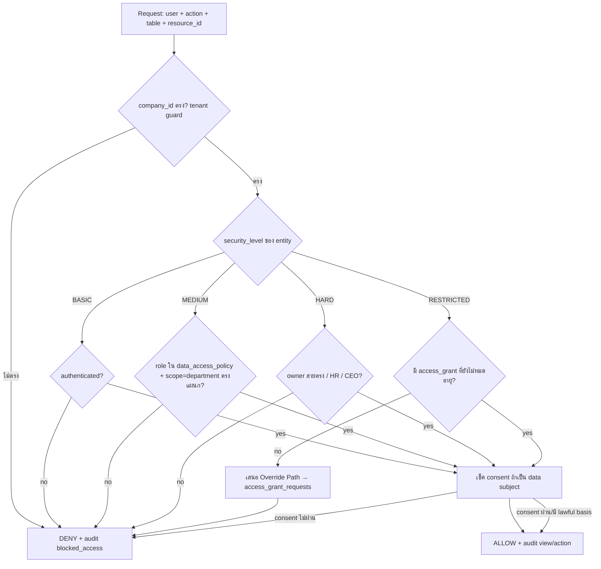
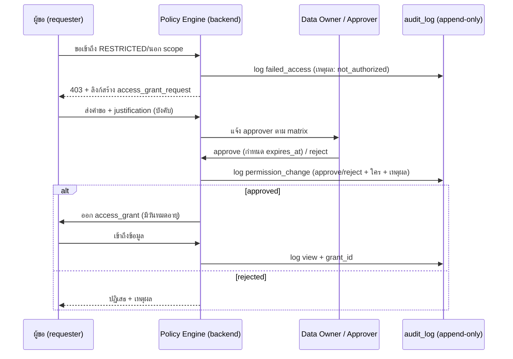

# 09 — Data Ownership Matrix (เมทริกซ์ความเป็นเจ้าของข้อมูล)

> **เอกสาร:** Data Ownership Matrix — NEXUS OS / AI Workforce OS
> **บริษัท:** Saduak Suay Mai PCL (บริษัท สะดวกสวยมาย จำกัด (มหาชน)) — เครือคลินิกความงาม + ทันตกรรม แบบแฟรนไชส์
> **เวอร์ชัน:** 1.0 (PRODUCTION-READY, deny-by-default)
> **สถานะ:** Architecture Baseline — Principal Data Architect panel
> **ขอบเขต:** กำหนด **Data Owner / Data Users / security_level / retention / consent / override path** สำหรับ *ทุก* entity หลักในระบบ
> **กฎหมายอ้างอิง:** Thailand PDPA (พ.ร.บ.คุ้มครองข้อมูลส่วนบุคคล พ.ศ. 2562), พ.ร.บ.สถานพยาบาล, ประมวลรัษฎากร (เก็บเอกสารภาษี 5 ปี), พ.ร.บ.คุ้มครองแรงงาน

---

## 1. หลักการ (Governing Principles)

เอกสารนี้คือ **single source of truth** สำหรับ *ใครเป็นเจ้าของข้อมูล / ใครอ่านได้ / ลับระดับไหน / เก็บนานเท่าไร / ต้องขอ consent ไหม / และถ้าจะเข้าถึงเกินสิทธิ์ต้องผ่านใคร*. ทุกแถวในตารางนี้ **บังคับใช้ที่ backend** (RBAC + ABAC + Data-Ownership, deny-by-default) และบังคับใช้ซ้ำบน **ทุก AI query** ด้วย เพราะ AI ไม่เคยอ่าน DB ตรง — มันได้เห็นเฉพาะข้อมูลที่ matrix นี้อนุญาตเท่านั้น

### 1.1 นิยาม 6 คอลัมน์หลัก

| คอลัมน์ | ความหมาย (ไทย) | บังคับใช้อย่างไรในระบบ |
|---|---|---|
| **Data Owner** | ตำแหน่ง/บทบาทที่ "รับผิดชอบ" ข้อมูล — ตัดสินใจเรื่องการแก้ไข แชร์ ลบ และอนุมัติ override (accountable, ไม่ใช่แค่ใช้งาน) | เก็บใน `data_dictionary.owner_role` **[NEW column]**; ABAC policy resolver อ้างอิงค่านี้ |
| **Data Users (read)** | บทบาท/ขอบเขตที่ "อ่านได้" ภายใต้เงื่อนไข scope (own / department / company) | `MODULE_ACCESS` (มีอยู่) + `data_access_policy` table **[NEW]** ที่ผูก table → role → scope |
| **security_level** | 1 ใน 4 ระดับ: `BASIC` / `MEDIUM` / `HARD` / `RESTRICTED` | คอลัมน์ `security_level` บนทุก core table **[NEW]**; แทนที่ label `security_tier` เดิม (T0–T3) |
| **Retention** | ระยะเก็บก่อน archive/anonymize/purge — อิงกฎหมายไทย | `retention_policy` table **[NEW]** + job `retention-sweeper` **[NEW]** |
| **Consent** | ต้องมี lawful basis / consent บันทึกไว้หรือไม่ (PDPA) | `consent_logs` table **[NEW]**; เช็คก่อน read/export/AI ใช้ข้อมูล data subject |
| **Override / Approval Path** | ใครอนุมัติเมื่อมีคนขอเข้าถึงเกินสิทธิ์ปกติ | `access_grant_requests` + `access_grants` tables **[NEW]**; ทุกขั้น log ใน `audit_log` |

### 1.2 4 Security Levels (สรุป)

| Level | ใครเห็นโดย default | ตัวอย่าง entity | กฎเสริม |
|---|---|---|---|
| **BASIC** | ทุกคนในบริษัท (authenticated) | data_dictionary, knowledge_items (public), notifications ของตัวเอง | ยังต้อง audit การ view ที่ผิดปกติ |
| **MEDIUM** | สมาชิกใน department เดียวกัน (ABAC `department` scope) | tasks, work_logs, deals, campaigns, meetings | manager เห็นทั้งแผนก, staff เห็นของตัวเอง |
| **HARD** | owner / manager สายตรง / HR / CEO | employee_profiles, time_attendance, leave_requests, salary_advances | cross-department อ่านไม่ได้ |
| **RESTRICTED** | เฉพาะที่ได้รับ **grant ตรง** เท่านั้น (deny-by-default แม้แต่ role ที่ดู "เกี่ยวข้อง") | patients, payslips, salary_history, tamada_cases, sdx_cases, HR investigation, ai evaluation, executive notes | ต้องผ่าน Override Path ทุกครั้ง + consent check + redaction บน AI |

> **กฎเหล็ก:** Medical/Dental/Patient, Salary/Payroll/Contract/Tax, HR investigation, AI evaluation, Executive notes = **RESTRICTED by default** เสมอ ไม่ว่า role จะดูเกี่ยวข้องแค่ไหน

### 1.3 บทบาท (13 roles ที่มีจริงใน `rbac.ts`)

`admin`, `ceo`, `operations`, `medical`, `dental`, `finance`, `hr`, `it`, `marketing`, `warehouse`, `franchise`, `sales`, `staff`.

> **[ASSUMPTION]** Position ที่ผูกกับ role (เช่น "Clinic Director" → role `ceo` ระดับสาขา, "Head Nurse" → role `medical` manager) อ้างจาก `positions` + `org_units` ที่ seed ไว้ ไม่ใช่ข้อมูลพนักงานจริง — ปรับตามผังจริงเมื่อ onboarding
> **หมายเหตุ admin:** `admin` short-circuit ทุก check ใน code ปัจจุบัน — ใน production matrix นี้กำหนดว่า **admin ไม่ได้รับการยกเว้น RESTRICTED โดยอัตโนมัติ**; การที่ admin เปิดดู RESTRICTED ต้อง "break-glass" และถูก audit แบบ high-severity (ดู §6.4)

---

## 2. เครื่องมือบังคับใช้ (Enforcement Backbone) — สิ่งที่ต้องสร้างใหม่

Matrix นี้ไร้ความหมายถ้าไม่มี enforcement layer ต่อไปนี้ ทั้งหมดเป็น **[NEW migration]** (อ้าง gap #2, #3 ใน discovery):

```sql
-- ทุก core table ต้องมี: id, company_id, created_at, updated_at, deleted_at,
--   created_by, updated_by, deleted_by, is_active, version, security_level
-- ด้านล่างคือ "ตาราง governance" ที่ทำให้ matrix นี้บังคับใช้ได้จริง

-- (A) นโยบายเข้าถึงต่อ table+role+scope (หัวใจของ Data Users column)
CREATE TABLE IF NOT EXISTS data_access_policy (
  id              TEXT PRIMARY KEY,
  company_id      TEXT NOT NULL REFERENCES companies(id),
  table_name      TEXT NOT NULL,
  role            TEXT NOT NULL,                 -- 1 ใน 13 roles
  scope           TEXT NOT NULL,                 -- 'own' | 'department' | 'company' | 'none'
  can_read        BOOLEAN NOT NULL DEFAULT 0,
  can_write       BOOLEAN NOT NULL DEFAULT 0,
  can_export      BOOLEAN NOT NULL DEFAULT 0,
  security_level  TEXT NOT NULL,                 -- BASIC|MEDIUM|HARD|RESTRICTED
  created_at      TEXT NOT NULL,
  UNIQUE (company_id, table_name, role, scope),
  CHECK (scope IN ('own','department','company','none')),
  CHECK (security_level IN ('BASIC','MEDIUM','HARD','RESTRICTED'))
);

-- (B) เจ้าของข้อมูลระดับ entity (Data-Ownership / ABAC)
--     เติม owner_user_id / owner_department ลงในทุก core table แทน department-string เดิม
ALTER TABLE <core_table> ADD COLUMN owner_user_id   TEXT REFERENCES users(id);
ALTER TABLE <core_table> ADD COLUMN owner_department TEXT;

-- (C) การให้สิทธิ์ตรงสำหรับ RESTRICTED (Override result)
CREATE TABLE IF NOT EXISTS access_grants (
  id            TEXT PRIMARY KEY,
  company_id    TEXT NOT NULL REFERENCES companies(id),
  grantee_user  TEXT NOT NULL REFERENCES users(id),
  table_name    TEXT NOT NULL,
  resource_id   TEXT,                            -- NULL = grant ทั้ง table; ระบุ = row เดียว
  permission    TEXT NOT NULL,                   -- 'read'|'write'|'export'
  granted_by    TEXT NOT NULL REFERENCES users(id),
  reason        TEXT NOT NULL,
  expires_at    TEXT NOT NULL,                   -- grant มีวันหมดอายุเสมอ (ไม่มี grant ถาวร)
  revoked_at    TEXT,
  created_at    TEXT NOT NULL,
  CHECK (permission IN ('read','write','export'))
);

-- (D) คำขอเข้าถึง (Override request → approval workflow)
CREATE TABLE IF NOT EXISTS access_grant_requests (
  id            TEXT PRIMARY KEY,
  company_id    TEXT NOT NULL REFERENCES companies(id),
  requester     TEXT NOT NULL REFERENCES users(id),
  table_name    TEXT NOT NULL,
  resource_id   TEXT,
  permission    TEXT NOT NULL,
  justification TEXT NOT NULL,
  status        TEXT NOT NULL DEFAULT 'pending',  -- pending|approved|rejected|expired
  approver      TEXT REFERENCES users(id),
  decided_at    TEXT,
  created_at    TEXT NOT NULL,
  CHECK (status IN ('pending','approved','rejected','expired'))
);

-- (E) consent (PDPA lawful basis)
CREATE TABLE IF NOT EXISTS consent_logs (
  id              TEXT PRIMARY KEY,
  company_id      TEXT NOT NULL REFERENCES companies(id),
  data_subject_id TEXT NOT NULL,                  -- patient_id / user_id / lead_id
  subject_type    TEXT NOT NULL,                  -- 'patient'|'employee'|'lead'|'customer'
  purpose         TEXT NOT NULL,                  -- 'treatment'|'marketing'|'payroll'|'ai_processing'...
  lawful_basis    TEXT NOT NULL,                  -- 'consent'|'contract'|'legal_obligation'|'vital_interest'
  granted         BOOLEAN NOT NULL,
  granted_at      TEXT,
  withdrawn_at    TEXT,
  source          TEXT,                           -- 'line'|'paper_form'|'app'
  created_at      TEXT NOT NULL
);

-- (F) นโยบาย retention ต่อ table
CREATE TABLE IF NOT EXISTS retention_policy (
  id            TEXT PRIMARY KEY,
  table_name    TEXT NOT NULL UNIQUE,
  retain_days   INTEGER NOT NULL,                 -- ระยะเก็บแบบ active
  action        TEXT NOT NULL,                    -- 'archive'|'anonymize'|'purge'
  legal_hold    BOOLEAN NOT NULL DEFAULT 0,       -- ถ้า true ห้าม purge แม้ครบกำหนด
  created_at    TEXT NOT NULL,
  CHECK (action IN ('archive','anonymize','purge'))
);
```

**ลำดับการตัดสิน (Decision order) ของ Policy Engine** บนทุก request และทุก AI query:



---

## 3. MASTER DATA OWNERSHIP MATRIX

> สัญลักษณ์ scope ในคอลัมน์ Data Users: **own** = เฉพาะแถวของตัวเอง · **dept** = ทั้งแผนกตัวเอง · **co** = ทั้งบริษัท · **grant** = เฉพาะที่ได้รับสิทธิ์ตรง
> สถานะ: **EXISTS** = ตารางมีอยู่แล้ว · **NEW** = migration ใหม่ · **ALTER** = ตารางมีแต่ต้องเติมคอลัมน์ governance

### 3.1 Patient & Clinical (Medical + Dental) — RESTRICTED ทั้งหมวด

| Entity (table) | สถานะ | Data Owner | Data Users (read) | security_level | Retention | Consent | Override / Approval Path |
|---|---|---|---|---|---|---|---|
| `patients` | EXISTS (ALTER) | **Medical Director** (role `medical`, สาขาที่ลงทะเบียน) | `medical` (grant ต่อสาขา), `dental` (เฉพาะคนไข้ทันตกรรม, grant), แพทย์/พยาบาลที่รักษาเคสนั้น (own-as-treater), `ceo` (grant), `admin` (break-glass) | **RESTRICTED** | เก็บ active 10 ปีหลัง encounter ล่าสุด → anonymize **[ASSUMPTION: อิงแนวเวชระเบียน, ปรับตามประกาศแพทยสภา]** | **จำเป็น** — `consent_logs` purpose=`treatment` (lawful_basis=`contract`/`consent`); แยก consent สำหรับ `marketing` | คำขอ → `access_grant_requests` → อนุมัติโดย **Medical Director ของสาขา**; cross-branch ต้อง CEO co-approve; ทุกการเปิดดู audit severity HIGH |
| clinical notes / encounters **[NEW: `clinical_encounters`]** | NEW | Medical Director / Dentist เจ้าของเคส | แพทย์ผู้รักษา (own), `medical`/`dental` manager สาขา (grant) | **RESTRICTED** | 10 ปี → anonymize | จำเป็น (treatment) | เหมือน `patients`; แก้ไขหลัง finalize ต้อง addendum (versioned, ห้าม overwrite) |
| `tamada_cases` (เคสหัตถการ/ผ่าตัด) | EXISTS (ALTER) | **Medical Director** | `medical` ทีมเคส (grant), `ceo` (grant) | **RESTRICTED** | 10 ปี | จำเป็น (treatment) | Medical Director อนุมัติ; export ต้อง CEO co-sign |
| `sdx_cases` (เคสทันตกรรม Saduak Dental) | EXISTS (ALTER) | **Dental Lead** (role `dental`) | `dental` ทีมเคส (grant), `ceo` (grant) | **RESTRICTED** | 10 ปี | จำเป็น (treatment) | Dental Lead อนุมัติ; cross-branch → CEO |
| consult/treatment media (รูปก่อน-หลัง) **[NEW: `user_files` subset]** | ALTER | แพทย์/ทันตแพทย์เจ้าของเคส | ทีมรักษา (grant) | **RESTRICTED** | ตามเคส (10 ปี) | **แยก consent** สำหรับใช้ในสื่อ/marketing (ห้าม default) | Medical/Dental Director; ใช้ในโฆษณาต้อง consent purpose=`marketing` + Marketing Head |

### 3.2 People / HR — HARD ถึง RESTRICTED

| Entity (table) | สถานะ | Data Owner | Data Users (read) | security_level | Retention | Consent | Override / Approval Path |
|---|---|---|---|---|---|---|---|
| `employee_profiles` | EXISTS (ALTER) | **HR Head** (role `hr`) | พนักงานเจ้าของ (own), manager สายตรง (dept, ฟิลด์จำกัด), `hr` (co), `ceo` (co) | **HARD** (ฟิลด์ ID/bank/ที่อยู่ = **RESTRICTED**) | ตลอดอายุงาน + 5 ปีหลังพ้นสภาพ (พ.ร.บ.แรงงาน) → anonymize | จำเป็นสำหรับฟิลด์นอกเหนือ employment (lawful_basis=`contract`) | HR Head อนุมัติ field-level grant; ดูข้าม manager ต้อง CEO |
| `salary_history` | EXISTS (ALTER) | **HR Head + Finance Head** (co-owner) | พนักงานเจ้าของ (own, ของตัวเอง), `hr` (grant), `finance` payroll (grant), `ceo` (grant) | **RESTRICTED** | 5 ปีหลังพ้นสภาพ (ภาษี) | lawful_basis=`contract`/`legal_obligation` | HR Head + Finance Head co-approve; ตัวเลขในมุมมอง AI ถูก **mask** เสมอเว้นแต่ owner ขอเอง |
| `salary_advances` | EXISTS (ALTER) | **HR Head** | พนักงานเจ้าของ (own), `hr`, `finance`, `ceo` (อนุมัติ) | **HARD** | 5 ปี | contract | HR → Finance → (วงเงินสูง) CEO; chain ใน `*_approval_steps` |
| `time_attendance` / `employee_daily_calendar` | EXISTS (ALTER) | **HR Head** | พนักงานเจ้าของ (own), manager สายตรง (dept), `hr` (co) | **HARD** | 5 ปี → archive | contract | manager เห็นทีมตัวเอง; cross-dept → HR |
| `leave_requests` / `leave_approval_steps` / `employee_leave_quota` | EXISTS (ALTER) | **HR Head** (policy), manager (approver) | พนักงานเจ้าของ (own), manager สายตรง (dept), `hr` (co) | **HARD** | 5 ปี | contract | chain: manager → HR; เหตุผลลาป่วย (สุขภาพ) = RESTRICTED field |
| `overtime_requests` / `ot_approval_steps` / `overtime_types` | EXISTS (ALTER) | **HR Head** | เจ้าของ (own), manager (dept), `finance` (payroll), `hr` | **HARD** | 5 ปี | contract | manager → HR; กระทบ payroll → Finance เห็น |
| HR investigation / disciplinary **[NEW: `hr_cases`]** | NEW | **HR Head** | เฉพาะ `hr` ที่ได้รับมอบหมาย (grant), `ceo` (grant) | **RESTRICTED** | 5 ปีหลังปิดเคส → purge | lawful_basis=`legitimate_interest`; แจ้ง data subject ตาม PDPA | HR Head เปิดเคส; ผู้ถูกสอบสวน **ไม่เห็น**; CEO เห็นเมื่อ escalate; AI **ห้าม**สรุปเคสให้ใครนอก grant |
| `skill_scores` / `skill_evidence` / AI evaluation **[NEW: `ai_evaluations`]** | EXISTS/NEW | **HR Head** (เจ้าของผล), manager (ผู้ประเมิน) | พนักงานเจ้าของ (own, ผลตัวเอง), manager สายตรง (dept), `hr` (co) | evidence=**HARD**; **AI evaluation=RESTRICTED** | 3 ปี → archive **[ASSUMPTION]** | แจ้งพนักงานว่าใช้ AI ประเมิน (PDPA automated-decision) | AI eval ที่กระทบสถานะงานต้อง human-in-the-loop; พนักงานขออุทธรณ์ผ่าน HR Head |

### 3.3 Finance / Payroll / Tax — RESTRICTED (เงิน) / HARD

| Entity (table) | สถานะ | Data Owner | Data Users (read) | security_level | Retention | Consent | Override / Approval Path |
|---|---|---|---|---|---|---|---|
| `payslips` | EXISTS (ALTER) | **Finance Head** + HR Head | พนักงานเจ้าของ (own, ของตัวเอง), `finance` payroll (grant), `hr` (grant), `ceo` (grant) | **RESTRICTED** | 5 ปี (ภาษี) | legal_obligation | Finance Head อนุมัติ; ดูของคนอื่นต้อง grant + เหตุผล; AI mask ตัวเลขเงินเดือน |
| `payroll_runs` / `payroll_periods` / `payroll_items` / `payroll_settings` | EXISTS (ALTER) | **Finance Head** | `finance` payroll team (grant), `ceo` (grant), `hr` (อ่านสรุป) | **RESTRICTED** | 5 ปี | legal_obligation | Finance Head; lock period ห้ามแก้ย้อนหลัง (versioned) |
| `transactions` (รายรับ-จ่าย/บัญชี) | EXISTS (ALTER) | **Finance Head** | `finance` (co), `ceo` (co), สาขาเจ้าของรายการ (dept สำหรับ POS), `admin` (grant) | **HARD** (รายการ + ภาษี/ผู้เสียภาษี = RESTRICTED) | 5 ปี (ประมวลรัษฎากร) | legal_obligation | Finance Head; แก้ไขรายการปิดงวดแล้ว → journal entry ใหม่เท่านั้น |
| `deals` (มูลค่า/สัญญาการขาย) | EXISTS (ALTER) | **Sales Lead** (role `sales`) | `sales` (dept), เจ้าของดีล (own), `finance` (grant สำหรับ revenue), `ceo` (co) | **MEDIUM**; มูลค่าสัญญา/ส่วนลด = **HARD** | 5 ปี | contract (ลูกค้า) | Sales Lead; เปิดเผยมูลค่าข้ามทีม → CEO/Finance |
| contracts (จ้างงาน/แฟรนไชส์/ supplier) **[NEW: `contracts`]** | NEW | เจ้าของตามชนิด (HR=จ้างงาน, Franchise Head=แฟรนไชส์, Purchasing=supplier) | คู่สัญญา (own), owner role (dept), `finance` (grant), `ceo` (co) | **RESTRICTED** | 5 ปีหลังสิ้นสุด (ภาษี) | contract | owner role + Finance co-sign; CEO สำหรับสัญญาวงเงินสูง **[ASSUMPTION: threshold ปรับภายหลัง]** |
| `ingestion_jobs` (นำเข้าข้อมูลการเงิน) | EXISTS | **Finance Head** / IT | `finance`, `it`, `admin` (grant) | **HARD** | 1 ปี log → purge | n/a | Finance Head + IT |

### 3.4 Operations / Sales / Marketing / Customer — MEDIUM (PII ลูกค้า = HARD/RESTRICTED)

| Entity (table) | สถานะ | Data Owner | Data Users (read) | security_level | Retention | Consent | Override / Approval Path |
|---|---|---|---|---|---|---|---|
| `entities` (ลูกค้า/ลีด/ผู้ติดต่อ) | EXISTS (ALTER) | **Operations Head** (role `operations`) | `operations` (dept), `sales` (dept), `marketing` (dept, จำกัดฟิลด์), เจ้าของลีด (own) | **HARD** (PII: เบอร์/LINE/ที่อยู่); สถิติรวม=MEDIUM | 3 ปีหลัง inactive → anonymize **[ASSUMPTION]** | **จำเป็น** — แยก purpose `marketing` vs `treatment`; รองรับ withdraw | Operations Head; ใช้ทำ marketing ต้อง consent purpose=`marketing` + Marketing Head |
| `deals` (pipeline) | (ดู §3.3) | Sales Lead | sales/own/ceo | MEDIUM | 5 ปี | contract | Sales Lead |
| `campaigns` | EXISTS (ALTER) | **Marketing Head** (role `marketing`) | `marketing` (dept), `ceo` (co), `operations` (อ่านผลข้าม) | **MEDIUM** | 3 ปี → archive | n/a (เว้นแต่ targeting ใช้ PII → ต้อง consent) | Marketing Head; targeting รายบุคคล → consent gate |
| `line_events` / `line_user_id` | EXISTS (ALTER) | **Operations Head** | `operations` (dept), `marketing` (grant), `it` (grant ทางเทคนิค) | **HARD** (เป็น PII + พฤติกรรม) | 2 ปี → purge **[ASSUMPTION]** | จำเป็น (channel consent) | Operations Head; เชื่อม identity ลูกค้า → consent |
| `franchise_audits` | EXISTS (ALTER) | **Franchise Head** (role `franchise`) | `franchise` (dept), ผู้ตรวจ (own), `ceo` (co), สาขาที่ถูกตรวจ (own ฉบับสรุป) | **HARD** | 5 ปี | n/a (B2B) | Franchise Head; ผลกระทบรุนแรง → CEO |
| `franchisees` / สัญญาแฟรนไชส์ **[NEW]** | NEW | **Franchise Head** | `franchise` (dept), `finance` (grant royalty), `ceo` (co) | **RESTRICTED** (สัญญา/การเงิน) | 5 ปีหลังสิ้นสุด | contract | Franchise Head + Finance + CEO (วงเงิน) |
| `meetings` / `action_items` | EXISTS (ALTER) | ผู้จัดประชุม (organizer) | ผู้เข้าร่วม (own), ทีมที่เกี่ยว (dept) | **MEDIUM**; **executive/board notes=RESTRICTED** | 3 ปี | n/a | organizer; executive note → CEO grant เท่านั้น |

### 3.5 Warehouse & Purchasing — MEDIUM

| Entity (table) | สถานะ | Data Owner | Data Users (read) | security_level | Retention | Consent | Override / Approval Path |
|---|---|---|---|---|---|---|---|
| inventory / stock **[NEW: `inventory`]** | NEW | **Warehouse Head** (role `warehouse`) | `warehouse` (dept), `operations` (อ่าน), สาขา (dept ของตัวเอง), `finance` (มูลค่า, grant) | **MEDIUM** (มูลค่าสินค้าคงคลัง=HARD) | 5 ปี (ภาษี-สินค้า) | n/a | Warehouse Head |
| purchase orders / suppliers **[NEW: `purchase_orders`,`suppliers`]** | NEW | **Purchasing Lead** (sub ของ Warehouse) | `warehouse` (dept), `finance` (grant), `ceo` (วงเงินสูง) | **HARD** (ราคา/เงื่อนไข supplier) | 5 ปี | contract (supplier) | Purchasing Lead → Finance → CEO (วงเงิน) |

### 3.6 Org / Identity / Access — โครงสร้างองค์กรและสิทธิ์

| Entity (table) | สถานะ | Data Owner | Data Users (read) | security_level | Retention | Consent | Override / Approval Path |
|---|---|---|---|---|---|---|---|
| `users` | EXISTS (ALTER) | **HR Head** (ข้อมูลคน) + **IT** (บัญชี) | เจ้าของ (own), `hr` (co), `it` (co, ฟิลด์เทคนิค), manager (dept, จำกัด) | **HARD** (`password_hash`/token = RESTRICTED, ห้ามออก API/AI เด็ดขาด) | active + 5 ปีหลัง deactivate | contract | HR (ข้อมูลคน) / IT (สิทธิ์เทคนิค) |
| `companies` | EXISTS (ALTER) | **CEO** | ทุกคน (ฟิลด์ public=BASIC); `settings`/`ai_decision_rights`=RESTRICTED → `admin`/`ceo` | mixed: public=BASIC, settings=RESTRICTED | ตลอด | n/a | CEO + IT |
| `org_units` / `departments` / `positions` / `branches` | EXISTS (ALTER) | **HR Head** + **CEO** | ทุกคน (โครงสร้าง public=BASIC) | **BASIC** (โครงสร้าง); การ map สิทธิ์=HARD | ตลอด (versioned) | n/a | HR Head; เปลี่ยน mapping สิทธิ์ → CEO/IT + audit |
| `permission_groups` / `user_permission_groups` | EXISTS (ALTER) | **IT Lead** (role `it`) | `it` (co), `admin` (co), `ceo` (อ่าน) | **HARD** | ตลอด (versioned) | n/a | IT Lead; ทุกการเปลี่ยน = `permission_change_logs` **[NEW]** + แจ้ง CEO |
| `data_dictionary` / `data_access_policy` **[NEW]** / `retention_policy` **[NEW]** | EXISTS/NEW | **Data Governance Owner [ASSUMPTION: IT Lead รักษาการ]** | อ่าน metadata=ทุกคน (BASIC); แก้=`admin`/`it` | metadata=**BASIC**; policy เอง=HARD | ตลอด (versioned) | n/a | IT Lead + CEO sign-off สำหรับเปลี่ยน security_level |

### 3.7 AI / Knowledge / Audit — แยกชั้นพิเศษ

| Entity (table) | สถานะ | Data Owner | Data Users (read) | security_level | Retention | Consent | Override / Approval Path |
|---|---|---|---|---|---|---|---|
| `ai_logs` (metering) | EXISTS (ALTER) | **IT Lead** | `it`, `admin`, `ceo` (สรุป), เจ้าของ query (own) | **HARD** | 1 ปี → archive | n/a | IT Lead |
| `ai_query_logs` (prompt+response) **[NEW]** | NEW | **IT Lead** + **DPO [ASSUMPTION]** | `it`/`admin` (grant, เพราะอาจมี PII ใน prompt), เจ้าของ query (own) | **RESTRICTED** (prompt/response อาจมีข้อมูลลับ) | 1 ปี → purge; legal hold ได้ | n/a (แต่ผูก consent purpose=`ai_processing`) | IT Lead + DPO; redaction ก่อนเก็บ; ห้าม AI อ่าน log ของคนอื่น |
| `user_ai_memory` | EXISTS (ALTER) | เจ้าของ user (own) | เจ้าของเท่านั้น (own), `it` (grant debug) | **RESTRICTED** | จนกว่าผู้ใช้ลบ / 1 ปี inactive | consent (ai_processing) | เจ้าของลบเองได้; IT เข้าถึงต้อง grant + เหตุผล |
| `knowledge_items` | EXISTS (ALTER) | ผู้สร้าง / department owner | public items=ทุกคน (BASIC); dept items=dept; restricted items=grant | mixed BASIC/MEDIUM/RESTRICTED ตาม `security_level` ของ item | ตลอด (versioned) | n/a | owner ของ item; ยกระดับ public ต้อง dept manager |
| `documents` / `user_files` | EXISTS (ALTER) | ผู้อัปโหลด (uploader) | ตาม `security_level` ของไฟล์ + owner_department | inherit จากเนื้อหา (เวชระเบียน=RESTRICTED, ฯลฯ) | ตามชนิดเนื้อหา | ตามชนิดเนื้อหา | owner + `file_access_logs` **[NEW]** ทุก download |
| `audit_log` (+ `login_logs`, `permission_change_logs`, `file_access_logs`, `consent_logs` **[NEW]**) | EXISTS (REBUILD) | **CEO** (ในฐานะผู้รับผิดชอบสูงสุด) / DPO | `audit` module: `admin`,`ceo`,`it`,`hr` (อ่านอย่างเดียว) | **RESTRICTED** (อ่าน), **append-only** (เขียน) | **เก็บ ≥ 7 ปี**, immutable, hash-chain | n/a | **ไม่มี override ให้แก้/ลบ** — append-only, revoke UPDATE/DELETE, มี `prev_hash`; การอ่านยังถูก audit (meta-audit) |

> **AI enforcement note:** ทุกแถวข้างบน เมื่อข้อมูลถูกส่งเข้า AI pipeline ต้องผ่าน **redaction** ตาม security_level: RESTRICTED → ไม่ส่งดิบ (mask/aggregate เท่านั้น เว้นแต่ owner ขอเอง), HARD → mask PII fields, และ AI **ห้ามเปิดเผยข้อมูลที่ผู้ถามไม่มีสิทธิ์เห็น** — กรองด้วย matrix นี้ *ก่อน* สร้าง context และ *หลัง* ได้ response (output redaction)

---

## 4. Override / Approval Path — รายละเอียดเชิงปฏิบัติ

ทุกการเข้าถึง "เกินสิทธิ์ปกติ" ต้องเดินผ่านเส้นทางต่อไปนี้ ไม่มีทางลัด:



### 4.1 ตารางผู้อนุมัติตามชนิดข้อมูล (Approver-of-record)

| ชนิดข้อมูล | ผู้อนุมัติขั้นที่ 1 | ผู้อนุมัติขั้นที่ 2 (escalate) | เงื่อนไขพิเศษ |
|---|---|---|---|
| Patient / Clinical | Medical Director (สาขา) | CEO | cross-branch หรือ export ต้องขั้น 2 |
| Dental case | Dental Lead | CEO | cross-branch ต้องขั้น 2 |
| Salary / Payslip / Payroll | Finance Head | CEO | HR co-approve เสมอ |
| HR investigation | HR Head | CEO | ผู้ถูกสอบสวนไม่เห็น; แจ้ง data subject ภายหลังตามกฎหมาย |
| AI evaluation (กระทบสถานะงาน) | HR Head | CEO | ต้อง human-in-the-loop; พนักงานอุทธรณ์ได้ |
| Executive / Board notes | CEO | (CEO เป็นจุดสูงสุด) | ไม่มอบสิทธิ์อัตโนมัติให้ใคร |
| Customer PII → marketing | Operations Head | Marketing Head | ต้องมี consent purpose=marketing |
| Permission / Role change | IT Lead | CEO | log ใน permission_change_logs เสมอ |
| Contract (สัญญา) | owner role | Finance Head → CEO (วงเงิน) | versioned, ห้าม overwrite |

### 4.2 Break-glass (กรณีฉุกเฉิน)

- ใช้เฉพาะเหตุฉุกเฉินด้านความปลอดภัย/การแพทย์ (เช่น แพทย์เวรต้องดูประวัติคนไข้ฉุกเฉินข้ามสาขา)
- ออก grant ชั่วคราว auto-expire ภายใน **เวลาที่กำหนด [ASSUMPTION: 2 ชม.]**
- บันทึก audit severity = **CRITICAL**, แจ้ง CEO + DPO ทันที (real-time notification)
- ต้อง post-hoc review โดย Data Owner ภายใน 24 ชม. ว่าใช้สิทธิ์สมเหตุผลหรือไม่
- `admin` break-glass บน RESTRICTED ใช้กลไกเดียวกัน — **ไม่มีการยกเว้นเงียบ ๆ**

---

## 5. Retention & Lifecycle (สรุปตามกฎหมายไทย)

| หมวดข้อมูล | ระยะเก็บ active | การดำเนินการเมื่อครบ | ฐานกฎหมาย/เหตุผล |
|---|---|---|---|
| เวชระเบียน / clinical / patient | 10 ปีหลัง encounter ล่าสุด | anonymize (เก็บสถิติ) | แนวเวชระเบียน/แพทยสภา **[ASSUMPTION]** |
| Payroll / payslip / salary / tax / transactions / contracts | 5 ปี | archive แล้ว purge | ประมวลรัษฎากร (เก็บเอกสารภาษี 5 ปี) |
| HR / attendance / leave / employee profile | อายุงาน + 5 ปีหลังพ้นสภาพ | anonymize | พ.ร.บ.คุ้มครองแรงงาน |
| Customer/lead PII (entities, line_events) | 2–3 ปีหลัง inactive | anonymize/purge | PDPA (data minimization) + consent withdraw |
| AI prompt/response logs | 1 ปี | purge (legal hold ได้) | PDPA + data minimization |
| Audit / login / consent / permission logs | **≥ 7 ปี** | **immutable, ห้ามลบ** (legal hold) | accountability / สืบสวน |
| Operational logs (request_metrics, job_queue) | 90 วัน | purge | housekeeping |

> Job `retention-sweeper` **[NEW]** รันรายวัน อ้าง `retention_policy`; `legal_hold=true` หรือ row ที่อยู่ใน open investigation จะถูกข้าม (ห้าม purge)

---

## 6. ความสอดคล้องกับ NEXUS OS ปัจจุบัน (Grounding & Gaps)

| รายการใน matrix | สถานะใน NEXUS OS วันนี้ | สิ่งที่ต้องทำ |
|---|---|---|
| คอลัมน์ `security_level` (4 ระดับ) | มีแค่ label `security_tier` T0–T3 ใน `audit_log` + masking salary T2/T3 ใน `encryption.ts` | **ALTER** ทุก core table เพิ่ม `security_level`; map T0→BASIC, T1→MEDIUM, T2→HARD, T3→RESTRICTED |
| Data Owner / ABAC ownership | ปัจจุบันเป็น free-text `users.department` + `departmentScope()` + `canReviewWorkLog()` แบบ ad-hoc; **ไม่มี owner_id model** | **NEW** `owner_user_id`/`owner_department` ทุก core table + `data_access_policy` + central policy engine |
| Data Users (read) per table | มี `MODULE_ACCESS` (module-level) ใน `rbac.ts` แต่ไม่ละเอียดถึง row/field | **NEW** `data_access_policy` ผูก table→role→scope; เสริม module map ที่มีอยู่ |
| Override / Approval Path | ไม่มี request/grant workflow; ad-hoc | **NEW** `access_grant_requests` + `access_grants` |
| Consent (PDPA) | ไม่มี `consent_logs` เลย | **NEW** `consent_logs` + consent gate ก่อน read/export/AI |
| Retention | ไม่มีนโยบาย; deletes เป็น hard delete + `ON DELETE CASCADE`; **ไม่มี `deleted_at` ที่ไหนเลย** | **NEW** `retention_policy` + soft-delete (`deleted_at`) ทุก core table + `retention-sweeper` |
| Audit append-only | `audit_log` มี but best-effort, swallow error, ไม่มี before/after, ไม่มี IP/UA/request_id, ไม่มี immutability | **REBUILD**: เพิ่ม before/after JSON, hash-chain (`prev_hash`), IP/UA/request_id/session_id, revoke UPDATE/DELETE, retention ≥7 ปี; เพิ่ม `login_logs`,`file_access_logs`,`permission_change_logs` |
| AI redaction ตาม matrix | prompt + org RAG context ส่งดิบไป provider; masking ไม่อยู่ใน AI path | **NEW** redaction layer ใน `ai-router.ts` ที่กรองตาม `security_level` ก่อนสร้าง context + output filter; `ai_query_logs` |
| Tenant isolation | `company_id = $1` เขียนมือทุก query (เสี่ยง leak ถ้าลืม) | enforce ใน policy engine (tenant guard เป็นขั้นแรกของ decision order, §2) |

### 6.4 หมายเหตุ admin super-user
`rbac.ts` ปัจจุบัน `admin` short-circuit ทุก check (`if (r === 'admin') return true`). Production matrix นี้กำหนดให้ **RESTRICTED ไม่ยกเว้น admin โดยอัตโนมัติ** — admin ต้อง break-glass (§4.2) และถูก audit severity CRITICAL ทุกครั้ง เพื่อตัดความเสี่ยง insider/บัญชีถูกยึด

---

## 7. JSON ตัวอย่าง — policy + grant + consent (machine-readable)

```json
{
  "data_access_policy": [
    { "table": "patients",   "role": "medical", "scope": "none", "can_read": false, "security_level": "RESTRICTED", "note": "deny-by-default; ต้อง access_grant" },
    { "table": "tasks",      "role": "operations", "scope": "department", "can_read": true, "can_write": true, "security_level": "MEDIUM" },
    { "table": "payslips",   "role": "staff", "scope": "own", "can_read": true, "can_export": false, "security_level": "RESTRICTED" },
    { "table": "data_dictionary", "role": "staff", "scope": "company", "can_read": true, "security_level": "BASIC" }
  ],
  "access_grant_example": {
    "grantee_user": "u_nurse_01", "table_name": "patients", "resource_id": "p_123",
    "permission": "read", "granted_by": "u_med_director", "reason": "ฉุกเฉินเวรกลางคืน",
    "expires_at": "2026-06-26T02:00:00Z"
  },
  "consent_example": {
    "data_subject_id": "p_123", "subject_type": "patient",
    "purpose": "marketing", "lawful_basis": "consent", "granted": false,
    "note": "คนไข้ไม่ยินยอมใช้รูปก่อน-หลังในโฆษณา → ระบบ + AI ห้ามใช้"
  }
}
```

---

## 8. Checklist บังคับใช้ (Definition of Done)

- [ ] ทุก core table มีคอลัมน์ governance ครบ: `id, company_id, created_at, updated_at, deleted_at, created_by, updated_by, deleted_by, is_active, version, security_level, owner_user_id, owner_department`
- [ ] `data_access_policy` seed ครบทุก table×role×scope ตาม §3 (deny-by-default แถวที่ไม่มี = ไม่อนุญาต)
- [ ] Policy engine บังคับ decision order §2 บน **ทุก API** และ **ทุก AI query** (ไม่ใช่ frontend)
- [ ] `consent_logs` ถูกเช็คก่อน read/export/AI สำหรับทุก data subject (patient/employee/lead)
- [ ] `access_grant_requests`/`access_grants` ครอบทุก RESTRICTED; grant ทุกตัวมี `expires_at`
- [ ] `audit_log` append-only (hash-chain, revoke UPDATE/DELETE), capture before/after + IP/UA/request_id/session_id, retention ≥7 ปี; AI logs แยกแต่ลิงก์ด้วย `request_id`
- [ ] AI redaction ตาม `security_level` ทั้ง input (pre-context) และ output (post-response)
- [ ] `retention_policy` + `retention-sweeper` ทำงาน, เคารพ `legal_hold`
- [ ] admin break-glass: ไม่มีการยกเว้น RESTRICTED เงียบ ๆ — audit CRITICAL + แจ้ง CEO/DPO

---

> **สรุป:** Matrix นี้คือสัญญาบังคับใช้ระหว่างทุก entity กับระบบสิทธิ์ — *deny-by-default, owner-accountable, consent-aware, fully audited*. ข้อมูลใดไม่อยู่ในตาราง §3 ถือว่า **RESTRICTED จนกว่าจะถูกจัดประเภท** โดย Data Governance Owner.
