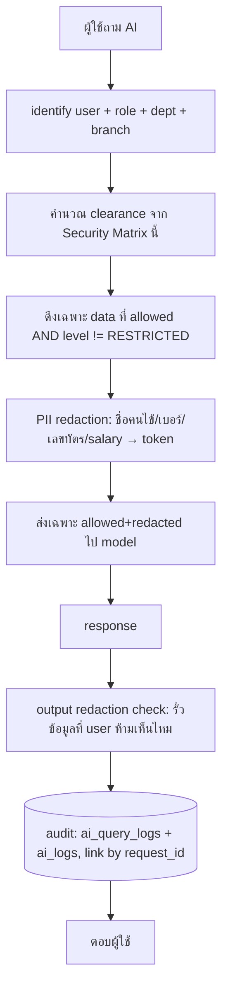

# 10 — Security Matrix (เมทริกซ์ความปลอดภัยและการจัดชั้นข้อมูล)

> **บริษัท:** Saduak Suay Mai PCL — เครือคลินิกเสริมความงาม + ทันตกรรม (แฟรนไชส์)
> **ระบบฐาน:** NEXUS OS (Next.js 16 `nexus-web` + Express/TS `nexus-api` + PostgreSQL บน Railway)
> **เอกสารชุด:** Enterprise Security Architecture / Data Classification
> **สถานะ:** PRODUCTION-READY — deny-by-default, enforced in BACKEND, บังคับใช้กับทุก API และทุก AI query
> **เวอร์ชันเอกสาร:** 1.0 | **เจ้าของ:** Chief Security Architect + Chief Data Architect

---

## 0. หลักการ (Governing Principles)

เอกสารนี้คือ **แหล่งความจริงเดียว (single source of truth)** สำหรับการจัดชั้นความปลอดภัยของข้อมูลทุกประเภทใน Saduak Suay Mai OS ทุกตาราง ทุก field ทุก API endpoint และทุก AI query **ต้อง** อ้างอิงเมทริกซ์นี้ในการตัดสินใจ allow/deny

หลักการบังคับ (ผูกกับ GLOBAL DESIGN RULES):

1. **Deny-by-default** — ถ้าไม่มีกฎอนุญาตอย่างชัดเจน = ปฏิเสธ ไม่มี implicit allow
2. **Backend-enforced** — การตัดสินสิทธิ์เกิดที่ `nexus-api` เท่านั้น **ไม่เคย** เชื่อ frontend; การซ่อนปุ่ม/เมนูใน `nexus-web` เป็นเพียง UX ไม่ใช่ security boundary
3. **4 Security Levels** — `BASIC` < `MEDIUM` < `HARD` < `RESTRICTED` (เป็น strict total order)
4. **PERMISSION = RBAC + ABAC + Data-Ownership** — ระดับชั้น (level) บอกว่า "ข้อมูลนี้อ่อนไหวแค่ไหน", ส่วน RBAC/ABAC/ownership บอกว่า "ใครเข้าได้บ้าง" ทั้งสองต้องผ่านพร้อมกัน (AND)
5. **AI = ผู้ใช้ชั้นสอง (second-class principal)** — AI **ไม่มีวันเห็นข้อมูลที่ผู้ใช้เจ้าของคำถามมองไม่เห็น** การจัดชั้นนี้ใช้กับ AI context ด้วยอย่างเคร่งครัด
6. **Audit ทุก decision** — ทุกการเข้าถึงข้อมูลระดับ `HARD`/`RESTRICTED` (สำเร็จหรือถูกบล็อก) ต้องลง `audit_log` แบบ append-only

> **[ASSUMPTION]** Saduak Suay Mai PCL อยู่ภายใต้ **PDPA (พ.ร.บ. คุ้มครองข้อมูลส่วนบุคคล พ.ศ. 2562)** ของประเทศไทย และข้อมูลสุขภาพ (medical/dental/patient) จัดเป็น **ข้อมูลอ่อนไหว (sensitive personal data) ตาม PDPA มาตรา 26** ซึ่งต้องมี **consent ที่ชัดแจ้ง (explicit consent)** — เมทริกซ์นี้บังคับให้เป็นเช่นนั้น

---

## 1. นิยาม 4 ระดับความปลอดภัย (The 4 Security Levels)

| Level | ชื่อไทย | ใครเห็นได้ (สรุป) | แนวคิด | Default scope |
|-------|---------|------------------|--------|---------------|
| **`BASIC`** | พื้นฐาน | **ทุกคนในบริษัท** (พนักงานที่ login แล้ว) | ความรู้ส่วนกลาง ไม่อ่อนไหว เผยแพร่ภายในได้ | Company-wide (ทั้ง `company_id`) |
| **`MEDIUM`** | ระดับแผนก | **สมาชิกในแผนก/สาขาที่เกี่ยวข้อง** + สายบังคับบัญชาขึ้นไป | ข้อมูลปฏิบัติงานเฉพาะแผนก | Department / Branch scoped |
| **`HARD`** | ระดับผู้บริหาร/HR | **เจ้าของข้อมูล + manager สายตรง + HR + owner/CEO** | ข้อมูลบุคคล/ผลงานที่กระทบบุคคล | Owner + management chain |
| **`RESTRICTED`** | จำกัดเฉพาะผู้ได้รับสิทธิ์ | **เฉพาะผู้ที่ได้รับ direct grant เท่านั้น** (ไม่มี role ใดได้มาโดยปริยาย แม้แต่ admin/CEO ต้อง grant) | ข้อมูลที่เปิดเผยผิดคน = ความเสียหายร้ายแรง/ผิดกฎหมาย | Explicit allow-list ต่อ resource |

### 1.1 Mapping กับ tier เดิมในโค้ด (Backward-Compatibility)

ระบบ NEXUS OS ปัจจุบันใช้ label `T0–T3` (คอลัมน์ `security_tier` ใน `audit_log`, `knowledge_items`, `data_dictionary` ฯลฯ และฟังก์ชัน `canViewTier()` ใน `backend/src/lib/encryption.ts`) เราจะ **ไม่ทิ้งของเดิม** แต่ map ให้ตรงกันเพื่อ migrate ได้เนียน:

| New Level (มาตรฐานใหม่) | Legacy `security_tier` | คอลัมน์ใหม่ที่บังคับ (NEW migration) |
|------------------------|------------------------|--------------------------------------|
| `BASIC` | `T0` / `T1` | `security_level = 'BASIC'` |
| `MEDIUM` | `T1` / `T2` | `security_level = 'MEDIUM'` |
| `HARD` | `T2` | `security_level = 'HARD'` |
| `RESTRICTED` | `T3` | `security_level = 'RESTRICTED'` |

> **NEW (migration ต้องทำ):** เพิ่มคอลัมน์ `security_level TEXT NOT NULL DEFAULT 'BASIC' CHECK (security_level IN ('BASIC','MEDIUM','HARD','RESTRICTED'))` ในทุก core table (ตาม GLOBAL RULE: ทุก core table ต้องมี `security_level`) คงคอลัมน์ `security_tier` เดิมไว้ชั่วคราวเพื่อ dual-write ระหว่าง migration แล้ว deprecate
>
> **ALREADY EXISTS:** `canViewTier(userRole, tier)` ใน `encryption.ts` (T2 → admin/finance/hr/it, T3 → admin/hr) — ตรรกะนี้ **ไม่พอ** สำหรับ `RESTRICTED` เพราะ `RESTRICTED` ต้อง direct-grant ไม่ใช่ role-based ต้องเขียน policy engine ใหม่ (ดู §6)

---

## 2. กฎการเข้าถึงต่อระดับ (Access Rules per Level)

> สัญลักษณ์: ✅ = อนุญาต (ถ้า RBAC+ABAC+ownership ผ่าน), ⚠️ = อนุญาตแบบมีเงื่อนไข/ต้อง reason, ❌ = ปฏิเสธเสมอ

### 2.1 ใครเข้าถึงได้ (Who-can-access)

| | `BASIC` | `MEDIUM` | `HARD` | `RESTRICTED` |
|---|---|---|---|---|
| พนักงานทั่วไป (staff) | ✅ | ✅ เฉพาะแผนก/สาขาตน | ✅ เฉพาะข้อมูลของตนเอง (self) | ❌ (เว้นได้ direct grant) |
| Manager แผนก | ✅ | ✅ ทั้งแผนกตน | ✅ ลูกทีมสายตรง | ❌ (เว้นได้ direct grant) |
| Department Head (role แผนก เช่น `medical`, `finance`) | ✅ | ✅ ทั้งแผนก | ✅ ทั้งแผนกตน | ❌ (เว้นได้ direct grant) |
| HR (`hr`) | ✅ | ⚠️ เฉพาะ HR-relevant | ✅ ทั้งบริษัท (HR scope) | ⚠️ เฉพาะ HR-investigation/contract ที่ได้ grant |
| Finance (`finance`) | ✅ | ⚠️ เฉพาะ finance-relevant | ✅ payroll/advances scope | ⚠️ เฉพาะ salary/payroll/tax ที่ได้ grant |
| CEO / Owner (`ceo`) | ✅ | ✅ | ✅ ทั้งบริษัท | ⚠️ ต้อง direct grant + reason (ไม่ได้มาฟรีจาก role) |
| IT (`it`) | ✅ | ⚠️ metadata เท่านั้น | ⚠️ metadata/structural ไม่เห็น content sensitive | ❌ content (เห็นได้แค่ key/ID เพื่อ ops, ไม่เห็น plaintext) |
| `admin` (super-user ในโค้ด) | ✅ | ✅ | ✅ | ⚠️ **ต้องถูก downgrade**: ปัจจุบัน admin short-circuit ทุก check — สำหรับ `RESTRICTED` ต้องบังคับ break-glass + grant (ดู §6.4) |
| **AI (ในนามผู้ใช้ X)** | ✅ ถ้า X เห็นได้ | ✅ ถ้า X เห็นได้ | ✅ ถ้า X เห็นได้ + ผ่าน redaction | ❌ **AI ไม่เคยได้ `RESTRICTED` เข้า prompt** แม้ X จะมี grant (ดู §5.3) |

> **สำคัญ:** `admin` ในโค้ดปัจจุบัน (`rbac.ts`: `if (r === 'admin') return true`) เป็น **hard super-user** ซึ่ง **ละเมิด** หลัก least-privilege สำหรับ `RESTRICTED` เป็น **TOP GAP** ที่ต้องปิด — ดู §6.4 Break-Glass

### 2.2 มาตรการควบคุมเสริม (Extra Controls per Level)

| มาตรการ | `BASIC` | `MEDIUM` | `HARD` | `RESTRICTED` |
|---------|:-------:|:--------:|:------:|:------------:|
| ต้อง login (JWT) | ✅ | ✅ | ✅ | ✅ |
| RBAC check (role) | ✅ | ✅ | ✅ | ✅ |
| ABAC check (department/branch/attribute) | — | ✅ | ✅ | ✅ |
| Data-ownership check (owner_id / management chain) | — | — | ✅ | ✅ |
| **Step-up auth (PIN / 2FA)** ก่อนเข้าถึง | — | — | ⚠️ สำหรับ export/bulk | ✅ **บังคับทุกครั้ง** |
| **Reason-required** (ต้องกรอกเหตุผลก่อนเปิด) | — | — | ⚠️ เฉพาะ cross-person | ✅ **บังคับ** (เก็บใน audit) |
| **Export restriction** | — | ⚠️ log export | ⚠️ approval + watermark | ✅ **ห้าม export โดยปริยาย**; ต้อง approval 2 ชั้น + watermark + DLP |
| Field-level encryption at rest | — | ⚠️ บาง field | ✅ PII fields | ✅ **ทุก field อ่อนไหว** (AES-256-GCM) |
| Audit ทุกการ view/search | — (log create/update) | ✅ | ✅ **view ทุกครั้ง** | ✅ **view ทุกครั้ง + ผู้อนุมัติ grant** |
| Consent gate (PDPA) | — | — | ⚠️ ถ้าเป็น personal data | ✅ สำหรับ patient/medical/dental |
| AI อ่านได้เข้า context | ✅ | ✅ (post-redaction) | ✅ (post-redaction, masked) | ❌ **บล็อกเด็ดขาด** |
| Retention / immutability บน audit | append-only | append-only | append-only + hash-chain | append-only + hash-chain + extended retention |

> **PIN vs 2FA:** **[ASSUMPTION]** ใช้ **TOTP 2FA** (authenticator app) สำหรับ role-level step-up (manager/HR/finance/CEO) และ **transaction PIN 6 หลัก** สำหรับการเปิด record `RESTRICTED` ราย item เพื่อความเร็วภาคหน้างานคลินิก ทั้งสองต้อง verify ที่ `nexus-api`
>
> **NEW (ต้องสร้าง):** ปัจจุบัน NEXUS OS **ไม่มี** MFA/PIN/login-lockout (ตาม inventory §5) ต้องเพิ่ม `mfa_enrollments`, `step_up_challenges`, `restricted_access_grants` (ดู §6)

---

## 3. เมทริกซ์การจัดชั้นข้อมูลหลัก (Master Data Classification Matrix)

ตารางนี้คือ **หัวใจของเอกสาร** — จัดชั้นข้อมูลทุกประเภทที่ระบุใน task พร้อมแหล่งเก็บใน NEXUS OS (สถานะ EXISTS/NEW), ผู้เข้าถึง, และมาตรการเสริม

> คอลัมน์ **Source table**: ระบุตารางจริงใน NEXUS OS และสถานะ — `EXISTS` (มีแล้ว) / `NEW` (ต้อง migrate)

| # | ประเภทข้อมูล (Data Type) | **Level** | Source table (สถานะ) | ใครเข้าถึงได้ (allow) | Extra controls |
|---|---------------------------|:---------:|----------------------|----------------------|----------------|
| **กลุ่ม A — ความรู้/นโยบายส่วนกลาง** |
| A1 | SOP / คู่มือปฏิบัติงาน | `BASIC` | `knowledge_items` (EXISTS, `category='SOP'`) | ทุกพนักงาน | อ่านได้ทุกคน; แก้ไขเฉพาะ owner แผนก; log create/update |
| A2 | FAQ / ถาม-ตอบภายใน | `BASIC` | `knowledge_items` (EXISTS) | ทุกพนักงาน | เหมือน A1; AI อ่านเข้า context ได้เต็มที่ |
| A3 | นโยบายบริษัท (policy/ประกาศ) | `BASIC` | `knowledge_items` (EXISTS, `category='policy'`) | ทุกพนักงาน | แก้ไขเฉพาะ CEO/HR/admin; versioned |
| A4 | Data Dictionary / taxonomy | `BASIC` | `data_dictionary` (EXISTS) | ทุกพนักงาน (`dictionary` module = ALL) | แก้ไขเฉพาะ admin/it |
| A5 | ความรู้ผลิตภัณฑ์/บริการคลินิก (ราคา promotion สาธารณะ) | `BASIC` | `knowledge_items` (EXISTS) | ทุกพนักงาน | — |
| **กลุ่ม B — รายงาน/KPI ระดับแผนก** |
| B1 | รายงานแผนก (department report) | `MEDIUM` | `work_logs` / `kpi_entries` (EXISTS) | สมาชิกแผนก + manager + CEO | ABAC: `department` ตรง; export → log |
| B2 | KPI ระดับแผนก/สาขา (aggregate) | `MEDIUM` | `kpi_entries` (EXISTS, มี `branch_code`) | แผนก/สาขาที่เป็นเจ้าของ + CEO/finance | ABAC branch+dept scope |
| B3 | ยอดขาย/ยอด telesales รายแผนก | `MEDIUM` | `deals`, `transactions` (EXISTS) | sales/operations + finance + CEO | ABAC dept; ตัวเลขรวมเท่านั้นที่ MEDIUM |
| B4 | ตารางเวร/กะ/attendance รายแผนก | `MEDIUM` | `work_shifts`, `time_attendance` (EXISTS) | manager แผนก + HR | self เห็นของตน (BASIC view ของตัวเอง) |
| B5 | สต็อก/คลังสินค้า รายสาขา | `MEDIUM` | `entities` / warehouse modules (EXISTS) | warehouse + operations + CEO | ABAC branch |
| B6 | Franchise audit (รายงานตรวจสาขาแฟรนไชส์) | `MEDIUM` → `HARD` ถ้ามีข้อค้นพบบุคคล | `franchise_audits` (EXISTS) | franchise + CEO | ยก HARD เมื่อมี finding ที่ระบุตัวบุคคล |
| **กลุ่ม C — ผลงาน/ประวัติพนักงานรายบุคคล** |
| C1 | KPI รายบุคคล (employee KPI) | `HARD` | `kpi_entries` (EXISTS) + `skill_scores` (EXISTS) | เจ้าของ (self) + manager สายตรง + HR + CEO | ownership; cross-person → reason-required |
| C2 | Performance review / ผลประเมิน | `HARD` | `skill_scores`, `skill_evidence` (EXISTS) | self + manager + HR | view-audit; AI evaluation แยก (ดู C8) |
| C3 | Manager note / บันทึกหัวหน้าถึงลูกน้อง | `HARD` | **NEW** `employee_notes` | manager ผู้เขียน + HR + CEO (**ไม่รวม subject** ถ้าเป็น confidential note) | reason-required; subject เห็นเฉพาะ note ประเภท feedback |
| C4 | ใบเตือน / warning letter | `HARD` | **NEW** `disciplinary_actions` | subject (self) + manager + HR + CEO | reason-required; export → HR approval |
| C5 | การเลื่อนตำแหน่ง / promotion | `HARD` | **NEW** `promotion_records` (เชื่อม `positions` EXISTS) | self + manager + HR + CEO | ก่อนประกาศ = RESTRICTED (draft); หลังประกาศ = HARD |
| **กลุ่ม D — ข้อมูลอ่อนไหวสูงสุด (RESTRICTED by default)** |
| D1 | **เงินเดือน / salary band** | `RESTRICTED` | `users.salary` (encrypted, EXISTS), `salary_history` (EXISTS) | finance + HR + CEO **เฉพาะที่ได้ grant**; self เห็นของตน | 2FA + reason + ห้าม export; AES-256-GCM; mask ตาม `maskField()` |
| D2 | **Payroll / payslip / รอบจ่าย** | `RESTRICTED` | `payroll_runs`, `payslips`, `payroll_items`, `payroll_periods` (EXISTS) | finance + HR (grant) + self (payslip ตน) | 2FA; export ต้อง dual-approval + watermark |
| D3 | **เงินเบิกล่วงหน้า (advances)** | `RESTRICTED` | `salary_advances` (EXISTS) | finance + HR (grant) + self | reason-required; audit ทุก view |
| D4 | **สัญญาจ้าง / contract** | `RESTRICTED` | **NEW** `employment_contracts` (เชื่อม `employee_profiles` EXISTS) | HR (grant) + CEO + self | 2FA; encrypted; ห้าม export raw; PDPA personal data |
| D5 | **ภาษี / tax (ภงด., wht)** | `RESTRICTED` | `payroll_items` (EXISTS, tax lines) + **NEW** `tax_documents` | finance (grant) + HR + self | encrypted; retention ตามกฎหมายภาษี (10 ปี) |
| D6 | **เวชระเบียน — Medical record** | `RESTRICTED` | `patients` (EXISTS, `*_encrypted`, `consent_*`) + **NEW** `medical_records` | medical staff ผู้รักษา (treating) + medical head; **ต้อง consent** | 2FA + reason + **consent gate**; PDPA ม.26; ห้าม export; AI ❌ |
| D7 | **เวชระเบียนทันตกรรม — Dental record** | `RESTRICTED` | **NEW** `dental_records` (mirror ของ `patients`) | dental staff ผู้รักษา + dental head; consent | เหมือน D6; แยก scope ทันตกรรม |
| D8 | **ข้อมูลคนไข้ (Patient PII)** ชื่อ/เบอร์/ที่อยู่ | `RESTRICTED` | `patients` (EXISTS, `name_encrypted`,`phone_encrypted`) | medical/dental treating + front-desk เฉพาะ booking scope (masked) | consent gate (`consent_given`); encrypted; front-desk เห็น masked เบอร์ |
| D9 | **HR investigation / สอบสวนวินัย** | `RESTRICTED` | **NEW** `hr_investigations` | HR investigator ที่ได้ grant + CEO เท่านั้น (**ไม่รวม subject ระหว่างสอบ**) | 2FA + reason + sealed; ห้าม export; legal hold |
| D10 | **AI evaluation / ผลประเมินโดย AI** | `RESTRICTED` | **NEW** `ai_evaluations` (เชื่อม `ai_logs` EXISTS) | HR + CEO เฉพาะ grant; subject เห็นได้หลัง human-review เท่านั้น | "Copilot not Autopilot": AI ห้ามเป็นผู้ตัดสินสุดท้าย; reason-required |
| D11 | **Executive note / บันทึกผู้บริหาร** | `RESTRICTED` | **NEW** `executive_notes` | เฉพาะ CEO + ผู้ที่ CEO grant รายคน | 2FA + ห้าม export; ไม่ปรากฏใน org-wide search; AI ❌ |
| D12 | Restricted financial (M&A, งบลับ, แผนแฟรนไชส์ลับ) | `RESTRICTED` | **NEW** `confidential_financials` | CEO + finance head (grant) | break-glass only |

### 3.1 หมายเหตุการจัดชั้นที่ต้องเข้าใจ (Classification Notes)

- **State-dependent classification (ชั้นเปลี่ยนตามสถานะ):** บางข้อมูลเปลี่ยนชั้นตาม lifecycle:
  - Promotion (C5): `draft/pending` = `RESTRICTED` → `announced` = `HARD` → ชื่อตำแหน่งใน org chart = `BASIC`
  - Franchise audit (B6): `MEDIUM` ปกติ → `HARD` เมื่อมี personal finding
  - AI evaluation (D10): `RESTRICTED` จนกว่า human reviewer จะ release ให้ subject
- **Aggregate vs row-level:** ตัวเลข **รวม (aggregate)** มักเป็น `MEDIUM` (เช่น "ยอดขายแผนก telesales เดือนนี้") แต่ **row-level ที่ระบุบุคคล** ยกชั้นเป็น `HARD`/`RESTRICTED` เสมอ — policy engine ต้องแยก query แบบ aggregate ออกจาก detail
- **Self-access exception:** เจ้าของข้อมูลเห็น **ของตนเอง** ได้แม้ data ชั้นสูง (เช่น พนักงานเห็น payslip ตน, KPI ตน) — นี่คือ data-ownership rule ไม่ใช่ role escalation
- **PDPA mapping:** D6/D7/D8 (medical/dental/patient) = **sensitive personal data (ม.26)** ต้อง explicit consent + lawful basis; D1–D5/D9 = **personal data (ม.24)** ต้อง legitimate interest + ความลับการจ้างงาน

---

## 4. การ map กับ RBAC roles ที่มีอยู่ (Role × Level Reachability)

จาก 13 roles ใน `rbac.ts` (`admin, ceo, operations, medical, dental, finance, hr, it, marketing, warehouse, franchise, sales, staff`) — ตารางนี้บอก **ชั้นสูงสุดที่แต่ละ role แตะได้โดยปริยาย** (ก่อน ABAC/ownership/grant):

| Role | สูงสุดที่แตะได้ (default) | RESTRICTED ที่อาจได้ (via grant) | หมายเหตุ |
|------|--------------------------|----------------------------------|----------|
| `staff` | `BASIC` + self-`HARD` | — | เห็น MEDIUM เฉพาะแผนกตน, HARD เฉพาะของตน |
| `operations` | `MEDIUM` (ops/support/personal-care/telesales) | — | sub-dept scoping |
| `sales` | `MEDIUM` (sales/deals) | — | |
| `marketing` | `MEDIUM` (campaigns) | — | |
| `warehouse` | `MEDIUM` (stock/purchasing) | — | |
| `franchise` | `MEDIUM`→`HARD` (audit findings) | — | |
| `medical` | `MEDIUM` (ops) | **D6/D8** medical+patient (treating + consent) | scope = คนไข้ที่ตนรักษา |
| `dental` | `MEDIUM` (ops) | **D7/D8** dental+patient (treating + consent) | scope = คนไข้ทันตกรรมที่ตนรักษา |
| `finance` | `HARD` (payroll/advances scope) | **D1/D2/D3/D5/D12** salary/payroll/tax | grant ต่อรอบจ่าย |
| `hr` | `HARD` (ทั้งบริษัท HR scope) | **D4/D9/D10** contract/investigation/AI-eval | grant ต่อ case |
| `ceo` | `HARD` (ทั้งบริษัท) | **D11 + ทุก RESTRICTED** ผ่าน break-glass + reason | ไม่ได้มาฟรี ต้อง grant ตน |
| `it` | metadata-only ทุกชั้น | — (เห็น structure ไม่เห็น plaintext) | สำหรับ ops/debug; content ❌ |
| `admin` | (ปัจจุบัน) ทุกชั้น | **ต้อง downgrade** → break-glass สำหรับ RESTRICTED | ดู §6.4 |

> **ALREADY EXISTS:** `MODULE_ACCESS` ใน `rbac.ts` ทำ module gating ระดับหน้า/เมนู — นี่คือ **layer 1 (route gating)** เท่านั้น **ยังขาด** layer 2 (row-level + level enforcement) ซึ่งต้องสร้างใหม่ (§6)

---

## 5. การบังคับใช้กับ AI (AI Enforcement of the Matrix)

AI ใน NEXUS OS (`ai-router.ts`, `ai-providers.ts`) ต้องเคารพเมทริกซ์นี้ **อย่างเข้มงวดกว่ามนุษย์** เพราะส่ง context ออกไปยัง external providers (OpenAI/Anthropic/Gemini/Typhoon)

### 5.1 หลัก: AI clearance = min(user clearance, AI policy)

```
AI_visible_data(user, query) =
    data WHERE security_level allowed_for(user)     -- ผู้ใช้เห็นได้
      AND security_level != 'RESTRICTED'            -- AI ไม่เคยได้ RESTRICTED แม้ user มี grant
      AND passed_redaction()                        -- ผ่าน PII redaction
```

### 5.2 Flow บังคับ (ตาม GLOBAL RULE — AI ไม่อ่าน DB ตรง)



### 5.3 กฎเด็ดขาดสำหรับ AI

1. **`RESTRICTED` = บล็อก 100%** — D1–D12 **ไม่มีวัน** เข้า prompt ของ external model แม้ผู้ใช้จะมี grant (เช่น HR ถาม AI สรุปผลสอบสวน → AI ตอบจาก metadata/ที่ redact แล้วเท่านั้น ไม่เห็นเนื้อหา sealed)
2. **`HARD` cross-person = mask** — ถ้า AI ต้องสรุป KPI ของหลายคน ต้อง mask ชื่อ → "พนักงาน #1234" ก่อนส่ง model
3. **Patient/medical/dental (D6–D8)** — แม้ medical staff เจ้าของถามเอง AI ก็ได้รับเฉพาะ **de-identified** summary (consent gate + ม.26)
4. **Output redaction** — ตรวจ response ก่อนแสดง: ถ้า model หลุดข้อมูลที่ผู้ใช้ห้ามเห็น → ตัดทิ้ง + log `blocked-access`
5. **AI evaluation (D10)** — AI สร้างผลประเมินได้ แต่ผล = `RESTRICTED`, ห้ามเป็นผู้ตัดสินสุดท้าย (decision right = `human`/`suggest` ไม่ใช่ `auto`)

> **NEW (TOP GAP จาก inventory §3):** ปัจจุบัน `buildOrgContext` ส่ง full org context + raw prompt ไป external provider **โดยไม่ redact** (`sanitize.ts` ลบแค่ `password_hash`, ตัว masking ใน `encryption.ts` ไม่อยู่ใน AI path) — ต้องเพิ่ม **redaction layer** + ตาราง `ai_query_logs` (prompt/response/provider/model/tokens/decision/grounded/redaction_status, linked by `request_id`) ก่อน go-live

---

## 6. กลไกบังคับใช้ใน Backend (Enforcement Mechanics — สิ่งที่ต้องสร้าง)

### 6.1 Policy Engine (NEW — แกนกลาง)

สร้าง `backend/src/lib/policy-engine.ts` เป็นจุดเดียวที่ตัดสิน allow/deny ทุก API + AI query:

```typescript
// pseudo-signature
type Decision = { allow: boolean; reason: string; requireStepUp?: boolean; requireReason?: boolean; maskFields?: string[] }

function authorize(input: {
  actor: { userId: string; role: Role; departmentId: string; branchId?: string }
  action: 'view'|'search'|'create'|'update'|'delete'|'export'|'ai_query'
  resource: { table: string; id?: string; securityLevel: SecurityLevel; ownerId?: string; departmentId?: string; branchId?: string }
  context: { stepUpVerified?: boolean; reasonProvided?: string; grantId?: string }
}): Decision
// ลำดับ: deny-by-default → RBAC → ABAC(dept/branch) → ownership → level-specific(grant/2FA/reason) → maskFields
```

ทุก controller เรียก `authorize()` **ก่อน** แตะ DB; ทุก AI ดึง data เรียก `authorize({action:'ai_query'})` ต่อ row

### 6.2 ตารางใหม่ที่ต้อง migrate (NEW)

| ตาราง (NEW) | หน้าที่ |
|-------------|--------|
| `restricted_access_grants` | direct grant ต่อ resource สำหรับ `RESTRICTED` (`grantee_id, resource_table, resource_id, granted_by, reason, expires_at, revoked_at`) |
| `mfa_enrollments` | TOTP secret ต่อ user (encrypted) |
| `step_up_challenges` | บันทึก 2FA/PIN challenge + ผลต่อ session |
| `ai_query_logs` | prompt/response/provider/model/tokens/latency/decision/grounded/redaction_status, FK `request_id` → `audit_log` |
| `consent_logs` | บันทึก consent คนไข้ (เสริม `patients.consent_*`) |
| `login_logs` | auth event/failure (ปัจจุบันไม่ถูก log) |
| `file_access_logs` | trail การ view/download `user_files` |
| `permission_change_logs` | การแก้ `permission_groups`/`restricted_access_grants` |
| `employee_notes`, `disciplinary_actions`, `promotion_records`, `employment_contracts`, `tax_documents`, `medical_records`, `dental_records`, `hr_investigations`, `ai_evaluations`, `executive_notes`, `confidential_financials` | data tables ของ C3–D12 |

ทุกตารางใหม่มีคอลัมน์มาตรฐาน (ตาม GLOBAL RULE): `id, company_id, created_at, updated_at, deleted_at, created_by, updated_by, deleted_by, is_active, version, security_level` + FK/UNIQUE/CHECK/composite index

### 6.3 Audit hooks ต่อ level

- `BASIC`: log create/update/delete (ไม่ต้อง log every view)
- `MEDIUM`: log + view/search
- `HARD`/`RESTRICTED`: log **ทุก action รวม view** + `before_state`/`after_state` JSON + `ip`/`user_agent`/`request_id`/`session_id` + `failure_reason` เมื่อ blocked + hash-chain (`prev_hash`) เพื่อ tamper-evidence

> **NEW (TOP GAP):** `audit_log` ปัจจุบันไม่มี before/after, ไม่มี ip/ua/request_id, เขียนแบบ fire-and-forget (`writeAudit()` swallow error) — สำหรับ `HARD`/`RESTRICTED` การเขียน audit **ต้องสำเร็จก่อน** จึงคืน data (write-ahead audit) ไม่ใช่ best-effort

### 6.4 Break-Glass (สำหรับ admin/CEO เข้าถึง RESTRICTED)

`RESTRICTED` ไม่มี role ใดได้โดยปริยาย แม้ `admin`:

1. ผู้ขอกด "break-glass" → กรอก reason → ผ่าน 2FA
2. ระบบสร้าง `restricted_access_grants` แบบ `expires_at = now()+15min`, single-resource
3. แจ้งเตือน owner/CEO ทันที (real-time) + log `permission-change`
4. ทุก action ในช่วง break-glass ติด flag `break_glass=true` ใน audit
5. **[ASSUMPTION]** review break-glass ทุกครั้งโดย CEO/DPO ภายใน 24 ชม.

> **ต้องปิด GAP:** `rbac.ts` `if (r === 'admin') return true` ต้องถูกแก้ให้ **ไม่ short-circuit** สำหรับ resource ที่ `security_level='RESTRICTED'` — บังคับผ่าน break-glass เท่านั้น

---

## 7. Decision Table สรุป (Quick-Reference สำหรับ implementers)

| ถ้า resource level = | และ actor = | และ scope ตรง? | step-up? | reason? | grant? | → ผล |
|----------------------|-------------|----------------|----------|---------|--------|------|
| `BASIC` | any authenticated | — | — | — | — | **ALLOW** |
| `MEDIUM` | role ตรง module | dept/branch ตรง | — | — | — | **ALLOW** |
| `MEDIUM` | role ตรง | dept ไม่ตรง | — | — | — | **DENY** |
| `HARD` | self | own record | — | — | — | **ALLOW** |
| `HARD` | manager/HR/CEO | ลูกทีม/scope ตรง | — | ✅ (cross-person) | — | **ALLOW** (log+reason) |
| `HARD` | manager | นอก scope | — | — | — | **DENY** |
| `RESTRICTED` | finance/hr/ceo | — | ✅ 2FA | ✅ | ✅ active grant | **ALLOW** (full audit) |
| `RESTRICTED` | finance/hr/ceo | — | ❌ ไม่ verify | — | — | **DENY** (step-up required) |
| `RESTRICTED` | finance/hr/ceo | — | ✅ | ✅ | ❌ ไม่มี grant | **DENY** (no grant) |
| `RESTRICTED` | admin | — | break-glass | ✅ | auto-grant 15m | **ALLOW** (break-glass flag) |
| **any** | **AI (in name of user)** | — | — | — | — | **ALLOW if level≤HARD & redacted; DENY if RESTRICTED** |

---

## 8. มาตรการ Export & DLP ต่อระดับ (Export Restriction Matrix)

| Level | Export อนุญาต? | รูปแบบที่ได้ | เงื่อนไข |
|-------|----------------|-------------|----------|
| `BASIC` | ✅ | CSV/PDF | log export action |
| `MEDIUM` | ✅ | CSV/PDF (dept scope) | log + watermark (user+timestamp) |
| `HARD` | ⚠️ มีเงื่อนไข | PDF only | manager/HR approval + watermark + log + จำกัดจำนวนแถว |
| `RESTRICTED` | ❌ ปฏิเสธโดยปริยาย | (ปกติ block) | ต้อง **dual-approval (owner+CEO)** + 2FA + watermark + DLP scan + บันทึก `export` ใน audit + แจ้ง DPO |

> **[ASSUMPTION]** bulk export ของ patient/payroll (D1–D8) ต้องผ่าน DPO sign-off เสมอ และห้าม export ไปยังอุปกรณ์นอก allow-list

---

## 9. สรุป Gaps ที่ต้องปิดก่อน Production (Action Items)

| # | Gap (จาก inventory) | สิ่งที่เมทริกซ์นี้ต้องการ | สถานะ |
|---|---------------------|--------------------------|-------|
| 1 | ไม่มี `security_level` column 4-ระดับ | เพิ่มทุก core table + map จาก `security_tier` | **NEW migration** |
| 2 | `admin` short-circuit ทุก check | downgrade สำหรับ `RESTRICTED` → break-glass | **NEW (แก้ `rbac.ts`)** |
| 3 | ไม่มี policy engine กลาง | สร้าง `policy-engine.ts` (RBAC+ABAC+ownership+level) | **NEW** |
| 4 | ไม่มี direct-grant model | `restricted_access_grants` | **NEW** |
| 5 | ไม่มี MFA/PIN/step-up | `mfa_enrollments`, `step_up_challenges` | **NEW** |
| 6 | AI ส่ง context ไม่ redact | redaction layer ใน AI path + บล็อก RESTRICTED | **NEW** |
| 7 | `audit_log` ไม่มี before/after, ip/ua, ไม่ append-only | structured + write-ahead + hash-chain สำหรับ HARD/RESTRICTED | **NEW (ขยาย schema)** |
| 8 | ไม่มี `ai_query_logs`, `consent_logs`, `login_logs`, `file_access_logs`, `permission_change_logs` | สร้างทั้งหมด, link by `request_id` | **NEW** |
| 9 | ไม่มี soft-delete/versioning | เพิ่ม `deleted_at`/`version` ทุกตาราง | **NEW** |
| 10 | export ไม่มี DLP/watermark/approval | บังคับตาม §8 | **NEW** |

---

## ภาคผนวก — Machine-readable Classification (JSON)

ใช้ seed `data_dictionary` / policy config ได้โดยตรง:

```json
{
  "security_levels": ["BASIC", "MEDIUM", "HARD", "RESTRICTED"],
  "level_legacy_map": { "BASIC": ["T0","T1"], "MEDIUM": ["T1","T2"], "HARD": ["T2"], "RESTRICTED": ["T3"] },
  "classifications": [
    { "code": "A1", "data": "SOP", "level": "BASIC", "table": "knowledge_items", "status": "EXISTS", "ai_context": true },
    { "code": "A2", "data": "FAQ", "level": "BASIC", "table": "knowledge_items", "status": "EXISTS", "ai_context": true },
    { "code": "A3", "data": "policy", "level": "BASIC", "table": "knowledge_items", "status": "EXISTS", "ai_context": true },
    { "code": "B1", "data": "department_report", "level": "MEDIUM", "table": "work_logs", "status": "EXISTS", "ai_context": true, "scope": "department" },
    { "code": "B2", "data": "department_kpi", "level": "MEDIUM", "table": "kpi_entries", "status": "EXISTS", "ai_context": true, "scope": "department|branch" },
    { "code": "C1", "data": "employee_kpi", "level": "HARD", "table": "kpi_entries", "status": "EXISTS", "ai_context": "masked", "ownership": true },
    { "code": "C2", "data": "performance_review", "level": "HARD", "table": "skill_scores", "status": "EXISTS", "ai_context": "masked" },
    { "code": "C3", "data": "manager_note", "level": "HARD", "table": "employee_notes", "status": "NEW", "reason_required": true },
    { "code": "C4", "data": "warning", "level": "HARD", "table": "disciplinary_actions", "status": "NEW", "reason_required": true },
    { "code": "C5", "data": "promotion", "level": "HARD", "table": "promotion_records", "status": "NEW", "state_dependent": true },
    { "code": "D1", "data": "salary", "level": "RESTRICTED", "table": "users.salary|salary_history", "status": "EXISTS", "ai_context": false, "step_up": true, "reason_required": true, "export": "deny" },
    { "code": "D2", "data": "payroll", "level": "RESTRICTED", "table": "payslips|payroll_runs", "status": "EXISTS", "ai_context": false, "step_up": true, "export": "deny" },
    { "code": "D3", "data": "salary_advance", "level": "RESTRICTED", "table": "salary_advances", "status": "EXISTS", "ai_context": false, "step_up": true },
    { "code": "D4", "data": "contract", "level": "RESTRICTED", "table": "employment_contracts", "status": "NEW", "ai_context": false, "step_up": true, "export": "deny" },
    { "code": "D5", "data": "tax", "level": "RESTRICTED", "table": "tax_documents", "status": "NEW", "ai_context": false, "retention_years": 10 },
    { "code": "D6", "data": "medical_record", "level": "RESTRICTED", "table": "medical_records", "status": "NEW", "ai_context": false, "consent_required": true, "pdpa": "art26" },
    { "code": "D7", "data": "dental_record", "level": "RESTRICTED", "table": "dental_records", "status": "NEW", "ai_context": false, "consent_required": true, "pdpa": "art26" },
    { "code": "D8", "data": "patient_pii", "level": "RESTRICTED", "table": "patients", "status": "EXISTS", "ai_context": false, "consent_required": true, "encrypted": true },
    { "code": "D9", "data": "hr_investigation", "level": "RESTRICTED", "table": "hr_investigations", "status": "NEW", "ai_context": false, "step_up": true, "sealed": true },
    { "code": "D10", "data": "ai_evaluation", "level": "RESTRICTED", "table": "ai_evaluations", "status": "NEW", "ai_context": false, "decision_right": "human" },
    { "code": "D11", "data": "executive_note", "level": "RESTRICTED", "table": "executive_notes", "status": "NEW", "ai_context": false, "owner_only": "ceo" }
  ]
}
```

---

*เอกสารนี้ผูกพันกับ: `00-overview`, `06-rbac-abac`, `07-audit-log`, `08-ai-access-control` (เลขเอกสารตามชุด architecture). ทุกการเปลี่ยนชั้นข้อมูลต้องผ่าน change-control + อัปเดต `data_dictionary` + version เอกสารนี้.*
