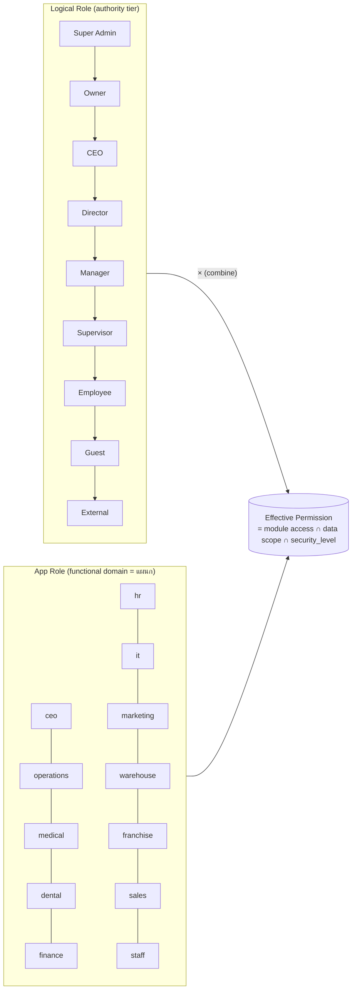
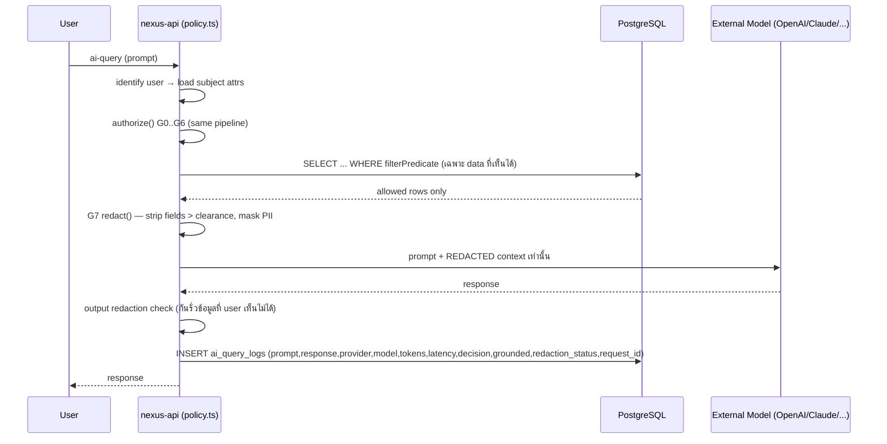

# 11 — Permission Matrix (เมทริกซ์สิทธิ์: RBAC × ABAC × Data-Ownership)

> **องค์กร:** Saduak Suay Mai PCL — เครือคลินิกความงาม + ทันตกรรม แบบแฟรนไชส์ในประเทศไทย
> **ระบบฐาน:** NEXUS OS (Next.js 16 + Express + PostgreSQL บน Railway — `nexus-web`, `nexus-api`, Postgres; deploy ด้วย `railway up` ราย service ไม่ใช่ GitHub auto-deploy)
> **ขอบเขตเอกสาร:** นิยาม **9 logical roles** (Super Admin → External) × **actions** × **modules** เป็น matrix, ชุด **ABAC attributes** ที่ต้องตรวจ, **combined decision pipeline (deny-by-default)**, และ **mapping 9 logical roles → 13 app roles** ที่มีจริงใน `backend/src/lib/rbac.ts`
> **มาตรฐาน:** Production-grade · deny-by-default · **RBAC + ABAC + Data-Ownership** · enforce ที่ **Backend** ทุก API และทุก **AI query** · **Append-only Audit Log** · AI ห้ามอ่าน DB ตรง
> **ภาษา:** ไทย narrative + English technical identifiers ตามสไตล์องค์กร

---

## 0. วิธีอ่านเอกสารนี้ (How to Read This Document)

เอกสารนี้เป็น **single source of truth ของ authorization** ของ NEXUS OS ทั้งระบบ แบ่งเป็น 3 ชั้นที่ทำงานร่วมกัน **และต้องผ่านครบทั้ง 3 ชั้นแบบ AND** ก่อนอนุญาตทุก request:

1. **RBAC (Role-Based)** — "role นี้แตะ module/action นี้ได้ไหม" → ตอบ *ประเภท* การกระทำ (coarse-grained)
2. **ABAC (Attribute-Based)** — "row/record นี้อยู่ใน scope ของ user คนนี้ไหม" (company/branch/department/sub-department/position/ownership/security_level) → ตอบ *ขอบเขตข้อมูล* (fine-grained, row-level)
3. **Data-Ownership** — "user เป็นเจ้าของ record นี้ หรือมีความสัมพันธ์เชิงสายงานกับเจ้าของไหม" → override/narrow scope ในระดับ record

> **กฎเหล็ก:** ทั้งสามชั้น enforce ที่ **Backend เท่านั้น** (middleware + policy engine + query predicate) — frontend gating (`MODULE_ACCESS` ที่ฝั่ง Next.js) เป็นแค่ **UX hint** ไม่ใช่ security boundary และจะ "ถูกตรวจซ้ำ" เสมอที่ API

### 0.1 นิยาม Security Level (4 ระดับ — บังคับใช้ทั้งเอกสาร)

| ระดับ | ค่าในระบบ | ใครเห็น (scope ตั้งต้น) | ตัวอย่างข้อมูล |
|---|---|---|---|
| **BASIC** | `BASIC` (legacy `T0`/`T1`) | ทุกคนที่ authenticated (ในบริษัทเดียวกัน) | SOP สาธารณะ, ประกาศ, `data_dictionary`, todos ของตน, `knowledge_items` ทั่วไป |
| **MEDIUM** | `MEDIUM` (legacy `T2`) | คนในแผนก/sub-department เดียวกัน (ABAC department scope) | KPI แผนก, `work_logs` แผนก, ตารางเวร, campaign ภายใน |
| **HARD** | `HARD` (legacy `T2`+) | owner / manager / HR / Finance owner-tier | `salary_advances`, payroll aggregate, deals มูลค่าสูง, vendor contract |
| **RESTRICTED** | `RESTRICTED` (legacy `T3`) | **direct grant เท่านั้น** — ห้าม inherit จาก department scope | Medical/Dental/Patient PII, Salary/Payroll/Contract/Tax รายคน, HR investigation, AI evaluation, Executive notes |

> **กฎตายตัว (Global Design Rules):** Medical/Dental/Patient records · Salary/Payroll/Contract/Tax · HR investigation · AI evaluation · Executive notes = **RESTRICTED by default** เสมอ
> **Mapping จาก legacy:** วันนี้โค้ดใช้ `canViewTier()` กับ tier `T0`–`T3` (`backend/src/lib/encryption.ts`) — เอกสารนี้กำหนด mapping `T0/T1→BASIC, T2→MEDIUM/HARD, T3→RESTRICTED` และเสนอ migration ให้ทุก core table มีคอลัมน์ `security_level TEXT NOT NULL DEFAULT 'BASIC' CHECK (security_level IN ('BASIC','MEDIUM','HARD','RESTRICTED'))` แทน label `security_tier` แบบเดิม **[NEW]**

### 0.2 สถานะ Grounding กับ NEXUS OS ปัจจุบัน (EXISTS vs NEW)

| องค์ประกอบ | สถานะวันนี้ | ที่มา (grounding) |
|---|---|---|
| 13 system roles | **EXISTS** | `rbac.ts` `ROLES = [admin, ceo, operations, medical, dental, finance, hr, it, marketing, warehouse, franchise, sales, staff]` |
| `MODULE_ACCESS` (~45 module keys) | **EXISTS** | `rbac.ts` — role → module array |
| `requireRole(...roles)` / `requireModule(module)` | **EXISTS** | `backend/src/middleware/rbac.ts` (admin bypass ใน `requireRole`) |
| `permission_groups` / `user_permission_groups` overlay | **EXISTS** | `nexus-hr-schema.ts` + `user-permissions.ts` (`getUserModules` = role defaults ∪ group modules) |
| `MANAGER_ROLES` (ทุก role ยกเว้น staff) | **EXISTS** | `middleware/rbac.ts` |
| ABAC `departmentScope(user)` (null=full org สำหรับ admin/hr) | **EXISTS (ad-hoc)** | `backend/src/lib/departments.ts` |
| `canReviewWorkLog(viewer, log)` (same-dept + not-self) | **EXISTS (ad-hoc)** | `departments.ts` |
| Tier masking `canViewTier` / `maskField` / `sanitizeUserForRole` | **EXISTS (เฉพาะ salary)** | `encryption.ts` |
| Org hierarchy `org_units` (level 1–3) / `positions` / `employee_profiles` | **EXISTS (ข้อมูล แต่ไม่ wired เข้า authz)** | `nexus-hr-schema.ts`, `hr-init.ts` |
| `branches` table | **EXISTS (migration v8)** | ยังไม่ใช้ใน permission check |
| **Central Policy Engine** (`policy.ts` — รวม RBAC+ABAC+ownership) | **NEW (migration)** | เสนอในเอกสารนี้ ส่วนที่ 5 |
| คอลัมน์ `data_owner_id` / `branch_id` / `department_id` (FK) / `security_level` ทุก core table | **NEW (migration)** | วันนี้ membership เป็น free-text `users.department` |
| `permission_grants` (direct RESTRICTED grant) + `permission_change_logs` | **NEW (migration)** | สำหรับ RESTRICTED + audit |
| Row-Level Security (Postgres RLS) ราย tenant | **NEW (migration)** | วันนี้ใช้ hand-written `company_id = $1` |

> **[ASSUMPTION]** ชื่อบุคคล, headcount, salary band, รายชื่อสาขา, KPI target/สูตร, SLA ตัวเลข — เป็น **[ASSUMPTION]** ที่สมจริงสำหรับเครือคลินิกความงาม+ทันตกรรมในไทย เอกสารนี้อ้างถึง **ตำแหน่ง/role** ไม่ใช่ชื่อจริง

---

## 1. 9 Logical Roles — นิยามและขอบเขต

NEXUS OS วันนี้มี **13 app roles** ที่ผูก 1:1 กับแผนก (department = role) ซึ่งดีต่อ module gating แต่ **ไม่สื่อระดับอำนาจ (seniority/authority)** — เช่น `medical` หนึ่ง role ครอบทั้งหมอใหญ่และผู้ช่วยพยาบาล เอกสารนี้จึงนิยาม **9 logical roles** เป็น *authority tier* ที่ตั้งฉาก (orthogonal) กับ 13 app roles แล้ว combine กันใน policy engine

| # | Logical Role | ไทย | ขอบเขตอำนาจ (authority) | Data scope ตั้งต้น | สูงสุดถึง security_level |
|---|---|---|---|---|---|
| 1 | **Super Admin** | ผู้ดูแลระบบสูงสุด | break-glass / platform ops; ตั้งค่าระบบ, impersonate, จัดการ tenant | ทุก company (cross-tenant) | RESTRICTED (มี audit + justification บังคับ) |
| 2 | **Owner** | เจ้าขององค์กร | เจ้าของ tenant; เห็นทุกอย่างในบริษัทตน, อนุมัติขั้นสูงสุด | ทั้ง company ของตน | RESTRICTED |
| 3 | **CEO** | ประธานเจ้าหน้าที่บริหาร | สั่งการข้ามแผนก, อนุมัติงบ/นโยบาย, executive notes | ทั้ง company | RESTRICTED (เฉพาะ business; medical PII = HARD ผ่าน grant) |
| 4 | **Director** | ผู้อำนวยการสายงาน | คุมหลายแผนกในสายงาน (เช่น Operations รวม 3 sub-unit) | หลาย department ในสาย | HARD; RESTRICTED ผ่าน direct grant |
| 5 | **Manager** | ผู้จัดการแผนก | คุม 1 department/branch, อนุมัติ leave/OT/advance, review work | department + sub-department ของตน | HARD ในแผนกตน |
| 6 | **Supervisor** | หัวหน้าทีม/หัวหน้าเวร | คุม sub-department/team/unit, มอบหมายงาน, review งานทีม (ไม่อนุมัติเงิน) | sub-department / team ของตน | MEDIUM; HARD เฉพาะ record ที่ตน own |
| 7 | **Employee** | พนักงาน | ทำงานในขอบเขตตน, เห็นข้อมูลตน + ข้อมูลแผนก MEDIUM | own records + department BASIC/MEDIUM | MEDIUM (เฉพาะ scope ตน) |
| 8 | **Guest** | ผู้ใช้ชั่วคราว/บัญชี read-only | อ่านเฉพาะ BASIC ที่ระบุ, ไม่มีสิทธิ์เขียน | จำกัดเฉพาะ resource ที่ grant | BASIC |
| 9 | **External** | บุคคลภายนอก (แฟรนไชส์/vendor/คนไข้ผ่าน portal) | เห็นเฉพาะ record ที่ตนเป็นเจ้าของผ่าน relationship | own external records เท่านั้น | BASIC (own data); RESTRICTED ของตนเองผ่าน consent |

> **หลักการ:** logical role ไม่ใช่คอลัมน์เดียวใน DB แต่เป็น **ผลลัพธ์ที่คำนวณจาก** `(app_role, position.level, org_unit.level, is_department_head, is_owner)` — ดูสูตรในส่วนที่ 3.3

---

## 2. Mapping: 9 Logical Roles → 13 App Roles (ที่มีจริง)

นี่คือหัวใจของการ "ground" เข้ากับโค้ดจริง — logical role เป็น **authority tier**, app role เป็น **functional domain (แผนก)** ทั้งสองคูณกันเป็น effective permission

### 2.1 ตาราง Mapping หลัก

| Logical Role | App role(s) ใน `ROLES` | เงื่อนไขเพิ่ม (ABAC) | หมายเหตุ migration |
|---|---|---|---|
| **Super Admin** | `admin` | ไม่มี (god-mode) — แต่เพิ่ม justification + audit บังคับ | `admin` วันนี้ short-circuit ทุก check ใน `requireRole` และ `getUserModules` (`*`) — **NEW:** หุ้มด้วย break-glass + mandatory audit |
| **Owner** | `admin` หรือ `ceo` + flag `is_owner=true` | `users.is_owner = true` **[NEW column]** | วันนี้ owner ใช้ `admin`; แยก flag เพื่อกัน Super Admin (platform) ออกจาก Owner (tenant) |
| **CEO** | `ceo` | `position.level = 'C_LEVEL'` | module `ceo`, `feasibility`, `readiness` = `['admin','ceo']` (EXISTS ใน `MODULE_ACCESS`) |
| **Director** | `operations`,`medical`,`dental`,`finance`,`hr`,`it`,`marketing`,`warehouse`,`franchise` | `position.level = 'DIRECTOR'` **AND** `org_unit.level ≤ 2` (คุมทั้ง department + sub-units) | Director ของ Operations เห็น Customer Support-Admin + Personal Care + Telesales |
| **Manager** | app role เดียวกับแผนก | `is_department_head = true` **OR** `position.level = 'MANAGER'` | `departments.head_user_id` (EXISTS) → ใช้ derive `is_department_head` |
| **Supervisor** | app role เดียวกับแผนก | `position.level = 'SUPERVISOR'` **AND** ผูก `org_unit.level = 3` (sub-unit) | Supervisor ของ Telesales เห็นเฉพาะ Telesales |
| **Employee** | app role เดียวกับแผนก (รวม `sales`, `staff`) | `position.level IN ('STAFF','ASSISTANT')` | `staff` วันนี้เห็นเฉพาะ module `staff`/ALL — map เป็น Employee tier ต่ำสุดในแผนก |
| **Guest** | `staff` (จำกัด) **หรือ** **NEW** role `guest` | `users.account_type = 'guest'` **[NEW]** + grant ราย resource | วันนี้ไม่มี read-only tier — เสนอเพิ่ม `guest` |
| **External** | **NEW** role `external` | `users.account_type = 'external'` **[NEW]** + `relationship_to_data` | แฟรนไชส์/vendor/patient-portal; ผูกผ่าน `entities`/`franchise_audits`/`patients` |

> **App roles ที่ไม่ปรากฏเป็น logical role แยก:** `sales` (เป็น Employee/Supervisor tier ของสาย Operations-Telesales หรือ standalone), `it` (Director/Manager tier ของแผนก IT แต่ **ไม่ใช่** Super Admin — IT ดูแล module แต่ไม่ใช่ break-glass tenant ops โดยอัตโนมัติ)

### 2.2 ความสัมพันธ์เชิงภาพ (Logical × App = Effective)



> **อ่านว่า:** "ผู้จัดการแผนกการเงิน" = logical `Manager` × app `finance` → เห็น module `finance/payroll/advances/reports` (จาก `MODULE_ACCESS`) **แต่จำกัด scope** เฉพาะ row ที่ `department_id = แผนกการเงิน` และ approve ได้ถึง security_level `HARD` ในแผนกตน

---

## 3. ABAC Attributes — ชุด attribute ที่ต้องตรวจทุก request

ทุก authorization decision ประเมินจาก **subject attributes** (จาก JWT + `users` row, โหลดทุก request ใน `authMiddleware`) เทียบกับ **resource attributes** (จาก row ที่กำลังจะแตะ)

### 3.1 Subject Attributes (ของผู้ใช้ — จาก `req.user`)

| Attribute | ที่มา | สถานะ | คำอธิบาย |
|---|---|---|---|
| `company_id` | JWT + `users.company_id` | **EXISTS** | tenant boundary — ทุก query ต้องมี predicate นี้ |
| `app_role` | `users.role` | **EXISTS** | 1 ใน 13 roles → ใช้กับ RBAC |
| `logical_role` | computed (ส่วน 3.3) | **NEW** | authority tier |
| `department_id` | `users.department` → FK `departments.id` | **EXISTS (free-text) → NEW (FK)** | วันนี้เป็น string; migration เป็น `department_id` |
| `sub_department_id` | `employee_profiles.org_unit_id` (level 3) | **EXISTS (ไม่ wired)** | sub-unit เช่น Telesales |
| `position_id` / `position.level` | `employee_profiles.position_id` → `positions` | **EXISTS (ไม่มี level)** | **NEW:** เพิ่ม `positions.level` (C_LEVEL/DIRECTOR/MANAGER/SUPERVISOR/STAFF/ASSISTANT) |
| `branch_id` | `users.branch_id` → `branches` | **NEW (column)** | สาขาที่สังกัด (สำหรับแฟรนไชส์/หลายสาขา) |
| `employee_id` | `users.id` | **EXISTS** | ใช้กับ ownership / "self" check |
| `is_department_head` | derive จาก `departments.head_user_id` | **EXISTS (derive)** | true ⇒ Manager tier |
| `is_owner` | `users.is_owner` | **NEW** | แยก Owner ออกจาก Super Admin |
| `account_type` | `users.account_type` | **NEW** | `internal` / `guest` / `external` |
| `security_clearance` | สูงสุดที่ user เข้าถึงได้ตาม tier | **EXISTS (เฉพาะ salary)** | จาก `canViewTier`; ขยายเป็น 4 ระดับ |
| `direct_grants[]` | `permission_grants` ของ user | **NEW** | สำหรับ RESTRICTED (direct grant only) |

### 3.2 Resource Attributes (ของ record — จาก row เป้าหมาย)

| Attribute | คำอธิบาย | สถานะ |
|---|---|---|
| `company_id` | tenant เจ้าของ record | **EXISTS** (เกือบทุกตาราง) |
| `branch_id` | สาขาเจ้าของ record | **NEW** (core tables) |
| `department_id` | แผนกเจ้าของ record | **NEW** (FK; วันนี้เป็น string ใน work_logs/kpi_entries) |
| `sub_department_id` | sub-unit เจ้าของ | **NEW** |
| `data_owner_id` | "เจ้าของข้อมูล" (เช่น คนไข้, ลูกค้า, พนักงานที่ payslip เป็นของเขา) | **NEW** (ต่างจาก `created_by`) |
| `created_by` | คนสร้าง row | **PARTIAL** (มีบางตาราง) |
| `security_level` | BASIC/MEDIUM/HARD/RESTRICTED | **NEW** (แทน `security_tier` label) |
| `is_active` / `deleted_at` | soft-delete state | **NEW** (วันนี้ hard-delete CASCADE) |

> **`data_owner_id` ≠ `created_by`:** payslip ของพนักงาน A สร้างโดย HR (`created_by = HR`) แต่ **เจ้าของข้อมูลคือพนักงาน A** (`data_owner_id = A`) → A เห็น payslip ตนได้ (ownership) แต่เพื่อนร่วมแผนกเห็นไม่ได้ (RESTRICTED)

### 3.3 `relationship_to_data` — มิติความสัมพันธ์ (ABAC ขั้นสำคัญ)

ค่า enum ที่ policy engine คำนวณ ณ runtime ระหว่าง subject กับ resource:

| ค่า | นิยาม | ตัวอย่าง |
|---|---|---|
| `OWNER` | `subject.employee_id = resource.data_owner_id` | พนักงานเปิด payslip ของตน |
| `CREATOR` | `subject.employee_id = resource.created_by` | คนกรอก work_log เปิดของตน |
| `SAME_SUBUNIT` | `subject.sub_department_id = resource.sub_department_id` | Telesales เห็น lead ทีม Telesales |
| `SAME_DEPARTMENT` | `subject.department_id = resource.department_id` | คนในแผนกการตลาดเห็น campaign แผนก |
| `MANAGES_OWNER` | subject เป็นหัวหน้าสายของ `data_owner_id` (ผ่าน org tree) | Manager เห็น work_log ลูกทีม (แต่ **ไม่ใช่ของตน** — กฎ `canReviewWorkLog`) |
| `CROSS_DEPARTMENT` | ต่างแผนกในบริษัทเดียวกัน | Finance เปิดดู advance ของแผนกอื่น (ผ่าน role finance) |
| `EXTERNAL_PARTY` | subject เป็น External ผูกกับ resource ผ่าน entity | แฟรนไชส์เปิด audit ของสาขาตน |
| `NONE` | ไม่มีความสัมพันธ์ | ⇒ deny (ถ้า security_level > BASIC) |

> **กฎ `canReviewWorkLog` ที่มีอยู่จริง** (`departments.ts`) = `MANAGES_OWNER AND NOT OWNER` (หัวหน้า review งานลูกทีม แต่ห้าม review ของตัวเอง) — เรายกระดับ logic นี้ให้เป็น relationship แบบ general

---

## 4. The Permission Matrix — Roles × Actions × Modules

### 4.1 Action Vocabulary (ครบตาม Audit spec)

`login` · `logout` · `view` · `search` · `create` · `update` · `delete` · `soft-delete` · `restore` · `upload` · `download` · `export` · `approve` · `reject` · `permission-change` · `role-change` · `ai-query` · `ai-response`
ทุก action ที่มี side-effect หรือเข้าถึงข้อมูล > BASIC ลง `audit_log` แบบ append-only (actor, role, target table/id, target security_level, before/after JSON, ip, ua, request_id, session_id, result, failure_reason)

### 4.2 Matrix A — Logical Role × Action (capability ทั่วไป, ก่อน ABAC scope)

สัญลักษณ์: ✅ allow (ใน scope) · 🔶 allow เฉพาะ record ที่ตน own/manage · 🔒 ต้อง direct grant (RESTRICTED) · ⛔ deny · 📝 ต้อง approval step

| Action | Super Admin | Owner | CEO | Director | Manager | Supervisor | Employee | Guest | External |
|---|---|---|---|---|---|---|---|---|---|
| login / logout | ✅ | ✅ | ✅ | ✅ | ✅ | ✅ | ✅ | ✅ | ✅ |
| view (BASIC) | ✅ | ✅ | ✅ | ✅ | ✅ | ✅ | ✅ | ✅ | 🔶 |
| view (MEDIUM) | ✅ | ✅ | ✅ | ✅ (สาย) | ✅ (แผนก) | 🔶 (sub-unit) | 🔶 (แผนกตน) | ⛔ | ⛔ |
| view (HARD) | ✅ | ✅ | ✅ | 🔶 (สาย) | 🔶 (แผนก) | 🔶 (own) | 🔶 (own) | ⛔ | ⛔ |
| view (RESTRICTED) | 🔒 | 🔒 | 🔒 | 🔒 | 🔒 | 🔒 | 🔶 (own) | ⛔ | 🔶 (own+consent) |
| search | ✅ | ✅ | ✅ | ✅ (สาย) | ✅ (แผนก) | 🔶 | 🔶 | 🔶 (BASIC) | 🔶 (own) |
| create | ✅ | ✅ | ✅ | ✅ | ✅ | 🔶 | 🔶 (own) | ⛔ | 🔶 (own) |
| update | ✅ | ✅ | ✅ | 🔶 | 🔶 | 🔶 (own/team) | 🔶 (own) | ⛔ | 🔶 (own) |
| delete (hard) | ✅ | ⛔ | ⛔ | ⛔ | ⛔ | ⛔ | ⛔ | ⛔ | ⛔ |
| soft-delete | ✅ | ✅ | 🔶 | 🔶 | 🔶 (แผนก) | 🔶 (own) | 🔶 (own) | ⛔ | ⛔ |
| restore | ✅ | ✅ | 🔶 | 🔶 | 🔶 | ⛔ | ⛔ | ⛔ | ⛔ |
| upload | ✅ | ✅ | ✅ | ✅ | ✅ | 🔶 | 🔶 (own) | ⛔ | 🔶 (own) |
| download | ✅ | ✅ | ✅ | 🔶 | 🔶 | 🔶 | 🔶 (own) | ⛔ | 🔶 (own) |
| export | ✅ | ✅ | ✅ | 📝 | 📝 | ⛔ | ⛔ | ⛔ | ⛔ |
| approve / reject | ✅ | ✅ | ✅ | ✅ (สาย) | ✅ (แผนก) | 🔶 (ไม่ใช่เงิน) | ⛔ | ⛔ | ⛔ |
| permission-change | ✅ | ✅ | 📝 | ⛔ | ⛔ | ⛔ | ⛔ | ⛔ | ⛔ |
| role-change | ✅ | ✅ | 📝 (ผ่าน HR) | ⛔ | ⛔ | ⛔ | ⛔ | ⛔ | ⛔ |
| ai-query | ✅ | ✅ | ✅ | ✅ | ✅ | ✅ | ✅ | 🔶 (BASIC) | 🔶 (own) |

> **กฎ hard-delete:** มีเพียง **Super Admin** เท่านั้นที่ทำ hard delete ได้ — ทุก role อื่นใช้ `soft-delete` (set `deleted_at`/`is_active=false`) เท่านั้น สอดคล้องกับ spec ที่ห้าม FK `ON DELETE CASCADE` แบบเดิม **[NEW migration]**
> **`export` ต้อง 📝:** การ export ข้อมูล MEDIUM+ ต้องมี approval step + ลง audit `export` เสมอ (ป้องกัน data exfiltration)

### 4.3 Matrix B — App Role × Module (RBAC layer ที่มีจริง)

ตารางนี้คือ **`MODULE_ACCESS` ของจริง** จาก `backend/src/lib/rbac.ts` (✅ = อยู่ใน array, `admin` bypass ทุกช่อง). คอลัมน์ `default security_level` = ระดับสูงสุดที่ module นั้นแตะ

| Module | admin | ceo | hr | finance | it | operations | medical | dental | marketing | warehouse | franchise | sales | staff | default sec_level |
|---|---|---|---|---|---|---|---|---|---|---|---|---|---|---|
| `home` / `todos` / `support` / `worklog` / `skills` / `dictionary` / `mydata` / `myai` / `deptai` / `onboarding` | ✅ | ✅ | ✅ | ✅ | ✅ | ✅ | ✅ | ✅ | ✅ | ✅ | ✅ | ✅ | ✅ | BASIC |
| `org` | ✅ | ✅ | ✅ | ⛔ | ✅ | ⛔ | ⛔ | ⛔ | ⛔ | ⛔ | ⛔ | ⛔ | ⛔ | MEDIUM |
| `people` | ✅ | ✅ | ✅ | ⛔ | ⛔ | ⛔ | ⛔ | ⛔ | ⛔ | ⛔ | ⛔ | ⛔ | ⛔ | HARD |
| `payroll` / `advances` / `reports` | ✅ | ✅ | ✅ | ✅ | ⛔ | ⛔ | ⛔ | ⛔ | ⛔ | ⛔ | ⛔ | ⛔ | ⛔ | RESTRICTED |
| `finance` | ✅ | ✅ | ⛔ | ✅ | ⛔ | ⛔ | ⛔ | ⛔ | ⛔ | ⛔ | ⛔ | ⛔ | ⛔ | HARD |
| `sales` | ✅ | ✅ | ⛔ | ⛔ | ⛔ | ⛔ | ⛔ | ⛔ | ⛔ | ⛔ | ⛔ | ✅ | ⛔ | MEDIUM |
| `marketing` | ✅ | ✅ | ⛔ | ⛔ | ⛔ | ⛔ | ⛔ | ⛔ | ✅ | ⛔ | ⛔ | ⛔ | ⛔ | MEDIUM |
| `operations` | ✅ | ✅ | ⛔ | ⛔ | ⛔ | ✅ | ⛔ | ⛔ | ⛔ | ⛔ | ⛔ | ⛔ | ⛔ | MEDIUM |
| `medical` | ✅ | ✅ | ⛔ | ⛔ | ⛔ | ⛔ | ✅ | ⛔ | ⛔ | ⛔ | ⛔ | ⛔ | ⛔ | RESTRICTED |
| `dental` | ✅ | ✅ | ⛔ | ⛔ | ⛔ | ⛔ | ⛔ | ✅ | ⛔ | ⛔ | ⛔ | ⛔ | ⛔ | RESTRICTED |
| `warehouse` | ✅ | ✅ | ⛔ | ⛔ | ⛔ | ⛔ | ⛔ | ⛔ | ⛔ | ✅ | ⛔ | ⛔ | ⛔ | MEDIUM |
| `franchise` | ✅ | ✅ | ⛔ | ⛔ | ⛔ | ⛔ | ⛔ | ⛔ | ⛔ | ⛔ | ✅ | ⛔ | ⛔ | HARD |
| `guardian` | ✅ | ✅ | ⛔ | ✅ | ✅ | ⛔ | ⛔ | ⛔ | ⛔ | ⛔ | ⛔ | ⛔ | ⛔ | HARD |
| `audit` | ✅ | ✅ | ✅ | ⛔ | ✅ | ⛔ | ⛔ | ⛔ | ⛔ | ⛔ | ⛔ | ⛔ | ⛔ | HARD |
| `ai` / `settings` / `user-groups` / `users-admin` / `memory` / `taxonomy` | ✅ | ⛔ | ⛔ | ⛔ | ✅ | ⛔ | ⛔ | ⛔ | ⛔ | ⛔ | ⛔ | ⛔ | RESTRICTED |
| `ingest` | ✅ | ⛔ | ⛔ | ✅ | ✅ | ⛔ | ⛔ | ⛔ | ⛔ | ⛔ | ⛔ | ⛔ | ⛔ | HARD |
| `ceo` / `feasibility` / `readiness` | ✅ | ✅ | ⛔ | ⛔ | ⛔ | ⛔ | ⛔ | ⛔ | ⛔ | ⛔ | ⛔ | ⛔ | ⛔ | RESTRICTED |
| `dashboard` | ✅ | ⛔ | ⛔ | ⛔ | ⛔ | ⛔ | ⛔ | ⛔ | ⛔ | ⛔ | ⛔ | ⛔ | ⛔ | MEDIUM |
| `meeting` | ✅ | ✅ | ✅ | ✅ | ✅ | ✅ | ✅ | ✅ | ✅ | ✅ | ✅ | ✅ | ⛔ | MEDIUM |

> **ข้อสังเกตจากโค้ดจริง (gaps ที่ต้องแก้):**
> 1. `payroll`/`advances`/`reports` วันนี้เปิดให้ `hr` + `finance` ทั้งคน — แต่ spec กำหนด payroll = **RESTRICTED**. ⇒ ต้องเพิ่ม ABAC layer: hr/finance เห็น *aggregate* ได้ แต่ payslip รายคน = `data_owner_id` + direct grant
> 2. `medical`/`dental` module เปิดทั้ง role — แต่ **patient PII = RESTRICTED**. ⇒ module access ≠ data access; ต้องผ่าน `permission_grants` + consent gate ราย record
> 3. `admin` = god-mode (`getUserModules` คืน `['*']`) ⇒ ต้องหุ้มด้วย break-glass + mandatory audit (ส่วน 6)

### 4.4 Matrix C — ตัวอย่าง Effective Permission (Logical × App × Module × ABAC)

ตารางนี้แสดงผลลัพธ์ "หลังรวมทุกชั้น" สำหรับเคสจริง

| ผู้ใช้ (logical × app) | Module | Action | Resource + ABAC | ผลลัพธ์ |
|---|---|---|---|---|
| Manager × `finance` | `payroll` | view | payslip ของพนักงานแผนกอื่น (RESTRICTED, `data_owner_id≠self`, no grant) | ⛔ **deny** → audit `blocked-access` |
| Manager × `finance` | `payroll` | view | payroll **aggregate** ของแผนกตน (HARD) | ✅ allow (มี role + dept scope) |
| Employee × `medical` | `medical` | view | `patients` record (RESTRICTED) ที่ตนเป็นแพทย์เจ้าของเคส (`MANAGES_OWNER`+grant) | ✅ allow + consent check + audit `view` |
| Employee × `medical` | `medical` | view | `patients` record ที่ตนไม่เกี่ยวข้อง (`relationship=NONE`) | ⛔ deny → audit `blocked-access` |
| Supervisor × `operations` (Telesales) | `sales` | view | leads ของ sub-unit Telesales (`SAME_SUBUNIT`, MEDIUM) | ✅ allow |
| Supervisor × `operations` (Telesales) | `sales` | view | leads ของ sub-unit Personal Care | ⛔ deny (ต่าง sub-unit) |
| Employee × `staff` | `mydata` | view | own work_logs / payslip (`OWNER`) | ✅ allow |
| Employee × `staff` | `people` | view | org directory ของคนอื่น | ⛔ deny (module `people` = hr/ceo/admin) |
| Director × `operations` | `operations` | approve | leave_request ของ Customer Support-Admin (สายตน, HARD) | ✅ allow + audit `approve` |
| External × `franchise` | `franchise` | view | `franchise_audits` ของสาขาตน (`EXTERNAL_PARTY`, own `branch_id`) | ✅ allow (เฉพาะ own) |
| External × `franchise` | `franchise` | view | audit ของสาขาอื่น | ⛔ deny |
| Guest | `home` | view | ประกาศ BASIC | ✅ allow (read-only) |
| Guest | `finance` | * | ใด ๆ | ⛔ deny |
| Super Admin × `admin` | ใด ๆ | ใด ๆ | RESTRICTED record | 🔒 allow **เฉพาะเมื่อมี break-glass justification** + audit `view` + แจ้ง Owner |

---

## 5. Combined Decision Pipeline (Deny-by-Default)

ทุก API request และทุก AI query วิ่งผ่าน pipeline เดียวกัน **ที่ backend** — ถ้าไม่ผ่าน gate ใด gate หนึ่ง = **deny ทันที (HTTP 403)** + ลง audit `blocked-access`

### 5.1 ลำดับ Gate (8 ชั้น, AND ทั้งหมด)

```mermaid
flowchart TD
  REQ([Request / AI query]) --> G0{G0 Authenticated?\nvalid JWT, user active}
  G0 -- no --> DENY1[401 Unauthorized\naudit failed-access]
  G0 -- yes --> G1{G1 Tenant\ncompany_id match?}
  G1 -- no --> DENY2[403 + audit blocked-access\nCROSS-TENANT alert]
  G1 -- yes --> G2{G2 RBAC\nrole/group can access module+action?\nrequireModule + Matrix A}
  G2 -- no --> DENY3[403 + audit blocked-access]
  G2 -- yes --> G3{G3 ABAC scope\nbranch/dept/sub-dept/position\nin subject scope?}
  G3 -- no --> DENY4[403 + audit blocked-access]
  G3 -- yes --> G4{G4 Ownership\nrelationship_to_data\nsufficient for action?}
  G4 -- no --> DENY5[403 + audit blocked-access]
  G4 -- yes --> G5{G5 Security Level\nclearance ≥ resource.security_level?\nRESTRICTED ⇒ direct grant only}
  G5 -- no --> DENY6[403 + audit blocked-access]
  G5 -- yes --> G6{G6 Consent / Approval\nPII consent valid? approval step met?}
  G6 -- no --> DENY7[403/202 + audit reject/blocked]
  G6 -- yes --> G7{G7 AI redaction\n(เฉพาะ ai-query)\nstrip fields > clearance}
  G7 --> ALLOW[ALLOW\nexecute + audit success\nfilter rows by predicate]
```

### 5.2 รายละเอียดแต่ละ Gate

| Gate | ตรวจอะไร | enforce ที่ไหน (วันนี้ / เป้าหมาย) |
|---|---|---|
| **G0 Authenticated** | JWT ถูกต้อง, user `is_active`, ไม่ revoked | `authMiddleware` (EXISTS) + **NEW** token revocation list |
| **G1 Tenant** | `resource.company_id = subject.company_id` | วันนี้ hand-written `company_id=$1` → **NEW** Postgres RLS policy `USING (company_id = current_setting('app.company_id'))` |
| **G2 RBAC** | `requireModule(module)` + action allowed ใน Matrix A | `middleware/rbac.ts` + `user-permissions.ts` (EXISTS) — admin bypass ต้องถูกหุ้ม |
| **G3 ABAC scope** | branch/department/sub-department/position อยู่ใน subject scope | **NEW** `policy.ts` `inScope(subject, resource)` (ยกระดับจาก `departmentScope`) |
| **G4 Ownership** | `relationship_to_data` เพียงพอกับ action (เช่น update ต้อง OWNER/MANAGES_OWNER) | **NEW** `policy.ts` `resolveRelationship()` (ยกระดับจาก `canReviewWorkLog`) |
| **G5 Security Level** | `clearance(subject) ≥ resource.security_level`; RESTRICTED ⇒ ต้องมี row ใน `permission_grants` | ยกระดับจาก `canViewTier` (EXISTS, salary-only) → **NEW** 4-level |
| **G6 Consent/Approval** | patient PII ต้องมี consent active; action ที่ต้อง 📝 ต้องผ่าน approval step | **NEW** `consent_logs` + ใช้ `leave_approval_steps`/`ot_approval_steps` (EXISTS) เป็น pattern |
| **G7 AI Redaction** | ก่อนส่ง prompt/context ออก external model — strip ทุก field ที่ subject clearance ไม่ถึง | **NEW** `redact.ts` ใน AI path (วันนี้ `sanitize.ts` ไม่อยู่ใน AI path) |

### 5.3 Reference Implementation — `policy.ts` (NEW)

```typescript
// backend/src/lib/policy.ts  [NEW — central policy engine]
export type Decision = { allow: boolean; reason: string; filterPredicate?: string }

export async function authorize(
  subject: Subject,        // req.user enriched: { company_id, app_role, logical_role,
                           //   department_id, sub_department_id, position_level,
                           //   branch_id, employee_id, is_owner, account_type, clearance }
  action: Action,          // 'view'|'create'|'update'|'soft-delete'|'approve'|'export'|'ai-query'|...
  resource: Resource,      // { table, id?, company_id, branch_id, department_id,
                           //   sub_department_id, data_owner_id, created_by, security_level }
): Promise<Decision> {
  // G1 — Tenant (deny-by-default ตั้งต้น)
  if (resource.company_id !== subject.company_id && subject.logical_role !== 'SUPER_ADMIN')
    return { allow: false, reason: 'CROSS_TENANT' }

  // G2 — RBAC
  if (!rbacAllows(subject.app_role, resource.table, action))
    return { allow: false, reason: 'RBAC_DENY' }

  // G3 — ABAC scope
  const scope = scopeOf(subject)                       // null = full-org (admin/owner/ceo)
  if (scope && !inScope(scope, resource))
    return { allow: false, reason: 'OUT_OF_SCOPE' }

  // G4 — Ownership / relationship
  const rel = resolveRelationship(subject, resource)   // OWNER|MANAGES_OWNER|SAME_DEPT|...
  if (!relationshipAllows(rel, action, resource.security_level))
    return { allow: false, reason: 'OWNERSHIP_DENY' }

  // G5 — Security level / clearance
  if (resource.security_level === 'RESTRICTED' && rel !== 'OWNER') {
    const granted = await hasDirectGrant(subject.employee_id, resource)   // permission_grants
    if (!granted) return { allow: false, reason: 'RESTRICTED_NO_GRANT' }
  }
  if (!clearanceMeets(subject.clearance, resource.security_level))
    return { allow: false, reason: 'INSUFFICIENT_CLEARANCE' }

  // G6 — Consent (patient PII) / approval
  if (resource.table === 'patients' && !(await hasActiveConsent(resource.data_owner_id, action)))
    return { allow: false, reason: 'NO_CONSENT' }

  // ALLOW + emit row-filter predicate สำหรับ list endpoints (deny-by-default ที่ระดับ row)
  return { allow: true, reason: 'OK', filterPredicate: buildPredicate(subject, resource.table) }
}
```

```typescript
// ใช้ใน controller — ทุก endpoint ผ่าน gate เดียว
const d = await authorize(req.user, 'view', { table: 'patients', id, ... })
if (!d.allow) { await writeAudit(req, 'blocked-access', { reason: d.reason }); return res.sendStatus(403) }
// list: WHERE company_id=$1 AND (d.filterPredicate)  ← row-level deny-by-default
```

### 5.4 Pseudo-policy เป็น JSON (ใช้กับ AI gate + เก็บเป็น config)

```json
{
  "deny_by_default": true,
  "rules": [
    { "effect": "allow", "logical_role": ["MANAGER","DIRECTOR","CEO","OWNER"],
      "action": ["approve","reject"], "max_security_level": "HARD",
      "require": { "relationship": ["SAME_DEPARTMENT","MANAGES_OWNER"] } },
    { "effect": "allow", "action": ["view"], "max_security_level": "RESTRICTED",
      "require": { "relationship": ["OWNER"], "or": { "direct_grant": true } } },
    { "effect": "deny", "action": ["delete"], "logical_role_not": ["SUPER_ADMIN"] },
    { "effect": "allow", "action": ["ai-query"], "post": "redact_above_clearance" }
  ]
}
```

---

## 6. กรณีพิเศษ: Super Admin Break-Glass & AI Enforcement

### 6.1 Super Admin (admin role) — หุ้ม god-mode

วันนี้ `admin` short-circuit ทุก check (`requireRole`, `getUserModules → ['*']`). spec ต้องการ deny-by-default ⇒ **คง bypass ทาง functional แต่บังคับ accountability:**

| มาตรการ | รายละเอียด | สถานะ |
|---|---|---|
| Break-glass justification | ทุกครั้งที่ admin แตะ RESTRICTED row ต้องส่ง `X-Justification` header | **NEW** |
| Mandatory audit | ลง audit ทุก action ของ admin (รวม `view`) ไม่ best-effort — ถ้า audit เขียนไม่ได้ ⇒ block | **NEW** (วันนี้ `writeAudit` swallow error) |
| Owner notification | แจ้ง Owner เมื่อ admin เข้าถึง RESTRICTED ของ tenant | **NEW** |
| แยก Super Admin vs Owner | `is_owner` flag — Owner = tenant, Super Admin = platform/IT ops | **NEW** |

### 6.2 AI Access Control — pipeline เดียวกัน + redaction

AI **ไม่อ่าน DB ตรง** flow บังคับ:



> **กฎทอง:** AI ต้องไม่เปิดเผยข้อมูลที่ user เองเห็นไม่ได้ — `redact()` รันก่อน prompt ออก external และ output filter รันหลัง response ทุกอย่างผูกด้วย `request_id` เดียวกันกับ `audit_log` (ลง `ai-query` + `ai-response`)

---

## 7. Migration Checklist (สรุปสิ่งที่ต้องเพิ่ม)

| # | รายการ | ตาราง/ไฟล์ | ความสำคัญ |
|---|---|---|---|
| 1 | คอลัมน์ `security_level` (4-level) + CHECK ทุก core table | migration | สูง |
| 2 | `branch_id`, `department_id` (FK), `sub_department_id`, `data_owner_id`, `created_by/updated_by/deleted_by`, `deleted_at`, `is_active`, `version` ทุก core table | migration | สูง |
| 3 | `positions.level` (C_LEVEL…ASSISTANT) + derive `logical_role` | `nexus-hr-schema.ts` | สูง |
| 4 | `users.is_owner`, `users.account_type`, `users.branch_id` | migration | สูง |
| 5 | `permission_grants` (direct RESTRICTED grant) + `permission_change_logs` | **NEW table** | สูง |
| 6 | `consent_logs` (patient PII) | **NEW table** | สูง |
| 7 | `policy.ts` central engine (G1–G7) + `redact.ts` ใน AI path | **NEW lib** | สูง |
| 8 | Postgres RLS per-tenant (`company_id`) | migration | กลาง |
| 9 | Break-glass + mandatory audit สำหรับ admin; แยก Super Admin/Owner | `middleware/rbac.ts`, `audit.ts` | สูง |
| 10 | `ai_query_logs` (prompt/response/provider/model/tokens/latency/decision/grounded/redaction) | **NEW table** | สูง |
| 11 | เปลี่ยน hard-delete CASCADE → soft-delete ทุกที่ | migration | กลาง |
| 12 | `roles guest`/`external` + UI hint ใน `MODULE_ACCESS` | `rbac.ts` | กลาง |

---

## 8. สรุป (Executive Summary)

- **9 logical roles** (Super Admin, Owner, CEO, Director, Manager, Supervisor, Employee, Guest, External) เป็น **authority tier** ที่ตั้งฉากกับ **13 app roles** (functional domain = แผนก) ใน `rbac.ts` — effective permission = `RBAC module access ∩ ABAC data scope ∩ security_level clearance`
- **ABAC** ตรวจ 10+ attribute: `company_id, branch_id, department_id, sub_department_id, position_id, employee_id, security_level, data_owner_id, created_by, relationship_to_data` — โดย `relationship_to_data` (OWNER/MANAGES_OWNER/SAME_SUBUNIT/…) เป็นมิติชี้ขาดระดับ row
- **Decision pipeline** = 8 gates แบบ deny-by-default (Authenticated → Tenant → RBAC → ABAC scope → Ownership → Security Level → Consent/Approval → AI Redaction) enforce **ที่ backend ทุก API และทุก AI query**
- **Grounding:** ระบบมี RBAC (`MODULE_ACCESS`, `requireRole/requireModule`, `permission_groups`) และ ABAC แบบ ad-hoc (`departmentScope`, `canReviewWorkLog`, `canViewTier`) อยู่แล้ว — เอกสารนี้รวมเป็น **central `policy.ts`** เดียว, ยกระดับ tier 4 ระดับ, เพิ่ม `data_owner_id`/`branch_id`/`security_level`/RLS และหุ้ม admin god-mode ด้วย break-glass

---

> **เอกสารอ้างอิงในชุดเดียวกัน:** `03-department-breakdown/`, `04-position-structure.md`, `05-responsibility-matrix.md`, `06-workflow-matrix.md` — เมทริกซ์นี้เป็นชั้น authorization ที่บังคับใช้กับทุก task/workflow ในเอกสารเหล่านั้น
