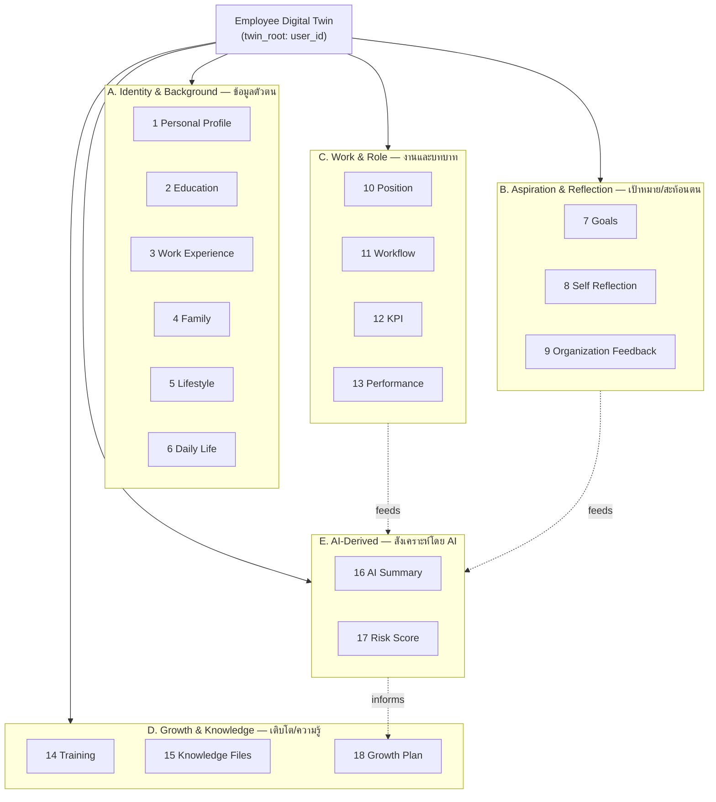
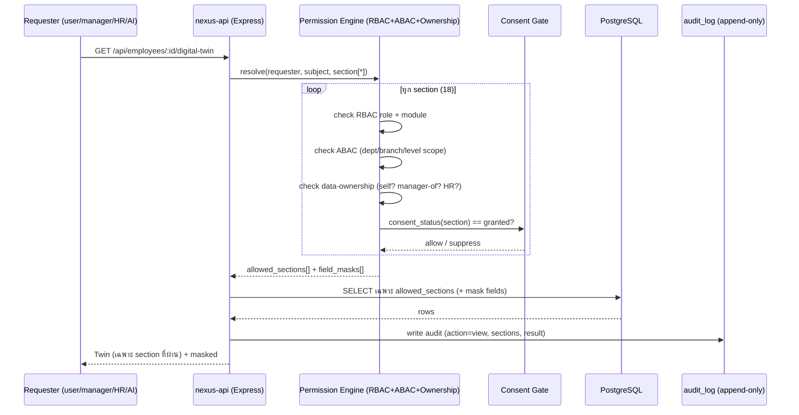

# NEXUS OS · เอกสารสถาปัตยกรรม 13 — Employee Digital Twin Model (แบบจำลองฝาแฝดดิจิทัลของพนักงาน)

> **บริษัท:** Saduak Suay Mai PCL — เครือคลินิกเสริมความงาม + ทันตกรรม (แฟรนไชส์)
> **ระบบฐาน:** NEXUS OS (Next.js 16 `nexus-web` + Express/TS `nexus-api` + PostgreSQL บน Railway)
> **เอกสารชุด:** Enterprise AI Workforce OS — Document 13 / Employee Digital Twin
> **สถานะ:** Production-grade specification (ไม่ใช่ demo / ไม่ใช่ MVP)
> **ภาษา:** ไทย narrative + English technical identifiers (bilingual house style)

---

## 0. ขอบเขตและวัตถุประสงค์ (Scope & Purpose)

เอกสารนี้นิยาม **Employee Digital Twin (EDT)** — "ฝาแฝดดิจิทัล" ของพนักงานหนึ่งคน คือ **โมเดลข้อมูลรวมศูนย์ (composite, employee-centric data model)** ที่รวบรวมทุกมิติของพนักงานตั้งแต่ profile, education, ประสบการณ์, ครอบครัว, lifestyle, ชีวิตประจำวัน, เป้าหมาย, การประเมินตนเอง, feedback องค์กร, ตำแหน่ง, workflow, KPI, performance, training, knowledge files, AI summary, risk score จนถึง growth plan

Digital Twin **ไม่ใช่ตารางเดียว** แต่เป็น **logical aggregation layer (view)** ที่ประกอบจากหลายตารางใน NEXUS OS โดยมีหลักการ:

> **หลักการที่ 1 — Section as a security boundary:** Digital Twin แบ่งเป็น **18 sections** แต่ละ section มี `owner`, `security_level` (BASIC / MEDIUM / HARD / RESTRICTED), `consent_status`, `last_updated_at`, `updated_by`, และ flag `audit_log_required` เป็นของตัวเอง การเข้าถึง Twin **ไม่ใช่ all-or-nothing** — Permission Engine ประกอบ Twin "ทีละ section" ตามสิทธิ์ของผู้ขอ (ดูเอกสาร 06 — Permission Engine, เอกสาร 07 — Audit & AI Control)

> **หลักการที่ 2 — AI never reads raw Twin:** AI **ไม่เคย** อ่าน Digital Twin ดิบจาก DB ทุกครั้งที่ AI ต้องใช้ Twin จะผ่าน flow: identify user → check clearance → filter เหลือเฉพาะ section ที่ allowed → redaction → ส่งเข้าโมเดล → response → redaction check → audit (`ai_query_logs`)

> **หลักการที่ 3 — Consent-gated by default:** section ที่เป็นข้อมูลส่วนบุคคลเชิงลึก (Family, Lifestyle, Daily Life, Self Reflection) **บังคับใช้ consent** ตาม PDPA (พ.ร.บ.คุ้มครองข้อมูลส่วนบุคคล พ.ศ. 2562) — ถ้า `consent_status != 'granted'` section นั้นจะถูก suppress ทั้งจาก human reader และ AI

ลำดับชั้นองค์กรอ้างอิง:

```
Company  →  Department  →  Sub-Department  →  Team / Unit  →  Position  →  Employee
(L0)        (L1)           (L2)               (L3)            (L4)         (L5)
```

Digital Twin คือ entity ที่ผูก 1:1 กับ **Employee (L5)** ผ่าน `user_id`

---

## 1. ภาพรวมโมเดล (Digital Twin — Conceptual Model)



**กลุ่ม (Group) ของ section** ใช้กำหนด default policy:

| Group | Sections | ลักษณะข้อมูล | Default Security | Consent |
|---|---|---|---|---|
| **A. Identity & Background** | 1–6 | ข้อมูลส่วนบุคคล (PII / sensitive personal) | MEDIUM → RESTRICTED | บางส่วนต้อง consent |
| **B. Aspiration & Reflection** | 7–9 | ความคิดเห็น/ความรู้สึกของพนักงาน | HARD → RESTRICTED | ต้อง consent |
| **C. Work & Role** | 10–13 | ข้อมูลงานเชิงวัตถุ (objective) | BASIC → HARD | ไม่ต้อง (เป็นข้อมูลงาน) |
| **D. Growth & Knowledge** | 14, 15, 18 | พัฒนาการ/ไฟล์ความรู้ | MEDIUM → HARD | ตามชั้นไฟล์ |
| **E. AI-Derived** | 16, 17 | ผลสังเคราะห์โดย AI | RESTRICTED | n/a (เป็น derived) |

---

## 2. มาตรฐานคอลัมน์ของทุก Twin Table (Core Column Contract)

ทุกตารางใหม่ (NEW) ของ Digital Twin **ต้องมี** คอลัมน์มาตรฐานองค์กร (ตาม Global Design Rule) มิฉะนั้นถือว่าไม่ผ่าน migration review:

```sql
-- Core Column Contract (บังคับทุกตาราง EDT ที่เป็น NEW)
id            TEXT PRIMARY KEY,                       -- randomUUID()
company_id    TEXT NOT NULL REFERENCES companies(id), -- tenant isolation
user_id       TEXT NOT NULL REFERENCES users(id),     -- twin owner (subject)
security_level TEXT NOT NULL DEFAULT 'MEDIUM'
              CHECK (security_level IN ('BASIC','MEDIUM','HARD','RESTRICTED')),
consent_status TEXT NOT NULL DEFAULT 'not_required'
              CHECK (consent_status IN ('granted','denied','pending','revoked','not_required')),
is_active     BOOLEAN NOT NULL DEFAULT TRUE,
version       INTEGER NOT NULL DEFAULT 1,             -- optimistic lock
created_at    TIMESTAMPTZ NOT NULL DEFAULT NOW(),
updated_at    TIMESTAMPTZ NOT NULL DEFAULT NOW(),
deleted_at    TIMESTAMPTZ,                            -- soft-delete
created_by    TEXT NOT NULL REFERENCES users(id),
updated_by    TEXT REFERENCES users(id),
deleted_by    TEXT REFERENCES users(id)
```

> **หมายเหตุ grounding:** ตารางเดิมใน NEXUS OS (เช่น `employee_profiles`, `skill_scores`, `kpi_entries`, `user_files`) **ยังไม่มี** คอลัมน์ `deleted_at / version / security_level (4-level) / consent_status / updated_by` ครบ — ปัจจุบันมีเพียง `security_tier` (T0–T3) บางตาราง (ดู TOP GAP #5: zero `deleted_at` ทั้ง codebase) ดังนั้น Digital Twin ต้องการ migration ทั้ง (ก) เพิ่มคอลัมน์ลงตารางเดิม และ (ข) สร้างตารางใหม่

**Mapping `security_tier` (เดิม T0–T3) → `security_level` (4-level ใหม่):**

| เดิม `security_tier` | ใหม่ `security_level` | ความหมาย |
|---|---|---|
| `T0` | `BASIC` | ทุกคนในบริษัทเห็นได้ |
| `T1` | `MEDIUM` | ระดับแผนก (department-scope) |
| `T2` | `HARD` | owner / manager / HR |
| `T3` | `RESTRICTED` | direct grant เท่านั้น |

---

## 3. โครงสร้าง 18 Sections — ตารางสรุปหลัก (Master Section Table)

ตารางนี้คือ **สัญญาหลัก (master contract)** ของ Digital Twin ทุก section มี 6 attribute บังคับตามโจทย์: `owner`, `security_level`, `consent_status`, `last_updated_at`, `updated_by`, `audit_log_required`

> นิยาม **owner** = ผู้รับผิดชอบความถูกต้องของข้อมูล (data steward) ไม่ใช่ผู้เดียวที่แก้ได้เสมอ — `updated_by` คือ actor จริงที่แก้ครั้งล่าสุด
> นิยาม `audit_log_required` = ทุก action (view/search/create/update/delete/export/ai-query) บน section นี้ **ต้อง** เขียน `audit_log` (append-only) — ถ้า `Yes` แปลว่าแม้แต่การ *view* ก็ต้อง log

| # | Section | Owner (data steward) | `security_level` | `consent_status` (default) | `last_updated_at` source | `updated_by` source | `audit_log_required` |
|---|---|---|---|---|---|---|---|
| 1 | **Personal Profile** | HR + Employee (self) | MEDIUM (PII fields → HARD) | `not_required` (จำเป็นต่อการจ้าง) | `users.updated_at` / `employee_profiles.updated_at` | last editor (HR/self) | **Yes** |
| 2 | **Education** | Employee (self) → HR verify | MEDIUM | `not_required` | `edt_education.updated_at` | self / HR verifier | **Yes** |
| 3 | **Work Experience** | Employee (self) → HR verify | MEDIUM | `not_required` | `edt_work_experience.updated_at` | self / HR verifier | **Yes** |
| 4 | **Family** | Employee (self) | **RESTRICTED** | **`pending` → ต้อง `granted`** | `edt_family.updated_at` | self | **Yes** |
| 5 | **Lifestyle** | Employee (self) | HARD | **`pending` → ต้อง `granted`** | `edt_lifestyle.updated_at` | self | **Yes** |
| 6 | **Daily Life** | Employee (self) | HARD | **`pending` → ต้อง `granted`** | `edt_daily_life.updated_at` | self | **Yes** |
| 7 | **Goals** | Employee (self) + Manager | MEDIUM (career goals → HARD) | `granted` (จาก onboarding) | `edt_goals.updated_at` | self / manager | **Yes** |
| 8 | **Self Reflection** | Employee (self) | **RESTRICTED** | **ต้อง `granted`** | `edt_self_reflection.updated_at` | self | **Yes** |
| 9 | **Organization Feedback** | Manager + HR (about employee) | **RESTRICTED** | `not_required` (เป็น mgmt record) | `edt_org_feedback.updated_at` | manager / HR / peer | **Yes** |
| 10 | **Position** | HR (authoritative) | BASIC (title) → HARD (band) | `not_required` | `employee_profiles.updated_at` / `positions.updated_at` | HR | **Yes** |
| 11 | **Workflow** | Department Manager | MEDIUM | `not_required` | `work_logs.created_at` (latest) | system / actor | **Yes** |
| 12 | **KPI** | Manager (owner) + Employee (entry) | MEDIUM (own) → HARD (cross) | `not_required` | `kpi_entries.created_at` (latest) | self / manager | **Yes** |
| 13 | **Performance** | Manager + HR | HARD (review) → **RESTRICTED** (AI eval) | `not_required` | `edt_performance_reviews.updated_at` | manager / HR | **Yes** |
| 14 | **Training** | HR (L&D) | MEDIUM | `not_required` | `edt_training_records.updated_at` | HR / trainer | **Yes** |
| 15 | **Knowledge Files** | Employee (self) + Dept | per-file: BASIC→RESTRICTED | per-file | `user_files.created_at` (latest) | uploader | **Yes** (esp. download/export) |
| 16 | **AI Summary** | System (AI) — reviewed by HR | **RESTRICTED** | `not_required` (derived) | `edt_ai_summary.generated_at` | `ai` (system actor) | **Yes** (ai-query + ai-response) |
| 17 | **Risk Score** | System (AI) — owned by HR/CEO | **RESTRICTED** | `not_required` (derived) | `edt_risk_score.computed_at` | `ai` / HR override | **Yes** |
| 18 | **Growth Plan** | Manager + HR + Employee | HARD | `granted` (มี employee buy-in) | `edt_growth_plan.updated_at` | manager / HR / self | **Yes** |

> **กฎบังคับ:** ทุก section ของ Digital Twin มี `audit_log_required = Yes` **ทั้งหมด** — เพราะ Twin คือ employee-centric sensitive aggregate; แม้แต่ section BASIC (เช่น job title) ก็ต้อง log การ *view* เพื่อให้ตอบ "ใครดู Twin ของฉันบ้าง" ได้ (PDPA right of access / data subject log)

---

## 4. รายละเอียดแต่ละ Section (Section Specifications)

แต่ละ section ระบุ: คำอธิบาย, owner, security_level, consent, field ตัวอย่าง, การ map ลง DB (**EXISTS** = ตารางเดิม / **NEW** = migration), และกฎเฉพาะ

### Section 1 — Personal Profile (ข้อมูลส่วนบุคคล)

- **Owner:** HR (authoritative สำหรับข้อมูลทะเบียน) + Employee (self, สำหรับ contact/preference)
- **security_level:** `MEDIUM` โดยรวม; field PII เข้ม (`personal_tax_id`, `bank_account`, national ID, DOB) → `HARD`/`RESTRICTED`
- **consent_status:** `not_required` (ข้อมูลจำเป็นต่อสัญญาจ้าง — ฐานทางกฎหมาย: contract necessity ตาม PDPA ม.24)
- **Fields:** `full_name_th`, `full_name_en`, `national_id` [RESTRICTED], `dob`, `gender`, `nationality`, `phone`, `personal_email`, `address`, `emergency_contact`, `blood_type`, `avatar`, `bank_account` [RESTRICTED], `personal_tax_id` [RESTRICTED]
- **DB Mapping:**
  - `users` (**EXISTS**): `name, email, phone, salary, avatar, color, department, role, status`
  - `employee_profiles` (**EXISTS**): `employee_code, hire_date, terminate_date, bank_account, personal_tax_id, employee_type`
  - `edt_personal_detail` (**NEW**): field PII ที่ยังไม่มี (national_id, dob, gender, address, emergency_contact, blood_type) — เก็บแบบ **encrypted-at-rest** (เหมือน pattern `patients.*_encrypted`)
- **กฎเฉพาะ:** `national_id / bank_account / personal_tax_id` ต้อง **mask** เสมอเมื่อแสดง (เช่น `x-xxxx-xxxxx-12-3`) และ unmask ได้เฉพาะ HR/Finance ที่มี explicit grant + log ทุกครั้ง

### Section 2 — Education (ประวัติการศึกษา)

- **Owner:** Employee (self-declared) → HR verify (`verified_by`, `verified_at`)
- **security_level:** `MEDIUM`
- **consent_status:** `not_required`
- **Fields:** `degree_level`, `institution`, `major`, `gpa`, `start_year`, `end_year`, `certificate_file_id`, `verified` (bool)
- **DB Mapping:** `edt_education` (**NEW**) — 1:N ต่อ user; ใบรับรองผูกกับ `user_files` (**EXISTS**) ผ่าน `certificate_file_id`

### Section 3 — Work Experience (ประสบการณ์ทำงาน)

- **Owner:** Employee (self) → HR verify
- **security_level:** `MEDIUM`
- **consent_status:** `not_required`
- **Fields:** `company_name`, `position`, `start_date`, `end_date`, `is_current`, `responsibilities`, `reason_for_leaving` [HARD], `reference_contact` [RESTRICTED]
- **DB Mapping:** `edt_work_experience` (**NEW**) — 1:N; `reason_for_leaving` และ reference เป็น sensitive → field-level mask

### Section 4 — Family (ครอบครัว)

- **Owner:** Employee (self) — **ห้าม** ใครแก้แทน
- **security_level:** **`RESTRICTED`** (sensitive personal data / ใช้สำหรับสวัสดิการ-ผู้รับผลประโยชน์)
- **consent_status:** **`pending` → ต้อง `granted`** ก่อนเก็บ/แสดง (PDPA ม.26 sensitive)
- **Fields:** `relation` (คู่สมรส/บุตร/บิดามารดา), `name`, `dob`, `occupation`, `is_dependent` (ลดหย่อนภาษี), `is_beneficiary` (ผู้รับผลประโยชน์ประกัน), `contact`
- **DB Mapping:** `edt_family` (**NEW**) — 1:N; ใช้ร่วมกับ payroll สำหรับ tax allowance (`payroll_settings`/`payslips` **EXISTS**)
- **กฎเฉพาะ:** AI **ห้าม**เข้าถึง section นี้เว้นแต่ task เป็น "สวัสดิการ/ภาษี" และมี explicit grant; default คือ AI suppress

### Section 5 — Lifestyle (ไลฟ์สไตล์)

- **Owner:** Employee (self)
- **security_level:** `HARD`
- **consent_status:** **`pending` → ต้อง `granted`** (เป็น optional wellbeing data)
- **Fields:** `interests`, `hobbies`, `sports`, `dietary`, `commute_mode`, `living_arrangement`, `wellbeing_optin` — ใช้สำหรับ HR wellbeing / team matching เท่านั้น
- **DB Mapping:** `edt_lifestyle` (**NEW**) — 1:1; ตัวข้อมูลส่วนใหญ่ semi-structured → คอลัมน์ `data JSONB`

### Section 6 — Daily Life (ชีวิตประจำวัน/รูปแบบการทำงาน)

- **Owner:** Employee (self) + ระบบ (เติม pattern จาก attendance)
- **security_level:** `HARD`
- **consent_status:** **`pending` → ต้อง `granted`** สำหรับส่วน self-declared; ส่วน derived จาก attendance เป็น `not_required` (ข้อมูลงาน)
- **Fields (self):** `peak_energy_time`, `preferred_work_block`, `wfh_pattern`, `focus_preference`; **(derived):** `avg_clock_in`, `avg_clock_out`, `typical_break_pattern`
- **DB Mapping:**
  - self → `edt_daily_life` (**NEW**, 1:1)
  - derived → คำนวณจาก `time_attendance`, `employee_daily_calendar` (**EXISTS**) แบบ read-only (ไม่ copy)

### Section 7 — Goals (เป้าหมาย)

- **Owner:** Employee (self) ตั้ง + Manager (co-set / approve)
- **security_level:** `MEDIUM` (work goals) → `HARD` (career/exit goals)
- **consent_status:** `granted` (เก็บจาก onboarding/1-on-1)
- **Fields:** `goal_type` (work/career/skill/personal-dev), `title`, `description`, `target_date`, `linked_kpi_key`, `status`, `progress_pct`
- **DB Mapping:** `edt_goals` (**NEW**) — 1:N; link ไป `kpi_entries.metric_key` (**EXISTS**) ผ่าน `linked_kpi_key`; goal ที่ AI ตั้งให้ผูกกับ `daily_ai_tasks` (**EXISTS**)

### Section 8 — Self Reflection (การประเมิน/สะท้อนตนเอง)

- **Owner:** Employee (self) — เป็นพื้นที่ส่วนตัวของพนักงาน
- **security_level:** **`RESTRICTED`** (ความคิด/ความรู้สึก — ห้าม manager เห็นโดย default)
- **consent_status:** ต้อง **`granted`**; พนักงานเลือก share ได้ทีละรายการ (`shared_with_manager` flag ต่อ entry)
- **Fields:** `period`, `what_went_well`, `what_to_improve`, `blockers`, `mood_score` (1–5), `private_note`
- **DB Mapping:** `edt_self_reflection` (**NEW**) — 1:N per period
- **กฎเฉพาะ:** entry ที่ `shared_with_manager = false` → **suppress ทั้งจาก human reader และ AI โดยไม่มีข้อยกเว้น** แม้ผู้ขอเป็น CEO/admin (admin super-user **ไม่** bypass section นี้ — ต้อง override ด้วย explicit grant + dual log)

### Section 9 — Organization Feedback (ฟีดแบ็กจากองค์กรถึงพนักงาน)

- **Owner:** Manager + HR + Peer (เป็นผู้ให้ feedback) — subject คือพนักงาน แต่ owner คือผู้ให้
- **security_level:** **`RESTRICTED`** (โดยเฉพาะ negative feedback / PIP / investigation)
- **consent_status:** `not_required` (เป็น management record; ฐาน legitimate interest)
- **Fields:** `feedback_type` (recognition/coaching/concern/360), `source_role`, `is_anonymous`, `content`, `visibility` (private-to-HR / shared-with-employee), `linked_review_id`
- **DB Mapping:** `edt_org_feedback` (**NEW**) — 1:N; HR investigation feedback → `visibility='hr_only'` + `security_level='RESTRICTED'` (สอดคล้องกฎ "HR investigation => RESTRICTED")
- **กฎเฉพาะ:** feedback ที่ `is_anonymous=true` ต้อง **strip identity ของ source** ก่อนแสดงให้ subject; แต่ `audit_log` ภายในยังเก็บ actor จริง (append-only) เพื่อ accountability

### Section 10 — Position (ตำแหน่ง)

- **Owner:** HR (authoritative)
- **security_level:** `BASIC` (job title, dept) → `HARD` (salary band, level_rank ที่ผูกอำนาจ)
- **consent_status:** `not_required`
- **Fields:** `position_code`, `position_title`, `position_level`/`level_rank`, `org_unit_id`, `system_role`, `reports_to_user_id`, `salary_band` [HARD/RESTRICTED], `effective_date`
- **DB Mapping:** `employee_profiles.position_id → positions` (**EXISTS**), `org_unit_id → org_units` (**EXISTS**), `system_role` จาก `getSystemRoleForDepartment` (ดูเอกสาร 04). Salary band/value → `users.salary` (**EXISTS**, masked) / `salary_history` (**EXISTS**)
- **กฎเฉพาะ:** เป็น section ที่ feed **RBAC/ABAC** ของ Permission Engine — เปลี่ยนตำแหน่ง = role-change ⇒ ต้อง log `permission-change` + `role-change` (append-only)

### Section 11 — Workflow (ลำดับงาน/พฤติกรรมการทำงาน)

- **Owner:** Department Manager
- **security_level:** `MEDIUM` (department-scope)
- **consent_status:** `not_required`
- **Fields (derived):** `tasks_accepted`, `tasks_submitted`, `tasks_approved/rejected`, `avg_cycle_time`, `escalation_count`, `last_active_at`, `current_workload_score`
- **DB Mapping:**
  - `work_logs` (**EXISTS**): action_type accept/start/submit/approve/reject/issue/escalate, `kpi_impact`, `status`, `reviewed_by`
  - `task_assignments`, `daily_ai_tasks` (**EXISTS**)
  - `user_capacity` (**EXISTS**): `workload_score`, `hours_per_day`
- **กฎเฉพาะ:** ส่วนใหญ่ derived (read-only aggregation) — Twin ไม่ duplicate; แสดงผ่าน view

### Section 12 — KPI (ตัวชี้วัด)

- **Owner:** Manager (KPI owner, ตั้งเป้า) + Employee (self-entry actuals)
- **security_level:** `MEDIUM` (own KPI) → `HARD` (เห็น KPI คนอื่นในแผนก / cross-department)
- **consent_status:** `not_required`
- **Fields:** `metric_key`, `metric_name`, `target` [ASSUMPTION — ต้องนิยามต่อแผนก], `value` (actual), `period`, `achievement_pct`, `branch_code`
- **DB Mapping:** `kpi_entries` (**EXISTS**: metric_key, value, period, note, branch_code via migration v10). **NEW:** `edt_kpi_targets` (target/formula/weight ต่อ position — ปัจจุบันมีแต่ actual ไม่มี target)
- **[ASSUMPTION]:** ค่า target/สูตร/น้ำหนัก KPI จริง (เช่น telesales conversion %, ยอด treatment ต่อหมอ) **ยังไม่ทราบ** — ต้องให้ HR + หัวหน้าแผนกยืนยัน; ห้าม AI สมมุติเป็นข้อเท็จจริง

### Section 13 — Performance (ผลการปฏิบัติงาน/การประเมิน)

- **Owner:** Manager (rater) + HR (calibration)
- **security_level:** `HARD` (review record) → **`RESTRICTED`** (AI-assisted evaluation, PIP)
- **consent_status:** `not_required` (employee เห็นผลของตัวเองได้, มี acknowledgement)
- **Fields:** `review_period`, `overall_rating`, `competency_scores (JSONB)`, `strengths`, `improvement_areas`, `calibration_band`, `acknowledged_by_employee_at`, `linked_skill_scores`
- **DB Mapping:**
  - `edt_performance_reviews` (**NEW**)
  - `skill_scores` + `skill_evidence` (**EXISTS**): score per skill_key + หลักฐาน (มี monthly skill review worker อยู่แล้ว)
- **กฎเฉพาะ:** "AI evaluation => RESTRICTED" — ผลประเมินที่ AI ช่วยคิด ต้องมี human reviewer (decision-right = `human`, ตาม "Copilot not Autopilot") และ log `ai-response` + reviewer sign-off

### Section 14 — Training (การอบรม/พัฒนา)

- **Owner:** HR (L&D)
- **security_level:** `MEDIUM`
- **consent_status:** `not_required`
- **Fields:** `course_name`, `provider`, `type` (internal/external/cert), `status` (enrolled/in-progress/completed/expired), `score`, `completion_date`, `expiry_date` (สำคัญสำหรับ Medical/Dental license/CPD), `certificate_file_id`
- **DB Mapping:** `edt_training_records` (**NEW**); link `user_files` (cert) (**EXISTS**); สำหรับสายแพทย์/ทันตแพทย์ผูกกับ license/CPD tracking
- **กฎเฉพาะ:** training ที่เป็น **medical/dental license/CPD** → `security_level='HARD'` และมี **expiry alert** เข้าระบบ `notifications` (**EXISTS**) ก่อนหมดอายุ

### Section 15 — Knowledge Files (ไฟล์ความรู้/เอกสารส่วนตัว)

- **Owner:** Employee (uploader) + Department (สำหรับไฟล์งานแผนก)
- **security_level:** **per-file** (BASIC → RESTRICTED) ตาม `user_files.security_tier`
- **consent_status:** per-file
- **Fields:** `name`, `mime_type`, `size_bytes`, `department`, `security_tier`, `storage_path`/`content_base64`, `uploaded_by`
- **DB Mapping:** `user_files` (**EXISTS**: name, mime_type, size_bytes, content_base64, security_tier, department; `storage_path` via migration). **NEW:** `file_access_logs` (TOP GAP #3 — ปัจจุบันไฟล์ถูก serve โดยมีแค่ tier label, ไม่มี access trail)
- **กฎเฉพาะ:** ทุก `download/export/view` ของไฟล์ → **บังคับ** เขียน `audit_log` + `file_access_logs` (actor, file_id, action, result); ไฟล์ความรู้ที่ป้อนให้ AI ต้องผ่าน redaction ก่อน (ดู §6)

### Section 16 — AI Summary (บทสรุปโดย AI)

- **Owner:** System (AI generator) — **review/own by HR**
- **security_level:** **`RESTRICTED`** (เป็น derived insight เกี่ยวกับบุคคล)
- **consent_status:** `not_required` (derived) — แต่ generation ต้องอยู่ภายใต้ section consent ของ input
- **Fields:** `summary_text`, `model`, `provider`, `grounded_section_keys (JSONB)`, `redaction_applied (bool)`, `generated_at`, `human_reviewed_by`, `human_review_status`
- **DB Mapping:** `edt_ai_summary` (**NEW**); linked กับ `ai_query_logs` (**NEW**, TOP GAP #4) ผ่าน `request_id`; ต่อยอดจาก `user_ai_memory` (**EXISTS**) แต่แยกเพราะ memory เป็น chat-scoped ไม่ใช่ profile summary
- **กฎเฉพาะ:** AI Summary ต้องสร้างจาก **เฉพาะ section ที่ผู้ขอมีสิทธิ์เห็น** เท่านั้น — ถ้าผู้ขอเป็น manager ที่เห็นได้แค่ work group, summary จะถูกสร้างจาก section 10–14 เท่านั้น **ไม่รวม** 4/5/6/8 (consent-gated); `grounded_section_keys` ต้อง audit ได้ว่าใช้ section ใดบ้าง

### Section 17 — Risk Score (คะแนนความเสี่ยง)

- **Owner:** System (AI) — **own by HR/CEO Office**
- **security_level:** **`RESTRICTED`** (ผลกระทบสูงต่อบุคคล — flight risk, compliance risk)
- **consent_status:** `not_required` (derived)
- **Fields:** `risk_type` (attrition/flight/performance/compliance/license-expiry), `score` (0–100), `band` (low/medium/high), `top_factors (JSONB)`, `computed_at`, `model`, `human_override_score`, `override_reason`
- **DB Mapping:** `edt_risk_score` (**NEW**); inputs จาก Section 11 (workflow), 12 (KPI), 13 (performance), 14 (training expiry), `user_capacity` (workload)
- **กฎเฉพาะ:** Risk Score **ห้ามใช้ตัดสินจ้าง/เลิกจ้างแบบอัตโนมัติ** (decision-right = `human` เด็ดขาด); ต้องมี explainability (`top_factors`) และ HR override ได้; การ view risk score ของพนักงานคนใด = `audit_log` ทุกครั้ง พร้อม justification

### Section 18 — Growth Plan (แผนเติบโต)

- **Owner:** Manager + HR + Employee (ร่วมกัน, ต้องมี employee buy-in)
- **security_level:** `HARD`
- **consent_status:** `granted` (พนักงานเห็นและตกลงด้วย)
- **Fields:** `objective`, `target_position_code`, `skill_gaps (JSONB)`, `recommended_trainings`, `milestones`, `mentor_user_id`, `review_date`, `status`
- **DB Mapping:** `edt_growth_plan` (**NEW**); link skill gap → `skill_scores` (**EXISTS**), training → `edt_training_records`, target → `positions` (**EXISTS**)
- **กฎเฉพาะ:** Growth Plan ที่ AI แนะนำ skill gap ต้องมาจาก grounded data (skill_scores, performance) — ไม่ใช่ generic advice; manager เป็นผู้ approve milestone

---

## 5. Data Model — Mapping Twin Sections → DB Tables

### 5.1 ตารางสรุป EXISTS vs NEW

| Section | ตารางที่ใช้ | สถานะ | หมายเหตุ migration |
|---|---|---|---|
| 1 Personal Profile | `users`, `employee_profiles` | **EXISTS** | + `edt_personal_detail` (**NEW**, encrypted PII) |
| 2 Education | `edt_education` | **NEW** | link `user_files` |
| 3 Work Experience | `edt_work_experience` | **NEW** | |
| 4 Family | `edt_family` | **NEW** | consent-gated, RESTRICTED |
| 5 Lifestyle | `edt_lifestyle` | **NEW** | JSONB, consent-gated |
| 6 Daily Life | `edt_daily_life` | **NEW** | + derived จาก `time_attendance` (**EXISTS**) |
| 7 Goals | `edt_goals` | **NEW** | link `kpi_entries`, `daily_ai_tasks` (**EXISTS**) |
| 8 Self Reflection | `edt_self_reflection` | **NEW** | RESTRICTED, share-flag |
| 9 Org Feedback | `edt_org_feedback` | **NEW** | RESTRICTED |
| 10 Position | `employee_profiles`,`positions`,`org_units`,`salary_history` | **EXISTS** | feed RBAC/ABAC |
| 11 Workflow | `work_logs`,`task_assignments`,`daily_ai_tasks`,`user_capacity` | **EXISTS** | derived view |
| 12 KPI | `kpi_entries` | **EXISTS** | + `edt_kpi_targets` (**NEW**) |
| 13 Performance | `skill_scores`,`skill_evidence` | **EXISTS** | + `edt_performance_reviews` (**NEW**) |
| 14 Training | `edt_training_records` | **NEW** | link `user_files`, `notifications` |
| 15 Knowledge Files | `user_files` | **EXISTS** | + `file_access_logs` (**NEW**) |
| 16 AI Summary | `edt_ai_summary` | **NEW** | link `ai_query_logs` (**NEW**), `user_ai_memory` (**EXISTS**) |
| 17 Risk Score | `edt_risk_score` | **NEW** | |
| 18 Growth Plan | `edt_growth_plan` | **NEW** | link `skill_scores`, `positions` (**EXISTS**) |
| **(meta)** Twin registry | `edt_sections`, `edt_consent_log` | **NEW** | section state + consent ledger |

### 5.2 ER Diagram (Twin core)

```mermaid
erDiagram
  users ||--|| employee_profiles : has
  users ||--o{ edt_sections : "twin sections meta"
  users ||--o{ edt_education : declares
  users ||--o{ edt_work_experience : declares
  users ||--o{ edt_family : declares
  users ||--|| edt_lifestyle : has
  users ||--|| edt_daily_life : has
  users ||--o{ edt_goals : sets
  users ||--o{ edt_self_reflection : writes
  users ||--o{ edt_org_feedback : "is subject of"
  users ||--o{ edt_performance_reviews : "is rated in"
  users ||--o{ edt_training_records : completes
  users ||--o{ user_files : owns
  users ||--o{ kpi_entries : reports
  users ||--o{ work_logs : performs
  users ||--|| edt_ai_summary : "summarized by AI"
  users ||--o{ edt_risk_score : "scored by AI"
  users ||--|| edt_growth_plan : "develops via"
  users ||--o{ edt_consent_log : "grants/revokes"
  edt_ai_summary }o--|| ai_query_logs : "grounded by request_id"
  edt_sections }o--|| edt_consent_log : "gated by"
```



### 5.3 Twin Registry & Consent — DDL ตารางเมตา (NEW)

ตาราง `edt_sections` คือ **registry** บันทึก state ของแต่ละ section ต่อพนักงาน (ทำให้ query "section ใด granted/last_updated/by ใคร" ได้ทันที โดยไม่ต้องไล่ทุกตาราง):

```sql
CREATE TABLE IF NOT EXISTS edt_sections (
  id             TEXT PRIMARY KEY,
  company_id     TEXT NOT NULL REFERENCES companies(id) ON DELETE CASCADE,
  user_id        TEXT NOT NULL REFERENCES users(id) ON DELETE CASCADE, -- twin subject
  section_key    TEXT NOT NULL CHECK (section_key IN (
                   'personal_profile','education','work_experience','family','lifestyle',
                   'daily_life','goals','self_reflection','org_feedback','position',
                   'workflow','kpi','performance','training','knowledge_files',
                   'ai_summary','risk_score','growth_plan')),
  owner_role     TEXT NOT NULL,                       -- data steward role
  security_level TEXT NOT NULL DEFAULT 'MEDIUM'
                 CHECK (security_level IN ('BASIC','MEDIUM','HARD','RESTRICTED')),
  consent_status TEXT NOT NULL DEFAULT 'not_required'
                 CHECK (consent_status IN ('granted','denied','pending','revoked','not_required')),
  consent_log_id TEXT REFERENCES edt_consent_log(id), -- latest consent decision
  audit_log_required BOOLEAN NOT NULL DEFAULT TRUE,
  source_table   TEXT,                                -- e.g. 'edt_family'
  last_updated_at TIMESTAMPTZ NOT NULL DEFAULT NOW(),
  updated_by     TEXT REFERENCES users(id),
  is_active      BOOLEAN NOT NULL DEFAULT TRUE,
  version        INTEGER NOT NULL DEFAULT 1,
  created_at     TIMESTAMPTZ NOT NULL DEFAULT NOW(),
  deleted_at     TIMESTAMPTZ,
  CONSTRAINT uq_edt_section UNIQUE (company_id, user_id, section_key)
);
CREATE INDEX idx_edt_sections_user ON edt_sections (company_id, user_id);
CREATE INDEX idx_edt_sections_consent ON edt_sections (consent_status) WHERE consent_status IN ('pending','revoked');

CREATE TABLE IF NOT EXISTS edt_consent_log (
  id             TEXT PRIMARY KEY,
  company_id     TEXT NOT NULL REFERENCES companies(id) ON DELETE CASCADE,
  user_id        TEXT NOT NULL REFERENCES users(id),  -- subject (ผู้ให้ consent)
  section_key    TEXT NOT NULL,
  decision       TEXT NOT NULL CHECK (decision IN ('granted','denied','revoked')),
  legal_basis    TEXT NOT NULL DEFAULT 'consent'
                 CHECK (legal_basis IN ('consent','contract','legal_obligation','legitimate_interest')),
  scope          TEXT,                                -- e.g. 'hr_only','ai_allowed'
  decided_at     TIMESTAMPTZ NOT NULL DEFAULT NOW(),
  decided_by     TEXT NOT NULL REFERENCES users(id),  -- โดยปกติ = subject เอง
  ip_address     TEXT,
  user_agent     TEXT,
  request_id     TEXT,
  prev_hash      TEXT,                                -- tamper-evident chain
  row_hash       TEXT                                 -- = hash(prev_hash || row)
);
-- append-only: REVOKE UPDATE, DELETE (enforced ระดับ DB grant + trigger)
CREATE INDEX idx_edt_consent_user ON edt_consent_log (company_id, user_id, section_key, decided_at DESC);
```

> **เหตุผลที่ต้องมี `edt_consent_log` แยก:** TOP GAP #3 ระบุว่า NEXUS OS **ไม่มี** `consent_logs` เลย — มีแค่ `patients.consent_given/consent_at` (boolean เดียว) ไม่มี ledger ระดับ section/พนักงาน Digital Twin จึงนำ consent ledger แบบ append-only + hash-chain เข้ามาเป็นโครงสร้างมาตรฐาน

### 5.4 ตัวอย่าง DDL — section table (pattern เดียวกันทุก NEW table)

ใช้ `edt_family` เป็นตัวแทน (RESTRICTED + consent-gated):

```sql
CREATE TABLE IF NOT EXISTS edt_family (
  id             TEXT PRIMARY KEY,
  company_id     TEXT NOT NULL REFERENCES companies(id) ON DELETE CASCADE,
  user_id        TEXT NOT NULL REFERENCES users(id) ON DELETE CASCADE,
  relation       TEXT NOT NULL CHECK (relation IN ('spouse','child','parent','sibling','other')),
  name_encrypted TEXT NOT NULL,                       -- encrypted-at-rest (pattern patients.*)
  dob            DATE,
  occupation     TEXT,
  is_dependent   BOOLEAN NOT NULL DEFAULT FALSE,      -- ลดหย่อนภาษี
  is_beneficiary BOOLEAN NOT NULL DEFAULT FALSE,      -- ผู้รับผลประโยชน์
  contact_encrypted TEXT,
  security_level TEXT NOT NULL DEFAULT 'RESTRICTED'
                 CHECK (security_level IN ('BASIC','MEDIUM','HARD','RESTRICTED')),
  consent_status TEXT NOT NULL DEFAULT 'pending'
                 CHECK (consent_status IN ('granted','denied','pending','revoked','not_required')),
  is_active      BOOLEAN NOT NULL DEFAULT TRUE,
  version        INTEGER NOT NULL DEFAULT 1,
  created_at     TIMESTAMPTZ NOT NULL DEFAULT NOW(),
  updated_at     TIMESTAMPTZ NOT NULL DEFAULT NOW(),
  deleted_at     TIMESTAMPTZ,
  created_by     TEXT NOT NULL REFERENCES users(id),
  updated_by     TEXT REFERENCES users(id),
  deleted_by     TEXT REFERENCES users(id),
  CONSTRAINT chk_family_consent CHECK (
    consent_status = 'granted' OR is_active = FALSE   -- ห้าม active โดยไม่มี consent
  )
);
CREATE INDEX idx_edt_family_user ON edt_family (company_id, user_id) WHERE deleted_at IS NULL;
```

### 5.5 ALTER migrations บนตารางเดิม (EXISTS) ให้ครบ Core Column Contract

```sql
-- ตัวอย่าง: ยกระดับ employee_profiles, skill_scores, kpi_entries, user_files
ALTER TABLE employee_profiles
  ADD COLUMN IF NOT EXISTS security_level TEXT NOT NULL DEFAULT 'MEDIUM',
  ADD COLUMN IF NOT EXISTS updated_at TIMESTAMPTZ NOT NULL DEFAULT NOW(),
  ADD COLUMN IF NOT EXISTS deleted_at TIMESTAMPTZ,
  ADD COLUMN IF NOT EXISTS updated_by TEXT REFERENCES users(id),
  ADD COLUMN IF NOT EXISTS version INTEGER NOT NULL DEFAULT 1;

ALTER TABLE user_files
  ADD COLUMN IF NOT EXISTS security_level TEXT GENERATED ALWAYS AS (
    CASE security_tier WHEN 'T0' THEN 'BASIC' WHEN 'T1' THEN 'MEDIUM'
                       WHEN 'T2' THEN 'HARD'  WHEN 'T3' THEN 'RESTRICTED'
                       ELSE 'MEDIUM' END) STORED,
  ADD COLUMN IF NOT EXISTS deleted_at TIMESTAMPTZ,
  ADD COLUMN IF NOT EXISTS deleted_by TEXT REFERENCES users(id);
-- (kpi_entries, skill_scores, knowledge_items: เพิ่ม deleted_at/version/updated_by/security_level เช่นกัน)
```

> migrations ทั้งหมดเข้าระบบ versioned migration เดิม (`migrations.ts`, tracked ใน `schema_migrations`) เป็น v11+ และรันใน boot sequence (`initSchema()` → `runMigrations()`) ตาม Railway deploy topology

---

## 6. การประกอบ Twin + การบังคับสิทธิ์ (Twin Assembly & Enforcement)

### 6.1 Flow การอ่าน Digital Twin (deny-by-default, per-section)



### 6.2 Visibility Matrix — ใครเห็น section ไหน (default)

`S`=self, `M`=line manager, `H`=HR, `D`=dept peers, `C`=CEO/exec, `A`=admin (super-user แต่ **ไม่ bypass RESTRICTED ที่ consent-gated**)

| Section | Self | Manager | HR | Dept Peer | CEO/Exec | AI (default) |
|---|---|---|---|---|---|---|
| 1 Personal Profile | full | masked PII | full | basic only | basic | masked |
| 2 Education | full | view | full | — | — | allowed |
| 3 Work Experience | full | view | full | — | — | allowed |
| 4 Family | full | — | grant-only | — | — | **suppress** |
| 5 Lifestyle | full | — (opt-in) | aggregate | — | — | **suppress** |
| 6 Daily Life | full | derived-only | view | — | — | derived-only |
| 7 Goals | full | shared only | view | — | — | shared only |
| 8 Self Reflection | full | shared only | grant-only | — | — | **suppress** |
| 9 Org Feedback | shared only | own-given | full | — | grant-only | suppress |
| 10 Position | full | view | full | view (title) | view | allowed |
| 11 Workflow | full | view (team) | view | — | view | allowed |
| 12 KPI | full (own) | view (team) | view | aggregate | view | allowed |
| 13 Performance | own result | rate+view | full | — | grant-only | **RESTRICTED** |
| 14 Training | full | view | full | — | — | allowed |
| 15 Knowledge Files | own | dept files | grant-only | dept files | — | per-file |
| 16 AI Summary | own (if shared) | grant-only | view | — | view | n/a (output) |
| 17 Risk Score | — | grant-only | view | — | view | n/a (output) |
| 18 Growth Plan | full | co-own | full | — | — | grounded only |

> `—` = ไม่เห็น (deny) · ทุกการเข้าถึงในตารางนี้ที่ "เห็นได้" ยัง **ต้อง log** (`audit_log_required=Yes` ทุก section)

### 6.3 AI Access Path — Digital Twin (เชื่อมกับ TOP GAP #4)

ลำดับการให้ AI ใช้ Twin (ต่อยอด `ai-router.ts` / `ai-providers.ts` เดิม + เพิ่ม redaction ที่ยังขาด):

```text
1. user query → identify user (auth.ts: JWT → full user+company row)
2. Permission Engine: resolve allowed_sections สำหรับ "requester" (ไม่ใช่ subject)
3. Consent Gate: ตัด section ที่ consent != granted (4/5/8 → suppress เสมอ)
4. Build context: ดึงเฉพาะ allowed_sections → REDACT PII (ขั้นที่ยังขาดใน sanitize.ts/encryption.ts ปัจจุบัน)
5. ส่งเข้าโมเดล (askWithFallback) — เฉพาะ allowed + redacted เท่านั้น
6. response → output redaction check (กันโมเดลเดาข้อมูลที่ไม่ควรเปิด)
7. write ai_query_logs (NEW): prompt, response, provider, model, tokens, latency,
   decision (auto/suggest/human), grounded_section_keys, redaction_applied, request_id
8. link request_id → audit_log (ai-query / ai-response)
```

> **กฎเหล็ก:** AI จะ "ไม่มีวัน" เห็นข้อมูล section ที่ requester มองไม่เห็น — ถ้า requester เป็นเพื่อนร่วมแผนกที่เห็นแค่ section 10/11/12, AI ตอบได้แค่จาก 3 section นั้น ห้ามอ้างอิง performance/risk/family ของ subject เด็ดขาด (สอดคล้องกฎ "AI must never reveal data the user cannot see")

---

## 7. Audit & Lifecycle (สอดคล้องเอกสาร 07)

### 7.1 Action ที่ต้อง log บน Twin (append-only)

ทุก section `audit_log_required=Yes` ⇒ action เหล่านี้บน Twin **ต้อง** เขียน `audit_log` (และ AI action เขียน `ai_query_logs` linked by `request_id`):

`view` · `search` · `create` · `update` · `delete (soft)` · `restore` · `upload` · `download` · `export` · `consent-grant` · `consent-revoke` · `permission-change` · `role-change` · `ai-query` · `ai-response` · `failed-access` · `blocked-access`

แต่ละ record เก็บ (target enrichment ที่เกินจาก `audit_log` ปัจจุบัน — ดู TOP GAP #1): `actor`, `actor_role`, `target_table`, `target_id`, `target_security_level`, `before_state (JSONB)`, `after_state (JSONB)`, `changed_fields`, `ip`, `device`, `user_agent`, `request_id`, `session_id`, `endpoint`, `http_method`, `result`, `failure_reason`, `created_at` + `prev_hash`/`row_hash` (tamper-evident)

### 7.2 Soft-delete, Versioning, Consent revocation

- **Soft-delete:** ทุก NEW table มี `deleted_at`; ไม่มี hard delete (ขัดกับ FK CASCADE เดิม — ดู TOP GAP #5). ลบ section = set `deleted_at` + log
- **Versioning:** `version` เพิ่มทุก update (optimistic lock); ค่าก่อน/หลังเก็บใน `audit_log.before_state/after_state`
- **Consent revocation:** เมื่อ subject กด revoke (`edt_consent_log.decision='revoked'`) → `edt_sections.consent_status='revoked'` → section ถูก **suppress ทันที** จากทุก reader และ AI; ข้อมูลคงอยู่ (เพื่อ legal hold) แต่ access ถูกตัด จนกว่าจะ grant ใหม่
- **Retention:** `audit_log` / `edt_consent_log` มี retention policy (เก็บ ≥ ระยะที่กฎหมายไทยกำหนด — **[ASSUMPTION]** ≥ 5 ปีหลังสิ้นสุดการจ้าง ต้องให้ฝ่ายกฎหมายยืนยัน) และ **ห้ามแก้/ลบ**

---

## 8. สรุปรายการสิ่งที่ต้องสร้าง (Build Checklist)

**NEW tables (migration v11+):** `edt_sections`, `edt_consent_log`, `edt_personal_detail`, `edt_education`, `edt_work_experience`, `edt_family`, `edt_lifestyle`, `edt_daily_life`, `edt_goals`, `edt_self_reflection`, `edt_org_feedback`, `edt_kpi_targets`, `edt_performance_reviews`, `edt_training_records`, `edt_ai_summary`, `edt_risk_score`, `edt_growth_plan`, `file_access_logs`, `ai_query_logs` (แชร์กับเอกสาร 07)

**EXISTS tables (reuse + ALTER):** `users`, `employee_profiles`, `positions`, `org_units`, `salary_history`, `work_logs`, `task_assignments`, `daily_ai_tasks`, `user_capacity`, `kpi_entries`, `skill_scores`, `skill_evidence`, `user_files`, `user_ai_memory`, `time_attendance`, `employee_daily_calendar`, `notifications`, `audit_log`

**NEW backend logic:** Twin assembly service (per-section Permission Engine resolve), Consent Gate middleware, AI redaction step ใน path (`ai-router.ts`), `file_access_logs` writer, append-only enforcement (DB grant revoke UPDATE/DELETE + hash-chain) บน `audit_log`/`edt_consent_log`

**[ASSUMPTION] ที่ต้องยืนยันกับ HR/ผู้ว่าจ้าง:** KPI targets/สูตร/น้ำหนักต่อตำแหน่ง, salary bands, retention period ตามกฎหมายไทย, license/CPD requirements ของสายแพทย์/ทันตแพทย์, รายการ wellbeing fields ที่เก็บได้ตาม PDPA

---

> **เอกสารที่เกี่ยวข้อง:** 04 (Position Structure) · 05 (Responsibility Matrix) · 06 (Permission Engine: RBAC+ABAC+Ownership) · 07 (Audit & AI Access Control) — Digital Twin บังคับใช้สิทธิ์ผ่านเครื่องยนต์ของเอกสาร 06/07 ทุกจุด
