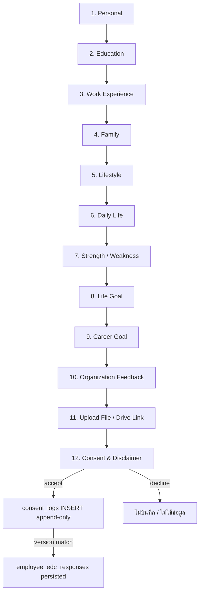
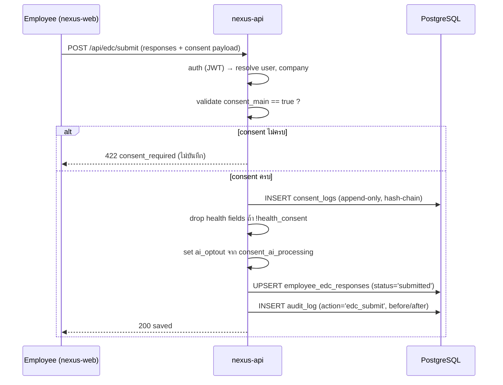
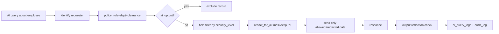

# NEXUS OS · เอกสารสถาปัตยกรรม 14 — แบบฟอร์มเก็บข้อมูลพนักงาน (Employee Data Collection Form)

> **บริษัท:** Saduak Suay Mai PCL — เครือคลินิกเสริมความงาม + ทันตกรรม (แฟรนไชส์)
> **ระบบฐาน:** NEXUS OS (Next.js 16 `nexus-web` + Express/TS `nexus-api` + PostgreSQL บน Railway)
> **เอกสารชุด:** Enterprise AI Workforce OS — Document 14 / Employee Data Collection Form
> **สถานะ:** Production-grade specification (ไม่ใช่ demo / ไม่ใช่ MVP / ไม่ใช่ loose)
> **ภาษา:** ไทย narrative + English technical identifiers (bilingual house style)

---

## 0. ขอบเขตและวัตถุประสงค์ (Scope & Purpose)

เอกสารนี้นิยาม **Employee Data Collection Form** (EDC Form) — แบบฟอร์ม intake 12 ส่วน (12-section) สำหรับเก็บข้อมูลพนักงานเชิงลึกเพื่อ **talent development & organization development (OD)** บนระบบ NEXUS OS โดยเฉพาะ ครอบคลุม field-by-field ทุก section, data classification (security_level) ของแต่ละ field, UI/UX behavior, validation, การ map ลงฐานข้อมูล (กราวด์กับ `employee_profiles`), การ enforce permission ใน backend, การ redact ก่อนป้อน AI, และที่สำคัญที่สุดคือ **consent layer** — disclaimer ที่ชัดเจน + ตาราง `consent_logs` (append-only) ที่บันทึกการยินยอมแบบ versioned

> **หลักการกำกับ (Governing Principles):**
> 1. **Consent-first, deny-by-default** — ไม่มีข้อมูลใดใน EDC Form ถูกใช้ ประมวลผล หรือป้อน AI ก่อนพนักงานกด accept consent version ปัจจุบัน
> 2. **No adverse effect** — ข้อมูลใน EDC Form ใช้เพื่อ **พัฒนาคน/องค์กร** เท่านั้น **ไม่มีผลโดยตรง** ต่อเงินเดือน/โปรโมชั่น/การจ้างงาน (ดู disclaimer ข้อ 13)
> 3. **Self-owned data** — เจ้าของข้อมูล (data_owner) คือ **ตัวพนักงานเอง** (`owner_id == user.id`); การเข้าถึงของผู้อื่นเป็นไปตาม system permission + security_level เท่านั้น (ดูเอกสาร 07 — Permission Engine)
> 4. **Sensitive-by-design** — field ที่เป็น health/financial/psychological insight ถูก classify เป็น `HARD`/`RESTRICTED` ตั้งแต่ต้นทาง

### 0.1 ตำแหน่งของ EDC Form ในลำดับชั้นองค์กร

```
Company  →  Department  →  Sub-Department  →  Team / Unit  →  Position  →  Employee
(L0)        (L1)           (L2)               (L3)            (L4)         (L5) ← EDC Form ผูกที่นี่
```

EDC Form เป็น **employee-level (L5) artifact** — หนึ่งฟอร์มต่อพนักงานหนึ่งคน ผูกกับ `employee_profiles.user_id` (PK) และ `users.id` ไม่ใช่ข้อมูลระดับตำแหน่ง (position template)

---

## 1. หลักการ Data Classification ของ EDC Form

NEXUS OS ใช้ **4 security levels** บังคับใช้ทุก field (ดูเอกสาร 07). EDC Form นำมาประยุกต์ดังนี้:

| Security Level | ผู้เข้าถึง (default) | ตัวอย่าง field ใน EDC Form |
|---|---|---|
| `BASIC` | ทุกคนในบริษัท (read self always) | ชื่อเล่น, แผนก, ตำแหน่ง (มาจาก profile), งานอดิเรกทั่วไป |
| `MEDIUM` | ระดับแผนก (department scope) | การศึกษา, ประสบการณ์ทำงาน, ทักษะ, เป้าหมายอาชีพ |
| `HARD` | owner / manager สายตรง / HR | สถานะครอบครัว, สุขภาพ-ไลฟ์สไตล์, จุดอ่อน, feedback องค์กร |
| `RESTRICTED` | direct grant เท่านั้น | ข้อมูลสุขภาพละเอียด, ภาระหนี้/การเงินครอบครัว, AI psychological insight, ผล AI evaluation |

> **กฎเหล็ก:** เจ้าของฟอร์ม (พนักงาน) **เห็น field ของตัวเองได้ทั้งหมดเสมอ** (self-access override) ยกเว้น field ที่เป็น **AI-derived evaluation/insight** ซึ่ง classify `RESTRICTED` และไม่เปิดให้เจ้าของเห็น (เพื่อกัน gaming/bias) — เปิดเฉพาะ HR/ผู้บริหารที่มี direct grant

### 1.1 มาตรฐาน field metadata

ทุก field ใน spec ด้านล่างกำหนด attribute ครบ:

| attribute | ความหมาย |
|---|---|
| `field_key` | identifier ภาษาอังกฤษ (snake_case) — ใช้เป็น JSON key + column key |
| `label_th` / `label_en` | ป้ายแสดงผล bilingual |
| `type` | ชนิด input (text / textarea / select / multiselect / date / number / file / boolean / repeatable) |
| `required` | บังคับกรอกหรือไม่ |
| `security_level` | BASIC / MEDIUM / HARD / RESTRICTED |
| `pii` | true ถ้าเป็น Personal Data ตาม PDPA (Thailand) |
| `redact_for_ai` | true ถ้าต้อง mask/strip ก่อนป้อน external AI provider |
| `validation` | กฎ validate (regex / range / enum / length) |

> **PDPA note [ASSUMPTION]:** บริษัทอยู่ภายใต้ พ.ร.บ.คุ้มครองข้อมูลส่วนบุคคล (PDPA) ของไทย field ที่เป็น **sensitive personal data** (สุขภาพ, ความพิการ, ศาสนา หากเก็บ) ต้องมี **explicit consent** แยกและถือเป็น `RESTRICTED` ฟอร์มนี้จึง **ไม่เก็บ** ศาสนา/เชื้อชาติ/ประวัติอาชญากรรม/ข้อมูลชีวภาพ เว้นแต่จำเป็นและขอ consent แยก

---

## 2. โครงสร้างรวมของ 12 Sections



| # | Section | ภาษาไทย | default security_level | บังคับกรอก section? |
|---|---|---|---|---|
| 1 | Personal | ข้อมูลส่วนตัว | BASIC → HARD (บาง field) | ✅ |
| 2 | Education | ประวัติการศึกษา | MEDIUM | ✅ |
| 3 | Work Experience | ประสบการณ์ทำงาน | MEDIUM | ✅ |
| 4 | Family | ครอบครัว | HARD | ⬜ (optional) |
| 5 | Lifestyle | ไลฟ์สไตล์ | HARD | ⬜ |
| 6 | Daily Life | ชีวิตประจำวัน | MEDIUM | ⬜ |
| 7 | Strength / Weakness | จุดแข็ง/จุดอ่อน | HARD | ✅ |
| 8 | Life Goal | เป้าหมายชีวิต | MEDIUM | ⬜ |
| 9 | Career Goal | เป้าหมายอาชีพ | MEDIUM | ✅ |
| 10 | Organization Feedback | ความคิดเห็นต่อองค์กร | HARD (anon option) | ⬜ |
| 11 | Upload File / Drive Link | ไฟล์แนบ / ลิงก์ไดรฟ์ | MEDIUM → HARD | ⬜ |
| 12 | Consent & Disclaimer | ความยินยอม & คำชี้แจง | (control section) | ✅ **บังคับ** |

> **Section 12 เป็น gate:** ถ้าไม่ accept consent → ฟอร์มทั้งหมด **ไม่ถูกบันทึกเป็น committed data** (อาจ save draft แบบ encrypted-at-rest ที่ยังไม่ใช้งานได้ แต่ AI/HR เข้าถึงไม่ได้จนกว่าจะ consent)

---

## 3. SECTION 1 — Personal (ข้อมูลส่วนตัว)

| `field_key` | label_th / label_en | type | required | security_level | pii | redact_for_ai | validation |
|---|---|---|---|---|---|---|---|
| `full_name_th` | ชื่อ-นามสกุล (ไทย) / Full name (TH) | text | ✅ | HARD | ✅ | ✅ (mask → `[NAME]`) | len 2–120 |
| `full_name_en` | ชื่อ-นามสกุล (อังกฤษ) / Full name (EN) | text | ⬜ | HARD | ✅ | ✅ | len 2–120 |
| `nickname` | ชื่อเล่น / Nickname | text | ✅ | BASIC | ⬜ | ⬜ | len 1–40 |
| `employee_code` | รหัสพนักงาน / Employee code | text | auto | BASIC | ⬜ | ⬜ | จาก `employee_profiles.employee_code` (read-only) |
| `national_id` | เลขบัตรประชาชน / National ID | text | ⬜ | RESTRICTED | ✅ | ✅ (strip ทั้งหมด) | 13 หลัก + checksum |
| `date_of_birth` | วันเกิด / Date of birth | date | ✅ | HARD | ✅ | ✅ (เก็บเฉพาะช่วงอายุ) | อายุ ≥ 15 |
| `gender` | เพศ / Gender | select | ⬜ | HARD | ✅ | ⬜ | enum: male/female/other/prefer_not |
| `phone` | เบอร์โทร / Phone | text | ✅ | HARD | ✅ | ✅ (mask 4 ตัวท้าย) | TH mobile regex `^0[0-9]{9}$` |
| `personal_email` | อีเมลส่วนตัว / Personal email | text | ⬜ | HARD | ✅ | ✅ | RFC5322 |
| `current_address` | ที่อยู่ปัจจุบัน / Current address | textarea | ⬜ | RESTRICTED | ✅ | ✅ (strip) | len ≤ 500 |
| `emergency_contact_name` | ผู้ติดต่อฉุกเฉิน-ชื่อ / Emergency contact | text | ✅ | HARD | ✅ | ✅ | len 2–120 |
| `emergency_contact_phone` | ผู้ติดต่อฉุกเฉิน-เบอร์ / Emergency phone | text | ✅ | HARD | ✅ | ✅ | TH phone |
| `emergency_contact_relation` | ความสัมพันธ์ / Relation | text | ✅ | HARD | ⬜ | ⬜ | len ≤ 60 |
| `blood_type` | กรุ๊ปเลือด / Blood type | select | ⬜ | RESTRICTED | ✅ | ✅ | enum: A/B/AB/O ± |
| `chronic_conditions` | โรคประจำตัว / Chronic conditions | textarea | ⬜ | RESTRICTED | ✅ | ✅ (strip) | health data — consent แยก |
| `profile_photo` | รูปโปรไฟล์ / Profile photo | file | ⬜ | BASIC | ✅ | n/a | jpg/png ≤ 5MB |

> **หมายเหตุ Section 1:** field ระบุตัวตน (`full_name_*`, `national_id`, `phone`, `address`) ถึงเป็น "ส่วนตัว" แต่ส่วนใหญ่มีใน `employee_profiles`/`users` อยู่แล้ว — EDC Form **อ้างอิง (read-back) ของเดิม** ไม่ duplicate เว้น field ใหม่ (`nickname`, emergency contact, health). field สุขภาพ (`blood_type`, `chronic_conditions`) เป็น **RESTRICTED + sensitive PDPA** → ต้องมี consent ข้อย่อยแยก (granular consent flag)

---

## 4. SECTION 2 — Education (ประวัติการศึกษา)

ชนิด **repeatable** (กรอกได้หลายรายการ — array of objects) `security_level` = MEDIUM (department scope) ทั้ง section

| `field_key` (per entry) | label_th / label_en | type | required | validation |
|---|---|---|---|---|
| `degree_level` | ระดับการศึกษา / Degree level | select | ✅ | enum: ต่ำกว่า ม.6 / ม.6-ปวช / ปวส / ป.ตรี / ป.โท / ป.เอก |
| `institution` | สถาบัน / Institution | text | ✅ | len ≤ 160 |
| `field_of_study` | สาขาวิชา / Field of study | text | ✅ | len ≤ 120 |
| `graduation_year` | ปีที่จบ (พ.ศ.) / Graduation year | number | ⬜ | 2500–2600 |
| `gpa` | เกรดเฉลี่ย / GPA | number | ⬜ | 0.00–4.00 |
| `certifications` | ใบรับรอง/คอร์ส / Certifications | multiselect+free | ⬜ | ผูก `knowledge_items` ถ้า match |
| `language_skills` | ทักษะภาษา / Language skills | repeatable | ⬜ | {lang, level: A1–C2/native} |

> **Mapping:** entry ที่เป็น certification/skill จะถูก **suggest-link** กับ `skill_scores.skill_key` และ `knowledge_items` (มีอยู่แล้ว) เพื่อ feed skill matrix (เอกสาร 08) — แต่เป็น **suggest ไม่ auto-write** (Copilot not Autopilot)

---

## 5. SECTION 3 — Work Experience (ประสบการณ์ทำงาน)

ชนิด **repeatable** `security_level` = MEDIUM

| `field_key` (per entry) | label_th / label_en | type | required | validation |
|---|---|---|---|---|
| `company_name` | ชื่อบริษัท / Company | text | ✅ | len ≤ 160 |
| `position_title` | ตำแหน่ง / Position | text | ✅ | len ≤ 120 |
| `industry` | อุตสาหกรรม / Industry | select | ⬜ | enum (มี "คลินิก/ความงาม/ทันตกรรม/Healthcare") |
| `start_date` | วันเริ่ม / Start date | date | ✅ | ≤ today |
| `end_date` | วันสิ้นสุด / End date | date | ⬜ | ≥ start_date หรือ "ปัจจุบัน" |
| `responsibilities` | หน้าที่รับผิดชอบ / Responsibilities | textarea | ⬜ | len ≤ 1000 |
| `reason_for_leaving` | เหตุผลที่ออก / Reason for leaving | textarea | ⬜ | HARD (sub-field) |
| `key_achievement` | ผลงานเด่น / Key achievement | textarea | ⬜ | len ≤ 1000 |

> **Sub-field override:** `reason_for_leaving` ถูกยก security_level เป็น **HARD** (อาจมีข้อมูล sensitive เช่นความขัดแย้ง) แม้ section รวมเป็น MEDIUM — แสดงตัวอย่างการ classify ระดับ field-level ที่ละเอียดกว่า section-level

---

## 6. SECTION 4 — Family (ครอบครัว)

`security_level` = **HARD** ทั้ง section (manager สายตรง/HR เท่านั้น) — บาง field RESTRICTED, section นี้ **optional**

| `field_key` | label_th / label_en | type | required | security_level | pii | redact_for_ai |
|---|---|---|---|---|---|---|
| `marital_status` | สถานภาพสมรส / Marital status | select | ⬜ | HARD | ✅ | ⬜ |
| `number_of_children` | จำนวนบุตร / Number of children | number | ⬜ | HARD | ✅ | ⬜ |
| `dependents` | ผู้อยู่ในอุปการะ / Dependents | repeatable | ⬜ | HARD | ✅ | ✅ (mask ชื่อ) |
| `spouse_occupation` | อาชีพคู่สมรส / Spouse occupation | text | ⬜ | HARD | ✅ | ✅ |
| `family_financial_responsibility` | ภาระดูแลครอบครัว / Financial responsibility | select | ⬜ | RESTRICTED | ✅ | ✅ (strip) |
| `family_health_concerns` | ปัญหาสุขภาพในครอบครัว / Family health concerns | textarea | ⬜ | RESTRICTED | ✅ | ✅ (strip) |
| `living_situation` | ลักษณะการอยู่อาศัย / Living situation | select | ⬜ | HARD | ⬜ | ⬜ |

> **เหตุผลที่ HARD/RESTRICTED:** ข้อมูลครอบครัว+ภาระการเงิน+สุขภาพ เป็น sensitive อย่างยิ่ง ใช้สำหรับ welfare/สวัสดิการ/การดูแลพนักงาน (employee care — สอดคล้องแผนก Personal Care) **ห้าม** ใช้เพื่อตัดสินจ้าง/เลื่อนตำแหน่ง (ผูกกับ disclaimer ข้อ 13)

---

## 7. SECTION 5 — Lifestyle (ไลฟ์สไตล์)

`security_level` = **HARD** (insight ส่วนบุคคล) — optional ทั้ง section

| `field_key` | label_th / label_en | type | required | security_level | redact_for_ai |
|---|---|---|---|---|---|
| `hobbies` | งานอดิเรก / Hobbies | multiselect+free | ⬜ | BASIC | ⬜ |
| `interests` | ความสนใจ / Interests | multiselect+free | ⬜ | BASIC | ⬜ |
| `exercise_habits` | การออกกำลังกาย / Exercise habits | select | ⬜ | HARD | ⬜ |
| `sleep_pattern` | รูปแบบการนอน / Sleep pattern | select | ⬜ | HARD | ⬜ |
| `stress_management` | การจัดการความเครียด / Stress management | textarea | ⬜ | RESTRICTED | ✅ (strip) |
| `social_preference` | ชอบทำงานเดี่ยว/ทีม / Solo vs team | select | ⬜ | HARD | ⬜ |
| `learning_style` | สไตล์การเรียนรู้ / Learning style | select | ⬜ | MEDIUM | ⬜ |
| `work_life_values` | ค่านิยมเรื่อง work-life / Work-life values | textarea | ⬜ | HARD | ✅ |

> **การใช้งานเชิง OD:** Lifestyle ใช้ทำ **team composition / mentor pairing / wellbeing program** ไม่ใช่ประเมินผลงาน — AI ใช้ได้เฉพาะ field ที่ `redact_for_ai = false` และเมื่อ requester มี clearance พอ

---

## 8. SECTION 6 — Daily Life (ชีวิตประจำวัน)

`security_level` = MEDIUM — optional

| `field_key` | label_th / label_en | type | required | security_level |
|---|---|---|---|---|
| `commute_method` | การเดินทางมาทำงาน / Commute method | select | ⬜ | MEDIUM |
| `commute_time_minutes` | เวลาเดินทาง (นาที) / Commute time | number | ⬜ | MEDIUM |
| `typical_work_hours_pref` | ช่วงเวลาทำงานที่ถนัด / Preferred hours | select | ⬜ | MEDIUM |
| `peak_productivity_time` | ช่วงเวลา productive ที่สุด / Peak time | select | ⬜ | MEDIUM |
| `tools_used_daily` | เครื่องมือที่ใช้ประจำ / Daily tools | multiselect | ⬜ | MEDIUM |
| `daily_routine_note` | บันทึกกิจวัตร / Routine note | textarea | ⬜ | HARD |

> **การใช้งาน:** feed `user_capacity` / `work_shifts` planning (มีอยู่แล้ว) เพื่อจัดตารางที่เหมาะกับพนักงาน — เป็น OD/ops optimization

---

## 9. SECTION 7 — Strength / Weakness (จุดแข็ง / จุดอ่อน)

`security_level` = **HARD** — **บังคับกรอก** (เป็นแกนหลักของ talent development)

| `field_key` | label_th / label_en | type | required | security_level | redact_for_ai |
|---|---|---|---|---|---|
| `top_strengths` | จุดแข็ง 3–5 ข้อ / Top strengths | repeatable (3–5) | ✅ | HARD | ⬜ |
| `strength_evidence` | ตัวอย่างที่แสดงจุดแข็ง / Evidence | textarea | ⬜ | HARD | ⬜ |
| `areas_to_improve` | จุดที่อยากพัฒนา / Areas to improve | repeatable (1–5) | ✅ | HARD | ⬜ |
| `weakness_self_view` | มุมมองต่อจุดอ่อนตนเอง / Self-view | textarea | ⬜ | RESTRICTED | ✅ |
| `support_needed` | ต้องการการสนับสนุนอะไร / Support needed | textarea | ⬜ | HARD | ⬜ |
| `ai_strength_insight` | (AI) สรุปจุดแข็งเชิงลึก / AI insight | system | auto | **RESTRICTED** | n/a (AI-derived) |

> **field พิเศษ `ai_strength_insight`:** เป็น **AI-derived evaluation** classify `RESTRICTED` และ **ไม่เปิดให้เจ้าของเห็น** (กัน self-gaming) — เปิดเฉพาะ HR/ผู้บริหารที่มี direct grant ผลิตจาก AI pipeline ที่ต้องผ่าน permission + redaction + audit ครบ (ดูเอกสาร 07). การมีอยู่ของ field นี้ต้องถูกระบุใน consent (AI evaluation clause)

---

## 10. SECTION 8 — Life Goal (เป้าหมายชีวิต)

`security_level` = MEDIUM — optional

| `field_key` | label_th / label_en | type | required | security_level |
|---|---|---|---|---|
| `life_vision_5yr` | ภาพชีวิตใน 5 ปี / 5-year life vision | textarea | ⬜ | MEDIUM |
| `core_values` | ค่านิยมหลัก / Core values | multiselect | ⬜ | MEDIUM |
| `personal_milestones` | เป้าหมายส่วนตัวสำคัญ / Personal milestones | textarea | ⬜ | HARD |
| `what_matters_most` | สิ่งที่สำคัญที่สุด / What matters most | textarea | ⬜ | HARD |

---

## 11. SECTION 9 — Career Goal (เป้าหมายอาชีพ)

`security_level` = MEDIUM — **บังคับกรอก** (แกน career-pathing)

| `field_key` | label_th / label_en | type | required | security_level |
|---|---|---|---|---|
| `target_position_1yr` | ตำแหน่งที่อยากเป็นใน 1 ปี / 1-yr target | text | ✅ | MEDIUM |
| `target_position_3yr` | ตำแหน่งใน 3 ปี / 3-yr target | text | ⬜ | MEDIUM |
| `skills_to_develop` | ทักษะที่อยากพัฒนา / Skills to develop | multiselect | ✅ | MEDIUM |
| `preferred_department` | แผนกที่สนใจย้ายไป / Preferred department | select | ⬜ | HARD |
| `interested_in_management` | สนใจสายบริหารหรือไม่ / Management track | boolean | ⬜ | MEDIUM |
| `training_wishlist` | คอร์ส/อบรมที่อยากเรียน / Training wishlist | repeatable | ⬜ | MEDIUM |
| `career_blockers` | อุปสรรคในการเติบโต / Career blockers | textarea | ⬜ | HARD |

> **Mapping:** feed Career Path Engine + Skill Gap (เอกสาร 08) — `skills_to_develop` ↔ `skill_scores`, `target_position_*` ↔ `positions` catalog (เอกสาร 04)

---

## 12. SECTION 10 — Organization Feedback (ความคิดเห็นต่อองค์กร)

`security_level` = **HARD** + **anonymizable** — optional แต่สนับสนุนให้กรอก

| `field_key` | label_th / label_en | type | required | security_level |
|---|---|---|---|---|
| `submit_anonymously` | ส่งแบบไม่ระบุตัวตน / Submit anonymously | boolean | ⬜ | (control) |
| `what_works_well` | สิ่งที่องค์กรทำได้ดี / What works well | textarea | ⬜ | HARD |
| `what_to_improve` | สิ่งที่อยากให้ปรับปรุง / What to improve | textarea | ⬜ | HARD |
| `management_feedback` | feedback ต่อหัวหน้า/ผู้บริหาร / Management feedback | textarea | ⬜ | **RESTRICTED** |
| `culture_rating` | ให้คะแนนวัฒนธรรมองค์กร (1–10) / Culture rating | number | ⬜ | HARD |
| `enps_score` | จะแนะนำที่นี่ให้คนอื่นไหม (0–10) / eNPS | number | ⬜ | HARD |
| `suggestions` | ข้อเสนอแนะอื่น ๆ / Other suggestions | textarea | ⬜ | HARD |

> **Anonymous mode:** ถ้า `submit_anonymously = true` ระบบ **ตัดการเชื่อม `owner_id`** ในเลเยอร์การแสดงผล (เก็บ hash แยกเพื่อกัน double-submit แต่ไม่ผูกชื่อ) — `management_feedback` เป็น `RESTRICTED` เสมอ และเข้าถึงได้เฉพาะ HR/CEO Office ผ่าน aggregate report ไม่ใช่ raw per-person เพื่อปกป้องผู้ให้ feedback

---

## 13. SECTION 11 — Upload File / Drive Link (ไฟล์แนบ / ลิงก์ไดรฟ์)

`security_level` = MEDIUM → HARD ตามชนิดไฟล์ — optional. กราวด์กับตาราง **`user_files`** ที่มีอยู่แล้ว (`nexus-ai-schema.ts`)

| `field_key` | label_th / label_en | type | required | security_level | validation |
|---|---|---|---|---|---|
| `resume_file` | เรซูเม่ / Resume (CV) | file | ⬜ | HARD | pdf/docx ≤ 10MB |
| `transcript_file` | ใบแสดงผลการเรียน / Transcript | file | ⬜ | HARD | pdf ≤ 10MB |
| `certificate_files` | ใบรับรอง/ประกาศนียบัตร / Certificates | file[] | ⬜ | MEDIUM | pdf/jpg/png ≤ 10MB each |
| `portfolio_link` | ลิงก์ผลงาน / Portfolio link | url | ⬜ | MEDIUM | https only, allowlist domains |
| `drive_link` | ลิงก์ Google Drive/อื่น ๆ / Drive link | url | ⬜ | HARD | https + access-mode check |
| `link_access_note` | หมายเหตุการเข้าถึงลิงก์ / Access note | text | ⬜ | MEDIUM | len ≤ 300 |

> **Security ของ Upload/Link:**
> - **ทุกไฟล์** ผ่าน `user_files` (`storage_path` มีอยู่แล้วใน migration) + virus/type scan (NEW), enforce `security_tier` + **file_access_logs** (NEW table ตามเอกสาร 07 — gap #3) ทุกครั้งที่ดู/ดาวน์โหลด
> - **Drive link** ไม่ดึงเนื้อหาเข้า AI โดยอัตโนมัติ — เป็น reference เท่านั้น; ถ้าจะ ingest ต้องผ่าน `ingestion_jobs` (มีอยู่แล้ว) + consent + redaction
> - **URL validation:** บังคับ `https`, ตรวจ domain allowlist (กัน phishing/SSRF), ไม่ตามลิงก์อัตโนมัติฝั่ง server

---

## 14. SECTION 12 — Consent & Disclaimer (ความยินยอม & คำชี้แจง) ⚖️

นี่คือ **control section** ที่บังคับและเป็น gate ของทั้งฟอร์ม พนักงานต้องอ่าน disclaimer แล้วกด accept จึงจะ commit ข้อมูลและเปิดให้ระบบ/AI ใช้งานได้

### 14.1 ข้อความ Disclaimer (EXACT — ภาษาไทย, ต้องแสดงครบทุกตัวอักษร)

> **คำชี้แจงและข้อตกลงการให้ข้อมูล (Data Collection Disclaimer)**
>
> ข้อมูลที่ท่านกรอกในแบบฟอร์มนี้ถูกจัดเก็บเพื่อวัตถุประสงค์ใน **การพัฒนาศักยภาพบุคลากร (Talent Development)** และ **การพัฒนาองค์กร (Organization Development)** เท่านั้น
>
> ข้อมูลนี้ **ไม่มีผลโดยตรง** ต่อ **เงินเดือน การปรับขึ้นเงินเดือน การเลื่อนตำแหน่ง หรือสถานะการจ้างงาน** ของท่าน และจะไม่ถูกนำไปใช้เป็นเกณฑ์ตัดสินผลตอบแทนหรือการจ้างงานแต่อย่างใด
>
> การเข้าถึงข้อมูลของท่านเป็นไปตาม **สิทธิ์การใช้งานระบบ (System Permissions)** และ **ระดับความปลอดภัยของข้อมูล (Security Level)** ที่กำหนดไว้ในระบบ NEXUS OS โดยบุคคลที่ไม่ได้รับสิทธิ์จะไม่สามารถเข้าถึงข้อมูลของท่านได้
>
> ท่านสามารถ **ขอแก้ไข ขอเข้าถึง หรือขอเพิกถอนความยินยอม** ในการใช้ข้อมูลของท่านได้ตลอดเวลาผ่านฝ่ายบุคคล (People/HR) ตามสิทธิ์ของเจ้าของข้อมูลภายใต้ พ.ร.บ.คุ้มครองข้อมูลส่วนบุคคล (PDPA)
>
> การกดยอมรับด้านล่างถือว่าท่านได้อ่าน เข้าใจ และยินยอมให้บริษัท Saduak Suay Mai PCL จัดเก็บและประมวลผลข้อมูลนี้ตามวัตถุประสงค์ข้างต้น

### 14.2 Disclaimer (English mirror — for bilingual display)

> **Data Collection Disclaimer**
>
> The information you provide in this form is collected solely for the purposes of **Talent Development** and **Organization Development**.
>
> This data has **no direct effect** on your **salary, pay raises, promotion, or employment status**, and will not be used as a criterion for compensation or employment decisions.
>
> Access to your data is governed by the **System Permissions** and **Security Level** defined within NEXUS OS; individuals without the appropriate permission cannot access your data.
>
> You may **request access, correction, or withdrawal of consent** for the use of your data at any time through the People/HR department, in accordance with your data-subject rights under Thailand's Personal Data Protection Act (PDPA).
>
> By clicking Accept below, you acknowledge that you have read, understood, and consent to Saduak Suay Mai PCL collecting and processing this data for the purposes stated above.

### 14.3 Consent controls (field-level)

| `field_key` | label_th / label_en | type | required | หมายเหตุ |
|---|---|---|---|---|
| `consent_main` | ยอมรับคำชี้แจงหลัก / Accept main disclaimer | boolean (checkbox) | ✅ | ต้อง true จึง submit ได้ |
| `consent_sensitive_health` | ยินยอมให้เก็บข้อมูลสุขภาพ (Section 1/4) / Consent: health data | boolean | conditional | บังคับ **เฉพาะ**เมื่อกรอก field สุขภาพ (granular consent) |
| `consent_ai_processing` | ยินยอมให้ AI ประมวลผลข้อมูลเพื่อพัฒนา / Consent: AI processing | boolean | ✅ | ต้องระบุชัดว่ามี AI insight (`ai_strength_insight`) |
| `consent_version` | เวอร์ชันคำชี้แจงที่ยอมรับ / Consent version | text (auto) | auto | เช่น `EDC-2026.1` |
| `consent_signature` | ลงชื่อ (พิมพ์ชื่อ-สกุล) / Typed signature | text | ✅ | ต้องตรงกับ `full_name_th` |
| `consent_timestamp` | เวลาที่ยอมรับ / Timestamp | datetime (auto) | auto | server-side, ไม่เชื่อ client clock |

> **Granular consent:** ถ้าพนักงาน **ไม่** ยอมรับ `consent_sensitive_health` แต่กรอก field สุขภาพ → ระบบ **ปฏิเสธการบันทึก field สุขภาพ** (drop เฉพาะ field นั้น) ไม่ block ทั้งฟอร์ม ถ้า **ไม่** ยอมรับ `consent_ai_processing` → ข้อมูลถูกเก็บแต่ **AI pipeline ห้ามแตะ** (flag `ai_optout = true`)

---

## 15. ฐานข้อมูล — `consent_logs` (NEW table, append-only)

ตาราง `consent_logs` **ยังไม่มีในระบบ** (gap #3 ใน discovery — "no consent_logs"). นี่คือ migration ใหม่ ออกแบบเป็น **append-only / immutable** ตามมาตรฐาน audit ของ NEXUS OS (เอกสาร 07). บันทึก field ตาม spec ครบ: `consent_id, employee_id, consent_version, accepted_at, ip_address, device` + เสริม column enterprise

### 15.1 DDL (PostgreSQL — กราวด์กับ schema convention ของ NEXUS OS)

```sql
-- ============================================================
-- MIGRATION (NEW): consent_logs — append-only consent ledger
-- tracked ใน schema_migrations (runMigrations)
-- ============================================================
CREATE TABLE IF NOT EXISTS consent_logs (
  -- ---- spec-required columns ----
  consent_id        TEXT PRIMARY KEY,                                  -- randomUUID() (app-generated, ตาม convention)
  employee_id       TEXT NOT NULL REFERENCES users(id),                -- เจ้าของ consent (= owner_id)
  consent_version   TEXT NOT NULL,                                     -- เช่น 'EDC-2026.1'
  accepted_at       TIMESTAMPTZ NOT NULL DEFAULT now(),                -- server-side timestamp
  ip_address        TEXT,                                              -- IP ที่กด accept
  device            TEXT,                                              -- user_agent / device fingerprint
  -- ---- enterprise / NEXUS standard columns ----
  company_id        TEXT NOT NULL REFERENCES companies(id),            -- tenancy isolation
  consent_type      TEXT NOT NULL DEFAULT 'EDC_MAIN'
                      CHECK (consent_type IN ('EDC_MAIN','HEALTH_DATA','AI_PROCESSING','WITHDRAWAL')),
  consent_action    TEXT NOT NULL DEFAULT 'ACCEPT'
                      CHECK (consent_action IN ('ACCEPT','DECLINE','WITHDRAW')),
  consent_text_hash TEXT NOT NULL,                                     -- sha256 ของ disclaimer ที่แสดง (พิสูจน์ข้อความที่ยอมรับ)
  signature_text    TEXT,                                              -- typed signature
  session_id        TEXT,                                              -- โยงกับ session
  request_id        TEXT,                                              -- correlate กับ audit_log / ai_query_logs
  user_agent        TEXT,                                              -- raw UA (device = parsed summary)
  result            TEXT NOT NULL DEFAULT 'recorded',
  prev_hash         TEXT,                                              -- hash-chain (tamper-evidence)
  row_hash          TEXT,                                              -- sha256(row payload + prev_hash)
  created_at        TIMESTAMPTZ NOT NULL DEFAULT now(),
  CONSTRAINT consent_logs_no_future CHECK (accepted_at <= now() + INTERVAL '5 minutes')
);

-- ดัชนี
CREATE INDEX IF NOT EXISTS idx_consent_logs_employee  ON consent_logs(employee_id, accepted_at DESC);
CREATE INDEX IF NOT EXISTS idx_consent_logs_company   ON consent_logs(company_id, consent_version);
CREATE UNIQUE INDEX IF NOT EXISTS uq_consent_active
  ON consent_logs(employee_id, consent_type, consent_version)
  WHERE consent_action = 'ACCEPT';                                     -- กัน double-accept version เดียวกัน

-- ============================================================
-- APPEND-ONLY ENFORCEMENT (immutable ledger)
-- ============================================================
REVOKE UPDATE, DELETE, TRUNCATE ON consent_logs FROM PUBLIC;

CREATE OR REPLACE FUNCTION consent_logs_block_mutation()
RETURNS TRIGGER AS $$
BEGIN
  RAISE EXCEPTION 'consent_logs is append-only: % not permitted', TG_OP;
END;
$$ LANGUAGE plpgsql;

CREATE TRIGGER trg_consent_logs_no_update
  BEFORE UPDATE OR DELETE ON consent_logs
  FOR EACH ROW EXECUTE FUNCTION consent_logs_block_mutation();
```

> **เหตุที่เป็น append-only:** consent คือหลักฐานทางกฎหมาย (PDPA). การ **เพิกถอน** ไม่ใช่การ DELETE row เดิม แต่เป็นการ **INSERT row ใหม่** `consent_action='WITHDRAW'` (consent_type='WITHDRAWAL') — ประวัติทั้งหมดคงอยู่ตลอด พร้อม hash-chain (`prev_hash`/`row_hash`) เพื่อ tamper-evidence

### 15.2 ตัวอย่าง record (JSON)

```json
{
  "consent_id": "c1a2b3c4-...",
  "employee_id": "u-7788...",
  "company_id": "saduak-pcl",
  "consent_version": "EDC-2026.1",
  "consent_type": "EDC_MAIN",
  "consent_action": "ACCEPT",
  "accepted_at": "2026-06-25T09:14:33+07:00",
  "ip_address": "203.0.113.42",
  "device": "iPhone 15 / Safari 17 (iOS 18.4)",
  "user_agent": "Mozilla/5.0 (iPhone; CPU iPhone OS 18_4 ...) ...",
  "consent_text_hash": "sha256:9f2c...e10",
  "signature_text": "สมหญิง ใจดี",
  "session_id": "sess-...",
  "request_id": "req-...",
  "result": "recorded",
  "prev_hash": "sha256:aa11...",
  "row_hash": "sha256:bb22..."
}
```

### 15.3 ตารางคู่: `employee_edc_responses` (NEW) — เก็บคำตอบ 12 sections

```sql
CREATE TABLE IF NOT EXISTS employee_edc_responses (
  id              TEXT PRIMARY KEY,
  company_id      TEXT NOT NULL REFERENCES companies(id),
  employee_id     TEXT NOT NULL REFERENCES users(id),         -- owner_id (self-owned)
  form_version    TEXT NOT NULL,                              -- ผูก consent_version
  status          TEXT NOT NULL DEFAULT 'draft'
                    CHECK (status IN ('draft','submitted','archived')),
  responses       JSONB NOT NULL DEFAULT '{}',                -- 12-section answers (field-level security ใน app layer)
  ai_optout       BOOLEAN NOT NULL DEFAULT false,             -- จาก consent_ai_processing
  health_consent  BOOLEAN NOT NULL DEFAULT false,             -- จาก consent_sensitive_health
  -- NEXUS standard audit/security columns (เอกสาร 07)
  security_level  TEXT NOT NULL DEFAULT 'HARD'
                    CHECK (security_level IN ('BASIC','MEDIUM','HARD','RESTRICTED')),
  version         INTEGER NOT NULL DEFAULT 1,                 -- optimistic lock
  is_active       BOOLEAN NOT NULL DEFAULT true,
  created_by      TEXT, updated_by TEXT, deleted_by TEXT,
  created_at      TIMESTAMPTZ NOT NULL DEFAULT now(),
  updated_at      TIMESTAMPTZ NOT NULL DEFAULT now(),
  deleted_at      TIMESTAMPTZ,                                -- soft-delete
  CONSTRAINT uq_edc_employee_version UNIQUE (employee_id, form_version)
);
CREATE INDEX IF NOT EXISTS idx_edc_employee ON employee_edc_responses(employee_id) WHERE deleted_at IS NULL;
```

> **EXISTS vs NEW:**
> - **EXISTS:** `users`, `companies`, `employee_profiles`, `user_files`, `knowledge_items`, `skill_scores`, `ingestion_jobs`, `schema_migrations`
> - **NEW (migration):** `consent_logs`, `employee_edc_responses` (+ ใช้ `file_access_logs` / `ai_query_logs` ที่นิยามในเอกสาร 07)

---

## 16. Backend Enforcement — submit & access flow

### 16.1 Submit flow (consent gate)



### 16.2 Access flow (deny-by-default + self-access override)

```text
GET /api/edc/:employee_id
  → auth
  → IF requester.id == employee_id  → allow (self) แต่ filter field RESTRICTED ที่เป็น AI-derived
  → ELSE evaluate Policy Engine (เอกสาร 07):
        role + department scope + security_level ของแต่ละ field
        - HR / People role: HARD ok, RESTRICTED ต้อง direct grant
        - manager สายตรง (canReviewWorkLog-style + reports_to chain): HARD scope ของลูกทีม
        - คนทั่วไป: BASIC fields เท่านั้น
  → field-level filtering (mask/strip ตาม security_level)
  → INSERT file_access_logs / audit_log (view + which fields returned)
```

> **บังคับใน backend เท่านั้น** — frontend แค่ซ่อน UI; การ filter จริงเกิดที่ API ทุก request (gap-closure ของ discovery #2/#4)

---

## 17. AI Access Control เฉพาะ EDC data

EDC data มี insight ส่วนบุคคลเข้มข้น จึงมี guardrail พิเศษเหนือ flow มาตรฐาน (เอกสาร 07):

1. **AI ไม่อ่าน `employee_edc_responses` ตรง** — ผ่าน policy-filtered view เท่านั้น
2. **redact_for_ai:** ทุก field ที่ flag `redact_for_ai=true` ถูก strip/mask **ก่อน** ออกจาก backend ไป provider (ชื่อ→`[NAME]`, เบอร์/บัตร/ที่อยู่→strip, health→strip)
3. **ai_optout:** ถ้า `ai_optout=true` → EDC ของคนนั้น **ไม่เข้า** AI context เลย (hard exclude)
4. **clearance ของ requester:** AI ตอบได้เฉพาะ field ที่ requester มีสิทธิ์เห็น — AI **ห้ามเปิดเผยข้อมูลที่ผู้ถามเองเข้าไม่ถึง**
5. **ai_strength_insight (RESTRICTED):** ผลิต/อ่านได้เฉพาะ HR/exec ที่มี grant; การรันถูกบันทึกใน `ai_query_logs` (prompt+response+provider+model+grounded+redaction status) + audit
6. **consent precondition:** ถ้า `consent_ai_processing` ไม่ถูก accept → AI pipeline ถูก block ทั้งหมดสำหรับ record นั้น



---

## 18. Validation & UX Rules (สรุปบังคับใช้)

| กฎ | รายละเอียด |
|---|---|
| **Server-side validation** | ทุก field validate ซ้ำที่ backend (ไม่เชื่อ client) — regex/range/enum/length ตามตาราง spec |
| **บังคับ section** | 1, 2, 3, 7, 9, 12 บังคับ; 4, 5, 6, 8, 10, 11 optional |
| **Consent gate** | submit ไม่ผ่านถ้า `consent_main != true` หรือ `consent_signature != full_name_th` |
| **Granular drop** | health field ถูก drop ถ้าไม่มี `consent_sensitive_health` |
| **Autosave draft** | draft เก็บ `status='draft'`, encrypted-at-rest, AI/HR เข้าไม่ได้จน submitted |
| **Edit/withdraw** | แก้ไขได้ → version++ (optimistic lock); เพิกถอน → INSERT consent_logs `WITHDRAW` + soft-delete responses |
| **Versioned form** | ทุกการเปลี่ยน disclaimer = `consent_version` ใหม่ → พนักงานต้อง re-consent |
| **Audit ทุก action** | submit/view/edit/withdraw/export ลง `audit_log` ครบ actor/ip/ua/request_id/before-after |

---

## 19. สรุปการ Map ลงระบบ (EXISTS / NEW)

| รายการ | สถานะ | หมายเหตุ |
|---|---|---|
| ผูกฟอร์มกับพนักงาน | EXISTS | `employee_profiles.user_id`, `users.id` |
| ไฟล์แนบ | EXISTS | `user_files` (+ `storage_path` migration) |
| skill/cert link | EXISTS | `skill_scores`, `knowledge_items` |
| ingestion ลิงก์ไดรฟ์ | EXISTS | `ingestion_jobs` |
| `consent_logs` | **NEW** | append-only ledger + hash-chain (ปิด gap #3) |
| `employee_edc_responses` | **NEW** | 12-section store + soft-delete + version |
| `file_access_logs`, `ai_query_logs` | **NEW** | นิยามในเอกสาร 07 (ใช้ร่วม) |
| field-level security enforcement | **NEW** | Policy Engine เอกสาร 07 (ปิด gap #2) |
| AI redaction บน EDC | **NEW** | redact_for_ai pipeline (ปิด gap #4) |

> **[ASSUMPTION]** รายชื่อ enum (เช่น industry list, degree levels), การบังคับ/ไม่บังคับบาง section, และ consent versioning cadence เป็นค่าตั้งต้นที่สมเหตุสมผลสำหรับคลินิกความงาม+ทันตกรรมในไทย — ต้องให้ HR/Legal (PDPA DPO) ยืนยันก่อน production release จริง

---

*จบเอกสาร 14 — Employee Data Collection Form. อ้างอิงร่วม: เอกสาร 04 (Position Structure), 07 (Permission & Audit & AI Control), 08 (Knowledge/Skill Matrix).*
