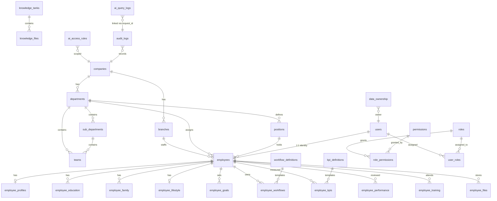

# 15 — Database Schema (PostgreSQL DDL)
## NEXUS OS — AI Workforce OS สำหรับ Saduak Suay Mai PCL

> **เอกสารฉบับสมบูรณ์ (Production-Grade Schema Specification)**
> เอกสารนี้คือ **Single Source of Truth** ของ schema ระดับฐานข้อมูลทั้งหมดสำหรับระบบ NEXUS OS ที่รองรับองค์กรคลินิกความงาม + ทันตกรรมแบบแฟรนไชส์ของบริษัท **Saduak Suay Mai PCL**
> ทุกตารางออกแบบบนหลักการ **deny-by-default, append-only audit, soft-delete + versioning, RBAC + ABAC + Data-Ownership** และ **4-tier Security Levels** (BASIC / MEDIUM / HARD / RESTRICTED)
> Target engine: **PostgreSQL 15+** (Railway `nexus-api` service ผ่าน `DATABASE_URL`)

---

## 0. ภาพรวมและหลักการออกแบบ (Design Principles)

### 0.1 สถานะปัจจุบันของ NEXUS OS (Grounding)

NEXUS OS ปัจจุบันมีประมาณ **~55 ตาราง** กระจายอยู่ใน schema files หลายไฟล์ (`db.ts`, `nexus-schema.ts`, `nexus-extended-schema.ts`, `nexus-full-schema.ts`, `nexus-ai-schema.ts`, `nexus-ops-schema.ts`, `nexus-entity-schema.ts`, `nexus-hr-schema.ts`, `nexus-hr-phase5/6-schema.ts`) โดยมีจุดอ่อนเชิงสถาปัตยกรรมที่เอกสารนี้แก้ไขแบบครบถ้วน:

| จุดอ่อนปัจจุบัน | การแก้ไขใน schema นี้ |
|---|---|
| ไม่มี `deleted_at` ใด ๆ ในทั้ง codebase (hard delete + CASCADE) | ทุก core table มี `deleted_at`, `deleted_by`, soft-delete pattern + `ON DELETE RESTRICT` |
| `audit_log` ไม่มี before/after, ไม่ append-only, ไม่มี hash-chain | `audit_logs` ใหม่: before/after JSON, `prev_hash`/`row_hash`, trigger ป้องกัน UPDATE/DELETE |
| ID เป็น `randomUUID()` TEXT (app-generated) | คงรูปแบบเดิม: `TEXT PRIMARY KEY DEFAULT gen_random_uuid()::text` เพื่อ backward-compat |
| ไม่มี `data_ownership` / RLS / policy engine | ตาราง `data_ownership` + `ai_access_rules` + `role_permissions` เป็น first-class |
| org เป็น free-text `users.department` | hierarchy referential: `companies → branches → departments → sub_departments → teams → positions → employees` |
| ไม่มี `ai_query_logs`, `consent_logs`, `login_logs`, `file_access_logs`, `permission_change_logs` | สร้างใหม่ครบทั้ง 5 log tables |

### 0.2 มาตรฐานคอลัมน์ร่วม (Mandatory Common Columns)

ทุก **core table** ต้องมีคอลัมน์มาตรฐานต่อไปนี้ (enforce ผ่าน convention + review):

```sql
-- STANDARD COLUMN CONTRACT (ทุก core table ต้องมีครบ)
id              TEXT        PRIMARY KEY DEFAULT gen_random_uuid()::text,
company_id      TEXT        NOT NULL REFERENCES companies(id) ON DELETE RESTRICT,
created_at      TIMESTAMPTZ NOT NULL DEFAULT now(),
updated_at      TIMESTAMPTZ NOT NULL DEFAULT now(),
deleted_at      TIMESTAMPTZ,                      -- NULL = ยังไม่ถูกลบ (soft-delete)
created_by      TEXT        REFERENCES users(id) ON DELETE SET NULL,
updated_by      TEXT        REFERENCES users(id) ON DELETE SET NULL,
deleted_by      TEXT        REFERENCES users(id) ON DELETE SET NULL,
is_active       BOOLEAN     NOT NULL DEFAULT TRUE,
version         INTEGER     NOT NULL DEFAULT 1 CHECK (version >= 1),   -- optimistic lock
security_level  security_level_t NOT NULL DEFAULT 'BASIC'
```

> **หมายเหตุ self-reference:** ตาราง `companies` และ `users` เป็น root tables — `company_id` ใน `companies` self-references และ `created_by/updated_by/deleted_by` ใน `users` อาจ NULL ได้ในระหว่าง bootstrap (seed แรกของระบบ)

### 0.3 ENUM Types และฟังก์ชันร่วม (สร้างก่อนทุกตาราง)

```sql
-- ============================================================
-- ENUM TYPES — NEW (ยังไม่มีใน NEXUS OS เดิมซึ่งใช้ TEXT + CHECK)
-- ============================================================
CREATE TYPE security_level_t AS ENUM ('BASIC','MEDIUM','HARD','RESTRICTED');

CREATE TYPE audit_action_t AS ENUM (
  'login','logout','login_failed','view','search','create','update','delete',
  'soft_delete','restore','upload','download','export','approve','reject',
  'permission_change','role_change','ai_query','ai_response',
  'failed_access','blocked_access','impersonate_start','impersonate_end',
  'consent_grant','consent_revoke','config_change'
);

CREATE TYPE audit_result_t AS ENUM ('success','failure','blocked','partial');

CREATE TYPE ai_decision_t  AS ENUM ('auto','suggest','human');
CREATE TYPE ai_provider_t  AS ENUM ('openai','claude','gemini','typhoon','internal');
CREATE TYPE grant_scope_t  AS ENUM ('company','branch','department','sub_department','team','position','self');
CREATE TYPE employment_status_t AS ENUM ('active','probation','suspended','on_leave','resigned','terminated');
CREATE TYPE consent_status_t AS ENUM ('granted','revoked','pending','expired');

-- ============================================================
-- AUTO updated_at TRIGGER FUNCTION — NEW
-- ============================================================
CREATE OR REPLACE FUNCTION set_updated_at()
RETURNS TRIGGER AS $$
BEGIN
  NEW.updated_at := now();
  IF (TG_OP = 'UPDATE') THEN
    -- บังคับ optimistic-lock: ทุก UPDATE ต้องเพิ่ม version
    IF NEW.version = OLD.version THEN
      NEW.version := OLD.version + 1;
    END IF;
  END IF;
  RETURN NEW;
END;
$$ LANGUAGE plpgsql;
```

> รูปแบบการผูก trigger (ใช้ซ้ำกับทุก core table):
> ```sql
> CREATE TRIGGER trg_<table>_updated BEFORE UPDATE ON <table>
>   FOR EACH ROW EXECUTE FUNCTION set_updated_at();
> ```

---

## 1. ORGANIZATION HIERARCHY (โครงสร้างองค์กร)

> ลำดับชั้น: **Company → Branch → Department → Sub-Department → Team/Unit → Position → Employee**
> แก้ปัญหา NEXUS เดิมที่ membership เป็น free-text `users.department` ให้กลายเป็น referential FK ทั้งสาย

### 1.1 `companies` — **EXISTING** (extend)

> มีอยู่แล้วใน `db.ts initSchema()` แต่ขาด common columns ครบชุด — เอกสารนี้กำหนดรูปแบบ production เต็ม (migration: ALTER เพิ่มคอลัมน์ที่ขาด)

```sql
-- EXISTING (core in db.ts) — EXTEND to full contract
CREATE TABLE IF NOT EXISTS companies (
  id              TEXT        PRIMARY KEY DEFAULT gen_random_uuid()::text,
  company_id      TEXT,                              -- self-ref (กลุ่มบริษัท/parent) NULL = top
  legal_name_th   TEXT        NOT NULL,
  legal_name_en   TEXT,
  brand_name      TEXT        NOT NULL,
  tax_id          TEXT        NOT NULL,              -- เลขผู้เสียภาษี 13 หลัก
  registration_no TEXT,
  country_code    CHAR(2)     NOT NULL DEFAULT 'TH',
  timezone        TEXT        NOT NULL DEFAULT 'Asia/Bangkok',
  settings        JSONB       NOT NULL DEFAULT '{}'::jsonb,  -- ai_decision_rights ฯลฯ
  created_at      TIMESTAMPTZ NOT NULL DEFAULT now(),
  updated_at      TIMESTAMPTZ NOT NULL DEFAULT now(),
  deleted_at      TIMESTAMPTZ,
  created_by      TEXT,
  updated_by      TEXT,
  deleted_by      TEXT,
  is_active       BOOLEAN     NOT NULL DEFAULT TRUE,
  version         INTEGER     NOT NULL DEFAULT 1 CHECK (version >= 1),
  security_level  security_level_t NOT NULL DEFAULT 'MEDIUM',
  CONSTRAINT companies_self_fk FOREIGN KEY (company_id) REFERENCES companies(id) ON DELETE RESTRICT,
  CONSTRAINT companies_taxid_chk CHECK (char_length(tax_id) = 13)
);
CREATE UNIQUE INDEX IF NOT EXISTS uq_companies_taxid ON companies(tax_id) WHERE deleted_at IS NULL;
CREATE INDEX IF NOT EXISTS ix_companies_active ON companies(is_active) WHERE deleted_at IS NULL;
```

### 1.2 `branches` — **EXISTING** (migration v8 → extend)

> ตาราง `branches` ถูกเพิ่มใน migration v8 แล้ว แต่ยังไม่ wired เข้า RBAC — เอกสารนี้ขยายให้ครบ contract และผูกเข้า ABAC

```sql
-- EXISTING (migration v8) — EXTEND
CREATE TABLE IF NOT EXISTS branches (
  id              TEXT        PRIMARY KEY DEFAULT gen_random_uuid()::text,
  company_id      TEXT        NOT NULL REFERENCES companies(id) ON DELETE RESTRICT,
  branch_code     TEXT        NOT NULL,              -- e.g. 'BKK-01'
  name_th         TEXT        NOT NULL,
  name_en         TEXT,
  branch_type     TEXT        NOT NULL DEFAULT 'clinic'
                   CHECK (branch_type IN ('hq','clinic','franchise','warehouse','virtual')),
  is_franchise    BOOLEAN     NOT NULL DEFAULT FALSE,
  franchise_owner TEXT,                              -- ชื่อผู้รับสิทธิ์แฟรนไชส์ [ASSUMPTION field]
  address_json    JSONB       NOT NULL DEFAULT '{}'::jsonb,
  province        TEXT,
  phone           TEXT,
  geo_lat         NUMERIC(9,6),
  geo_lng         NUMERIC(9,6),
  open_date       DATE,
  created_at      TIMESTAMPTZ NOT NULL DEFAULT now(),
  updated_at      TIMESTAMPTZ NOT NULL DEFAULT now(),
  deleted_at      TIMESTAMPTZ,
  created_by      TEXT REFERENCES users(id) ON DELETE SET NULL,
  updated_by      TEXT REFERENCES users(id) ON DELETE SET NULL,
  deleted_by      TEXT REFERENCES users(id) ON DELETE SET NULL,
  is_active       BOOLEAN     NOT NULL DEFAULT TRUE,
  version         INTEGER     NOT NULL DEFAULT 1 CHECK (version >= 1),
  security_level  security_level_t NOT NULL DEFAULT 'MEDIUM',
  CONSTRAINT uq_branches_code UNIQUE (company_id, branch_code)
);
CREATE INDEX IF NOT EXISTS ix_branches_company ON branches(company_id) WHERE deleted_at IS NULL;
CREATE INDEX IF NOT EXISTS ix_branches_type ON branches(company_id, branch_type) WHERE deleted_at IS NULL;
```

### 1.3 `departments` — **EXISTING** (`nexus-extended-schema.ts` → re-modeled)

> 10 แผนกตาม global rule: CEO Office, Operations, Marketing, Medical, Finance & Accounting, People (HR), IT, Warehouse & Purchasing, Franchise, Dental

```sql
-- EXISTING (nexus-extended-schema.ts) — RE-MODELED to full contract + referential
CREATE TABLE IF NOT EXISTS departments (
  id              TEXT        PRIMARY KEY DEFAULT gen_random_uuid()::text,
  company_id      TEXT        NOT NULL REFERENCES companies(id) ON DELETE RESTRICT,
  dept_code       TEXT        NOT NULL,              -- 'CEO','OPS','MKT','MED','FIN','HR','IT','WH','FRX','DEN'
  name_th         TEXT        NOT NULL,
  name_en         TEXT        NOT NULL,
  system_role     TEXT        NOT NULL,              -- map กับ rbac.ts ROLES (ceo,operations,...)
  parent_dept_id  TEXT REFERENCES departments(id) ON DELETE RESTRICT,  -- ปกติ NULL
  head_employee_id TEXT,                              -- FK ผูกภายหลัง (deferred ด้านล่าง)
  default_security_level security_level_t NOT NULL DEFAULT 'MEDIUM',
  sort_order      INTEGER     NOT NULL DEFAULT 0,
  created_at      TIMESTAMPTZ NOT NULL DEFAULT now(),
  updated_at      TIMESTAMPTZ NOT NULL DEFAULT now(),
  deleted_at      TIMESTAMPTZ,
  created_by      TEXT REFERENCES users(id) ON DELETE SET NULL,
  updated_by      TEXT REFERENCES users(id) ON DELETE SET NULL,
  deleted_by      TEXT REFERENCES users(id) ON DELETE SET NULL,
  is_active       BOOLEAN     NOT NULL DEFAULT TRUE,
  version         INTEGER     NOT NULL DEFAULT 1 CHECK (version >= 1),
  security_level  security_level_t NOT NULL DEFAULT 'MEDIUM',
  CONSTRAINT uq_departments_code UNIQUE (company_id, dept_code)
);
CREATE INDEX IF NOT EXISTS ix_departments_company ON departments(company_id) WHERE deleted_at IS NULL;
CREATE INDEX IF NOT EXISTS ix_departments_role ON departments(company_id, system_role) WHERE deleted_at IS NULL;
```

> **[ASSUMPTION]** แผนก Medical และ Dental ตั้ง `default_security_level = 'RESTRICTED'` เนื่องจากเกี่ยวข้องกับเวชระเบียน/ข้อมูลผู้ป่วย; Finance ตั้ง `'HARD'` (payroll/contract เป็น RESTRICTED ที่ระดับตาราง)

### 1.4 `sub_departments` — **NEW**

> NEXUS เดิมเก็บ sub-unit เป็น `org_units` level-3 เท่านั้น — ตารางนี้ทำให้เป็น first-class (เช่น Operations → Customer Support, Admin, Personal Care, Telesales)

```sql
-- NEW
CREATE TABLE IF NOT EXISTS sub_departments (
  id              TEXT        PRIMARY KEY DEFAULT gen_random_uuid()::text,
  company_id      TEXT        NOT NULL REFERENCES companies(id) ON DELETE RESTRICT,
  department_id   TEXT        NOT NULL REFERENCES departments(id) ON DELETE RESTRICT,
  sub_code        TEXT        NOT NULL,              -- 'OPS-CS','OPS-ADM','OPS-PC','OPS-TS'
  name_th         TEXT        NOT NULL,
  name_en         TEXT,
  head_employee_id TEXT,
  default_security_level security_level_t NOT NULL DEFAULT 'MEDIUM',
  sort_order      INTEGER     NOT NULL DEFAULT 0,
  created_at      TIMESTAMPTZ NOT NULL DEFAULT now(),
  updated_at      TIMESTAMPTZ NOT NULL DEFAULT now(),
  deleted_at      TIMESTAMPTZ,
  created_by      TEXT REFERENCES users(id) ON DELETE SET NULL,
  updated_by      TEXT REFERENCES users(id) ON DELETE SET NULL,
  deleted_by      TEXT REFERENCES users(id) ON DELETE SET NULL,
  is_active       BOOLEAN     NOT NULL DEFAULT TRUE,
  version         INTEGER     NOT NULL DEFAULT 1 CHECK (version >= 1),
  security_level  security_level_t NOT NULL DEFAULT 'MEDIUM',
  CONSTRAINT uq_subdept_code UNIQUE (company_id, sub_code)
);
CREATE INDEX IF NOT EXISTS ix_subdept_dept ON sub_departments(department_id) WHERE deleted_at IS NULL;
CREATE INDEX IF NOT EXISTS ix_subdept_company ON sub_departments(company_id) WHERE deleted_at IS NULL;
```

### 1.5 `teams` — **NEW**

```sql
-- NEW
CREATE TABLE IF NOT EXISTS teams (
  id              TEXT        PRIMARY KEY DEFAULT gen_random_uuid()::text,
  company_id      TEXT        NOT NULL REFERENCES companies(id) ON DELETE RESTRICT,
  sub_department_id TEXT      REFERENCES sub_departments(id) ON DELETE RESTRICT,
  department_id   TEXT        NOT NULL REFERENCES departments(id) ON DELETE RESTRICT,
  branch_id       TEXT        REFERENCES branches(id) ON DELETE RESTRICT,  -- ทีมประจำสาขา (NULL = ส่วนกลาง)
  team_code       TEXT        NOT NULL,
  name_th         TEXT        NOT NULL,
  name_en         TEXT,
  lead_employee_id TEXT,
  default_security_level security_level_t NOT NULL DEFAULT 'MEDIUM',
  created_at      TIMESTAMPTZ NOT NULL DEFAULT now(),
  updated_at      TIMESTAMPTZ NOT NULL DEFAULT now(),
  deleted_at      TIMESTAMPTZ,
  created_by      TEXT REFERENCES users(id) ON DELETE SET NULL,
  updated_by      TEXT REFERENCES users(id) ON DELETE SET NULL,
  deleted_by      TEXT REFERENCES users(id) ON DELETE SET NULL,
  is_active       BOOLEAN     NOT NULL DEFAULT TRUE,
  version         INTEGER     NOT NULL DEFAULT 1 CHECK (version >= 1),
  security_level  security_level_t NOT NULL DEFAULT 'MEDIUM',
  CONSTRAINT uq_teams_code UNIQUE (company_id, team_code)
);
CREATE INDEX IF NOT EXISTS ix_teams_subdept ON teams(sub_department_id) WHERE deleted_at IS NULL;
CREATE INDEX IF NOT EXISTS ix_teams_branch ON teams(branch_id) WHERE deleted_at IS NULL;
CREATE INDEX IF NOT EXISTS ix_teams_company ON teams(company_id) WHERE deleted_at IS NULL;
```

### 1.6 `positions` — **EXISTING** (`nexus-hr-schema.ts` → extend)

> NEXUS เดิมมี `positions(id, company_id, code, name)` แบบ flat — ขยายให้มี job grade, การผูกแผนก และ security baseline

```sql
-- EXISTING (nexus-hr-schema.ts) — EXTEND
CREATE TABLE IF NOT EXISTS positions (
  id              TEXT        PRIMARY KEY DEFAULT gen_random_uuid()::text,
  company_id      TEXT        NOT NULL REFERENCES companies(id) ON DELETE RESTRICT,
  department_id   TEXT        NOT NULL REFERENCES departments(id) ON DELETE RESTRICT,
  sub_department_id TEXT      REFERENCES sub_departments(id) ON DELETE RESTRICT,
  position_code   TEXT        NOT NULL,
  name_th         TEXT        NOT NULL,
  name_en         TEXT,
  job_grade       TEXT,                              -- [ASSUMPTION] เช่น 'G1'..'G8'
  job_family      TEXT,                              -- 'clinical','sales','admin','exec'...
  is_manager      BOOLEAN     NOT NULL DEFAULT FALSE,
  reports_to_position_id TEXT REFERENCES positions(id) ON DELETE SET NULL,
  default_role    TEXT        NOT NULL DEFAULT 'staff',  -- map rbac.ts ROLES
  default_security_level security_level_t NOT NULL DEFAULT 'BASIC',
  headcount_cap   INTEGER     CHECK (headcount_cap IS NULL OR headcount_cap >= 0),
  created_at      TIMESTAMPTZ NOT NULL DEFAULT now(),
  updated_at      TIMESTAMPTZ NOT NULL DEFAULT now(),
  deleted_at      TIMESTAMPTZ,
  created_by      TEXT REFERENCES users(id) ON DELETE SET NULL,
  updated_by      TEXT REFERENCES users(id) ON DELETE SET NULL,
  deleted_by      TEXT REFERENCES users(id) ON DELETE SET NULL,
  is_active       BOOLEAN     NOT NULL DEFAULT TRUE,
  version         INTEGER     NOT NULL DEFAULT 1 CHECK (version >= 1),
  security_level  security_level_t NOT NULL DEFAULT 'MEDIUM',
  CONSTRAINT uq_positions_code UNIQUE (company_id, position_code)
);
CREATE INDEX IF NOT EXISTS ix_positions_dept ON positions(department_id) WHERE deleted_at IS NULL;
CREATE INDEX IF NOT EXISTS ix_positions_company ON positions(company_id) WHERE deleted_at IS NULL;
```

### 1.7 `users` — **EXISTING** (auth root, extend)

> ตาราง auth/login เดิม — คงไว้เป็น identity root และผูกกับ `employees` แบบ 1:1

```sql
-- EXISTING (core in db.ts) — EXTEND (security hardening fields)
CREATE TABLE IF NOT EXISTS users (
  id              TEXT        PRIMARY KEY DEFAULT gen_random_uuid()::text,
  company_id      TEXT        NOT NULL REFERENCES companies(id) ON DELETE RESTRICT,
  email           TEXT        NOT NULL,
  password_hash   TEXT        NOT NULL,
  name            TEXT        NOT NULL,
  role            TEXT        NOT NULL DEFAULT 'staff',   -- denormalized primary role (rbac.ts)
  department      TEXT,                                   -- DEPRECATED: ใช้ employees.department_id แทน
  line_user_id    TEXT,
  email_notify    BOOLEAN     NOT NULL DEFAULT TRUE,
  mfa_enabled     BOOLEAN     NOT NULL DEFAULT FALSE,     -- NEW
  mfa_secret      TEXT,                                   -- NEW (encrypted)
  failed_login_count INTEGER  NOT NULL DEFAULT 0,         -- NEW (lockout)
  locked_until    TIMESTAMPTZ,                            -- NEW
  last_login_at   TIMESTAMPTZ,                            -- NEW
  password_changed_at TIMESTAMPTZ,                        -- NEW
  created_at      TIMESTAMPTZ NOT NULL DEFAULT now(),
  updated_at      TIMESTAMPTZ NOT NULL DEFAULT now(),
  deleted_at      TIMESTAMPTZ,
  created_by      TEXT,
  updated_by      TEXT,
  deleted_by      TEXT,
  is_active       BOOLEAN     NOT NULL DEFAULT TRUE,
  version         INTEGER     NOT NULL DEFAULT 1 CHECK (version >= 1),
  security_level  security_level_t NOT NULL DEFAULT 'BASIC',
  CONSTRAINT users_created_by_fk FOREIGN KEY (created_by) REFERENCES users(id) ON DELETE SET NULL,
  CONSTRAINT users_updated_by_fk FOREIGN KEY (updated_by) REFERENCES users(id) ON DELETE SET NULL,
  CONSTRAINT users_deleted_by_fk FOREIGN KEY (deleted_by) REFERENCES users(id) ON DELETE SET NULL
);
CREATE UNIQUE INDEX IF NOT EXISTS uq_users_email ON users(company_id, lower(email)) WHERE deleted_at IS NULL;
CREATE INDEX IF NOT EXISTS ix_users_role ON users(company_id, role) WHERE deleted_at IS NULL;
CREATE INDEX IF NOT EXISTS ix_users_line ON users(line_user_id) WHERE line_user_id IS NOT NULL;
```

### 1.8 `employees` — **NEW** (HR employment record, แยกจาก `users` auth)

> NEXUS เดิมมี `employee_profiles` ผูก `user_id` PRIMARY KEY — เอกสารนี้ยกระดับเป็น `employees` ที่เป็น core entity ของลำดับชั้น ABAC โดย 1:1 กับ `users`

```sql
-- NEW (supersedes ad-hoc employee_profiles for org membership)
CREATE TABLE IF NOT EXISTS employees (
  id              TEXT        PRIMARY KEY DEFAULT gen_random_uuid()::text,
  company_id      TEXT        NOT NULL REFERENCES companies(id) ON DELETE RESTRICT,
  user_id         TEXT        NOT NULL REFERENCES users(id) ON DELETE RESTRICT,
  employee_code   TEXT        NOT NULL,              -- 'EMP-0001'
  branch_id       TEXT        REFERENCES branches(id) ON DELETE RESTRICT,
  department_id   TEXT        NOT NULL REFERENCES departments(id) ON DELETE RESTRICT,
  sub_department_id TEXT      REFERENCES sub_departments(id) ON DELETE RESTRICT,
  team_id         TEXT        REFERENCES teams(id) ON DELETE RESTRICT,
  position_id     TEXT        NOT NULL REFERENCES positions(id) ON DELETE RESTRICT,
  manager_employee_id TEXT    REFERENCES employees(id) ON DELETE SET NULL,  -- สายบังคับบัญชา
  first_name_th   TEXT        NOT NULL,
  last_name_th    TEXT        NOT NULL,
  first_name_en   TEXT,
  last_name_en    TEXT,
  nickname        TEXT,
  national_id     TEXT,                              -- RESTRICTED PII (เลขบัตร ปชช.)
  phone           TEXT,
  personal_email  TEXT,
  hire_date       DATE,
  probation_end_date DATE,
  terminate_date  DATE,
  employment_status employment_status_t NOT NULL DEFAULT 'probation',
  employment_type TEXT        NOT NULL DEFAULT 'full_time'
                   CHECK (employment_type IN ('full_time','part_time','contract','intern','freelance')),
  created_at      TIMESTAMPTZ NOT NULL DEFAULT now(),
  updated_at      TIMESTAMPTZ NOT NULL DEFAULT now(),
  deleted_at      TIMESTAMPTZ,
  created_by      TEXT REFERENCES users(id) ON DELETE SET NULL,
  updated_by      TEXT REFERENCES users(id) ON DELETE SET NULL,
  deleted_by      TEXT REFERENCES users(id) ON DELETE SET NULL,
  is_active       BOOLEAN     NOT NULL DEFAULT TRUE,
  version         INTEGER     NOT NULL DEFAULT 1 CHECK (version >= 1),
  security_level  security_level_t NOT NULL DEFAULT 'HARD',  -- HR record = HARD baseline
  CONSTRAINT uq_employees_code UNIQUE (company_id, employee_code),
  CONSTRAINT uq_employees_user UNIQUE (user_id),
  CONSTRAINT employees_terminate_chk CHECK (terminate_date IS NULL OR hire_date IS NULL OR terminate_date >= hire_date)
);
CREATE INDEX IF NOT EXISTS ix_employees_dept ON employees(department_id) WHERE deleted_at IS NULL;
CREATE INDEX IF NOT EXISTS ix_employees_branch ON employees(branch_id) WHERE deleted_at IS NULL;
CREATE INDEX IF NOT EXISTS ix_employees_manager ON employees(manager_employee_id) WHERE deleted_at IS NULL;
CREATE INDEX IF NOT EXISTS ix_employees_status ON employees(company_id, employment_status) WHERE deleted_at IS NULL;
CREATE INDEX IF NOT EXISTS ix_employees_hierarchy
  ON employees(company_id, branch_id, department_id, sub_department_id, team_id) WHERE deleted_at IS NULL;
```

### 1.9 Deferred FKs (ผูก head/lead หลังสร้าง `employees`)

```sql
-- NEW — deferred FKs (org heads reference employees)
ALTER TABLE departments
  ADD CONSTRAINT fk_dept_head FOREIGN KEY (head_employee_id) REFERENCES employees(id) ON DELETE SET NULL;
ALTER TABLE sub_departments
  ADD CONSTRAINT fk_subdept_head FOREIGN KEY (head_employee_id) REFERENCES employees(id) ON DELETE SET NULL;
ALTER TABLE teams
  ADD CONSTRAINT fk_teams_lead FOREIGN KEY (lead_employee_id) REFERENCES employees(id) ON DELETE SET NULL;
```

---

## 2. EMPLOYEE 360° PROFILE (โปรไฟล์พนักงานเชิงลึก)

> ชุดตารางขยายโปรไฟล์พนักงานสำหรับ AI Workforce OS — ครอบคลุมประวัติ, การศึกษา, ครอบครัว, ไลฟ์สไตล์, เป้าหมาย, workflow, KPI, performance, training, files

### 2.1 `employee_profiles` — **EXISTING** (`nexus-full/hr-schema.ts` → re-modeled)

```sql
-- EXISTING (nexus-hr-schema.ts: was user_id PK) — RE-MODELED to employee_id FK
CREATE TABLE IF NOT EXISTS employee_profiles (
  id              TEXT        PRIMARY KEY DEFAULT gen_random_uuid()::text,
  company_id      TEXT        NOT NULL REFERENCES companies(id) ON DELETE RESTRICT,
  employee_id     TEXT        NOT NULL REFERENCES employees(id) ON DELETE RESTRICT,
  date_of_birth   DATE,                              -- RESTRICTED
  gender          TEXT        CHECK (gender IN ('male','female','other','undisclosed')),
  marital_status  TEXT,
  nationality     TEXT        DEFAULT 'Thai',
  religion        TEXT,
  blood_type      TEXT,
  address_json    JSONB       NOT NULL DEFAULT '{}'::jsonb,
  emergency_contact_json JSONB NOT NULL DEFAULT '{}'::jsonb,
  bank_name       TEXT,
  bank_account    TEXT,                              -- RESTRICTED
  personal_tax_id TEXT,                              -- RESTRICTED
  social_security_no TEXT,                           -- RESTRICTED
  profile_photo_url TEXT,
  bio_th          TEXT,
  created_at      TIMESTAMPTZ NOT NULL DEFAULT now(),
  updated_at      TIMESTAMPTZ NOT NULL DEFAULT now(),
  deleted_at      TIMESTAMPTZ,
  created_by      TEXT REFERENCES users(id) ON DELETE SET NULL,
  updated_by      TEXT REFERENCES users(id) ON DELETE SET NULL,
  deleted_by      TEXT REFERENCES users(id) ON DELETE SET NULL,
  is_active       BOOLEAN     NOT NULL DEFAULT TRUE,
  version         INTEGER     NOT NULL DEFAULT 1 CHECK (version >= 1),
  security_level  security_level_t NOT NULL DEFAULT 'RESTRICTED',
  CONSTRAINT uq_emp_profile UNIQUE (employee_id)
);
CREATE INDEX IF NOT EXISTS ix_emp_profile_company ON employee_profiles(company_id) WHERE deleted_at IS NULL;
```

### 2.2 `employee_education` — **NEW**

```sql
-- NEW
CREATE TABLE IF NOT EXISTS employee_education (
  id              TEXT        PRIMARY KEY DEFAULT gen_random_uuid()::text,
  company_id      TEXT        NOT NULL REFERENCES companies(id) ON DELETE RESTRICT,
  employee_id     TEXT        NOT NULL REFERENCES employees(id) ON DELETE RESTRICT,
  level           TEXT        NOT NULL,              -- 'high_school','bachelor','master','phd','certificate'
  institution     TEXT        NOT NULL,
  field_of_study  TEXT,
  degree          TEXT,
  gpa             NUMERIC(3,2) CHECK (gpa IS NULL OR (gpa >= 0 AND gpa <= 4)),
  start_year      INTEGER,
  end_year        INTEGER,
  is_verified     BOOLEAN     NOT NULL DEFAULT FALSE,
  license_no      TEXT,                              -- ใบประกอบวิชาชีพ (แพทย์/ทันตแพทย์/พยาบาล)
  license_expiry  DATE,
  created_at      TIMESTAMPTZ NOT NULL DEFAULT now(),
  updated_at      TIMESTAMPTZ NOT NULL DEFAULT now(),
  deleted_at      TIMESTAMPTZ,
  created_by      TEXT REFERENCES users(id) ON DELETE SET NULL,
  updated_by      TEXT REFERENCES users(id) ON DELETE SET NULL,
  deleted_by      TEXT REFERENCES users(id) ON DELETE SET NULL,
  is_active       BOOLEAN     NOT NULL DEFAULT TRUE,
  version         INTEGER     NOT NULL DEFAULT 1 CHECK (version >= 1),
  security_level  security_level_t NOT NULL DEFAULT 'HARD',
  CONSTRAINT edu_year_chk CHECK (end_year IS NULL OR start_year IS NULL OR end_year >= start_year)
);
CREATE INDEX IF NOT EXISTS ix_edu_employee ON employee_education(employee_id) WHERE deleted_at IS NULL;
```

### 2.3 `employee_family` — **NEW**

```sql
-- NEW
CREATE TABLE IF NOT EXISTS employee_family (
  id              TEXT        PRIMARY KEY DEFAULT gen_random_uuid()::text,
  company_id      TEXT        NOT NULL REFERENCES companies(id) ON DELETE RESTRICT,
  employee_id     TEXT        NOT NULL REFERENCES employees(id) ON DELETE RESTRICT,
  relationship    TEXT        NOT NULL,              -- 'spouse','child','parent','sibling'
  full_name       TEXT        NOT NULL,
  national_id     TEXT,                              -- RESTRICTED
  date_of_birth   DATE,
  occupation      TEXT,
  is_dependent    BOOLEAN     NOT NULL DEFAULT FALSE,  -- ลดหย่อนภาษี
  is_beneficiary  BOOLEAN     NOT NULL DEFAULT FALSE,  -- ผู้รับผลประโยชน์ประกัน
  phone           TEXT,
  created_at      TIMESTAMPTZ NOT NULL DEFAULT now(),
  updated_at      TIMESTAMPTZ NOT NULL DEFAULT now(),
  deleted_at      TIMESTAMPTZ,
  created_by      TEXT REFERENCES users(id) ON DELETE SET NULL,
  updated_by      TEXT REFERENCES users(id) ON DELETE SET NULL,
  deleted_by      TEXT REFERENCES users(id) ON DELETE SET NULL,
  is_active       BOOLEAN     NOT NULL DEFAULT TRUE,
  version         INTEGER     NOT NULL DEFAULT 1 CHECK (version >= 1),
  security_level  security_level_t NOT NULL DEFAULT 'RESTRICTED'
);
CREATE INDEX IF NOT EXISTS ix_family_employee ON employee_family(employee_id) WHERE deleted_at IS NULL;
```

### 2.4 `employee_lifestyle` — **NEW**

> ข้อมูลไลฟ์สไตล์/ความสนใจ เพื่อให้ AI ช่วยจับคู่งาน, well-being, สวัสดิการ (ความยินยอมผ่าน `consent_logs`)

```sql
-- NEW
CREATE TABLE IF NOT EXISTS employee_lifestyle (
  id              TEXT        PRIMARY KEY DEFAULT gen_random_uuid()::text,
  company_id      TEXT        NOT NULL REFERENCES companies(id) ON DELETE RESTRICT,
  employee_id     TEXT        NOT NULL REFERENCES employees(id) ON DELETE RESTRICT,
  interests       JSONB       NOT NULL DEFAULT '[]'::jsonb,   -- ['fitness','reading',...]
  hobbies         JSONB       NOT NULL DEFAULT '[]'::jsonb,
  languages       JSONB       NOT NULL DEFAULT '[]'::jsonb,   -- [{lang,level}]
  food_preference TEXT,                              -- งานเลี้ยง/แพ้อาหาร
  health_notes    TEXT,                              -- RESTRICTED (well-being voluntary)
  preferred_work_style TEXT,
  personality_type TEXT,                             -- MBTI/DISC [ASSUMPTION optional]
  consent_id      TEXT,                              -- ลิงก์ consent_logs (FK ภายหลัง)
  created_at      TIMESTAMPTZ NOT NULL DEFAULT now(),
  updated_at      TIMESTAMPTZ NOT NULL DEFAULT now(),
  deleted_at      TIMESTAMPTZ,
  created_by      TEXT REFERENCES users(id) ON DELETE SET NULL,
  updated_by      TEXT REFERENCES users(id) ON DELETE SET NULL,
  deleted_by      TEXT REFERENCES users(id) ON DELETE SET NULL,
  is_active       BOOLEAN     NOT NULL DEFAULT TRUE,
  version         INTEGER     NOT NULL DEFAULT 1 CHECK (version >= 1),
  security_level  security_level_t NOT NULL DEFAULT 'RESTRICTED',
  CONSTRAINT uq_lifestyle_employee UNIQUE (employee_id)
);
CREATE INDEX IF NOT EXISTS ix_lifestyle_employee ON employee_lifestyle(employee_id) WHERE deleted_at IS NULL;
```

### 2.5 `employee_goals` — **NEW**

```sql
-- NEW
CREATE TABLE IF NOT EXISTS employee_goals (
  id              TEXT        PRIMARY KEY DEFAULT gen_random_uuid()::text,
  company_id      TEXT        NOT NULL REFERENCES companies(id) ON DELETE RESTRICT,
  employee_id     TEXT        NOT NULL REFERENCES employees(id) ON DELETE RESTRICT,
  period          TEXT        NOT NULL,              -- 'Q1-2026','2026'
  goal_type       TEXT        NOT NULL DEFAULT 'okr' CHECK (goal_type IN ('okr','smart','idp','career')),
  title           TEXT        NOT NULL,
  description     TEXT,
  target_value    NUMERIC,
  current_value   NUMERIC     DEFAULT 0,
  unit            TEXT,
  weight          NUMERIC(5,2) DEFAULT 0 CHECK (weight >= 0 AND weight <= 100),
  status          TEXT        NOT NULL DEFAULT 'active'
                   CHECK (status IN ('draft','active','at_risk','achieved','missed','cancelled')),
  due_date        DATE,
  reviewer_employee_id TEXT REFERENCES employees(id) ON DELETE SET NULL,
  created_at      TIMESTAMPTZ NOT NULL DEFAULT now(),
  updated_at      TIMESTAMPTZ NOT NULL DEFAULT now(),
  deleted_at      TIMESTAMPTZ,
  created_by      TEXT REFERENCES users(id) ON DELETE SET NULL,
  updated_by      TEXT REFERENCES users(id) ON DELETE SET NULL,
  deleted_by      TEXT REFERENCES users(id) ON DELETE SET NULL,
  is_active       BOOLEAN     NOT NULL DEFAULT TRUE,
  version         INTEGER     NOT NULL DEFAULT 1 CHECK (version >= 1),
  security_level  security_level_t NOT NULL DEFAULT 'HARD'
);
CREATE INDEX IF NOT EXISTS ix_goals_employee ON employee_goals(employee_id, period) WHERE deleted_at IS NULL;
```

### 2.6 `employee_workflows` — **NEW**

> งาน/ขั้นตอนที่พนักงานรับผิดชอบประจำ (instance ของ `workflow_definitions`)

```sql
-- NEW
CREATE TABLE IF NOT EXISTS employee_workflows (
  id              TEXT        PRIMARY KEY DEFAULT gen_random_uuid()::text,
  company_id      TEXT        NOT NULL REFERENCES companies(id) ON DELETE RESTRICT,
  employee_id     TEXT        NOT NULL REFERENCES employees(id) ON DELETE RESTRICT,
  workflow_def_id TEXT        REFERENCES workflow_definitions(id) ON DELETE SET NULL,
  name            TEXT        NOT NULL,
  frequency       TEXT        CHECK (frequency IN ('daily','weekly','monthly','adhoc','per_case')),
  responsibility_pct NUMERIC(5,2) DEFAULT 0 CHECK (responsibility_pct >= 0 AND responsibility_pct <= 100),
  sla_minutes     INTEGER,
  is_ai_assisted  BOOLEAN     NOT NULL DEFAULT FALSE,
  ai_decision     ai_decision_t NOT NULL DEFAULT 'human',
  status          TEXT        NOT NULL DEFAULT 'active',
  created_at      TIMESTAMPTZ NOT NULL DEFAULT now(),
  updated_at      TIMESTAMPTZ NOT NULL DEFAULT now(),
  deleted_at      TIMESTAMPTZ,
  created_by      TEXT REFERENCES users(id) ON DELETE SET NULL,
  updated_by      TEXT REFERENCES users(id) ON DELETE SET NULL,
  deleted_by      TEXT REFERENCES users(id) ON DELETE SET NULL,
  is_active       BOOLEAN     NOT NULL DEFAULT TRUE,
  version         INTEGER     NOT NULL DEFAULT 1 CHECK (version >= 1),
  security_level  security_level_t NOT NULL DEFAULT 'MEDIUM'
);
CREATE INDEX IF NOT EXISTS ix_empwf_employee ON employee_workflows(employee_id) WHERE deleted_at IS NULL;
CREATE INDEX IF NOT EXISTS ix_empwf_def ON employee_workflows(workflow_def_id) WHERE deleted_at IS NULL;
```

### 2.7 `employee_kpis` — **EXISTING-ish** (`kpi_entries` → re-modeled to `employee_kpis`)

```sql
-- EXISTING (kpi_entries in nexus-full-schema.ts) — RE-MODELED + linked to kpi_definitions
CREATE TABLE IF NOT EXISTS employee_kpis (
  id              TEXT        PRIMARY KEY DEFAULT gen_random_uuid()::text,
  company_id      TEXT        NOT NULL REFERENCES companies(id) ON DELETE RESTRICT,
  employee_id     TEXT        NOT NULL REFERENCES employees(id) ON DELETE RESTRICT,
  kpi_def_id      TEXT        NOT NULL REFERENCES kpi_definitions(id) ON DELETE RESTRICT,
  branch_code     TEXT,                              -- คงไว้เพื่อ backward-compat (migration v?)
  period          TEXT        NOT NULL,              -- 'YYYY-MM'
  target_value    NUMERIC,
  actual_value    NUMERIC,
  achievement_pct NUMERIC(6,2),
  score           NUMERIC(5,2),
  weight          NUMERIC(5,2) DEFAULT 0 CHECK (weight >= 0 AND weight <= 100),
  source          TEXT        NOT NULL DEFAULT 'manual' CHECK (source IN ('manual','system','ai','import')),
  verified_by     TEXT REFERENCES employees(id) ON DELETE SET NULL,
  created_at      TIMESTAMPTZ NOT NULL DEFAULT now(),
  updated_at      TIMESTAMPTZ NOT NULL DEFAULT now(),
  deleted_at      TIMESTAMPTZ,
  created_by      TEXT REFERENCES users(id) ON DELETE SET NULL,
  updated_by      TEXT REFERENCES users(id) ON DELETE SET NULL,
  deleted_by      TEXT REFERENCES users(id) ON DELETE SET NULL,
  is_active       BOOLEAN     NOT NULL DEFAULT TRUE,
  version         INTEGER     NOT NULL DEFAULT 1 CHECK (version >= 1),
  security_level  security_level_t NOT NULL DEFAULT 'HARD',
  CONSTRAINT uq_emp_kpi UNIQUE (employee_id, kpi_def_id, period)
);
CREATE INDEX IF NOT EXISTS ix_empkpi_period ON employee_kpis(company_id, period) WHERE deleted_at IS NULL;
CREATE INDEX IF NOT EXISTS ix_empkpi_employee ON employee_kpis(employee_id, period) WHERE deleted_at IS NULL;
```

### 2.8 `employee_performance` — **NEW**

> ผลประเมินรอบ (รวม AI evaluation = RESTRICTED)

```sql
-- NEW
CREATE TABLE IF NOT EXISTS employee_performance (
  id              TEXT        PRIMARY KEY DEFAULT gen_random_uuid()::text,
  company_id      TEXT        NOT NULL REFERENCES companies(id) ON DELETE RESTRICT,
  employee_id     TEXT        NOT NULL REFERENCES employees(id) ON DELETE RESTRICT,
  review_period   TEXT        NOT NULL,              -- 'H1-2026'
  review_type     TEXT        NOT NULL DEFAULT 'periodic'
                   CHECK (review_type IN ('probation','periodic','annual','pip','ai_eval')),
  overall_score   NUMERIC(5,2) CHECK (overall_score IS NULL OR (overall_score >= 0 AND overall_score <= 100)),
  rating_label    TEXT,                              -- 'exceeds','meets','below'
  kpi_score       NUMERIC(5,2),
  competency_score NUMERIC(5,2),
  reviewer_employee_id TEXT REFERENCES employees(id) ON DELETE SET NULL,
  reviewer_comment TEXT,                             -- RESTRICTED (manager/HR only)
  employee_ack    BOOLEAN     NOT NULL DEFAULT FALSE,
  is_ai_generated BOOLEAN     NOT NULL DEFAULT FALSE,
  ai_request_id   TEXT,                              -- link ai_query_logs.request_id
  calibrated      BOOLEAN     NOT NULL DEFAULT FALSE,
  created_at      TIMESTAMPTZ NOT NULL DEFAULT now(),
  updated_at      TIMESTAMPTZ NOT NULL DEFAULT now(),
  deleted_at      TIMESTAMPTZ,
  created_by      TEXT REFERENCES users(id) ON DELETE SET NULL,
  updated_by      TEXT REFERENCES users(id) ON DELETE SET NULL,
  deleted_by      TEXT REFERENCES users(id) ON DELETE SET NULL,
  is_active       BOOLEAN     NOT NULL DEFAULT TRUE,
  version         INTEGER     NOT NULL DEFAULT 1 CHECK (version >= 1),
  security_level  security_level_t NOT NULL DEFAULT 'RESTRICTED',
  CONSTRAINT uq_emp_perf UNIQUE (employee_id, review_period, review_type)
);
CREATE INDEX IF NOT EXISTS ix_perf_employee ON employee_performance(employee_id) WHERE deleted_at IS NULL;
```

### 2.9 `employee_training` — **NEW**

```sql
-- NEW
CREATE TABLE IF NOT EXISTS employee_training (
  id              TEXT        PRIMARY KEY DEFAULT gen_random_uuid()::text,
  company_id      TEXT        NOT NULL REFERENCES companies(id) ON DELETE RESTRICT,
  employee_id     TEXT        NOT NULL REFERENCES employees(id) ON DELETE RESTRICT,
  course_name     TEXT        NOT NULL,
  provider        TEXT,
  category        TEXT,                              -- 'clinical','compliance','sales','leadership'
  is_mandatory    BOOLEAN     NOT NULL DEFAULT FALSE,
  status          TEXT        NOT NULL DEFAULT 'enrolled'
                   CHECK (status IN ('enrolled','in_progress','completed','failed','expired')),
  score           NUMERIC(5,2),
  completed_date  DATE,
  certificate_url TEXT,
  expiry_date     DATE,                              -- ใบรับรองที่หมดอายุ (เช่น CPR, infection control)
  created_at      TIMESTAMPTZ NOT NULL DEFAULT now(),
  updated_at      TIMESTAMPTZ NOT NULL DEFAULT now(),
  deleted_at      TIMESTAMPTZ,
  created_by      TEXT REFERENCES users(id) ON DELETE SET NULL,
  updated_by      TEXT REFERENCES users(id) ON DELETE SET NULL,
  deleted_by      TEXT REFERENCES users(id) ON DELETE SET NULL,
  is_active       BOOLEAN     NOT NULL DEFAULT TRUE,
  version         INTEGER     NOT NULL DEFAULT 1 CHECK (version >= 1),
  security_level  security_level_t NOT NULL DEFAULT 'MEDIUM'
);
CREATE INDEX IF NOT EXISTS ix_training_employee ON employee_training(employee_id) WHERE deleted_at IS NULL;
CREATE INDEX IF NOT EXISTS ix_training_expiry ON employee_training(company_id, expiry_date) WHERE deleted_at IS NULL AND expiry_date IS NOT NULL;
```

### 2.10 `employee_files` — **EXISTING-ish** (`user_files` → re-modeled)

> NEXUS เดิม `user_files` มี `storage_path` + `security_tier` แต่ไม่มี access trail — เอกสารนี้ผูกกับ `file_access_logs`

```sql
-- EXISTING (user_files in nexus-ai-schema.ts) — RE-MODELED to employee scope
CREATE TABLE IF NOT EXISTS employee_files (
  id              TEXT        PRIMARY KEY DEFAULT gen_random_uuid()::text,
  company_id      TEXT        NOT NULL REFERENCES companies(id) ON DELETE RESTRICT,
  employee_id     TEXT        NOT NULL REFERENCES employees(id) ON DELETE RESTRICT,
  file_type       TEXT        NOT NULL,              -- 'contract','id_card','license','payslip','cert','photo'
  file_name       TEXT        NOT NULL,
  storage_path    TEXT        NOT NULL,              -- object storage key
  mime_type       TEXT,
  size_bytes      BIGINT      CHECK (size_bytes IS NULL OR size_bytes >= 0),
  checksum_sha256 TEXT,
  is_encrypted    BOOLEAN     NOT NULL DEFAULT TRUE,
  uploaded_by_employee_id TEXT REFERENCES employees(id) ON DELETE SET NULL,
  created_at      TIMESTAMPTZ NOT NULL DEFAULT now(),
  updated_at      TIMESTAMPTZ NOT NULL DEFAULT now(),
  deleted_at      TIMESTAMPTZ,
  created_by      TEXT REFERENCES users(id) ON DELETE SET NULL,
  updated_by      TEXT REFERENCES users(id) ON DELETE SET NULL,
  deleted_by      TEXT REFERENCES users(id) ON DELETE SET NULL,
  is_active       BOOLEAN     NOT NULL DEFAULT TRUE,
  version         INTEGER     NOT NULL DEFAULT 1 CHECK (version >= 1),
  security_level  security_level_t NOT NULL DEFAULT 'RESTRICTED'  -- สัญญา/payslip = RESTRICTED
);
CREATE INDEX IF NOT EXISTS ix_empfiles_employee ON employee_files(employee_id) WHERE deleted_at IS NULL;
CREATE INDEX IF NOT EXISTS ix_empfiles_type ON employee_files(company_id, file_type) WHERE deleted_at IS NULL;
```

---

## 3. KNOWLEDGE TANKS (คลังความรู้องค์กร / RAG source)

> NEXUS เดิมมี `knowledge_items` — เอกสารนี้ยกระดับเป็นโครงสร้าง 2 ชั้น: `knowledge_tanks` (คลังตามแผนก/ระดับความลับ) → `knowledge_files` (เอกสารใน RAG)

### 3.1 `knowledge_tanks` — **NEW** (supersede `knowledge_items` grouping)

```sql
-- NEW (groups knowledge for scoped RAG; replaces flat knowledge_items)
CREATE TABLE IF NOT EXISTS knowledge_tanks (
  id              TEXT        PRIMARY KEY DEFAULT gen_random_uuid()::text,
  company_id      TEXT        NOT NULL REFERENCES companies(id) ON DELETE RESTRICT,
  tank_code       TEXT        NOT NULL,
  name_th         TEXT        NOT NULL,
  name_en         TEXT,
  scope_type      grant_scope_t NOT NULL DEFAULT 'company',   -- company/department/team...
  department_id   TEXT        REFERENCES departments(id) ON DELETE RESTRICT,
  sub_department_id TEXT      REFERENCES sub_departments(id) ON DELETE RESTRICT,
  team_id         TEXT        REFERENCES teams(id) ON DELETE RESTRICT,
  description     TEXT,
  is_ai_indexed   BOOLEAN     NOT NULL DEFAULT TRUE,    -- เปิดให้ AI RAG อ้างอิง
  embedding_model TEXT,                                  -- ผู้ให้บริการ embedding
  created_at      TIMESTAMPTZ NOT NULL DEFAULT now(),
  updated_at      TIMESTAMPTZ NOT NULL DEFAULT now(),
  deleted_at      TIMESTAMPTZ,
  created_by      TEXT REFERENCES users(id) ON DELETE SET NULL,
  updated_by      TEXT REFERENCES users(id) ON DELETE SET NULL,
  deleted_by      TEXT REFERENCES users(id) ON DELETE SET NULL,
  is_active       BOOLEAN     NOT NULL DEFAULT TRUE,
  version         INTEGER     NOT NULL DEFAULT 1 CHECK (version >= 1),
  security_level  security_level_t NOT NULL DEFAULT 'MEDIUM',
  CONSTRAINT uq_tank_code UNIQUE (company_id, tank_code)
);
CREATE INDEX IF NOT EXISTS ix_tank_scope ON knowledge_tanks(company_id, scope_type, department_id) WHERE deleted_at IS NULL;
```

### 3.2 `knowledge_files` — **EXISTING-ish** (`knowledge_items` + `documents` → re-modeled)

```sql
-- EXISTING (knowledge_items in nexus-full-schema.ts) — RE-MODELED into tanks
CREATE TABLE IF NOT EXISTS knowledge_files (
  id              TEXT        PRIMARY KEY DEFAULT gen_random_uuid()::text,
  company_id      TEXT        NOT NULL REFERENCES companies(id) ON DELETE RESTRICT,
  tank_id         TEXT        NOT NULL REFERENCES knowledge_tanks(id) ON DELETE RESTRICT,
  title           TEXT        NOT NULL,
  content_md      TEXT,                              -- เนื้อหา markdown (chunked สำหรับ embed)
  storage_path    TEXT,                              -- ไฟล์ต้นฉบับใน object storage
  mime_type       TEXT,
  source_type     TEXT        NOT NULL DEFAULT 'manual' CHECK (source_type IN ('manual','upload','line','import','ai')),
  tags            JSONB       NOT NULL DEFAULT '[]'::jsonb,
  embedding_status TEXT       NOT NULL DEFAULT 'pending'
                   CHECK (embedding_status IN ('pending','indexed','failed','skipped')),
  embedding_vector_ref TEXT,                          -- pointer ไป vector store (pgvector/external)
  ai_visible      BOOLEAN     NOT NULL DEFAULT TRUE,   -- ปิดได้ถ้าเอกสารห้าม AI อ้างอิง
  created_at      TIMESTAMPTZ NOT NULL DEFAULT now(),
  updated_at      TIMESTAMPTZ NOT NULL DEFAULT now(),
  deleted_at      TIMESTAMPTZ,
  created_by      TEXT REFERENCES users(id) ON DELETE SET NULL,
  updated_by      TEXT REFERENCES users(id) ON DELETE SET NULL,
  deleted_by      TEXT REFERENCES users(id) ON DELETE SET NULL,
  is_active       BOOLEAN     NOT NULL DEFAULT TRUE,
  version         INTEGER     NOT NULL DEFAULT 1 CHECK (version >= 1),
  security_level  security_level_t NOT NULL DEFAULT 'MEDIUM'
);
CREATE INDEX IF NOT EXISTS ix_kfiles_tank ON knowledge_files(tank_id) WHERE deleted_at IS NULL;
CREATE INDEX IF NOT EXISTS ix_kfiles_aivis ON knowledge_files(company_id, ai_visible, security_level) WHERE deleted_at IS NULL;
CREATE INDEX IF NOT EXISTS ix_kfiles_tags ON knowledge_files USING GIN (tags);
```

---

## 4. SECURITY, RBAC, ABAC & DATA-OWNERSHIP (Policy Core)

> หัวใจของ deny-by-default permission engine — แก้ปัญหา NEXUS เดิมที่ ownership เป็น ad-hoc department-string compare

### 4.1 `security_levels` — **NEW** (lookup/config สำหรับ 4 ระดับ)

```sql
-- NEW (canonical definition of the 4 tiers + escalation rules)
CREATE TABLE IF NOT EXISTS security_levels (
  id              TEXT        PRIMARY KEY DEFAULT gen_random_uuid()::text,
  company_id      TEXT        NOT NULL REFERENCES companies(id) ON DELETE RESTRICT,
  level_code      security_level_t NOT NULL,         -- BASIC/MEDIUM/HARD/RESTRICTED
  rank            SMALLINT    NOT NULL,               -- 0=BASIC ... 3=RESTRICTED
  name_th         TEXT        NOT NULL,
  description     TEXT,
  default_visibility grant_scope_t NOT NULL DEFAULT 'self',
  requires_explicit_grant BOOLEAN NOT NULL DEFAULT FALSE,  -- TRUE สำหรับ RESTRICTED
  requires_consent BOOLEAN    NOT NULL DEFAULT FALSE,
  ai_exposable    BOOLEAN     NOT NULL DEFAULT TRUE,  -- RESTRICTED -> FALSE (ห้ามส่งให้ model ดิบ)
  created_at      TIMESTAMPTZ NOT NULL DEFAULT now(),
  updated_at      TIMESTAMPTZ NOT NULL DEFAULT now(),
  deleted_at      TIMESTAMPTZ,
  created_by      TEXT REFERENCES users(id) ON DELETE SET NULL,
  updated_by      TEXT REFERENCES users(id) ON DELETE SET NULL,
  deleted_by      TEXT REFERENCES users(id) ON DELETE SET NULL,
  is_active       BOOLEAN     NOT NULL DEFAULT TRUE,
  version         INTEGER     NOT NULL DEFAULT 1 CHECK (version >= 1),
  security_level  security_level_t NOT NULL DEFAULT 'HARD',
  CONSTRAINT uq_seclevel UNIQUE (company_id, level_code),
  CONSTRAINT seclevel_rank_chk CHECK (rank BETWEEN 0 AND 3)
);
```

> Seed มาตรฐาน: `BASIC`(rank0, ai_exposable=true) · `MEDIUM`(rank1) · `HARD`(rank2, requires_explicit_grant=true เฉพาะ cross-dept) · `RESTRICTED`(rank3, requires_explicit_grant=true, requires_consent=true, **ai_exposable=false**)

### 4.2 `roles` — **EXISTING-ish** (rbac.ts ROLES → table-backed)

> NEXUS เดิม roles เป็น static array ใน `rbac.ts` (13 roles) — เอกสารนี้ทำให้เป็น table เพื่อรองรับ custom roles

```sql
-- NEW (table-backs the 13 static rbac.ts roles + custom)
CREATE TABLE IF NOT EXISTS roles (
  id              TEXT        PRIMARY KEY DEFAULT gen_random_uuid()::text,
  company_id      TEXT        NOT NULL REFERENCES companies(id) ON DELETE RESTRICT,
  role_code       TEXT        NOT NULL,              -- admin,ceo,operations,medical,dental,finance,hr,it,marketing,warehouse,franchise,sales,staff
  name_th         TEXT        NOT NULL,
  name_en         TEXT,
  is_system       BOOLEAN     NOT NULL DEFAULT FALSE,  -- TRUE = 13 roles ดั้งเดิม (ลบไม่ได้)
  is_superuser    BOOLEAN     NOT NULL DEFAULT FALSE,  -- admin = TRUE
  department_id   TEXT        REFERENCES departments(id) ON DELETE SET NULL,
  max_security_level security_level_t NOT NULL DEFAULT 'MEDIUM',  -- เพดานสิทธิ์ที่ role เห็นโดยปริยาย
  created_at      TIMESTAMPTZ NOT NULL DEFAULT now(),
  updated_at      TIMESTAMPTZ NOT NULL DEFAULT now(),
  deleted_at      TIMESTAMPTZ,
  created_by      TEXT REFERENCES users(id) ON DELETE SET NULL,
  updated_by      TEXT REFERENCES users(id) ON DELETE SET NULL,
  deleted_by      TEXT REFERENCES users(id) ON DELETE SET NULL,
  is_active       BOOLEAN     NOT NULL DEFAULT TRUE,
  version         INTEGER     NOT NULL DEFAULT 1 CHECK (version >= 1),
  security_level  security_level_t NOT NULL DEFAULT 'HARD',
  CONSTRAINT uq_roles_code UNIQUE (company_id, role_code)
);
CREATE INDEX IF NOT EXISTS ix_roles_company ON roles(company_id) WHERE deleted_at IS NULL;
```

### 4.3 `permissions` — **NEW** (catalog ของ action+resource)

```sql
-- NEW (permission catalog: module/action atoms)
CREATE TABLE IF NOT EXISTS permissions (
  id              TEXT        PRIMARY KEY DEFAULT gen_random_uuid()::text,
  company_id      TEXT        NOT NULL REFERENCES companies(id) ON DELETE RESTRICT,
  permission_code TEXT        NOT NULL,              -- 'people.read','payroll.export','medical.update'
  module          TEXT        NOT NULL,              -- map MODULE_ACCESS keys (rbac.ts ~45 keys)
  action          TEXT        NOT NULL CHECK (action IN
                   ('read','create','update','delete','export','approve','reject','manage','ai_query')),
  resource        TEXT        NOT NULL,              -- target table/domain
  min_security_level security_level_t NOT NULL DEFAULT 'BASIC',  -- ระดับขั้นต่ำที่ต้องมีเพื่อใช้สิทธิ์
  description     TEXT,
  created_at      TIMESTAMPTZ NOT NULL DEFAULT now(),
  updated_at      TIMESTAMPTZ NOT NULL DEFAULT now(),
  deleted_at      TIMESTAMPTZ,
  created_by      TEXT REFERENCES users(id) ON DELETE SET NULL,
  updated_by      TEXT REFERENCES users(id) ON DELETE SET NULL,
  deleted_by      TEXT REFERENCES users(id) ON DELETE SET NULL,
  is_active       BOOLEAN     NOT NULL DEFAULT TRUE,
  version         INTEGER     NOT NULL DEFAULT 1 CHECK (version >= 1),
  security_level  security_level_t NOT NULL DEFAULT 'HARD',
  CONSTRAINT uq_permissions_code UNIQUE (company_id, permission_code)
);
CREATE INDEX IF NOT EXISTS ix_perms_module ON permissions(company_id, module, action) WHERE deleted_at IS NULL;
```

### 4.4 `role_permissions` — **NEW** (RBAC grant matrix)

```sql
-- NEW (M:N role↔permission; replaces static MODULE_ACCESS map)
CREATE TABLE IF NOT EXISTS role_permissions (
  id              TEXT        PRIMARY KEY DEFAULT gen_random_uuid()::text,
  company_id      TEXT        NOT NULL REFERENCES companies(id) ON DELETE RESTRICT,
  role_id         TEXT        NOT NULL REFERENCES roles(id) ON DELETE RESTRICT,
  permission_id   TEXT        NOT NULL REFERENCES permissions(id) ON DELETE RESTRICT,
  effect          TEXT        NOT NULL DEFAULT 'allow' CHECK (effect IN ('allow','deny')),  -- deny ชนะ allow
  scope_type      grant_scope_t NOT NULL DEFAULT 'department',  -- ABAC scope ของสิทธิ์นี้
  created_at      TIMESTAMPTZ NOT NULL DEFAULT now(),
  updated_at      TIMESTAMPTZ NOT NULL DEFAULT now(),
  deleted_at      TIMESTAMPTZ,
  created_by      TEXT REFERENCES users(id) ON DELETE SET NULL,
  updated_by      TEXT REFERENCES users(id) ON DELETE SET NULL,
  deleted_by      TEXT REFERENCES users(id) ON DELETE SET NULL,
  is_active       BOOLEAN     NOT NULL DEFAULT TRUE,
  version         INTEGER     NOT NULL DEFAULT 1 CHECK (version >= 1),
  security_level  security_level_t NOT NULL DEFAULT 'HARD',
  CONSTRAINT uq_role_perm UNIQUE (role_id, permission_id, scope_type)
);
CREATE INDEX IF NOT EXISTS ix_roleperm_role ON role_permissions(role_id) WHERE deleted_at IS NULL;
CREATE INDEX IF NOT EXISTS ix_roleperm_perm ON role_permissions(permission_id) WHERE deleted_at IS NULL;
```

### 4.5 `user_roles` — **NEW** (assignment + ABAC scope per user)

> เดิมมีเฉพาะ `users.role` (single) + `user_permission_groups` — เอกสารนี้รองรับ multi-role พร้อม scope (สาขา/แผนก) และวันหมดอายุ

```sql
-- NEW (M:N user↔role with ABAC scope binding)
CREATE TABLE IF NOT EXISTS user_roles (
  id              TEXT        PRIMARY KEY DEFAULT gen_random_uuid()::text,
  company_id      TEXT        NOT NULL REFERENCES companies(id) ON DELETE RESTRICT,
  user_id         TEXT        NOT NULL REFERENCES users(id) ON DELETE RESTRICT,
  role_id         TEXT        NOT NULL REFERENCES roles(id) ON DELETE RESTRICT,
  scope_type      grant_scope_t NOT NULL DEFAULT 'department',
  scope_branch_id TEXT        REFERENCES branches(id) ON DELETE RESTRICT,
  scope_department_id TEXT    REFERENCES departments(id) ON DELETE RESTRICT,
  scope_sub_department_id TEXT REFERENCES sub_departments(id) ON DELETE RESTRICT,
  scope_team_id   TEXT        REFERENCES teams(id) ON DELETE RESTRICT,
  is_primary      BOOLEAN     NOT NULL DEFAULT FALSE,  -- ตรงกับ users.role
  valid_from      TIMESTAMPTZ NOT NULL DEFAULT now(),
  valid_until     TIMESTAMPTZ,                          -- สิทธิ์ชั่วคราว
  granted_by      TEXT REFERENCES users(id) ON DELETE SET NULL,
  created_at      TIMESTAMPTZ NOT NULL DEFAULT now(),
  updated_at      TIMESTAMPTZ NOT NULL DEFAULT now(),
  deleted_at      TIMESTAMPTZ,
  created_by      TEXT REFERENCES users(id) ON DELETE SET NULL,
  updated_by      TEXT REFERENCES users(id) ON DELETE SET NULL,
  deleted_by      TEXT REFERENCES users(id) ON DELETE SET NULL,
  is_active       BOOLEAN     NOT NULL DEFAULT TRUE,
  version         INTEGER     NOT NULL DEFAULT 1 CHECK (version >= 1),
  security_level  security_level_t NOT NULL DEFAULT 'HARD',
  CONSTRAINT uq_user_role_scope UNIQUE (user_id, role_id, scope_type, scope_branch_id, scope_department_id, scope_team_id),
  CONSTRAINT user_roles_validity_chk CHECK (valid_until IS NULL OR valid_until > valid_from)
);
CREATE INDEX IF NOT EXISTS ix_userroles_user ON user_roles(user_id) WHERE deleted_at IS NULL;
CREATE UNIQUE INDEX IF NOT EXISTS uq_userroles_primary ON user_roles(user_id) WHERE is_primary AND deleted_at IS NULL;
```

### 4.6 `data_ownership` — **NEW** (row-level ownership + explicit grants)

> first-class ownership model — แก้ปัญหา NEXUS เดิมที่ไม่มี owner_id / row-level / explicit grant สำหรับ RESTRICTED

```sql
-- NEW (the heart of ABAC: who owns / who is granted access to a specific row)
CREATE TABLE IF NOT EXISTS data_ownership (
  id              TEXT        PRIMARY KEY DEFAULT gen_random_uuid()::text,
  company_id      TEXT        NOT NULL REFERENCES companies(id) ON DELETE RESTRICT,
  resource_table  TEXT        NOT NULL,              -- ชื่อตารางเป้าหมาย เช่น 'employee_performance'
  resource_id     TEXT        NOT NULL,              -- id ของแถวเป้าหมาย
  resource_security_level security_level_t NOT NULL DEFAULT 'RESTRICTED',
  -- เจ้าของหลัก (เลือกอย่างใดอย่างหนึ่งตามบริบท)
  owner_user_id   TEXT        REFERENCES users(id) ON DELETE SET NULL,
  owner_employee_id TEXT      REFERENCES employees(id) ON DELETE SET NULL,
  owner_department_id TEXT    REFERENCES departments(id) ON DELETE SET NULL,
  owner_branch_id TEXT        REFERENCES branches(id) ON DELETE SET NULL,
  -- explicit grant (RESTRICTED ต้องผ่านตรงนี้เท่านั้น)
  grantee_user_id TEXT        REFERENCES users(id) ON DELETE CASCADE,
  grant_permission TEXT       CHECK (grant_permission IN ('read','update','delete','export','manage')),
  grant_reason    TEXT,
  granted_by      TEXT        REFERENCES users(id) ON DELETE SET NULL,
  valid_until     TIMESTAMPTZ,
  created_at      TIMESTAMPTZ NOT NULL DEFAULT now(),
  updated_at      TIMESTAMPTZ NOT NULL DEFAULT now(),
  deleted_at      TIMESTAMPTZ,
  created_by      TEXT REFERENCES users(id) ON DELETE SET NULL,
  updated_by      TEXT REFERENCES users(id) ON DELETE SET NULL,
  deleted_by      TEXT REFERENCES users(id) ON DELETE SET NULL,
  is_active       BOOLEAN     NOT NULL DEFAULT TRUE,
  version         INTEGER     NOT NULL DEFAULT 1 CHECK (version >= 1),
  security_level  security_level_t NOT NULL DEFAULT 'RESTRICTED'
);
CREATE INDEX IF NOT EXISTS ix_ownership_resource ON data_ownership(company_id, resource_table, resource_id) WHERE deleted_at IS NULL;
CREATE INDEX IF NOT EXISTS ix_ownership_grantee ON data_ownership(grantee_user_id) WHERE deleted_at IS NULL AND grantee_user_id IS NOT NULL;
CREATE INDEX IF NOT EXISTS ix_ownership_owner_user ON data_ownership(owner_user_id) WHERE deleted_at IS NULL;
```

---

## 5. DEFINITIONS & AI ACCESS RULES (Workflow / KPI / AI Policy)

### 5.1 `workflow_definitions` — **NEW**

```sql
-- NEW (master template of workflows; employee_workflows instantiate these)
CREATE TABLE IF NOT EXISTS workflow_definitions (
  id              TEXT        PRIMARY KEY DEFAULT gen_random_uuid()::text,
  company_id      TEXT        NOT NULL REFERENCES companies(id) ON DELETE RESTRICT,
  workflow_code   TEXT        NOT NULL,
  name_th         TEXT        NOT NULL,
  name_en         TEXT,
  department_id   TEXT        REFERENCES departments(id) ON DELETE RESTRICT,
  description     TEXT,
  steps_json      JSONB       NOT NULL DEFAULT '[]'::jsonb,   -- ลำดับขั้น + ผู้รับผิดชอบ
  default_sla_minutes INTEGER,
  ai_decision     ai_decision_t NOT NULL DEFAULT 'human',     -- auto/suggest/human
  trigger_type    TEXT        CHECK (trigger_type IN ('manual','scheduled','event','ai')),
  created_at      TIMESTAMPTZ NOT NULL DEFAULT now(),
  updated_at      TIMESTAMPTZ NOT NULL DEFAULT now(),
  deleted_at      TIMESTAMPTZ,
  created_by      TEXT REFERENCES users(id) ON DELETE SET NULL,
  updated_by      TEXT REFERENCES users(id) ON DELETE SET NULL,
  deleted_by      TEXT REFERENCES users(id) ON DELETE SET NULL,
  is_active       BOOLEAN     NOT NULL DEFAULT TRUE,
  version         INTEGER     NOT NULL DEFAULT 1 CHECK (version >= 1),
  security_level  security_level_t NOT NULL DEFAULT 'MEDIUM',
  CONSTRAINT uq_wfdef_code UNIQUE (company_id, workflow_code)
);
CREATE INDEX IF NOT EXISTS ix_wfdef_dept ON workflow_definitions(department_id) WHERE deleted_at IS NULL;
```

> ผูก FK ย้อนกลับสำหรับ `employee_workflows.workflow_def_id` (ถ้าสร้าง `employee_workflows` ก่อน):
> ```sql
> ALTER TABLE employee_workflows
>   ADD CONSTRAINT fk_empwf_def FOREIGN KEY (workflow_def_id) REFERENCES workflow_definitions(id) ON DELETE SET NULL;
> ```

### 5.2 `kpi_definitions` — **NEW**

```sql
-- NEW (master KPI metadata; employee_kpis reference these)
CREATE TABLE IF NOT EXISTS kpi_definitions (
  id              TEXT        PRIMARY KEY DEFAULT gen_random_uuid()::text,
  company_id      TEXT        NOT NULL REFERENCES companies(id) ON DELETE RESTRICT,
  kpi_code        TEXT        NOT NULL,
  name_th         TEXT        NOT NULL,
  name_en         TEXT,
  department_id   TEXT        REFERENCES departments(id) ON DELETE RESTRICT,
  position_id     TEXT        REFERENCES positions(id) ON DELETE RESTRICT,
  formula         TEXT,                              -- [ASSUMPTION] นิยามสูตร เช่น 'conversion = closed/leads'
  unit            TEXT,                              -- '%','THB','count','minutes'
  direction       TEXT        NOT NULL DEFAULT 'higher_better'
                   CHECK (direction IN ('higher_better','lower_better','target_exact')),
  default_target  NUMERIC,                            -- [ASSUMPTION] ค่าเป้าตั้งต้น
  default_weight  NUMERIC(5,2) DEFAULT 0 CHECK (default_weight >= 0 AND default_weight <= 100),
  frequency       TEXT        CHECK (frequency IN ('daily','weekly','monthly','quarterly','annual')),
  data_source     TEXT,                              -- ตาราง/ระบบต้นทาง
  created_at      TIMESTAMPTZ NOT NULL DEFAULT now(),
  updated_at      TIMESTAMPTZ NOT NULL DEFAULT now(),
  deleted_at      TIMESTAMPTZ,
  created_by      TEXT REFERENCES users(id) ON DELETE SET NULL,
  updated_by      TEXT REFERENCES users(id) ON DELETE SET NULL,
  deleted_by      TEXT REFERENCES users(id) ON DELETE SET NULL,
  is_active       BOOLEAN     NOT NULL DEFAULT TRUE,
  version         INTEGER     NOT NULL DEFAULT 1 CHECK (version >= 1),
  security_level  security_level_t NOT NULL DEFAULT 'MEDIUM',
  CONSTRAINT uq_kpidef_code UNIQUE (company_id, kpi_code)
);
CREATE INDEX IF NOT EXISTS ix_kpidef_dept ON kpi_definitions(department_id) WHERE deleted_at IS NULL;
```

### 5.3 `ai_access_rules` — **NEW** (per-table/per-field AI policy)

> หัวใจของ AI Access Control — กำหนดว่าข้อมูลตาราง/ฟิลด์ใด AI เห็นได้ภายใต้ role/security ระดับใด + ต้อง redact หรือไม่

```sql
-- NEW (declares what AI may surface, to whom, after what redaction)
CREATE TABLE IF NOT EXISTS ai_access_rules (
  id              TEXT        PRIMARY KEY DEFAULT gen_random_uuid()::text,
  company_id      TEXT        NOT NULL REFERENCES companies(id) ON DELETE RESTRICT,
  rule_code       TEXT        NOT NULL,
  resource_table  TEXT        NOT NULL,              -- ตารางเป้าหมาย
  resource_field  TEXT,                              -- NULL = ทั้งตาราง / ระบุ = field-level
  min_role        TEXT,                              -- role ขั้นต่ำที่ AI ตอบให้ได้
  max_security_level security_level_t NOT NULL DEFAULT 'MEDIUM',  -- เพดานที่ AI surface ได้
  ai_exposable    BOOLEAN     NOT NULL DEFAULT TRUE,  -- FALSE = ห้ามส่งเข้า prompt เด็ดขาด
  redaction_strategy TEXT     NOT NULL DEFAULT 'none'
                   CHECK (redaction_strategy IN ('none','mask','hash','tokenize','drop','summarize')),
  requires_consent BOOLEAN    NOT NULL DEFAULT FALSE,
  scope_type      grant_scope_t NOT NULL DEFAULT 'department',
  notes           TEXT,
  created_at      TIMESTAMPTZ NOT NULL DEFAULT now(),
  updated_at      TIMESTAMPTZ NOT NULL DEFAULT now(),
  deleted_at      TIMESTAMPTZ,
  created_by      TEXT REFERENCES users(id) ON DELETE SET NULL,
  updated_by      TEXT REFERENCES users(id) ON DELETE SET NULL,
  deleted_by      TEXT REFERENCES users(id) ON DELETE SET NULL,
  is_active       BOOLEAN     NOT NULL DEFAULT TRUE,
  version         INTEGER     NOT NULL DEFAULT 1 CHECK (version >= 1),
  security_level  security_level_t NOT NULL DEFAULT 'HARD',
  CONSTRAINT uq_airule_target UNIQUE (company_id, resource_table, resource_field, min_role)
);
CREATE INDEX IF NOT EXISTS ix_airule_table ON ai_access_rules(company_id, resource_table) WHERE deleted_at IS NULL;
```

> **[ASSUMPTION] นโยบายเริ่มต้น:** ตาราง `patients`, `employee_performance`, `employee_files(type=payslip/contract)`, `salary_history`, `employee_profiles(bank/tax/national_id)` ตั้ง `ai_exposable=FALSE` หรือ `redaction_strategy='mask'` เพื่อให้สอดคล้องกับ flow: user query → ตรวจสิทธิ์ → กรองเฉพาะข้อมูลที่อนุญาต → ส่งเฉพาะที่ผ่าน redaction ให้ model

---

## 6. AUDIT & COMPLIANCE LOGS (Append-only, Tamper-evident)

> แก้ gap #1 และ #3 ทั้งหมด: `audit_logs` แบบ append-only + hash-chain, และ log tables ที่ NEXUS เดิมไม่มี (`ai_query_logs`, `consent_logs`, `login_logs`, `file_access_logs`, `permission_change_logs`)

### 6.1 `audit_logs` — **EXISTING** (`audit_log` → ยกเครื่องเป็น append-only)

```sql
-- EXISTING (audit_log in nexus-schema.ts) — REPLACED by tamper-evident append-only audit_logs
CREATE TABLE IF NOT EXISTS audit_logs (
  id              TEXT        PRIMARY KEY DEFAULT gen_random_uuid()::text,
  company_id      TEXT        NOT NULL REFERENCES companies(id) ON DELETE RESTRICT,
  actor_user_id   TEXT        REFERENCES users(id) ON DELETE SET NULL,
  actor_role      TEXT,
  actor_employee_id TEXT      REFERENCES employees(id) ON DELETE SET NULL,
  impersonated_by TEXT        REFERENCES users(id) ON DELETE SET NULL,
  action          audit_action_t NOT NULL,
  target_table    TEXT,
  target_id       TEXT,
  target_security_level security_level_t,
  before_state    JSONB,                             -- snapshot ก่อน
  after_state     JSONB,                             -- snapshot หลัง
  changed_fields  JSONB       NOT NULL DEFAULT '[]'::jsonb,  -- ['salary','role']
  endpoint        TEXT,
  http_method     TEXT,
  result          audit_result_t NOT NULL DEFAULT 'success',
  failure_reason  TEXT,
  ip_address      INET,
  user_agent      TEXT,
  device          TEXT,
  request_id      TEXT,                              -- correlation (เชื่อม ai_query_logs)
  session_id      TEXT,
  -- tamper-evidence (hash chain)
  prev_hash       TEXT,                              -- row_hash ของ record ก่อนหน้า (per company)
  row_hash        TEXT        NOT NULL,              -- sha256(canonical(payload)+prev_hash)
  created_at      TIMESTAMPTZ NOT NULL DEFAULT now(),
  security_level  security_level_t NOT NULL DEFAULT 'RESTRICTED'
);
CREATE INDEX IF NOT EXISTS ix_audit_company_time ON audit_logs(company_id, created_at DESC);
CREATE INDEX IF NOT EXISTS ix_audit_actor ON audit_logs(actor_user_id, created_at DESC);
CREATE INDEX IF NOT EXISTS ix_audit_target ON audit_logs(target_table, target_id);
CREATE INDEX IF NOT EXISTS ix_audit_request ON audit_logs(request_id);
CREATE INDEX IF NOT EXISTS ix_audit_action ON audit_logs(company_id, action, created_at DESC);

-- APPEND-ONLY ENFORCEMENT (NEW) — ห้าม UPDATE/DELETE/TRUNCATE
CREATE OR REPLACE FUNCTION deny_mutation()
RETURNS TRIGGER AS $$
BEGIN
  RAISE EXCEPTION 'append-only table: % not permitted on %', TG_OP, TG_TABLE_NAME;
END;
$$ LANGUAGE plpgsql;

CREATE TRIGGER trg_audit_no_update BEFORE UPDATE ON audit_logs
  FOR EACH ROW EXECUTE FUNCTION deny_mutation();
CREATE TRIGGER trg_audit_no_delete BEFORE DELETE ON audit_logs
  FOR EACH ROW EXECUTE FUNCTION deny_mutation();
```

> **Append-only ระดับ grant** (รันด้วย superuser หลังสร้างตาราง): `REVOKE UPDATE, DELETE, TRUNCATE ON audit_logs FROM nexus_app;` ให้ role แอปมีเฉพาะ `INSERT, SELECT`
> **Retention:** เก็บออนไลน์ ≥ 24 เดือน (**[ASSUMPTION]** ตาม PDPA + กฎสถานพยาบาล) จากนั้น partition-archive เป็น cold storage; ห้ามลบในช่วง retention

### 6.2 `ai_query_logs` — **NEW** (แยกจาก audit, link ด้วย request_id)

> NEXUS เดิม `ai_logs` ไม่เก็บ prompt/response/provider/model/latency/decision/grounded/redaction — เอกสารนี้สร้างตารางใหม่ครบ

```sql
-- NEW (full AI interaction trail; ai_logs core table kept for legacy metering)
CREATE TABLE IF NOT EXISTS ai_query_logs (
  id              TEXT        PRIMARY KEY DEFAULT gen_random_uuid()::text,
  company_id      TEXT        NOT NULL REFERENCES companies(id) ON DELETE RESTRICT,
  user_id         TEXT        REFERENCES users(id) ON DELETE SET NULL,
  employee_id     TEXT        REFERENCES employees(id) ON DELETE SET NULL,
  request_id      TEXT        NOT NULL,              -- เชื่อม audit_logs.request_id
  session_id      TEXT,
  task_type       TEXT,                              -- strategy/automation/research/thai_market/general
  provider        ai_provider_t NOT NULL,
  model           TEXT        NOT NULL,
  decision        ai_decision_t NOT NULL DEFAULT 'suggest',
  prompt_text     TEXT,                              -- เก็บแบบ redacted แล้วเท่านั้น
  prompt_redacted BOOLEAN     NOT NULL DEFAULT TRUE,
  response_text   TEXT,
  grounded        BOOLEAN     NOT NULL DEFAULT FALSE,  -- ใช้ RAG/org context หรือไม่
  context_tank_ids JSONB      NOT NULL DEFAULT '[]'::jsonb,
  allowed_security_level security_level_t NOT NULL DEFAULT 'BASIC',  -- เพดานที่อนุญาตในรอบนี้
  redaction_applied JSONB     NOT NULL DEFAULT '[]'::jsonb,  -- [{field,strategy}]
  output_blocked  BOOLEAN     NOT NULL DEFAULT FALSE,  -- output filter บล็อกหรือไม่
  block_reason    TEXT,
  prompt_tokens   INTEGER     CHECK (prompt_tokens IS NULL OR prompt_tokens >= 0),
  completion_tokens INTEGER   CHECK (completion_tokens IS NULL OR completion_tokens >= 0),
  total_tokens    INTEGER,
  cost_thb        NUMERIC(12,4),                      -- metered จริง (ไม่ hardcode)
  latency_ms      INTEGER,
  status          TEXT        NOT NULL DEFAULT 'success'
                   CHECK (status IN ('success','error','blocked','fallback','timeout')),
  error_message   TEXT,
  created_at      TIMESTAMPTZ NOT NULL DEFAULT now(),
  security_level  security_level_t NOT NULL DEFAULT 'RESTRICTED'
);
CREATE INDEX IF NOT EXISTS ix_aiq_request ON ai_query_logs(request_id);
CREATE INDEX IF NOT EXISTS ix_aiq_user_time ON ai_query_logs(user_id, created_at DESC);
CREATE INDEX IF NOT EXISTS ix_aiq_company_time ON ai_query_logs(company_id, created_at DESC);
CREATE INDEX IF NOT EXISTS ix_aiq_provider ON ai_query_logs(company_id, provider, model);

-- append-only (เช่นเดียวกับ audit_logs)
CREATE TRIGGER trg_aiq_no_update BEFORE UPDATE ON ai_query_logs
  FOR EACH ROW EXECUTE FUNCTION deny_mutation();
CREATE TRIGGER trg_aiq_no_delete BEFORE DELETE ON ai_query_logs
  FOR EACH ROW EXECUTE FUNCTION deny_mutation();
```

### 6.3 `consent_logs` — **NEW**

```sql
-- NEW (PDPA consent trail for PII / well-being / AI evaluation)
CREATE TABLE IF NOT EXISTS consent_logs (
  id              TEXT        PRIMARY KEY DEFAULT gen_random_uuid()::text,
  company_id      TEXT        NOT NULL REFERENCES companies(id) ON DELETE RESTRICT,
  subject_user_id TEXT        REFERENCES users(id) ON DELETE SET NULL,        -- เจ้าของข้อมูล
  subject_employee_id TEXT    REFERENCES employees(id) ON DELETE SET NULL,
  consent_type    TEXT        NOT NULL,              -- 'pii_processing','ai_profiling','lifestyle','marketing'
  purpose         TEXT        NOT NULL,
  status          consent_status_t NOT NULL DEFAULT 'pending',
  legal_basis     TEXT,                              -- 'consent','contract','legal_obligation'
  policy_version  TEXT,
  granted_at      TIMESTAMPTZ,
  revoked_at      TIMESTAMPTZ,
  expires_at      TIMESTAMPTZ,
  channel         TEXT,                              -- 'app','line','paper','hr_portal'
  ip_address      INET,
  evidence_ref    TEXT,                              -- ลายเซ็น/หลักฐาน storage key
  request_id      TEXT,
  created_at      TIMESTAMPTZ NOT NULL DEFAULT now(),
  updated_at      TIMESTAMPTZ NOT NULL DEFAULT now(),
  deleted_at      TIMESTAMPTZ,
  created_by      TEXT REFERENCES users(id) ON DELETE SET NULL,
  updated_by      TEXT REFERENCES users(id) ON DELETE SET NULL,
  deleted_by      TEXT REFERENCES users(id) ON DELETE SET NULL,
  is_active       BOOLEAN     NOT NULL DEFAULT TRUE,
  version         INTEGER     NOT NULL DEFAULT 1 CHECK (version >= 1),
  security_level  security_level_t NOT NULL DEFAULT 'RESTRICTED'
);
CREATE INDEX IF NOT EXISTS ix_consent_subject ON consent_logs(subject_user_id, consent_type) WHERE deleted_at IS NULL;
CREATE INDEX IF NOT EXISTS ix_consent_status ON consent_logs(company_id, status) WHERE deleted_at IS NULL;
```

> ผูก FK ย้อนกลับสำหรับ `employee_lifestyle.consent_id`:
> ```sql
> ALTER TABLE employee_lifestyle
>   ADD CONSTRAINT fk_lifestyle_consent FOREIGN KEY (consent_id) REFERENCES consent_logs(id) ON DELETE SET NULL;
> ```

### 6.4 `login_logs` — **NEW** (auth events/failures, MFA, lockout)

```sql
-- NEW (NEXUS เดิมไม่ log auth events เลย)
CREATE TABLE IF NOT EXISTS login_logs (
  id              TEXT        PRIMARY KEY DEFAULT gen_random_uuid()::text,
  company_id      TEXT        REFERENCES companies(id) ON DELETE SET NULL,   -- NULL ได้ถ้า login ล้มเหลวก่อนรู้ tenant
  user_id         TEXT        REFERENCES users(id) ON DELETE SET NULL,
  email_attempted TEXT,                              -- เก็บแม้ user ไม่พบ (ตรวจ brute-force)
  event           TEXT        NOT NULL CHECK (event IN
                   ('login_success','login_failed','logout','token_refresh','token_revoke',
                    'mfa_challenge','mfa_success','mfa_failed','account_locked','password_reset','impersonate')),
  result          audit_result_t NOT NULL DEFAULT 'success',
  failure_reason  TEXT,                              -- 'bad_password','locked','no_user','expired_token'
  ip_address      INET,
  user_agent      TEXT,
  device          TEXT,
  geo_country     TEXT,
  session_id      TEXT,
  request_id      TEXT,
  created_at      TIMESTAMPTZ NOT NULL DEFAULT now(),
  security_level  security_level_t NOT NULL DEFAULT 'HARD'
);
CREATE INDEX IF NOT EXISTS ix_login_user_time ON login_logs(user_id, created_at DESC);
CREATE INDEX IF NOT EXISTS ix_login_email_time ON login_logs(email_attempted, created_at DESC);
CREATE INDEX IF NOT EXISTS ix_login_event ON login_logs(company_id, event, created_at DESC);

CREATE TRIGGER trg_login_no_update BEFORE UPDATE ON login_logs
  FOR EACH ROW EXECUTE FUNCTION deny_mutation();
CREATE TRIGGER trg_login_no_delete BEFORE DELETE ON login_logs
  FOR EACH ROW EXECUTE FUNCTION deny_mutation();
```

### 6.5 `file_access_logs` — **NEW** (ทุก view/download/export ของไฟล์)

```sql
-- NEW (NEXUS เดิม serve user_files โดยไม่มี access trail)
CREATE TABLE IF NOT EXISTS file_access_logs (
  id              TEXT        PRIMARY KEY DEFAULT gen_random_uuid()::text,
  company_id      TEXT        NOT NULL REFERENCES companies(id) ON DELETE RESTRICT,
  actor_user_id   TEXT        REFERENCES users(id) ON DELETE SET NULL,
  actor_role      TEXT,
  file_table      TEXT        NOT NULL DEFAULT 'employee_files'
                   CHECK (file_table IN ('employee_files','knowledge_files','documents','user_files')),
  file_id         TEXT        NOT NULL,
  file_security_level security_level_t,
  access_type     TEXT        NOT NULL CHECK (access_type IN ('view','download','export','preview','print','share')),
  result          audit_result_t NOT NULL DEFAULT 'success',
  failure_reason  TEXT,
  bytes_served    BIGINT,
  ip_address      INET,
  user_agent      TEXT,
  request_id      TEXT,
  session_id      TEXT,
  created_at      TIMESTAMPTZ NOT NULL DEFAULT now(),
  security_level  security_level_t NOT NULL DEFAULT 'HARD'
);
CREATE INDEX IF NOT EXISTS ix_faccess_file ON file_access_logs(file_table, file_id, created_at DESC);
CREATE INDEX IF NOT EXISTS ix_faccess_actor ON file_access_logs(actor_user_id, created_at DESC);

CREATE TRIGGER trg_faccess_no_update BEFORE UPDATE ON file_access_logs
  FOR EACH ROW EXECUTE FUNCTION deny_mutation();
CREATE TRIGGER trg_faccess_no_delete BEFORE DELETE ON file_access_logs
  FOR EACH ROW EXECUTE FUNCTION deny_mutation();
```

### 6.6 `permission_change_logs` — **NEW** (ทุกการแก้ role/permission/grant)

```sql
-- NEW (NEXUS เดิม permission_groups edits ไม่ถูก audit)
CREATE TABLE IF NOT EXISTS permission_change_logs (
  id              TEXT        PRIMARY KEY DEFAULT gen_random_uuid()::text,
  company_id      TEXT        NOT NULL REFERENCES companies(id) ON DELETE RESTRICT,
  actor_user_id   TEXT        REFERENCES users(id) ON DELETE SET NULL,
  actor_role      TEXT,
  change_type     TEXT        NOT NULL CHECK (change_type IN
                   ('role_assign','role_revoke','permission_grant','permission_revoke',
                    'group_add','group_remove','ownership_grant','ownership_revoke','scope_change')),
  target_user_id  TEXT        REFERENCES users(id) ON DELETE SET NULL,
  target_role_id  TEXT        REFERENCES roles(id) ON DELETE SET NULL,
  target_permission_id TEXT   REFERENCES permissions(id) ON DELETE SET NULL,
  before_state    JSONB,
  after_state     JSONB,
  reason          TEXT,
  approved_by     TEXT        REFERENCES users(id) ON DELETE SET NULL,
  ip_address      INET,
  user_agent      TEXT,
  request_id      TEXT,
  session_id      TEXT,
  created_at      TIMESTAMPTZ NOT NULL DEFAULT now(),
  security_level  security_level_t NOT NULL DEFAULT 'RESTRICTED'
);
CREATE INDEX IF NOT EXISTS ix_permchg_target ON permission_change_logs(target_user_id, created_at DESC);
CREATE INDEX IF NOT EXISTS ix_permchg_actor ON permission_change_logs(actor_user_id, created_at DESC);

CREATE TRIGGER trg_permchg_no_update BEFORE UPDATE ON permission_change_logs
  FOR EACH ROW EXECUTE FUNCTION deny_mutation();
CREATE TRIGGER trg_permchg_no_delete BEFORE DELETE ON permission_change_logs
  FOR EACH ROW EXECUTE FUNCTION deny_mutation();
```

---

## 7. ENTITY-RELATIONSHIP OVERVIEW (mermaid)



---

## 8. MIGRATION & ROLLOUT NOTES (Railway `nexus-api`)

1. **ลำดับการรัน:** สร้าง ENUM + functions → `companies`/`users` (root) → org hierarchy (1.2–1.8) → deferred FKs (1.9) → employee 360 (§2) → knowledge (§3) → policy core (§4) → definitions (§5) → deferred wf/consent FKs → logs (§6) → grants/append-only.
2. **เครื่องมือ migration:** เพิ่มเป็น migration v11+ ใน `backend/src/lib/migrations.ts` (tracked ใน `schema_migrations`); รันอัตโนมัติตอน boot ผ่าน `runMigrations()` ก่อน background workers.
3. **Soft-delete backfill:** ตารางเดิม (companies/users/branches/departments/positions/employee_profiles/knowledge_items/audit_log/user_files) ใช้ `ALTER TABLE ... ADD COLUMN IF NOT EXISTS` เพิ่ม common columns โดยตั้งค่า default ปลอดภัย แล้วค่อยเปลี่ยน FK `ON DELETE CASCADE → RESTRICT` หลังตรวจ orphan.
4. **Append-only grants:** ต้องรันด้วย DB superuser แยกจาก app role (`nexus_app`) — Railway Postgres ใช้ owner role สำหรับ migration และสร้าง least-privilege role ให้แอป.
5. **SQLite mirror:** triggers/ENUM/`INET`/`JSONB` ไม่รองรับใน SQLite dev — ใช้ TEXT + CHECK + application-level enforcement ใน `db-sqlite.ts` (logs append-only บังคับที่ชั้นแอป).
6. **pgvector:** `knowledge_files.embedding_vector_ref` เปิดทางใช้ extension `vector` หรือ external store; ไม่บังคับในเฟสแรก.

## 9. TABLE INVENTORY SUMMARY

| # | Table | สถานะ | Default security_level | Append-only |
|---|---|---|---|---|
| 1 | companies | EXISTING (extend) | MEDIUM | no |
| 2 | branches | EXISTING (v8, extend) | MEDIUM | no |
| 3 | departments | EXISTING (re-model) | MEDIUM | no |
| 4 | sub_departments | NEW | MEDIUM | no |
| 5 | teams | NEW | MEDIUM | no |
| 6 | positions | EXISTING (extend) | MEDIUM | no |
| 7 | users | EXISTING (extend) | BASIC | no |
| 8 | employees | NEW | HARD | no |
| 9 | employee_profiles | EXISTING (re-model) | RESTRICTED | no |
| 10 | employee_education | NEW | HARD | no |
| 11 | employee_family | NEW | RESTRICTED | no |
| 12 | employee_lifestyle | NEW | RESTRICTED | no |
| 13 | employee_goals | NEW | HARD | no |
| 14 | employee_workflows | NEW | MEDIUM | no |
| 15 | employee_kpis | EXISTING (re-model) | HARD | no |
| 16 | employee_performance | NEW | RESTRICTED | no |
| 17 | employee_training | NEW | MEDIUM | no |
| 18 | employee_files | EXISTING (re-model) | RESTRICTED | no |
| 19 | knowledge_tanks | NEW | MEDIUM | no |
| 20 | knowledge_files | EXISTING (re-model) | MEDIUM | no |
| 21 | security_levels | NEW | HARD | no |
| 22 | roles | NEW (table-backs rbac.ts) | HARD | no |
| 23 | permissions | NEW | HARD | no |
| 24 | role_permissions | NEW | HARD | no |
| 25 | user_roles | NEW | HARD | no |
| 26 | data_ownership | NEW | RESTRICTED | no |
| 27 | workflow_definitions | NEW | MEDIUM | no |
| 28 | kpi_definitions | NEW | MEDIUM | no |
| 29 | ai_access_rules | NEW | HARD | no |
| 30 | audit_logs | EXISTING (replace) | RESTRICTED | **yes** |
| 31 | ai_query_logs | NEW | RESTRICTED | **yes** |
| 32 | consent_logs | NEW | RESTRICTED | no |
| 33 | login_logs | NEW | HARD | **yes** |
| 34 | file_access_logs | NEW | HARD | **yes** |
| 35 | permission_change_logs | NEW | RESTRICTED | **yes** |

> **รวม 35 ตารางหลัก** ครอบคลุมครบทุกตารางที่กำหนดใน deliverable พร้อม FK / UNIQUE / composite index / NOT NULL / CHECK / soft-delete / versioning / 4-tier security ตามมาตรฐาน production-grade ของ NEXUS OS.
