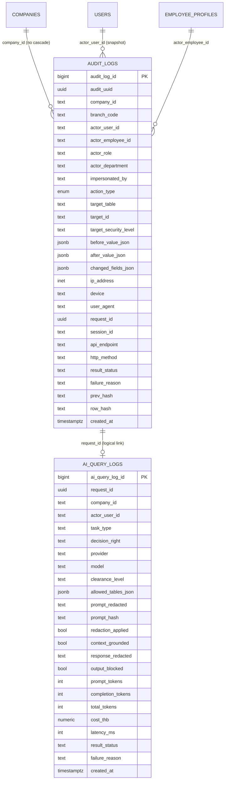

# 17 — Audit Log Database Design (`audit_logs` + `ai_query_logs`)

> **เอกสารนี้** กำหนด **มาตรฐานการบันทึก audit แบบ enterprise, append-only, tamper-evident** สำหรับ NEXUS OS ที่ใช้งานโดย **Saduak Suay Mai PCL** (เครือคลินิกความงาม + ทันตกรรม แฟรนไชส์)
> ออกแบบเป็น **production-ready** ไม่ใช่ demo: ทุก action ต้องถูกบันทึก, แก้ไข/ลบไม่ได้, ตรวจสอบย้อนหลังได้, และ AI query ถูกบันทึกแยกแต่ผูกกันด้วย `request_id`
>
> **สถานะปัจจุบัน (ground truth):** ระบบมีตาราง `audit_log` (เอกพจน์) เดียว — โครงสร้างแคบ, เขียนแบบ best-effort, ไม่มี before/after, ไม่มี immutability ดูหัวข้อ [§0](#0-สถานะปัจจุบัน-current-state) เอกสารนี้เสนอตาราง **ใหม่** `audit_logs` (พหูพจน์) + `ai_query_logs` เป็น migration พร้อมแผน cutover

---

## สารบัญ

- [0. สถานะปัจจุบัน (Current State)](#0-สถานะปัจจุบัน-current-state)
- [1. หลักการออกแบบ (Design Principles)](#1-หลักการออกแบบ-design-principles)
- [2. `action_type` Enum (รายการ action ทั้งหมด)](#2-action_type-enum)
- [3. ตาราง `audit_logs` — Full DDL](#3-ตาราง-audit_logs--full-ddl)
- [4. ตาราง `ai_query_logs` — Full DDL (linked by `request_id`)](#4-ตาราง-ai_query_logs--full-ddl)
- [5. การบังคับ Append-Only (REVOKE + Trigger)](#5-การบังคับ-append-only)
- [6. Hash-Chain (Tamper-Evidence)](#6-hash-chain-tamper-evidence)
- [7. Indexes ที่ต้องมี](#7-indexes-ที่ต้องมี)
- [8. Retention Policy & Partitioning](#8-retention-policy--partitioning)
- [9. `writeAudit()` Helper — ของเดิม vs ของใหม่](#9-writeaudit-helper)
- [10. การเดินสาย: ทุก API เขียน log อย่างไร](#10-การเดินสาย-wiring)
- [11. Cutover / Migration Plan](#11-cutover--migration-plan)
- [12. ความสัมพันธ์กับ Security Levels & RBAC/ABAC](#12-ความสัมพันธ์กับ-security-levels)
- [13. ER Diagram](#13-er-diagram)

---

## 0. สถานะปัจจุบัน (Current State)

**EXISTS** — ตาราง `audit_log` (เอกพจน์) นิยามใน `backend/src/lib/nexus-schema.ts`:

```sql
-- EXISTING (nexus-schema.ts) — ไม่เพียงพอต่อ enterprise spec
CREATE TABLE IF NOT EXISTS audit_log (
  id TEXT PRIMARY KEY,
  company_id TEXT REFERENCES companies(id) ON DELETE CASCADE,
  user_id TEXT REFERENCES users(id),
  action TEXT NOT NULL,
  resource TEXT,
  resource_id TEXT,
  security_tier TEXT DEFAULT 'T1',
  meta TEXT DEFAULT '{}',
  created_at TIMESTAMPTZ DEFAULT NOW()
);
```

เขียนผ่าน `backend/src/lib/audit.ts` → `writeAudit()` ซึ่งเป็น **fire-and-forget INSERT ใน `try/catch {}`** (error ถูกกลืน, non-fatal).

**ช่องว่าง (gaps) ที่เอกสารนี้ปิด:**

| ช่องว่าง | ปัจจุบัน | เป้าหมาย |
|---|---|---|
| Field-level change capture | ไม่มี `before`/`after` | `before_value_json` + `after_value_json` + `changed_fields_json` |
| Actor identity | มีแค่ `user_id` | + `actor_employee_id`, `actor_role`, `session_id`, `impersonated_by` |
| Request forensics | ไม่มี | `ip_address`, `device`, `user_agent`, `request_id`, `api_endpoint`, `http_method` |
| Result | ไม่มี | `result_status` (success/failure/blocked), `failure_reason` |
| Append-only | ตารางธรรมดา แก้/ลบได้ | REVOKE UPDATE/DELETE + BEFORE trigger RAISE |
| Tamper-evidence | ไม่มี | hash-chain `prev_hash` → `row_hash` |
| Security level | label `T0–T3` ไม่ map กับ 4 ระดับ | `target_security_level` ∈ BASIC/MEDIUM/HARD/RESTRICTED |
| Reliability | error ถูกกลืน | outbox + dead-letter, การ block ทำให้ request fail ได้ (สำหรับ RESTRICTED) |
| AI logging | `ai_logs` (token ปลอม, ไม่เก็บ prompt/response) | `ai_query_logs` เต็มรูปแบบ ผูก `request_id` |

> เราเลือกสร้างตาราง **ใหม่ชื่อ `audit_logs` (พหูพจน์)** แทนการ ALTER ตารางเดิม เพื่อให้ append-only/immutability enforcement สะอาด และทำ cutover ได้แบบ dual-write (ดู §11). ตารางเดิม `audit_log` จะ freeze เป็น read-only archive.

---

## 1. หลักการออกแบบ (Design Principles)

1. **Append-only, immutable.** เขียนได้อย่างเดียว — `UPDATE`/`DELETE`/`TRUNCATE` ถูก REVOKE และ trigger จะ `RAISE EXCEPTION`. ไม่มีใคร (รวม `admin`/`ceo`) แก้ audit ได้ผ่าน application role.
2. **Tamper-evident.** แต่ละแถวมี `row_hash = SHA256(prev_hash || canonical_payload)` ทำให้ตรวจจับการแก้ไขนอกระบบ (เช่น superuser แก้ตรง DB) ได้.
3. **Capture everything.** ทุก action ตาม `action_type` enum (§2) ต้องถูกบันทึก — รวม `failed_access`/`blocked_access`/`login_failed` (security events เขียนแม้ผู้ใช้ยังไม่ authenticate สมบูรณ์).
4. **Backend-only.** audit เขียนจาก backend เท่านั้น (Express middleware + service layer) — frontend แตะไม่ได้ ปลอมไม่ได้.
5. **Multi-tenant safe.** ทุกแถวมี `company_id NOT NULL` (ยกเว้น pre-auth security events ที่ยังไม่รู้ tenant → ใช้ sentinel) และ index นำด้วย `company_id`.
6. **AI แยกแต่ผูกกัน.** prompt/response ของ AI อยู่ใน `ai_query_logs` (อาจมี PII) — ผูกกับ `audit_logs` ด้วย `request_id` เพื่อ retention/encryption policy ที่ต่างกันได้.
7. **Never lose a log.** เขียน audit ผ่าน outbox-style helper; ถ้า DB ล้ม ให้ลง dead-letter (file/queue) ไม่ใช่กลืน error เงียบ ๆ แบบของเดิม.
8. **Retention by law + class.** เก็บตาม security level + ประเภทข้อมูล (เช่น Medical/Dental ตามแนวทาง PDPA / เวชระเบียน). ดู §8.

---

## 2. `action_type` Enum

ใช้ PostgreSQL native ENUM (เพิ่มค่าได้ภายหลังด้วย `ALTER TYPE ... ADD VALUE`, ลบไม่ได้ — เหมาะกับ audit ที่ห้ามทำลายประวัติ).

```sql
CREATE TYPE audit_action_type AS ENUM (
  -- Authentication & session
  'login',
  'login_failed',
  'logout',
  'session_expired',
  'token_refresh',
  'impersonate_start',
  'impersonate_end',
  'mfa_challenge',
  'password_change',
  'password_reset',

  -- Data read
  'view',
  'search',
  'export',
  'download',
  'print',

  -- Data write (lifecycle)
  'create',
  'update',
  'delete',          -- hard delete (ควรหายาก — ระบบใช้ soft-delete)
  'soft_delete',
  'restore',
  'upload',

  -- Workflow / approvals
  'approve',
  'reject',
  'submit',
  'escalate',
  'assign',
  'reassign',

  -- Authorization & governance
  'permission_change',   -- แก้ permission_groups / ACL
  'role_change',         -- เปลี่ยน users.role / system role
  'grant',               -- RESTRICTED direct-grant ให้ user
  'revoke',              -- ถอน grant
  'consent_grant',
  'consent_revoke',

  -- Access-control outcomes (security events)
  'failed_access',       -- ผ่าน auth แต่ ABAC/RBAC ปฏิเสธ
  'blocked_access',      -- policy engine block (เช่น cross-tenant, RESTRICTED no-grant)
  'rate_limited',

  -- AI
  'ai_query',            -- ผู้ใช้ส่ง query เข้า AI (ผูก ai_query_logs)
  'ai_response',         -- โมเดลตอบ (ผูก ai_query_logs)
  'ai_blocked',          -- query/response ถูก redaction/policy บล็อก

  -- System / ops
  'config_change',
  'backup',
  'migration'
);
```

> **กฎ mapping:** controller/middleware แต่ละจุด **ต้อง** ส่ง `action_type` จาก enum นี้เท่านั้น (ไม่ใช่ free-text แบบของเดิม) — บังคับด้วย TypeScript union type ฝั่ง backend (ดู §9).

---

## 3. ตาราง `audit_logs` — Full DDL

**สถานะ: NEW (migration `v11_audit_logs`).**

```sql
-- =====================================================================
-- audit_logs : append-only, tamper-evident, enterprise audit trail
-- NEW TABLE (migration v11). PostgreSQL (Railway). ห้ามใช้ ON DELETE CASCADE
-- เพื่อกัน audit หายตาม parent.
-- =====================================================================
CREATE TABLE IF NOT EXISTS audit_logs (
  audit_log_id          BIGINT GENERATED ALWAYS AS IDENTITY PRIMARY KEY, -- ลำดับ monotonic ช่วย hash-chain & partition pruning
  audit_uuid            UUID NOT NULL DEFAULT gen_random_uuid(),          -- public id (อ้างใน API / cross-system)

  -- Tenant
  company_id            TEXT NOT NULL,        -- ไม่ FK cascade; ใช้ sentinel '__system__' สำหรับ pre-auth events
  branch_code           TEXT,                 -- [ASSUMPTION] สาขาที่เกิด action (จาก branches v8) ถ้าทราบ

  -- Actor (ผู้กระทำ)
  actor_user_id         TEXT,                 -- users.id (NULL ได้เฉพาะ login_failed ที่ไม่รู้ user)
  actor_employee_id     TEXT,                 -- employee_profiles.id (ผูกคนกับ HR record)
  actor_role            TEXT,                 -- snapshot ของ role ขณะเกิด action (เช่น 'medical','hr')
  actor_department      TEXT,                 -- snapshot department (ABAC scope ขณะนั้น)
  impersonated_by       TEXT,                 -- ถ้า admin impersonate: users.id ตัวจริง
  on_behalf_of          TEXT,                 -- (optional) ทำแทน user อื่น

  -- Action
  action_type           audit_action_type NOT NULL,
  action_label          TEXT,                 -- คำอธิบายอ่านง่าย (optional, ไม่ใช้แทน action_type)

  -- Target (ทรัพยากรเป้าหมาย)
  target_table          TEXT,                 -- ชื่อตาราง เช่น 'patients','payslips'
  target_id             TEXT,                 -- pk ของแถวเป้าหมาย
  target_security_level  TEXT NOT NULL DEFAULT 'BASIC'
      CHECK (target_security_level IN ('BASIC','MEDIUM','HARD','RESTRICTED')),

  -- Change capture
  before_value_json     JSONB,                -- สถานะก่อน (เฉพาะ update/delete/soft_delete/restore)
  after_value_json      JSONB,                -- สถานะหลัง (เฉพาะ create/update/restore)
  changed_fields_json   JSONB,                -- array ของ field ที่เปลี่ยน เช่น ["salary","title"]

  -- Request forensics
  ip_address            INET,
  device                TEXT,                 -- 'web-chrome','ios-app','line-bot', ...
  user_agent            TEXT,
  request_id            UUID,                 -- correlation id ต่อ 1 HTTP request (ผูก ai_query_logs)
  session_id            TEXT,                 -- session/jti ของ JWT
  api_endpoint          TEXT,                 -- เช่น '/api/payroll/payslips/:id'
  http_method           TEXT CHECK (http_method IN
                          ('GET','POST','PUT','PATCH','DELETE','HEAD','OPTIONS')),

  -- Outcome
  result_status         TEXT NOT NULL DEFAULT 'success'
      CHECK (result_status IN ('success','failure','blocked','partial')),
  failure_reason        TEXT,                 -- เหตุผลเมื่อ failure/blocked เช่น 'RESTRICTED_NO_GRANT'

  -- Tamper-evidence (hash-chain ต่อ company_id — ดู §6)
  prev_hash             TEXT,                 -- row_hash ของแถว audit ก่อนหน้าใน company เดียวกัน
  row_hash              TEXT,                 -- SHA256(prev_hash || canonical_payload)

  -- Time
  created_at            TIMESTAMPTZ NOT NULL DEFAULT NOW()
)
PARTITION BY RANGE (created_at);   -- partition รายเดือน (ดู §8)

-- หมายเหตุ: ไม่มี updated_at / deleted_at โดยตั้งใจ — แถว audit แก้/ลบไม่ได้
```

**เหตุผลการออกแบบสำคัญ:**

- `audit_log_id BIGINT IDENTITY` — sequential, ทำ hash-chain ง่าย, partition pruning ดี; `audit_uuid` ใช้เปิดเผยภายนอก (ไม่เผย sequence count).
- **ไม่มี FK `ON DELETE CASCADE`** ไปยัง `companies`/`users` — ถ้า user ถูกลบ audit ต้องคงอยู่ (เก็บเป็น TEXT snapshot ของ actor). นี่คือจุดต่างสำคัญจากของเดิมที่ `audit_log.company_id ... ON DELETE CASCADE` (ทำให้ audit หายตาม tenant).
- `target_security_level` map ตรงกับ **4 ระดับมาตรฐาน** ของบริษัท (BASIC/MEDIUM/HARD/RESTRICTED) แทน `T0–T3` เดิม — ใช้ขับ retention และ alerting.
- `before/after/changed_fields` เป็น `JSONB` — query ได้ (`->>`, GIN index) และ **ต้องผ่าน redaction** ก่อนเขียน (ไม่เก็บ `password_hash`, mask เลขบัตร/HN ตามนโยบาย — ดู §10.3).

---

## 4. ตาราง `ai_query_logs` — Full DDL

**สถานะ: NEW (migration `v11_audit_logs`).** แยกจาก audit เพราะ (ก) เก็บ prompt/response ที่อาจมี PII → encryption + retention ต่างกัน, (ข) ปริมาณ/ขนาดแถวใหญ่กว่ามาก. ผูกกับ `audit_logs` ด้วย **`request_id`**.

```sql
-- =====================================================================
-- ai_query_logs : บันทึก AI ทุกครั้ง (prompt, redaction, response, metering)
-- NEW TABLE. ผูกกับ audit_logs ผ่าน request_id (1 request → 1+ audit rows
-- action_type ai_query/ai_response/ai_blocked + 1 ai_query_logs row)
-- =====================================================================
CREATE TABLE IF NOT EXISTS ai_query_logs (
  ai_query_log_id       BIGINT GENERATED ALWAYS AS IDENTITY PRIMARY KEY,
  ai_query_uuid         UUID NOT NULL DEFAULT gen_random_uuid(),

  -- Link & tenant
  request_id            UUID NOT NULL,        -- ผูกกับ audit_logs.request_id
  company_id            TEXT NOT NULL,
  actor_user_id         TEXT NOT NULL,
  actor_employee_id     TEXT,
  actor_role            TEXT,
  actor_department      TEXT,
  session_id            TEXT,

  -- Routing (จาก ai-router.ts)
  task_type             TEXT,                 -- strategy|automation|research|thai_market|general
  decision_right        TEXT CHECK (decision_right IN ('auto','suggest','human')),
  provider              TEXT,                 -- openai|claude|gemini|typhoon
  model                 TEXT,                 -- gpt-4o, claude-sonnet-4, ...
  fallback_chain_json   JSONB,                -- ลำดับ provider ที่ลองจริง

  -- Access-control snapshot (ก่อนส่งเข้าโมเดล)
  clearance_level       TEXT CHECK (clearance_level IN ('BASIC','MEDIUM','HARD','RESTRICTED')),
  allowed_tables_json   JSONB,                -- ตาราง/ขอบเขตข้อมูลที่ผู้ใช้เห็นได้
  rows_in_context       INTEGER,             -- จำนวนแถว RAG ที่ filter ให้แล้ว

  -- Prompt (หลัง redaction)
  raw_prompt_present    BOOLEAN DEFAULT TRUE, -- มี prompt จริงไหม
  prompt_redacted       TEXT,                 -- prompt ที่ผ่าน PII redaction แล้ว (เก็บตัวนี้)
  prompt_hash           TEXT,                 -- SHA256(raw prompt) — เทียบซ้ำได้โดยไม่เก็บ raw
  redaction_applied     BOOLEAN DEFAULT FALSE,
  redaction_rules_json  JSONB,                -- เช่น ["mask_hn","mask_thai_id","drop_salary"]
  context_grounded      BOOLEAN DEFAULT FALSE,-- ใช้ org RAG context หรือไม่

  -- Response
  response_redacted     TEXT,                 -- response หลัง output-filter
  response_hash         TEXT,
  output_blocked        BOOLEAN DEFAULT FALSE,-- response ถูก redaction-check บล็อกบางส่วน
  block_reason          TEXT,

  -- Metering (ของจริง ไม่ใช่ length/4 + 0.5 ปลอมแบบ ai_logs เดิม)
  prompt_tokens         INTEGER,
  completion_tokens     INTEGER,
  total_tokens          INTEGER,
  cost_thb              NUMERIC(12,4),
  latency_ms            INTEGER,

  -- Outcome
  result_status         TEXT NOT NULL DEFAULT 'success'
      CHECK (result_status IN ('success','failure','blocked','partial')),
  failure_reason        TEXT,

  created_at            TIMESTAMPTZ NOT NULL DEFAULT NOW()
)
PARTITION BY RANGE (created_at);

-- ความสัมพันธ์เชิงตรรกะ (ไม่บังคับ FK ข้าม partition):
--   ai_query_logs.request_id  ==  audit_logs.request_id
COMMENT ON COLUMN ai_query_logs.request_id IS
  'Correlation id; join to audit_logs.request_id. NOT a hard FK (both partitioned).';
```

> **EXISTS vs NEW:** ตาราง `ai_logs` เดิม (`db.ts` core: `id, company_id, user_id, agent, action, tokens_used, cost_thb, status, created_at`) ยังคงไว้เพื่อ backward-compat ระยะสั้น แต่ **ถือว่า deprecated** — metering ของจริงและ prompt/response ย้ายมา `ai_query_logs`. ดู cutover §11.

**Redaction-first:** `ai_query_logs` **ไม่เก็บ raw prompt/response** เก็บเฉพาะเวอร์ชัน redacted + hash ของ raw. ถ้านโยบายต้องเก็บ raw เพื่อ debugging → เก็บใน column เข้ารหัส (pgcrypto/`ENCRYPTION_KEY`) แยก และ retention สั้น (เช่น 30 วัน). ปัจจุบัน path AI **ส่ง prompt ดิบเข้า provider ภายนอกโดยไม่ redact** (gap ที่ระบุใน discovery) — เอกสารนี้ทำให้ redaction เป็น precondition ของการ log และการเรียกโมเดล.

---

## 5. การบังคับ Append-Only

ทำ **2 ชั้น**: (A) REVOKE สิทธิ์ระดับ DB role, (B) trigger ที่ `RAISE EXCEPTION` กัน superuser/owner เผลอ.

### 5.1 แยก DB roles

```sql
-- role ที่แอปใช้เชื่อมต่อปกติ (จาก DATABASE_URL ของ nexus-api)
-- สมมุติ role ชื่อ nexus_app
-- INSERT ได้อย่างเดียวบนตาราง audit
GRANT INSERT, SELECT ON audit_logs    TO nexus_app;
GRANT INSERT, SELECT ON ai_query_logs TO nexus_app;

-- ห้ามแก้/ลบ/ตัดตาราง ผ่าน app role
REVOKE UPDATE, DELETE, TRUNCATE ON audit_logs    FROM nexus_app;
REVOKE UPDATE, DELETE, TRUNCATE ON ai_query_logs FROM nexus_app;

-- sequence ของ identity ให้ใช้ได้
GRANT USAGE ON ALL SEQUENCES IN SCHEMA public TO nexus_app;
```

> หมายเหตุ Railway: connection ปัจจุบันมักเป็น owner/superuser. **Action item:** สร้าง least-privilege role `nexus_app` แล้วชี้ `DATABASE_URL` ของ `nexus-api` มาที่ role นี้ เพื่อให้ REVOKE มีผลจริง (superuser bypass REVOKE). Trigger ใน §5.2 เป็นแนวกันชั้นสองสำหรับกรณี role ยังเป็น owner.

### 5.2 BEFORE UPDATE/DELETE/TRUNCATE trigger ที่ RAISE

```sql
-- ฟังก์ชันกลาง: ปฏิเสธทุกการแก้/ลบ
CREATE OR REPLACE FUNCTION audit_immutable_guard()
RETURNS TRIGGER
LANGUAGE plpgsql
AS $$
BEGIN
  RAISE EXCEPTION
    'audit log is append-only: % on % is forbidden (row id=%)',
    TG_OP, TG_TABLE_NAME, COALESCE(OLD.audit_log_id::text, OLD.ai_query_log_id::text, '?')
    USING ERRCODE = 'insufficient_privilege';
  RETURN NULL; -- ไม่ถึงบรรทัดนี้
END;
$$;

-- audit_logs
CREATE TRIGGER trg_audit_logs_no_update
  BEFORE UPDATE ON audit_logs
  FOR EACH ROW EXECUTE FUNCTION audit_immutable_guard();

CREATE TRIGGER trg_audit_logs_no_delete
  BEFORE DELETE ON audit_logs
  FOR EACH ROW EXECUTE FUNCTION audit_immutable_guard();

-- TRUNCATE เป็น statement-level trigger
CREATE TRIGGER trg_audit_logs_no_truncate
  BEFORE TRUNCATE ON audit_logs
  FOR EACH STATEMENT EXECUTE FUNCTION audit_immutable_guard();

-- ai_query_logs
CREATE TRIGGER trg_ai_query_logs_no_update
  BEFORE UPDATE ON ai_query_logs
  FOR EACH ROW EXECUTE FUNCTION audit_immutable_guard();

CREATE TRIGGER trg_ai_query_logs_no_delete
  BEFORE DELETE ON ai_query_logs
  FOR EACH ROW EXECUTE FUNCTION audit_immutable_guard();

CREATE TRIGGER trg_ai_query_logs_no_truncate
  BEFORE TRUNCATE ON ai_query_logs
  FOR EACH STATEMENT EXECUTE FUNCTION audit_immutable_guard();
```

> **ข้อยกเว้นเดียวที่อนุญาตให้ "ลบ" ได้** คือ **retention purge** ของ partition ทั้งก้อนด้วย `DROP TABLE <partition>` / `DETACH PARTITION` ซึ่งทำโดย **DBA/automation role แยก** (ไม่ใช่ `nexus_app`) ภายใต้ change-control. `DROP TABLE` ไม่ยิง `BEFORE DELETE`/`TRUNCATE` row trigger — จึงเป็นทางเดียวที่ลบข้อมูลเก่าได้ตาม policy โดยไม่เปิดช่องแก้รายแถว. ดู §8.

### 5.3 ป้องกัน trigger ถูกถอด (defense-in-depth)

- ใส่ตรวจ `pg_trigger` ใน health-check/backup worker: ถ้า trigger หาย → alert ทันที (treat as P1 security incident).
- Migration ที่พยายาม `DROP TRIGGER` บน audit ต้องผ่าน review พิเศษ.

---

## 6. Hash-Chain (Tamper-Evidence)

ตรวจจับการแก้ไขนอกระบบ (เช่น superuser แก้ค่าใน DB โดยตรง) ด้วย chain ต่อ `company_id`.

**สูตร:**
```
canonical_payload = json_agg แบบ deterministic ของฟิลด์สำคัญ
  (company_id, actor_user_id, action_type, target_table, target_id,
   target_security_level, before_value_json, after_value_json,
   result_status, created_at)
row_hash = encode(digest(prev_hash || canonical_payload, 'sha256'), 'hex')
prev_hash = row_hash ของแถว audit ก่อนหน้าใน company เดียวกัน (NULL = genesis)
```

ทำใน **BEFORE INSERT trigger** เพื่อให้แอปปลอม hash ไม่ได้ และ chain ต่อเนื่องแม้มีหลาย instance เขียนพร้อมกัน (lock ต่อ company).

```sql
CREATE EXTENSION IF NOT EXISTS pgcrypto;

CREATE OR REPLACE FUNCTION audit_hash_chain()
RETURNS TRIGGER LANGUAGE plpgsql AS $$
DECLARE
  v_prev TEXT;
  v_payload TEXT;
BEGIN
  -- serialize การเขียนต่อ company (กัน race chain) ด้วย advisory lock
  PERFORM pg_advisory_xact_lock(hashtext(NEW.company_id));

  SELECT row_hash INTO v_prev
    FROM audit_logs
   WHERE company_id = NEW.company_id
   ORDER BY audit_log_id DESC
   LIMIT 1;

  NEW.prev_hash := v_prev;  -- NULL ได้ถ้าเป็นแถวแรกของ company (genesis)

  v_payload := concat_ws('|',
      NEW.company_id, COALESCE(NEW.actor_user_id,''), NEW.action_type::text,
      COALESCE(NEW.target_table,''), COALESCE(NEW.target_id,''),
      NEW.target_security_level,
      COALESCE(NEW.before_value_json::text,''),
      COALESCE(NEW.after_value_json::text,''),
      NEW.result_status, NEW.created_at::text);

  NEW.row_hash := encode(
      digest(COALESCE(NEW.prev_hash,'') || v_payload, 'sha256'), 'hex');
  RETURN NEW;
END;
$$;

CREATE TRIGGER trg_audit_logs_hash
  BEFORE INSERT ON audit_logs
  FOR EACH ROW EXECUTE FUNCTION audit_hash_chain();
```

**การตรวจสอบ (verification job):** worker รายวัน re-compute chain ต่อ company; ถ้าพบ `row_hash` ไม่ตรง → integrity broken → P1 alert. (เพิ่มเป็น background worker คู่กับ daily backup ที่มีอยู่.)

---

## 7. Indexes ที่ต้องมี

ตาม spec — รองรับ query สอบสวนทั่วไป (ใครทำอะไร, บนตาราง/แถวไหน, ช่วงเวลาใด, ตาม request).

```sql
-- audit_logs (สร้างบน parent; PostgreSQL กระจายลง partition อัตโนมัติ)
CREATE INDEX idx_audit_company_time     ON audit_logs (company_id, created_at DESC);
CREATE INDEX idx_audit_actor            ON audit_logs (actor_user_id, created_at DESC);
CREATE INDEX idx_audit_actor_emp        ON audit_logs (actor_employee_id);
CREATE INDEX idx_audit_action_type      ON audit_logs (action_type, created_at DESC);
CREATE INDEX idx_audit_target           ON audit_logs (target_table, target_id);
CREATE INDEX idx_audit_request          ON audit_logs (request_id);
CREATE INDEX idx_audit_session          ON audit_logs (session_id);
CREATE INDEX idx_audit_seclevel         ON audit_logs (target_security_level, created_at DESC);
CREATE INDEX idx_audit_result           ON audit_logs (result_status)
    WHERE result_status <> 'success';                 -- partial: เร่ง query security events
CREATE INDEX idx_audit_changed_fields   ON audit_logs USING GIN (changed_fields_json);

-- ai_query_logs
CREATE INDEX idx_aiq_request            ON ai_query_logs (request_id);  -- join กลับ audit_logs
CREATE INDEX idx_aiq_company_time       ON ai_query_logs (company_id, created_at DESC);
CREATE INDEX idx_aiq_actor              ON ai_query_logs (actor_user_id, created_at DESC);
CREATE INDEX idx_aiq_provider_model     ON ai_query_logs (provider, model);
CREATE INDEX idx_aiq_blocked            ON ai_query_logs (output_blocked)
    WHERE output_blocked = TRUE;
```

| Index | ใช้ตอบคำถามสอบสวน |
|---|---|
| `idx_audit_company_time` | "feed ของบริษัทช่วงเวลานี้" (default ของหน้า Audit) |
| `idx_audit_actor` | "พนักงานคนนี้ทำอะไรบ้าง" |
| `idx_audit_action_type` | "ดู login_failed / export ทั้งหมด" |
| `idx_audit_target` | "ใครแตะ patient/payslip แถวนี้บ้าง" |
| `idx_audit_request` + `idx_aiq_request` | join 1 request ↔ AI log |
| `idx_audit_seclevel` | "ใครเข้าถึง RESTRICTED" (สำคัญสุดสำหรับ compliance) |
| `idx_audit_result (partial)` | dashboard security: failed/blocked |

---

## 8. Retention Policy & Partitioning

**Partition รายเดือน** ตาม `created_at` → purge/freeze ทั้งก้อนได้ถูก, ไม่ต้อง `DELETE` รายแถว (ซึ่ง trigger ห้ามอยู่แล้ว).

```sql
-- ตัวอย่าง partition รายเดือน
CREATE TABLE audit_logs_2026_06 PARTITION OF audit_logs
  FOR VALUES FROM ('2026-06-01') TO ('2026-07-01');
CREATE TABLE audit_logs_2026_07 PARTITION OF audit_logs
  FOR VALUES FROM ('2026-07-01') TO ('2026-08-01');
-- worker สร้าง partition ล่วงหน้า + index อัตโนมัติทุกเดือน
```

**Retention matrix [ASSUMPTION — ปรับตามที่ปรึกษากฎหมาย/PDPA]:**

| ประเภท / security level | ตัวอย่าง action/target | เก็บใน hot store | นโยบายหลังหมด |
|---|---|---|---|
| **RESTRICTED — Medical/Dental/Patient** | `patients`, `tamada_cases`, `sdx_cases` | **≥ 10 ปี** [ASSUMPTION: ตามแนวเวชระเบียน] | DETACH → cold archive (object storage, immutable, เข้ารหัส) |
| **RESTRICTED — Payroll/Tax/Contract** | `payslips`, `salary_history`, `payroll_runs` | **7 ปี** [ASSUMPTION: ตามแนวภาษี/บัญชี] | cold archive |
| **HARD — HR/permission/role** | `permission_change`, `role_change`, investigation | 5 ปี | archive |
| **MEDIUM — operational** | department data | 2 ปี | archive แล้ว purge |
| **BASIC — view/search ทั่วไป** | dashboard view | 1 ปี | purge |
| **Security events** | `login_failed`,`blocked_access`,`failed_access` | 2 ปี | archive |
| **`ai_query_logs` prompt/response** | redacted text | 90–180 วัน hot; hash เก็บยาวใน audit | raw (ถ้าเก็บ) เข้ารหัส 30 วัน |

**กลไก purge (DBA role เท่านั้น, ไม่ใช่ `nexus_app`):**
```sql
-- ย้ายออกจาก hot table ก่อน (chain ของ partition เก่าได้ถูก verify + archived แล้ว)
ALTER TABLE audit_logs DETACH PARTITION audit_logs_2025_01;
-- archive ขึ้น cold storage (immutable) แล้วจึง:
DROP TABLE audit_logs_2025_01;   -- ไม่ยิง row trigger; อยู่ใต้ change-control
```

> **กฎเหล็ก:** ห้าม purge ก่อน (ก) hash-chain ของ partition นั้น verify ผ่าน และ (ข) archive ขึ้น immutable cold storage สำเร็จ. PDPA: การลบเพราะ retention เป็น "การลบตามนโยบาย" ที่ชอบด้วยกฎหมาย — บันทึก action `migration`/`backup` ของการ purge เองด้วย (meta-audit ใน partition ที่ยังอยู่).

---

## 9. `writeAudit()` Helper

### 9.1 ของเดิม (gap)

`backend/src/lib/audit.ts` ปัจจุบัน:
- รับ `action` เป็น **free-text** (ไม่ใช่ enum)
- ไม่มี before/after, ไม่มี ip/ua/request_id/session/endpoint/method/result
- เขียน `try/catch {}` → **error ถูกกลืนเงียบ ๆ** (ไม่มี guarantee ว่าได้บันทึก)
- เขียนตาราง `audit_log` เดิมเท่านั้น

### 9.2 ของใหม่ (ตามมาตรฐาน)

Signature ใหม่ (TypeScript) — บังคับ `action_type` ด้วย union type ให้ตรง enum, รับ context จาก request, redact ก่อนเขียน, และ **ไม่กลืน error**:

```ts
// backend/src/lib/audit.ts (REWRITE — NEW)
export type AuditActionType =
  | 'login' | 'login_failed' | 'logout' | 'session_expired' | 'token_refresh'
  | 'impersonate_start' | 'impersonate_end' | 'mfa_challenge'
  | 'password_change' | 'password_reset'
  | 'view' | 'search' | 'export' | 'download' | 'print'
  | 'create' | 'update' | 'delete' | 'soft_delete' | 'restore' | 'upload'
  | 'approve' | 'reject' | 'submit' | 'escalate' | 'assign' | 'reassign'
  | 'permission_change' | 'role_change' | 'grant' | 'revoke'
  | 'consent_grant' | 'consent_revoke'
  | 'failed_access' | 'blocked_access' | 'rate_limited'
  | 'ai_query' | 'ai_response' | 'ai_blocked'
  | 'config_change' | 'backup' | 'migration';

export type SecurityLevel = 'BASIC' | 'MEDIUM' | 'HARD' | 'RESTRICTED';

export interface AuditContext {
  // มาจาก middleware (req): ดู §10
  companyId: string;
  actorUserId?: string;
  actorEmployeeId?: string;
  actorRole?: string;
  actorDepartment?: string;
  impersonatedBy?: string;
  ipAddress?: string;
  device?: string;
  userAgent?: string;
  requestId?: string;       // correlation id (uuid ต่อ request)
  sessionId?: string;
  apiEndpoint?: string;     // req.route.path
  httpMethod?: string;
}

export interface AuditEvent {
  actionType: AuditActionType;
  targetTable?: string;
  targetId?: string;
  targetSecurityLevel?: SecurityLevel;   // default 'BASIC'
  before?: Record<string, unknown> | null;
  after?: Record<string, unknown> | null;
  resultStatus?: 'success' | 'failure' | 'blocked' | 'partial';
  failureReason?: string;
  actionLabel?: string;
}

export async function writeAudit(
  ctx: AuditContext,
  ev: AuditEvent,
): Promise<void> {
  const before = redactForAudit(ev.before, ev.targetTable);   // ดู §10.3
  const after  = redactForAudit(ev.after,  ev.targetTable);
  const changed = diffChangedFields(before, after);           // ["salary","title"]

  try {
    await run(
      `INSERT INTO audit_logs (
         company_id, branch_code, actor_user_id, actor_employee_id, actor_role,
         actor_department, impersonated_by, action_type, action_label,
         target_table, target_id, target_security_level,
         before_value_json, after_value_json, changed_fields_json,
         ip_address, device, user_agent, request_id, session_id,
         api_endpoint, http_method, result_status, failure_reason)
       VALUES ($1,$2,$3,$4,$5,$6,$7,$8,$9,$10,$11,$12,$13,$14,$15,
               $16,$17,$18,$19,$20,$21,$22,$23,$24)`,
      [ ctx.companyId, ctx.branchCode ?? null, ctx.actorUserId ?? null,
        ctx.actorEmployeeId ?? null, ctx.actorRole ?? null, ctx.actorDepartment ?? null,
        ctx.impersonatedBy ?? null, ev.actionType, ev.actionLabel ?? null,
        ev.targetTable ?? null, ev.targetId ?? null,
        ev.targetSecurityLevel ?? 'BASIC',
        before ? JSON.stringify(before) : null,
        after  ? JSON.stringify(after)  : null,
        JSON.stringify(changed),
        ctx.ipAddress ?? null, ctx.device ?? null, ctx.userAgent ?? null,
        ctx.requestId ?? null, ctx.sessionId ?? null,
        ctx.apiEndpoint ?? null, ctx.httpMethod ?? null,
        ev.resultStatus ?? 'success', ev.failureReason ?? null ],
    );
  } catch (err) {
    // ❌ ไม่กลืน error แบบของเดิม — ลง dead-letter เพื่อ replay
    await auditDeadLetter(ctx, ev, err);   // เขียนไฟล์/queue + เพิ่ม metric
    // นโยบาย: RESTRICTED ที่ log ไม่ได้ → โยน error ให้ request fail (no-audit, no-action)
    if ((ev.targetSecurityLevel ?? 'BASIC') === 'RESTRICTED') throw err;
  }
}

// helper เฉพาะ AI: เขียน ai_query_logs + audit row ('ai_query'/'ai_response') ผูก request_id
export async function writeAiQueryLog(
  ctx: AuditContext, rec: AiQueryRecord,
): Promise<void> { /* INSERT ai_query_logs; writeAudit(ctx, {actionType:'ai_query'...}) */ }
```

**ความต่างสำคัญจากของเดิม:**
1. `action` free-text → `AuditActionType` union (ตรง enum DB).
2. เพิ่ม before/after/changed_fields + ip/ua/request_id/session/endpoint/method/result.
3. **ไม่กลืน error** — dead-letter + (สำหรับ RESTRICTED) บังคับให้ request fail ถ้า audit เขียนไม่ได้ ("no audit, no action").
4. redaction บังคับก่อนเก็บ before/after.

---

## 10. การเดินสาย (Wiring)

### 10.1 Request-context middleware (NEW)

เพิ่ม middleware ต้นทาง (ก่อน route) สร้าง `req.audit` ครั้งเดียวต่อ request:

```ts
// backend/src/middleware/audit-context.ts (NEW)
export function auditContext(req, res, next) {
  req.requestId = req.header('x-request-id') ?? randomUUID();
  res.setHeader('x-request-id', req.requestId);
  req.audit = {
    companyId:       req.user?.company_id ?? '__system__',
    actorUserId:     req.user?.id,
    actorEmployeeId: req.user?.employee_id,
    actorRole:       req.user?.role,
    actorDepartment: req.user?.department,
    impersonatedBy:  req.user?.impersonated_by,
    ipAddress:       req.ip,
    device:          parseDevice(req.headers['user-agent']),
    userAgent:       req.headers['user-agent'],
    requestId:       req.requestId,
    sessionId:       req.user?.jti ?? req.user?.session_id,
    apiEndpoint:     req.originalUrl.split('?')[0],
    httpMethod:      req.method,
  };
  next();
}
```

> ปัจจุบันยังไม่มี `request_id` correlation (gap ใน discovery §5). middleware นี้ปิดช่องนั้นและ feed ทั้ง audit + log lines.

### 10.2 จุดที่ต้องเขียน audit (coverage)

| ชั้น | เขียนอะไร | action_type |
|---|---|---|
| `middleware/auth.ts` | login สำเร็จ/ล้ม, token refresh, impersonate | `login`,`login_failed`,`token_refresh`,`impersonate_start/end` |
| `middleware/rbac.ts` (`requireRole`/`requireModule`) | เมื่อปฏิเสธ → เขียนทันที | `failed_access`,`blocked_access` |
| `rateLimitMiddleware` | เมื่อ 429 | `rate_limited` |
| Service/controller (mutate) | ทุก create/update/soft_delete/restore พร้อม before/after | `create`,`update`,`soft_delete`,`restore` |
| Sensitive read controllers | view/search/export/download บน RESTRICTED (patients/payslips/contracts) | `view`,`search`,`export`,`download` |
| Approval flows (`work_logs`, leave, OT, payroll) | approve/reject/submit/escalate | `approve`,`reject`,`submit`,`escalate` |
| Permission/role admin (`permission_groups`,`user_permission_groups`, role change, RESTRICTED grant) | ทุกการแก้สิทธิ์ | `permission_change`,`role_change`,`grant`,`revoke` |
| `ai-router.ts` (`routeAI`) | ทุก query/response + ผล redaction/block | `ai_query`,`ai_response`,`ai_blocked` (+ `ai_query_logs`) |
| `consent` controllers (NEW) | consent grant/revoke | `consent_grant`,`consent_revoke` |

**Pattern มาตรฐานในแต่ละ controller (mutate):**
```ts
const before = await getById(id);                 // snapshot ก่อน
const after  = await applyUpdate(id, patch);      // mutate
await writeAudit(req.audit, {
  actionType: 'update',
  targetTable: 'payslips',
  targetId: id,
  targetSecurityLevel: 'RESTRICTED',
  before, after,
});
```

> **บังคับด้วย convention + lint/review:** controller ที่ mutate ตาราง core แต่ไม่เรียก `writeAudit` ถือว่า incomplete. แนะนำห่อ mutation ใน `auditedMutation()` wrapper เพื่อกันลืม. (ทางเลือกแกร่งสุด: trigger ฝั่ง DB capture before/after เป็น fallback safety-net แม้ app ลืมเรียก — แต่ trigger จะไม่มี request context/actor; ใช้ app-level เป็นหลัก, DB trigger เป็น net.)

### 10.3 Redaction ก่อนเก็บ (และก่อนส่งเข้า AI)

```ts
// redactForAudit: ใช้ก่อนเก็บ before/after และก่อนส่ง prompt เข้า provider
//  - ลบ field secret: password_hash, *_token, api keys  (มีบางส่วนใน sanitize.ts เดิม)
//  - mask PII ตาม target_security_level:
//      RESTRICTED medical: HN, เลขบัตร ปชช., เบอร์โทร, dx → mask/แทนด้วย hash
//      RESTRICTED payroll: ตัวเลขเงินเดือน → เก็บใน audit ได้ (เพราะ audit เห็น) แต่ห้ามหลุดเข้า AI
```

> Gap ปัจจุบัน: `sanitize.ts` ลบแค่ `password_hash`; `encryption.ts` mask salary ตาม tier — **ทั้งคู่ไม่ได้อยู่ใน AI path**. เอกสารนี้กำหนดให้ `redactForAudit`/`redactForModel` เป็น precondition ของทั้งการเขียน audit และการเรียกโมเดล (ดู `ai_query_logs.redaction_applied`).

---

## 11. Cutover / Migration Plan

`schema_migrations` มี v1–v10 อยู่แล้ว → เพิ่ม **v11_audit_logs**.

1. **v11 (create):** สร้าง enum, `audit_logs`, `ai_query_logs`, partitions (เดือนปัจจุบัน + ล่วงหน้า), indexes, hash-chain trigger, immutability triggers, role `nexus_app` + GRANT/REVOKE.
2. **Dual-write:** อัป `writeAudit()` ให้เขียน **ทั้ง** `audit_log` เดิม (compat) **และ** `audit_logs` ใหม่ ชั่วคราว 1 รอบ release; ชี้ controllers/middleware ใหม่ทั้งหมดมา helper ใหม่.
3. **Backfill (optional):** import `audit_log` เดิม → `audit_logs` (map `security_tier T0–T3` → BASIC/MEDIUM/HARD/RESTRICTED, `action` free-text → ใกล้เคียงที่สุดใน enum หรือ `action_label`). แถว backfill ตั้ง `result_status='success'`, hash-chain คำนวณตอน insert.
4. **Read switch:** `GET /api/audit` (controller `audit-log.controller.ts`, gate `requireRole('admin','ceo','it','hr')`) อ่านจาก `audit_logs` ใหม่; เพิ่ม filter ตาม `action_type`, `target_security_level`, `request_id`. RESTRICTED rows แสดงเฉพาะผู้มี clearance.
5. **AI switch:** `ai-router.ts` เขียน `ai_query_logs`; `ai_logs` เดิม deprecated (หยุดเขียนหลัง verify).
6. **Stop dual-write:** หยุดเขียน `audit_log` เดิม; freeze เป็น read-only archive.
7. **Lock down:** ยืนยัน `DATABASE_URL` ใช้ role `nexus_app` (least-priv) เพื่อให้ REVOKE มีผล; เปิด integrity-verify worker.

---

## 12. ความสัมพันธ์กับ Security Levels & RBAC/ABAC

- `target_security_level` ใช้มาตรฐาน **4 ระดับ** ของบริษัท: **BASIC / MEDIUM / HARD / RESTRICTED**. Medical/Dental/Patient, Salary/Payroll/Contract/Tax, HR investigation, AI evaluation, Executive notes = **RESTRICTED** by default — ขับ retention (§8) และ alerting.
- **ทุกครั้งที่ policy engine ปฏิเสธ** (RBAC/ABAC/data-ownership/cross-tenant) → เขียน `failed_access`/`blocked_access` พร้อม `failure_reason` (เช่น `RESTRICTED_NO_GRANT`, `CROSS_TENANT`, `DEPT_SCOPE`). นี่คือ deny-by-default ที่ตรวจสอบย้อนหลังได้.
- **การอ่าน audit เองก็เป็น action ที่ถูก audit** (`view`/`export` บน `audit_logs`) — ป้องกัน insider สำรวจ log เงียบ ๆ.
- การเข้าถึง **RESTRICTED** ทุกครั้ง (แม้สำเร็จ) ถูกบันทึก `view`/`export` → `idx_audit_seclevel` ทำให้ compliance ดึง "ใครเปิดเวชระเบ/สลิปเงินเดือนคนไหน เมื่อไหร่" ได้ทันที.

---

## 13. ER Diagram



---

### สรุปสถานะ EXISTS vs NEW

| รายการ | สถานะ |
|---|---|
| ตาราง `audit_log` (เอกพจน์, แคบ) | **EXISTS** → freeze เป็น archive |
| `writeAudit()` แบบ free-text, กลืน error | **EXISTS** → REWRITE |
| `ai_logs` (token ปลอม, ไม่เก็บ prompt) | **EXISTS** → deprecate |
| `audit_logs` (พหูพจน์, full field, partitioned) | **NEW** (v11) |
| `ai_query_logs` ผูก `request_id` | **NEW** (v11) |
| `audit_action_type` enum | **NEW** |
| Append-only REVOKE + immutability trigger | **NEW** |
| Hash-chain trigger + verify worker | **NEW** |
| Indexes (company/actor/action/target/request/seclevel) | **NEW** |
| Partitioning + retention purge (DBA role) | **NEW** |
| `audit-context` middleware (`request_id`) | **NEW** |
| Redaction in audit + AI path | **NEW** |
