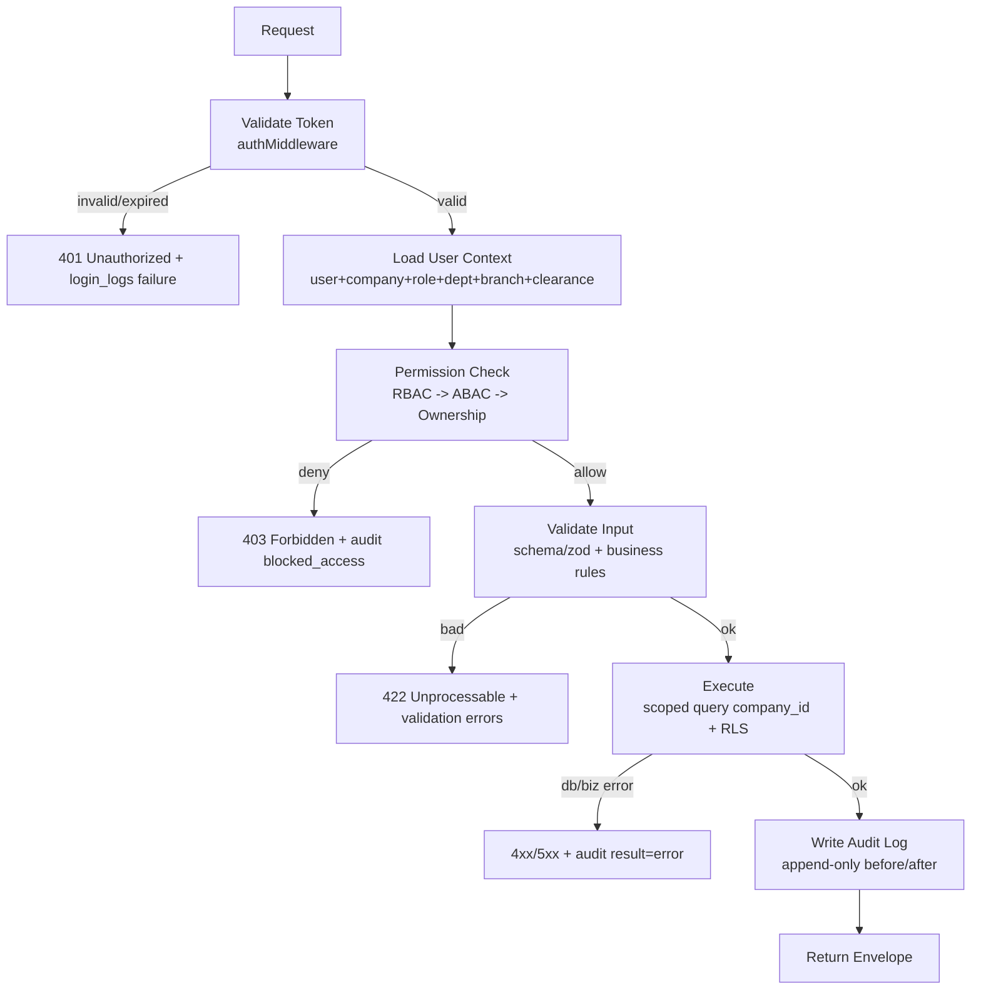

# 18 — API Specification (เอกสารกำหนดมาตรฐาน API)

**ระบบ:** NEXUS OS — AI Workforce OS for **Saduak Suay Mai PCL** (Aesthetic + Dental Clinic Franchise Chain)
**สถานะ:** Production-grade specification (ไม่ใช่ demo / ไม่ใช่ MVP)
**Scope ของเอกสารนี้:** กำหนด contract ของทุก module API — Auth, Company, Branch, Department, Position, Employee, Profile, Workflow, KPI, Knowledge Vault, File, Permission, AI Analysis, Audit Log, Dashboard, Report
**Grounding:** อ้างอิงโค้ดจริงใน `backend/src/` (Express/TS — service `nexus-api`) ทุก endpoint ระบุชัดว่าเป็น **EXISTING** (มีอยู่แล้ว) หรือ **NEW** (ต้อง migration / เขียนใหม่)

> **หลักการบังคับ (NON-NEGOTIABLE):** Permission = **RBAC + ABAC + Data-Ownership**, **deny-by-default**, บังคับใน **BACKEND** เท่านั้น บน **ทุก API** และ **ทุก AI query** — ห้าม enforce ที่ frontend อย่างเดียวเด็ดขาด ทุก action ที่เปลี่ยน state หรือเข้าถึงข้อมูล security_level ≥ MEDIUM ต้องเขียน **append-only audit log**

---

## สารบัญ

1. [มาตรฐานกลางของทุก API (Cross-cutting Standard)](#1-มาตรฐานกลางของทุก-api)
2. [The Standard Request Lifecycle (บังคับทุก endpoint)](#2-the-standard-request-lifecycle)
3. [Security Level ↔ Audit Tier Mapping](#3-security-level--audit-tier-mapping)
4. [Convention: Envelope, Versioning, Pagination, Idempotency](#4-convention)
5. [Module APIs](#5-module-apis)
   - 5.1 Auth · 5.2 Company · 5.3 Branch · 5.4 Department · 5.5 Position · 5.6 Employee · 5.7 Profile · 5.8 Workflow · 5.9 KPI · 5.10 Knowledge Vault · 5.11 File · 5.12 Permission · 5.13 AI Analysis · 5.14 Audit Log · 5.15 Dashboard · 5.16 Report
6. [Standard Error Catalog](#6-standard-error-catalog)
7. [Rate-Limit Policy Matrix](#7-rate-limit-policy-matrix)
8. [Migration Summary: EXISTING vs NEW](#8-migration-summary)

---

## 1. มาตรฐานกลางของทุก API

### 1.1 Base & Mounting

- **Base URL (prod):** `https://nexus-api.<railway-domain>/api`
- ทุก route mount ใต้ `/api/<module>` ใน `backend/src/index.ts` (บรรทัด 83–114) — **EXISTING**
- Global middleware order (จาก `index.ts`, **EXISTING**):
  `helmet()` → `corsMiddleware` (allow-list จาก `FRONTEND_URL`) → `rateLimitMiddleware` → `requestMetricsMiddleware` → `express.json({ limit: '50mb' })` → router (`async-guard` patched) → global error handler

> **[ASSUMPTION]** เพิ่ม API version prefix `/api/v1/...` (ดู §4). ปัจจุบันโค้ดยังไม่มี version prefix — เป็น **NEW** ที่แนะนำให้ใส่ก่อน production hardening เพื่อรองรับ breaking change ในอนาคต

### 1.2 Authentication

- **Bearer JWT** (`Authorization: Bearer <token>`) ผ่าน `authMiddleware` (`backend/src/middleware/auth.ts`) — **EXISTING**
- `authMiddleware` โหลด full user + company row ทุก request, รองรับ impersonation (`impersonated_by` ใน payload)
- **Gaps ที่ต้องปิดก่อน production (NEW):** token refresh/rotation, revocation list, login lockout, MFA, CSRF token สำหรับ state-changing requests, `request_id` correlation (ดูเอกสาร Security Architecture)

### 1.3 Permission Enforcement Layers (3 ชั้น — บังคับครบทุก endpoint)

| ชั้น | กลไกปัจจุบัน (EXISTING) | ส่วนขยายที่ต้องเพิ่ม (NEW) |
|---|---|---|
| **RBAC** | `requireRole(...roles)` + `requireModule(module)` (`middleware/rbac.ts`); roles 13 ตัว ใน `lib/rbac.ts`; `MODULE_ACCESS` map | ผูก `requireModule` ครบทุก route ที่ยังขาด |
| **ABAC** | `departmentScope(user)` คืน `null`=full org (admin/hr) หรือ department string; `canReviewWorkLog` (same-dept, not-self) | Central **Policy Engine** + branch/sub-unit scoping; attribute = `{role, department_id, branch_id, position_id, security_clearance}` |
| **Data-Ownership** | ad-hoc: เทียบ `users.department` string; tenant isolation = manual `company_id = $1` ในทุก query | first-class `owner_id` / `data_ownership` model + **Row-Level Security**; RESTRICTED = direct-grant table `resource_grants` |

> **Deny-by-default:** ถ้าไม่มี policy rule ที่อนุญาตชัดเจน → **403**. `admin` คือ super-user (short-circuit ทุก check — `requireRole` line 15) ซึ่งเป็น **EXISTING risk**; production ควรจำกัด admin ผ่าน break-glass + audit ทุก action

### 1.4 Audit (append-only)

- ปัจจุบัน: `writeAudit()` (`lib/audit.ts`) — fire-and-forget INSERT ลง `audit_log` (`nexus-schema.ts`), **swallow error** (`try/catch {}`) → **EXISTING แต่ไม่ guaranteed**
- คอลัมน์วันนี้: `id, company_id, user_id, action, resource, resource_id, security_tier(default 'T1'), meta(JSON), created_at`
- **NEW (บังคับสำหรับ enterprise):** เพิ่มคอลัมน์ `before_state JSONB, after_state JSONB, changed_fields TEXT[], target_security_level TEXT, ip_address, user_agent, request_id, session_id, endpoint, http_method, result, failure_reason, prev_hash`; เพิ่ม DB trigger `REVOKE UPDATE,DELETE` + hash-chain tamper-evidence; แยก `ai_query_logs` ที่ link ด้วย `request_id`

ดู §3 mapping และ §5.14 สำหรับ schema เต็ม

---

## 2. The Standard Request Lifecycle

ทุก endpoint **ต้อง** เดินตามลำดับนี้ (deny-by-default, fail-closed):



**กฎเหล็ก:**
1. **Validate Token ก่อนเสมอ** — ไม่มี token = 401 ทันที, ไม่แตะ business logic
2. **Load User Context** — โหลด `req.user` (มี `role, company_id, department, branch_id, position_id, security_clearance`)
3. **Permission Check** — เรียงชั้น RBAC → ABAC → Ownership; ชั้นใดชั้นหนึ่ง deny = หยุด, เขียน audit `blocked_access`/`failed_access`
4. **Validate** — schema + business rules; ผิด = 422 (ไม่เขียน mutation audit)
5. **Execute** — query ต้องมี `company_id = $tenant` เสมอ (tenant isolation) + scope ตาม ABAC (department/branch) + soft-delete filter `deleted_at IS NULL`
6. **Write Audit Log** — append-only, before/after JSON, ก่อน return (สำหรับ mutation); read ที่ security_level ≥ MEDIUM ก็เขียน `view`/`search`/`export`
7. **Return** — standard envelope (§4.1)

> **Failed/blocked access ก็ต้อง audit** — login fail, 403, redaction block ล้วนเป็น event ที่ต้องบันทึก

---

## 3. Security Level ↔ Audit Tier Mapping

ระบบมี 4 SECURITY LEVELS (per global rule). ปัจจุบันโค้ดใช้ label tier `T0–T3` (`security_tier`). Mapping ที่บังคับใช้:

| SECURITY LEVEL | ใครเห็น | Audit Tier (legacy) | ตัวอย่างข้อมูล |
|---|---|---|---|
| **BASIC** | ทุกคน (authenticated) | T0 | home, todos, public knowledge, org chart |
| **MEDIUM** | สมาชิก department | T1 | department KPI, work logs, ภายในแผนก |
| **HARD** | owner / manager / HR | T2 | profile รวม, attendance, advances, performance review |
| **RESTRICTED** | direct grant เท่านั้น | T3 | **Medical/Dental/Patient records, Salary/Payroll/Contract/Tax, HR investigation, AI evaluation, Executive notes** |

> **กฎ default:** Medical/Dental/Patient, Salary/Payroll/Contract/Tax, HR investigation, AI evaluation, Executive notes = **RESTRICTED** เสมอ ต้องมี `resource_grants` row หรือ role ที่เป็น data owner; ไม่มี grant = 403 + audit `blocked_access` แม้ role จะตรง module

`resource_grants` (**NEW table**):
```sql
CREATE TABLE resource_grants (
  id           TEXT PRIMARY KEY,
  company_id   TEXT NOT NULL REFERENCES companies(id),
  grantee_user_id TEXT NOT NULL REFERENCES users(id),
  resource     TEXT NOT NULL,           -- table name
  resource_id  TEXT,                    -- NULL = ทั้ง resource type
  scope        TEXT NOT NULL DEFAULT 'read' CHECK (scope IN ('read','write','approve')),
  granted_by   TEXT NOT NULL REFERENCES users(id),
  expires_at   TIMESTAMPTZ,
  created_at   TIMESTAMPTZ NOT NULL DEFAULT now(),
  is_active    BOOLEAN NOT NULL DEFAULT true,
  security_level TEXT NOT NULL DEFAULT 'RESTRICTED',
  UNIQUE (company_id, grantee_user_id, resource, resource_id, scope)
);
```

---

## 4. Convention

### 4.1 Response Envelope (NEW — standardize)
ปัจจุบัน controller คืน shape ไม่สม่ำเสมอ; กำหนดมาตรฐาน:
```json
{ "ok": true, "data": { }, "meta": { "request_id": "uuid", "page": 1, "page_size": 50, "total": 0 } }
```
Error:
```json
{ "ok": false, "error": { "code": "FORBIDDEN", "message": "ไม่มีสิทธิ์เข้าถึง", "request_id": "uuid", "details": [] } }
```

### 4.2 Versioning & Optimistic Lock
- ทุก mutable entity มี `version INT` — `PATCH` ต้องส่ง `If-Match: <version>` (หรือ body `version`); mismatch = **409 Conflict**. ปัจจุบันยังไม่มี version column ส่วนใหญ่ → **NEW**

### 4.3 Pagination
- `?page=&page_size=` (default 50, max 200); response มี `meta.total`. หลาย controller วันนี้คืน "last N" (เช่น audit) → **NEW** ใส่ pagination จริง

### 4.4 Idempotency
- POST ที่สร้าง resource เงิน/critical ต้องผ่าน `idempotencyMiddleware` (`middleware/idempotency.ts`, ตาราง `idempotency_keys`) — **EXISTING** (ใช้แล้วที่ `POST /api/work-logs`) ผ่าน header `Idempotency-Key`

---

## 5. Module APIs

> รูปแบบแต่ละ endpoint:
> **METHOD path** — EXISTING/NEW · controller · **Auth** · **Permission (RBAC/ABAC/Ownership)** · **Validation** · **Audit** · **Errors** · **Rate-limit**

---

### 5.1 Auth Module

Mount: `/api/auth` → `auth.route.ts` (**EXISTING**)

| METHOD path | สถานะ | Controller |
|---|---|---|
| `POST /api/auth/signup` | EXISTING | `auth.controller.signup` |
| `POST /api/auth/signin` | EXISTING | `auth.controller.signin` |
| `GET /api/auth/me` | EXISTING | `auth.controller.getMe` |
| `GET /api/auth/impersonate/targets` | EXISTING | `getImpersonateTargets` |
| `POST /api/auth/impersonate` | EXISTING | `impersonate` |
| `POST /api/auth/impersonate/stop` | EXISTING | `stopImpersonate` |
| `POST /api/auth/refresh` | **NEW** | rotate refresh token |
| `POST /api/auth/logout` | **NEW** | revoke + audit `logout` |
| `POST /api/auth/mfa/verify` | **NEW** | MFA challenge |

**`POST /api/auth/signin`**
- **Auth:** none (public)
- **Permission:** n/a (ก่อน auth) — แต่ deny-by-default ผ่าน credential check
- **Validation:** `email` (RFC), `password` (≥ 8). บัญชีต้อง `is_active = true`, `deleted_at IS NULL`
- **Audit (NEW `login_logs`):** เขียนทั้ง success และ **failure** — `{actor_email, result, failure_reason, ip, user_agent, session_id}`; ปัจจุบันไม่ log login → **NEW**
- **Errors:** `401 INVALID_CREDENTIALS`, `423 ACCOUNT_LOCKED` (NEW lockout หลัง 5 fail), `429`
- **Rate-limit:** **10/min/IP** (`LIMITS['/api/auth/signin']`, **EXISTING**)

**`POST /api/auth/signup`**
- **Auth:** none. สร้าง company + seed org structure (Saduak: 10 departments → 13 roles, seeded ตอน signup — per MEMORY)
- **Validation:** company name unique, email unique, password strength
- **Audit:** `create company`, `create user(owner)` (T1)
- **Errors:** `409 EMAIL_TAKEN`, `422`
- **Rate-limit:** **5/min/IP** (**EXISTING**)

**`POST /api/auth/impersonate`** (admin break-glass)
- **Auth:** Bearer
- **Permission (RBAC):** `req.user.role === 'admin'` (canImpersonate) — **EXISTING**
- **Audit (NEW must-harden):** `permission-change`/`impersonate-start` ระบุ `actor` + `target`, security_level **RESTRICTED (T3)**; ทุก action ระหว่าง impersonate ต้องมี `impersonated_by` ใน audit meta
- **Errors:** `403`, `404 TARGET_NOT_FOUND`

---

### 5.2 Company Module

Mount: ใช้ `/api/settings` (company-level) + `/api/onboarding` — **EXISTING** (ยังไม่มี `/api/companies` แยก)

| METHOD path | สถานะ | Controller |
|---|---|---|
| `GET /api/settings` | EXISTING | `settings.controller.getSettings` |
| `PATCH /api/settings/company` | EXISTING | `updateCompany` |
| `POST /api/onboarding/decision-rights` | EXISTING | set `ai_decision_rights` |
| `GET /api/companies/:id` | **NEW** | full company profile |
| `DELETE /api/companies/:id` | **NEW** | soft-delete (CEO+confirm) |

**`PATCH /api/settings/company`**
- **Auth:** Bearer
- **Permission:** **NEW** ต้องเพิ่ม `requireRole('admin','ceo')` (ปัจจุบัน route ไม่มี role guard — **EXISTING gap**, แค่ authMiddleware)
- **Ownership:** ต้องแก้ได้เฉพาะ `company_id = req.user.company_id` (tenant isolation)
- **Validation:** name, settings JSON (`ai_decision_rights` ∈ `{auto,suggest,human}` per task)
- **Audit:** `update company` (T2), before/after settings JSON, `changed_fields`
- **Errors:** `403`, `409` (version), `422`
- **Rate-limit:** default 120/min

> **[ASSUMPTION]** Saduak มี 1 company tenant (franchisor PCL); branch/franchise คือชั้นล่าง ไม่ใช่ tenant แยก

---

### 5.3 Branch Module

Mount: **NEW** `/api/branches` (ตาราง `branches` มีอยู่ — migration v8 — แต่ยังไม่มี route/controller → **NEW endpoints**)

| METHOD path | สถานะ | Controller |
|---|---|---|
| `GET /api/branches` | **NEW** | list branches (scoped) |
| `GET /api/branches/:id` | **NEW** | branch detail |
| `POST /api/branches` | **NEW** | create branch |
| `PATCH /api/branches/:id` | **NEW** | update |
| `DELETE /api/branches/:id` | **NEW** | soft-delete |

**`POST /api/branches`** (**NEW**)
- **Auth:** Bearer
- **Permission (RBAC):** `requireRole('admin','ceo','franchise')` + `requireModule('franchise')`
- **ABAC/Ownership:** branch ต้องอยู่ใต้ `company_id` ของ actor; franchise manager แก้ได้เฉพาะ branch ที่ตน assign (`branch.owner_id` หรือ mapping `franchise_audits`)
- **Validation:** `branch_code` UNIQUE per company, `name`, `province` (Thai), geo lat/lng optional (ใช้กับ attendance QR — `attendance_locations`)
- **Audit:** `create branch` (T1)
- **Errors:** `409 BRANCH_CODE_TAKEN`, `403`, `422`
- **Rate-limit:** default

**`GET /api/branches`** (**NEW**)
- **ABAC scope:** non-CEO เห็นเฉพาะ branch ที่ตน assign; CEO/admin เห็นทั้งหมด — ใช้ `departmentScope`-style แต่ขยายเป็น **branch scope (NEW)**
- **Audit:** `search branches` (BASIC, skip ถ้าไม่ sensitive)

---

### 5.4 Department Module

Mount: `/api/departments` (`departments.route.ts`, **EXISTING** — แต่มีแค่ `GET /`) + `/api/hr/org-units` (**EXISTING**)

| METHOD path | สถานะ | Controller / Permission |
|---|---|---|
| `GET /api/departments` | EXISTING | `departments.controller.getAll` · authMiddleware only |
| `GET /api/hr/org-units` | EXISTING | `hr.controller.getOrgUnits` · `requireModule('org')` |
| `POST /api/hr/org-units` | EXISTING | `createOrgUnit` · `requireRole('admin','hr')` |
| `POST /api/self-service/department` | EXISTING | `createOwnDepartment` (onboarding) |
| `POST /api/onboarding/department` | EXISTING | `onboarding.controller.addDepartment` |
| `PATCH /api/departments/:id` | **NEW** | update dept |
| `DELETE /api/departments/:id` | **NEW** | soft-delete |
| `GET /api/departments/:id/sub-departments` | **NEW** | sub-dept tree |

โครงสร้าง: **Company → Department → Sub-Department → Team/Unit → Position → Employee**. 10 departments (CEO Office, Operations[+Customer Support, Admin, Personal Care, Telesales], Marketing, Medical, Finance & Accounting, People/HR, IT, Warehouse & Purchasing, Franchise, Dental). ปัจจุบัน sub-unit เก็บเป็น `org_units` level-3 (**EXISTING**); first-class `sub_departments`/`teams` = **NEW** (ดู gap #6)

**`POST /api/hr/org-units`** (EXISTING)
- **Auth:** Bearer
- **Permission (RBAC):** `requireRole('admin','hr')`
- **Ownership:** `company_id` scope; ห้ามสร้าง unit ข้าม tenant
- **Validation:** `name`, `level` (1=dept,2=sub,3=team), `parent_id` ต้องอยู่ใน company เดียวกัน, no cycle
- **Audit:** `create org_unit` (T1) — **NEW**: ต้องเพิ่ม before/after
- **Errors:** `403`, `422 INVALID_PARENT`, `409`
- **Rate-limit:** default

**`GET /api/departments`** (EXISTING)
- **Permission gap (NEW):** ปัจจุบันแค่ authMiddleware → ควรเพิ่ม `requireModule('org')`; ABAC: staff เห็น metadata BASIC, headcount/budget = MEDIUM (เฉพาะ dept member + HR)

---

### 5.5 Position Module

Mount: `/api/hr/positions` (**EXISTING** — มีแค่ GET) — ตาราง `positions` (`nexus-hr-schema.ts`)

| METHOD path | สถานะ | Permission |
|---|---|---|
| `GET /api/hr/positions` | EXISTING | `requireModule('org')` |
| `POST /api/hr/positions` | **NEW** | `requireRole('admin','hr')` |
| `PATCH /api/hr/positions/:id` | **NEW** | `requireRole('admin','hr')` |
| `DELETE /api/hr/positions/:id` | **NEW** | `requireRole('admin','hr')` soft-delete |

**`POST /api/hr/positions`** (**NEW**)
- **Validation:** `title`, `org_unit_id` (FK), `system_role` ∈ 13 roles, `security_clearance` default ตาม dept (Medical/Dental → RESTRICTED-capable), salary_band optional (RESTRICTED)
- **Audit:** `create position` (T2 — มี salary_band)
- **Ownership:** `company_id` scope
- **Errors:** `422 INVALID_ROLE`, `403`, `409 TITLE_TAKEN`

---

### 5.6 Employee Module

Mount: `/api/employees` (`employees.route.ts`, **EXISTING**) — เป็น HR-facing CRUD บน `employee_profiles`/`users`

| METHOD path | สถานะ | Permission (จากโค้ดจริง) |
|---|---|---|
| `GET /api/employees` | EXISTING | `requireRole('admin','ceo','hr','it')` |
| `POST /api/employees` | EXISTING | `requireRole('admin','hr')` |
| `PATCH /api/employees/:id` | EXISTING | `requireRole('admin','hr')` |
| `POST /api/employees/:id/review` | EXISTING | `requireRole('admin','hr')` — performance review |
| `DELETE /api/employees/:id` | EXISTING | `requireRole('admin','hr')` |

**`GET /api/employees`** (EXISTING)
- **Auth:** Bearer (`r.use(authMiddleware)`)
- **Permission (RBAC):** `requireRole('admin','ceo','hr','it')`
- **ABAC (NEW must-add):** ปัจจุบันเป็น company-wide list; ต้อง scope ด้วย `departmentScope` — manager ที่ไม่ใช่ HR/CEO เห็นเฉพาะ dept ตน; salary/contract fields ต้อง mask ตาม tier (`encryption.ts maskField` — RESTRICTED)
- **Validation:** pagination params
- **Audit (NEW):** `search employees` (T2 ถ้าคืน profile รวม); ใส่ `result` count
- **Errors:** `403`, `429`
- **Rate-limit:** default 120/min

**`POST /api/employees/:id/review`** (EXISTING)
- **Permission:** `requireRole('admin','hr')`
- **Security level:** performance review = **HARD**; ถ้าเป็น **AI evaluation** → **RESTRICTED** (ต้อง grant)
- **Audit:** `create review` (T2/T3), before/after, `target_security_level`
- **Errors:** `403`, `404`, `422`

**`DELETE /api/employees/:id`** (EXISTING → **harden to soft-delete**)
- **Permission:** `requireRole('admin','hr')`; ห้าม self-delete (ABAC `not-self`)
- **Behavior (NEW):** เปลี่ยนจาก hard-delete (FK CASCADE) → soft-delete `deleted_at`, set `is_active=false`, `deleted_by`
- **Audit:** `soft-delete employee` (T2)
- **Errors:** `403 CANNOT_DELETE_SELF`, `404`, `409`

---

### 5.7 Profile Module (Self-Service)

Mount: `/api/self-service` (`self-service.route.ts`, **EXISTING**) + `/api/settings/profile`

| METHOD path | สถานะ | Controller |
|---|---|---|
| `GET /api/self-service/hub` | EXISTING | `getHub` (my data summary) |
| `PATCH /api/self-service/profile` | EXISTING | `updateProfile` |
| `PATCH /api/settings/profile` | EXISTING | `settings.controller.updateProfile` |
| `POST /api/settings/change-password` | EXISTING | `changePassword` |
| `POST /api/self-service/skill-evidence` | EXISTING | `addSkillEvidence` |
| `GET /api/self-service/daily-tasks` | EXISTING | `getDailyTasks` |
| `PATCH /api/self-service/daily-tasks/:id/complete` | EXISTING | `completeDailyTask` |

**`PATCH /api/self-service/profile`** (EXISTING)
- **Auth:** Bearer
- **Permission (Ownership):** แก้ได้เฉพาะ **ของตนเอง** (`req.user.id`) — นี่คือ data-ownership ชั้นแท้
- **Validation:** เฉพาะ field self-editable (display name, phone, line_user_id, email_notify); **ห้าม** แก้ `role`, `department`, `salary`, `security_level` ผ่าน endpoint นี้ (deny-by-default — field allow-list)
- **Audit:** `update profile (self)` (T1), `changed_fields`
- **Errors:** `422 FIELD_NOT_EDITABLE`, `409`
- **Rate-limit:** default

**`POST /api/settings/change-password`** (EXISTING)
- **Ownership:** self only; ต้องส่ง `current_password` (verify ก่อน)
- **Audit (NEW):** `change-password` event ลง `login_logs`/`audit_log` (ไม่บันทึก hash)
- **Errors:** `401 WRONG_CURRENT_PASSWORD`, `422 WEAK_PASSWORD`

---

### 5.8 Workflow Module (Work Logs · Tasks · Leave · OT · Approvals)

Mount: `/api/work-logs`, `/api/tasks`, `/api/leave`, `/api/hr/leave-requests`, `/api/hr/overtime/*` — **EXISTING**

| METHOD path | สถานะ | Permission (โค้ดจริง) |
|---|---|---|
| `GET /api/work-logs` | EXISTING | authMiddleware (own + dept scope) |
| `POST /api/work-logs` | EXISTING | `idempotencyMiddleware` |
| `PATCH /api/work-logs/:id/review` | EXISTING | `requireRole(...MANAGER_ROLES)` + `canReviewWorkLog` |
| `POST /api/work-logs/escalate` | EXISTING | `requireRole('admin','it')` |
| `GET/POST/PATCH/DELETE /api/tasks` | EXISTING | authMiddleware (owner) |
| `POST /api/hr/leave-requests` | EXISTING | `p5.createHrLeave` |
| `POST /api/hr/leave-requests/:id/approve` | EXISTING | `requireRole('admin','hr','finance')` |
| `POST /api/hr/overtime/requests` | EXISTING | `p6.createOtRequestV2` |
| `PATCH /api/hr/overtime/requests/:id` | EXISTING | `requireRole('admin','hr','finance')` |

**`PATCH /api/work-logs/:id/review`** (EXISTING — โมเดล ABAC/ownership ที่ดีที่สุดในระบบปัจจุบัน)
- **Auth:** Bearer
- **Permission (RBAC):** `requireRole(...MANAGER_ROLES)` (ทุก role ยกเว้น `staff`)
- **ABAC/Ownership (EXISTING `canReviewWorkLog`):** ต้อง same-department **และ** not-self (manager ห้าม review log ตัวเอง)
- **Validation:** `status` ∈ allowed transition, `version` match (NEW)
- **Audit:** `review work_log` (T1) — **NEW**: เพิ่ม before/after status
- **Errors:** `403 NOT_SAME_DEPARTMENT`/`CANNOT_REVIEW_SELF`, `404`, `409`
- **Rate-limit:** default

**`POST /api/work-logs`** (EXISTING)
- **Ownership:** สร้างเป็นของ `req.user.id`; **Idempotency-Key** บังคับ (`idempotencyMiddleware`)
- **Audit:** `create work_log` (T1)

**`POST /api/hr/leave-requests/:id/approve`** (EXISTING — multi-step workflow)
- **Permission:** `requireRole('admin','hr','finance')` + step config (`leave_approval_steps`, `leave_approval_config`)
- **ABAC:** approver ต้องเป็น step owner ของ request นั้น (NEW: ผูก `ot_approval_steps.approver_id`)
- **Audit:** `approve leave_step` (T2), before/after step state, `result`
- **Errors:** `403 NOT_YOUR_STEP`, `409 STEP_ALREADY_DECIDED`

---

### 5.9 KPI Module

Mount: `/api/self-service/kpi` (POST, **EXISTING**); read ผ่าน hub/reports. ตาราง `kpi_entries` (มี `branch_code` — migration)

| METHOD path | สถานะ | Permission |
|---|---|---|
| `POST /api/self-service/kpi` | EXISTING | authMiddleware (own entry) |
| `GET /api/kpi` | **NEW** | scoped list |
| `PATCH /api/kpi/:id` | **NEW** | owner/manager |
| `GET /api/kpi/dashboard` | **NEW** | dept/branch rollup |

**`POST /api/self-service/kpi`** (EXISTING)
- **Auth:** Bearer
- **Permission (Ownership):** entry ผูก `user_id = req.user.id`, `branch_code` ของตน
- **Validation:** `metric`, `value` (numeric), `period`, `branch_code` ต้องเป็น branch ที่ user อยู่ (NEW ABAC)
- **Audit:** `create kpi_entry` (T1)
- **Errors:** `422 INVALID_BRANCH`, `403`

**`GET /api/kpi/dashboard`** (**NEW**)
- **ABAC scope:** staff → own; manager → department; CEO → all branches
- **Security level:** KPI target/formula = **[ASSUMPTION]** MEDIUM (dept); cross-branch comparison = HARD
- **Audit:** `view kpi_dashboard` (T1)

> **[ASSUMPTION]** KPI targets/formulas ของ aesthetic+dental clinic (เช่น revenue/branch/เดือน, conversion telesales, rebooking rate, chair utilization ทันตกรรม) — ค่าจริงยังไม่ทราบ ห้าม invent เป็น fact

---

### 5.10 Knowledge Vault Module

Mount: `/api/self-service/knowledge` (POST, **EXISTING**) + `/api/memory` (search/explain, **EXISTING**). ตาราง `knowledge_items`

| METHOD path | สถานะ | Permission |
|---|---|---|
| `POST /api/self-service/knowledge` | EXISTING | authMiddleware (own/dept) |
| `GET /api/memory/search` | EXISTING | authMiddleware |
| `POST /api/memory/explain` | EXISTING | authMiddleware |
| `GET /api/knowledge` | **NEW** | scoped list |
| `PATCH /api/knowledge/:id` | **NEW** | owner/manager + version |
| `DELETE /api/knowledge/:id` | **NEW** | soft-delete |

**`POST /api/self-service/knowledge`** (EXISTING)
- **Permission/Ownership:** สร้างใน scope ตน; `security_level` ของ item กำหนดการมองเห็น (BASIC/MEDIUM/HARD/RESTRICTED)
- **Validation:** `title`, `body`, `security_level` (default MEDIUM), `department_id`
- **Audit:** `create knowledge_item` (tier ตาม security_level)
- **Errors:** `422`, `403`

**`GET /api/memory/search`** (EXISTING — feeds RAG)
- **Permission (ABAC — CRITICAL):** ผลลัพธ์ต้อง **filter ตาม clearance ของผู้ค้นหา** ก่อนคืน; item RESTRICTED ที่ไม่มี grant **ห้ามโผล่** แม้ใน snippet
- **Audit:** `search knowledge` (T1); ถ้าจะ feed เข้า AI → ดู §5.13 redaction
- **Errors:** `403`

---

### 5.11 File Module

Mount: `/api/ingest` (upload/parse, **EXISTING**) + `user_files` (served ด้วย `security_tier` label เท่านั้น — **gap #3**). Storage: `lib/file-storage.ts`, `user_files.storage_path` (migration)

| METHOD path | สถานะ | Permission |
|---|---|---|
| `POST /api/ingest` | EXISTING | authMiddleware (parse/import) |
| `GET /api/files` | **NEW** | scoped list |
| `POST /api/files` | **NEW** | upload + clamav scan |
| `GET /api/files/:id/download` | **NEW** | gated download + `file_access_logs` |
| `DELETE /api/files/:id` | **NEW** | soft-delete |

**`POST /api/files`** (**NEW**)
- **Auth:** Bearer
- **Permission:** `requireModule(<owning module>)`; owner = uploader; `security_level` กำหนดตอน upload
- **Validation:** mime allow-list, size ≤ 50MB (body limit EXISTING), **virus scan (NEW)**; ไฟล์ patient/medical → RESTRICTED บังคับ
- **Audit:** `upload file` (tier ตาม security_level)
- **Errors:** `413 PAYLOAD_TOO_LARGE`, `415 UNSUPPORTED_MEDIA_TYPE`, `422`

**`GET /api/files/:id/download`** (**NEW — ปิด gap #3**)
- **Permission:** RBAC module + ABAC (owner/dept) + Ownership; RESTRICTED ต้องมี `resource_grants`
- **Audit (NEW `file_access_logs`):** ทุก download เขียน `{user_id, file_id, security_level, ip, result}` — ปัจจุบัน user_files เสิร์ฟ**ไม่มี access trail**
- **Errors:** `403 NO_GRANT`, `404`, `410 GONE` (soft-deleted)

---

### 5.12 Permission Module

Mount: `/api/hr/permission-groups` + `/api/hr/rbac-matrix` + `/api/hr/me/modules` (**EXISTING**). ตาราง `permission_groups`, `user_permission_groups`

| METHOD path | สถานะ | Permission (โค้ดจริง) |
|---|---|---|
| `GET /api/hr/me/modules` | EXISTING | authMiddleware (`p6.getMyModules`) |
| `GET /api/hr/permission-groups` | EXISTING | `requireModule('user-groups')` |
| `POST /api/hr/permission-groups` | EXISTING | `requireModule('user-groups')` |
| `PATCH /api/hr/permission-groups/:id` | EXISTING | `requireModule('user-groups')` |
| `POST /api/hr/permission-groups/:id/assign` | EXISTING | `requireModule('user-groups')` |
| `DELETE /api/hr/permission-groups/:id/members` | EXISTING | `requireModule('user-groups')` |
| `GET /api/hr/permission-groups/:id/members` | EXISTING | `requireModule('user-groups')` |
| `GET /api/hr/rbac-matrix` | EXISTING | `requireModule('user-groups')` |
| `POST /api/permissions/grant` (resource_grants) | **NEW** | RESTRICTED direct grant |
| `DELETE /api/permissions/grant/:id` | **NEW** | revoke grant |

**`POST /api/hr/permission-groups/:id/assign`** (EXISTING — สูง impact)
- **Auth:** Bearer
- **Permission (RBAC):** `requireModule('user-groups')` (admin/it ตาม `MODULE_ACCESS`)
- **ABAC:** ห้ามยกระดับสิทธิ์ตัวเอง (no self-escalation — **NEW guard**); company scope
- **Validation:** group + target user อยู่ใน company เดียวกัน
- **Audit (NEW `permission_change_logs`):** `permission-change` (T3 RESTRICTED), before/after group membership, `actor`, `target` — ปัจจุบัน permission edits **unaudited (gap #3)**
- **Errors:** `403 SELF_ESCALATION`, `404`, `409`
- **Rate-limit:** default

**`POST /api/permissions/grant`** (**NEW** — RESTRICTED data access)
- **Permission:** `requireRole('admin','ceo','hr')` + ต้องเป็น data-owner ของ resource
- **Validation:** `grantee`, `resource`, `resource_id`, `scope`, `expires_at` (บังคับสำหรับ medical/HR investigation)
- **Audit:** `permission-change/grant` (T3), reason mandatory
- **Errors:** `403`, `422 EXPIRY_REQUIRED`

---

### 5.13 AI Analysis Module

Mount: `/api/ai-router`, `/api/ai-command`, `/api/user-ai`, `/api/ai-stats`, `/api/twin` (**EXISTING**). Router: `lib/ai-router.ts`; providers: `lib/ai-providers.ts`

| METHOD path | สถานะ | Permission (โค้ดจริง) |
|---|---|---|
| `GET /api/ai-router/status` | EXISTING | authMiddleware (any) |
| `POST /api/ai-router/probe` | EXISTING | `requireRole('admin','it')` |
| `POST /api/ai-router/route` | EXISTING | `requireRole(...MANAGER_ROLES)` |
| `GET /api/ai-stats` | EXISTING | `requireRole('admin','it')` |
| `POST /api/ai-command/*` | EXISTING | authMiddleware |
| `GET/POST /api/user-ai/*` | EXISTING | authMiddleware (own AI memory) |

**AI Access-Control Flow (บังคับ — per global rule):**

```mermaid
flowchart LR
  Q[user query] --> ID[identify user]
  ID --> CL[check role/dept/position/clearance]
  CL --> F[filter -> allowed data only]
  F --> RD[PII/RESTRICTED redaction<br/>NEW]
  RD --> M[send ONLY allowed data to model]
  M --> RESP[model response]
  RESP --> OUT[output redaction check<br/>NEW]
  OUT --> LOG[ai_query_logs append<br/>NEW]
  LOG --> RET[return]
```


> **กฎเด็ดขาด:** AI **ไม่อ่าน DB ตรง**. ทุก context ที่ feed เข้า model ต้องผ่าน permission filter ของ **ผู้ถาม** ก่อน. AI ห้ามเปิดเผยข้อมูลที่ user คนนั้นมองไม่เห็น (เช่น staff ถามเงินเดือนคนอื่น → ต้องปฏิเสธ + audit `blocked_access`)

**`POST /api/ai-router/route`** (EXISTING)
- **Auth:** Bearer
- **Permission (RBAC):** `requireRole(...MANAGER_ROLES)`
- **Permission (ABAC/Ownership — CRITICAL NEW):** ก่อนเรียก `buildOrgContext` ต้อง scope RAG ตาม clearance ผู้ถาม; ปัจจุบัน full org context + raw prompt ส่งออก provider ภายนอก **un-redacted (gap #4)** → ต้องเพิ่ม redaction layer (strip patient/salary/PII) ก่อน `askWithFallback`
- **Decision rights:** `auto|suggest|human` จาก `ROUTES` + override `companies.settings.ai_decision_rights`; medical/financial/HR decision → บังคับ `human` (Copilot not Autopilot)
- **Validation:** `prompt` length cap, `task_type` ∈ enum
- **Audit (NEW `ai_query_logs`):** persist `prompt(redacted), response, provider, model, tokens(metered จริง), latency_ms, decision, grounded, redaction_status, request_id` link กับ `audit_log`; ปัจจุบัน `ai_logs` เก็บ token แบบ estimate (`len/4`) + cost hardcode 0.5 (faked metering)
- **Errors:** `403`, `422 PROMPT_TOO_LONG`, `424 AI_PROVIDER_DOWN` (fallback chain หมด), `429`
- **Rate-limit:** `/api/chat` = **30/min/IP** (EXISTING); AI route แนะนำ **[ASSUMPTION] 30/min/user (NEW)**

**`POST /api/ai-router/probe`** (EXISTING) — admin/it live-ping providers; **Audit:** `ai-probe` (T0)

---

### 5.14 Audit Log Module

Mount: `/api/audit` (`audit-log.route.ts`, **EXISTING**)

| METHOD path | สถานะ | Permission (โค้ดจริง) |
|---|---|---|
| `GET /api/audit` | EXISTING | `requireRole('admin','ceo','it','hr')` |
| `GET /api/audit/:id` | **NEW** | single entry w/ before/after |
| `GET /api/audit/export` | **NEW** | export (RESTRICTED + audit the export) |
| `GET /api/audit/verify-chain` | **NEW** | hash-chain integrity check |

**`GET /api/audit`** (EXISTING)
- **Auth:** Bearer
- **Permission (RBAC):** `requireRole('admin','ceo','it','hr')`
- **ABAC (NEW):** HR เห็น HR-scope; IT เห็น system events; CEO/admin เห็นทั้งหมด; entries ที่ target RESTRICTED ต้อง mask `before/after` ถ้า viewer ไม่มี clearance
- **Validation:** pagination, filter (`actor, action, resource, date range`) — ปัจจุบันคืน "last N" → **NEW** เพิ่ม filter/pagination
- **Audit:** การ **อ่าน audit เอง** ก็เขียน `view audit_log` (T2) — meta-audit
- **Errors:** `403`, `429`
- **Rate-limit:** default

**Append-only contract (NEW — บังคับ):**
```sql
-- เพิ่มคอลัมน์ enterprise
ALTER TABLE audit_log
  ADD COLUMN before_state JSONB,
  ADD COLUMN after_state  JSONB,
  ADD COLUMN changed_fields TEXT[],
  ADD COLUMN target_security_level TEXT,
  ADD COLUMN ip_address INET,
  ADD COLUMN user_agent TEXT,
  ADD COLUMN request_id TEXT,
  ADD COLUMN session_id TEXT,
  ADD COLUMN endpoint   TEXT,
  ADD COLUMN http_method TEXT,
  ADD COLUMN result     TEXT CHECK (result IN ('success','error','blocked','denied')),
  ADD COLUMN failure_reason TEXT,
  ADD COLUMN prev_hash  TEXT,           -- hash-chain
  ADD COLUMN row_hash   TEXT;

-- immutability: ห้าม UPDATE/DELETE
CREATE RULE audit_no_update AS ON UPDATE TO audit_log DO INSTEAD NOTHING;
CREATE RULE audit_no_delete AS ON DELETE TO audit_log DO INSTEAD NOTHING;
REVOKE UPDATE, DELETE ON audit_log FROM PUBLIC;
```
- **writeAudit hardening (NEW):** ปัจจุบัน swallow error (`try/catch {}`) → สำหรับ action security_level ≥ HARD ต้อง **fail-closed** (audit เขียนไม่สำเร็จ = reject transaction) หรือ enqueue ลง durable queue (`job_queue` EXISTING)
- **Actions ที่ต้อง capture (per global rule):** login/logout/view/search/create/update/delete/soft-delete/restore/upload/download/export/approve/reject/permission-change/role-change/ai-query/ai-response/failed-access/blocked-access
- **Retention:** **[ASSUMPTION]** เก็บ 7 ปี (สอดคล้องกฎหมายบัญชี/ภาษีไทย); audit ที่เกี่ยวข้อง PDPA/medical แยก retention policy. AI logs แยกตาราง link ด้วย `request_id`

---

### 5.15 Dashboard Module

Mount: `/api/ceo/brief` (**EXISTING**) + `/api/self-service/hub` (**EXISTING**); ส่วนใหญ่ aggregate read

| METHOD path | สถานะ | Permission (โค้ดจริง) |
|---|---|---|
| `GET /api/ceo/brief` | EXISTING | `requireRole('admin','ceo')` |
| `GET /api/self-service/hub` | EXISTING | authMiddleware (own) |
| `GET /api/dashboard/dept` | **NEW** | `requireModule(<dept>)` |
| `GET /api/dashboard/branch/:id` | **NEW** | branch scope |

**`GET /api/ceo/brief`** (EXISTING)
- **Auth:** Bearer
- **Permission (RBAC):** `requireRole('admin','ceo')`
- **Security level:** Executive notes/brief = **RESTRICTED**; AI-generated insight ใน brief ต้องผ่าน redaction (§5.13)
- **ABAC:** company-wide aggregate (CEO มี full org scope)
- **Audit:** `view ceo_brief` (T3) — เพราะมี executive notes
- **Errors:** `403`, `429`
- **Rate-limit:** default

**`GET /api/self-service/hub`** (EXISTING)
- **Ownership:** คืนเฉพาะข้อมูล `req.user.id` (KPI ตน, tasks ตน, skill ตน) — pure ownership scope
- **Audit:** `view my_hub` (T0, อาจ skip)

---

### 5.16 Report Module

Mount: `/api/hr/reports/:type` + `/api/hr/payroll/export/:type` + `/api/ai-stats` (**EXISTING**)

| METHOD path | สถานะ | Permission (โค้ดจริง) |
|---|---|---|
| `GET /api/hr/reports/:type` | EXISTING | `requireModule('reports')` |
| `GET /api/hr/payroll/export/:type` | EXISTING | `requireModule('reports')` (`p6.exportTaxForm`) |
| `GET /api/hr/payroll/payslip/:userId/:periodId/export` | EXISTING | authMiddleware (`p5.exportPayslipHtml`) |
| `GET /api/reports/financial/:type` | **NEW** | `requireModule('finance')` |
| `GET /api/reports/medical/:type` | **NEW** | RESTRICTED + grant |

**`GET /api/hr/reports/:type`** (EXISTING)
- **Auth:** Bearer
- **Permission (RBAC):** `requireModule('reports')` (admin/ceo/hr/finance ตาม `MODULE_ACCESS`)
- **ABAC:** report scope ตาม role — HR เห็น HR report; finance เห็น payroll; ห้าม cross-department leak
- **Validation:** `:type` ∈ whitelist (กัน arbitrary report injection), date range
- **Security level:** payroll/tax/salary report = **RESTRICTED**; export ต้อง audit `export` ทุกครั้ง พร้อม row count
- **Audit:** `export report` (T3 สำหรับ payroll/tax) — **NEW**: บันทึก `report_type, filters, row_count, format`
- **Errors:** `403`, `404 UNKNOWN_REPORT_TYPE`, `429`
- **Rate-limit:** export = **[ASSUMPTION] 10/min/user (NEW)** กัน data exfiltration

**`GET /api/reports/medical/:type`** (**NEW**)
- **Permission:** RESTRICTED — ต้องมี `resource_grants` scope=`read` บน patient data; medical/dental staff เห็นเฉพาะ branch ตน
- **Audit:** `export medical_report` (T3), reason + grant_id

---

## 6. Standard Error Catalog

| HTTP | code | เมื่อไหร่ | Audit? |
|---|---|---|---|
| 400 | `BAD_REQUEST` | malformed body/params | no (unless mutation attempt) |
| 401 | `UNAUTHORIZED` / `INVALID_CREDENTIALS` | no/invalid token, login fail | **yes** (`login_logs` failure) |
| 403 | `FORBIDDEN` / `NO_GRANT` / `SELF_ESCALATION` | RBAC/ABAC/ownership deny | **yes** (`blocked_access`/`denied`) |
| 404 | `NOT_FOUND` | resource/tenant mismatch | optional |
| 409 | `CONFLICT` / `VERSION_MISMATCH` | optimistic lock, unique violation | optional |
| 410 | `GONE` | soft-deleted resource | optional |
| 413 | `PAYLOAD_TOO_LARGE` | > 50MB | no |
| 415 | `UNSUPPORTED_MEDIA_TYPE` | mime not allowed | no |
| 422 | `VALIDATION_ERROR` | schema/business rule fail | no |
| 423 | `ACCOUNT_LOCKED` | login lockout (NEW) | **yes** |
| 424 | `AI_PROVIDER_DOWN` | fallback chain exhausted | yes (`ai_query_logs`) |
| 429 | `RATE_LIMITED` | over bucket | optional |
| 500 | `INTERNAL` | unhandled (async-guard → clean 500) | **yes** (`result=error`) |

ทุก error คืน envelope §4.1 พร้อม `request_id` (NEW correlation)

---

## 7. Rate-Limit Policy Matrix

ปัจจุบัน in-memory per-IP+path (`middleware/rate-limit.ts`, **EXISTING — ไม่ distributed**, reset ต่อ process — **gap #7**). Production ต้องย้ายไป **Redis-backed distributed limiter (NEW)** เพื่อ cluster-safe

| Path / Class | Window | Max | สถานะ |
|---|---|---|---|
| `/api/auth/signin` | 60s | 10/IP | EXISTING |
| `/api/auth/signup` | 60s | 5/IP | EXISTING |
| `/api/chat` (AI) | 60s | 30/IP | EXISTING |
| `default` (ทุก endpoint) | 60s | 120/IP | EXISTING |
| `/api/ai-router/route` | 60s | **30/user** | **NEW [ASSUMPTION]** |
| `*/export`, `*/download` | 60s | **10/user** | **NEW [ASSUMPTION]** |
| `/api/permissions/grant` | 60s | **20/user** | **NEW [ASSUMPTION]** |

---

## 8. Migration Summary

### EXISTING (มีอยู่แล้ว — ground truth)
Auth (signup/signin/me/impersonate), Employees CRUD, Departments GET, org-units, positions GET, self-service profile/kpi/knowledge/skill/daily-tasks, work-logs + review (best ABAC model), tasks CRUD, leave/OT multi-step approval, payroll/periods/payslip/export, permission-groups CRUD + assign + rbac-matrix, ai-router (status/probe/route) + ai-stats, audit GET, ceo/brief, settings, memory search/explain, ingest. Middleware: `authMiddleware`, `requireRole`, `requireModule`, `rateLimitMiddleware`, `idempotencyMiddleware`, `writeAudit`.

### NEW (ต้องเพิ่ม — migration/code)
1. **Branch module** ทั้งชุด (ตาราง `branches` มีแล้ว, route/controller ใหม่)
2. **Department/Position write** endpoints (PATCH/DELETE) + first-class `sub_departments`/`teams`
3. **File module** (`GET/POST/download/DELETE`) + `file_access_logs` (ปิด gap #3)
4. **Permission `resource_grants`** (RESTRICTED direct-grant) + `permission_change_logs`
5. **AI redaction layer** + `ai_query_logs` + real metering (ปิด gap #4)
6. **Audit append-only**: คอลัมน์ before/after + IP/UA/request_id/session_id, immutability rules, hash-chain, fail-closed สำหรับ HARD/RESTRICTED, verify-chain endpoint (ปิด gap #1)
7. **Soft-delete + version** ทุก mutable entity (ปิด gap #5 — ปัจจุบัน 0 `deleted_at`)
8. **ABAC/branch scope** wired เข้า authz + central Policy Engine + Row-Level Security + enforced tenant guard (ปิด gap #2, #6)
9. **login_logs / consent_logs** (auth events, PDPA consent)
10. **API version prefix `/api/v1`**, standard envelope, distributed rate-limiter (Redis), CSRF/MFA/token-rotation
11. **KPI/Knowledge/Dashboard/Report** read endpoints with scope + Medical/Financial reports (RESTRICTED)

> ทุก NEW endpoint **ต้อง** เดินตาม Standard Request Lifecycle (§2) และเขียน append-only audit (§5.14) ตั้งแต่บรรทัดแรกของการ implement — ไม่ retrofit ภายหลัง
