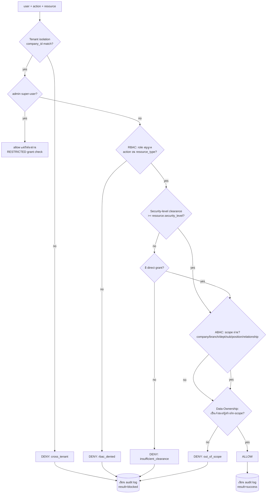
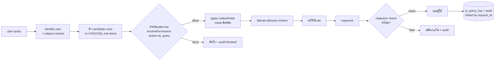

# 19 — Permission Logic / ตรรกะการตัดสินสิทธิ์ (NEXUS OS · Saduak Suay Mai PCL)

> เอกสารนี้กำหนด **อัลกอริทึมการตัดสินสิทธิ์** ของ NEXUS OS แบบ Production-grade: รวม **RBAC + ABAC + Data-Ownership** เข้าด้วยกัน ภายใต้หลัก **deny-by-default** บังคับใน **backend ทุก API และทุก AI query** พร้อม **เขียน audit log เสมอ** (ทั้งกรณีอนุญาตและปฏิเสธ)
>
> หลักการสูงสุด: **"ถ้าไม่มีกฎข้อใดอนุญาตอย่างชัดเจน = ปฏิเสธ"** และ **"ทุกการตัดสินใจต้องอธิบายได้ (explainable) และตรวจสอบย้อนหลังได้ (auditable)"**

---

## 0. สถานะปัจจุบัน vs เป้าหมาย (Grounding กับ NEXUS OS ที่มีอยู่)

| องค์ประกอบ | สถานะใน NEXUS OS วันนี้ | สิ่งที่เอกสารนี้กำหนด |
|---|---|---|
| `requireRole(...roles)` | **EXISTS** — `backend/src/middleware/rbac.ts`, admin bypass | คงไว้เป็นชั้น coarse-grained (gate ระดับ role) |
| `requireModule(module)` | **EXISTS** — delegate ไป `userCanAccessModule` (`lib/user-permissions.ts`) ผสม `permission_groups` | คงไว้เป็นชั้น module-gate |
| `MODULE_ACCESS` / `canAccessModule` | **EXISTS** — `lib/rbac.ts`, 13 roles, ~45 module keys | ใช้ต่อเป็น input ของ engine |
| `departmentScope(user)` / `canReviewWorkLog` | **EXISTS** — ad-hoc ABAC ด้วย string compare | **REPLACE** ด้วย policy engine กลาง |
| `security_level` per row | **PARTIAL** — `audit_log.security_tier` (T0–T3), salary masking ใน `encryption.ts` | **NEW** — 4 ระดับ `BASIC/MEDIUM/HARD/RESTRICTED` เป็น first-class |
| `data_ownership` / `owner_id` model | **ABSENT** | **NEW** — owner-based check + grant table |
| `resolvePermission()` policy engine | **ABSENT** | **NEW** — `backend/src/lib/permission/resolve.ts` |
| `requirePermission()` middleware | **ABSENT** | **NEW** — `backend/src/middleware/permission.ts` |
| AI permission filter | **ABSENT** (prompt + RAG ส่งดิบ) | **NEW** — `backend/src/lib/permission/ai-filter.ts` |
| Audit ทุก decision | **PARTIAL** — `writeAudit()` fire-and-forget, ไม่มี before/after | **NEW** — บังคับเขียนทุก allow/deny (ดูเอกสาร 17 Audit) |

> **[ASSUMPTION]** ระดับ tier เดิม `T0–T3` แม็พกับ 4 ระดับใหม่ดังนี้: `T0→BASIC`, `T1→MEDIUM`, `T2→HARD`, `T3→RESTRICTED` — ใช้สำหรับ migration ของแถวเดิม

---

## 1. โมเดลแนวคิด (Conceptual Model)

การตัดสินสิทธิ์ 1 ครั้งคือฟังก์ชันบริสุทธิ์เชิงตรรกะ:

```
resolvePermission(user, action, resource) -> { allowed: boolean, reason: string, ... }
```

โดยรวม **3 มิติ** เข้าด้วยกัน — ทั้งสามต้องผ่าน (AND) จึงจะอนุญาต ยกเว้น grant ตรง (RESTRICTED) ที่เป็น override เฉพาะจุด:



**Deny-by-default invariant:** ฟังก์ชันเริ่มต้นด้วย `let decision = DENY` และจะกลายเป็น `ALLOW` ก็ต่อเมื่อมีกฎอนุญาตชัดเจนเท่านั้น ทุก `return` ก่อนถึง `ALLOW` คือ deny

---

## 2. โครงสร้างข้อมูลที่จำเป็น (Types & Tables)

### 2.1 Security Levels (4 ระดับ) — **NEW**

```typescript
// backend/src/lib/permission/types.ts  (NEW)

/** 4 ระดับความลับของข้อมูล (เรียงจากเปิดเผยสุด -> ลับสุด) */
export enum SecurityLevel {
  BASIC      = 0, // ทุกคนในบริษัทเห็นได้ (ประกาศ, นโยบายทั่วไป, directory ชื่อ-แผนก)
  MEDIUM     = 1, // ระดับแผนก (รายงานแผนก, KPI แผนก, ตารางเวร)
  HARD       = 2, // owner/manager/HR (ผลประเมิน, บันทึกสอบสวนเบื้องต้น, advance)
  RESTRICTED = 3, // ต้อง direct grant เท่านั้น (เวชระเบียน/ทันตกรรม, payroll/ภาษี/สัญญา, HR investigation, AI evaluation, executive notes)
}

/** clearance สูงสุดที่แต่ละ role "อาจ" เข้าถึงได้ — เป็นเพดาน ไม่ใช่สิทธิ์อัตโนมัติ
 *  RESTRICTED ไม่เคยให้ผ่าน clearance — ต้อง grant ตรงเสมอ (ดู §3.5) */
export const ROLE_CLEARANCE: Record<string, SecurityLevel> = {
  admin:      SecurityLevel.HARD,       // admin = super-user แต่ RESTRICTED ยังต้อง grant
  ceo:        SecurityLevel.HARD,
  hr:         SecurityLevel.HARD,
  finance:    SecurityLevel.HARD,
  it:         SecurityLevel.MEDIUM,     // IT เห็นโครงสร้าง ไม่เห็นเนื้อหาลับ
  operations: SecurityLevel.MEDIUM,
  medical:    SecurityLevel.MEDIUM,
  dental:     SecurityLevel.MEDIUM,
  marketing:  SecurityLevel.MEDIUM,
  warehouse:  SecurityLevel.MEDIUM,
  franchise:  SecurityLevel.MEDIUM,
  sales:      SecurityLevel.MEDIUM,
  staff:      SecurityLevel.BASIC,
}
```

### 2.2 PermissionContext (subject) — **NEW**

```typescript
export interface PermissionSubject {
  userId: string
  companyId: string
  role: string                    // จาก users.role (rbac.ts ROLES)
  department: string | null       // users.department (free-text วันนี้; FK เป้าหมาย)
  subDepartmentId: string | null  // org_units level-3 (NEW wiring)
  branchId: string | null         // branches (migration v8) (NEW wiring)
  positionId: string | null       // positions (nexus-hr-schema)
  clearance: SecurityLevel        // ROLE_CLEARANCE[role] ปรับด้วย position ได้
  impersonatedBy?: string | null  // จาก JWT payload (auth.ts)
}

export interface ResourceDescriptor {
  type: string                    // 'salary' | 'performance_review' | 'patient' | 'dept_report' | ...
  id?: string | null
  companyId: string
  branchId?: string | null
  department?: string | null
  subDepartmentId?: string | null
  securityLevel: SecurityLevel
  ownerId?: string | null         // data_owner — ผู้ที่ข้อมูลนี้ "เป็นเรื่องของเขา" (เช่น พนักงานเจ้าของ payslip)
  createdBy?: string | null       // ผู้สร้างเรคคอร์ด
  // relationship hints (resolve ภายหลังถ้าไม่ส่งมา)
  assigneeId?: string | null      // ผู้รับผิดชอบ (เช่น แพทย์เจ้าของเคส)
  subordinateOfManagerId?: string | null // ใช้ตรวจสายบังคับบัญชา
}

export type PermissionAction =
  | 'view' | 'search' | 'create' | 'update' | 'delete' | 'soft_delete'
  | 'restore' | 'upload' | 'download' | 'export' | 'approve' | 'reject'
  | 'ai_query'

export interface PermissionDecision {
  allowed: boolean
  reason: string                  // machine-readable code เช่น 'rbac_denied', 'owner_match'
  reasonTh?: string               // ข้อความไทยสำหรับ UI
  matchedRule: string             // กฎที่ตัดสิน เช่น 'ABAC.same_department'
  effectiveScope?: 'self' | 'team' | 'sub_department' | 'department' | 'branch' | 'company'
  redactFields?: string[]         // ฟิลด์ที่ต้อง mask แม้อนุญาตให้ดูแถว
  requiresGrant?: boolean         // true = RESTRICTED ที่ต้องมี grant
}
```

### 2.3 ตาราง RBAC matrix + Data-Ownership grant — **NEW migration**

```sql
-- ===== NEW: backend/src/lib/nexus-permission-schema.ts =====

-- RBAC: role x resource_type x action -> เพดาน scope ที่อนุญาต
-- (เสริม MODULE_ACCESS เดิม ที่หยาบระดับ module; ตารางนี้ละเอียดระดับ resource+action)
CREATE TABLE IF NOT EXISTS rbac_policies (
  id              TEXT PRIMARY KEY,
  company_id      TEXT NOT NULL,
  role            TEXT NOT NULL,
  resource_type   TEXT NOT NULL,
  action          TEXT NOT NULL,
  max_scope       TEXT NOT NULL CHECK (max_scope IN
                    ('self','team','sub_department','department','branch','company')),
  max_security    SMALLINT NOT NULL DEFAULT 0 CHECK (max_security BETWEEN 0 AND 3),
  effect          TEXT NOT NULL DEFAULT 'allow' CHECK (effect IN ('allow','deny')),
  -- standard columns
  created_at      TIMESTAMPTZ NOT NULL DEFAULT now(),
  updated_at      TIMESTAMPTZ NOT NULL DEFAULT now(),
  deleted_at      TIMESTAMPTZ,
  created_by      TEXT, updated_by TEXT, deleted_by TEXT,
  is_active       BOOLEAN NOT NULL DEFAULT true,
  version         INTEGER NOT NULL DEFAULT 1,
  security_level  SMALLINT NOT NULL DEFAULT 2,
  CONSTRAINT uq_rbac UNIQUE (company_id, role, resource_type, action)
);
CREATE INDEX IF NOT EXISTS ix_rbac_lookup
  ON rbac_policies (company_id, role, resource_type, action) WHERE deleted_at IS NULL;

-- Data-Ownership direct grants (สำหรับ RESTRICTED และ override เฉพาะจุด)
CREATE TABLE IF NOT EXISTS permission_grants (
  id              TEXT PRIMARY KEY,
  company_id      TEXT NOT NULL,
  grantee_user_id TEXT NOT NULL,
  resource_type   TEXT NOT NULL,
  resource_id     TEXT,                 -- NULL = ทั้ง type (เช่น "ดู payroll ทุกแถว")
  actions         TEXT NOT NULL,        -- JSON array เช่น '["view","export"]'
  granted_by      TEXT NOT NULL,        -- ต้องเป็นผู้มีสิทธิ์ approve (HR/owner)
  reason          TEXT NOT NULL,        -- บังคับ — ทำไมจึง grant (audit)
  expires_at      TIMESTAMPTZ,          -- grant มีอายุได้
  created_at      TIMESTAMPTZ NOT NULL DEFAULT now(),
  updated_at      TIMESTAMPTZ NOT NULL DEFAULT now(),
  deleted_at      TIMESTAMPTZ,
  created_by TEXT, updated_by TEXT, deleted_by TEXT,
  is_active       BOOLEAN NOT NULL DEFAULT true,
  version         INTEGER NOT NULL DEFAULT 1,
  security_level  SMALLINT NOT NULL DEFAULT 3,
  CONSTRAINT uq_grant UNIQUE (company_id, grantee_user_id, resource_type, resource_id)
);
CREATE INDEX IF NOT EXISTS ix_grant_lookup
  ON permission_grants (company_id, grantee_user_id, resource_type)
  WHERE deleted_at IS NULL AND is_active = true;
```

> ทุกการ **เพิ่ม/แก้/ถอน grant** ต้องถูกบันทึกเป็น `permission-change` ใน audit log (ดู §6) — นี่คือ "RESTRICTED gate" ที่ตรวจสอบย้อนหลังได้

---

## 3. อัลกอริทึมหลัก — `resolvePermission()`

ไฟล์: `backend/src/lib/permission/resolve.ts` (**NEW**)

```typescript
import { SecurityLevel, ROLE_CLEARANCE,
         PermissionSubject, ResourceDescriptor,
         PermissionAction, PermissionDecision } from './types'
import { lookupRbacPolicy } from './rbac-store'      // อ่าน rbac_policies (+ fallback MODULE_ACCESS)
import { findDirectGrant } from './grant-store'      // อ่าน permission_grants
import { writeAudit } from '../audit'                // EXISTS (จะยกระดับใน §6)

/**
 * หัวใจของระบบสิทธิ์ — deny-by-default, pure-ish (อ่าน DB lookup ได้ แต่ไม่ write ยกเว้น audit)
 * คืน {allowed, reason, ...} และ "เขียน audit เสมอ" ผ่าน auditDecision()
 */
export async function resolvePermission(
  subject: PermissionSubject,
  action: PermissionAction,
  resource: ResourceDescriptor,
  ctx: RequestContext,                 // ip, ua, request_id, session_id, endpoint, method
): Promise<PermissionDecision> {

  // ---- 0) เริ่มจาก DENY เสมอ ----
  let decision: PermissionDecision = {
    allowed: false,
    reason: 'deny_by_default',
    reasonTh: 'ไม่มีกฎอนุญาต',
    matchedRule: 'default.deny',
  }

  // ---- 1) Tenant isolation (บังคับก่อนทุกอย่าง) ----
  if (subject.companyId !== resource.companyId) {
    decision = deny('cross_tenant', 'ข้ามบริษัทไม่ได้', 'tenant.isolation')
    return auditDecision(subject, action, resource, decision, ctx)
  }

  // ---- 2) RESTRICTED gate: ต้องมี direct grant เสมอ (แม้แต่ admin/ceo) ----
  const isRestricted = resource.securityLevel === SecurityLevel.RESTRICTED
  let directGrant = null
  if (isRestricted) {
    directGrant = await findDirectGrant(subject, resource, action)  // เช็ค type+id+action+expiry
    if (!directGrant) {
      decision = deny('restricted_no_grant',
        'ข้อมูลระดับ RESTRICTED ต้องได้รับสิทธิ์โดยตรง',
        'security.restricted_gate')
      decision.requiresGrant = true
      return auditDecision(subject, action, resource, decision, ctx)
    }
    // มี grant -> ข้าม clearance check แต่ "ยังต้องผ่าน tenant + grant scope"
  }

  // ---- 3) admin super-user (คง behavior เดิมของ requireRole) ----
  //  admin ผ่าน RBAC + ABAC + clearance อัตโนมัติ — แต่ "ไม่" ผ่าน RESTRICTED gate (§2 ทำไปแล้ว)
  const isAdmin = norm(subject.role) === 'admin'

  // ---- 4) RBAC: role อนุญาต action บน resource_type หรือไม่ + เพดาน scope/security ----
  let maxScope: Scope = 'self'
  let rbacSecurity: SecurityLevel = SecurityLevel.BASIC
  if (isAdmin) {
    maxScope = 'company'
    rbacSecurity = SecurityLevel.HARD
  } else {
    const policy = await lookupRbacPolicy(subject.companyId, subject.role,
                                          resource.type, action)
    if (!policy || policy.effect === 'deny') {
      decision = deny('rbac_denied',
        'บทบาทนี้ไม่มีสิทธิ์ทำรายการนี้', 'rbac.no_policy')
      return auditDecision(subject, action, resource, decision, ctx)
    }
    maxScope = policy.max_scope
    rbacSecurity = policy.max_security
  }

  // ---- 5) Security-level clearance (ข้ามถ้ามี directGrant แล้ว) ----
  if (!directGrant) {
    const clearance = effectiveClearance(subject) // ROLE_CLEARANCE + position bump
    const ceiling = Math.min(clearance, rbacSecurity) as SecurityLevel
    if (resource.securityLevel > ceiling) {
      decision = deny('insufficient_clearance',
        'ระดับความลับสูงกว่าสิทธิ์ที่มี', 'security.clearance')
      return auditDecision(subject, action, resource, decision, ctx)
    }
  }

  // ---- 6) ABAC + Data-Ownership: scope ที่ "ใช้ได้จริง" กับแถวนี้ ----
  //  ไล่จากแคบ(self) -> กว้าง(company); อนุญาตถ้าความสัมพันธ์ใด ๆ ผ่าน "และ" ไม่เกิน maxScope
  const ab = evaluateAbac(subject, resource) // คืน scope ที่ subject "มีต่อ resource"
  //  ab.scope = ระดับความสัมพันธ์ที่ใกล้ที่สุดที่ match (เช่น 'department')
  if (ab.scope === null) {
    decision = deny('out_of_scope',
      'อยู่นอกขอบเขตข้อมูลที่รับผิดชอบ', 'abac.no_relationship')
    return auditDecision(subject, action, resource, decision, ctx)
  }
  if (scopeRank(ab.scope) > scopeRank(maxScope) && !directGrant && !isAdmin) {
    decision = deny('scope_exceeds_policy',
      'ขอบเขตข้อมูลเกินกว่าบทบาทอนุญาต', 'abac.scope_ceiling')
    return auditDecision(subject, action, resource, decision, ctx)
  }

  // ---- 7) ALLOW ----
  decision = {
    allowed: true,
    reason: directGrant ? 'direct_grant' : ab.matchReason, // 'owner_match' | 'same_department' | ...
    reasonTh: directGrant ? 'ได้รับสิทธิ์โดยตรง' : ab.matchReasonTh,
    matchedRule: directGrant ? 'grant.direct' : `abac.${ab.matchReason}`,
    effectiveScope: ab.scope,
    redactFields: computeRedaction(subject, resource, ab.scope), // เช่น salary mask ถ้า scope=department
  }
  return auditDecision(subject, action, resource, decision, ctx)
}
```

### 3.1 ABAC evaluator — ความสัมพันธ์ (relationship resolution)

```typescript
type Scope = 'self'|'team'|'sub_department'|'department'|'branch'|'company'

const SCOPE_RANK: Record<Scope, number> =
  { self:0, team:1, sub_department:2, department:3, branch:4, company:5 }
const scopeRank = (s: Scope) => SCOPE_RANK[s]

interface AbacResult {
  scope: Scope | null
  matchReason: string
  matchReasonTh: string
}

/** หา "ความสัมพันธ์ที่ใกล้ที่สุด" ที่ subject มีต่อ resource (deny-by-default: ไม่ match = null) */
export function evaluateAbac(s: PermissionSubject, r: ResourceDescriptor): AbacResult {
  // (a) Data-Ownership: เป็นเจ้าของข้อมูล (เรื่องของตัวเอง)
  if (r.ownerId && r.ownerId === s.userId)
    return { scope: 'self', matchReason: 'owner_match', matchReasonTh: 'เป็นเจ้าของข้อมูล' }

  // (b) created_by: ผู้สร้างเรคคอร์ด
  if (r.createdBy && r.createdBy === s.userId)
    return { scope: 'self', matchReason: 'creator_match', matchReasonTh: 'เป็นผู้สร้างรายการ' }

  // (c) assignee/relationship: ผู้รับผิดชอบโดยตรง (เช่น แพทย์เจ้าของเคส)
  if (r.assigneeId && r.assigneeId === s.userId)
    return { scope: 'self', matchReason: 'assignee_match', matchReasonTh: 'เป็นผู้รับผิดชอบ' }

  // (d) สายบังคับบัญชา: subject เป็นหัวหน้าของ owner (manager-of)
  if (r.subordinateOfManagerId && r.subordinateOfManagerId === s.userId)
    return { scope: 'team', matchReason: 'manager_of', matchReasonTh: 'เป็นหัวหน้าโดยตรง' }

  // (e) sub-department เดียวกัน (org_units level-3)
  if (r.subDepartmentId && s.subDepartmentId &&
      r.subDepartmentId === s.subDepartmentId)
    return { scope: 'sub_department', matchReason: 'same_sub_dept', matchReasonTh: 'หน่วยย่อยเดียวกัน' }

  // (f) แผนกเดียวกัน
  if (r.department && s.department && r.department === s.department)
    return { scope: 'department', matchReason: 'same_department', matchReasonTh: 'แผนกเดียวกัน' }

  // (g) สาขาเดียวกัน (branch) — สำหรับ resource ที่ผูกสาขา
  if (r.branchId && s.branchId && r.branchId === s.branchId)
    return { scope: 'branch', matchReason: 'same_branch', matchReasonTh: 'สาขาเดียวกัน' }

  // (h) company-wide เฉพาะ resource ระดับ BASIC ที่ตั้งใจเปิดทั้งบริษัท
  if (r.securityLevel === SecurityLevel.BASIC)
    return { scope: 'company', matchReason: 'company_basic', matchReasonTh: 'ข้อมูลสาธารณะในบริษัท' }

  return { scope: null, matchReason: 'no_relationship', matchReasonTh: 'ไม่มีความสัมพันธ์' }
}
```

### 3.2 Helper utilities

```typescript
const norm = (x?: string) => (x || 'staff').toLowerCase()

function deny(code: string, th: string, rule: string): PermissionDecision {
  return { allowed: false, reason: code, reasonTh: th, matchedRule: rule }
}

/** clearance พื้นฐานจาก role + ปรับขึ้นได้ตาม position (เช่น Head of Finance) */
function effectiveClearance(s: PermissionSubject): SecurityLevel {
  const base = ROLE_CLEARANCE[norm(s.role)] ?? SecurityLevel.BASIC
  return Math.max(base, s.clearance ?? base) as SecurityLevel
}

/** field-level redaction แม้อนุญาตให้เห็นแถว: ยิ่ง scope กว้าง ยิ่ง mask มาก
 *  ผูกกับ encryption.ts (maskField) ที่มีอยู่ */
function computeRedaction(s, r, scope: Scope): string[] {
  if (r.type === 'employee_profile' && scope !== 'self' && norm(s.role) !== 'hr')
    return ['salary', 'bank_account', 'national_id', 'tax_id']
  if (r.type === 'patient' && norm(s.role) !== 'medical' && norm(s.role) !== 'dental')
    return ['diagnosis', 'treatment_notes', 'medical_history']
  return []
}
```

### 3.3 ความหมายของ AND-chain (สรุปตรรกะ deny-by-default)

อนุญาตก็ต่อเมื่อ **ทุกข้อ** ต่อไปนี้จริง:

1. `company_id` ตรงกัน (tenant)
2. ถ้า RESTRICTED → มี `permission_grants` ที่ยังไม่หมดอายุ
3. RBAC policy `effect='allow'` สำหรับ `(role, resource_type, action)`
4. `resource.security_level <= min(role_clearance, rbac_max_security)` **(ข้ามได้ถ้ามี grant)**
5. ABAC: มีความสัมพันธ์อย่างน้อย 1 อย่าง (`scope !== null`)
6. `scope_rank(actual) <= scope_rank(max_scope)` ที่ RBAC อนุญาต **(ข้ามได้ถ้า admin/grant)**

ถ้าข้อใดล้มเหลว → `return DENY` ทันที พร้อม audit

---

## 4. การผูกกับ Middleware เดิม + `requirePermission` ใหม่

### 4.1 ลำดับชั้น (defense in depth)

```
[1] requireRole(...)      — coarse: role เข้า endpoint นี้ได้ไหม         (EXISTS, คงไว้)
[2] requireModule(mod)    — module-level: เห็น module นี้ไหม              (EXISTS, คงไว้)
[3] requirePermission(..) — row/field-level: ทำ action กับ resource นี้ได้ไหม (NEW, ตัวตัดสินจริง)
```

ทั้งสามทำงานเป็น **AND** — `requireRole`/`requireModule` เป็น fast-fail ราคาถูก, `requirePermission` คือการตัดสินสุดท้ายที่ละเอียดและเขียน audit

### 4.2 `requirePermission` middleware — **NEW**

ไฟล์: `backend/src/middleware/permission.ts`

```typescript
import { Request, Response, NextFunction } from 'express'
import { resolvePermission } from '../lib/permission/resolve'
import { SecurityLevel, PermissionAction } from '../lib/permission/types'

interface PermOpts {
  action: PermissionAction
  resourceType: string
  /** ดึง ResourceDescriptor จาก req (โหลดแถวจริงจาก DB เพื่อรู้ owner/security_level) */
  loadResource: (req: Request) => Promise<{
    id?: string|null; companyId: string; securityLevel: SecurityLevel
    department?: string|null; subDepartmentId?: string|null; branchId?: string|null
    ownerId?: string|null; createdBy?: string|null; assigneeId?: string|null
    subordinateOfManagerId?: string|null
  } | null>
}

export function requirePermission(opts: PermOpts) {
  return async (req: Request, res: Response, next: NextFunction): Promise<void> => {
    const u = req.user
    if (!u) { res.status(401).json({ error: 'unauthenticated' }); return }

    const resourceRow = await opts.loadResource(req)
    if (!resourceRow) { res.status(404).json({ error: 'not_found' }); return }

    const subject = {
      userId: u.id, companyId: u.company_id, role: u.role,
      department: u.department ?? null,
      subDepartmentId: u.sub_department_id ?? null,
      branchId: u.branch_id ?? null,
      positionId: u.position_id ?? null,
      clearance: u.clearance ?? undefined,
      impersonatedBy: u.impersonated_by ?? null,
    }
    const resource = { type: opts.resourceType, ...resourceRow }
    const ctx = {
      ip: req.ip, ua: req.get('user-agent') || '',
      requestId: (req as any).requestId, sessionId: (req as any).sessionId,
      endpoint: req.originalUrl, method: req.method,
    }

    const decision = await resolvePermission(subject, opts.action, resource, ctx)
    if (!decision.allowed) {
      res.status(403).json({ error: 'forbidden', reason: decision.reason,
                             message: decision.reasonTh })
      return
    }
    // ส่ง redact list ต่อให้ controller ใช้ mask ตอน serialize
    ;(req as any).permission = decision
    next()
  }
}
```

### 4.3 ตัวอย่างการประกอบ route (payslip — RESTRICTED)

```typescript
// backend/src/routes/payroll.routes.ts
router.get('/payslips/:id',
  requireRole('admin','ceo','hr','finance','staff'),   // [1] coarse
  requireModule('payroll'),                            // [2] module — แต่ staff ต้องผ่าน [3]
  requirePermission({                                  // [3] ตัวตัดสินจริง
    action: 'view',
    resourceType: 'payslip',
    loadResource: async (req) => {
      const row = await queryOne(
        `SELECT id, company_id, employee_id AS owner_id, created_by,
                3 AS security_level   -- RESTRICTED
         FROM payslips WHERE id = $1 AND deleted_at IS NULL`, [req.params.id])
      if (!row) return null
      return { id: row.id, companyId: row.company_id, securityLevel: 3,
               ownerId: row.owner_id, createdBy: row.created_by }
    },
  }),
  payrollController.getPayslip,
)
```

> ผลลัพธ์: พนักงานทั่วไป (`staff`) ผ่าน `requireRole` ได้ แต่ที่ `requirePermission` จะ **DENY** ทุกใบยกเว้นใบของตัวเอง (RESTRICTED → ต้อง grant; แต่ owner ของ payslip ตัวเองได้รับ self-grant โดยปริยายผ่าน policy "owner ดู payslip ตัวเองได้" — ดู §5.1)

---

## 5. Worked Examples (กรณีศึกษา)

> สมมุติบริษัทเดียว `company_id = C1`. ผู้ใช้:
> - `EMP` = พนักงาน Telesales (role `operations`, dept `Operations`, sub `Telesales`, branch `BKK-01`)
> - `MGR` = หัวหน้า Operations (role `operations`, dept `Operations`, เป็น manager ของ EMP)
> - `HR1` = role `hr`
> - `FIN1` = role `finance`
> - `MED1` = role `medical`

### 5.1 RESTRICTED — ดูเงินเดือน (payslip) ของผู้อื่น

| Subject | Resource | ผลลัพธ์ | เหตุผล |
|---|---|---|---|
| `EMP` ดู payslip ของ **ตัวเอง** | `payslip` (owner=EMP, RESTRICTED) | **ALLOW** | RESTRICTED + มี self-grant โดยปริยาย (`owner_match` ที่นโยบาย "owner view own payslip"); reason=`owner_match` |
| `EMP` ดู payslip ของ `MGR` | `payslip` (owner=MGR, RESTRICTED) | **DENY** | RESTRICTED gate: ไม่มี grant → `restricted_no_grant`, requiresGrant=true |
| `FIN1` ดู payslip ของ `MGR` | RESTRICTED | **DENY (default)** → **ALLOW (ถ้ามี grant)** | finance ต้องมี grant `resource_type=payslip, resource_id=NULL` (grant เชิงหน้าที่ payroll) จาก HR; ถ้ามี → `direct_grant` |
| `admin` ดู payslip ของ `MGR` | RESTRICTED | **DENY** ถ้าไม่มี grant | แม้ admin ก็ผ่าน RESTRICTED gate ไม่ได้โดยอัตโนมัติ (ข้อ §3 ขั้น 2 รันก่อน super-user) |

```json
// audit entry (EMP ดู payslip MGR -> blocked)
{
  "action": "view", "result": "blocked",
  "failure_reason": "restricted_no_grant",
  "actor_id": "EMP", "role": "operations",
  "target_table": "payslips", "target_id": "PS-MGR-2026-06",
  "target_security_level": "RESTRICTED",
  "matched_rule": "security.restricted_gate"
}
```

### 5.2 HARD — ดูผลประเมิน (performance review)

`performance_review` ของ `EMP` ตั้ง `security_level = HARD`, `owner_id = EMP`, `created_by = MGR`.

| Subject | ผลลัพธ์ | เหตุผล |
|---|---|---|
| `EMP` ดูผลประเมินตัวเอง | **ALLOW** | clearance ของ operations=MEDIUM < HARD → แต่ ABAC `owner_match` (self) + นโยบาย "owner ดูผลประเมินตัวเองได้" ตั้ง `max_security=HARD` สำหรับ scope=self → ผ่าน |
| `MGR` ดูผลประเมิน `EMP` | **ALLOW** | RBAC `operations/performance_review/view max_scope=team`; ABAC `manager_of` (team); clearance ของหัวหน้า (position bump → HARD) ≥ HARD |
| เพื่อนร่วมแผนก `EMP2` ดูผลประเมิน `EMP` | **DENY** | ABAC ได้แค่ `same_department` (scope=department) แต่ resource HARD + ไม่ใช่ owner/manager → `insufficient_clearance` |
| `HR1` ดูผลประเมิน `EMP` | **ALLOW** | hr clearance=HARD; RBAC hr/performance_review/view max_scope=company; ABAC `company` policy สำหรับ hr |

> ประเด็นสำคัญ: HARD ไม่ต้องมี grant แต่ต้องผ่าน **clearance + relationship** พร้อมกัน — เพื่อนร่วมแผนกจึงถูกปฏิเสธแม้อยู่แผนกเดียวกัน

### 5.3 MEDIUM — ดูรายงานแผนก (dept report)

`dept_report` ของ Operations: `security_level = MEDIUM`, `department = 'Operations'`.

| Subject | ผลลัพธ์ | เหตุผล |
|---|---|---|
| `EMP` ดูรายงานแผนก Operations | **ALLOW** | clearance operations=MEDIUM ≥ MEDIUM; ABAC `same_department` (scope=department); RBAC operations/dept_report/view max_scope=department → ผ่าน |
| `EMP` ดูรายงานแผนก **Marketing** | **DENY** | ABAC ไม่ match (คนละแผนก, ไม่ใช่ BASIC) → `out_of_scope` |
| `FIN1` ดูรายงานแผนก Operations | **DENY** | finance ไม่อยู่แผนก Operations และ RBAC ไม่ได้ให้ cross-dept ที่ scope นี้ → `out_of_scope` (เว้นแต่มี grant/นโยบาย reports ข้ามแผนก) |
| `CEO` ดูรายงานทุกแผนก | **ALLOW** | ceo RBAC max_scope=company + clearance HARD ≥ MEDIUM; ABAC `company` policy |

### 5.4 BASIC — ประกาศบริษัท

`announcement`: `security_level = BASIC`. ผู้ใช้ทุกคนใน C1 → ABAC `company_basic` → **ALLOW** (view/search). สำหรับ action `create/update/delete` ต้องผ่าน RBAC แยก (เฉพาะ admin/ceo/hr)

### 5.5 Cross-tenant (ความปลอดภัย tenancy)

ผู้ใช้จากบริษัท `C2` ขอ resource ของ `C1` → ขั้นที่ 1 `cross_tenant` → **DENY** ก่อนแตะ RBAC/ABAC ใด ๆ → audit `result=blocked, failure_reason=cross_tenant`. นี่ปิดช่องเดิมที่ tenancy พึ่ง `WHERE company_id=$1` แบบ manual

---

## 6. การเขียน Audit เสมอ — `auditDecision()`

ทุกเส้นทาง (allow และ deny) ผ่าน `auditDecision()` ตัวเดียว — **ไม่มี return path ใดที่ข้าม audit** นี่คือ invariant ของ engine

```typescript
async function auditDecision(
  s: PermissionSubject, action: PermissionAction,
  r: ResourceDescriptor, d: PermissionDecision, ctx: RequestContext,
): Promise<PermissionDecision> {
  await writeAudit({
    company_id: s.companyId,
    actor_id: s.userId,
    role: s.role,
    impersonated_by: s.impersonatedBy ?? null,
    action,                                  // view/create/...
    target_table: r.type,
    target_id: r.id ?? null,
    target_security_level: SecurityLevel[r.securityLevel], // 'RESTRICTED' ฯลฯ
    result: d.allowed ? 'success' : 'blocked',
    failure_reason: d.allowed ? null : d.reason,
    matched_rule: d.matchedRule,
    effective_scope: d.effectiveScope ?? null,
    ip: ctx.ip, user_agent: ctx.ua,
    request_id: ctx.requestId, session_id: ctx.sessionId,
    endpoint: ctx.endpoint, http_method: ctx.method,
    // before/after เติมที่ controller layer สำหรับ mutation (update/delete)
    created_at: new Date().toISOString(),
  })
  return d
}
```

> **ยกระดับจากของเดิม:** `writeAudit()` วันนี้เป็น fire-and-forget ที่ swallow error — สำหรับ **decision ที่ถูกปฏิเสธ (blocked)** เราบังคับให้เขียนสำเร็จก่อนตอบ 403 (await + retry queue) มิฉะนั้น log การโจมตีจะหาย รายละเอียด append-only/hash-chain อยู่ในเอกสาร 17 (Audit). `permission-change` (เพิ่ม/ถอน grant, เปลี่ยน role) มี action เฉพาะของตัวเอง

---

## 7. AI-Query Permission Filter

หลักการ: **AI ไม่อ่าน DB ตรง** ทุก datum ที่จะเข้า prompt ต้องผ่าน `resolvePermission(..., action='ai_query')` ก่อน — AI จึง "ไม่มีทาง" เห็นข้อมูลที่ user เห็นเองไม่ได้



ไฟล์: `backend/src/lib/permission/ai-filter.ts` (**NEW**) — เสียบก่อน `buildOrgContext` ใน `ai-router.ts`

```typescript
/** กรอง candidate rows ก่อนเข้า prompt — deny-by-default ระดับแถวและฟิลด์ */
export async function filterForAi(
  subject: PermissionSubject,
  candidates: Array<{ row: any; descriptor: ResourceDescriptor }>,
  ctx: RequestContext,
): Promise<{ allowedContext: any[]; droppedCount: number }> {
  const allowed: any[] = []
  let dropped = 0
  for (const c of candidates) {
    const d = await resolvePermission(subject, 'ai_query', c.descriptor, ctx)
    if (!d.allowed) { dropped++; continue }            // ตัดทิ้ง + audit blocked (ทำใน resolve)
    allowed.push(maskFields(c.row, d.redactFields ?? [])) // mask ฟิลด์ลับแม้แถวผ่าน
  }
  return { allowedContext: allowed, droppedCount: dropped }
}

/** ตรวจ output ก่อนส่งคืน — กันโมเดล "เดา/รั่ว" ข้อมูลนอก allowed-context */
export async function redactAiResponse(
  subject: PermissionSubject, responseText: string, allowedIds: Set<string>,
): Promise<{ text: string; blocked: boolean }> {
  // ตรวจ pattern PII (เลขบัตร, เงินเดือน, เลขบัญชี) + อ้างอิง id นอก allowedIds
  const leak = detectLeak(responseText, allowedIds)
  if (leak) return { text: '[ขออภัย ไม่สามารถเปิดเผยข้อมูลส่วนนี้ได้]', blocked: true }
  return { text: responseText, blocked: false }
}
```

ผลทางนโยบาย (ตัวอย่าง):
- `EMP` ถาม AI ว่า "เงินเดือนหัวหน้าฉันเท่าไหร่" → candidate payslip ของ MGR ถูก `resolvePermission(ai_query)` → `restricted_no_grant` → **DROP** → context ว่าง → โมเดลตอบว่าไม่มีข้อมูล + audit `ai-query` blocked row
- `HR1` ถาม "สรุปเงินเดือนทั้งแผนก Operations" → HR มี grant payroll → rows ผ่าน → ตอบได้ (และ `ai_query_log` บันทึก prompt/response/provider/redaction status, linked by `request_id` กับ audit)

> **เชื่อมของเดิม:** วันนี้ `ai-router.ts` ส่ง full org RAG context ดิบ — ฟิลเตอร์นี้แทรกระหว่าง `buildOrgContext` กับ `askWithFallback` เพื่อให้ "เฉพาะข้อมูลที่ allowed" ออกนอกองค์กรเท่านั้น สอดคล้องกฎ AI access control ของสเปก

---

## 8. ตารางสรุปกฎ (Decision Cheat-Sheet)

| security_level | ใครเห็นโดยหลัก | ต้อง grant? | ABAC ขั้นต่ำ | ตัวอย่างข้อมูล |
|---|---|---|---|---|
| BASIC | ทุกคนในบริษัท | ไม่ | `company` | ประกาศ, นโยบาย, directory |
| MEDIUM | คนในแผนก | ไม่ | `same_department`/`same_sub_dept` | รายงานแผนก, KPI, ตารางเวร |
| HARD | owner / manager / HR | ไม่ (ต้อง clearance≥HARD + relationship) | `owner`/`manager_of`/hr-company | ผลประเมิน, advance, สอบสวนเบื้องต้น |
| RESTRICTED | direct grant เท่านั้น | **ใช่ (เสมอ)** | grant ผูก resource | เวชระเบียน/ทันตกรรม, payroll/ภาษี/สัญญา, HR investigation, AI evaluation, executive notes |

---

## 9. Invariants & Test Obligations (ต้องมี test ก่อน production)

1. **Deny-by-default:** input ที่ไม่ match กฎใด → `allowed=false` เสมอ (property test)
2. **Audit completeness:** ทุก call ของ `resolvePermission` ผลิต audit 1 แถว — ไม่มี early-return ที่ข้าม `auditDecision` (static + integration test)
3. **RESTRICTED never auto:** ไม่มี role ใด (รวม admin) ผ่าน RESTRICTED โดยไม่มี grant (test ครอบ admin/ceo/hr)
4. **Tenant isolation:** subject.companyId ≠ resource.companyId → deny ก่อน RBAC (fuzz cross-tenant ids)
5. **AI parity:** สิ่งที่ `ai_query` ปฏิเสธ ต้องตรงกับสิ่งที่ `view` ปฏิเสธสำหรับ subject เดียวกัน (no AI bypass)
6. **Field redaction:** scope กว้างกว่า self บน employee/patient → ฟิลด์ลับถูก mask แม้แถวผ่าน
7. **Grant expiry:** grant ที่ `expires_at < now()` ไม่ผ่าน (เวลา-based test)

---

## 10. แผนเปลี่ยนผ่าน (Migration Path)

1. **(NEW)** สร้าง `nexus-permission-schema.ts` (`rbac_policies`, `permission_grants`) + seed จาก `MODULE_ACCESS` เดิม + `DEPARTMENT_DEFINITIONS`
2. **(NEW)** เพิ่มคอลัมน์ `security_level SMALLINT`, `owner_id`, `branch_id`, `sub_department_id` ให้ core tables (ALTER, default ตามตาราง §8) — แม็พ tier เดิม T0–T3 ตาม [ASSUMPTION] §0
3. **(NEW)** เพิ่ม `backend/src/lib/permission/{types,resolve,rbac-store,grant-store,ai-filter}.ts`
4. **(NEW)** เพิ่ม `requirePermission` ใน `backend/src/middleware/permission.ts`
5. **(REFACTOR)** ค่อย ๆ แทน `departmentScope`/`canReviewWorkLog` ด้วย `resolvePermission` ทีละ route (เริ่มจาก payroll/medical/HR ที่เป็น RESTRICTED)
6. **(WIRE)** เสียบ `filterForAi` + `redactAiResponse` ใน `ai-router.ts` ก่อน/หลัง `askWithFallback`
7. **(HARDEN)** ยกระดับ `writeAudit` ให้ await + retry สำหรับ result=blocked (ดูเอกสาร 17)
8. Deploy ผ่าน `railway up` ต่อ service (nexus-api) — ตามกลไก deploy ของ NEXUS OS (ไม่ใช่ GitHub auto-deploy)
