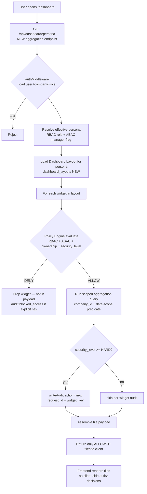
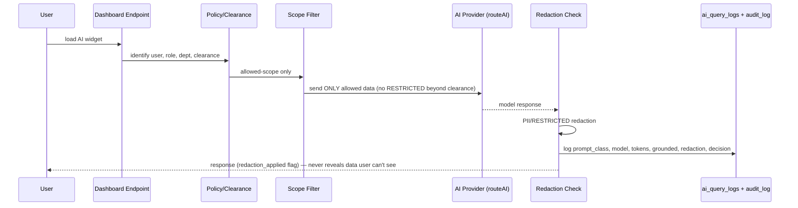

# 20 — Dashboard Design (Role-Based Dashboards)
## Saduak Suay Mai PCL — NEXUS OS AI Workforce OS

> เอกสารฉบับนี้เป็น **Production-grade Dashboard Specification** สำหรับ role-based dashboards ทั้ง 5 persona หลัก (CEO, HR, Manager, Employee, IT/Security) บน NEXUS OS
> ทุก widget ระบุ: **Data Source** (table/endpoint), **Permission/Security Filtering** (RBAC + ABAC + Data-Ownership + Security Level), และ **mapping ไปยังหน้า NEXUS OS ที่มีอยู่จริง**
> สถานะของ component แต่ละตัวจะถูกระบุชัดเจนว่า **`[EXISTS]`** (มีอยู่ใน NEXUS OS แล้ว) หรือ **`[NEW]`** (ต้องสร้าง migration / endpoint / page ใหม่)
>
> Cross-reference: `10-security-matrix.md`, `11-permission-matrix.md`, `12-ai-access-matrix.md`, `09-data-ownership-matrix.md`, `13-employee-digital-twin.md`

---

## สารบัญ (Table of Contents)

1. [หลักการออกแบบ Dashboard (Design Principles)](#1-หลักการออกแบบ-dashboard)
2. [สถาปัตยกรรมการ Render Widget แบบ Permission-Aware](#2-สถาปัตยกรรมการ-render-widget)
3. [Dashboard Registry & Widget Contract (NEW)](#3-dashboard-registry--widget-contract)
4. [Security-Level → Widget Visibility Mapping](#4-security-level--widget-visibility-mapping)
5. [CEO Dashboard](#5-ceo-dashboard)
6. [HR Dashboard](#6-hr-dashboard)
7. [Manager Dashboard](#7-manager-dashboard)
8. [Employee Dashboard](#8-employee-dashboard)
9. [IT / Security Dashboard](#9-it--security-dashboard)
10. [Backend Aggregation Endpoints (NEW)](#10-backend-aggregation-endpoints)
11. [AI Summary Widgets — AI Access Control](#11-ai-summary-widgets)
12. [Audit & Telemetry of Dashboard Itself](#12-audit--telemetry-of-the-dashboard)
13. [NEXUS OS Page Mapping Summary](#13-nexus-os-page-mapping-summary)
14. [Migration & Rollout Checklist](#14-migration--rollout-checklist)

---

## 1. หลักการออกแบบ Dashboard

### 1.1 กฎเหล็ก (Hard Rules)

| # | กฎ | คำอธิบาย |
|---|-----|----------|
| R1 | **Deny-by-default** | Widget ทุกตัวต้องผ่าน policy check ก่อน render; ถ้า policy ไม่ตอบ `ALLOW` → widget **ไม่ถูกส่ง payload** มาที่ frontend เลย (ไม่ใช่แค่ซ่อนด้วย CSS) |
| R2 | **Backend-enforced** | Aggregation ทั้งหมดทำที่ backend; frontend ได้รับเฉพาะ tile ที่ผ่านสิทธิ์แล้ว ไม่มีการ filter ที่ frontend เป็นด่านสุดท้าย |
| R3 | **No data leakage via aggregate** | ตัวเลขสรุป (count/avg/sum) ต้องถูกคำนวณบน **scope ที่ user เห็นได้เท่านั้น** — ห้ามรวมแถวที่ user ไม่มีสิทธิ์ดู (เช่น avg salary ต้องไม่รวมคนนอก scope) |
| R4 | **RESTRICTED never aggregated to non-cleared** | ข้อมูล `security_level = RESTRICTED` (medical/dental/patient, payroll/salary/contract/tax, HR investigation, AI evaluation, executive notes) ต้องไม่ปรากฏแม้ในรูป aggregate ต่อ user ที่ไม่มี direct grant — ดู §4 |
| R5 | **Every widget render = audit event** | การโหลด dashboard widget ที่มี security_level ≥ HARD เขียน `audit_log` action `view` พร้อม `request_id` (ดู §12) |
| R6 | **AI widgets obey AI Access Control** | Widget ที่มี AI-generated content ต้องไหลผ่าน pipeline ใน `12-ai-access-matrix.md`: identify → clearance → filter → model → redaction → audit. ห้าม AI อ่าน DB ตรง |
| R7 | **Tenant isolation** | ทุก aggregation query บังคับ `company_id = :company_id` ผ่าน repository guard (ไม่พึ่ง predicate ที่เขียนมือต่อ query) |

### 1.2 Persona → Default Landing → Security Posture

| Persona | System Roles (จาก `rbac.ts`) | Default Landing | Max Security Level เห็นได้โดย default | หน้า NEXUS ปัจจุบัน |
|---------|------------------------------|-----------------|----------------------------------------|---------------------|
| **CEO** | `ceo`, `admin` | `/dashboard` (CEO cockpit) | RESTRICTED (executive scope, company-wide) | `dashboard/page.tsx`, `dashboard/home` |
| **HR** | `hr` | `/dashboard/people` | RESTRICTED (HR-owned: payroll, investigation) | `dashboard/people`, `dashboard/hr` |
| **Manager** | `operations`,`medical`,`dental`,`finance`,`marketing`,`warehouse`,`franchise`,`it`,`sales` (มี report line) | `/dashboard/{department}` | HARD (department scope, ทีมตน) | `dashboard/operations`, `/medical`, `/dental`, `/finance`, ฯลฯ |
| **Employee** | `staff` (และทุก role เมื่อดูข้อมูลตน) | `/dashboard/home` | BASIC + own-record (data-ownership) | `dashboard/home`, `dashboard/my-data`, `dashboard/my-ai` |
| **IT / Security** | `it`, `admin` (security officer subset) | `/dashboard/audit` | RESTRICTED (security telemetry; **ไม่รวม** business PII content) | `dashboard/audit`, `dashboard/guardian`, `dashboard/ai` |

> **[ASSUMPTION]** "Manager" ไม่ใช่ system role เดี่ยว ๆ — เป็น **derived persona** จาก ABAC: `employee_profiles.is_manager = true` หรือมี `org_units.manager_user_id = :user_id` หรือเป็น head ของ position ที่มี subordinates. NEXUS ปัจจุบันใช้ department-string ผ่าน `departmentScope()` ซึ่งต้องยกระดับเป็น manager-flag จริง (ดู `09-data-ownership-matrix.md`).

---

## 2. สถาปัตยกรรมการ Render Widget



### 2.1 ทำไมต้องเป็น aggregation endpoint ใหม่ (ไม่ใช่ N เรียกตรง)

หน้า dashboard ปัจจุบัน (`home/page.tsx`) ดึงข้อมูลแบบกระจาย (เช่น `self-service/hub`, `skills/me`, payslip). สำหรับ dashboard ระดับ enterprise ที่มี per-widget security ต้องใช้ **single guarded aggregation endpoint ต่อ persona** เพื่อ:
- บังคับ policy check เป็น choke-point เดียว (ไม่ต้อง re-implement สิทธิ์ในทุก controller)
- คำนวณ aggregate บน allowed-scope เท่านั้น (กฎ R3)
- เขียน audit per widget แบบ atomic ผูกด้วย `request_id` เดียว
- รองรับ widget toggle/layout per user (personalization) โดยไม่กระทบ authz

---

## 3. Dashboard Registry & Widget Contract

### 3.1 ตาราง `dashboard_widgets` (NEW — catalog of all widgets)

> Catalog นี้คือ **single source of truth** ของ widget metadata + policy. Policy engine อ่านจากตารางนี้ ทำให้เพิ่ม/แก้ widget โดยไม่แตะโค้ด authz

```sql
-- NEW migration: v11_dashboard.sql
CREATE TABLE IF NOT EXISTS dashboard_widgets (
  id              TEXT PRIMARY KEY,
  company_id      TEXT NOT NULL REFERENCES companies(id),
  widget_key      TEXT NOT NULL,                 -- e.g. 'ceo.company_overview.headcount'
  title_th        TEXT NOT NULL,
  title_en        TEXT NOT NULL,
  persona         TEXT NOT NULL CHECK (persona IN ('ceo','hr','manager','employee','it_security')),
  category        TEXT NOT NULL,                 -- 'kpi' | 'chart' | 'table' | 'alert' | 'ai_summary'
  data_source     TEXT NOT NULL,                 -- canonical query id (resolved server-side)
  security_level  TEXT NOT NULL DEFAULT 'BASIC'
                    CHECK (security_level IN ('BASIC','MEDIUM','HARD','RESTRICTED')),
  required_roles  JSONB NOT NULL DEFAULT '[]',   -- RBAC allow-list
  scope_rule      TEXT NOT NULL DEFAULT 'company'-- 'company'|'department'|'team'|'self'|'direct_grant'
                    CHECK (scope_rule IN ('company','department','team','self','direct_grant')),
  refresh_seconds INTEGER NOT NULL DEFAULT 300,
  is_ai           BOOLEAN NOT NULL DEFAULT FALSE,
  -- standard envelope (per global rule)
  created_at      TIMESTAMPTZ NOT NULL DEFAULT now(),
  updated_at      TIMESTAMPTZ NOT NULL DEFAULT now(),
  deleted_at      TIMESTAMPTZ,
  created_by      TEXT, updated_by TEXT, deleted_by TEXT,
  is_active       BOOLEAN NOT NULL DEFAULT TRUE,
  version         INTEGER NOT NULL DEFAULT 1,
  CONSTRAINT uq_widget_key UNIQUE (company_id, widget_key)
);
CREATE INDEX idx_widgets_persona ON dashboard_widgets(company_id, persona, is_active);
```

### 3.2 ตาราง `dashboard_layouts` (NEW — per-user/per-role layout & toggles)

```sql
CREATE TABLE IF NOT EXISTS dashboard_layouts (
  id           TEXT PRIMARY KEY,
  company_id   TEXT NOT NULL REFERENCES companies(id),
  user_id      TEXT REFERENCES users(id),        -- NULL = role-default layout
  persona      TEXT NOT NULL,
  layout       JSONB NOT NULL DEFAULT '[]',       -- ordered [{widget_key, col, row, w, h, hidden}]
  created_at   TIMESTAMPTZ NOT NULL DEFAULT now(),
  updated_at   TIMESTAMPTZ NOT NULL DEFAULT now(),
  deleted_at   TIMESTAMPTZ, created_by TEXT, updated_by TEXT, deleted_by TEXT,
  is_active    BOOLEAN NOT NULL DEFAULT TRUE, version INTEGER NOT NULL DEFAULT 1,
  security_level TEXT NOT NULL DEFAULT 'BASIC',
  CONSTRAINT uq_layout UNIQUE (company_id, COALESCE(user_id,'__role__'), persona)
);
```

### 3.3 Widget Tile JSON Contract (frontend ↔ backend)

```json
{
  "widget_key": "ceo.risk.burnout",
  "title": { "th": "ความเสี่ยง Burnout", "en": "Burnout Risk" },
  "category": "alert",
  "security_level": "HARD",
  "scope_applied": "company",
  "value": { "high": 4, "medium": 11, "total_staff": 218 },
  "series": [ /* optional time series */ ],
  "rows": [ /* optional table rows, already masked */ ],
  "ai_generated": false,
  "grounded": true,
  "redaction_applied": false,
  "request_id": "req_8f2c...",
  "generated_at": "2026-06-25T03:11:00Z",
  "stale": false
}
```

> **กฎ:** ถ้า widget ถูก deny, **ไม่มี key นี้ใน array** ที่ส่งกลับ — frontend ไม่รู้ด้วยซ้ำว่ามี widget นี้อยู่ (ป้องกัน enumeration)

---

## 4. Security-Level → Widget Visibility Mapping

อ้างอิง 4 ระดับจาก global rule + `10-security-matrix.md`:

| Security Level | ใครเห็นได้ (default) | ตัวอย่าง widget | กลไกบังคับ |
|----------------|----------------------|-----------------|-------------|
| **BASIC** | ทุกคน (authenticated) | My Profile, My KPI, company headcount (number only), announcements | role any |
| **MEDIUM** | สมาชิกแผนกเดียวกัน | Team KPI, Department attendance %, department workload | `scope_rule='department'` + `departmentScope()` |
| **HARD** | owner / manager / HR | Employee Risk, Turnover Risk, Performance review, payroll period status | manager-flag OR `role IN (hr,ceo,admin)` |
| **RESTRICTED** | direct grant เท่านั้น | Patient/medical records, individual salary/payslip, HR investigation, AI evaluation detail, executive notes | `user_permission_groups` direct grant OR explicit ACL; ดู `12-ai-access-matrix.md` |

### 4.1 ตัวอย่างการบังคับ RESTRICTED ใน aggregate

> สถานการณ์: HR Dashboard มี widget "Average Salary by Department". Salary = RESTRICTED.
> **ผิด (data leak):** `SELECT dept, AVG(base_salary) FROM ...` แล้วโชว์ทุก HR
> **ถูก:** เฉพาะ user ที่มี direct grant `payroll.read` ผ่าน `user_permission_groups` เท่านั้นที่ widget นี้ถูก assemble; HR ทั่วไปที่ไม่มี grant → widget ถูก drop; ถ้า dept มีพนักงาน < `k` คน (k-anonymity) → ค่าถูก suppress เป็น `null` พร้อม flag `suppressed_low_n=true`

```sql
-- guard: เฉพาะ cleared principal เท่านั้น + k-anonymity threshold [ASSUMPTION] k=5
SELECT ou.name AS dept,
       CASE WHEN COUNT(*) >= 5 THEN ROUND(AVG(ep.base_salary)) END AS avg_salary,
       COUNT(*) AS n
FROM employee_profiles ep
JOIN org_units ou ON ou.id = ep.org_unit_id
WHERE ep.company_id = :company_id
  AND ep.deleted_at IS NULL
GROUP BY ou.name;
-- only executed if policy_check(user,'payroll.read','RESTRICTED') = ALLOW
```

---

## 5. CEO Dashboard

**Default route:** `/dashboard` (cockpit) — map กับ `nexasos/src/app/dashboard/page.tsx` **[EXISTS]** (ต้องยกระดับ) + ใช้ `dashboard/home`
**Backend persona endpoint:** `GET /api/dashboard/ceo` **[NEW]** — รวม + เสริม `GET /api/ceo/brief` **[EXISTS]** (`ceo.controller.ts::getBrief`, gated `requireRole('admin','ceo')`)
**Scope:** company-wide, security ถึง RESTRICTED (executive clearance)

| # | Widget | Data Source | Permission / Security Filtering | NEXUS mapping |
|---|--------|-------------|----------------------------------|---------------|
| C1 | **Company Overview** (headcount active, branches, depts, MoM growth) | `users` (active count), `org_units`/`departments`, `branches` (v8). Endpoint `ceo/brief` ส่ง `metrics.staff` **[EXISTS]**; เพิ่ม branch/dept counts **[NEW]** | RBAC `ceo,admin`; security **BASIC** (numbers) → **MEDIUM** (per-branch breakdown). `company_id` guard | `dashboard/page.tsx` [EXISTS], `dashboard/org` [EXISTS] |
| C2 | **Department Performance** (KPI attainment per dept, RAG status) | `kpi_entries` (AVG per dept/metric), `work_logs` throughput; `ceo/brief.kpi_trends` **[EXISTS, partial]** → ขยายเป็น per-department rollup **[NEW]** `dashboard_kpi_dept` view | RBAC `ceo,admin`; security **HARD** (cross-dept performance). Aggregate over all depts allowed for CEO scope | `dashboard/reports` [EXISTS], `dashboard/dept-ai` [EXISTS] |
| C3 | **Talent Pool** (skill distribution, top performers, succession-ready, skill gaps) | `skill_scores`, `skill_evidence`, `employee_profiles`; `GET /api/skills` **[EXISTS]** (`skill-wallet.controller::getAll`) + `twin` digital-twin rollup **[EXISTS]** `GET /api/twin` | RBAC `ceo,admin,hr`; security **HARD**. Individual skill detail = **RESTRICTED** (AI evaluation) → masked to band unless direct grant | `dashboard/skills` [EXISTS], `13-employee-digital-twin.md` |
| C4 | **Risk Alert** (burnout high/med, overdue work-logs, SLA escalations, attrition signal) | `getBurnoutRisk(cid)` **[EXISTS]** (`daily-task-agent`), `work_logs status pending/review` **[EXISTS]**, SLA escalation worker **[EXISTS]** | RBAC `ceo,admin`; security **HARD**. Burnout per-person names = **RESTRICTED** → CEO sees aggregate + cleared-only drill | `dashboard/page.tsx` [EXISTS] (burnout_alerts already in brief), `dashboard/guardian` [EXISTS] |
| C5 | **AI Summary** (daily executive brief, 5-bullet strategy) | `routeAI(prompt,'strategy',{grounded:true})` **[EXISTS]** in `ceo.controller::getBrief` → returns `brief` | RBAC `ceo,admin`; **AI Access Control** (§11): prompt สร้างจาก allowed-scope ของ CEO เท่านั้น; redaction check ก่อนแสดง; log `ai_query_logs` **[NEW]** | `dashboard/page.tsx` [EXISTS], `dashboard/gpt` [EXISTS] |
| C6 | **Security Alert** (failed logins spike, permission/role changes, blocked access, suspicious AI queries) | `audit_log` (action `failed_access`/`blocked_access`/`permission_change`/`role_change`), `login_logs` **[NEW]**, `ai_query_logs` **[NEW]** | RBAC `ceo,admin,it`; security **RESTRICTED** (security telemetry). CEO sees executive summary; full forensic = IT/Security dash | `dashboard/audit` [EXISTS], `dashboard/guardian` [EXISTS] |

### 5.1 CEO endpoint response (shape)

```jsonc
// GET /api/dashboard/ceo  → assembled, post-policy
{
  "persona": "ceo",
  "request_id": "req_ceo_...",
  "tiles": [
    { "widget_key": "ceo.company_overview", "value": { "staff": 218, "branches": 9, "depts": 10, "mom_growth_pct": 2.4 }, "security_level": "MEDIUM" },
    { "widget_key": "ceo.dept_performance", "rows": [ { "dept": "Medical", "kpi_attainment": 0.91, "rag": "green" } ], "security_level": "HARD" },
    { "widget_key": "ceo.risk.burnout", "value": { "high": 4, "medium": 11 }, "security_level": "HARD" },
    { "widget_key": "ceo.ai_summary", "ai_generated": true, "grounded": true, "redaction_applied": true,
      "value": { "brief": "• ...\n• ..." }, "security_level": "RESTRICTED" }
  ]
}
```

> **[ASSUMPTION]** headcount 218, 9 branches, growth 2.4% เป็นค่า placeholder สำหรับ aesthetic+dental franchise ขนาดกลางในไทย — ตัวเลขจริงดึงจาก DB ตอน runtime

---

## 6. HR Dashboard

**Default route:** `/dashboard/people` **[EXISTS]** + `/dashboard/hr` **[EXISTS]**
**Backend persona endpoint:** `GET /api/dashboard/hr` **[NEW]** — รวมจาก `hr.controller` (`listAttendance`, `getPayrollSettings`, payroll periods) + `leave.controller` + `skill-wallet` + `twin`
**Scope:** company-wide HR domain; payroll/investigation = RESTRICTED (HR-owned)

| # | Widget | Data Source | Permission / Security Filtering | NEXUS mapping |
|---|--------|-------------|----------------------------------|---------------|
| H1 | **Headcount** (active/inactive, by dept/position/branch, new hires, terminations MTD) | `users`, `employee_profiles`, `org_units`, `positions`, `branches` | RBAC `hr,admin,ceo`; security **MEDIUM→HARD**. `company_id` guard; termination reasons = **RESTRICTED** | `dashboard/people` [EXISTS], `dashboard/org` [EXISTS], `GET /api/hr/org-units` [EXISTS], `GET /api/hr/positions` [EXISTS] |
| H2 | **Attendance** (today clock-in %, late, absent, by branch/shift) | `time_attendance`, `work_shifts`, `attendance_locations`; `GET /api/hr/attendance` **[EXISTS]** (`requireModule('reports')`) | RBAC `hr,admin`; security **MEDIUM**. Per-person lateness drill = **HARD** (manager/HR). Geo from `attendance_locations` (P6) | `dashboard/hr` [EXISTS], `dashboard/home` clock-in [EXISTS] |
| H3 | **Leave** (pending approvals, on-leave today, quota burn-down, leave-type mix) | `leave_requests`, `leave_types`, `employee_leave_quota` (P6), `leave_approval_steps`/`config`; `GET /api/leave` **[EXISTS]** (`requireRole('admin','hr')`), `GET /api/hr/leave-quotas` **[EXISTS]** | RBAC `hr,admin`; security **MEDIUM**. Medical-leave reason = **RESTRICTED** (health) → reason masked unless cleared | `dashboard/hr` [EXISTS], `dashboard/people` [EXISTS] |
| H4 | **Training** (skill-evidence submitted, certifications expiring, training completion %) | `skill_evidence`, `skill_scores`, `knowledge_items`, `onboarding_state`; `GET /api/skills` **[EXISTS]**, `GET /api/onboarding` **[EXISTS]** | RBAC `hr,admin,ceo`; security **MEDIUM**. Per-person scores = **HARD** | `dashboard/skills` [EXISTS], `dashboard/onboarding` [EXISTS] |
| H5 | **Performance** (review cycle status, rating distribution, calibration outliers) | `kpi_entries`, `skill_scores`, `work_logs` reviewed, `twin` evaluation; AI-evaluation detail = **RESTRICTED** | RBAC `hr,admin,ceo`; security **HARD**; individual AI evaluation = **RESTRICTED** (direct grant) — ดู `12-ai-access-matrix.md` | `dashboard/reports` [EXISTS], `dashboard/skills` [EXISTS] |
| H6 | **Turnover Risk** (predicted attrition by dept, drivers: burnout + leave + tenure + low KPI) | `getBurnoutRisk` **[EXISTS]** + `time_attendance` + `kpi_entries` + tenure (`employee_profiles.hire_date`) → composite score view `hr_turnover_risk` **[NEW]** | RBAC `hr,admin,ceo`; security **HARD**. Named at-risk list = **RESTRICTED** (could affect employment) → cleared HR only, audit `view` | `dashboard/guardian` [EXISTS] (risk surface), `dashboard/people` [EXISTS] |
| H7 | **Document Completion** (onboarding docs, contracts signed, missing IDs/tax forms, expiry) | `documents`, `user_files`, `onboarding_state`; contract/tax = **RESTRICTED** | RBAC `hr,admin`; security **HARD→RESTRICTED** (contract/tax). `file_access_logs` **[NEW]** on any open | `dashboard/people` [EXISTS], `documents` API [EXISTS], `13-employee-digital-twin.md` |

### 6.1 HR — RESTRICTED handling examples

- **H3 Medical-leave reason:** field `reason` masked → `"[ลาป่วย — รายละเอียดถูกจำกัดสิทธิ์]"` unless `policy_check(user,'health.read','RESTRICTED')=ALLOW`
- **H6 Turnover named list:** rendered only for HR principals with `permission_group: hr.investigation`; every open → `audit_log(action='view', resource='hr_turnover_risk', security_tier mapped from RESTRICTED)`
- **H7 Contract/tax docs:** download → `file_access_logs` **[NEW]** + `audit_log(action='download')`

---

## 7. Manager Dashboard

**Default route:** `/dashboard/{department}` — เช่น `/dashboard/operations`, `/dashboard/medical`, `/dashboard/dental`, `/dashboard/finance`, `/dashboard/marketing`, `/dashboard/warehouse`, `/dashboard/franchise` **[ALL EXISTS]** + `/dashboard/dept-ai` **[EXISTS]**
**Backend persona endpoint:** `GET /api/dashboard/manager` **[NEW]** — scope ผูกกับ **team ของ manager** (subordinates) ไม่ใช่ทั้งบริษัท
**Scope:** **department / team เท่านั้น** (ABAC manager-flag) — security ถึง HARD ภายใน scope ตน

> **กฎสำคัญ:** Manager เห็นได้เฉพาะ **ลูกทีมตน** — บังคับด้วย `manager_user_id` / `org_unit_id` ของ subordinates ไม่ใช่ department-string กว้าง ๆ (ยกระดับจาก `departmentScope()` ปัจจุบัน). ห้าม manager เห็นเงินเดือน/health ของลูกทีมเว้นได้ direct grant.

| # | Widget | Data Source | Permission / Security Filtering | NEXUS mapping |
|---|--------|-------------|----------------------------------|---------------|
| M1 | **Team KPI** (team KPI attainment vs target, trend, per-member contribution) | `kpi_entries` filtered to subordinate user_ids; `self-service` kpi submissions **[EXISTS]** | ABAC: `kpi_entries.user_id IN (subordinates)`; security **MEDIUM** (team). Cross-team blocked | `dashboard/reports` [EXISTS], `dashboard/{dept}` [EXISTS] |
| M2 | **Workload** (open tasks, work-log backlog, capacity utilization, overload flags) | `tasks`, `task_assignments`, `work_logs` (pending/review), `user_capacity`, `daily_ai_tasks`; `GET /api/work-logs` **[EXISTS]**, `GET /api/tasks` **[EXISTS]** | ABAC: scope = subordinates; security **MEDIUM**. Review rights via `canReviewWorkLog()` **[EXISTS]** (same-dept, not-self) | `dashboard/work` [EXISTS], `dashboard/worklog` [EXISTS] |
| M3 | **Performance** (per-member rating, work-log quality, review queue) | `work_logs` reviewed by manager, `skill_scores`, `twin`; `PATCH /api/work-logs/:id/review` **[EXISTS]** (`requireRole(...MANAGER_ROLES)`) | ABAC manager-of-record; security **HARD**. AI-evaluation detail = **RESTRICTED** (band only) | `dashboard/worklog` [EXISTS], `dashboard/skills` [EXISTS] |
| M4 | **Training Gap** (skill gaps vs role profile, recommended training per member) | `skill_scores` vs `positions` required-skills; `skill_evidence`; gap view `team_skill_gap` **[NEW]** | ABAC subordinates; security **MEDIUM**. Individual gap = **HARD** | `dashboard/skills` [EXISTS], `dashboard/dept-ai` [EXISTS] |
| M5 | **Employee Risk** (burnout/overload/attendance flags for own team) | `getBurnoutRisk` filtered to subordinates **[EXISTS, needs scoping]** + `time_attendance` + work-log overdue | ABAC subordinates only; security **HARD**. Health-derived risk masked; named list = team-scoped, audit `view` | `dashboard/guardian` [EXISTS] (scope to team), `dashboard/{dept}` [EXISTS] |

### 7.1 Manager scope guard (canonical predicate)

```sql
-- subordinate set for a manager (ABAC), reused by every manager widget
WITH my_team AS (
  SELECT u.id AS user_id
  FROM users u
  JOIN employee_profiles ep ON ep.user_id = u.id
  JOIN org_units ou ON ou.id = ep.org_unit_id
  WHERE u.company_id = :company_id
    AND (ou.manager_user_id = :manager_id          -- direct org-unit reports
         OR ep.reports_to_user_id = :manager_id)   -- explicit report line [NEW column]
    AND u.deleted_at IS NULL
)
-- M1: SELECT ... FROM kpi_entries k JOIN my_team t ON t.user_id = k.user_id WHERE k.company_id = :company_id
```

> **[NEW]** ต้องเพิ่มคอลัมน์ `employee_profiles.reports_to_user_id` และ/หรือใช้ `org_units.manager_user_id` ให้เป็น authoritative report-line (ปัจจุบัน NEXUS ยังไม่ wire org_units เข้า authz — ดู inventory gap #6).

---

## 8. Employee Dashboard

**Default route:** `/dashboard/home` **[EXISTS]** + `/dashboard/my-data` **[EXISTS]** + `/dashboard/my-ai` **[EXISTS]**
**Backend persona endpoint:** `GET /api/dashboard/employee` **[NEW]** — รวม `GET /api/self-service/hub` **[EXISTS]** + `GET /api/skills/me` **[EXISTS]** + payslip + notifications
**Scope:** **own record only** (data-ownership) — BASIC + self. ห้ามเห็นข้อมูลคนอื่นเด็ดขาด

> **กฎ data-ownership:** ทุก widget query บังคับ `user_id = :self_id`. แม้แต่ payslip ของตน (RESTRICTED) ก็ scope `:self_id` + `getPayslip` ถูก gate ด้วย ownership ที่ controller

| # | Widget | Data Source | Permission / Security Filtering | NEXUS mapping |
|---|--------|-------------|----------------------------------|---------------|
| E1 | **My Profile** (position, dept, manager, tenure, contact) | `users`, `employee_profiles`, `org_units`, `positions`; `GET /api/self-service/hub` **[EXISTS]**, `PATCH /api/self-service/profile` **[EXISTS]** | Ownership `user_id=:self`; security **BASIC**. Salary band **not** shown here (RESTRICTED) | `dashboard/my-data` [EXISTS], `dashboard/home` [EXISTS] |
| E2 | **My KPI** (my metrics vs target, trend, this period) | `kpi_entries WHERE user_id=:self`; `POST /api/self-service/kpi` **[EXISTS]** | Ownership self; security **BASIC** (own data) | `dashboard/home` [EXISTS], `dashboard/my-data` [EXISTS] |
| E3 | **My Goal** (assigned goals/OKRs, daily AI tasks, progress) | `daily_ai_tasks`, `task_assignments`, `tasks`; `GET /api/self-service/daily-tasks` **[EXISTS]**, `PATCH .../complete` **[EXISTS]** | Ownership self; security **BASIC** | `dashboard/home` (งาน AI วันนี้) [EXISTS], `dashboard/work` [EXISTS] |
| E4 | **My Training** (skill score, evidence status, recommended courses, certs) | `skill_scores`, `skill_evidence`; `GET /api/skills/me` **[EXISTS]**, `POST /api/self-service/skill-evidence` **[EXISTS]** | Ownership self; security **BASIC**. AI-evaluation rationale = **RESTRICTED** (band only to self) | `dashboard/skills` [EXISTS], `dashboard/home` Skill Score [EXISTS] |
| E5 | **My Files** (my documents, payslips, contracts — download trail) | `user_files`, `documents`, `payslips`; `GET /api/hr/payroll/payslip/:userId/:periodId` **[EXISTS]** (self-scoped) | Ownership self; payslip/contract = **RESTRICTED** but self-readable; every download → `file_access_logs` **[NEW]** + audit | `dashboard/my-data` [EXISTS], `dashboard/home` payslip card [EXISTS] |
| E6 | **AI Suggestion** (personalized AI tips, next best action, memory-aware) | `user_ai_memory`, `routeAI` personal context; `GET /api/user-ai` **[EXISTS]**, `dashboard/my-ai` **[EXISTS]** | Ownership self; **AI Access Control**: AI sees only self-scope; redaction; `ai_query_logs` **[NEW]** | `dashboard/my-ai` [EXISTS], `dashboard/memory` [EXISTS] |

### 8.1 Employee payslip ownership guard (RESTRICTED, self-readable)

```ts
// self-service / hr payslip: ownership enforced BEFORE returning RESTRICTED
if (req.params.userId !== req.user.id
    && !userCanAccessModule(req.user, 'payroll')) {
  await writeAudit(req, { action: 'blocked_access', resource: 'payslips',
                          resource_id: req.params.userId, result: 'denied',
                          failure_reason: 'not_owner_no_payroll_grant' })
  return res.status(403).json({ error: 'forbidden' })
}
// allowed → audit view + file_access_logs on export
```

---

## 9. IT / Security Dashboard

**Default route:** `/dashboard/audit` **[EXISTS]** + `/dashboard/guardian` **[EXISTS]** + `/dashboard/ai` **[EXISTS]**
**Backend persona endpoint:** `GET /api/dashboard/it-security` **[NEW]** — รวม `GET /api/audit` **[EXISTS]** (`requireRole('admin','ceo','it','hr')`) + `GET /api/ai-stats` **[EXISTS]** (`requireRole('admin','it')`) + new security-log tables
**Scope:** security telemetry company-wide (RESTRICTED) — **เห็น metadata/forensics ไม่เห็น business PII content**

> **กฎสำคัญ:** IT/Security เห็น **ใคร-ทำอะไร-เมื่อไหร่-ที่ไหน** (actor, action, target id, ip, ua) แต่ **ไม่เห็นเนื้อหา RESTRICTED ของ business** (เช่น เนื้อ medical record, ตัวเลข salary จริง) เว้นแต่ direct grant แยกต่างหาก — แยก "security plane" ออกจาก "data plane"

| # | Widget | Data Source | Permission / Security Filtering | NEXUS mapping |
|---|--------|-------------|----------------------------------|---------------|
| S1 | **Login Log** (success/fail logins, by user/ip/device, geo, session timeline) | `login_logs` **[NEW]** (ปัจจุบัน auth events ไม่ถูก log — inventory gap #3). Source: `auth.controller` sign-in/out → write event | RBAC `it,admin`; security **RESTRICTED** (security telemetry). No password/secret fields ever | `dashboard/audit` [EXISTS], `dashboard/guardian` [EXISTS] |
| S2 | **Failed Access** (403/blocked attempts, repeated denials, target tables, escalation) | `audit_log` action `failed_access`/`blocked_access` **[EXISTS schema, needs enriched cols]** + `login_logs` failed | RBAC `it,admin`; security **RESTRICTED**. Group by actor + target + reason | `dashboard/audit` [EXISTS] |
| S3 | **Permission Change** (role grant/revoke, permission-group edits, who/when/before-after) | `permission_change_logs` **[NEW]** (gap #3: permission_groups edits unaudited) + `audit_log` action `permission_change`/`role_change` with before/after JSON **[NEW cols]** | RBAC `it,admin`; security **RESTRICTED**. Before/after = field-level diff | `dashboard/audit` [EXISTS], `dashboard/settings` user-groups [EXISTS via `hr/permission-groups`] |
| S4 | **AI Access Log** (every AI query: actor, prompt-class, model/provider, tokens, decision auto/suggest/human, grounded, redaction, blocked) | `ai_query_logs` **[NEW]** (gap #4: prompt/response/provider/model not persisted) + `ai_logs` **[EXISTS, partial]** + `GET /api/ai-stats` **[EXISTS]** | RBAC `it,admin`; security **RESTRICTED**. **Prompt/response content masked** to security viewers (PII) — show class + flags, full content only with `ai.audit.read` grant | `dashboard/ai` [EXISTS], `dashboard/audit` [EXISTS], `12-ai-access-matrix.md` |
| S5 | **Suspicious Activity** (anomaly: off-hours access, mass-export, privilege spikes, impersonation, rate-limit hits) | Composite over `audit_log` + `login_logs` + `request_metrics` **[EXISTS]** + impersonation (`impersonated_by` in JWT **[EXISTS]**) → rules engine `security_anomalies` **[NEW]** | RBAC `it,admin`; security **RESTRICTED**. Each alert links `request_id` to forensic trail | `dashboard/guardian` [EXISTS], `dashboard/audit` [EXISTS] |
| S6 | **File Download Log** (who downloaded which file, size, security_level of file, export events) | `file_access_logs` **[NEW]** (gap #3: user_files served with only tier label, no trail) + `audit_log` action `download`/`export` | RBAC `it,admin`; security **RESTRICTED**. RESTRICTED-file downloads highlighted; correlate with S5 mass-export | `dashboard/audit` [EXISTS], `dashboard/guardian` [EXISTS] |

### 9.1 NEW security-log tables (referenced by IT/Security widgets)

> ตารางเหล่านี้แก้ inventory gaps #1 และ #3 โดยตรง — รายละเอียดเต็มอยู่ใน `10-security-matrix.md` / audit-architecture doc; ที่นี่แสดง schema ย่อเฉพาะที่ dashboard ต้องอ่าน

```sql
-- S1: login_logs (NEW) — auth events currently unlogged
CREATE TABLE login_logs (
  id TEXT PRIMARY KEY, company_id TEXT NOT NULL REFERENCES companies(id),
  user_id TEXT, email_attempted TEXT, event TEXT NOT NULL
    CHECK (event IN ('login_success','login_failed','logout','token_refresh','lockout','mfa_challenge')),
  ip_address TEXT, user_agent TEXT, device TEXT, session_id TEXT, request_id TEXT,
  failure_reason TEXT, created_at TIMESTAMPTZ NOT NULL DEFAULT now(),
  security_level TEXT NOT NULL DEFAULT 'RESTRICTED'
);
CREATE INDEX idx_login_logs_lookup ON login_logs(company_id, created_at DESC, event);

-- S6: file_access_logs (NEW) — file serving currently untracked
CREATE TABLE file_access_logs (
  id TEXT PRIMARY KEY, company_id TEXT NOT NULL REFERENCES companies(id),
  user_id TEXT NOT NULL, file_id TEXT NOT NULL, file_security_level TEXT NOT NULL,
  action TEXT NOT NULL CHECK (action IN ('view','download','export','print')),
  bytes INTEGER, ip_address TEXT, user_agent TEXT, request_id TEXT,
  result TEXT NOT NULL CHECK (result IN ('allowed','denied')), failure_reason TEXT,
  created_at TIMESTAMPTZ NOT NULL DEFAULT now(),
  security_level TEXT NOT NULL DEFAULT 'RESTRICTED'
);

-- S3: permission_change_logs (NEW)
CREATE TABLE permission_change_logs (
  id TEXT PRIMARY KEY, company_id TEXT NOT NULL REFERENCES companies(id),
  actor_user_id TEXT NOT NULL, target_user_id TEXT, target_group_id TEXT,
  change_type TEXT NOT NULL CHECK (change_type IN ('role_change','group_assign','group_unassign','grant_add','grant_revoke')),
  before_state JSONB, after_state JSONB, changed_fields JSONB,
  ip_address TEXT, request_id TEXT, created_at TIMESTAMPTZ NOT NULL DEFAULT now(),
  security_level TEXT NOT NULL DEFAULT 'RESTRICTED'
);

-- S4: ai_query_logs (NEW) — linked to audit_log by request_id per global rule
CREATE TABLE ai_query_logs (
  id TEXT PRIMARY KEY, company_id TEXT NOT NULL REFERENCES companies(id),
  user_id TEXT NOT NULL, request_id TEXT NOT NULL,
  prompt_class TEXT, provider TEXT, model TEXT,
  prompt_redacted TEXT, response_redacted TEXT,           -- PII-redacted copies for forensics
  tokens_in INTEGER, tokens_out INTEGER, latency_ms INTEGER,
  decision TEXT CHECK (decision IN ('auto','suggest','human')),
  grounded BOOLEAN, redaction_applied BOOLEAN, blocked BOOLEAN, block_reason TEXT,
  result TEXT, created_at TIMESTAMPTZ NOT NULL DEFAULT now(),
  security_level TEXT NOT NULL DEFAULT 'RESTRICTED'
);
CREATE INDEX idx_aiq_lookup ON ai_query_logs(company_id, created_at DESC);
```

### 9.2 Append-only enforcement (applies to all S-widgets' sources)

> ตาม global rule "audit append-only / never editable" — security-log tables ต้องบังคับ immutability:

```sql
-- revoke UPDATE/DELETE on log tables for app role; INSERT-only
REVOKE UPDATE, DELETE ON login_logs, file_access_logs, permission_change_logs,
       ai_query_logs, audit_log FROM nexus_app;
-- trigger to block updates even from elevated paths (defense in depth)
CREATE OR REPLACE FUNCTION block_mutation() RETURNS trigger AS $$
BEGIN RAISE EXCEPTION 'append-only: % not allowed', TG_OP; END; $$ LANGUAGE plpgsql;
CREATE TRIGGER trg_login_logs_immutable BEFORE UPDATE OR DELETE ON login_logs
  FOR EACH ROW EXECUTE FUNCTION block_mutation();
-- (repeat per table) + optional hash-chain prev_hash column for tamper-evidence
```

---

## 10. Backend Aggregation Endpoints

| Endpoint | Status | Gate | Returns |
|----------|--------|------|---------|
| `GET /api/dashboard/ceo` | **[NEW]** | `requireRole('ceo','admin')` | tiles C1–C6 |
| `GET /api/dashboard/hr` | **[NEW]** | `requireRole('hr','admin','ceo')` | tiles H1–H7 |
| `GET /api/dashboard/manager` | **[NEW]** | `authMiddleware` + ABAC manager-flag (`requireManager` **[NEW middleware]**) | tiles M1–M5 (team-scoped) |
| `GET /api/dashboard/employee` | **[NEW]** | `authMiddleware` (any) | tiles E1–E6 (self-scoped) |
| `GET /api/dashboard/it-security` | **[NEW]** | `requireRole('it','admin')` | tiles S1–S6 |
| `GET /api/dashboard/widgets` | **[NEW]** | `authMiddleware` | personalization catalog (filtered to allowed widgets) |
| `PATCH /api/dashboard/layout` | **[NEW]** | `authMiddleware` | save own layout/toggles |

### 10.1 Reused existing endpoints (do not duplicate)

| Existing endpoint | Status | Feeds widgets |
|-------------------|--------|---------------|
| `GET /api/ceo/brief` | **[EXISTS]** | C1, C2, C4, C5 |
| `GET /api/hr/attendance` | **[EXISTS]** | H2 |
| `GET /api/leave`, `GET /api/hr/leave-quotas` | **[EXISTS]** | H3 |
| `GET /api/skills`, `GET /api/skills/me` | **[EXISTS]** | C3, H4, M4, E4 |
| `GET /api/twin` | **[EXISTS]** | C3, H5, M3 |
| `GET /api/self-service/hub` + sub-routes | **[EXISTS]** | E1–E5 |
| `GET /api/work-logs`, `GET /api/tasks` | **[EXISTS]** | M2, E3 |
| `GET /api/audit` | **[EXISTS]** | S2, S3, S5, S6 |
| `GET /api/ai-stats` | **[EXISTS]** | S4 |
| `GET /api/notifications` | **[EXISTS]** | all (alert badges) |

### 10.2 Shared policy-engine middleware (NEW)

```ts
// applies R1–R7 once per widget assembly
async function assembleDashboard(persona: Persona, req: Req): Promise<Tile[]> {
  const widgets = await loadWidgetsForPersona(req.user.company_id, persona) // dashboard_widgets
  const layout  = await loadLayout(req.user, persona)                        // dashboard_layouts
  const tiles: Tile[] = []
  for (const w of orderByLayout(widgets, layout)) {
    const decision = policyEngine.evaluate({              // RBAC + ABAC + ownership + level
      user: req.user, requiredRoles: w.required_roles,
      securityLevel: w.security_level, scopeRule: w.scope_rule,
    })
    if (decision !== 'ALLOW') continue                    // R1: drop entirely
    const scope = resolveScope(w.scope_rule, req.user)    // company|department|team|self|grant
    const data  = await runScopedQuery(w.data_source, req.user.company_id, scope) // R3,R7
    if (rank(w.security_level) >= rank('HARD')) {
      await writeAudit(req, { action: 'view', resource: w.widget_key,
        security_tier: mapTier(w.security_level), result: 'allowed' })          // R5
    }
    tiles.push(maskAndEnvelope(w, data, decision))        // R4 masking + k-anon
  }
  return tiles
}
```

---

## 11. AI Summary Widgets

Widgets ที่มี AI content: **C5 (CEO AI Summary)**, **H5/H6 drivers narrative**, **M4 training recommendation**, **E6 (AI Suggestion)**, **S4 (AI Access Log — meta only)**.

ทั้งหมดต้องไหลผ่าน pipeline ใน `12-ai-access-matrix.md`:



**กฎเฉพาะ AI widgets:**
- **R-AI-1**: AI ไม่อ่าน DB ตรง — รับเฉพาะ pre-filtered context จาก scope filter (R6)
- **R-AI-2**: ก่อนส่ง prompt ออก external provider → redact PII (ปัจจุบัน NEXUS **ยังไม่ทำ** — inventory gap #4: `sanitize.ts`/`encryption.ts` ไม่อยู่ใน AI path). ต้องเพิ่ม redaction stage ใน `ai-router.ts`
- **R-AI-3**: response ต้องผ่าน output redaction — AI ห้ามเปิดเผยข้อมูลที่ user ดูไม่ได้ (เช่น เงินเดือนคนอื่น, medical record)
- **R-AI-4**: ทุก AI widget call → `ai_query_logs` **[NEW]** + linked `audit_log` action `ai_query`/`ai_response` ด้วย `request_id` เดียว
- **R-AI-5**: decision-right (auto/suggest/human) จาก `resolveDecisionRights` **[EXISTS]** — dashboard AI = `suggest` เสมอ ("Copilot not Autopilot"); ไม่มี auto-action จาก dashboard

---

## 12. Audit & Telemetry of the Dashboard

ตัว dashboard เองคือ surface ที่เข้าถึงข้อมูลอ่อนไหว จึงต้องถูก audit:

| เหตุการณ์ | action ใน `audit_log` | เมื่อไหร่ |
|-----------|------------------------|-----------|
| โหลด widget security_level ≥ HARD | `view` | ทุกครั้งที่ assemble tile (R5) |
| navigate ไป dashboard ที่ไม่มีสิทธิ์ (explicit URL) | `blocked_access` | guard 403 |
| drill-down ดูรายชื่อ at-risk / payslip / medical | `view` (RESTRICTED tier) | เมื่อ expand |
| export/download จาก widget | `export` / `download` + `file_access_logs` | ทุกครั้ง |
| AI widget query | `ai_query` + `ai_query_logs` | ทุกครั้ง |
| เปลี่ยน layout/toggle | `update` (resource `dashboard_layouts`) | บันทึก layout |

**Enrichment ที่ต้องเพิ่ม** (ปัจจุบัน `audit_log` ขาด — inventory gap #1): `ip_address`, `user_agent`, `request_id`, `session_id`, `endpoint`, `http_method`, `result`, `failure_reason`, `before_state`/`after_state`. Dashboard endpoints ใหม่ทั้งหมดต้องส่ง field เหล่านี้เข้า `writeAudit()` (ต้องอัปเกรด `audit.ts` ให้รับ envelope เต็ม และ **ไม่ swallow error** สำหรับ tier ≥ HARD).

---

## 13. NEXUS OS Page Mapping Summary

| Persona | Widget | Existing NEXUS Page (frontend) | Existing Endpoint | New Work |
|---------|--------|--------------------------------|-------------------|----------|
| CEO | C1 Company Overview | `dashboard/page.tsx`, `dashboard/org` | `ceo/brief` (partial) | branch/dept counts |
| CEO | C2 Department Performance | `dashboard/reports`, `dashboard/dept-ai` | `ceo/brief.kpi_trends` (partial) | per-dept rollup view |
| CEO | C3 Talent Pool | `dashboard/skills` | `skills`, `twin` | succession band view |
| CEO | C4 Risk Alert | `dashboard/page.tsx`, `dashboard/guardian` | `ceo/brief.burnout_alerts` | SLA/attrition merge |
| CEO | C5 AI Summary | `dashboard/page.tsx`, `dashboard/gpt` | `ceo/brief.brief` (routeAI) | redaction + `ai_query_logs` |
| CEO | C6 Security Alert | `dashboard/audit`, `dashboard/guardian` | `audit` | `login_logs`, exec summary |
| HR | H1 Headcount | `dashboard/people`, `dashboard/org` | `hr/org-units`, `hr/positions` | dashboard rollup |
| HR | H2 Attendance | `dashboard/hr` | `hr/attendance` | branch/shift breakdown |
| HR | H3 Leave | `dashboard/hr`, `dashboard/people` | `leave`, `hr/leave-quotas` | quota burn-down viz |
| HR | H4 Training | `dashboard/skills`, `dashboard/onboarding` | `skills`, `onboarding` | cert-expiry tracker |
| HR | H5 Performance | `dashboard/reports`, `dashboard/skills` | `twin`, `work-logs` | review-cycle status |
| HR | H6 Turnover Risk | `dashboard/guardian`, `dashboard/people` | `getBurnoutRisk` | composite `hr_turnover_risk` |
| HR | H7 Document Completion | `dashboard/people` | `documents` | `file_access_logs`, completeness view |
| Manager | M1 Team KPI | `dashboard/{dept}`, `dashboard/reports` | `kpi_entries` via self-service | team-scope query |
| Manager | M2 Workload | `dashboard/work`, `dashboard/worklog` | `work-logs`, `tasks` | capacity rollup |
| Manager | M3 Performance | `dashboard/worklog`, `dashboard/skills` | `work-logs/:id/review` | review queue |
| Manager | M4 Training Gap | `dashboard/skills`, `dashboard/dept-ai` | `skills` | `team_skill_gap` view |
| Manager | M5 Employee Risk | `dashboard/guardian`, `dashboard/{dept}` | `getBurnoutRisk` | team scoping |
| Employee | E1 My Profile | `dashboard/my-data`, `dashboard/home` | `self-service/hub`, `self-service/profile` | — |
| Employee | E2 My KPI | `dashboard/home`, `dashboard/my-data` | `self-service/kpi` | — |
| Employee | E3 My Goal | `dashboard/home`, `dashboard/work` | `self-service/daily-tasks` | — |
| Employee | E4 My Training | `dashboard/skills`, `dashboard/home` | `skills/me`, `self-service/skill-evidence` | — |
| Employee | E5 My Files | `dashboard/my-data`, `dashboard/home` | `hr/payroll/payslip/:userId/:periodId` | `file_access_logs` |
| Employee | E6 AI Suggestion | `dashboard/my-ai`, `dashboard/memory` | `user-ai` | redaction + `ai_query_logs` |
| IT/Sec | S1 Login Log | `dashboard/audit`, `dashboard/guardian` | — | `login_logs` table + auth hooks |
| IT/Sec | S2 Failed Access | `dashboard/audit` | `audit` | enriched audit cols |
| IT/Sec | S3 Permission Change | `dashboard/audit`, `dashboard/settings` | `hr/permission-groups` | `permission_change_logs` |
| IT/Sec | S4 AI Access Log | `dashboard/ai`, `dashboard/audit` | `ai-stats`, `ai_logs` | `ai_query_logs` |
| IT/Sec | S5 Suspicious Activity | `dashboard/guardian`, `dashboard/audit` | `request_metrics` | `security_anomalies` rules |
| IT/Sec | S6 File Download Log | `dashboard/audit`, `dashboard/guardian` | — | `file_access_logs` |

---

## 14. Migration & Rollout Checklist

**DB migrations (deploy via `railway up` to `nexus-api`):**
- [ ] `v11_dashboard.sql` — `dashboard_widgets`, `dashboard_layouts`
- [ ] `v12_security_logs.sql` — `login_logs`, `file_access_logs`, `permission_change_logs`, `ai_query_logs`
- [ ] `v13_audit_enrich.sql` — add `ip_address,user_agent,request_id,session_id,endpoint,http_method,result,failure_reason,before_state,after_state` to `audit_log`
- [ ] `v14_authz_scoping.sql` — `employee_profiles.reports_to_user_id`, wire `org_units.manager_user_id`
- [ ] append-only triggers + `REVOKE UPDATE,DELETE` on all log tables (§9.2)
- [ ] aggregation views: `dashboard_kpi_dept`, `hr_turnover_risk`, `team_skill_gap`

**Backend (`backend/`):**
- [ ] `dashboard.controller.ts` + `dashboard.route.ts` (5 persona endpoints + layout)
- [ ] `policyEngine.evaluate()` central policy module (RBAC+ABAC+ownership+level)
- [ ] `requireManager` ABAC middleware
- [ ] auth hooks → `login_logs`; file serving → `file_access_logs`
- [ ] `ai-router.ts` redaction stage + `ai_query_logs` write
- [ ] upgrade `audit.ts` to full envelope, non-swallow for tier ≥ HARD

**Frontend (`nexasos/`, deploy `railway up` to `nexus-web`):**
- [ ] persona-aware dashboard shell rendering tile array from `/api/dashboard/:persona`
- [ ] no client-side authz — render only returned tiles
- [ ] layout/toggle UI → `PATCH /api/dashboard/layout`
- [ ] seed `dashboard_widgets` catalog rows for all 30 widgets above (per company at signup, consistent with seed-at-signup model)

**Verification (per MEMORY: prod build, not `next dev`):**
- [ ] each persona token sees only its allowed tiles (deny-by-default proven)
- [ ] RESTRICTED widgets absent from non-cleared payloads (not just hidden)
- [ ] aggregate numbers exclude out-of-scope rows (R3) + k-anonymity holds
- [ ] every HARD/RESTRICTED widget load produces an immutable `audit_log` row with `request_id`
- [ ] AI widget never returns data the user cannot independently view

---

### หมายเหตุเรื่องค่าที่ยังไม่ทราบจริง ([ASSUMPTION] รวม)
- Headcount/branch/growth ตัวเลขใน §5 = placeholder; runtime ดึงจาก DB
- k-anonymity threshold `k=5` สำหรับ salary/sensitive aggregates = สมมติฐานที่สมเหตุสมผล (ปรับได้ใน policy config)
- "Manager" เป็น derived persona จาก manager-flag/report-line ไม่ใช่ system role เดี่ยว
- KPI target/formula, salary band, SLA threshold ของแต่ละ widget อ้างอิงค่าจริงจาก `kpi_entries`/`payroll_settings`/SLA config — ไม่ hardcode ในเอกสารนี้
