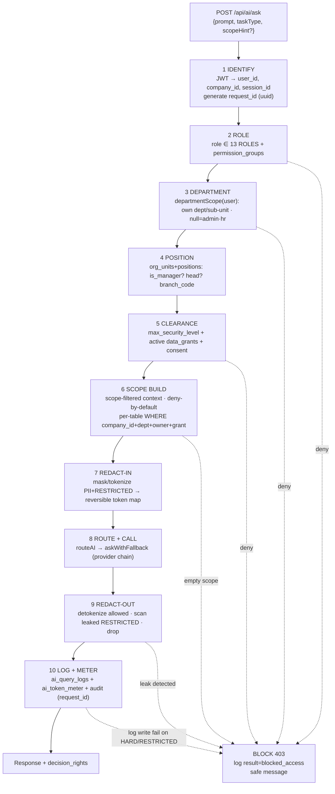
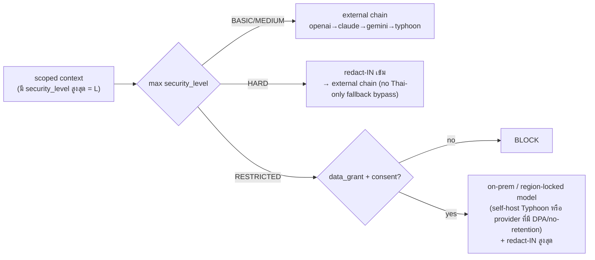
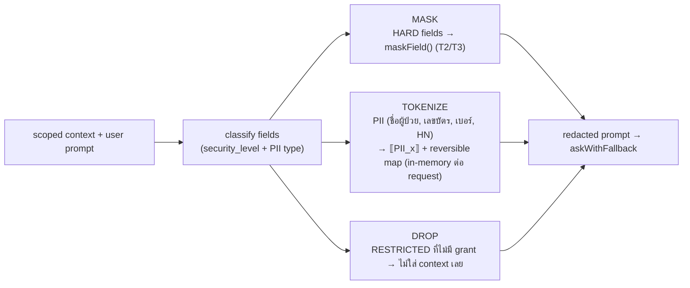
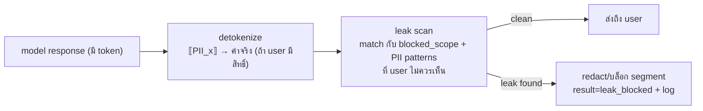
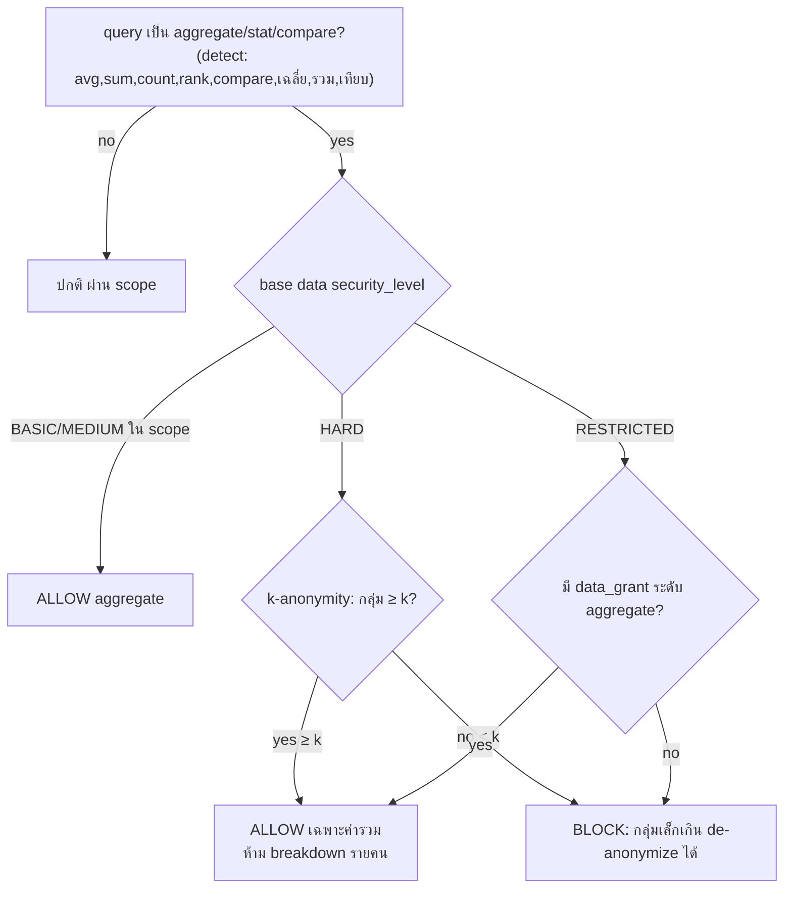
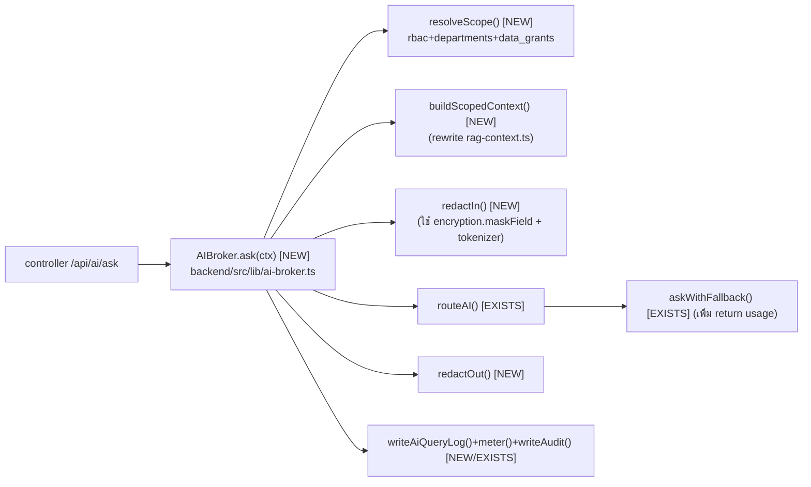

# 21 — AI Architecture (สถาปัตยกรรม AI Workforce)

> เอกสารสถาปัตยกรรมระดับ **Production** สำหรับ **Saduak Suay Mai PCL** — AI Workforce OS บน **NEXUS OS** (Next.js 16 + Express + PostgreSQL, Railway: `nexus-web` / `nexus-api` / Postgres, deploy ด้วย `railway up` ต่อ service)
> ขอบเขตเอกสารนี้: **สถาปัตยกรรมของ AI Workforce ทั้งระบบ** — access-control flow, provider routing (ต่อยอดจาก `routeAI` / `askWithFallback` / `ai_logs` / decision-rights "Copilot not Autopilot"), data-filtering/redaction layer, schema ของ `ai_query_logs`, per-role allowed-scope enforcement, prompt-construction แบบ **only-allowed-data**, และ guardrails ที่กัน AI ไม่ให้ **aggregate ข้อมูล RESTRICTED** โดยไม่มีสิทธิ์
> เอกสารคู่กัน: `12-ai-access-matrix.md` (เมทริกซ์สิทธิ์รายแถว/รายคอลัมน์), `10-security-matrix.md`, `11-permission-matrix.md`, `09-data-ownership-matrix.md`. เอกสารฉบับนี้เป็น **architecture/engineering view** ของ AI; เมทริกซ์ฉบับ 12 เป็น **policy view**
> รูปแบบ: ภาษาไทยเชิงบรรยาย + ศัพท์เทคนิค/identifier เป็นภาษาอังกฤษ

---

## 0. หลักการเหล็ก (Non-negotiable Principles)

AI ใน NEXUS OS ทำงานภายใต้หลักการ **"Copilot not Autopilot"** และที่สำคัญกว่านั้นคือ **AI ไม่ใช่ user ที่มีสิทธิ์พิเศษ** — AI มีสิทธิ์ **เท่ากับหรือน้อยกว่า** ผู้ใช้ที่กำลังถามเสมอ ไม่มีวันมากกว่า

1. **AI never reads the DB directly.** Model (OpenAI / Claude / Gemini / Typhoon) **ห้าม** ต่อ `DATABASE_URL`, ห้ามรับ raw SQL, ห้ามมี DB-tool เอง ทุก byte ที่ถึง model ต้องผ่าน **AI Data Broker** (backend) ที่บังคับสิทธิ์ก่อน
2. **AI ≤ User (least-privilege mirror).** `allowed_scope(AI) = intersection( สิ่งที่ user เห็นได้ , สิ่งที่ query ต้องใช้ )` ถ้า user เปิดหน้านั้นเองเห็น `****` AI ก็ต้องเห็น `****`
3. **Deny-by-default.** scope ใดที่ไม่ได้ระบุว่า allow = ปฏิเสธ ไม่มี implicit allow
4. **Backend-enforced on every AI query.** การกรองเกิดที่ backend ทุกครั้ง; system prompt / frontend เป็นแค่ UX hint — **ห้าม** ใช้ "บอก AI ให้ปิดบัง" เป็นกลไกความปลอดภัย (untrusted boundary)
5. **Redact before model + scan after model.** ข้อมูลออกนอก NEXUS ต้อง redact ก่อน; คำตอบกลับมาต้อง scan ก่อนถึง user
6. **Every AI interaction logged (append-only).** เขียน `ai_query_logs` ทุกครั้ง เชื่อม `audit_log` ด้วย `request_id`; ถ้า query แตะ `HARD`/`RESTRICTED` แล้ว log เขียนไม่สำเร็จ = **block** (ไม่ fire-and-forget แบบเดิม)
7. **RESTRICTED ไม่ AI-readable ด้วย role อย่างเดียว.** ต้องมี **direct grant** (`data_grants`) + consent เสมอ
8. **No silent aggregation of RESTRICTED.** AI ห้าม "เลี่ยง" ข้อจำกัด row-level ด้วยการขอ aggregate/avg/count บนข้อมูล RESTRICTED เว้นแต่ผ่าน aggregation-guardrail (§9)

> **สถานะ NEXUS OS วันนี้ (gap ที่เอกสารนี้ปิด):** `routeAI()` ส่ง raw prompt + `buildOrgContext()` (org เต็ม) ไป external provider **โดยไม่ redact**; masking ใน `encryption.ts`/`sanitize.ts` **ไม่อยู่ใน AI path**; metering ปลอม (`Math.ceil(prompt.length/4)` tokens, `cost_thb = 0.5` hardcoded); ไม่มี `ai_query_logs`; ai_logs insert เป็น fire-and-forget `try{}catch{}`. ทุกอย่างต่อไปนี้ที่ระบุ **[NEW]** = migration/middleware ที่ต้องสร้าง; **[EXISTS]** = ของเดิมที่นำมา wire

---

## 1. Grounding กับ NEXUS OS ปัจจุบัน

| Building block | สถานะ | ที่อยู่ | บทบาทในสถาปัตยกรรม AI |
|---|---|---|---|
| `routeAI(prompt, taskType, opts)` + `ROUTES` + `resolveTaskType()` | **EXISTS** | `backend/src/lib/ai-router.ts` | จุดเข้า AI; ต้องห่อด้วย AI Data Broker |
| `askWithFallback()` chain `[openai,claude,gemini,typhoon]`, vision `[openai,gemini]` | **EXISTS** | `backend/src/lib/ai-providers.ts` | egress boundary → redact ก่อนตรงนี้ |
| `resolveDecisionRights()` (auto/suggest/human ต่อ task, override ต่อ company) | **EXISTS** | `ai-router.ts` + `companies.settings.ai_decision_rights` | กำกับ output gating |
| `buildOrgContext(companyId, viewerRole, viewerUserId)` (RAG, tier-gated หยาบ) | **EXISTS (gap)** | `backend/src/lib/rag-context.ts` | เปลี่ยนเป็น **scope-filtered ต่อ user** |
| 13 system roles (`ROLES`), `MODULE_ACCESS`, `canAccessModule()` | **EXISTS** | `backend/src/lib/rbac.ts` | identify role + module gate |
| `canViewTier()` / `maskField()` / `sanitizeUserForRole()` (T0–T3) | **EXISTS (gap: ไม่อยู่ใน AI path)** | `backend/src/lib/encryption.ts` | tier→security_level + masking |
| `departmentScope()` / `canReviewWorkLog()` | **EXISTS** | `backend/src/lib/departments.ts` | department-scope filter |
| `permission_groups`, `user_permission_groups`, `userCanAccessModule()` | **EXISTS** | `nexus-hr-schema.ts` / `lib/user-permissions.ts` | grant เพิ่ม/RESTRICTED |
| `org_units`, `positions`, `employee_profiles` | **EXISTS (ยังไม่ wire authz)** | `nexus-hr-schema.ts` | position-level scope |
| `ai_logs` (id, company, user, agent, action, tokens_used, cost_thb, status) | **EXISTS (gap)** | `db.ts` core | metering หยาบ → เสริมด้วย `ai_query_logs` |
| `audit_log` / `writeAudit()` | **EXISTS (gap)** | `nexus-schema.ts` / `lib/audit.ts` | เชื่อม AI ด้วย `request_id` |
| `probeAllProviders()` / `getRouterStatus()` / `getProviderStatus()` | **EXISTS** | `ai-providers.ts` / `ai-router.ts` | health/observability |
| `patients` (health PII) | **EXISTS** | `nexus-full-schema.ts` | RESTRICTED scope หลัก |

**ตารางใหม่ที่ AI Architecture ต้องสร้าง [NEW migration]:** `ai_query_logs`, `ai_redaction_events`, `ai_data_scopes`, `data_grants`, `ai_consent_log`, `ai_token_meter`. ทุกตารางต้องมี BASE COLUMN CONTRACT (ดู §6.1)

### 1.1 Security level ↔ NEXUS tier mapping

| Security Level (org spec) | NEXUS tier | baseline ใครเห็น | ตัวอย่าง |
|---|---|---|---|
| **BASIC** | T0/T1 | ทุกคน (authenticated) | ปฏิทินรวม, ประกาศ, KPI definition, knowledge สาธารณะ, ชื่อ/ตำแหน่งเพื่อนร่วมงาน |
| **MEDIUM** | T1 (department-scoped) | คนในแผนกเดียวกัน | งาน/worklog ในแผนก, deal/lead ทีม, เคสในแผนก, meeting summary แผนก |
| **HARD** | T2 | owner / manager สายตรง / HR / Finance | salary band, payroll สรุป, advance, ผลประเมิน aggregate, contract metadata |
| **RESTRICTED** | T3 (+ direct grant) | direct grant เท่านั้น | Medical/Dental/Patient, payslip/tax/contract เต็มราย, HR investigation, AI evaluation รายคน, Executive notes |

> `canViewTier()` วันนี้: T2 = `[admin,finance,hr,it]`, T3 = `[admin,hr]`. เอกสารนี้ทำให้เข้มขึ้น: **RESTRICTED ไม่ใช้ role-list ลอย ๆ** ต้องผ่าน `data_grants` ต่อ resource (§5)

---

## 2. สถาปัตยกรรมรวม (Layered View)

AI Workforce แทรกเป็น **L3 (AI Orchestration Layer)** ระหว่าง API controllers กับ external model providers โดยมี **AI Data Broker** เป็นด่านบังคับสิทธิ์ที่ทุก request ต้องผ่าน

```mermaid
flowchart TB
  subgraph WEB["nexus-web (Next.js 16)"]
    UI[AI Chat / MyAI / DeptAI / CEO Copilot]
  end

  subgraph API["nexus-api (Express)"]
    direction TB
    MW["Edge middleware<br/>JWT auth · rateLimit · requestMetrics · CORS · helmet"]
    CTRL["/api/ai/* controllers<br/>requireRole · requireModule"]
    subgraph BROKER["★ AI Data Broker [NEW] — บังคับสิทธิ์ทุก query"]
      P1[1 Identify] --> P2[2 Role] --> P3[3 Dept] --> P4[4 Position]
      P4 --> P5[5 Clearance + grants] --> P6[6 Scope build]
      P6 --> P7[7 Redact-IN] --> P8[8 Route+Call] --> P9[9 Redact-OUT]
      P9 --> P10[10 Log+Meter]
    end
    ROUTER["routeAI() / ROUTES / decision-rights<br/>[EXISTS]"]
    PROV["askWithFallback()<br/>[EXISTS]"]
  end

  subgraph DB["PostgreSQL (Railway)"]
    CORE[(core tables<br/>users·patients·transactions·…)]
    GRANTS[(data_grants · ai_data_scopes<br/>ai_redaction_events [NEW])]
    LOGS[(ai_query_logs · audit_log<br/>ai_token_meter [NEW])]
  end

  subgraph EXT["External Model Providers (egress)"]
    OAI[OpenAI gpt-4o]
    CLA[Claude sonnet]
    GEM[Gemini 2.0]
    TYP[Typhoon v2.5]
  end

  UI -->|Bearer JWT| MW --> CTRL --> BROKER
  P5 --- CORE
  P5 --- GRANTS
  P6 --- CORE
  P8 --> ROUTER --> PROV --> EXT
  EXT --> P9
  P10 --> LOGS
  P10 -.->|request_id| LOGS
```

**กฎสถาปัตยกรรม:** controllers **ห้าม** เรียก `routeAI()`/`askWithFallback()` ตรง ๆ อีกต่อไป ต้องผ่าน `AIBroker.ask()` เท่านั้น (บังคับด้วย lint rule + code review — ดู §11)

---

## 3. Access-Control Flow (10 ด่าน — บังคับทุก query)

ทุก AI query วิ่งผ่าน pipeline เดียวกันที่ backend ก่อนถึง model และก่อนถึง user ด่านใดล้มเหลว = **block + log + คืน safe message**



| ด่าน | input | กลไก | ของเดิม / ใหม่ |
|---|---|---|---|
| 1 Identify | Bearer JWT | `auth.ts` middleware โหลด user+company; gen `request_id` | EXISTS / `request_id` [NEW] |
| 2 Role | user.role | `ROLES`, `permission_groups` | EXISTS |
| 3 Department | user.department | `departmentScope()` | EXISTS |
| 4 Position | user_id | `org_units`+`positions` join | EXISTS data / wire [NEW] |
| 5 Clearance | role+grants | `canViewTier()` + `data_grants` + `ai_consent_log` | EXISTS+[NEW] |
| 6 Scope build | clearance | scope-filtered queries (ไม่ใช้ tier หยาบ) | rewrite `buildOrgContext` [NEW] |
| 7 Redact-IN | scoped data | redaction layer (§7) | [NEW] |
| 8 Route+Call | redacted prompt | `routeAI`/`askWithFallback` | EXISTS |
| 9 Redact-OUT | model text | detokenize + leak scan | [NEW] |
| 10 Log+Meter | full trace | `ai_query_logs`+`ai_token_meter`+`audit` | [NEW] |

---

## 4. Provider Routing (ต่อยอด routeAI / askWithFallback)

### 4.1 ของเดิมที่คงไว้

`ROUTES` map task → provider+model+decision_rights+fallback chain (จาก `ai-router.ts`):

| task_type | primary | model | decision_rights (default) | prefer chain |
|---|---|---|---|---|
| `strategy` | claude | claude-sonnet | **suggest** | claude → openai → gemini |
| `automation` | openai | gpt-4o | **suggest** | openai → claude → gemini |
| `research` | openai | gpt-4o | auto | openai → gemini → claude |
| `thai_market` | typhoon | typhoon-v2.5-30b | auto | typhoon → openai → gemini |
| `general` | openai | gpt-4o | auto | openai → gemini → claude → typhoon |

`askWithFallback()` ลองตาม chain (กรองด้วย `hasProvider()` จาก env keys); vision ใช้ `[openai,gemini]`; `resolveDecisionRights()` อ่าน override จาก `companies.settings.ai_decision_rights`

### 4.2 ส่วนขยาย [NEW] — Routing ที่คำนึง data-classification

ปัญหา: chain เดิมส่ง data ออก external provider โดยไม่สน security_level ของ data ที่อยู่ใน context. เพิ่ม **classification-aware routing**:



กฎ routing เพิ่มเติม:
- **data-residency:** ถ้า context มี patient/medical (RESTRICTED) → **ห้ามออก** ไป provider ที่ไม่มี DPA / มี training-retention. **[ASSUMPTION]** สำหรับคลินิกในไทย ควรตั้ง `AI_RESTRICTED_PROVIDER` ชี้ self-hosted Typhoon หรือ provider ที่ปิด data-retention และมี BAA-equivalent; ถ้าไม่มีให้ block
- **PDPA boundary:** PII ของผู้ป่วย/ลูกค้าต้องผ่าน redact-IN เสมอ (§7) ก่อนถึง provider ใด ๆ
- **deterministic provider per security_level:** บันทึก `provider`+`model` จริงที่ถูกเลือกลง `ai_query_logs.provider/model` (ของเดิมไม่บันทึก)

### 4.3 Decision-rights enforcement (Copilot not Autopilot)

`decision_rights` กำหนดว่า output ของ AI ถูกนำไปใช้ได้แค่ไหน — บังคับที่ broker ไม่ใช่แค่ UI:

| decision_rights | ความหมาย | การบังคับ |
|---|---|---|
| `auto` | AI กระทำได้เอง (read-only / low-risk) | log อย่างเดียว |
| `suggest` | AI เสนอ ต้องมีคนกด approve | ผลถูก stage ใน `task_assignments`/draft, รอ human approve, log `decision=suggested` |
| `human` | คนตัดสินเท่านั้น AI ให้ข้อมูลประกอบ | ห้าม auto-execute; ต้อง approve+second-approve สำหรับ RESTRICTED |

**กฎ:** action ใดที่ write/แตะ HARD/RESTRICTED → **forced `human`** เสมอ ไม่ว่า task default จะเป็นอะไร (override `resolveDecisionRights` ด้วย `escalateForSecurityLevel()`)

---

## 5. Per-role Allowed-Scope Enforcement

### 5.1 Scope resolution (deny-by-default)

`allowed_scope` คำนวณต่อ (user × table × operation) เป็น intersection ของ 4 มิติ:

```
allowed_rows(user, table) =
    rows WHERE company_id = user.company_id          -- tenant isolation (hard)
      AND securityLevelGate(user, table.security_level)  -- BASIC/MEDIUM/HARD/RESTRICTED
      AND ( department_match OR ownership_match OR has_data_grant )
      AND deleted_at IS NULL
```

```mermaid
flowchart TD
  REQ["query ต้องการ table T"] --> T1{tenant: company_id ตรง?}
  T1 -->|no| D[DENY]
  T1 -->|yes| T2{security_level(T) ≤ user clearance?}
  T2 -->|no| T2b{has data_grant for T?}
  T2b -->|no| D
  T2b -->|yes| OK
  T2 -->|yes| T3{scope rule}
  T3 -->|BASIC| OK[ALLOW]
  T3 -->|MEDIUM| T3b{dept/sub-unit ตรง?}
  T3b -->|yes| OK
  T3b -->|no| D
  T3 -->|HARD| T3c{owner/manager/HR/Finance?}
  T3c -->|yes| OK
  T3c -->|no| D
```

### 5.2 ตัวอย่าง allowed-scope ต่อ role (สรุป — รายละเอียดเต็มใน 12-ai-access-matrix.md)

| Role | BASIC | MEDIUM (dept) | HARD | RESTRICTED |
|---|---|---|---|---|
| `staff` | ✅ ทั้งหมด | เฉพาะแผนกตน | เฉพาะ data ของตน (own payslip ผ่าน grant) | ❌ (grant only) |
| `operations` / `marketing` / `sales` | ✅ | แผนกตน + sub-unit | ❌ | ❌ |
| `medical` / `dental` | ✅ | แผนก clinic | ❌ payroll | **patient ของสาขา/เคสตน** ผ่าน grant + consent |
| `finance` | ✅ | Finance | payroll/transactions aggregate | payslip รายคนผ่าน grant |
| `hr` | ✅ | People | salary band, attendance | HR investigation/AI eval ผ่าน grant |
| `ceo` | ✅ | ทุกแผนก (read) | aggregate ทั้งบริษัท | Executive notes; patient/payslip รายคน **ยังต้อง grant** |
| `it` | ✅ | IT + system | system/audit metadata | ❌ clinical/payroll content (เห็น metadata เท่านั้น) |
| `admin` | bypass RBAC แต่ **ไม่ bypass RESTRICTED content** ใน AI path — ยังต้อง grant + ถูก log เข้ม | | | |

> สำคัญ: `admin` ใน `rbac.ts` short-circuit ทุก module check — แต่ใน **AI path** เรา **ไม่ให้ admin bypass RESTRICTED data content** (เห็น metadata/มี grant ได้ แต่ทุกครั้งถูก log `security_level=RESTRICTED, actor=admin` และต้อง consent) เพื่อกัน super-user exfiltration ผ่าน AI

### 5.3 `data_grants` (RESTRICTED direct-grant) [NEW]

direct grant คือทางเดียวที่ทำให้ AI เห็น RESTRICTED ได้ — ต่อ (grantee × resource × scope × หมดอายุ):

```sql
CREATE TABLE data_grants (
  id            TEXT PRIMARY KEY,
  company_id    TEXT NOT NULL REFERENCES companies(id),
  grantee_user  TEXT NOT NULL REFERENCES users(id),
  resource_type TEXT NOT NULL,            -- 'patient' | 'payslip' | 'hr_case' | 'ai_eval' | 'exec_note'
  resource_id   TEXT,                     -- NULL = ทั้ง type (ต้อง approver สูง); else row เดียว
  security_level TEXT NOT NULL DEFAULT 'RESTRICTED' CHECK (security_level IN ('HARD','RESTRICTED')),
  ai_readable   BOOLEAN NOT NULL DEFAULT FALSE,   -- เปิด AI ให้เห็นเฉพาะเมื่อ TRUE
  granted_by    TEXT NOT NULL REFERENCES users(id),
  reason        TEXT NOT NULL,
  expires_at    TIMESTAMPTZ,             -- NULL = ต้อง review รายไตรมาส
  -- BASE COLUMN CONTRACT (ดู §6.1)
  created_at TIMESTAMPTZ NOT NULL DEFAULT now(), updated_at TIMESTAMPTZ NOT NULL DEFAULT now(),
  deleted_at TIMESTAMPTZ, created_by TEXT, updated_by TEXT, deleted_by TEXT,
  is_active  BOOLEAN NOT NULL DEFAULT TRUE, version INT NOT NULL DEFAULT 1,
  UNIQUE (company_id, grantee_user, resource_type, resource_id)
);
CREATE INDEX idx_grants_active ON data_grants (company_id, grantee_user, resource_type)
  WHERE deleted_at IS NULL AND is_active = TRUE;
```

---

## 6. ai_query_logs และ AI Telemetry [NEW]

`ai_logs` เดิม (id, company_id, user_id, agent, action, tokens_used, cost_thb, status) **เก็บน้อยเกิน** — ไม่มี prompt/response, provider/model, latency, scope, decision, grounded, redaction. แทนที่ด้วย **`ai_query_logs`** (ตัว `ai_logs` คงไว้ backward-compat สำหรับ dashboard เดิม แต่ source-of-truth คือ `ai_query_logs`)

### 6.1 BASE COLUMN CONTRACT (ทุก core table ใหม่)

```sql
id TEXT PRIMARY KEY,
company_id TEXT NOT NULL REFERENCES companies(id),
created_at TIMESTAMPTZ NOT NULL DEFAULT now(),
updated_at TIMESTAMPTZ NOT NULL DEFAULT now(),
deleted_at TIMESTAMPTZ,                       -- soft-delete
created_by TEXT, updated_by TEXT, deleted_by TEXT,
is_active  BOOLEAN NOT NULL DEFAULT TRUE,
version    INT NOT NULL DEFAULT 1,            -- optimistic lock
security_level TEXT NOT NULL DEFAULT 'BASIC'
  CHECK (security_level IN ('BASIC','MEDIUM','HARD','RESTRICTED'))
```

### 6.2 `ai_query_logs`

```sql
CREATE TABLE ai_query_logs (
  id            TEXT PRIMARY KEY,
  company_id    TEXT NOT NULL REFERENCES companies(id),
  request_id    TEXT NOT NULL,            -- เชื่อมกับ audit_log (1 query = 1 request_id)
  session_id    TEXT,
  user_id       TEXT REFERENCES users(id),
  user_role     TEXT NOT NULL,
  user_department TEXT,

  task_type     TEXT NOT NULL,            -- strategy|automation|research|thai_market|general
  provider      TEXT NOT NULL,            -- provider ที่ถูกเลือกจริง (openai|claude|gemini|typhoon)
  model         TEXT NOT NULL,
  fallback_used BOOLEAN NOT NULL DEFAULT FALSE,
  fallback_chain JSONB,                   -- providers ที่ลองจริง + error

  prompt_redacted TEXT NOT NULL,          -- เก็บ prompt ที่ "redact แล้ว" เท่านั้น (ห้ามเก็บ raw PII)
  prompt_hash     TEXT NOT NULL,          -- sha256(raw prompt) สำหรับ dedup/correlate โดยไม่เก็บ raw
  response_redacted TEXT,                 -- response ที่ผ่าน redact-OUT
  response_hash   TEXT,

  grounded        BOOLEAN NOT NULL DEFAULT FALSE,
  context_sources JSONB,                  -- ['users','meetings','transactions:income', ...]
  allowed_scope   JSONB NOT NULL,         -- {tables, max_security_level, dept, grants[]}
  blocked_scope   JSONB,                  -- สิ่งที่ถูกตัดออกเพราะไม่มีสิทธิ์
  max_security_level TEXT NOT NULL,       -- security_level สูงสุดที่แตะใน query นี้
  redaction_applied JSONB,                -- {pii_masked:n, restricted_tokenized:n, output_dropped:n}

  decision_rights TEXT NOT NULL,          -- auto|suggest|human
  decision_outcome TEXT,                  -- executed|suggested|awaiting_approval|rejected

  tokens_prompt   INT, tokens_completion INT, tokens_total INT,  -- จาก provider usage จริง
  cost_thb        NUMERIC(12,4),          -- เมตริงจริง (ไม่ใช่ 0.5 hardcoded)
  latency_ms      INT,

  result          TEXT NOT NULL,          -- success|blocked_access|failed_access|provider_error|leak_blocked
  failure_reason  TEXT,
  ip_address      TEXT, user_agent TEXT, endpoint TEXT, http_method TEXT,

  created_at TIMESTAMPTZ NOT NULL DEFAULT now(),
  security_level TEXT NOT NULL DEFAULT 'HARD'   -- log นี้เองเป็น HARD (มี trace)
);

CREATE INDEX idx_aiql_company_time ON ai_query_logs (company_id, created_at DESC);
CREATE INDEX idx_aiql_request ON ai_query_logs (request_id);
CREATE INDEX idx_aiql_user ON ai_query_logs (company_id, user_id, created_at DESC);
CREATE INDEX idx_aiql_seclevel ON ai_query_logs (company_id, max_security_level, created_at DESC);
```

**Append-only enforcement** (เหมือน `audit_log` target): REVOKE UPDATE/DELETE จาก app role + trigger กัน mutation:

```sql
CREATE OR REPLACE FUNCTION block_aiql_mutation() RETURNS trigger AS $$
BEGIN RAISE EXCEPTION 'ai_query_logs is append-only'; END $$ LANGUAGE plpgsql;
CREATE TRIGGER trg_aiql_no_update BEFORE UPDATE OR DELETE ON ai_query_logs
  FOR EACH ROW EXECUTE FUNCTION block_aiql_mutation();
```

### 6.3 `ai_token_meter` (เมตริงจริง) + cost model

```sql
CREATE TABLE ai_token_meter (
  id TEXT PRIMARY KEY,
  company_id TEXT NOT NULL REFERENCES companies(id),
  ai_query_log_id TEXT NOT NULL REFERENCES ai_query_logs(id),
  provider TEXT NOT NULL, model TEXT NOT NULL,
  tokens_prompt INT NOT NULL, tokens_completion INT NOT NULL,
  unit_price_in_thb NUMERIC(12,8), unit_price_out_thb NUMERIC(12,8),
  cost_thb NUMERIC(12,4) NOT NULL,
  created_at TIMESTAMPTZ NOT NULL DEFAULT now()
);
```

- token นับจาก provider `usage` จริง (OpenAI/Claude คืน usage; Gemini ผ่าน `usageMetadata`; Typhoon ผ่าน `usage`) — **เลิก** `Math.ceil(prompt.length/4)`
- `unit_price_*` เก็บเป็นตารางราคา per-model (config) → คูณ token → `cost_thb` จริง (เลิก hardcoded 0.5)

> **[ASSUMPTION]** ราคา per-1K-token เป็นค่า config ใน env/`ai_pricing` ไม่ hardcode; FX USD→THB ดึงรายวันหรือ fix รายเดือน

### 6.4 เชื่อมกับ audit_log

ทุก AI query เขียน **สอง** record: (1) `ai_query_logs` (รายละเอียด AI), (2) `audit_log` action `ai_query`/`ai_response`/`blocked_access` ที่ผูก `request_id` เดียวกัน → audit เป็น index กลาง, AI log เป็นรายละเอียดลึก

---

## 7. Data-Filtering / Redaction Layer [NEW]

ชั้นนี้คือสิ่งที่ NEXUS วันนี้ **ไม่มี** — `routeAI` ส่ง context ดิบออก external provider เลย

### 7.1 Redact-IN (ก่อนถึง model)



- **MASK:** ใช้ `maskField()`/`sanitizeUserForRole()` ที่มีอยู่ (salary T2/T3) — แต่ย้ายมาเรียก **ใน AI path** (ปัจจุบันไม่เรียก)
- **TOKENIZE (reversible):** PII ที่ "user เห็นได้แต่ไม่ควรหลุดออก external provider" (เช่น ชื่อผู้ป่วยที่ medical user มีสิทธิ์เห็น) → แทนด้วย placeholder `PT_01`, เก็บ map ใน request context (ไม่ persist), detokenize ตอน redact-OUT → user เห็นชื่อจริง แต่ provider เห็นแค่ token
- **DROP (irreversible):** RESTRICTED ที่ไม่มี grant → ไม่เข้า context ตั้งแต่ scope build (ด่าน 6) อยู่แล้ว; redact-IN เป็น defense-in-depth ชั้นสอง
- บันทึกสรุปลง `ai_query_logs.redaction_applied`

PII patterns (ไทย) ที่ต้อง detect: เลขบัตรประชาชน 13 หลัก, HN/AN, เบอร์โทร, อีเมล, ชื่อ-นามสกุล (จาก `users`/`patients`), เลขบัญชี/พร้อมเพย์, เลขผู้เสียภาษี

### 7.2 Redact-OUT (หลัง model ก่อนถึง user)



- detokenize เฉพาะ token ที่ user มีสิทธิ์ (จาก map); token ที่ user ไม่มีสิทธิ์ (กรณี model สังเคราะห์เอง) → คงเป็น placeholder/ตัดทิ้ง
- **leak scan:** ถ้า model "เดา/หลุด" ค่าที่อยู่ใน `blocked_scope` (เช่น เงินเดือนคนอื่น, ชื่อผู้ป่วยข้ามสาขา) → ตัด segment + `result=leak_blocked` + alert
- หลักการ: **model ไม่เคยเป็นแหล่งความจริงด้านสิทธิ์** — output ต้องผ่าน scan เสมอ

---

## 8. Prompt Construction (only-allowed-data)

`buildOrgContext()` เดิม gate ด้วย `canViewTier()` แบบหยาบ (role-list) และ `LIMIT 20 users` ดิบ — ต้อง rewrite เป็น **scope-filtered ต่อ user**

### 8.1 โครงสร้าง prompt ที่ broker ประกอบ

```
[SYSTEM]  identity + decision_rights + "ตอบเฉพาะจาก CONTEXT; ห้ามเดา; ถ้าไม่มีใน context ให้บอกว่าไม่มีสิทธิ์/ไม่มีข้อมูล"
[POLICY]  max_security_level=<L>; ห้าม aggregate/infer RESTRICTED; ถ้าถูกขอข้อมูลนอก scope → ปฏิเสธ
[CONTEXT] เฉพาะ rows ที่ผ่าน allowed_scope (ด่าน 6) + redact-IN (ด่าน 7) เท่านั้น
[USER]    คำถามผู้ใช้ (ผ่าน PII tokenize)
```

> system/policy prompt เป็น **UX guardrail เสริม** เท่านั้น — ความปลอดภัยจริงอยู่ที่ "context มีแต่ data ที่อนุญาต" (deny-by-default ที่ data layer) ไม่ใช่ที่ instruction

### 8.2 Rewrite `buildOrgContext` → `buildScopedContext(user, scope, query)`

```ts
// [NEW] แทน buildOrgContext เดิม
async function buildScopedContext(ctx: BrokerContext): Promise<RAGContext> {
  const parts: string[] = []; const sources: string[] = [];
  const scope = ctx.allowedScope;   // จากด่าน 5–6

  // ทุก query มี tenant + soft-delete + dept/owner predicate เสมอ
  if (scope.tables.has('users')) {
    const emps = await queryAll(
      `SELECT name, role, department FROM users
       WHERE company_id = $1 AND deleted_at IS NULL AND status='active'
         AND ($2::text IS NULL OR department = $2)   -- dept scope (null=admin/hr)
       LIMIT 50`, [ctx.companyId, scope.department]);
    parts.push(`People: ${emps.map(e=>`${e.name}[${e.role}/${e.department}]`).join(', ')}`);
    sources.push('users');
  }
  if (scope.maxLevel >= HARD && scope.tables.has('transactions')) { /* finance aggregate */ }
  if (scope.grants.has('patient')) { /* เฉพาะ patient ที่ grant ต่อ resource_id */ }
  // RESTRICTED ที่ไม่มี grant → ไม่ถูก query เลย (deny-by-default)
  return { text: parts.join('\n'), sources };
}
```

ความต่างจากเดิม: (1) ผูก `deleted_at IS NULL`, (2) department predicate จริง (ไม่ใช่ tier หยาบ), (3) RESTRICTED ผ่าน grant ต่อ resource_id, (4) คืน `sources` ลง `ai_query_logs.context_sources`

---

## 9. Aggregation Guardrails (กัน AI รวมข้อมูล RESTRICTED โดยไม่มีสิทธิ์)

ภัยคุกคามหลัก: user สิทธิ์ต่ำเลี่ยง row-level restriction ด้วยการขอ **aggregate / สถิติ / inference** — เช่น "เงินเดือนเฉลี่ยแผนก Dental เท่าไร", "ผู้ป่วยที่ทำ filler เดือนนี้กี่คน ใครบ้าง", "เทียบผลประเมินทีมฉันกับทีมอื่น" — ทั้งหมดนี้ derive RESTRICTED แม้ row เดี่ยวถูกบล็อก

### 9.1 กฎ Aggregation



กฎเหล็ก:
1. **No row-leak via aggregate:** AI ห้ามคืน breakdown รายบุคคลของข้อมูล HARD/RESTRICTED แม้ผู้ใช้ถามเป็น aggregate — คืนได้เฉพาะค่ารวมที่ผ่าน k-anonymity
2. **k-anonymity threshold:** aggregate บน HARD/RESTRICTED ต้องมีสมาชิกกลุ่ม **≥ k** (**[ASSUMPTION]** `k=5` สำหรับ payroll/HR, `k=10` สำหรับ patient cohort) มิฉะนั้น block เพราะกลุ่มเล็กเปิดให้ re-identify
3. **No cross-scope join inference:** ห้าม AI เชื่อม BASIC+MEDIUM เพื่อ derive RESTRICTED (เช่น เดาเงินเดือนจากตำแหน่ง+อายุงาน) — detect intent + ปฏิเสธ
4. **Patient cohort = grant เสมอ:** การนับ/วิเคราะห์ผู้ป่วยเป็นกลุ่ม (medical analytics) ต้องมี grant `resource_type='patient', ai_readable=true` + consent (PDPA) ไม่งั้น block
5. **Audit ทุก aggregate ที่แตะ HARD/RESTRICTED:** บันทึก `max_security_level` + `aggregation=true` ลง `ai_query_logs` แม้ผลผ่าน k-anon

### 9.2 จุดบังคับใน pipeline

aggregation guardrail ทำงานที่ **ด่าน 6 (scope build)** สำหรับ data ที่ดึง + **ด่าน 9 (redact-OUT)** สำหรับ output ที่ model อาจสังเคราะห์เกินสิทธิ์ — สองชั้น (defense-in-depth)

---

## 10. AI Surfaces / Agents (จับคู่ scope ต่อ surface)

| Surface | ผู้ใช้ | scope เริ่มต้น | decision_rights | หมายเหตุ |
|---|---|---|---|---|
| **MyAI** (`/myai`) | ทุกคน | own data + BASIC + dept(MEDIUM) | suggest | ถามเรื่องงานตัวเอง |
| **DeptAI** (`/deptai`) | manager+ | MEDIUM ทั้งแผนก | suggest | สรุป/วิเคราะห์แผนก, aggregate ผ่าน k-anon |
| **CEO Copilot** (`/ceo`) | ceo/admin | aggregate ทั้งบริษัท (read) | human สำหรับ action | exec notes/patient/payslip รายคน **ต้อง grant** |
| **Clinical Assist** | medical/dental | patient ของเคส/สาขาตน (grant+consent) | human | RESTRICTED route → region-locked model |
| **Router API** (`/api/ai-router/route`) | MANAGER_ROLES | ตาม caller | ตาม task | EXISTS — ต้องห่อ broker |

ทุก surface เรียก `AIBroker.ask()` เดียวกัน — scope ต่างกันที่ "ผู้ถามเป็นใคร" ไม่ใช่ที่ surface (surface เป็นแค่ default scopeHint)

---

## 11. การ Implement (mapping → โค้ดจริง)



งานที่ต้องทำ (migration + code):
1. **[NEW migration]** สร้าง `ai_query_logs`, `ai_token_meter`, `data_grants`, `ai_consent_log`, `ai_redaction_events` + append-only triggers (ตาม `migrations.ts` v11+)
2. **[NEW]** `backend/src/lib/ai-broker.ts` — orchestrate 10 ด่าน; controllers ทั้งหมดเรียกตัวนี้
3. **[REWRITE]** `rag-context.ts` → `buildScopedContext()` (deny-by-default, dept predicate, grant)
4. **[NEW]** `backend/src/lib/ai-redaction.ts` — redact-IN/OUT + Thai PII tokenizer
5. **[PATCH]** `ai-providers.ts` `askWithFallback()` → คืน `usage{prompt,completion}` จริงจากทุก provider
6. **[PATCH]** `ai-router.ts` → รับ redacted prompt, บันทึก provider/model จริง, เลิก fake metering; เพิ่ม `escalateForSecurityLevel()` (forced `human` สำหรับ HARD/RESTRICTED)
7. **[NEW]** lint/CI rule: ห้าม import `routeAI`/`askWithFallback` นอก `ai-broker.ts`
8. **[PATCH]** `encryption.ts` masking + `sanitizeUserForRole()` ถูกเรียกใน AI path (ปัจจุบันไม่)
9. **[PATCH]** AI log writes สำหรับ HARD/RESTRICTED = **blocking** (ถ้า write fail → block query) ไม่ใช่ `try{}catch{}` swallow

### 11.1 Deploy (Railway)
- migration รันตอน boot `nexus-api` (`initSchema()` → `runMigrations()` ตาม Dockerfile/`index.js`) — ไม่ต้องแก้ topology, แค่เพิ่ม migration v11+
- env เพิ่ม: `AI_RESTRICTED_PROVIDER`, `AI_PII_TOKENIZE=true`, `AI_KANON_PAYROLL=5`, `AI_KANON_PATIENT=10`, `AI_PRICING_*` (per-model THB)
- deploy ด้วย `railway up` ต่อ service ตาม MEMORY (ไม่ใช่ GitHub auto-deploy)

---

## 12. Failure Modes & Safe Defaults

| สถานการณ์ | พฤติกรรม |
|---|---|
| scope ว่าง (ไม่มี data อนุญาต) | คืน "ไม่มีข้อมูลที่คุณมีสิทธิ์เข้าถึง" + log `blocked_access` |
| ทุก provider ล่ม (`askWithFallback` throw) | คืน safe message + log `provider_error`; ไม่ leak partial context |
| redact-IN ล้มเหลว/ไม่แน่ใจ classification | **fail-closed**: ไม่ส่ง field นั้น (default RESTRICTED) |
| leak scan เจอ RESTRICTED ใน output | ตัด segment, `result=leak_blocked`, alert IT/HR |
| log write fail บน HARD/RESTRICTED | **block** query (no untraceable RESTRICTED access) |
| RESTRICTED provider ไม่ตั้งค่า | block query ที่แตะ RESTRICTED (ไม่ fallback ไป external) |
| consent (PDPA) ขาดสำหรับ patient | block + log; ต้อง consent ก่อน |

---

## 13. สรุปกฎเหล็ก (Engineer Checklist)

- [ ] controller ไม่เรียก `routeAI`/`askWithFallback` ตรง — ผ่าน `AIBroker.ask()` เท่านั้น
- [ ] context ผ่าน deny-by-default scope (tenant + dept + owner + grant + `deleted_at IS NULL`)
- [ ] PII tokenize ก่อนออก external provider; mask HARD ด้วย `maskField()`
- [ ] RESTRICTED เข้า context **เฉพาะ** มี `data_grants.ai_readable=true` + consent
- [ ] aggregate บน HARD/RESTRICTED ผ่าน k-anonymity; ห้าม breakdown รายคน
- [ ] output ผ่าน redact-OUT + leak scan ก่อนถึง user
- [ ] `ai_query_logs` + `ai_token_meter` + `audit_log` (request_id เดียวกัน) ทุก query; append-only
- [ ] token/cost จาก usage จริง (เลิก `length/4` และ `0.5`)
- [ ] action แตะ HARD/RESTRICTED → forced `human` decision-rights
- [ ] `admin` ไม่ bypass RESTRICTED **content** ใน AI path (metadata+grant+log เข้มเท่านั้น)
