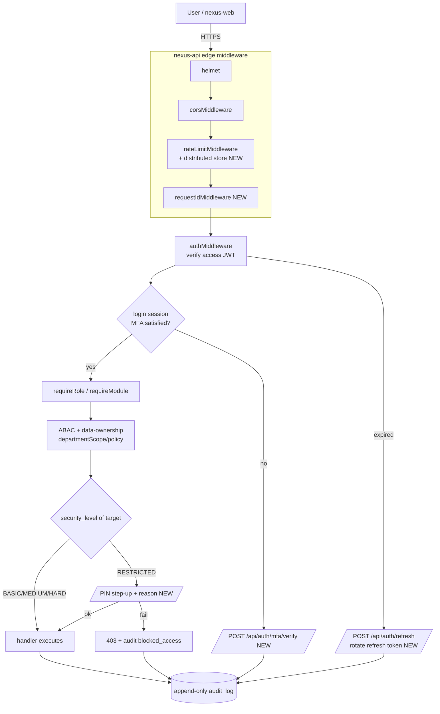
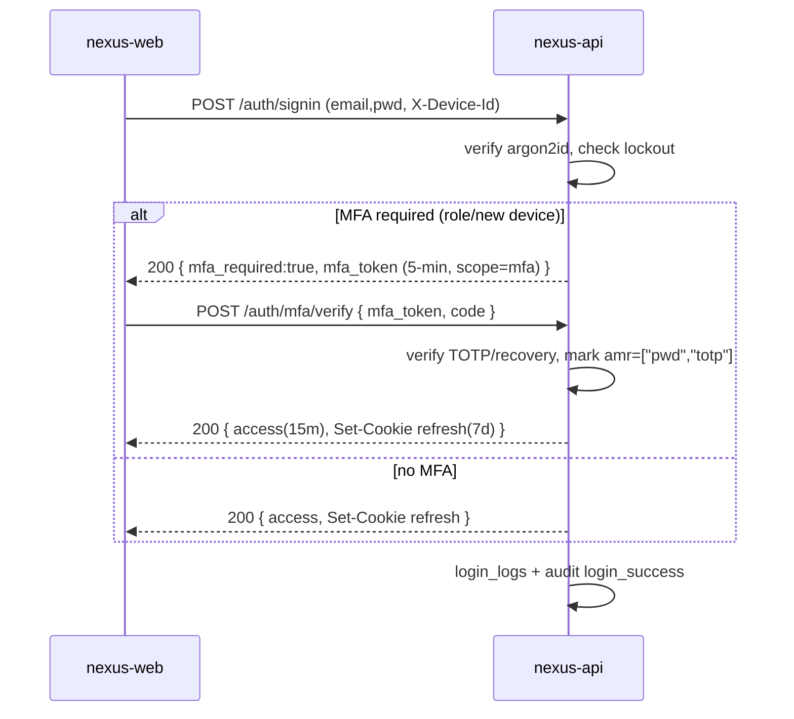

# 22 — Security Architecture (สถาปัตยกรรมความปลอดภัยระบบยืนยันตัวตน · เซสชัน · โทเคน · ไฟล์)

> **บริษัท:** Saduak Suay Mai PCL — เครือคลินิกเสริมความงาม + ทันตกรรม (แฟรนไชส์)
> **ระบบฐาน:** NEXUS OS (Next.js 16 `nexus-web` + Express/TS `nexus-api` + PostgreSQL บน Railway)
> **เอกสารชุด:** Enterprise Security Architecture / AuthN · Session · Token · File Security
> **สถานะ:** PRODUCTION-READY — deny-by-default, enforced in BACKEND, ไม่มี demo / ไม่มี MVP
> **เวอร์ชันเอกสาร:** 1.0 | **เจ้าของ:** Chief Security Architect
> **เอกสารที่เกี่ยวข้อง:** `10-security-matrix.md` (data classification), `11-permission-matrix.md` (RBAC/ABAC), `12-ai-access-matrix.md` (AI access), `09-data-ownership-matrix.md` (ownership)

---

## 0. ขอบเขตและหลักการ (Scope & Governing Principles)

เอกสารนี้กำหนดสถาปัตยกรรมของ **ชั้นยืนยันตัวตนและการเข้าถึง (Identity & Access layer)** ของ NEXUS OS ทั้งหมด ได้แก่ password policy, 2FA, PIN verification สำหรับชั้น `RESTRICTED`, session lifecycle, device/IP tracking, rate limiting, access + refresh token, API key control, file/download/export permission และ flow ยืนยันสองชั้น (extra-confirmation + reason + audit) สำหรับการเข้าถึงข้อมูล `RESTRICTED`

หลักการบังคับ (ผูกกับ GLOBAL DESIGN RULES และเอกสาร `10`/`11`):

1. **Deny-by-default** — ทุก endpoint และทุกการเข้าถึงไฟล์ ปฏิเสธก่อนเสมอ เว้นแต่มีกฎ allow ที่ชัดเจน
2. **Backend-enforced** — การตัดสินทุกอย่างเกิดที่ `nexus-api` เท่านั้น `nexus-web` ซ่อนปุ่ม/เมนูเป็นเพียง UX ไม่ใช่ security boundary
3. **Tamper-evident audit** — ทุก security event (login, logout, token refresh, MFA, PIN, file download/export, blocked access, permission change) ลง append-only audit ตาม `10-security-matrix.md`
4. **Defense-in-depth** — หลายชั้น: network (Railway/WAF) → transport (TLS) → edge (helmet/CORS/rate-limit) → authN (JWT + MFA) → authZ (RBAC+ABAC) → step-up (PIN/reason) → audit
5. **Least privilege & least exposure** — token อายุสั้น, scope แคบ, RESTRICTED ต้อง direct grant แม้แต่ CEO/admin (ตาม `10` §1)
6. **Fail closed** — เมื่อ subsystem ความปลอดภัยล้มเหลว (เช่นตรวจ MFA/PIN ไม่ได้) ให้ปฏิเสธการเข้าถึง ไม่ใช่อนุญาต

### 0.1 สัญลักษณ์สถานะ (Existing vs New)

ทุกองค์ประกอบในเอกสารนี้ติดป้ายชัดเจน:

- 🟢 **EXISTS** — มีอยู่ในโค้ดแล้ว (ระบุไฟล์)
- 🟡 **EXISTS-PARTIAL** — มีบางส่วน ต้องเสริม
- 🔴 **NEW** — ต้องสร้างใหม่ (migration / โค้ดใหม่)

---

## 1. สรุปสถานะปัจจุบัน (Current-State Baseline)

| Control | ไฟล์ปัจจุบัน | สถานะ | ช่องว่าง |
|---------|--------------|--------|----------|
| Bearer JWT auth | `backend/src/middleware/auth.ts` | 🟢 EXISTS | ไม่มี refresh/rotation/revocation, payload มีแค่ `id/company_id/impersonated_by` |
| Helmet headers | `backend/src/index.ts:49` `helmet({ crossOriginResourcePolicy: 'cross-origin' })` | 🟢 EXISTS | ยังไม่ได้ tune CSP/HSTS เต็มรูปแบบ |
| CORS allow-list | `backend/src/middleware/cors.ts` | 🟢 EXISTS | `credentials:true` แต่ใช้ Bearer ใน header (ไม่ใช่ cookie) → ดูเรื่อง CSRF |
| Rate limit | `backend/src/middleware/rate-limit.ts` | 🟡 EXISTS-PARTIAL | in-memory per-process → ไม่ cluster-safe |
| Field encryption | `backend/src/lib/encryption.ts` (AES-256-GCM) | 🟡 EXISTS-PARTIAL | key fallback อ่อน (`JWT_SECRET` → hardcoded) |
| Tier masking | `encryption.ts` `canViewTier/maskField` | 🟢 EXISTS | ครอบเฉพาะ salary |
| File storage | `backend/src/lib/file-storage.ts` | 🟡 EXISTS-PARTIAL | path-traversal guard มี แต่ไม่มี access log / signed URL |
| Audit write | `backend/src/lib/audit.ts` | 🟡 EXISTS-PARTIAL | fire-and-forget, ไม่มี before/after, ไม่มี ip/ua/request_id |
| Password policy | — | 🔴 NEW | ไม่มีนโยบายความซับซ้อน/หมุนเวียน/lockout |
| 2FA / MFA | — | 🔴 NEW | ไม่มี |
| PIN (RESTRICTED step-up) | — | 🔴 NEW | ไม่มี |
| Refresh token | — | 🔴 NEW | ไม่มี |
| Device / IP tracking | — | 🔴 NEW | ไม่มี |
| Session table / revocation | — | 🔴 NEW | ไม่มี |
| API key control | — | 🔴 NEW | ไม่มี |
| Login lockout / login_logs | — | 🔴 NEW | ไม่มี |
| CSRF protection | — | 🔴 NEW | ไม่มี (ปัจจุบันพึ่ง Bearer-in-header เป็นการบรรเทาโดยปริยาย) |

> **[ASSUMPTION]** องค์กรอยู่ภายใต้ **PDPA พ.ศ. 2562** ข้อมูลสุขภาพ (medical/dental/patient) เป็น sensitive personal data ตามมาตรา 26 → จัดเป็น `RESTRICTED` โดยปริยาย และทุกการเข้าถึงต้องมี audit + reason

---

## 2. สถาปัตยกรรมรวม (End-to-End Identity Flow)



ลำดับการบังคับใช้ใน Express (ทุก request ผ่านตามลำดับนี้):

1. `helmet()` 🟢 — security headers
2. `corsMiddleware` 🟢 — origin allow-list
3. `rateLimitMiddleware` 🟡→🔴 — เปลี่ยน store เป็น distributed (§9)
4. `requestIdMiddleware` 🔴 — gen `request_id` (UUID) + ดึง `ip`, `user_agent`, `device_id` ผูกกับ `req` เพื่อให้ทุก audit/log อ้างได้
5. `requestMetricsMiddleware` 🟢
6. `authMiddleware` 🟢→🟡 — verify **access token** (เสริมตรวจ session revocation + MFA flag, §3/§7)
7. `requireRole` / `requireModule` 🟢 — RBAC (`backend/src/middleware/rbac.ts`)
8. ABAC + data-ownership 🟡 — `departmentScope`, policy engine (เอกสาร `11`)
9. **RESTRICTED step-up** 🔴 — `requireRestrictedConfirmation` (§8)
10. handler + **audit write** 🟡→🔴

---

## 3. Token Architecture — Access + Refresh (🔴 NEW, ต่อยอด 🟢 JWT เดิม)

### 3.1 ของเดิม

`auth.ts` ออก JWT เดี่ยว (single token) ผ่าน `jwt.sign` ที่ controller signin/signup, ไม่มีอายุที่บังคับชัดเจนในชั้น verify, ไม่มี refresh/rotation/revocation, ไม่มี `jti`. payload มีแค่ `{ id, company_id, impersonated_by? }`.

### 3.2 รูปแบบใหม่ — Split token

| Token | อายุ **[ASSUMPTION]** | เก็บที่ฝั่ง client | บรรจุ | เพิกถอนได้? |
|-------|----------------------|--------------------|-------|-------------|
| **Access token** (JWT) | **15 นาที** | memory ของ SPA (ไม่ใช่ localStorage) | `sub(id), company_id, role, dept, jti, sid, mfa:bool, amr[], pin_ok_until?, ver` | ผ่าน `sid` ใน session store |
| **Refresh token** (opaque, 256-bit random) | **7 วัน** (sliding, absolute max 30 วัน) | `HttpOnly; Secure; SameSite=Strict` cookie | เก็บเฉพาะ **hash (SHA-256)** ใน DB | ใช่ — ลบแถวใน `auth_sessions` |

หลักการ:

- **Access token = stateless** ตรวจด้วยลายเซ็นเท่านั้น (เร็ว) แต่ `authMiddleware` จะเช็ค `sid` กับ session store ผ่าน cache สั้น ๆ (TTL 30s) เพื่อรองรับ revocation แบบเกือบเรียลไทม์
- **Refresh token = stateful, rotating** ทุกครั้งที่ refresh จะออก refresh token ใหม่และ invalidate ตัวเก่า (**refresh-token rotation**) ถ้ามีการใช้ refresh token ที่ถูกหมุนไปแล้วซ้ำ = **reuse detection** → เพิกถอนทั้ง session family + บังคับ re-login + audit `token_reuse_detected`
- ห้ามเก็บ access token ใน `localStorage` (กัน XSS exfiltration); refresh token เป็น HttpOnly cookie (JS อ่านไม่ได้)

### 3.3 ตาราง `auth_sessions` (🔴 NEW)

```sql
CREATE TABLE auth_sessions (
  id              TEXT PRIMARY KEY,            -- = sid
  company_id      TEXT NOT NULL REFERENCES companies(id),
  user_id         TEXT NOT NULL REFERENCES users(id),
  family_id       TEXT NOT NULL,               -- refresh-rotation family
  refresh_hash    TEXT NOT NULL,               -- SHA-256 ของ current refresh token
  prev_refresh_hash TEXT,                       -- สำหรับ reuse-detection
  mfa_satisfied   BOOLEAN NOT NULL DEFAULT FALSE,
  amr             TEXT,                          -- JSON: ["pwd","totp"]
  device_id       TEXT,                          -- จาก device fingerprint (§5)
  device_label    TEXT,                          -- "Chrome on macOS"
  ip_address      TEXT NOT NULL,
  ip_first_seen   TEXT NOT NULL,
  user_agent      TEXT,
  issued_at       TIMESTAMPTZ NOT NULL DEFAULT now(),
  last_seen_at    TIMESTAMPTZ NOT NULL DEFAULT now(),
  refresh_expires_at TIMESTAMPTZ NOT NULL,
  absolute_expires_at TIMESTAMPTZ NOT NULL,      -- ceiling 30 วัน
  revoked_at      TIMESTAMPTZ,
  revoked_reason  TEXT,                          -- 'logout'|'rotation_reuse'|'admin_kill'|'password_change'|'idle_timeout'
  security_level  TEXT NOT NULL DEFAULT 'HARD',
  created_at      TIMESTAMPTZ NOT NULL DEFAULT now(),
  CONSTRAINT chk_amr CHECK (amr IS NULL OR amr <> '')
);
CREATE INDEX idx_auth_sessions_user ON auth_sessions(company_id, user_id) WHERE revoked_at IS NULL;
CREATE UNIQUE INDEX idx_auth_sessions_refresh ON auth_sessions(refresh_hash);
CREATE INDEX idx_auth_sessions_family ON auth_sessions(family_id);
```

### 3.4 Endpoint ใหม่

| Endpoint | Method | หน้าที่ | สถานะ |
|----------|--------|---------|--------|
| `/api/auth/signin` | POST | ตรวจ password → ถ้าต้อง MFA ออก *MFA-pending* token; ไม่งั้นออก access+refresh | 🟡 (เสริม) |
| `/api/auth/mfa/verify` | POST | ตรวจ TOTP/recovery → set `mfa_satisfied`, ออก access+refresh เต็ม | 🔴 NEW |
| `/api/auth/refresh` | POST | ตรวจ refresh cookie → rotate → ออก access ใหม่ | 🔴 NEW |
| `/api/auth/logout` | POST | revoke session ปัจจุบัน + clear cookie | 🟡 (เสริม) |
| `/api/auth/sessions` | GET | ผู้ใช้ดู session/อุปกรณ์ของตน | 🔴 NEW |
| `/api/auth/sessions/:sid` | DELETE | ผู้ใช้/admin เพิกถอน session (remote logout) | 🔴 NEW |
| `/api/auth/pin/verify` | POST | step-up PIN สำหรับ RESTRICTED (§8) | 🔴 NEW |

### 3.5 ตัวอย่าง access-token payload (🔴 NEW)

```json
{
  "sub": "usr_8f3a...",
  "company_id": "cmp_saduak",
  "role": "medical",
  "dept": "medical",
  "sid": "ses_9c21...",
  "jti": "jwt_1f77...",
  "mfa": true,
  "amr": ["pwd", "totp"],
  "pin_ok_until": null,
  "ver": 7,
  "iat": 1750000000,
  "exp": 1750000900
}
```

> `ver` ผูกกับ `users.version` (จาก core-table contract) — เปลี่ยน role/permission/password ⇒ bump `version` ⇒ access token เก่าใช้ไม่ได้แม้ยังไม่หมดอายุ (`authMiddleware` เทียบ `ver`).

---

## 4. Password Policy (🔴 NEW)

### 4.1 การเก็บรหัสผ่าน

🟢 ระบบใช้ `password_hash` อยู่แล้ว (มีการ `delete u.password_hash` ใน `sanitizeUserForRole`). กำหนดมาตรฐาน:

- อัลกอริทึม: **argon2id** (พารามิเตอร์ **[ASSUMPTION]** `memory=19MiB, iterations=2, parallelism=1`, OWASP-aligned) — ถ้าใช้ bcrypt ต้อง cost ≥ 12. ห้าม MD5/SHA1/SHA256 เปล่า
- ห้ามเก็บรหัสผ่าน plaintext/แบบ reversible ในทุกตาราง/ทุก log/ทุก audit `before/after`

### 4.2 ข้อกำหนดความซับซ้อน (บังคับฝั่ง backend ตอน signup/change)

| กฎ | ค่า **[ASSUMPTION]** |
|----|----------------------|
| ความยาวขั้นต่ำ | 12 ตัวอักษร (พนักงานทั่วไป), 14 (manager/HR/finance/owner) |
| ความหลากหลาย | ≥ 3 จาก 4 กลุ่ม (ตัวเล็ก, ใหญ่, ตัวเลข, สัญลักษณ์) |
| Breach check | ตรวจกับ HIBP k-anonymity range API (ส่งเฉพาะ 5 ตัวแรกของ SHA-1) — ปฏิเสธรหัสที่รั่วแล้ว |
| ห้ามคล้ายข้อมูลตัวตน | ไม่ตรง/ไม่มี substring ของ email, ชื่อ, เบอร์โทร |
| ประวัติ | ห้ามซ้ำ 5 รหัสล่าสุด (`password_history`) |
| หมุนเวียน | ไม่บังคับเปลี่ยนตามรอบ (ตาม NIST 800-63B) **ยกเว้น** บังคับเปลี่ยนเมื่อสงสัยรั่ว/หลัง breach |
| Lockout | ดู §6 |

### 4.3 ตาราง `password_history` (🔴 NEW)

```sql
CREATE TABLE password_history (
  id            TEXT PRIMARY KEY,
  company_id    TEXT NOT NULL REFERENCES companies(id),
  user_id       TEXT NOT NULL REFERENCES users(id),
  password_hash TEXT NOT NULL,
  changed_at    TIMESTAMPTZ NOT NULL DEFAULT now(),
  changed_by    TEXT REFERENCES users(id),
  reason        TEXT  -- 'user_change'|'admin_reset'|'forced_breach'
);
CREATE INDEX idx_pwd_hist_user ON password_history(user_id, changed_at DESC);
```

เมื่อเปลี่ยนรหัสผ่าน: bump `users.version` → เพิกถอนทุก session (`revoked_reason='password_change'`) → audit `password_change` (ไม่บันทึก hash ใน audit before/after; เก็บแค่ flag `changed=true`).

---

## 5. Device & IP Tracking (🔴 NEW)

### 5.1 Device fingerprint

ตอน signin/MFA, `nexus-web` ส่ง header `X-Device-Id` (UUID ที่ persist ใน HttpOnly cookie แยก) + ข้อมูลประกอบ (UA, platform, screen เบื้องต้น) backend สร้าง **`device_id`** เสถียร (hash ของ device cookie + UA family) และผูกกับ `auth_sessions.device_id`.

- อุปกรณ์ใหม่ (device_id ไม่เคยเห็นสำหรับ user นี้) → **บังคับ MFA เสมอ** + ส่งแจ้งเตือน (email/LINE ผ่าน `email-notify.ts` / `line-notify.ts` 🟢) "มีการเข้าสู่ระบบจากอุปกรณ์ใหม่"
- ผู้ใช้ดู/ถอนอุปกรณ์ได้ที่ `GET/DELETE /api/auth/sessions`

### 5.2 IP tracking & geo-velocity

🟢 มี `req.ip`/`req.socket.remoteAddress` ใช้ใน rate-limit แล้ว และมี `backend/src/lib/geo.ts`.

- บันทึก `ip_address`, `ip_first_seen` ต่อ session; ทุก audit แนบ `ip_address` + `user_agent`
- **Impossible-travel detection**: ถ้า session refresh จาก geo ที่ระยะทาง/เวลา = ความเร็วเกินไปได้ (เช่น กรุงเทพ → ต่างประเทศ ใน 10 นาที) → ปฏิเสธ + บังคับ MFA ใหม่ + audit `suspicious_geo_velocity` **[ASSUMPTION]** threshold 800 km/h
- **IP allow-list (optional, per-company setting):** สำหรับ role อ่อนไหว (finance/hr/ceo) สามารถจำกัด CIDR ของสำนักงานใหญ่ใน `companies.settings.ip_allowlist` — นอกช่วงนี้บังคับ MFA + step-up

### 5.3 ตาราง `device_registry` (🔴 NEW)

```sql
CREATE TABLE device_registry (
  id            TEXT PRIMARY KEY,
  company_id    TEXT NOT NULL REFERENCES companies(id),
  user_id       TEXT NOT NULL REFERENCES users(id),
  device_id     TEXT NOT NULL,
  label         TEXT,
  trusted       BOOLEAN NOT NULL DEFAULT FALSE,
  first_seen_at TIMESTAMPTZ NOT NULL DEFAULT now(),
  last_seen_at  TIMESTAMPTZ NOT NULL DEFAULT now(),
  last_ip       TEXT,
  revoked_at    TIMESTAMPTZ,
  UNIQUE(company_id, user_id, device_id)
);
```

---

## 6. Login Lockout & login_logs (🔴 NEW)

### 6.1 นโยบาย lockout (anti-brute-force)

| มาตรการ | ค่า **[ASSUMPTION]** |
|---------|----------------------|
| Soft throttle ต่อบัญชี | หลัง 5 ครั้งผิด → exponential backoff (2,4,8,16…s) |
| Hard lock ต่อบัญชี | 10 ครั้งผิดใน 15 นาที → ล็อก 30 นาที + แจ้ง user + แจ้ง IT/HR |
| ต่อ IP | rate-limit เดิม signin 10/min 🟢 + เพิ่ม distributed counter |
| CAPTCHA | บังคับหลัง 3 ครั้งผิด (per IP/account) |
| Generic error | ตอบ "อีเมลหรือรหัสผ่านไม่ถูกต้อง" เสมอ (ไม่บอกว่า user มีอยู่จริงไหม — กัน user enumeration) |

ผลต่างจากของเดิม: rate-limit ปัจจุบันเป็น per-IP+path เท่านั้น (`rate-limit.ts`) ไม่มี per-account lockout → เพิ่ม counter ต่อ `user_id` ใน distributed store.

### 6.2 ตาราง `login_logs` (🔴 NEW)

```sql
CREATE TABLE login_logs (
  id             TEXT PRIMARY KEY,
  company_id     TEXT REFERENCES companies(id),
  user_id        TEXT REFERENCES users(id),     -- nullable: ล้มเหลวก่อนระบุ user
  email_attempted TEXT,
  event          TEXT NOT NULL,                  -- 'login_success'|'login_fail'|'mfa_fail'|'locked'|'logout'|'token_refresh'|'token_reuse'
  failure_reason TEXT,                           -- 'bad_password'|'no_user'|'locked'|'mfa_invalid'|'geo_block'
  ip_address     TEXT,
  user_agent     TEXT,
  device_id      TEXT,
  request_id     TEXT,
  session_id     TEXT,
  created_at     TIMESTAMPTZ NOT NULL DEFAULT now()
);
CREATE INDEX idx_login_logs_user ON login_logs(company_id, user_id, created_at DESC);
CREATE INDEX idx_login_logs_ip ON login_logs(ip_address, created_at DESC);
```

`login_logs` แยกจาก `audit_log` หลักเพื่อ query เร็วและ retention ต่างกัน แต่ event สำคัญ (locked/token_reuse) ก็เขียนคู่ลง `audit_log` แบบ append-only.

---

## 7. Two-Factor Authentication / MFA (🔴 NEW)

### 7.1 วิธีรองรับ

| Factor | การใช้งาน | บังคับใคร **[ASSUMPTION]** |
|--------|-----------|----------------------------|
| **TOTP** (RFC 6238, app เช่น Google Authenticator) | factor หลัก | บังคับทุก role ที่เข้าถึง `HARD`/`RESTRICTED`: ceo, admin, hr, finance, medical, dental, it, franchise managers |
| **Recovery codes** (10 ชุดใช้ครั้งเดียว) | สำรอง | ออกตอน enroll, เก็บ hash เท่านั้น |
| **LINE OTP / Email OTP** | fallback เมื่อไม่มี TOTP | staff ทั่วไป (optional MFA) — ใช้ `line-notify.ts`/`email-notify.ts` 🟢 |
| **WebAuthn/passkey** | future, phishing-resistant | **[ASSUMPTION]** roadmap phase 2 |

- พนักงานทั่วไป (`staff`) ที่เข้าถึงเฉพาะ `BASIC`/`MEDIUM`: MFA เป็น opt-in แต่ **บังคับ** เมื่อล็อกอินจากอุปกรณ์/IP ใหม่
- secret เก็บแบบ **encrypted** ผ่าน `encryptField` (AES-256-GCM) ใน `encryption.ts` 🟢

### 7.2 ตาราง `user_mfa` (🔴 NEW)

```sql
CREATE TABLE user_mfa (
  id            TEXT PRIMARY KEY,
  company_id    TEXT NOT NULL REFERENCES companies(id),
  user_id       TEXT NOT NULL REFERENCES users(id),
  method        TEXT NOT NULL,                   -- 'totp'|'recovery'|'line_otp'|'email_otp'
  secret_enc    TEXT,                            -- encryptField() สำหรับ totp
  recovery_hashes TEXT,                          -- JSON array ของ hash
  enabled       BOOLEAN NOT NULL DEFAULT FALSE,
  enrolled_at   TIMESTAMPTZ,
  last_used_at  TIMESTAMPTZ,
  is_active     BOOLEAN NOT NULL DEFAULT TRUE,
  UNIQUE(company_id, user_id, method)
);
```

### 7.3 Flow (สองขั้น)



`authMiddleware` 🟡 เสริม: ถ้า endpoint แตะข้อมูล `HARD`/`RESTRICTED` แต่ access token มี `mfa:false` → 401 `mfa_required` (fail closed).

---

## 8. PIN Verification & RESTRICTED Step-Up Flow (🔴 NEW — หัวใจของชั้น RESTRICTED)

ตาม `10-security-matrix.md`: `RESTRICTED` = medical/dental/patient, salary/payroll/contract/tax, HR investigation, AI evaluation, executive notes — เข้าได้เฉพาะ **direct grant** และทุกการเข้าถึงต้องมี **extra-confirmation + reason + audit**

### 8.1 องค์ประกอบ step-up

การเข้าถึงข้อมูล `RESTRICTED` ต้องผ่าน **ทั้งหมด** (AND):

1. **RBAC+ABAC ผ่าน** + มี **direct grant** ใน resource ACL (เอกสาร `11`/`09`)
2. **MFA satisfied** ใน session (จาก §7)
3. **PIN step-up** — ผู้ใช้ใส่ **PIN 6 หลัก** (แยกจากรหัสผ่าน) เพื่อยืนยันตัวตน ณ ขณะนั้น → ได้ `pin_ok_until` (อายุสั้น **[ASSUMPTION]** 5 นาที) ใน claim/session
4. **Reason (เหตุผลบังคับ)** — ต้องกรอกเหตุผลข้อความเสรี (min 10 ตัวอักษร) ทุกครั้งที่เปิด/ดาวน์โหลด/export ข้อมูล RESTRICTED — เก็บใน audit
5. **Append-only audit** — บันทึกทั้งสำเร็จและถูกบล็อก พร้อม `reason`, `target security_level=RESTRICTED`

### 8.2 PIN policy

| กฎ | ค่า **[ASSUMPTION]** |
|----|----------------------|
| ความยาว | 6 หลัก (ตัวเลข) |
| เก็บ | argon2id hash (เหมือนรหัสผ่าน) ใน `user_pin` |
| ห้าม | เลขเรียง/ซ้ำ (123456, 000000), ห้ามตรงเบอร์โทร/วันเกิด |
| ผิดได้ | 5 ครั้ง → ล็อก PIN 15 นาที + audit + แจ้ง HR/IT |
| อายุการยืนยัน | `pin_ok_until` = now + 5 นาที (ต้องใส่ PIN ใหม่หลังหมด) |
| RESTRICTED ที่ "ร้ายแรงมาก" (เช่น HR investigation, export patient) | บังคับใส่ PIN **ทุกครั้ง** ไม่ใช้ cache 5 นาที |

### 8.3 ตาราง `user_pin` + `restricted_access_requests` (🔴 NEW)

```sql
CREATE TABLE user_pin (
  user_id      TEXT PRIMARY KEY REFERENCES users(id),
  company_id   TEXT NOT NULL REFERENCES companies(id),
  pin_hash     TEXT NOT NULL,
  failed_count INT NOT NULL DEFAULT 0,
  locked_until TIMESTAMPTZ,
  set_at       TIMESTAMPTZ NOT NULL DEFAULT now(),
  updated_at   TIMESTAMPTZ NOT NULL DEFAULT now()
);

-- บันทึกการ "ขอเข้าถึง" RESTRICTED ทุกครั้ง (เหตุผล + ผลลัพธ์) -- append-only
CREATE TABLE restricted_access_requests (
  id              TEXT PRIMARY KEY,
  company_id      TEXT NOT NULL REFERENCES companies(id),
  user_id         TEXT NOT NULL REFERENCES users(id),
  target_table    TEXT NOT NULL,
  target_id       TEXT NOT NULL,
  action          TEXT NOT NULL,                 -- 'view'|'download'|'export'|'ai_query'
  reason          TEXT NOT NULL CHECK (length(reason) >= 10),
  pin_verified    BOOLEAN NOT NULL,
  mfa_verified    BOOLEAN NOT NULL,
  grant_id        TEXT,                          -- direct grant ที่อ้างอิง
  result          TEXT NOT NULL,                 -- 'allowed'|'denied'
  failure_reason  TEXT,
  ip_address      TEXT,
  user_agent      TEXT,
  request_id      TEXT,
  session_id      TEXT,
  created_at      TIMESTAMPTZ NOT NULL DEFAULT now()
);
CREATE INDEX idx_rar_user ON restricted_access_requests(company_id, user_id, created_at DESC);
CREATE INDEX idx_rar_target ON restricted_access_requests(target_table, target_id);
```

### 8.4 Middleware `requireRestrictedConfirmation` (🔴 NEW)

```ts
// ทำงานหลัง requireRole/ABAC, ก่อน handler ของทุก route ที่แตะ RESTRICTED
export async function requireRestrictedConfirmation(req, res, next) {
  const { targetTable, targetId, action } = resolveTarget(req)          // จาก route metadata
  const level = await resolveSecurityLevel(targetTable, targetId)        // จาก data classification (เอกสาร 10)
  if (level !== 'RESTRICTED') return next()

  // 1) direct grant?
  if (!(await hasDirectGrant(req.user, targetTable, targetId))) {
    await auditBlocked(req, targetTable, targetId, 'no_direct_grant')
    return res.status(403).json({ error: 'RESTRICTED — ต้องได้รับสิทธิ์โดยตรง' })
  }
  // 2) MFA satisfied?
  if (!req.jwtPayload?.mfa) return res.status(401).json({ error: 'mfa_required' })
  // 3) PIN step-up valid?
  const pinOk = req.jwtPayload?.pin_ok_until && Date.now() < req.jwtPayload.pin_ok_until
  const alwaysPin = ALWAYS_PIN_TARGETS.has(targetTable)                  // patient export, hr investigation
  if (!pinOk || alwaysPin) {
    return res.status(428).json({ error: 'pin_required', requireReason: true }) // 428 Precondition Required
  }
  // 4) reason บังคับ
  const reason = req.body?.access_reason || req.headers['x-access-reason']
  if (!reason || String(reason).trim().length < 10) {
    return res.status(422).json({ error: 'reason_required' })
  }
  // 5) บันทึก request (append-only) + ผูก request_id
  await recordRestrictedAccess(req, { targetTable, targetId, action, reason, result: 'allowed' })
  next()
}
```

### 8.5 ตัวอย่าง round-trip (เปิดเวชระเบียนผู้ป่วย)

```text
1. GET /api/patients/:id          → 428 { pin_required, requireReason:true }
2. POST /api/auth/pin/verify {pin} → 200 { pin_ok_until: <now+5m> } (access token ออกใหม่)
3. GET /api/patients/:id
     headers: X-Access-Reason: "ตรวจติดตามอาการก่อนนัดหมอ 2026-06-26"
   → 200 (ข้อมูลถูก redact ตาม field policy) + restricted_access_requests(allowed) + audit
```

---

## 9. Rate Limiting (🟡 EXISTS-PARTIAL → 🔴 เสริม distributed)

### 9.1 ของเดิม

`rate-limit.ts` 🟢: per-IP+path bucket ใน `Map` หน่วยความจำ; signin 10/min, signup 5/min, chat 30/min, default 120/min; ส่ง `X-RateLimit-*` header. ปัญหา: **per-process** — บน Railway ถ้า scale หลาย instance หรือ restart bucket หาย → กันไม่ได้จริง.

### 9.2 เสริม (NEW)

- **Distributed store**: ใช้ Redis (Railway add-on) หรือ Postgres-backed sliding-window ถ้าไม่อยากเพิ่ม service — key = `rl:{scope}:{ip|user}:{bucket}`. ออกแบบ interface ให้ fallback กลับ in-memory เมื่อ store ล่ม (degrade ไม่ down)
- **เพิ่มมิติ per-account + per-session** นอกเหนือ per-IP (กัน brute-force ที่หมุน IP)
- **เพิ่ม bucket เฉพาะทาง**: `/api/auth/mfa/verify` 10/5min, `/api/auth/pin/verify` 10/5min, `/api/auth/refresh` 60/min, export/download endpoints 20/min/user
- **429 พร้อม `Retry-After`** + audit เมื่อโดน sustained throttle (อาจเป็นการโจมตี)

```
| scope                  | window | max | สถานะ |
| /api/auth/signin       | 60s    | 10  | 🟢→🔴 distributed + per-account |
| /api/auth/mfa/verify   | 300s   | 10  | 🔴 NEW |
| /api/auth/pin/verify   | 300s   | 10  | 🔴 NEW |
| /api/auth/refresh      | 60s    | 60  | 🔴 NEW |
| /api/*/export,/download| 60s    | 20/user | 🔴 NEW |
| /api/chat (AI)         | 60s    | 30  | 🟢 |
| default                | 60s    | 120 | 🟢 |
```

---

## 10. File / Download / Export Permissions (🟡 → 🔴)

### 10.1 ของเดิม

`file-storage.ts` 🟢: เก็บไฟล์บนดิสก์ `data/storage/{companyId}/{userId}/{fileId}.ext`, มี **path-traversal guard** (`abs.startsWith(STORAGE_ROOT)`), `safeName()` sanitize ชื่อ. ตาราง `user_files` (มี `security_tier`, `storage_path` จาก migration). **ช่องว่าง:** ไม่มี access log, ไม่มี signed URL, ไม่มี per-file ACL, ไม่ตรวจ MIME/size อย่างเข้มงวด, ไม่มี virus scan, download เสิร์ฟด้วย tier label เฉย ๆ.

### 10.2 นโยบายไฟล์ใหม่

**Upload (NEW guards):**
- จำกัด MIME allow-list ต่อบริบท (เอกสาร: pdf/png/jpg/xlsx/docx; เวชระเบียน: pdf/dicom), ตรวจ **magic bytes** ไม่ใช่แค่ extension
- จำกัดขนาด (เดิม body 50MB 🟢) → กำหนดต่อประเภท **[ASSUMPTION]** รูป 10MB, เอกสาร 25MB
- **AV scan** (ClamAV หรือ provider) ก่อน mark `is_active=true`; ระหว่างสแกน = quarantine
- กำหนด `security_level` ของไฟล์จาก context (เวชระเบียน/สัญญา/payroll = `RESTRICTED`)
- **at-rest encryption**: ไฟล์ RESTRICTED เข้ารหัสก่อนเขียนดิสก์ (envelope: key per company) — ต่อยอด `encryption.ts` 🟢

**Download / View (NEW):**
- ออกผ่าน **signed, short-lived URL** หรือ stream ผ่าน `nexus-api` เท่านั้น (ห้ามเสิร์ฟ static path ตรง) — ทุก request ผ่าน authN+authZ
- เช็ค **ownership + security_level**: BASIC/MEDIUM/HARD ตาม `10`; RESTRICTED → ผ่าน `requireRestrictedConfirmation` (§8: PIN+reason)
- ทุก download → `file_access_logs` (NEW) + `audit_log` action `download`

**Export (NEW — ระดับเข้มสุด):**
- Export ใด ๆ ที่มีข้อมูล `HARD`/`RESTRICTED` (payroll, patient list, salary, contracts) ต้อง: MFA + PIN + reason + (สำหรับ bulk) **approval ของ manager/HR** (maker-checker)
- ฝัง **watermark** (ผู้ export + เวลา + request_id) ในไฟล์ export ที่อ่านได้ (PDF/Excel) เพื่อตามรอยการรั่ว
- จำกัดจำนวนแถว/ความถี่ export ต่อ user (anti-exfiltration), แจ้งเตือน security เมื่อ export ผิดปกติ (เช่น dump ทั้งฐานผู้ป่วย)
- redact field ที่เกิน clearance ก่อนเขียนไฟล์ (เช่น mask salary ผ่าน `maskField` 🟢)

### 10.3 ตาราง `file_access_logs` (🔴 NEW)

```sql
CREATE TABLE file_access_logs (
  id            TEXT PRIMARY KEY,
  company_id    TEXT NOT NULL REFERENCES companies(id),
  user_id       TEXT NOT NULL REFERENCES users(id),
  file_id       TEXT NOT NULL REFERENCES user_files(id),
  action        TEXT NOT NULL,                   -- 'view'|'download'|'export'|'print'|'share'|'delete'
  security_level TEXT NOT NULL,
  reason        TEXT,                            -- บังคับเมื่อ RESTRICTED
  bytes_served  BIGINT,
  result        TEXT NOT NULL,                   -- 'allowed'|'denied'
  failure_reason TEXT,
  ip_address    TEXT,
  user_agent    TEXT,
  request_id    TEXT,
  session_id    TEXT,
  created_at    TIMESTAMPTZ NOT NULL DEFAULT now()
);
CREATE INDEX idx_file_access_file ON file_access_logs(file_id, created_at DESC);
CREATE INDEX idx_file_access_user ON file_access_logs(company_id, user_id, created_at DESC);
```

---

## 11. API Key Control (🔴 NEW)

ครอบ **(ก)** service-to-service / integration keys (LINE, AI providers, แฟรนไชส์/POS external) และ **(ข)** programmatic access ของระบบภายนอกที่เรียก `nexus-api`.

### 11.1 หลักการ

- **AI provider keys** (`OPENAI_API_KEY`, `ANTHROPIC_API_KEY`, `GEMINI_API_KEY`, `TYPHOON_API_KEY`) 🟢 และ LINE keys อยู่ใน Railway env — กำหนดให้ย้ายเข้า **secrets manager** (ดู §13) ห้าม log, ห้ามส่งใน audit before/after
- **Outbound NEXUS API keys** สำหรับให้ระบบภายนอกเรียกเข้า: ออกเป็น `nxk_<id>.<secret>`, เก็บเฉพาะ **hash** ของ secret, มี scope/role จำกัด, อายุหมดอายุได้, เพิกถอนได้
- API key = principal ระดับ machine: ผูก `company_id` + scope แคบ, **ห้ามให้ scope แตะ RESTRICTED** (machine ไม่มี MFA/PIN ได้) เว้นแต่ grant พิเศษ + IP allow-list

### 11.2 ตาราง `api_keys` (🔴 NEW)

```sql
CREATE TABLE api_keys (
  id            TEXT PRIMARY KEY,                -- prefix ที่โชว์ได้ (nxk_xxx)
  company_id    TEXT NOT NULL REFERENCES companies(id),
  name          TEXT NOT NULL,
  key_hash      TEXT NOT NULL,                   -- SHA-256 ของ secret part
  scopes        TEXT NOT NULL,                   -- JSON ['read:patients_basic','write:deals']
  allowed_ips   TEXT,                            -- JSON CIDR allow-list
  created_by    TEXT NOT NULL REFERENCES users(id),
  last_used_at  TIMESTAMPTZ,
  expires_at    TIMESTAMPTZ,
  revoked_at    TIMESTAMPTZ,
  is_active     BOOLEAN NOT NULL DEFAULT TRUE,
  security_level TEXT NOT NULL DEFAULT 'MEDIUM',
  created_at    TIMESTAMPTZ NOT NULL DEFAULT now()
);
CREATE UNIQUE INDEX idx_api_keys_hash ON api_keys(key_hash);
```

ออก/หมุน/เพิกถอน key = audit `api_key_create/rotate/revoke` (append-only). ทุกการเรียกด้วย key ลง `request_metrics` 🟢 + audit เมื่อแตะ HARD.

---

## 12. Session Expiry & Lifecycle (🔴 NEW, ต่อยอด JWT 🟢)

| พารามิเตอร์ | ค่า **[ASSUMPTION]** | บังคับโดย |
|-------------|----------------------|-----------|
| Access token TTL | 15 นาที | `exp` ใน JWT |
| Refresh sliding TTL | 7 วัน (ต่ออายุเมื่อใช้งาน) | `auth_sessions.refresh_expires_at` |
| Absolute session ceiling | 30 วัน | `absolute_expires_at` |
| Idle timeout | 30 นาทีไม่มี request → ต้อง refresh | เทียบ `last_seen_at` |
| Idle timeout (role อ่อนไหว: finance/hr/ceo) | 15 นาที | นโยบายต่อ role |
| RESTRICTED PIN window | 5 นาที | `pin_ok_until` |
| Logout | revoke session ทันที + clear cookie | `revoked_at` |
| Force logout ทุก session | bump `users.version` | access token ทุกใบใช้ไม่ได้ |
| Admin remote kill | `DELETE /api/auth/sessions/:sid` | `revoked_reason='admin_kill'` |

เหตุการณ์ที่ **เพิกถอนทุก session** ของผู้ใช้: เปลี่ยนรหัสผ่าน, เปลี่ยน role/permission, ปิดบัญชี (`is_active=false`), ตรวจพบ token reuse, HR ระงับพนักงาน.

**Impersonation** 🟢: ของเดิมรองรับ `impersonated_by` ใน payload — คงไว้แต่บังคับ: เฉพาะ admin, ต้อง MFA, มีอายุสั้นพิเศษ (15 นาที, no refresh), และ **ทุก action ภายใต้ impersonation audit ทั้ง actor จริง + เป้าหมาย** (action `impersonation_start/stop`).

---

## 13. Edge & Transport Hardening (🟢 + เสริม)

- 🟢 **helmet** เปิดอยู่ (`index.ts:49`) — เสริม: ตั้ง **HSTS** (`max-age=31536000; includeSubDomains; preload`), **CSP** เข้มสำหรับ `nexus-web` (default-src 'self', เฉพาะ origin API), `Referrer-Policy: strict-origin-when-cross-origin`, `X-Content-Type-Options: nosniff`, ปิด `X-Powered-By`
- 🟢 **CORS** allow-list จาก `FRONTEND_URL` — คงไว้, ตรวจให้ production ไม่มี `localhost`
- 🔴 **CSRF**: ปัจจุบันใช้ Bearer-in-Authorization (ไม่ใช่ cookie auth) → CSRF เสี่ยงต่ำสำหรับ API call. แต่เมื่อย้าย **refresh token เป็น cookie** ต้องเพิ่ม CSRF กันสำหรับ `/auth/refresh`: ใช้ `SameSite=Strict` + **double-submit token** / custom header `X-CSRF-Token`
- 🟢 **TLS**: Railway ให้ HTTPS edge. **แก้ความเสี่ยง**: PG pool ตั้ง `rejectUnauthorized:false` 🟢 → เปลี่ยนเป็น verify CA ของ Railway PG (กัน MITM ภายใน)
- 🔴 **Secrets manager**: ย้าย `JWT_SECRET`, `ENCRYPTION_KEY`, provider keys ออกจาก plain env → ใช้ Railway secrets/ external vault; **ลบ fallback chain ที่อ่อน** ใน `encryption.ts` (`ENCRYPTION_KEY || JWT_SECRET || 'dev'`) และ `auth.ts` (dev secret) — บังคับ throw ใน production ถ้าไม่มี (auth ทำแล้วบางส่วน 🟢) และเพิ่ม **key rotation** (key id ใน ciphertext)
- 🔴 **Request correlation**: `request_id` ทุก request (§2) ส่งกลับใน `X-Request-Id` และผูกทุก log/audit

---

## 14. Audit Hook ของชั้น Security (ผูกกับ `10-security-matrix.md`)

ทุก security event ในเอกสารนี้เขียน audit แบบ **append-only** ตาม schema กลาง (มี actor, role, target table/id, target security_level, before/after JSON, changed fields, ip, device, user_agent, request_id, session_id, endpoint, http_method, result, failure_reason, created_at).

Event ที่บังคับลง audit:

`login_success`, `login_fail`, `logout`, `mfa_enroll`, `mfa_verify`, `mfa_fail`, `pin_set`, `pin_verify`, `pin_fail`, `token_refresh`, `token_reuse_detected`, `session_revoked`, `password_change`, `password_reset`, `account_locked`, `new_device_login`, `suspicious_geo_velocity`, `impersonation_start/stop`, `restricted_access` (allowed/denied), `file_download`, `file_export`, `api_key_create/rotate/revoke`, `permission_change`, `role_change`, `blocked_access`.

ของเดิม `audit.ts` 🟡 เป็น fire-and-forget try/catch ว่าง — สำหรับ event **security-critical** (login/MFA/PIN/restricted/export) เปลี่ยนเป็น **synchronous + must-succeed**: ถ้าเขียน audit ไม่ได้ ⇒ **ปฏิเสธ action** (fail closed) ไม่ใช่ปล่อยผ่านเงียบ ๆ.

---

## 15. Threat Model Summary (สรุปภัยคุกคาม + การป้องกัน)

ใช้กรอบ **STRIDE**; "Residual" = ความเสี่ยงคงเหลือหลังมาตรการ

| # | ภัย (STRIDE) | สถานการณ์ | มาตรการในเอกสารนี้ | Residual |
|---|--------------|-----------|---------------------|----------|
| T1 | **S**poofing | ขโมยรหัสผ่าน/เดารหัส | argon2id + complexity + breach check (§4), lockout (§6), MFA (§7) | ต่ำ |
| T2 | **S**poofing | ขโมย access token (XSS) | token in-memory (ไม่ localStorage), TTL 15m, refresh HttpOnly, `ver` bump (§3/§12), CSP (§13) | ต่ำ-กลาง |
| T3 | **S**poofing | refresh token ถูกขโมย | rotation + reuse-detection → kill family (§3) | ต่ำ |
| T4 | **T**ampering | แก้ JWT payload (สิทธิ์) | ลายเซ็น HS256/RS256, ตรวจ `ver`/`sid` (§3) | ต่ำ |
| T5 | **T**ampering | แก้/ลบ audit | append-only + must-succeed สำหรับ security event (§14), เอกสาร `10` hash-chain | ต่ำ |
| T6 | **R**epudiation | ปฏิเสธว่าไม่ได้เปิดเวชระเบียน | restricted_access_requests + reason + PIN + audit (§8) | ต่ำมาก |
| T7 | **I**nfo disclosure | export/ดาวน์โหลดข้อมูลผู้ป่วย/เงินเดือนรั่ว | RESTRICTED step-up, redaction, watermark, export approval, file_access_logs (§8/§10) | กลาง (insider) |
| T8 | **I**nfo disclosure | AI เปิดข้อมูลที่ผู้ใช้ไม่มีสิทธิ์ | AI access control + redaction (เอกสาร `12`); ชั้นนี้ให้ MFA/PIN context | กลาง |
| T9 | **I**nfo disclosure | cross-tenant leak (ลืม `company_id`) | tenant guard, RLS (เอกสาร `11`); ชั้นนี้: `company_id` ใน token + session | กลาง |
| T10 | **I**nfo disclosure | secrets ใน env/log รั่ว | secrets manager, ห้าม log keys, ลบ fallback อ่อน (§13) | กลาง |
| T11 | **D**oS | brute-force / credential-stuffing | distributed rate-limit + per-account lockout + CAPTCHA (§6/§9) | ต่ำ |
| T12 | **D**oS | flood export/AI | per-user export quota, chat 30/min (§9/§10) | ต่ำ |
| T13 | **E**levation | staff เข้าถึง RESTRICTED | deny-by-default, direct-grant only, PIN+reason (§8) | ต่ำ |
| T14 | **E**levation | admin/CEO เห็น RESTRICTED โดยปริยาย | แม้ admin ต้อง direct grant (เอกสาร `10` §1), step-up (§8) | ต่ำ |
| T15 | **E**levation | impersonation ใช้ในทางมิชอบ | admin+MFA only, short TTL, double audit (§12) | ต่ำ |
| T16 | **S**poofing | login จากอุปกรณ์/พื้นที่ใหม่ | new-device MFA + alert, impossible-travel (§5) | ต่ำ |
| T17 | **T**ampering | path traversal / malicious upload | path guard 🟢 + magic-byte + AV scan + signed URL (§10) | ต่ำ |
| T18 | **S**poofing | API key ถูกขโมย | hash-only เก็บ, scope แคบ, IP allow-list, no RESTRICTED scope, rotate/revoke (§11) | ต่ำ-กลาง |
| T19 | **R**epudiation | ปฏิเสธว่าไม่ได้ login | login_logs + audit + device/ip (§5/§6) | ต่ำ |
| T20 | **D**oS | ฐานข้อมูล MITM (PG SSL หลวม) | verify CA แทน `rejectUnauthorized:false` (§13) | กลาง→ต่ำ |

**ความเสี่ยงสำคัญที่ต้องจับตา (insider & AI):** T7/T8 — การรั่วโดยคนในที่มีสิทธิ์ และ AI เปิดข้อมูลเกินสิทธิ์ — บรรเทาด้วย step-up + reason + watermark + export quota + AI redaction (เอกสาร `12`) แต่ยังต้องมี **detective control** (alert บน export/AI ผิดปกติ) เป็นแนวรับสุดท้าย

---

## 16. Migration Plan (ลำดับการสร้าง — ผูก `migrations.ts` v11+)

ทุกตารางใหม่เพิ่มผ่าน versioned migration (`backend/src/lib/migrations.ts`, tracked ใน `schema_migrations` 🟢):

| เฟส | งาน | ตาราง/โค้ดใหม่ | ความเสี่ยง deploy |
|-----|-----|----------------|-------------------|
| **P1** | Token split + sessions | `auth_sessions`, refresh endpoints, `requestIdMiddleware` | กลาง (เปลี่ยน auth flow — ต้องรองรับ token เก่าช่วง transition) |
| **P2** | Password policy + login_logs + lockout | `password_history`, `login_logs`, distributed rate-limit | ต่ำ |
| **P3** | MFA | `user_mfa`, mfa endpoints, enrollment UX | กลาง |
| **P4** | RESTRICTED step-up | `user_pin`, `restricted_access_requests`, `requireRestrictedConfirmation` | กลาง (กระทบ route ที่แตะ RESTRICTED) |
| **P5** | Device/IP + geo-velocity | `device_registry`, geo hooks | ต่ำ |
| **P6** | File/export hardening | `file_access_logs`, signed URL, AV, watermark | กลาง |
| **P7** | API keys | `api_keys` | ต่ำ |
| **P8** | Edge/secrets hardening | HSTS/CSP, secrets manager, PG CA verify, key rotation | กลาง (env-ops) |

> Deploy ทุกเฟสด้วย `railway up` ต่อ service (ตาม MEMORY: ไม่ใช่ GitHub auto-deploy). `nexus-api` boot รัน `initSchema()` → `runMigrations()` 🟢 ดังนั้น migration ใหม่จะ apply อัตโนมัติตอน start. ตรวจ regression บน **production build** (ตาม MEMORY: `next dev` ปิดบังบั๊ก render-loop) ก่อน promote.

---

## 17. ภาคผนวก — Checklist บังคับใช้ (Definition of Done ด้านความปลอดภัย)

- [ ] ทุก endpoint ผ่าน authN → RBAC → ABAC → (ถ้า RESTRICTED) step-up → audit
- [ ] Access token ≤ 15m, refresh rotating + reuse-detection, revoke ได้จริง
- [ ] MFA บังคับสำหรับ role ที่แตะ HARD/RESTRICTED และอุปกรณ์/IP ใหม่
- [ ] RESTRICTED ทุกครั้ง = direct grant + MFA + PIN + reason(≥10) + append-only audit
- [ ] Password: argon2id, ≥12, breach-check, history 5, generic error, lockout
- [ ] Rate-limit distributed + per-account; login/MFA/PIN/refresh/export มี bucket เฉพาะ
- [ ] File download/export ผ่าน signed URL + ACL + file_access_logs; export RESTRICTED มี watermark + approval
- [ ] API key: hash-only, scope แคบ, IP allow-list, ไม่มี RESTRICTED scope, rotate/revoke + audit
- [ ] Secrets ไม่อยู่ใน plaintext fallback; PG TLS verify CA; HSTS/CSP เปิด
- [ ] Audit security-critical = synchronous must-succeed (fail closed)
- [ ] ทุก log มี request_id/session_id/ip/user_agent/device_id ครบ

---

*จบเอกสาร 22 — Security Architecture. อ้างอิงคู่กับ `10-security-matrix.md`, `11-permission-matrix.md`, `12-ai-access-matrix.md`.*
