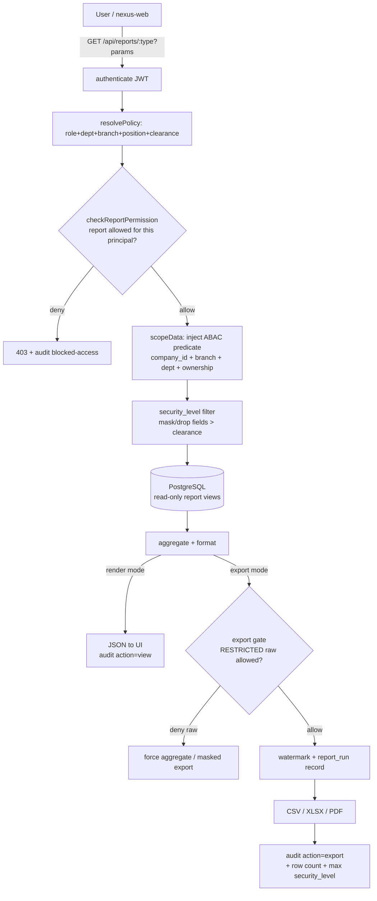

# 23 — Report Design (สถาปัตยกรรมการออกแบบรายงานองค์กร)

> **บริษัท:** Saduak Suay Mai PCL — เครือคลินิกเสริมความงาม + ทันตกรรม (แฟรนไชส์ในประเทศไทย)
> **ระบบฐาน:** NEXUS OS (Next.js 16 `nexus-web` + Express/TS `nexus-api` + PostgreSQL บน Railway — deploy ด้วย `railway up` ราย service ไม่ใช่ GitHub auto-deploy)
> **เอกสารชุด:** Enterprise Reporting & Analytics Architecture
> **สถานะ:** PRODUCTION-READY — deny-by-default, **permission ถูกตรวจ "ก่อน render ทุกรายงาน"** ที่ Backend, export ทุกครั้งถูก audit, RESTRICTED ห้าม export เป็น raw โดยปริยาย
> **เวอร์ชันเอกสาร:** 1.0 | **เจ้าของ:** Chief Data Architect + Chief Security Architect
> **ภาษา:** ไทย narrative + English technical identifiers ตามสไตล์องค์กร

---

## 0. หลักการกำกับ (Governing Principles)

เอกสารนี้คือ **single source of truth ของระบบรายงาน (Reporting Layer)** ทั้งหมดของ NEXUS OS รายงานทั้ง 10 ประเภทในเอกสารนี้ **ต้อง** ปฏิบัติตามกฎเหล็กต่อไปนี้โดยไม่มีข้อยกเว้น:

1. **Permission-before-render (กฎเหล็กข้อ 1)** — ทุก report endpoint ต้องผ่าน pipeline `authenticate → resolvePolicy → checkReportPermission → scopeData → render` *ก่อน* แตะ query ใด ๆ ถ้าไม่ผ่าน = `403` + ลง `audit_log` (`action='blocked-access'`) ไม่มีการ "render ก่อนแล้วค่อยกรอง" และไม่เชื่อ frontend gating (`MODULE_ACCESS` ใน `nexus-web`) เป็น security boundary — มันเป็นแค่ UX hint และจะถูกตรวจซ้ำที่ API เสมอ
2. **Scope-by-policy** — ข้อมูลในรายงานถูกกรองด้วย **RBAC + ABAC + Data-Ownership** (company → branch → department → sub-department → ownership) ผ่าน policy engine เดียวกับเอกสาร `11-permission-matrix.md` ไม่ใช่ `WHERE` ที่เขียนมือต่อ endpoint
3. **4 Security Levels** — `BASIC` < `MEDIUM` < `HARD` < `RESTRICTED` (strict total order) ทุก field ในทุกรายงานมี `security_level` กำกับ; field ที่เกิน clearance ของผู้รัน = **mask หรือ drop ตั้งแต่ชั้น query** ไม่ส่งออกมาที่ frontend
4. **Export = sensitive action** — การ export ทุกครั้ง (CSV/XLSX/PDF) เป็น action ที่ต้อง audit เต็มรูปแบบ (`action='export'` + before/after = filter criteria + จำนวน row + security_level สูงสุดในชุด) RESTRICTED **ห้าม export เป็น raw** โดยปริยาย (ดูข้อ 4 ของเอกสาร)
5. **Reproducibility & Watermark** — ทุกรายงานที่ export ฝัง watermark (ผู้รัน + timestamp + `request_id`) และเก็บ `report_run` record เพื่อ reproduce ได้และโยงกับ audit
6. **AI-generated narrative ≠ data bypass** — รายงานที่มี AI summary (เช่น CEO brief, Performance) ต้องส่งให้ AI เฉพาะข้อมูลที่ผู้รัน *เห็นได้อยู่แล้ว* เท่านั้น ผ่าน AI access pipeline (`12-ai-access-matrix.md`) — AI ไม่อ่าน DB ตรง

> **[ASSUMPTION]** ชื่อบุคคล, headcount, salary band, รายชื่อสาขา, KPI target/สูตร, ตัวเลข SLA เป็น **[ASSUMPTION]** ที่สมจริงสำหรับเครือคลินิกความงาม+ทันตกรรมในไทย เอกสารนี้อ้างถึง **ตำแหน่ง/role** ไม่ใช่ชื่อจริง และบริษัทอยู่ภายใต้ **PDPA พ.ศ. 2562** — ข้อมูลสุขภาพ (medical/dental/patient) เป็น sensitive personal data ตาม ม.26

---

## 1. สถาปัตยกรรม Reporting Layer (Reference Architecture)

### 1.1 ภาพรวม Pipeline



### 1.2 สถานะ Grounding กับ NEXUS OS ปัจจุบัน

| องค์ประกอบ | สถานะวันนี้ | ที่มา (grounding) | สิ่งที่เอกสารนี้เพิ่ม |
|---|---|---|---|
| Module `reports` (role `admin/ceo/hr/finance`) | **EXISTS** | `rbac.ts` `MODULE_ACCESS.reports` | แตก granular เป็น 10 report types + per-report permission |
| Route prefix `/dashboard/reports/*` → module `reports` | **EXISTS** | `rbac.ts` `moduleFromPath()` | เพิ่ม backend `/api/reports/*` (NEW) |
| `requireModule('reports')` middleware | **EXISTS** | `middleware/rbac.ts` + `user-permissions.ts` | wrap ด้วย `requireReport(type)` (NEW) |
| ข้อมูลต้นทาง: `employee_profiles`, `org_units`, `positions`, `skill_scores`, `kpi_entries`, `work_logs`, `payslips`, `audit_log`, `ai_logs`, `user_files`, `permission_groups` | **EXISTS** | schema files | สร้าง **read-only report views** ครอบ (NEW) |
| `audit_log` (append-only, before/after, hash-chain) | **PARTIAL** | `nexus-schema.ts` — ยังไม่มี before/after, IP, request_id | ต้องอัปเกรดตาม `21/22-audit-design` ก่อน Audit Report ใช้ได้เต็ม |
| `ai_logs` (prompt/response/provider/tokens/latency) | **PARTIAL** | `db.ts` — `tokens` ประมาณ, cost hardcode, ไม่มี prompt/model | AI Usage Report พึ่ง `ai_query_logs` ที่เสนอใน `12-ai-access-matrix.md` (NEW) |
| `file_access_logs` (download/view trail ของ `user_files`) | **MISSING** | วันนี้ serve ด้วย `security_tier` label เท่านั้น | File Access Report ต้องสร้างตาราง (NEW) |
| `report_run` (ledger ของการรัน/export) | **MISSING** | — | ตารางใหม่ (NEW, ดูข้อ 3) |
| Export controls (watermark, RESTRICTED raw block) | **MISSING** | controllers ไม่มี export pipeline | ออกแบบใน §4 (NEW) |
| `security_level` column ทุก core table | **NEW (migration)** | วันนี้ใช้ `security_tier` T0–T3 | mapping `T0/T1→BASIC, T2→MEDIUM/HARD, T3→RESTRICTED` |

> **กฎ Grounding:** ทุกรายงานในเอกสารนี้ระบุชัดว่า data source **EXISTS** (อ่านได้เลยผ่าน view) หรือ **NEW** (ต้อง migration ก่อน) — รายงานที่พึ่ง source `MISSING`/`PARTIAL` ถูกทำเครื่องหมาย **[blocked-on: …]**

### 1.3 Read-only Report Views (NEW)

รายงานทุกตัว **ไม่ query ตาราง OLTP ตรง** แต่อ่านผ่าน `report_*` views ที่ (1) ฝัง `company_id` predicate บังคับ (กัน cross-tenant leak ที่ inventory เตือนไว้), (2) เปิดเฉพาะ column ที่จัด `security_level` แล้ว, (3) join ชื่อ/แผนกให้พร้อมใช้ บัญชี DB ที่ web service ใช้ได้รับสิทธิ์ `SELECT` เฉพาะ view เหล่านี้ (ไม่ใช่ base table) ผ่าน Postgres role + RLS

```sql
-- ตัวอย่าง view ที่ทุก report ใช้ร่วม: ผูก employee → org → position พร้อม security_level
CREATE OR REPLACE VIEW report_employee_dim AS
SELECT
  u.id                          AS user_id,
  u.company_id,
  u.name,
  u.email,
  u.role,
  u.status,
  ep.employee_code,
  ep.hire_date,
  ep.terminate_date,
  ep.employee_type,
  ou.id                         AS org_unit_id,
  ou.code                       AS org_unit_code,
  ou.name_th                    AS department_th,
  ou.level                      AS org_level,
  pos.name                      AS position_name,
  'MEDIUM'::text                AS security_level   -- profile = MEDIUM; salary แยกออกไป RESTRICTED
FROM users u
LEFT JOIN employee_profiles ep ON ep.user_id = u.id
LEFT JOIN org_units ou         ON ou.id = ep.org_unit_id
LEFT JOIN positions pos        ON pos.id = ep.position_id
WHERE u.status <> 'deleted';
-- หมายเหตุ: salary / personal_tax_id / bank_account ไม่อยู่ใน view นี้ → อยู่ใน report_payroll_secure (RESTRICTED)
```

---

## 2. Permission & Security Model สำหรับรายงาน

### 2.1 4 Security Levels (บังคับใช้ทั้งเอกสาร)

| Level | ใครเห็น (scope ตั้งต้น) | ตัวอย่าง field ในรายงาน | กฎ export |
|---|---|---|---|
| **BASIC** | ทุกคนที่ authenticated (company เดียวกัน) | จำนวนพนักงาน (aggregate), KPI สาธารณะ, รายชื่อแผนก | export ได้ทุก format |
| **MEDIUM** | คนในแผนก/สาขาเดียวกัน + สายบังคับบัญชา | KPI แผนก, work_logs แผนก, attendance สรุป | export ได้ (มี watermark + audit) |
| **HARD** | owner / manager สายตรง / HR / Finance owner-tier | salary advance, payroll aggregate, performance รายคน | export ได้เฉพาะ owner-tier (audit เต็ม + dual log) |
| **RESTRICTED** | **direct grant เท่านั้น** | salary รายคน, payslip, medical/patient PII, HR investigation, AI evaluation | **ห้าม export raw** — บังคับ aggregate/masked เท่านั้น (ดู §4.3) |

### 2.2 Logical Roles ที่อ้างถึง (จาก `11-permission-matrix.md`)

รายงานอ้าง **9 logical roles** (authority tier) ตั้งฉากกับ **13 app roles** (`rbac.ts`):

| Logical Role | ไทย | map จาก app roles | report scope ตั้งต้น |
|---|---|---|---|
| **Owner/CEO** | เจ้าของ/ผู้บริหารสูงสุด | `ceo`, `admin` | ทั้งบริษัท (cross-branch, cross-dept) |
| **Super Admin (IT)** | ผู้ดูแลระบบ | `admin`, `it` | technical/security/audit/ai/permission/file reports — ไม่เห็น business PII โดยปริยาย |
| **HR** | ฝ่ายบุคคล | `hr` | employee/training/performance/leave ทั้งบริษัท; payroll RESTRICTED ต้อง grant |
| **Finance** | การเงิน-บัญชี | `finance` | KPI การเงิน, payroll aggregate; salary รายคน RESTRICTED |
| **Dept Manager** | หัวหน้าแผนก | `operations/medical/dental/marketing/warehouse/franchise/sales` (+ manager attr) | เฉพาะแผนก/สาขาของตน |
| **Branch Manager** | ผู้จัดการสาขา | role ใด + `branch_manager` attr | เฉพาะสาขาของตน (cross-dept ในสาขา) |
| **Staff** | พนักงาน | `staff` + role อื่นที่ไม่ใช่ manager | เฉพาะข้อมูลของตน (self) |
| **Auditor** | ผู้ตรวจสอบ | direct grant `auditor` | audit/security/permission/file reports (read-only, ไม่แก้) |
| **DPO** | เจ้าหน้าที่คุ้มครองข้อมูล | direct grant `dpo` | consent/file-access/AI redaction (PDPA oversight) |

### 2.3 Middleware ที่ทุก report endpoint ต้องผ่าน (NEW)

```ts
// backend/src/middleware/report-guard.ts  [NEW]
// ทำงานต่อจาก authenticate (auth.ts) — ตรวจ "ก่อน render" เสมอ
export function requireReport(type: ReportType) {
  return async (req, res, next) => {
    const user = req.user                                  // โหลดจาก auth.ts แล้ว
    // 1) RBAC: report นี้เปิดให้ logical role ไหน (REPORT_ACCESS map)
    if (!canRunReport(user, type)) {
      await writeAudit({ action: 'blocked-access', resource: `report:${type}`,
        result: 'deny', failure_reason: 'rbac_report_denied', user })
      return res.status(403).json({ error: 'report_forbidden' })
    }
    // 2) ABAC: คำนวณ scope predicate (branch/dept/ownership) ฉีดเข้า req
    req.reportScope = resolveReportScope(user, type)       // {companyId, branchIds?, deptIds?, ownerOnly?}
    // 3) clearance: ระดับสูงสุดที่ user เห็นได้ → ใช้ mask/drop field
    req.maxLevel = clearanceOf(user, type)                 // BASIC|MEDIUM|HARD|RESTRICTED
    await writeAudit({ action: 'view', resource: `report:${type}`, result: 'allow', user })
    next()
  }
}
```

### 2.4 REPORT_ACCESS Matrix — ใครรันรายงานใดได้ (สรุป)

| Report | Owner/CEO | IT/Admin | HR | Finance | Dept Mgr | Branch Mgr | Staff | Auditor | DPO |
|---|:--:|:--:|:--:|:--:|:--:|:--:|:--:|:--:|:--:|
| 1. Employee | ✅ทั้งบ. | ⚙️technical | ✅ทั้งบ. | ⛔ | 🔸แผนกตน | 🔸สาขาตน | 🔸self | 👁️ | 🔸PII fields |
| 2. Department | ✅ | ⚙️ | ✅ | ✅ | 🔸แผนกตน | 🔸สาขาตน | ⛔ | 👁️ | ⛔ |
| 3. KPI | ✅ | ⛔ | 🔸people KPI | ✅fin KPI | 🔸แผนกตน | 🔸สาขาตน | 🔸self | 👁️ | ⛔ |
| 4. Performance | ✅ | ⛔ | ✅ | ⛔ | 🔸ทีมตน | 🔸สาขาตน | 🔸self | 👁️ | ⛔ |
| 5. Training | ✅ | ⛔ | ✅ | ⛔ | 🔸ทีมตน | 🔸สาขาตน | 🔸self | 👁️ | ⛔ |
| 6. Security | ✅ | ✅ | ⛔ | ⛔ | ⛔ | ⛔ | ⛔ | ✅ | 🔸PDPA |
| 7. Audit Log | ✅ | ✅ | 🔸HR scope | ⛔ | ⛔ | ⛔ | ⛔ | ✅ | 🔸access events |
| 8. AI Usage | ✅ | ✅ | ⛔ | 🔸cost | ⛔ | ⛔ | 🔸self | 👁️ | 🔸redaction |
| 9. Permission | ✅ | ✅ | 🔸role views | ⛔ | ⛔ | ⛔ | ⛔ | ✅ | ⛔ |
| 10. File Access | ✅ | ✅ | 🔸HR files | ⛔ | 🔸แผนกตน | 🔸สาขาตน | 🔸self | ✅ | ✅PDPA |

> Legend: ✅ เต็ม · 🔸 จำกัด scope · ⚙️ เฉพาะ technical column (ไม่เห็น business PII) · 👁️ read-only · ⛔ deny · PII = direct-grant ต่อ field

---

## 3. Report Run Ledger + Export Controls (NEW tables)

ทุกการ "รัน" และ "export" ถูกบันทึกใน `report_run` (append-only) เพื่อ reproducibility, watermark, และโยงกับ `audit_log` ผ่าน `request_id`

```sql
CREATE TABLE IF NOT EXISTS report_run (
  id            TEXT PRIMARY KEY,
  company_id    TEXT NOT NULL REFERENCES companies(id) ON DELETE CASCADE,
  report_type   TEXT NOT NULL,                 -- employee|department|kpi|performance|training|security|audit|ai_usage|permission|file_access
  run_by        TEXT NOT NULL REFERENCES users(id),
  run_role      TEXT NOT NULL,                 -- logical role ที่ใช้ตอนรัน
  scope_json    JSONB NOT NULL DEFAULT '{}',   -- {branchIds, deptIds, period, ownerOnly}
  filters_json  JSONB NOT NULL DEFAULT '{}',   -- เกณฑ์กรองที่ผู้ใช้ส่ง (reproduce ได้)
  row_count     INTEGER NOT NULL DEFAULT 0,
  max_security_level TEXT NOT NULL DEFAULT 'BASIC'
                CHECK (max_security_level IN ('BASIC','MEDIUM','HARD','RESTRICTED')),
  mode          TEXT NOT NULL CHECK (mode IN ('view','export')),
  export_format TEXT,                          -- csv|xlsx|pdf|null
  redaction_applied BOOLEAN NOT NULL DEFAULT false,
  watermark     TEXT,                          -- "run_by · ts · request_id"
  request_id    TEXT NOT NULL,                 -- โยงกับ audit_log
  session_id    TEXT,
  ip_address    TEXT,
  user_agent    TEXT,
  result        TEXT NOT NULL DEFAULT 'success' CHECK (result IN ('success','blocked','error')),
  failure_reason TEXT,
  created_at    TIMESTAMPTZ NOT NULL DEFAULT NOW()
);
CREATE INDEX idx_report_run_company_type ON report_run(company_id, report_type, created_at DESC);
CREATE INDEX idx_report_run_request ON report_run(request_id);
-- append-only: REVOKE UPDATE, DELETE จาก app role; เก็บตาม retention policy เดียวกับ audit_log
```

```sql
-- file_access_logs (NEW) — รองรับ File Access Report (วันนี้ MISSING)
CREATE TABLE IF NOT EXISTS file_access_logs (
  id          TEXT PRIMARY KEY,
  company_id  TEXT NOT NULL REFERENCES companies(id) ON DELETE CASCADE,
  file_id     TEXT NOT NULL REFERENCES user_files(id) ON DELETE CASCADE,
  actor_id    TEXT NOT NULL REFERENCES users(id),
  actor_role  TEXT NOT NULL,
  action      TEXT NOT NULL CHECK (action IN ('view','download','upload','delete','restore','share','blocked')),
  file_security_level TEXT NOT NULL DEFAULT 'MEDIUM',
  bytes       INTEGER DEFAULT 0,
  request_id  TEXT NOT NULL,
  ip_address  TEXT, user_agent TEXT,
  result      TEXT NOT NULL DEFAULT 'success' CHECK (result IN ('success','blocked','error')),
  failure_reason TEXT,
  created_at  TIMESTAMPTZ NOT NULL DEFAULT NOW()
);
CREATE INDEX idx_file_access_company ON file_access_logs(company_id, created_at DESC);
CREATE INDEX idx_file_access_file ON file_access_logs(file_id);
```

---

## 4. Export Controls (รายละเอียดสำคัญ)

### 4.1 Format & Watermark
- รองรับ **CSV** (data feed), **XLSX** (มี header + metadata sheet), **PDF** (มี header/footer watermark)
- ทุก export ฝัง watermark บรรทัดท้าย: `Saduak Suay Mai · report=<type> · by=<name>(<role>) · at=<ISO ts> · req=<request_id>` — ระบุตัวผู้ดึงเสมอเพื่อ deterrence/forensics
- ทุก export สร้าง `report_run(mode='export')` + `audit_log(action='export')` *ก่อน* สตรีมไฟล์ ถ้าเขียน ledger ไม่สำเร็จ → ยกเลิก export (fail-closed) ต่างจาก audit เดิมที่ swallow error

### 4.2 ระดับ Export ตาม Security Level

| max_security_level ในชุดข้อมูล | ใคร export ได้ | format ที่อนุญาต | เงื่อนไขเพิ่ม |
|---|---|---|---|
| **BASIC** | ทุกคนที่รันรายงานได้ | CSV/XLSX/PDF | watermark + audit |
| **MEDIUM** | manager-tier ของ scope นั้น | CSV/XLSX/PDF | watermark + audit + จำกัด scope |
| **HARD** | owner-tier (CEO/HR/Finance owner) | XLSX/PDF (ไม่ CSV raw) | **dual-control log** + audit เต็ม |
| **RESTRICTED** | **ห้าม raw** ทุกกรณี | aggregate/masked PDF เท่านั้น | ต้อง direct grant + DPO awareness (ดู §4.3) |

### 4.3 กฎ Export ของ RESTRICTED (เข้มงวดที่สุด)

RESTRICTED = salary รายคน, payslip, medical/dental/patient PII, HR investigation, AI evaluation, executive notes

1. **ห้าม export เป็น raw row-level โดยปริยาย** — แม้ CEO/Admin ก็ต้องมี **direct grant** ต่อ resource (ไม่ inherit จาก role)
2. รายงานที่มี field RESTRICTED → field นั้นถูก **mask/aggregate ตั้งแต่ query** (เช่น payroll report แสดงเป็น "ผลรวมต่อแผนก" ไม่ใช่เงินเดือนรายคน) เว้นแต่ผู้รันมี grant ระดับ field
3. การ export RESTRICTED แบบมี grant: บังคับ **PDF + masked + watermark + per-row reason** และต้องผ่าน **second approver** (4-eyes) — บันทึก `report_run.redaction_applied` และ approver ใน `audit_log.meta`
4. **PDPA gate** — ถ้า field เป็น personal/health data (patient, tax id) การ export ต้องอ้าง lawful basis และ **DPO ได้รับ notification** (`notifications` + `audit_log`)
5. **ไม่มี "export all"** สำหรับรายงานที่มี RESTRICTED — บังคับ scope (period/branch/บุคคล) เพื่อจำกัดปริมาณ
6. AI-generated narrative ของรายงาน RESTRICTED ต้องผ่าน **redaction check** (เอกสาร `12`) ก่อนแสดง/ส่งออก

---

## 5. รายละเอียดรายงานทั้ง 10 ประเภท

> รูปแบบมาตรฐานต่อรายงาน: **(A) วัตถุประสงค์ · (B) Fields/Columns + security_level · (C) Data Source (EXISTS/NEW) · (D) ใครรันได้ (permission) · (E) Export Controls (รวมกฎ RESTRICTED) · (F) Permission check ก่อน render**

---

### 5.1 รายงานพนักงาน (Employee Report)

**(A) วัตถุประสงค์** — ทะเบียนพนักงานเชิงโครงสร้าง: ใครอยู่แผนก/ตำแหน่ง/สาขาใด สถานะ active/terminated headcount, อายุงาน, employee type ใช้สำหรับ HR operations, org planning, audit สมาชิกภาพ

**(B) Fields / Columns**

| Column | คำอธิบาย | security_level |
|---|---|---|
| `employee_code`, `name` | รหัส/ชื่อพนักงาน | BASIC |
| `department_th`, `org_unit_code`, `position_name` | แผนก/sub-unit/ตำแหน่ง | BASIC |
| `branch` | สาขาที่สังกัด **[ASSUMPTION: ผูกจาก `branches` v8]** | BASIC |
| `role`, `status` (active/leave/terminated) | สถานะระบบ | MEDIUM |
| `hire_date`, `terminate_date`, อายุงาน (derived) | วันเริ่ม/สิ้นสุด | MEDIUM |
| `email`, `phone` | ช่องทางติดต่อ | MEDIUM (HARD ข้ามแผนก) |
| `personal_tax_id`, `bank_account` | เลขภาษี/บัญชี | **RESTRICTED** |
| `salary` | เงินเดือน | **RESTRICTED** (แยกไป Payroll/Performance) |

**(C) Data Source** — **EXISTS**: `report_employee_dim` view (จาก `users` + `employee_profiles` + `org_units` + `positions`) · `branches` (v8, **EXISTS** แต่ยังไม่ wired — **[blocked-on: branch FK]**) · tax/bank/salary จาก `employee_profiles`/`users.salary` ต้องผ่าน RESTRICTED gate

**(D) ใครรันได้** — Owner/CEO + HR = ทั้งบริษัท · Dept Manager = เฉพาะ `reportScope.deptIds` · Branch Manager = เฉพาะสาขา · Staff = self-only (`user_id = req.user.id`) · IT = technical column (id/email/status) ไม่เห็น tax/salary · DPO = เฉพาะ PII field เพื่อ oversight

**(E) Export Controls** — BASIC/MEDIUM column: HR/manager export XLSX/PDF ได้ (watermark+audit) · RESTRICTED column (tax/bank/salary): ไม่อยู่ใน export ปกติ ต้อง direct grant + 4-eyes + PDF masked เท่านั้น · ไม่มี "export พนักงานทั้งบริษัทพร้อม PII"

**(F) Permission check ก่อน render** — `requireReport('employee')` → ถ้า Staff: บังคับ `reportScope.ownerOnly=true`; ถ้า field RESTRICTED ไม่มี grant → view ไม่ select column นั้นเลย (ไม่ใช่ select แล้ว mask ที่ frontend)

---

### 5.2 รายงานแผนก (Department Report)

**(A) วัตถุประสงค์** — สรุปสุขภาพแต่ละแผนก/sub-department: headcount, อัตรากำลังเทียบ capacity, การกระจายตำแหน่ง, leave/attendance สรุป, KPI roll-up ระดับแผนก ใช้ใน management review รายสัปดาห์/เดือน

**(B) Fields / Columns**

| Column | คำอธิบาย | security_level |
|---|---|---|
| `department_th`, `org_unit_code`, `level` | แผนก/sub-unit | BASIC |
| `headcount`, `active_count`, `on_leave_count` | จำนวนคน | BASIC |
| `position_distribution` (json) | สัดส่วนตำแหน่ง | BASIC |
| `avg_capacity_score`, `avg_workload` | จาก `user_capacity` | MEDIUM |
| `attendance_rate`, `leave_taken_days` | จาก `time_attendance`/`leave_requests` | MEDIUM |
| `dept_kpi_summary` | roll-up จาก `kpi_entries` | MEDIUM |
| `payroll_total` (รวมแผนก) | ผลรวม ไม่ใช่รายคน | **HARD** |

**(C) Data Source** — **EXISTS**: `org_units`, `users`, `user_capacity`, `time_attendance`, `leave_requests`, `kpi_entries` · payroll_total จาก `payslips` aggregate (**HARD**) · ผ่าน view `report_department_summary` (NEW view, base EXISTS)

**(D) ใครรันได้** — Owner/CEO/HR/Finance = ทุกแผนก · Dept/Branch Manager = scope ตน · Staff = ⛔ (เห็นแผนกตนผ่าน dashboard ไม่ใช่ report export)

**(E) Export Controls** — BASIC/MEDIUM: manager-tier export ได้ (watermark+audit) · `payroll_total` (HARD): เฉพาะ Finance/CEO owner-tier, XLSX/PDF, dual-log · ห้ามแตก payroll_total เป็นรายคนใน export นี้ (รายคน = RESTRICTED ใน Payroll report แยก)

**(F) Permission check ก่อน render** — `requireReport('department')` → manager ที่ไม่ใช่ owner-tier: `payroll_total` column ถูก drop จาก projection ตั้งแต่ view ตาม `req.maxLevel`

---

### 5.3 รายงาน KPI (KPI Report)

**(A) วัตถุประสงค์** — ติดตามค่า KPI ตาม `data_dictionary` (6 layers: People/Customer/Financial/Operation/Knowledge/Performance) เทียบ target รายคน/แผนก/บริษัท ตามรอบ (daily/weekly/monthly) ใช้ติดตามผลและ feed Performance report

**(B) Fields / Columns**

| Column | คำอธิบาย | security_level |
|---|---|---|
| `metric_key`, `metric_name`, `layer` | นิยามจาก `data_dictionary` | BASIC |
| `definition`, `formula`, `update_frequency` | metadata | BASIC |
| `period`, `value` | ค่าที่บันทึก | MEDIUM |
| `target` **[ASSUMPTION]**, `attainment_%` (derived) | เทียบเป้า | MEDIUM |
| `owner` (user/dept), `trend` (vs prev period) | เจ้าของ + แนวโน้ม | MEDIUM |
| KPI ที่ผูกเงิน/รายได้รายคน (เช่น `doctor_revenue`) | การเงินรายบุคคล | **HARD/RESTRICTED** |

**(C) Data Source** — **EXISTS**: `kpi_entries` (ค่า) + `data_dictionary` (นิยาม/security_tier T0–T3 → map BASIC..RESTRICTED) · target/formula บางส่วน **[ASSUMPTION]** · view `report_kpi_fact`

**(D) ใครรันได้** — Owner/CEO = ทุก layer · Finance = Financial layer · HR = People/Performance layer · Dept/Branch Manager = KPI ของ scope ตน · Staff = self KPI (`kpi_entries.user_id = self`) · `doctor_revenue`/รายได้รายคน = HARD → Finance/owner เท่านั้น

**(E) Export Controls** — KPI metadata + ค่า MEDIUM: export ได้ทุก manager-tier (watermark+audit) · KPI การเงินรายคน (HARD): Finance/owner, XLSX/PDF, dual-log · ถ้า KPI ผูก patient (เช่น `patient_record` count) → aggregate เท่านั้น ห้ามแตกราย patient (RESTRICTED)

**(F) Permission check ก่อน render** — `requireReport('kpi')` → กรอง `metric_key` ตาม layer-permission ของ logical role; Staff: `WHERE user_id = self`; KPI security_tier=T3 ถูก exclude ถ้าไม่มี grant

---

### 5.4 รายงานผลการปฏิบัติงาน (Performance Report)

**(A) วัตถุประสงค์** — ประเมินผลรายคน/ทีม: รวม work_logs (accept/submit/approve/reject), KPI attainment, skill score, SLA compliance, AI evaluation note ใช้ใน performance review, promotion, PIP — **อ่อนไหวสูง (รายบุคคล)**

**(B) Fields / Columns**

| Column | คำอธิบาย | security_level |
|---|---|---|
| `employee`, `department`, `position` | identity | MEDIUM |
| `worklog_count`, `approval_rate`, `rejection_rate` | จาก `work_logs` | MEDIUM (HARD รายคนข้ามแผนก) |
| `kpi_attainment_%` | จาก `kpi_entries` vs target | HARD |
| `skill_score`, `evidence_count` | จาก `skill_scores`/`skill_evidence` | MEDIUM |
| `sla_breach_count`, `escalation_count` | จาก `work_logs.escalation_level` | MEDIUM |
| `performance_rating` **[ASSUMPTION]** | คะแนนรวม | **HARD** |
| `ai_evaluation_note` | AI ประเมินรายคน | **RESTRICTED** |
| `compensation_recommendation` | คำแนะนำปรับเงิน | **RESTRICTED** |

**(C) Data Source** — **EXISTS**: `work_logs`, `kpi_entries`, `skill_scores`, `skill_evidence` · AI evaluation จาก `ai_query_logs`/`user_ai_memory` (**[blocked-on: ai_query_logs NEW]**) · view `report_performance`

**(D) ใครรันได้** — Owner/CEO + HR = ทั้งบริษัท (ยกเว้น RESTRICTED ต้อง grant) · Dept Manager = ทีมตน **และไม่ใช่ตัวเอง** (สืบทอด `canReviewWorkLog` same-dept+not-self จาก `departments.ts`) · Branch Manager = สาขาตน · Staff = self only · `ai_evaluation_note`/`compensation_recommendation` = RESTRICTED direct grant เท่านั้น

**(E) Export Controls** — MEDIUM/HARD: HR/owner export PDF/XLSX (dual-log) · **RESTRICTED (AI eval, comp rec): ห้าม export raw** — แสดงเฉพาะใน UI ที่ผ่าน grant; ถ้า export ต้อง masked PDF + 4-eyes + DPO note (เพราะกระทบบุคคลโดยตรง)

**(F) Permission check ก่อน render** — `requireReport('performance')` → Dept Manager ถูกบังคับ `not-self` + same-dept; RESTRICTED column drop ตั้งแต่ view ถ้าไม่มี grant; ทุกการเปิด performance ราย *บุคคล* ลง `audit_log` (`action='view'`, target=user_id)

---

### 5.5 รายงานการฝึกอบรม (Training Report)

**(A) วัตถุประสงค์** — ติดตามการพัฒนาทักษะ/อบรม: skill progression, onboarding completion, daily AI task completion (`daily_ai_tasks`), evidence ที่สะสม, gap ทักษะเทียบ role requirement ใช้วางแผน L&D และ readiness (สำคัญสำหรับคลินิก: medical/dental ต้องมี cert)

**(B) Fields / Columns**

| Column | คำอธิบาย | security_level |
|---|---|---|
| `employee`, `department`, `role_skill_set` | identity + ชุดทักษะตาม role (`ROLE_SKILLS`) | BASIC |
| `skill_key`, `skill_name`, `score`, `evidence_count` | จาก `skill_scores` | MEDIUM |
| `skill_evidence` (source_type, points, note) | หลักฐาน | MEDIUM |
| `onboarding_step`, `onboarding_completed` | จาก `onboarding_state` | MEDIUM |
| `daily_ai_task_completion_%` | จาก `daily_ai_tasks.done` | MEDIUM |
| `cert/license_status` **[ASSUMPTION]** (medical/dental) | ใบประกอบวิชาชีพ | **HARD** (PDPA-adjacent) |
| `skill_gap` (vs role requirement) | derived | MEDIUM |

**(C) Data Source** — **EXISTS**: `skill_scores`, `skill_evidence`, `onboarding_state`, `daily_ai_tasks`, `ROLE_SKILLS` (`nexus-extended-schema.ts`) · cert/license **[ASSUMPTION: ตาราง `professional_licenses` NEW]** สำหรับ medical/dental · view `report_training`

**(D) ใครรันได้** — Owner/CEO + HR = ทั้งบริษัท · Dept Manager = ทีมตน (เห็น skill เพื่อ coaching) · Branch Manager = สาขาตน · Staff = self skill/training · cert/license (HARD): HR + medical/dental head เท่านั้น

**(E) Export Controls** — skill/onboarding (BASIC/MEDIUM): export ได้ (watermark+audit) · cert/license (HARD): HR/owner, PDF, audit เต็ม — เพราะมีเลขใบประกอบ = personal data · ไม่ export evidence note ที่อาจมี PII ดิบ

**(F) Permission check ก่อน render** — `requireReport('training')` → Staff scope self; license column drop ถ้าไม่มี HARD clearance; การดู skill ของผู้อื่นลง audit (`action='view'`)

---

### 5.6 รายงานความปลอดภัย (Security Report)

**(A) วัตถุประสงค์** — ภาพรวม security posture: failed/blocked access, login anomalies, RESTRICTED access events, permission escalations, distribution ของ security_level ในข้อมูล, AI redaction blocks ใช้โดย IT/CISO/Auditor เพื่อ threat detection และ compliance

**(B) Fields / Columns**

| Column | คำอธิบาย | security_level |
|---|---|---|
| `failed_login_count`, `blocked_access_count` | จาก `audit_log` (`failed-access`/`blocked-access`) | HARD |
| `restricted_access_events` | การเข้าถึง RESTRICTED (สำเร็จ+บล็อก) | HARD |
| `permission_change_count` | จาก permission change log | HARD |
| `anomaly_flags` (off-hours, geo, brute-force) **[ASSUMPTION]** | derived | HARD |
| `ai_redaction_block_count` | จาก `ai_query_logs` | HARD |
| `security_level_distribution` | สัดส่วนข้อมูลแต่ละ level | MEDIUM |
| `top_targets` (table/id ที่ถูกพยายามเข้าบ่อย) | aggregate | HARD |

**(C) Data Source** — **PARTIAL**: `audit_log` ปัจจุบันยังไม่มี IP/request_id/failed-login (**[blocked-on: audit upgrade ใน 21/22]**) · login events วันนี้ไม่ถูก log (`login_logs` MISSING) · `ai_query_logs` NEW · permission change log NEW · view `report_security`

**(D) ใครรันได้** — IT/Admin + Owner/CEO + Auditor (read-only) · DPO = เฉพาะ PDPA-relevant (restricted access + redaction) · **HR/Finance/Manager/Staff = ⛔** (ไม่ใช่หน้าที่; เห็นได้แต่จะรั่ว attack surface)

**(E) Export Controls** — HARD ทั้งหมด: export เฉพาะ IT/CEO/Auditor owner-tier, PDF/XLSX, dual-log + watermark · ไม่ใส่ raw IP/credential ใน export ที่แชร์กว้าง (mask IP เป็น /24 เว้นแต่ forensic grant) · export เพื่อ incident ต้องอ้าง case id

**(F) Permission check ก่อน render** — `requireReport('security')` → deny ทุก role ที่ไม่ใช่ IT/CEO/Auditor/DPO; ตัว report เองเข้าถึง audit ดิบ จึงลง `audit_log` (`action='view', resource='report:security'`) เสมอ (ผู้ดูถูกดู)

---

### 5.7 รายงาน Audit Log (Audit Log Report)

**(A) วัตถุประสงค์** — ตรวจสอบย้อนหลังทุก action (login/logout/view/create/update/delete/soft-delete/restore/upload/download/export/approve/reject/permission-change/role-change/ai-query/ai-response/failed-access/blocked-access) พร้อม actor/target/before-after/result ใช้ใน investigation, compliance audit, dispute resolution — **append-only เท่านั้น แก้/ลบไม่ได้**

**(B) Fields / Columns**

| Column | คำอธิบาย | security_level |
|---|---|---|
| `created_at`, `actor` (user+role), `action` | ใคร-ทำอะไร-เมื่อไร | HARD |
| `resource`, `resource_id`, `target_security_level` | ทำกับอะไร | HARD |
| `before_state`, `after_state`, `changed_fields` (json) | การเปลี่ยนแปลง field-level | **RESTRICTED** (อาจมี PII) |
| `ip_address`, `user_agent`, `device` | บริบทเครื่อง | HARD |
| `request_id`, `session_id`, `endpoint`, `http_method` | correlation | HARD |
| `result`, `failure_reason` | สำเร็จ/ล้มเหลว | HARD |
| `prev_hash`/`row_hash` | tamper-evidence chain | HARD |

**(C) Data Source** — **PARTIAL**: `audit_log` (`nexus-schema.ts`) วันนี้มีแค่ `action/resource/resource_id/security_tier/meta` — **ขาด** before/after, changed_fields, ip, request_id, session_id, hash-chain, login events และ write เป็น fire-and-forget (swallow error) → **[blocked-on: audit append-only upgrade ตาม 21/22-audit-design]** · AI logs แยกแต่โยงด้วย `request_id`

**(D) ใครรันได้** — Owner/CEO + IT/Admin + Auditor (`MODULE_ACCESS.audit = ['admin','ceo','it','hr']` EXISTS) · HR = เฉพาะ scope HR (employee/leave/payroll actions) ไม่ใช่ทั้งระบบ · DPO = access/consent events · **Manager/Staff/Finance(business) = ⛔**

**(E) Export Controls** — HARD/RESTRICTED: export เฉพาะ Auditor/IT/CEO owner-tier · `before_state`/`after_state` (RESTRICTED ถ้ามี PII): **ห้าม export raw** — masked PDF + 4-eyes + อ้าง case id · บังคับ scope (period/target/actor) ห้าม "export ทั้ง audit" · export เป็น immutable evidence pack (ฝัง hash chain เพื่อพิสูจน์ไม่ถูกแก้)

**(F) Permission check ก่อน render** — `requireReport('audit')` → HR ถูกจำกัด `WHERE resource IN (hr_scope)`; ทุกการ "อ่าน audit" ลง audit (meta-audit) เพื่อกัน insider; report นี้อ่าน **read replica/append-only store** ไม่แตะ write path

---

### 5.8 รายงานการใช้งาน AI (AI Usage Report)

**(A) วัตถุประสงค์** — ติดตามการใช้ AI: ปริมาณ query/ผู้ใช้/แผนก, provider/model ที่ใช้, token/cost จริง, latency, decision (auto/suggest/human), grounded flag, redaction block, failed/blocked AI access ใช้คุม cost, governance ("Copilot not Autopilot"), และ PDPA (ตรวจว่า AI ไม่รั่ว RESTRICTED)

**(B) Fields / Columns**

| Column | คำอธิบาย | security_level |
|---|---|---|
| `period`, `query_count`, `user/dept breakdown` | ปริมาณ | MEDIUM |
| `provider`, `model`, `task_type` | routing (จาก `ai-router`) | MEDIUM |
| `tokens_used`, `cost_thb` (จริง) | metering | HARD (cost) |
| `avg_latency_ms`, `fallback_count` | performance | MEDIUM |
| `decision_mode` (auto/suggest/human) | decision rights | MEDIUM |
| `grounded_flag`, `redaction_block_count` | governance/safety | HARD |
| `prompt_text`, `response_text` | เนื้อหา query | **RESTRICTED** (อาจมี PII) |
| `blocked_ai_access_count` | AI ถูกบล็อกไม่ให้เห็นข้อมูล | HARD |

**(C) Data Source** — **PARTIAL**: `ai_logs` (`db.ts`) มีแค่ `agent/action/tokens_used/cost_thb/status` — token เป็นประมาณ (`len/4`), cost hardcode 0.5, **ไม่มี** prompt/response/model/provider/latency/grounded/redaction → **[blocked-on: `ai_query_logs` NEW ตาม 12-ai-access-matrix]** · view `report_ai_usage`

**(D) ใครรันได้** — IT/Admin + Owner/CEO = เต็ม · Finance = cost/token เท่านั้น (governance งบ) · DPO = redaction/grounded/blocked (PDPA oversight) · Staff = self usage (query ของตัวเอง) · **`prompt_text`/`response_text` (RESTRICTED): direct grant เท่านั้น** (เพราะ prompt อาจมี PII คนไข้/เงินเดือน)

**(E) Export Controls** — aggregate MEDIUM/HARD: IT/CEO/Finance export ได้ (watermark+audit) · prompt/response (RESTRICTED): **ห้าม export raw** — export ได้แค่ metadata/aggregate; ถ้าต้องดู content ทำในระบบที่ผ่าน grant + redaction · cost export ให้ Finance เป็น XLSX

**(F) Permission check ก่อน render** — `requireReport('ai_usage')` → Staff scope self; prompt/response column drop ถ้าไม่มี grant; report ส่งผ่าน redaction layer เดียวกับ AI pipeline ก่อนแสดง content ใด ๆ

---

### 5.9 รายงานสิทธิ์ (Permission Report)

**(A) วัตถุประสงค์** — snapshot ว่าใครมีสิทธิ์อะไร: role assignment, permission_groups membership, direct RESTRICTED grants, effective module access (role ∪ group), permission/role change history ใช้ใน access review (SoD), least-privilege audit, offboarding verification

**(B) Fields / Columns**

| Column | คำอธิบาย | security_level |
|---|---|---|
| `user`, `role`, `department` | identity + role | MEDIUM |
| `permission_groups` (ชื่อ + modules) | จาก `permission_groups`/`user_permission_groups` | HARD |
| `effective_modules` (role ∪ group) | สิทธิ์รวมจริง (จาก `user-permissions.ts`) | HARD |
| `direct_grants` (RESTRICTED resources) | grant ตรง | **RESTRICTED** |
| `is_admin`/super-user flag | สิทธิ์สูงสุด | HARD |
| `last_permission_change` (ใคร/เมื่อไร) | change history | HARD |
| `dormant/orphaned` flags **[ASSUMPTION]** | บัญชีไม่ใช้/ไม่มีเจ้าของ | HARD |

**(C) Data Source** — **EXISTS (base)**: `permission_groups`, `user_permission_groups`, `users.role`, `MODULE_ACCESS` (`rbac.ts`), `getUserModules` (`user-permissions.ts`) · change history `permission_change_logs` **MISSING** (**[blocked-on: NEW table]**) · direct grants `permission_grants` **NEW** · view `report_permission`

**(D) ใครรันได้** — IT/Admin + Owner/CEO + Auditor (access review) · HR = เห็น role-level (ไม่ใช่ technical module grant) · **Manager/Staff/Finance = ⛔** · `direct_grants` (RESTRICTED): Admin/CEO/Auditor ที่มี grant เท่านั้น

**(E) Export Controls** — HARD: IT/CEO/Auditor export PDF/XLSX (dual-log, watermark) สำหรับ quarterly access review · `direct_grants` (RESTRICTED): masked + 4-eyes · export access-review pack เป็น immutable เพื่อ sign-off

**(F) Permission check ก่อน render** — `requireReport('permission')` → คำนวณ effective access ที่ backend (ไม่เชื่อ frontend map); การดูสิทธิ์ของผู้อื่นลง audit; แสดง direct_grants เฉพาะผู้มี clearance

---

### 5.10 รายงานการเข้าถึงไฟล์ (File Access Report)

**(A) วัตถุประสงค์** — ใครเข้าถึง/ดาวน์โหลด/อัปโหลด/ลบไฟล์ใด เมื่อไร โดยเฉพาะไฟล์ระดับ HARD/RESTRICTED (สัญญา, payslip, medical doc) ใช้ตรวจ data exfiltration, PDPA data-subject access, และ forensic — ปิด gap ที่ inventory ระบุว่า `user_files` ถูก serve ด้วย `security_tier` label โดยไม่มี access trail

**(B) Fields / Columns**

| Column | คำอธิบาย | security_level |
|---|---|---|
| `created_at`, `actor` (user+role) | ใคร-เมื่อไร | HARD |
| `file_name`, `mime_type`, `file_security_level` | ไฟล์อะไร | HARD |
| `action` (view/download/upload/delete/restore/share/blocked) | ทำอะไร | HARD |
| `bytes`, `download_count` (aggregate) | ปริมาณ | MEDIUM |
| `department` (ของไฟล์) | สังกัด | MEDIUM |
| `ip_address`, `user_agent` | บริบท | HARD |
| `result`, `failure_reason` | สำเร็จ/บล็อก | HARD |
| ไฟล์ medical/patient/payslip | PII | **RESTRICTED** (เห็นได้แต่ metadata, ไม่ใช่ content) |

**(C) Data Source** — **NEW**: `file_access_logs` (§3) — วันนี้ **MISSING** (`user_files` ไม่มี access trail) → ต้องสร้างตาราง + instrument download/view endpoint · join `user_files` สำหรับ metadata · view `report_file_access`

**(D) ใครรันได้** — IT/Admin + Owner/CEO + Auditor + **DPO (PDPA)** = เต็ม · HR = ไฟล์ HR scope · Dept/Branch Manager = ไฟล์ของแผนก/สาขาตน · Staff = ประวัติการเข้าถึง *ไฟล์ของตัวเอง* (ใครเปิดไฟล์ฉัน) · content ของไฟล์ RESTRICTED = ไม่อยู่ในรายงาน (รายงานนี้ดู *การเข้าถึง* ไม่ใช่ content)

**(E) Export Controls** — HARD: IT/CEO/Auditor/DPO export PDF/XLSX (watermark+audit) · ไม่รวม file content ใน export (เฉพาะ access metadata) · export PDPA data-subject pack (เฉพาะไฟล์ของ subject นั้น) เป็น masked + DPO sign-off · IP mask /24 เว้นแต่ forensic grant

**(F) Permission check ก่อน render** — `requireReport('file_access')` → Staff: `WHERE file_id IN (files owned by self)`; Manager scope dept/branch; ทุก export ของรายงานนี้ลง `file_access_logs` เอง (recursive audit) เพื่อรู้ว่าใครดู access log

---

## 6. Cross-Report Rules (กฎร่วมทุกรายงาน)

1. **Permission ก่อน render เสมอ** — ไม่มี report endpoint ใดข้าม `requireReport(type)`; ถ้าผ่าน RBAC แต่ scope ว่าง = คืนชุดว่าง (ไม่ใช่ 403) แต่ field RESTRICTED ที่ไม่มี grant = drop ตั้งแต่ view
2. **Scope จาก policy เดียว** — ใช้ `resolveReportScope` ตัวเดียวกับ `11-permission-matrix.md` ไม่เขียน `WHERE` ต่อ endpoint (กัน missing-predicate cross-tenant leak)
3. **ทุก view/export → audit** — `action='view'` ตอน render, `action='export'` ตอนดึงไฟล์, `action='blocked-access'` ตอน deny; เขียน `report_run` + `audit_log` แบบ fail-closed (ต่างจาก audit เดิมที่ swallow)
4. **RESTRICTED ห้าม raw export** — บังคับ aggregate/masked + 4-eyes + (ถ้า PII) DPO note ทุกรายงาน
5. **Watermark + reproducibility** — ทุก export ฝัง watermark; `report_run.filters_json` ให้ reproduce ผลเดิมได้และตรวจว่าใครดึงอะไร
6. **Read-path แยกจาก write-path** — รายงานอ่าน `report_*` views / read replica / append-only store ไม่แตะ OLTP write เพื่อกัน performance + กัน mutate ผ่าน report
7. **AI narrative ใช้ข้อมูลที่ผู้รันเห็นได้เท่านั้น** — รายงานที่มี AI summary ส่งให้ model เฉพาะ data หลัง scope+redaction ผ่าน AI pipeline (`12`)
8. **No client-side filtering** — ห้ามส่ง row เกิน clearance ออกไป frontend แล้วค่อยซ่อน; กรองที่ query/view เสมอ

---

## 7. สรุป Grounding & Migration Backlog

| # | สิ่งที่ต้องทำก่อนรายงานใช้ได้เต็ม | สถานะ | กระทบรายงาน |
|---|---|---|---|
| M1 | `report_run` ledger + append-only grants | **NEW** | ทุกรายงาน (export/audit) |
| M2 | `file_access_logs` + instrument download/view | **NEW** | 5.10 File Access |
| M3 | `ai_query_logs` (prompt/response/provider/model/latency/redaction) | **NEW** (จาก 12) | 5.8 AI Usage, 5.6 Security, 5.4 Performance (AI eval) |
| M4 | Audit upgrade: before/after, changed_fields, ip/ua, request_id, session_id, hash-chain, login events, fail-closed | **NEW** (จาก 21/22) | 5.6 Security, 5.7 Audit Log |
| M5 | `permission_grants` + `permission_change_logs` | **NEW** (จาก 11) | 5.9 Permission, RESTRICTED export ทุกตัว |
| M6 | `security_level` column ทุก core table (แทน `security_tier`) | **NEW** | กรอง field ทุกรายงาน |
| M7 | `branches` wired เข้า scope (FK) + `report_*` views | **EXISTS(v8)/NEW(views)** | 5.1, 5.2, branch-scoped ทุกตัว |
| M8 | `professional_licenses` (medical/dental cert) | **NEW [ASSUMPTION]** | 5.5 Training |
| M9 | `report-guard.ts` middleware (`requireReport`, `resolveReportScope`, watermark, export gate) | **NEW** | ทุกรายงาน |
| M10 | Postgres role + RLS ให้ web service SELECT เฉพาะ `report_*` views | **NEW** | ทุกรายงาน (tenant isolation) |

> รายงานที่ **ใช้ได้ทันทีบนข้อมูล EXISTS** (มี view + guard): Employee (ไม่รวม salary), Department (ไม่รวม payroll_total ถ้ายังไม่ wired), KPI, Training (ไม่รวม license), Permission (ไม่รวม change history/direct grant)
> รายงานที่ **blocked-on migration**: Security (M4), Audit Log (M4), AI Usage (M3), File Access (M2), และ RESTRICTED export ทุกตัว (M5)
