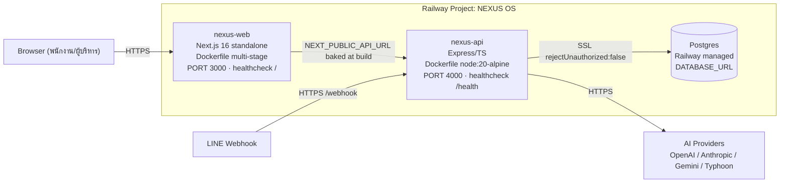
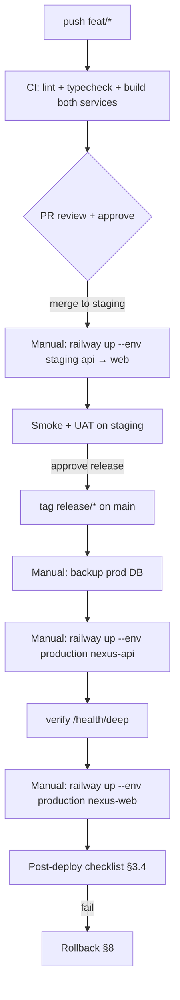

# 24 — Railway Deployment Plan (แผนการ Deploy บน Railway)

> **เอกสารนี้คือ:** แผนการ deploy ระดับ Production สำหรับ NEXUS OS ของ **Saduak Suay Mai PCL** (เครือคลินิกความงาม + ทันตกรรม แฟรนไชส์)
> **Scope:** services `nexus-web` + `nexus-api` + `Postgres` บน Railway, deploy ด้วย `railway up` ต่อ service (ไม่ใช่ GitHub auto-deploy), แต่ละ service build จาก Dockerfile ของตัวเอง
> **Status:** PRODUCTION-READY blueprint — grounded กับ config จริงในรีโป (`backend/railway.json`, `nexasos/railway.json`, Dockerfile ทั้งสองตัว, boot sequence ใน `backend/src/index.ts`)
> **เวอร์ชันเอกสาร:** 1.0 · **วันที่:** 2026-06-25

---

## 0. หลักการสำคัญ (Deployment Principles)

1. **Deploy เป็น service-by-service ด้วย CLI** — `railway up --service <name>` ไม่พึ่ง GitHub auto-deploy. ทุก deploy ต้องผ่านคน (gated) เพื่อให้คุม audit/rollback ได้ (ตรงกับ MEMORY: *deploys via `railway up` per service, NOT GitHub auto-deploy*).
2. **Build จาก Dockerfile ของแต่ละ service** — ทั้งคู่ `builder: "DOCKERFILE"`. ไม่ใช้ Nixpacks. (root `scripts/railway-build.sh` / `railway-start.sh` เป็น **alternate path เก่า** — **NOT authoritative**, ดู §13.)
3. **Config as code** — ค่า deploy (start command, healthcheck, restart policy) อยู่ใน `railway.json` ของแต่ละ service ที่ commit ลงรีโป ไม่ตั้งมือใน dashboard.
4. **Verify บน production build เสมอ** — `next dev` ปิดบัง render-loop / fatal bug ได้ (ตรงกับ MEMORY: *verify-as-production-build*). ทุก release ต้องผ่าน prod-build smoke test ก่อน promote.
5. **Deny-by-default ต่อยอดถึง infra** — secrets แยกต่อ environment, DB ไม่เปิด public, CORS allow-list เข้มงวด.
6. **Stateful = Postgres เท่านั้น** — service ทั้งสองต้องเป็น **stateless** (ห้ามเก็บไฟล์/ session/ rate-limit bucket ใน local disk ของ container ถาวร) เพื่อให้ scale แนวนอนและ zero-downtime ได้ (ดู §10 gaps ที่ต้องปิด).

---

## 1. Topology ปัจจุบัน (As-Is, grounded จากรีโป)



| Service | Source | Builder | Start | Healthcheck | Port | สถานะ |
|---|---|---|---|---|---|---|
| `nexus-web` | `nexasos/` | DOCKERFILE (`nexasos/Dockerfile`, multi-stage, non-root `nextjs`) | `node server.js` (Next standalone) | `GET /` (timeout 300s) | 3000 | **EXISTS** |
| `nexus-api` | `backend/` | DOCKERFILE (`backend/Dockerfile`, node:20-alpine) | `node dist/index.js` | `GET /health` (timeout 300s) | 4000 | **EXISTS** |
| `Postgres` | Railway plugin | — | — | TCP | 5432 | **EXISTS** |

**ข้อเท็จจริงสำคัญที่ ground แล้ว:**
- `nexus-web` **bakes `NEXT_PUBLIC_API_URL` ที่ build time** ผ่าน Dockerfile `ARG NEXT_PUBLIC_API_URL` → `ENV`. **ผลที่ตามมา:** เปลี่ยน URL ของ API = **ต้อง rebuild web ใหม่** (ตั้งเป็น runtime env เฉย ๆ ไม่พอ).
- `nexus-api` boot sequence (`backend/src/index.ts`): `helmet` + CORS + rate-limit middleware → `initSchema()` → `runMigrations()` → start background workers (job queue, daily backup, monthly skill review, SLA escalation) → `app.listen(PORT)`. Workers จะถูก **skip ถ้า `process.env.VERCEL`** set.
- มี **two health endpoints**: `GET /health` (liveness, ใช้โดย Railway healthcheck) และ `GET /health/deep` (`deep-health.controller.ts` — เช็ค DB + providers). `restartPolicyType: ON_FAILURE`, `maxRetries: 10`.
- PG pool ตั้ง `ssl.rejectUnauthorized: false` (**[GAP]** ดู §6).

---

## 2. Environments (staging / production)

ปัจจุบันรีโปมี **environment เดียว** (de facto prod). แผนนี้กำหนด **3 environments** บน Railway โดยใช้ Railway "Environments" (project เดียว, แยก environment) เพื่อใช้ secrets/DB คนละชุด:

| Environment | วัตถุประสงค์ | Branch ที่ deploy | DB | ใครเข้าถึง |
|---|---|---|---|---|
| `production` | ใช้งานจริงทั้งเครือ | `main` (tag `release/*`) | Postgres-prod (มี PITR backup) | ลูกค้า/พนักงานจริง |
| `staging` | UAT + smoke ก่อน promote | `staging` | Postgres-staging (เป็นสำเนา anonymized) | ทีม dev + ผู้ทดสอบ |
| `preview` *(optional)* | ทดสอบ feature branch | `feat/*` | Postgres-preview (ephemeral, seed-only) | dev เท่านั้น |

> **[ASSUMPTION]** ทีมเริ่มด้วย 2 environments (`staging` + `production`) ก่อน แล้วค่อยเพิ่ม `preview` เมื่อทีมโตขึ้น — เหมาะกับขนาดทีมแฟรนไชส์คลินิกในไทย

**กฎ promotion:** `feat/* → staging (UAT ผ่าน) → production`. ห้าม deploy ตรงเข้า production ข้าม staging ยกเว้น **hotfix** (ดู §12).

**การสร้าง environment (CLI):**
```bash
# เลือก project + environment
railway link                       # เลือก project NEXUS OS
railway environment                # สลับ/สร้าง environment (production | staging)

# ตัวอย่าง deploy แยก service ต่อ environment
railway up --service nexus-api --environment staging
railway up --service nexus-web --environment staging
```

**Service ในแต่ละ environment:** `nexus-web`, `nexus-api`, `Postgres` (ครบชุดต่อ environment). `NEXT_PUBLIC_API_URL` ของ web ในแต่ละ environment ต้องชี้ไป API ของ environment เดียวกัน (เพราะ baked at build — §1).

---

## 3. ขั้นตอน Deploy (Runbook) — `railway up` ต่อ Service

> **Order สำคัญ:** Postgres (พร้อมอยู่แล้ว) → `nexus-api` (เพราะมี schema/migration ที่รันตอน boot) → `nexus-web` (เพราะ bake API URL).

### 3.1 Pre-flight (ทุก release)
```bash
# 0) อยู่ environment ที่ถูกต้อง
railway status                       # ยืนยัน project + environment

# 1) ยืนยัน secrets ครบ (ดู §5) — ห้าม deploy ถ้าขาด
railway variables --service nexus-api

# 2) Local production-build smoke (ตรงกับ MEMORY: verify-as-production-build)
cd backend && npm ci && npm run build && node dist/index.js   # ต้องขึ้น "Health: /health" ไม่มี crash
cd ../nexasos && npm ci && NEXT_PUBLIC_API_URL=<staging-api> npm run build && node .next/standalone/server.js
```

### 3.2 Deploy `nexus-api`
```bash
railway up --service nexus-api --environment <env>
# Railway: build จาก backend/Dockerfile → npm ci → npm run build → npm prune --production
# Boot: initSchema() → runMigrations() → workers → listen(4000)
# Railway healthcheck รอ GET /health = 200 (timeout 300s) ก่อนสลับ traffic
```
**Gate:** หลัง deploy เรียก `GET /health/deep` เพื่อยืนยัน DB + AI providers พร้อม:
```bash
curl -fsS https://<nexus-api-domain>/health/deep | jq .
```

### 3.3 Deploy `nexus-web`
```bash
# ต้องส่ง build arg ให้ตรง API ของ environment นั้น (baked!)
railway up --service nexus-web --environment <env>
# ตรวจว่า build arg NEXT_PUBLIC_API_URL ถูกตั้งใน service variables ของ environment นั้น
railway variables --service nexus-web | grep NEXT_PUBLIC_API_URL
```
**Gate:** `curl -fsS https://<nexus-web-domain>/ -o /dev/null -w "%{http_code}\n"` = 200, แล้วเปิด UI login จริง (smoke).

### 3.4 Post-deploy verification (checklist)
- [ ] `GET /health` (api) = 200
- [ ] `GET /health/deep` (api) = DB ok + อย่างน้อย 1 AI provider ok
- [ ] `GET /` (web) = 200
- [ ] Login จริง 1 บัญชี/แต่ละ department-role → เห็นเฉพาะ module ที่มีสิทธิ์ (RBAC sanity)
- [ ] เปิด 1 หน้า RESTRICTED (เช่น payroll) ด้วย role ที่ **ไม่มีสิทธิ์** → ต้องโดน block + มี `failed-access` ใน audit
- [ ] `GET /api/audit` (admin) เห็น log การ deploy/login
- [ ] LINE webhook ตอบ 200 (ถ้าใช้)
- [ ] ไม่มี error loop ใน `railway logs --service nexus-api`

---

## 4. กลยุทธ์ Database Migration

### 4.1 As-Is (grounded)
- Boot ของ `nexus-api` รัน **`initSchema()` แล้วตามด้วย `runMigrations()`** อัตโนมัติ (`backend/src/index.ts`).
- `runMigrations()` (`backend/src/lib/migrations.ts`) เดินผ่าน array `MIGRATIONS` (v1–v10), เช็คใน `schema_migrations` ว่า version ไหน applied แล้ว, apply ที่ยังไม่ applied, return `{ applied, current }`. เป็น **idempotent forward-only**.
- DDL ส่วนใหญ่ inline ใน `*-schema.ts` (เช่น `NEXUS_OPS_SQL`, `NEXUS_ENTITY_PG`) — migration v1/v10 ใช้ `up: ''` เพราะ applied ผ่าน schema constant ตอน boot.

### 4.2 นโยบาย Migration ระดับ Production (NEW guardrails)
1. **Forward-only, idempotent, additive-first.** ห้าม destructive migration (DROP/รื้อ column) ใน path boot. ถ้าจำเป็นต้องลบ → ใช้ **expand/contract**: (a) เพิ่ม column/table ใหม่ + backfill, (b) deploy code ที่อ่านทั้งเก่า/ใหม่, (c) ตัดการอ่านเก่า, (d) migration แยก (manual, gated) ค่อยลบของเก่ารอบถัดไป.
2. **Migration version ใหม่ = แก้ `MIGRATIONS` array เท่านั้น** (เพิ่ม `{ version: N+1, name, up }`) — version ต้อง monotonic, ไม่แก้ของเก่าที่ apply แล้ว.
3. **Backup ก่อน migrate ทุกครั้งบน production** (ดู §5 backups) — snapshot ก่อน `railway up` ของ api.
4. **Migration ต้องผ่าน staging ก่อน** ด้วยข้อมูล anonymized ที่ปริมาณใกล้ prod เพื่อจับ lock/timeout.
5. **Long-running migration (เช่น backfill, สร้าง index บนตารางใหญ่):** **อย่า** ทำใน path boot (จะชน healthcheck 300s และ block listen). ทำเป็น **manual job** แยก:
   ```bash
   railway run --service nexus-api -- node dist/scripts/migrate-backfill.js   # [NEW script]
   ```
   และสร้าง index ด้วย `CREATE INDEX CONCURRENTLY` (นอก transaction) เพื่อไม่ lock ตาราง.
6. **Schema diff gate:** ก่อน promote prod ให้ dump schema staging vs prod เทียบ:
   ```bash
   pg_dump --schema-only "$STAGING_DATABASE_URL" > /tmp/staging.sql
   pg_dump --schema-only "$DATABASE_URL"        > /tmp/prod.sql
   diff /tmp/prod.sql /tmp/staging.sql || echo "REVIEW DRIFT BEFORE DEPLOY"
   ```

### 4.3 [GAP→NEW] ทำให้ migration **decoupled จาก boot** (แนะนำ)
ปัจจุบัน migration ผูกกับ boot ของทุก instance. เมื่อ **scale > 1 replica** หลาย instance อาจรัน `runMigrations()` พร้อมกัน → race. แก้:
- เพิ่ม **advisory lock** ครอบ `runMigrations()`:
  ```sql
  SELECT pg_advisory_lock(733911);   -- ก่อน migrate
  -- ... apply ...
  SELECT pg_advisory_unlock(733911); -- หลัง migrate
  ```
  instance อื่นจะรอ lock แล้วเห็นว่า applied ครบ จึงข้าม. **[NEW migration helper]**
- ทางเลือกที่สะอาดกว่า: แยกเป็น **release-phase command** (`railway run ... migrate`) ที่รันครั้งเดียวก่อน roll service ใหม่ แล้ว boot ของ service ทำแค่ `assertSchemaUpToDate()` (fail fast ถ้าไม่ตรง). แนะนำตอนเข้าสู่ multi-replica.

---

## 5. Backups + Retention + Secrets

### 5.1 Database Backups (สำคัญสุด — ข้อมูลคนไข้/เงินเดือนอยู่ในนี้)
สองชั้น:

**A) Railway managed Postgres backups (infra-level)**
- เปิด **automated daily snapshot** + **Point-in-Time Recovery (PITR)** บน Postgres-prod.
- **[ASSUMPTION] Retention:** daily snapshot เก็บ **35 วัน**, PITR window **7 วัน** — เพียงพอสำหรับ recovery ปกติของคลินิก. ปรับตามแพ็กเกจ Railway.

**B) Application-level logical backup (มีอยู่แล้วบางส่วน → ต้อง externalize)**
- `nexus-api` มี **daily backup worker** อยู่แล้ว (เขียน `backup_records` table) — แต่ **[GAP]** ตอนนี้เป็น record/in-DB เท่านั้น ไม่ใช่ off-site dump.
- **[NEW]** เพิ่ม nightly `pg_dump` → upload ไป **object storage นอก Railway** (เช่น S3-compatible / Cloudflare R2) แบบเข้ารหัส:
  ```bash
  # cron worker หรือ scheduled job
  pg_dump --format=custom "$DATABASE_URL" \
    | gpg --symmetric --cipher-algo AES256 --batch --passphrase "$BACKUP_ENC_KEY" \
    | aws s3 cp - "s3://saduak-nexus-backups/$(date +%F)/nexus-prod.dump.gpg"
  ```
- **Retention tiering (off-site):** daily 35 วัน → weekly 12 สัปดาห์ → monthly 12 เดือน. (สอดคล้องกับการเก็บข้อมูลทางการแพทย์/บัญชีของไทย — **[ASSUMPTION]** เก็บข้อมูลทางการเงิน/ภาษีตามเกณฑ์ ≥ 5 ปีในรูปแบบ archive แยก, ไม่อยู่ใน hot backup).
- **Restore drill:** ทดสอบ restore ลง environment ชั่วคราว **ทุกไตรมาส** + log ผลใน `backup_records`. Backup ที่ไม่เคย restore = ไม่นับว่ามี backup.

**RPO/RTO target ([ASSUMPTION], เหมาะกับคลินิกแฟรนไชส์):**
| ระดับ | RPO (ข้อมูลที่ยอมเสีย) | RTO (เวลากู้คืน) |
|---|---|---|
| DB corruption / accidental delete | ≤ 5 นาที (PITR) | ≤ 1 ชม. |
| Region/infra outage | ≤ 24 ชม. (off-site dump) | ≤ 4 ชม. |

### 5.2 Log / Audit Retention Storage
ผูกกับ spec audit append-only:
- **`audit_log` + log tables (`ai_query_logs`, `login_logs`, `file_access_logs`, ...)** ต้องเก็บใน Postgres เป็น source of truth แบบ **append-only** (revoke UPDATE/DELETE บน role ของ app — ดู §10 + เอกสาร audit).
- **Hot retention ใน DB:** 18 เดือน (query ได้เร็ว). **[ASSUMPTION]**
- **Cold archive:** > 18 เดือน export เป็น Parquet/NDJSON เข้ารหัสไป object storage, เก็บ **7 ปี** (เพื่อรองรับการสอบสวน HR / ภาษี / การแพทย์). **[ASSUMPTION]**
- **AI logs** แยกตาราง แต่ link ด้วย `request_id` — retention เท่ากับ audit.
- **Railway platform logs** (`railway logs`) เก็บสั้น (ตาม Railway) — **ไม่ใช่** audit trail; ใช้ดู ops เท่านั้น. ส่งต่อไป log sink ภายนอก (เช่น Datadog/Logtail) ถ้าต้อง observability ระยะยาว. **[ASSUMPTION]**

### 5.3 Secrets Management
**As-Is:** secrets เป็น Railway service variables. `JWT_SECRET` required ใน prod (มี dev fallback), `ENCRYPTION_KEY` มี **weak fallback chain** (→ `JWT_SECRET` → hardcoded dev string) — **[GAP CRITICAL]**.

**นโยบาย Production:**
1. **ทุก secret ตั้งเป็น Railway variable ต่อ environment** ห้าม commit ลงรีโป, ห้าม fallback ใน prod.
   - **[NEW] ปิด fallback chain:** ใน prod ถ้า `ENCRYPTION_KEY` ไม่ถูกตั้ง หรือ == `JWT_SECRET` หรือ == dev string → **process ต้อง throw ตอน boot (fail fast)** ไม่ใช่ silent fallback.
2. **แยก secret คนละค่าต่อ environment** (staging ≠ production) — ห้ามใช้ key ชุดเดียวกัน.
3. **Rotation policy ([ASSUMPTION]):** `JWT_SECRET` / `ENCRYPTION_KEY` หมุนทุก 90 วัน, AI keys หมุนเมื่อรั่ว/หมุนทุก 180 วัน. JWT rotation ต้องรองรับ dual-key (verify ด้วย key เก่า+ใหม่ช่วง grace period) เพื่อไม่เตะ user ออกหมด.
4. **Encryption key เป็น key-encryption-key (KEK)** สำหรับ field-level encryption (salary/patient) — เก็บแยกจาก JWT, อย่าปนหน้าที่.
5. **Least privilege DB:** app เชื่อม Postgres ด้วย role ที่ **ไม่มี SUPERUSER**, ไม่มี UPDATE/DELETE บนตาราง audit (ดู §10).
6. **ไม่มี secret ใน build args ที่ leak ลง image** — ระวัง `NEXT_PUBLIC_*` ทุกตัวจะ **public** (ฝังใน bundle ฝั่ง client). `NEXT_PUBLIC_API_URL` ปลอดภัย (เป็น URL), แต่ **ห้าม** ใส่ secret จริงใน `NEXT_PUBLIC_*` เด็ดขาด.

**รายการ secrets/variables ต่อ service:**

`nexus-api`:
| Variable | จำเป็น | หมายเหตุ |
|---|---|---|
| `DATABASE_URL` | ✅ | ขาด → fallback SQLite (ห้ามใน prod) |
| `JWT_SECRET` | ✅ | required prod, fail fast ถ้าขาด |
| `ENCRYPTION_KEY` | ✅ | **ห้าม fallback** ใน prod (NEW guard) |
| `FRONTEND_URL` | ✅ | CORS allow-list — ต้องตรง domain ของ `nexus-web` ใน env นั้น |
| `OPENAI_API_KEY` / `ANTHROPIC_API_KEY` / `GEMINI_API_KEY` / `TYPHOON_API_KEY` | ⚠️ | อย่างน้อย 1 ตัวเพื่อให้ AI ทำงาน; provider chain fallback |
| `*_MODEL`, `TYPHOON_API_URL` | ⛔ optional | override default models |
| `LINE_CHANNEL_SECRET` / `LINE_CHANNEL_ACCESS_TOKEN` | ⚠️ | ถ้าใช้ LINE integration |
| `BACKUP_ENC_KEY` | ✅ (NEW) | สำหรับเข้ารหัส off-site dump |
| `NODE_ENV=production`, `PORT=4000` | ✅ | ตั้งใน Dockerfile แล้ว |
| `VERCEL` | ⛔ | **ต้องไม่ตั้งบน Railway** — ถ้าตั้ง workers จะถูก skip (รวม backup/SLA worker) |

`nexus-web`:
| Variable | จำเป็น | หมายเหตุ |
|---|---|---|
| `NEXT_PUBLIC_API_URL` | ✅ | **build-arg, baked** — เปลี่ยน = rebuild |
| `NODE_ENV=production`, `PORT=3000` | ✅ | ตั้งใน Dockerfile |

---

## 6. Healthchecks + Zero-Downtime

### 6.1 Healthchecks (grounded)
- `nexus-api`: Railway healthcheck `GET /health` (timeout 300s) — liveness เบา ๆ. มี `GET /health/deep` (DB+providers) สำหรับ readiness แบบลึก.
- `nexus-web`: Railway healthcheck `GET /` (timeout 300s).
- **[NEW] แนะนำ:** ตั้ง Railway healthcheck ของ api ไปที่ endpoint **readiness แยก** (`/health/ready`) ที่เช็คว่า migration applied + DB ติดต่อได้ + อย่างน้อย 1 provider ok — เพื่อ Railway ไม่สลับ traffic เข้า instance ที่ยัง migrate ไม่เสร็จ. คง `/health` ไว้เป็น liveness ล้วน (ไม่แตะ DB) กัน restart loop เวลา DB ช้าชั่วคราว.

### 6.2 Zero-Downtime Deploy
- Railway ทำ **rolling replace**: build image ใหม่ → start container ใหม่ → รอ healthcheck ผ่าน → สลับ traffic → kill ตัวเก่า. การที่ healthcheck รอ `/health` = 200 ก่อนสลับ คือกลไก zero-downtime หลัก.
- **เงื่อนไขที่ทำให้ zero-downtime ใช้ได้จริง (ต้องทำ):**
  1. **Service ต้อง stateless** — ปัจจุบัน rate-limiter เป็น **in-memory ต่อ instance** และไฟล์อาจเขียน local — **[GAP]** ทำให้ scale/รีสตาร์ตเสียสถานะ. ย้าย rate-limit ไป store กลาง (Postgres/Redis) และไฟล์ไป object storage (ดู §10).
  2. **Migration ต้อง backward-compatible** — instance เก่า+ใหม่รันพร้อมกันช่วง rollover ได้ (expand/contract, §4.2).
  3. **Graceful shutdown** — จับ `SIGTERM`: หยุดรับ request ใหม่, drain in-flight, ปิด PG pool, ปล่อย workers อย่างปลอดภัย แล้วค่อย exit. **[NEW]** เพิ่ม handler นี้ (ยังไม่มีชัดในรีโป) เพื่อไม่ให้ตัด request กลางคันตอน redeploy.
  4. **`restartPolicyType: ON_FAILURE` / maxRetries 10** (มีแล้ว) — กัน crash loop ถาวร; แต่ถ้าถึง 10 ครั้งให้ alert.

### 6.3 SSL/TLS
- Railway ให้ HTTPS ที่ edge อัตโนมัติต่อ service domain.
- **[GAP→FIX]** PG pool `ssl.rejectUnauthorized: false` — ยอม cert ที่ verify ไม่ได้. สำหรับ prod ควรตั้ง CA ของ Railway Postgres และเปิด verify (`rejectUnauthorized: true` + `ca`) เพื่อกัน MITM ภายใน. หากภายใน private network ของ Railway ให้ document ว่ายอมรับความเสี่ยงนี้อย่างชัดเจน.

---

## 7. Scaling

| มิติ | as-is | แผน |
|---|---|---|
| `nexus-api` | 1 instance (vertical) | scale **vertical ก่อน** (เพิ่ม CPU/RAM). horizontal ต้องปิด gap stateless (§6.2) + advisory-lock migration (§4.3) ก่อน |
| `nexus-web` | 1 instance | scale horizontal ได้ทันที (stateless อยู่แล้ว — render เป็น standalone) |
| `Postgres` | 1 primary | vertical scale; เพิ่ม read-replica เมื่อ report/AI-context อ่านหนัก ([ASSUMPTION] เมื่อ > ~30 สาขา) |
| Connection pool | per-instance pool | ตั้ง `max` pool ต่อ instance ให้ `instances × max < Postgres max_connections`. ถ้า horizontal เยอะ → ใช้ **PgBouncer** (transaction pooling) |
| Background workers | รันใน api instance | **[GAP]** ถ้า scale api หลาย instance → worker (backup/SLA/skill review) จะรันซ้ำหลายตัว. แยก worker เป็น **dedicated single-instance service** หรือ gate ด้วย advisory lock/leader-election |

**Autoscaling trigger ([ASSUMPTION]):** scale api ขึ้นเมื่อ p95 latency > 800ms หรือ CPU > 70% ต่อเนื่อง 5 นาที. รักษา instance ขั้นต่ำ web=2 / api=2 เมื่อพ้นช่วง pilot เพื่อ HA.

---

## 8. Rollback Plan

> หลักการ: **deploy ทุกครั้งต้อง rollback ได้ใน < 5 นาที** โดยไม่ต้อง rebuild.

### 8.1 Rollback ของ Service (เร็วสุด)
Railway เก็บ deployment ก่อนหน้าไว้ (immutable image):
```bash
# ดู deployment history
railway deployments --service nexus-api
# rollback ไป deployment ก่อนหน้า (instant, ใช้ image เดิม)
railway rollback --service nexus-api          # หรือเลือก deployment id เฉพาะ
```
- **Order ของ rollback** = **ย้อนกลับของ deploy**: ถ้า web ใหม่พึ่ง API ใหม่ → rollback web ก่อน แล้วค่อย api. ถ้า API ใหม่ migrate schema → ดู §8.2.
- เพราะ `NEXT_PUBLIC_API_URL` baked: การ rollback web = กลับไป image ที่ชี้ API URL เดิม (โดยปกติ URL เท่าเดิมจึงไม่มีปัญหา).

### 8.2 Rollback ที่มี Migration (อันตราย — ต้องระวัง)
เพราะ migration เป็น **forward-only**: การ rollback **code** ไม่ rollback **schema**. ดังนั้น:
- ถ้าทำตาม **expand/contract + additive-first** (§4.2) → schema ใหม่ยัง backward-compatible กับ code เก่า → **rollback code ปลอดภัย** โดยไม่ต้องแตะ DB. **นี่คือเหตุผลหลักที่ห้าม destructive migration ใน boot path.**
- ถ้า migration destructive (ไม่ควรเกิด): rollback code อย่างเดียวไม่พอ → ต้อง **restore DB จาก snapshot ก่อน migrate** (§5.1) = downtime + data loss ช่วงนั้น. นี่คือ worst case ที่นโยบายนี้ออกแบบมาให้หลีกเลี่ยง.

### 8.3 Decision matrix
| อาการหลัง deploy | การกระทำ |
|---|---|
| Web error / UI พัง, API ดี | `railway rollback --service nexus-web` |
| API 5xx / crash loop, schema ไม่เปลี่ยน | `railway rollback --service nexus-api` |
| API พังหลัง additive migration | rollback api (schema ยัง compatible) |
| API พังหลัง destructive migration | restore DB snapshot → rollback api → post-mortem |
| AI provider ล่ม | ไม่ต้อง rollback — provider fallback chain ทำงาน; ปิด provider ที่เสียผ่าน env |
| Secret ผิด/รั่ว | หมุน secret + redeploy (ดู §5.3 rotation) |

### 8.4 Abort criteria (เมื่อไหร่ตัดสินใจ rollback)
หลัง deploy ภายใน **15 นาทีแรก** ถ้าเจอข้อใดข้อหนึ่ง → rollback ทันที:
- `/health/deep` ไม่ผ่าน, error rate > 2%, p95 latency เพิ่ม > 2 เท่าจาก baseline, login fail สูงผิดปกติ, หรือพบ **cross-tenant data leak / RESTRICTED data รั่ว** (severity สูงสุด — rollback + incident ทันที).

---

## 9. CI/CD Flow (gated, ไม่ auto-deploy)


- **CI** (เช่น GitHub Actions) ทำแค่ **build/test/verify** — **ไม่** deploy. การ deploy เป็น manual `railway up` (gated) ตาม MEMORY.
- **[NEW]** เก็บ `RAILWAY_TOKEN` เป็น secret ถ้าจะให้ CI สั่ง `railway up` ได้ (แบบ gated ด้วย manual approval environment) — แต่ default คือคนสั่งจากเครื่องที่ `railway login` แล้ว.

---

## 10. Gaps ที่ต้องปิดก่อนเรียก Production-grade (ลำดับความสำคัญ)

| # | Gap | ความเสี่ยง | งานที่ต้องทำ | สถานะ |
|---|---|---|---|---|
| 1 | `ENCRYPTION_KEY` มี weak fallback → `JWT_SECRET` → hardcoded | ถอดรหัส salary/patient ได้ถ้า key เดา | fail-fast ใน prod ถ้าไม่ตั้ง/ตรง dev string | **NEW** |
| 2 | Rate-limiter in-memory ต่อ instance | scale แล้ว limit หลุด | ย้าย bucket ไป Postgres/Redis | **NEW** |
| 3 | ไฟล์ user เขียน local disk (ephemeral) | redeploy = ไฟล์หาย | ย้ายไป object storage (S3/R2) | **NEW** |
| 4 | Worker รันใน api → ซ้ำเมื่อ multi-instance | backup/SLA รันซ้ำ | leader-election (advisory lock) หรือ worker service แยก | **NEW** |
| 5 | Migration ผูก boot → race เมื่อ multi-replica | schema corrupt | advisory lock รอบ runMigrations() / release-phase migrate | **NEW** |
| 6 | PG `rejectUnauthorized:false` | MITM ภายใน | เปิด TLS verify + CA | **NEW** |
| 7 | ไม่มี graceful SIGTERM | ตัด request กลางคันตอน deploy | เพิ่ม shutdown handler | **NEW** |
| 8 | Audit/log retention ยังไม่ append-only + ไม่ archive | แก้ log ได้ / log หาย | revoke UPDATE/DELETE + cold archive (§5.2) | **NEW** |
| 9 | off-site backup ยังไม่มี (มีแค่ `backup_records` ใน DB) | DB ตาย = ข้อมูลหาย | nightly encrypted pg_dump → object storage | **NEW** |
| 10 | ไม่มี alerting/monitoring | รู้ว่าเจ๊งช้า | hook Railway metrics + healthcheck → แจ้งเตือน (§11) | **NEW** |

---

## 11. Observability & Alerting (สำหรับ deploy/ops)

- **Liveness/readiness:** Railway healthcheck (มี) + external uptime monitor ping `/health` & `/` ทุก 1 นาที. **[ASSUMPTION]**
- **Metrics:** มี `requestMetricsMiddleware` + `request_metrics` table อยู่แล้ว — surface ขึ้น dashboard (p95 latency, error rate, throughput ต่อ endpoint).
- **Deploy events:** ทุก `railway up` ควรเขียน audit entry (action `deploy`) + แจ้ง LINE/Slack ของทีม ops พร้อม commit SHA + environment + ผู้สั่ง. **[NEW]**
- **Alert routing ([ASSUMPTION]):** healthcheck fail 2 ครั้งติด, crash-loop (restart > 3 ใน 10 นาที), error rate > 2%, หรือ disk/connection pool ใกล้เต็ม → แจ้งทีม ops ทันที.

---

## 12. Hotfix Path (ข้าม staging อย่างมีวินัย)

ใช้เฉพาะ **production incident รุนแรง** (data leak / ระบบล่ม):
1. branch `hotfix/*` จาก tag prod ปัจจุบัน.
2. แก้ + `npm run build` ผ่าน + smoke เฉพาะจุด.
3. **backup prod DB ก่อน** (ถ้าแตะ schema — แต่ hotfix ควรเลี่ยง migration).
4. `railway up --service <affected> --environment production`.
5. verify §3.4 → ถ้าไม่ผ่าน rollback §8 ทันที.
6. **merge hotfix กลับ `main` + `staging`** ภายในวันเดียว (กัน drift) + เขียน post-mortem.

---

## 13. หมายเหตุเรื่อง config ที่ขัดกัน (ground truth)

- **Authoritative deploy path = per-service `railway.json` + Dockerfile** (`builder: DOCKERFILE`). Railway จะใช้ไฟล์เหล่านี้.
- `scripts/railway-build.sh` / `railway-start.sh` (root, branch ตาม `RAILWAY_SERVICE_NAME`) เป็น **alternate path เก่า** ที่ build/start แบบ monorepo — **NOT authoritative** สำหรับ topology ปัจจุบัน. แนะนำ **ลบหรือ mark deprecated** เพื่อกันคนรันผิด.
- `.railway-config-pull-65609/railway.ts` = IaC placeholder (single "web" stub) ที่ untracked — **ไม่ authoritative**, อย่าใช้.
- **`VERCEL` env:** อย่าตั้งบน Railway. ถ้าตั้ง → boot จะ **skip background workers** (รวม daily backup + SLA escalation) และ skip listen path บางส่วน — ทำให้ backup เงียบหายโดยไม่รู้ตัว.

---

## 14. สรุป Definition of Done (ก่อนเรียกว่า Production-ready)

- [ ] มี environment `staging` + `production` แยก secrets + DB
- [ ] `ENCRYPTION_KEY`/`JWT_SECRET` fail-fast (ไม่มี fallback) ใน prod
- [ ] Migration เป็น expand/contract + advisory lock (พร้อม multi-replica)
- [ ] Nightly encrypted off-site `pg_dump` + restore drill รายไตรมาส + PITR เปิด
- [ ] Audit/log tables append-only (revoke UPDATE/DELETE) + cold archive 7 ปี
- [ ] `/health` (liveness) + `/health/ready` (readiness) แยกบทบาท, Railway ใช้ readiness ก่อนสลับ traffic
- [ ] Graceful SIGTERM + service stateless (rate-limit + files ออกนอก instance)
- [ ] Rollback ทดสอบจริง < 5 นาที, มี decision matrix + abort criteria
- [ ] Monitoring + alert routing ทำงาน, deploy event เข้า audit
- [ ] `scripts/railway-*.sh` deprecated, `VERCEL` ไม่ถูกตั้งบน Railway

---

*เอกสารนี้อ้างอิงสถานะจริงของรีโป `nexus-os-deploy` ณ 2026-06-25. รายการที่ติด **[ASSUMPTION]** เป็นค่าที่ตั้งให้สมจริงสำหรับเครือคลินิกความงาม+ทันตกรรมแฟรนไชส์ในไทย และต้องยืนยันกับเจ้าของระบบก่อนนำไปใช้เป็นนโยบายจริง*
