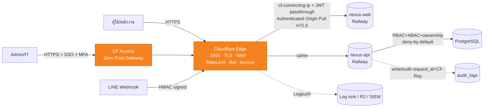

# 25 — Cloudflare Security Plan (แผนความปลอดภัย Cloudflare หน้า Railway)

> **บริษัท:** Saduak Suay Mai PCL — เครือคลินิกเสริมความงาม + ทันตกรรม (แฟรนไชส์)
> **ระบบฐาน:** NEXUS OS (Next.js 16 `nexus-web` + Express/TS `nexus-api` + PostgreSQL บน Railway)
> **เอกสารชุด:** Enterprise Edge Security / Zero-Trust Perimeter
> **สถานะ:** PRODUCTION-READY — Cloudflare เป็น **เกราะชั้นนอก (defense-in-depth)** ไม่ใช่ตัวแทนของ backend authz/audit
> **เวอร์ชันเอกสาร:** 1.0 | **เจ้าของ:** Chief Security Architect + Platform/SRE
> **เกี่ยวข้อง:** [10 — Security Matrix](./10-security-matrix.md) · [11 — Permission Matrix](./11-permission-matrix.md) · [17 — Audit Log Design](./17-audit-log-design.md) · [19 — Permission Logic](./19-permission-logic.md)

---

## สารบัญ

- [0. หลักการกำกับ (Governing Principles) — Cloudflare เสริม ไม่แทน Backend](#0-หลักการกำกับ)
- [1. สถาปัตยกรรม Edge ปัจจุบัน vs เป้าหมาย (Topology)](#1-สถาปัตยกรรม-edge)
- [2. DNS & Origin Lockdown (ปิดทางอ้อม Cloudflare)](#2-dns--origin-lockdown)
- [3. TLS / HSTS / mTLS](#3-tls--hsts--mtls)
- [4. WAF — Managed + Custom Rules (รายการกฎจริง)](#4-waf--managed--custom-rules)
- [5. Rate Limiting Rules (รายการกฎจริง)](#5-rate-limiting-rules)
- [6. Bot Management & DDoS](#6-bot-management--ddos)
- [7. Cloudflare Access (Zero-Trust) สำหรับ admin/IT/audit](#7-cloudflare-access-zero-trust)
- [8. Cache & Page Rules — ห้าม cache authenticated / RESTRICTED](#8-cache--page-rules)
- [9. การส่งต่อ identity ไปยัง Backend (CF headers ↔ audit)](#9-identity-headers--audit)
- [10. Logging, SIEM & Audit ผูกกัน](#10-logging-siem--audit)
- [11. Terraform / IaC สำหรับ rule ทั้งหมด](#11-terraform--iac)
- [12. Runbook, Rollback & การทดสอบ](#12-runbook-rollback--test)
- [13. RACI, ค่าใช้จ่าย, สมมติฐาน](#13-raci-cost-assumptions)
- [14. Checklist ก่อน go-live](#14-checklist)

---

## 0. หลักการกำกับ

Cloudflare ใน NEXUS OS คือ **perimeter เลเยอร์ที่ 1** ของโมเดล defense-in-depth — มันกรอง traffic ที่ "ไม่ควรไปถึง origin ตั้งแต่แรก" (bot, flood, payload โจมตี, ผู้ใช้ที่ไม่ได้ตั้งใจเข้า admin) แต่ **ไม่เคย** เป็นผู้ตัดสินสิทธิ์ข้อมูล ระดับชั้นความปลอดภัย หรือ ownership นั่นเป็นหน้าที่ของ `nexus-api` เท่านั้น

กฎเหล็ก (ผูกกับ GLOBAL DESIGN RULES):

1. **Cloudflare เสริม ไม่แทน (complements, never replaces).** ทุก decision allow/deny ของข้อมูลระดับ `MEDIUM`/`HARD`/`RESTRICTED` ยังคงเกิดที่ backend (RBAC + ABAC + Data-Ownership, deny-by-default) ตาม [doc 10](./10-security-matrix.md)/[11](./11-permission-matrix.md) **ถ้า Cloudflare ถูก bypass ทั้งหมด ระบบต้องยังปลอดภัย** — Cloudflare ลด blast radius ไม่ใช่สร้าง security boundary เดียว
2. **Edge ไม่ใช่แหล่งความจริงของ identity.** Cloudflare Access พิสูจน์ว่า "คนนี้เป็นพนักงานองค์กร" แต่ **role/department/clearance** ยังอ่านจาก JWT + DB ที่ backend ทุกครั้ง Cloudflare ห้ามฉีด role ที่ backend เชื่อโดยไม่ตรวจ
3. **Fail-safe ต่อข้อมูลอ่อนไหว.** ถ้า Cloudflare config ผิดพลาดในทางที่ "เปิดกว้างกว่าที่ตั้งใจ" backend ต้องยัง deny ดังนั้น **RESTRICTED endpoint ไม่พึ่ง Cloudflare เพื่อปิด** — Cloudflare เป็นชั้นเสริม ไม่ใช่ชั้นเดียว
4. **ทุกการกระทำที่ edge ที่ block/challenge** ต้อง observable และ (เมื่อแตะ authenticated route) **correlate กลับเข้า `audit_logs`** ผ่าน `request_id`/`CF-Ray` (ดู [doc 17 §4](./17-audit-log-design.md))
5. **Never cache อะไรที่ผูกกับผู้ใช้.** การตอบสนองที่มี `Authorization`/cookie หรือ payload ระดับ `HARD`/`RESTRICTED` ต้อง `Cache-Control: private, no-store` และ Cloudflare ต้อง **bypass cache** เสมอ — กัน data leak ข้ามผู้ใช้ที่ชั้น CDN

> **[ASSUMPTION]** องค์กรอยู่ภายใต้ **PDPA (พ.ร.บ.คุ้มครองข้อมูลส่วนบุคคล พ.ศ. 2562)**; ข้อมูล medical/dental/patient = sensitive personal data (ม.26) แผนนี้บังคับ **data localization-aware logging** (ดู §10) และห้าม cache เนื้อหาสุขภาพที่ edge เด็ดขาด
> **[ASSUMPTION]** แพ็กเกจ Cloudflare = **Pro หรือ Business** + add-on **Bot Management** + **Cloudflare Zero Trust (Access)** Free/Standard seats สำหรับทีม admin/IT (~10–20 seats) ตัวเลข plan-gating ในเอกสารระบุชัดว่ากฎใดต้องใช้ tier ใด

---

## 1. สถาปัตยกรรม Edge

### 1.1 ปัจจุบัน (ground truth)

จาก MEMORY/discovery — Railway project **NEXUS-OS-Platform** (env `production`), 3 services, **ไม่ผูก GitHub auto-deploy** (deploy ด้วย `railway up` ต่อ service):

| Service | URL ปัจจุบัน (Railway-generated) | บทบาท |
|---|---|---|
| `nexus-web` | `https://nexus-web-production-4fda.up.railway.app` | Next.js standalone (frontend), PORT 3000, healthcheck `/` |
| `nexus-api` | `https://nexus-api-production-3ebf.up.railway.app` | Express/TS API, PORT 4000, healthcheck `/health` |
| `postgres` | (private, `DATABASE_URL` บน nexus-api) | DB |

ปัญหา edge ปัจจุบัน (จาก discovery §5/§7):

- **Rate limiter เป็น in-memory ต่อ instance** (`backend/src/middleware/rate-limit.ts`, `Map<string,Bucket>`) — reset ต่อ process, ถูก defeat ทันทีเมื่อ scale horizontal Cloudflare rate limiting จะมาแทน/เสริมเป็น **distributed limiter** ที่ edge
- **CORS allow-list** อ่านจาก `FRONTEND_URL` (`backend/src/middleware/cors.ts`) ดี แต่ origin ยัง public ตรง ๆ ทาง `*.up.railway.app`
- ไม่มี WAF, ไม่มี bot management, ไม่มี IP allow-list สำหรับ admin, ไม่มี DDoS shielding นอกเหนือจาก Railway
- `*.up.railway.app` **เข้าถึงตรงได้จากอินเทอร์เน็ต** — แม้ตั้ง Cloudflare หน้า custom domain ผู้โจมตีก็ยังยิง origin ตรงโดยข้าม Cloudflare ได้ (ต้องปิดด้วย §2)

### 1.2 เป้าหมาย (target topology)

ผูก **custom domain** เข้า Cloudflare แล้ว proxy (orange-cloud) ไป Railway:

| Hostname (เป้าหมาย) | Proxy ไป Railway service | Public? |
|---|---|---|
| `app.saduak.co.th` **[ASSUMPTION domain]** | `nexus-web` | ใช่ (พนักงาน) |
| `api.saduak.co.th` | `nexus-api` | ใช่ (เรียกจาก web + LINE webhook) |
| `admin.saduak.co.th` | `nexus-web` (เส้นทาง /admin, /audit, /settings) | **เฉพาะหลัง Cloudflare Access** |
| `id.saduak.co.th` | Cloudflare Access (IdP login) | n/a |



หลักการสองชั้น: **(ก)** Cloudflare ปิด traffic ขยะที่ edge **(ข)** Railway origin รับเฉพาะ traffic ที่ผ่าน Cloudflare (มี mTLS cert + IP allow-list) — กัน origin-bypass

---

## 2. DNS & Origin Lockdown

> เป้าหมายสำคัญที่สุดของส่วนนี้: **ปิดไม่ให้ใครยิง `*.up.railway.app` ตรง ๆ** ข้าม Cloudflare ไม่งั้น WAF/rate-limit/Access ทั้งหมดไร้ความหมาย

### 2.1 DNS records

| Type | Name | Content | Proxy | TTL | หมายเหตุ |
|---|---|---|---|---|---|
| `CNAME` | `app` | `nexus-web-production-4fda.up.railway.app` | 🟧 Proxied | Auto | frontend |
| `CNAME` | `api` | `nexus-api-production-3ebf.up.railway.app` | 🟧 Proxied | Auto | backend |
| `CNAME` | `admin` | `nexus-web-production-4fda.up.railway.app` | 🟧 Proxied | Auto | gated ด้วย Access |
| `CNAME` | `id` | `<team>.cloudflareaccess.com` | 🟧 Proxied | Auto | Access login |
| `CAA` | `@` | `0 issue "letsencrypt.org"` + `0 issue "pki.goog"` (Railway) + `0 issue "digicert.com"` (CF) | n/a | n/a | จำกัด CA ที่ออก cert ได้ |
| `TXT` | `_dmarc` | `v=DMARC1; p=reject; rua=mailto:dmarc@saduak.co.th` | n/a | n/a | กัน spoof แบรนด์ |
| `TXT` | `@` | SPF `v=spf1 -all` (ถ้าไม่ส่งเมลจากโดเมนนี้) | n/a | n/a | |

- **ทุก record ที่ proxy ได้ ต้อง orange-cloud** ห้ามมี grey-cloud (DNS-only) record ที่ชี้ไป Railway hostname — เพราะ grey-cloud = เปิดเผย IP origin
- เปิด **DNSSEC** ที่ registrar
- ตั้ง custom domain ในแต่ละ Railway service (Settings → Networking → Custom Domain) ให้ตรง `app./api.` แล้ว Railway จะ provision cert ของตัวเอง (สำหรับ CF→origin TLS, ดู §3)

### 2.2 Origin lockdown — บังคับให้ origin รับเฉพาะจาก Cloudflare

Railway ไม่มี firewall ระดับ network ที่ตั้ง IP allow-list ของ Cloudflare ได้สะดวก ดังนั้นใช้ **สองมาตรการซ้อนกัน**:

1. **Authenticated Origin Pulls (mTLS)** — เปิดที่ Cloudflare (SSL/TLS → Origin Server → Authenticated Origin Pulls, **zone-level + per-hostname**) แล้วบังคับ `nexus-api`/`nexus-web` ให้ **ตรวจ client cert ของ Cloudflare** ก่อนรับ request ทำที่ application layer:
   - ใช้ **Cloudflare Origin CA** หรือ Cloudflare's well-known client cert; ตรวจ header/cert ที่ Express
   - ทางปฏิบัติบน Railway (TLS terminate ที่ proxy ของ Railway): ใช้ **shared secret header** ร่วม (ดูข้อ 2) เป็น control หลัก และ mTLS เป็นชั้นเสริมเมื่อ Railway รองรับ TCP proxy/`raw` domain
2. **Pre-shared origin secret (บังคับใช้ทันที, ใช้ได้แน่บน Railway):**
   - ที่ Cloudflare ใส่ **Transform Rule (Modify Request Header)**: เพิ่ม `X-Edge-Auth: <random-64-byte-secret>` กับทุก request ที่ proxy ไป origin
   - ที่ `nexus-api`/`nexus-web` เพิ่ม middleware **ตัวแรกสุด** (ก่อน helmet/cors): ถ้า `req.header('x-edge-auth') !== process.env.EDGE_SHARED_SECRET` → `403` ทันที (ยกเว้น `/health` ภายในที่ Railway probe ใช้ ซึ่งเรียกผ่าน localhost)
   - เก็บ `EDGE_SHARED_SECRET` เป็น env var บน Railway (ทั้งสอง service) — **rotate ทุก 90 วัน** (ดู runbook §12)

```ts
// NEW middleware — backend/src/middleware/edge-guard.ts (วางก่อน helmet ใน index.ts)
import { Request, Response, NextFunction } from 'express'
const SECRET = process.env.EDGE_SHARED_SECRET || ''
const ALLOW_INTERNAL = new Set(['/health', '/health/deep']) // Railway probe (localhost)
export function edgeGuard(req: Request, res: Response, next: NextFunction): void {
  if (ALLOW_INTERNAL.has(req.path) && (req.ip === '127.0.0.1' || req.ip === '::1')) return next()
  if (!SECRET) return next() // dev/local — secret ไม่ตั้ง = ปล่อยผ่าน (โปรดตั้งใน prod)
  const presented = req.header('x-edge-auth')
  if (presented && presented.length === SECRET.length && timingSafeEq(presented, SECRET)) return next()
  res.status(403).json({ error: 'Direct origin access blocked. Use the official endpoint.' })
}
```

> **NEW (deploy):** env var `EDGE_SHARED_SECRET` บนทั้งสอง Railway service + `edge-guard.ts` middleware เป็น **migration ฝั่ง infra+code** ผลคือผู้ที่ยิง `*.up.railway.app` ตรงจะได้ `403` (เพราะไม่มี header ที่ถูกต้อง) — origin lockdown สำเร็จแม้ไม่มี network ACL
>
> **สำคัญ:** เปิดใช้ Cloudflare **ก่อน** เปิด `edge-guard` enforcement (ตั้ง `EDGE_SHARED_SECRET` ค้างไว้แต่ middleware เริ่มที่โหมด log-only ก่อน 24 ชม. แล้วค่อย enforce) มิฉะนั้น misconfig จะทำให้ทั้งเว็บ 403

### 2.3 `cf-connecting-ip` & `trust proxy`

เพราะ traffic ผ่าน Cloudflare แล้ว `req.ip` ของ Express จะเป็น IP ของ Cloudflare ไม่ใช่ของผู้ใช้จริง — **กระทบ audit (`ip_address`) และ rate-limit** ต้องแก้:

- ตั้ง `app.set('trust proxy', true)` ใน `backend/src/index.ts` **อย่างระมัดระวัง** — แต่เพราะ Railway เองก็มี proxy ชั้นหนึ่ง ค่าที่ปลอดภัยคือ trust จำนวน hop ที่แน่นอน หรืออ่าน **`CF-Connecting-IP`** โดยตรง
- ใน `writeAudit()` (ดู [doc 17 §9](./17-audit-log-design.md)) ให้ resolve IP จริงตามลำดับ: `CF-Connecting-IP` → `True-Client-IP` (Enterprise) → `X-Forwarded-For` (ตัวซ้ายสุดที่เชื่อได้) → `req.socket.remoteAddress`
- **ห้ามเชื่อ `X-Forwarded-For` ดิบ** จาก client เพราะ spoof ได้ — เชื่อเฉพาะ `CF-Connecting-IP` ซึ่ง Cloudflare เขียนทับให้และผู้ใช้ override ไม่ได้ (ตราบใดที่ origin lockdown §2.2 ทำงาน)

```ts
// helper — backend/src/lib/client-ip.ts (NEW) ใช้ใน writeAudit + rate-limit fallback
export function clientIp(req): string {
  return (req.header('cf-connecting-ip')
       || req.header('true-client-ip')
       || (req.header('x-forwarded-for') || '').split(',')[0].trim()
       || req.socket.remoteAddress || 'unknown')
}
```

---

## 3. TLS / HSTS / mTLS

### 3.1 Edge TLS (client → Cloudflare)

| การตั้งค่า | ค่า | เหตุผล |
|---|---|---|
| **SSL/TLS encryption mode** | **Full (Strict)** | บังคับ cert ที่ origin valid (Railway ออก cert ให้ custom domain) — กัน MITM ระหว่าง CF↔origin **ห้ามใช้ Flexible** (จะเปิด CF↔origin เป็น HTTP) |
| **Minimum TLS Version** | **TLS 1.2** (ตั้งเป้า 1.3) | ปิด TLS 1.0/1.1 |
| **TLS 1.3** | เปิด | |
| **Opportunistic Encryption** | เปิด | |
| **Automatic HTTPS Rewrites** | เปิด | กัน mixed-content |
| **Always Use HTTPS** | เปิด (redirect 80→443) | |
| **Cipher suites** | จำกัดเป็น modern (ปิด CBC legacy ถ้า plan รองรับ) | |

### 3.2 HSTS

เปิด **HSTS** ที่ Cloudflare (SSL/TLS → Edge Certificates → HSTS):

```
Strict-Transport-Security: max-age=31536000; includeSubDomains; preload
```

- `max-age=31536000` (1 ปี), `includeSubDomains`, `preload`
- **ก่อนเปิด `preload`** ต้องมั่นใจว่าทุก subdomain เสิร์ฟ HTTPS ได้ (ถ้าใส่ preload แล้วมี subdomain ที่ยัง HTTP-only จะเข้าไม่ได้และถอนยาก)
- backend ก็ส่ง HSTS เองด้วย (helmet) — ปัจจุบัน `index.ts` ใช้ `helmet()` ซึ่ง default มี HSTS; ตั้งให้ตรงกับ edge (1 ปี, includeSubDomains)

### 3.3 Origin TLS (Cloudflare → Railway) + mTLS

- Railway custom domain ออก cert (Let's Encrypt) ให้ `api./app.` → Full (Strict) ตรวจ cert นี้ได้
- **Authenticated Origin Pulls (mTLS):** เปิดเพื่อให้ origin ตรวจว่า request "มาจาก Cloudflare จริง" (ดู §2.2 ข้อ 1) ถ้า Railway ไม่ให้ตั้ง custom CA trust ที่ proxy layer ใช้ **`EDGE_SHARED_SECRET` (§2.2 ข้อ 2) เป็น control เทียบเท่า** + ตรวจ `CF-Ray`/Cloudflare cert ที่ app layer
- **Total TLS / Universal SSL:** เปิด เพื่อ cert ครอบทุก subdomain (รวม `admin.`, `id.`)

### 3.4 Security headers (เสริม helmet ที่ backend)

ตั้ง **Response Header Transform Rule** ที่ Cloudflare ให้ทุก response มี (ส่วนที่ helmet ยังไม่ครอบหรือ override ให้เข้ม):

```
Content-Security-Policy: default-src 'self'; connect-src 'self' https://api.saduak.co.th; img-src 'self' data: blob:; script-src 'self'; style-src 'self' 'unsafe-inline'; frame-ancestors 'none'; base-uri 'self'; form-action 'self'
X-Frame-Options: DENY
X-Content-Type-Options: nosniff
Referrer-Policy: strict-origin-when-cross-origin
Permissions-Policy: geolocation=(), microphone=(), camera=()
Cross-Origin-Opener-Policy: same-origin
```

> **หมายเหตุ:** CSP ต้อง audit กับ Next.js (อาจต้อง `'unsafe-inline'`/nonce สำหรับ hydration) — เริ่มที่ `Content-Security-Policy-Report-Only` แล้วเก็บ violation report ก่อน enforce

---

## 4. WAF — Managed + Custom Rules

WAF ของ NEXUS OS มี 3 ชั้น: **(A) Managed Rulesets** (OWASP + Cloudflare) → **(B) Custom Rules** (เฉพาะ NEXUS) → **(C) Rate Limiting Rules** (§5) ลำดับการประมวลผล: Custom firewall rules ทำงานก่อน, Managed ruleset ตามด้วย sensitivity ที่ตั้ง

### 4.1 Managed Rulesets

| Ruleset | โหมด | sensitivity | action |
|---|---|---|---|
| **Cloudflare Managed Ruleset** | เปิดเต็ม | High | Block (log-only 48 ชม.แรกเพื่อหา false positive) |
| **Cloudflare OWASP Core Ruleset** | เปิด | Paranoia level 2, Anomaly threshold 25 | Block ที่ score เกิน |
| **Cloudflare Exposed Credentials Check** | เปิด | — | เพิ่ม header → backend ตอบ challenge ถ้า credential รั่ว |
| **Sensitive Data Detection** (Business+) | เปิด log | — | แจ้งเตือนถ้า response มี PII pattern (เลขบัตรปชช./เครดิต) รั่วออก edge — โยงกับ AI redaction |

### 4.2 Custom Firewall Rules — รายการกฎจริง (เรียงตามลำดับประเมิน)

> สัญลักษณ์ action: **Block** = ปิด, **Managed Challenge** = challenge อัตโนมัติ, **JS Challenge**, **Skip** = ข้าม WAF ที่เหลือ (allow-list), **Log** = บันทึกเฉย ๆ
> ภาษา = Cloudflare Rules expression (Wirefilter)

| # | ชื่อกฎ | Expression (ย่อ) | Action | เหตุผล |
|---|---|---|---|---|
| **W1** | Block non-CF origin probes | `(http.host contains "up.railway.app")` | **Block** | ใครยิง railway hostname ผ่าน CF (พิมพ์ตรง) เด้งทิ้ง — กันสับสน DNS |
| **W2** | Enforce known hosts | `not http.host in {"app.saduak.co.th" "api.saduak.co.th" "admin.saduak.co.th" "id.saduak.co.th"}` | **Block** | host-header injection / unknown vhost |
| **W3** | Block dangerous methods | `http.request.method in {"TRACE" "TRACK" "CONNECT"}` | **Block** | กัน method ที่ไม่ใช้ |
| **W4** | API methods allow-list | `(http.host eq "api.saduak.co.th") and not http.request.method in {"GET" "POST" "PUT" "PATCH" "DELETE" "OPTIONS"}` | **Block** | ตรงกับ CORS allow-list ใน `cors.ts` |
| **W5** | Block path traversal / dotfiles | `http.request.uri.path matches "(?i)(\\.\\./|/\\.git|/\\.env|/wp-|/phpmyadmin|/\\.aws|/\\.ssh)"` | **Block** | สแกนเนอร์ทั่วไป |
| **W6** | Block SQLi/XSS signatures (เสริม managed) | `http.request.uri.query matches "(?i)(union\\s+select|<script|onerror=|';--|/\\*!)"` | **Managed Challenge** | ชั้นสองนอกเหนือ OWASP |
| **W7** | Block oversized bodies (นอก upload) | `(http.request.body.size gt 1048576) and not http.request.uri.path in {"/api/ingest" "/api/documents" "/api/twin"}` | **Block** | backend รับ 50MB เฉพาะ OCR/upload route; ที่อื่นจำกัด 1MB |
| **W8** | Admin/audit host hard-gate | `(http.host eq "admin.saduak.co.th")` **และไม่ผ่าน Access** | **Block** (ดู §7) | บังคับ Access ครอบ |
| **W9** | Lock audit & permission APIs by geo+ASN | `(http.request.uri.path matches "^/api/(audit|hr/permissions|settings)") and (ip.geoip.country ne "TH")` | **Managed Challenge** | route ละเอียดอ่อนนอกไทย = challenge **[ASSUMPTION: พนักงานอยู่ไทย]** |
| **W10** | LINE webhook allow-list | `(http.request.uri.path eq "/api/line/webhook") and not ip.src in $line_ip_list` | **Block** | webhook รับเฉพาะจาก LINE IP range + ยังตรวจ HMAC ที่ backend |
| **W11** | Block known bad ASNs / Tor (sensitive routes) | `(http.request.uri.path matches "^/api/(auth|audit|hr|ceo)") and (cf.threat_score gt 20)` | **JS Challenge** | threat score สูงบน route สำคัญ |
| **W12** | Block content-type mismatch on JSON APIs | `(http.host eq "api.saduak.co.th") and (http.request.method in {"POST" "PUT" "PATCH"}) and not http.request.headers["content-type"][0] contains "application/json" and not http.request.uri.path in {"/api/ingest" "/api/documents"}` | **Block** | กัน smuggling/CSRF-form |
| **W13** | Anti-CSRF: enforce Origin/Referer on state-change | `(http.request.method in {"POST" "PUT" "PATCH" "DELETE"}) and (http.host eq "api.saduak.co.th") and not any(http.request.headers["origin"][*] in {"https://app.saduak.co.th" "https://admin.saduak.co.th"}) and not http.request.uri.path in {"/api/line/webhook" "/api/auth/signin"}` | **Block** | ชดเชยที่ backend ไม่มี CSRF token (discovery §5) |
| **W14** | Block scanners by UA | `(http.user_agent matches "(?i)(sqlmap\|nikto\|nmap\|masscan\|acunetix\|nessus\|dirbuster\|gobuster\|ffuf)")` | **Block** | |
| **W15** | Empty/garbage UA on auth | `(http.request.uri.path matches "^/api/auth/") and (http.user_agent eq "" or http.user_agent matches "(?i)^(python-requests\|curl\|go-http)")` | **Managed Challenge** | bot ล็อกอิน |
| **W16** | Allow-list health/monitoring (Skip) | `(http.request.uri.path in {"/health" "/health/deep" "/api/health"}) and (ip.src in $monitoring_ips)` | **Skip remaining WAF + Log** | uptime probe ไม่โดน challenge |
| **W17** | Country block-list (sanctions/abuse) | `ip.geoip.country in {"KP"}` **[ASSUMPTION list]** | **Block** | compliance |

> หมายเหตุการ map กับ backend: **W4/W12/W13** สะท้อน `corsMiddleware` (`backend/src/middleware/cors.ts`) ที่จำกัด origin จาก `FRONTEND_URL` และ method list — Cloudflare บังคับซ้ำที่ edge เพื่อ **กรองก่อนถึง origin** แต่ backend ยัง enforce เองเสมอ (defense-in-depth)
> **W13 (CSRF)** สำคัญมาก เพราะ discovery §5 ระบุว่า backend **ไม่มี CSRF protection** — กฎนี้ปิดช่องนั้นที่ edge ระหว่างรอ backend เพิ่ม CSRF token/SameSite cookie

### 4.3 IP Lists (สร้างไว้ใช้ใน rule)

| List | เนื้อหา | ใช้ใน |
|---|---|---|
| `$line_ip_list` | LINE platform IP ranges (จาก LINE docs) **[ASSUMPTION: ดึงรายการจริงตอน setup]** | W10 |
| `$monitoring_ips` | IP ของ Railway healthcheck / Better Uptime / Pingdom | W16 |
| `$office_ips` | IP สำนักงานใหญ่ + สาขา (สำหรับ Access policy admin) **[ASSUMPTION]** | §7 |
| `$ai_provider_ips` | (ถ้ามี egress allow-list) — ไม่ใช้ที่ edge แต่ document ไว้ | — |

---

## 5. Rate Limiting Rules

> **เหตุผลเชิงสถาปัตยกรรม:** rate-limit ปัจจุบันเป็น **in-memory ต่อ instance** (`rate-limit.ts`, `LIMITS` = signin 10/min, signup 5/min, chat 30/min, default 120/min) — discovery §5/§7 ชี้ว่ามัน "ถูก defeat เมื่อ scale horizontal" Cloudflare Rate Limiting Rules เป็น **distributed counter ที่ edge** มาแทนหน้าที่นี้เป็นด่านแรก backend ยังคง limiter เดิมไว้เป็น **last-resort ต่อ instance** (และเผื่อ origin-bypass)

ตั้งค่าให้ **ตรงหรือเข้มกว่า** ค่าใน `LIMITS` ของ backend เพื่อให้ edge เป็นด่านแรกที่กระทบ:

| # | ชื่อ | Match | Threshold | Period | Counting key | Action / Mitigation timeout |
|---|---|---|---|---|---|---|
| **R1** | Signin brute-force | `http.request.uri.path eq "/api/auth/signin"` | **10 req** | 60s | `ip.src` | **Block 10 นาที** (ตรงกับ backend 10/min) |
| **R2** | Signin per-account | path signin + body field `email` | **5 req** | 300s | `http.request.body` (Enterprise) หรือ header | **Managed Challenge** — กัน credential stuffing กระจาย IP |
| **R3** | Signup abuse | `/api/auth/signup` | **5 req** | 60s | `ip.src` | **Block 30 นาที** |
| **R4** | Password reset / OTP | `/api/auth/(reset\|otp)` **[ถ้ามี]** | **5 req** | 600s | `ip.src` | Block |
| **R5** | Chat/AI flood | `http.request.uri.path matches "^/api/(chat\|ai-router\|ai-command\|user-ai)"` | **30 req** | 60s | `ip.src` + (cookie/JWT sub ถ้า extract ได้) | **Managed Challenge** (ตรงกับ chat 30/min); ป้องกัน cost-abuse ของ AI |
| **R6** | AI cost-guard (รายชั่วโมง) | `^/api/(ai-router\|ai-command)` | **300 req** | 3600s | JWT `sub` / cookie | Block + alert — กัน bill ระเบิด (AI metering ปัจจุบัน fake, §AI) |
| **R7** | Upload/ingest flood | `/api/ingest` หรือ `/api/documents` (POST) | **20 req** | 60s | `ip.src` | Block — payload 50MB หนัก |
| **R8** | Export/download throttle | `http.request.uri.path matches "(export\|download)"` | **10 req** | 60s | JWT `sub` | **Managed Challenge** — กัน mass-exfiltration ข้อมูล HARD/RESTRICTED |
| **R9** | Audit/report read throttle | `^/api/(audit\|ceo\|reports)` | **60 req** | 60s | JWT `sub` | Log → Challenge ถ้าเกิน 2x |
| **R10** | Global per-IP ceiling | ทุก path บน `api.` | **600 req** | 60s | `ip.src` | **Managed Challenge** (สูงกว่า default 120/min ของ backend เพื่อไม่ชน UX ปกติ; backend ยังเป็น last-resort) |
| **R11** | OPTIONS preflight burst | `http.request.method eq "OPTIONS"` | **300 req** | 60s | `ip.src` | Log/Challenge |

> **Counting key หมายเหตุ:** การ rate-limit ตาม **JWT subject** (per-user) ต้องใช้ Cloudflare ที่อ่าน token ได้ — ทำได้ผ่าน **Rate Limiting + custom characteristic (header `Authorization` / cookie)** หรือ **Cloudflare Workers** ที่ decode JWT (อ่านอย่างเดียว ไม่ตัดสิน authz) แล้วใช้ `cf.ratelimit` key ถ้า plan ไม่รองรับ ให้ fallback เป็น `ip.src` และพึ่ง limiter ของ backend สำหรับ per-user
>
> **Sync กับ backend:** ตั้ง env mapping ให้ค่าใน `rate-limit.ts` `LIMITS` เป็น "เพดานหลัง edge" (เท่ากันหรือสูงกว่าเล็กน้อย) — ดังนั้น 99% ของ abuse โดน edge ก่อน ส่วน limiter ของ backend กันกรณี origin-bypass/internal call

---

## 6. Bot Management & DDoS

### 6.1 Bot Management (add-on)

| ฟีเจอร์ | ตั้งค่า |
|---|---|
| **Bot Fight Mode / Super Bot Fight Mode** | เปิด — Block "Definitely automated", Managed Challenge "Likely automated" |
| **Bot score gating** | สร้าง custom rule: `(cf.bot_management.score lt 30) and (http.request.uri.path matches "^/api/(auth\|ai-router\|chat\|export)")` → **Managed Challenge**; `score lt 5` (เกือบแน่ว่า bot) → **Block** |
| **Verified Bots allow** | อนุญาต Googlebot/UptimeRobot (ผ่าน Verified Bots) แต่ไม่ให้แตะ `/api/*` ที่ sensitive |
| **JS Detections** | เปิด (เพิ่มความแม่นยำ bot score) |
| **AI bot / scraper control** | เปิด block AI crawlers (GPTBot, CCBot ฯลฯ) บน `app.`/`admin.` — กัน scrape เนื้อหาภายใน |
| **WAF Attack Score** | ใช้ `cf.waf.score` เสริม managed ruleset |

### 6.2 DDoS Protection

- **L3/L4 DDoS:** Cloudflare เปิด auto โดย default (unmetered) — Railway origin ถูกซ่อนหลัง CF (ถ้า origin lockdown §2 ทำงาน → ผู้โจมตี flood ไม่เจอ IP จริง)
- **L7 HTTP DDoS Managed Ruleset:** เปิด, sensitivity High, action default (Cloudflare auto-mitigate); override sensitivity บน path สำคัญ (`/api/auth`, `/api/ai-*`) เป็น "High/Block"
- **Adaptive DDoS / connection rules:** จำกัด concurrent connection ต่อ IP
- **"Under Attack Mode"** เป็น runbook switch (ดู §12) — เปิดเมื่อเจอ flood แล้วทุก request เจอ JS challenge 5 วิ

### 6.3 ผลต่อ origin

เพราะ edge กรอง bot/DDoS แล้ว load ที่ Railway ลดลงมาก — แต่ **ห้าม** ลด guard ที่ backend (async-guard, error handler keep-alive ใน `index.ts`) ยังต้องอยู่ครบ เผื่อ slow-loris/origin-bypass

---

## 7. Cloudflare Access (Zero-Trust)

> นี่คือหัวใจของ zero-trust สำหรับ **admin/IT/audit routes** — ทำให้เส้นทางบริหารระบบ **มองไม่เห็นจากอินเทอร์เน็ตทั่วไป** ต้องผ่าน SSO + MFA + device/IP posture **ก่อน** request จะถึง `nexus-web`/`nexus-api` ด้วยซ้ำ

### 7.1 เส้นทางที่ครอบด้วย Access (Applications)

map กับ RBAC module ที่ sensitive (จาก discovery §4: `MODULE_ACCESS` → `audit`, `users-admin`, `user-groups`, `settings`, `it`, `ceo`, `guardian`) และ middleware `requireRole('admin','ceo','it','hr')` บน `GET /api/audit`:

| Access Application | Hostname + Path | ใครเข้าได้ (Access policy) | กฎ backend ที่ยังบังคับซ้ำ |
|---|---|---|---|
| **Admin Console** | `admin.saduak.co.th/*` | กลุ่ม `admin`,`it` ใน IdP + MFA + device posture + `$office_ips` | `requireRole('admin','it')` + `requireModule` |
| **Audit Viewer** | `app.saduak.co.th/audit*`, `api.saduak.co.th/api/audit*` | `admin`,`ceo`,`it`,`hr` + MFA | `requireRole('admin','ceo','it','hr')` (มีอยู่แล้วใน `audit-log.route`) |
| **User & Group Admin** | `/api/employees`(write), `/api/hr/permissions*`, `/settings*`, `/api/settings*` | `admin`,`hr`,`it` + MFA + step-up | `requireModule('users-admin'\|'user-groups'\|'settings')` |
| **CEO Cockpit** | `app./ceo*`, `api./api/ceo*` | `ceo`,`admin` + MFA + hardware key | `requireModule('ceo')` |
| **AI Admin / Provider Probe** | `api./api/ai-router/probe`, `/status` admin part | `admin`,`it` + MFA | `requireRole('admin','it')` (มีอยู่) |
| **Infra/DB tooling** (ถ้า expose) | ไม่ expose ผ่านเว็บ — ใช้ `cloudflared` tunnel เฉพาะ IT | service token / WARP only | — |

### 7.2 Access Policies (rules)

```
# Application: Admin Console (admin.saduak.co.th/*)
Policy 1 (Allow):
  Include:  Emails ending in @saduak.co.th  AND  IdP Group in {nexus-admin, nexus-it}
  Require:  MFA (TOTP/WebAuthn)  AND  Device posture (managed device / WARP)  AND  IP in {$office_ips}  (warn-not-block ถ้า remote → step-up)
  Session:  8 ชั่วโมง, re-auth ทุก 8h, purpose-justification เปิด (ต้องพิมพ์เหตุผลตอนเข้า audit)
Policy 2 (Block):
  Everyone else  → Block (แสดงหน้า 403 ของ Access ไม่หลุดถึง origin)
```

```
# Application: Audit Viewer (/audit, /api/audit)
Policy (Allow):
  Include: IdP Group in {nexus-admin, nexus-ceo, nexus-it, nexus-hr}
  Require: MFA  AND  WebAuthn สำหรับ RESTRICTED-เกี่ยวข้อง
  Session: 4 ชั่วโมง (สั้นกว่าปกติเพราะดูข้อมูล HARD/RESTRICTED)
  Logging: ทุกการเข้า application นี้ → Access audit log → Logpush → ผูก request_id กับ audit_logs
```

### 7.3 Identity provider (IdP)

- **[ASSUMPTION]** ใช้ **Google Workspace** หรือ **Microsoft Entra ID** เป็น IdP กลาง (SAML/OIDC) เชื่อมกับ Cloudflare Access; กลุ่ม IdP (`nexus-admin`, `nexus-it`, `nexus-hr`, `nexus-ceo`) map กับ role ใน NEXUS RBAC
- เปิด **MFA บังคับที่ IdP** (TOTP + WebAuthn/passkey สำหรับ admin/ceo) — ปิดช่อง discovery §5 "no MFA"
- **Service tokens** สำหรับ machine-to-machine (เช่น CI deploy, monitoring) แทนการเปิด path สาธารณะ

### 7.4 สำคัญ: Access ไม่แทน backend authz

- Cloudflare Access บอกแค่ว่า "เป็นพนักงานในกลุ่ม X และผ่าน MFA" → ฉีด header `Cf-Access-Authenticated-User-Email` + `Cf-Access-Jwt-Assertion` (JWT ที่ลงนามด้วยคีย์ของทีม) ไป origin
- **backend ต้อง verify `Cf-Access-Jwt-Assertion`** กับ public keys ของทีม (`https://<team>.cloudflareaccess.com/cdn-cgi/access/certs`) **และ** ยัง resolve role/department/clearance จาก JWT แอป + DB เองทุกครั้ง — **ห้าม** เชื่อ email จาก header เปล่า ๆ (กัน header-spoof เมื่อ origin-bypass)
- ความสัมพันธ์: Access = "ใครเข้าประตูตึกได้" / RBAC+ABAC+ownership ที่ backend = "เปิดห้องไหน/ลิ้นชักไหนได้" — **สองชั้นต้องผ่านพร้อมกัน (AND)**

```ts
// NEW middleware — backend/src/middleware/cf-access.ts (เฉพาะ route ที่ครอบด้วย Access)
// verify CF Access JWT แล้วผูกกับ user เดิม — ไม่แทน requireRole/requireModule
import { createRemoteJWKSet, jwtVerify } from 'jose'
const JWKS = createRemoteJWKSet(new URL(`https://${process.env.CF_ACCESS_TEAM}.cloudflareaccess.com/cdn-cgi/access/certs`))
export async function cfAccess(req, res, next) {
  const token = req.header('cf-access-jwt-assertion')
  if (!token) return res.status(403).json({ error: 'Cloudflare Access required' })
  try {
    const { payload } = await jwtVerify(token, JWKS, {
      audience: process.env.CF_ACCESS_AUD,           // per-application AUD tag
      issuer: `https://${process.env.CF_ACCESS_TEAM}.cloudflareaccess.com`,
    })
    req.cfAccessEmail = payload.email                // ใช้ "ยืนยันซ้ำ" ไม่ใช่ "ตั้ง role"
    next()
  } catch { res.status(403).json({ error: 'Invalid Access assertion' }) }
}
// ลำดับใช้งาน: cfAccess → authMiddleware (JWT แอป) → requireRole(...) → requireModule(...)
```

---

## 8. Cache & Page Rules

> **กฎเหล็ก:** **ห้าม cache อะไรที่ผูกกับผู้ใช้ หรือมีข้อมูลระดับ `HARD`/`RESTRICTED`** ที่ชั้น Cloudflare เด็ดขาด — ป้องกัน data leak ข้ามผู้ใช้ (ผู้ใช้ A เห็น response ที่ cache ไว้ของผู้ใช้ B)

### 8.1 หลักการ cache

| ประเภท response | Cache ที่ edge? | กลไก |
|---|---|---|
| Static assets ของ Next.js (`/_next/static/*`, รูป, font, css/js hashed) | **ใช่** (cache ยาว, immutable) | hashed filename ปลอดภัย |
| HTML ของหน้า login / marketing ที่ไม่ผูกผู้ใช้ | cache สั้น/ระวัง | ต้องไม่มี Set-Cookie/Authorization |
| **ทุก `api.saduak.co.th/api/*`** | **ไม่ cache เลย (Bypass)** | response ผูกผู้ใช้/มี PII |
| response ที่มี `Authorization` header หรือ `Set-Cookie` | **ไม่ cache** | bound to session |
| response ที่ payload เป็น `HARD`/`RESTRICTED` (medical, payroll, audit, AI eval) | **ไม่ cache + no-store** | ความลับ |
| `/admin/*`, `/audit/*`, `/ceo/*`, `/api/audit`, `/api/hr`, `/api/ceo` | **ไม่ cache** | sensitive |

### 8.2 Cache Rules (รายการจริง — ใช้ Cache Rules ใหม่ ไม่ใช่ Page Rules เก่า)

| # | ชื่อ | Match | Cache action |
|---|---|---|---|
| **C1** | Bypass all API | `http.host eq "api.saduak.co.th"` | **Bypass cache** + `Cache-Control: no-store` (response header transform) |
| **C2** | Bypass authenticated frontend | `(http.host in {"app.saduak.co.th" "admin.saduak.co.th"}) and (any(http.request.headers["authorization"][*] != "") or http.request.headers["cookie"][*] contains "nexus_session")` | **Bypass cache** |
| **C3** | Bypass sensitive frontend paths | `http.request.uri.path matches "^/(admin\|audit\|ceo\|settings\|payroll\|hr\|people\|finance\|medical\|dental)"` | **Bypass cache** |
| **C4** | Cache Next.js static | `http.request.uri.path matches "^/_next/static/" or http.request.uri.path matches "\\.(js\|css\|woff2?\|png\|jpg\|svg\|ico)$"` | **Cache, Edge TTL 1y, respect origin, serve stale** |
| **C5** | Default frontend = no-cache-by-default | host `app.` (อื่น ๆ ที่ไม่เข้า C4) | **Bypass / Respect existing headers** (ปล่อยให้ origin คุม) |
| **C6** | Never cache error/redirect with cookie | `http.response.code in {301 302 401 403}` | Bypass |

### 8.3 บังคับ header ที่ origin (ฝั่ง code)

ให้ `nexus-api` ส่งเสมอบนทุก `/api/*` response:

```
Cache-Control: private, no-store, no-cache, must-revalidate, max-age=0
Pragma: no-cache
Vary: Authorization, Cookie
```

> **NEW (code):** middleware เล็ก ๆ ใน `index.ts` ที่ set header นี้กับทุก `/api/*` (ยกเว้น `/health`) — เพื่อให้แม้ Cloudflare config พลาด ก็ยังไม่ cache (defense-in-depth ฝั่ง origin) `Vary` กัน cache poisoning ข้ามผู้ใช้

### 8.4 Tiered Cache / Argo

- เปิด **Tiered Cache** สำหรับ static เพื่อลด origin egress (ลด Railway bandwidth cost) — ปลอดภัยเพราะ static เท่านั้นที่ cache
- **ห้าม** เปิด "Cache Everything" page rule บน host ที่มี dynamic content

---

## 9. Identity Headers ↔ Audit

ความเชื่อมโยง Cloudflare ↔ `audit_logs`/`ai_query_logs` (doc 17) เพื่อให้ trail สมบูรณ์ตั้งแต่ edge ถึง DB:

| Cloudflare header/field | ใช้ที่ backend | เก็บใน audit |
|---|---|---|
| `CF-Ray` | เป็น/ผูกกับ `request_id` | `audit_logs.request_id` (ผูก `ai_query_logs` ด้วยคีย์เดียวกัน) |
| `CF-Connecting-IP` | IP ผู้ใช้จริง (§2.3) | `audit_logs.ip_address` |
| `CF-IPCountry` | geo | `meta.geo` |
| `User-Agent` | device | `audit_logs.user_agent` / `device` |
| `Cf-Access-Authenticated-User-Email` | ยืนยันตัวตน (route Access) | `meta.cf_access_email` (ตรวจ match กับ user) |
| `Cf-Access-Jwt-Assertion` | verify (§7.4) | flag `via_cf_access=true` |

- ทุก response จาก origin ควร echo `X-Request-Id = CF-Ray` กลับ เพื่อ support/debug correlate ได้
- เมื่อ Cloudflare **block/challenge** request ที่จะแตะ authenticated route → request ไม่ถึง origin จึงไม่มี `audit_logs` row แต่ **มีใน Cloudflare Logpush** (action `block`/`challenge`) — รวมสองแหล่งใน SIEM ได้ภาพเต็ม (ดู §10)
- `failed-access`/`blocked-access` ที่ **ถึง origin แล้วโดน backend deny** (เช่น Access ผ่านแต่ RBAC ไม่ผ่าน) ยังเขียน `audit_logs` ตามปกติ (doc 17 `action_type`)

---

## 10. Logging, SIEM & Audit ผูกกัน

### 10.1 Cloudflare Logpush

- เปิด **Logpush** ส่ง **HTTP requests dataset**, **Firewall events**, **Access requests**, **Rate-limit events**, **Gateway** ไปยัง:
  - **Cloudflare R2** (เก็บดิบ, retention ≥ 365 วันตาม PDPA/[doc 17 §8]) **[ASSUMPTION retention]**
  - หรือ SIEM ภายนอก (เช่น Datadog/Elastic/BetterStack) **[ASSUMPTION: เลือกตอน setup]**
- **PII minimization:** ปิด/แฮชฟิลด์ที่อ่อนไหวใน log (เช่น query string ที่อาจมี token) — ตั้ง **Log field redaction**; ห้ามให้ token/Authorization หลุดเข้า log
- ฟิลด์ที่ต้องมี: `RayID`, `ClientIP`, `ClientCountry`, `ClientRequestHost`, `ClientRequestURI`, `EdgeResponseStatus`, `WAFAction`, `RateLimitAction`, `BotScore`, `SecurityAction`

### 10.2 ความสัมพันธ์กับ audit_logs (doc 17)

- **สองชั้น log ไม่ทับซ้อนแต่เสริมกัน:**
  - **Cloudflare logs** = ทุก request ที่มาถึง edge (รวมที่ถูก block ก่อนถึง origin) — ดี/เลว/บอท
  - **`audit_logs` (backend, append-only, hash-chain)** = ทุก **business action** ที่ผ่านเข้ามาแล้ว (view/create/update/delete/export/permission-change/ai-query...) — แหล่งความจริงเชิงกฎหมาย/PDPA
- **เชื่อมด้วย `request_id = CF-Ray`** → สืบ 1 request ได้ตั้งแต่ edge (CF) ถึง field-level change (audit)
- **Cloudflare logs ไม่นับเป็น audit ตามสเปก** (ไม่ append-only ในความหมาย hash-chain, อยู่นอกระบบ) จึง **ห้ามใช้แทน** `audit_logs` แต่ใช้เสริมการสืบสวน

### 10.3 Alerting

| เงื่อนไข | ช่องทาง | ความรุนแรง |
|---|---|---|
| WAF block rate พุ่ง > X/นาที | Slack/Email + PagerDuty | High |
| Access ถูก deny ซ้ำ ๆ จาก user เดิม | SecOps | Medium |
| Rate-limit R1/R2 (signin) trigger ถี่ | SecOps + lock account ที่ backend | High |
| Under Attack mode เปิด | ทุกคนใน infra | Critical |
| `EDGE_SHARED_SECRET` 403 spike (origin-bypass พยายาม) | SecOps | High |

---

## 11. Terraform / IaC

> Cloudflare config ทั้งหมดเป็น **declarative IaC** — version-control คู่กับ repo, deploy ผ่าน CI (ไม่แก้มือใน dashboard) สอดคล้องหลัก "ทุกอย่างมี migration/ติดตามได้"

```hcl
# infra/cloudflare/main.tf (NEW) — ตัวอย่างย่อ
terraform {
  required_providers { cloudflare = { source = "cloudflare/cloudflare", version = "~> 4" } }
}
variable "zone_id" {}
variable "account_id" {}

# --- TLS / HSTS ---
resource "cloudflare_zone_settings_override" "nexus" {
  zone_id = var.zone_id
  settings {
    ssl                      = "strict"
    min_tls_version          = "1.2"
    tls_1_3                  = "on"
    always_use_https         = "on"
    automatic_https_rewrites = "on"
    security_header {
      enabled            = true
      max_age            = 31536000
      include_subdomains = true
      preload            = true
      nosniff            = true
    }
  }
}

# --- WAF Custom Rule (ตัวอย่าง W13 anti-CSRF) ---
resource "cloudflare_ruleset" "waf_custom" {
  zone_id = var.zone_id
  name    = "nexus-waf-custom"
  kind    = "zone"
  phase   = "http_request_firewall_custom"
  rules {
    action      = "block"
    description = "W13 anti-CSRF: enforce trusted Origin on state-change"
    expression  = <<-EOT
      (http.request.method in {"POST" "PUT" "PATCH" "DELETE"})
      and (http.host eq "api.saduak.co.th")
      and not any(http.request.headers["origin"][*] in {"https://app.saduak.co.th" "https://admin.saduak.co.th"})
      and not http.request.uri.path in {"/api/line/webhook" "/api/auth/signin"}
    EOT
    enabled     = true
  }
  # ... W1..W17 rules เพิ่มเป็น blocks เพิ่มเติม
}

# --- Rate Limiting (ตัวอย่าง R1 signin) ---
resource "cloudflare_ruleset" "ratelimit" {
  zone_id = var.zone_id
  name    = "nexus-ratelimit"
  kind    = "zone"
  phase   = "http_ratelimit"
  rules {
    action      = "block"
    description = "R1 signin brute-force"
    expression  = "(http.request.uri.path eq \"/api/auth/signin\")"
    ratelimit {
      characteristics     = ["ip.src", "cf.colo.id"]
      period              = 60
      requests_per_period = 10
      mitigation_timeout  = 600
    }
  }
}

# --- Cache Rule (ตัวอย่าง C1 bypass API) ---
resource "cloudflare_ruleset" "cache" {
  zone_id = var.zone_id
  name    = "nexus-cache"
  kind    = "zone"
  phase   = "http_request_cache_settings"
  rules {
    action      = "set_cache_settings"
    description = "C1 bypass all API"
    expression  = "(http.host eq \"api.saduak.co.th\")"
    action_parameters { cache = false }
    enabled     = true
  }
}

# --- Cloudflare Access (Admin Console) ---
resource "cloudflare_access_application" "admin" {
  zone_id          = var.zone_id
  name             = "NEXUS Admin Console"
  domain           = "admin.saduak.co.th"
  session_duration = "8h"
}
resource "cloudflare_access_policy" "admin_allow" {
  application_id = cloudflare_access_application.admin.id
  zone_id        = var.zone_id
  name           = "Allow admin+it with MFA"
  precedence     = 1
  decision       = "allow"
  include  { group = [var.grp_admin, var.grp_it] }
  require  { login_method = [var.mfa_method] }
}
```

- เก็บ secret (`EDGE_SHARED_SECRET`, API token) ใน Railway env + Terraform Cloud/`tfvars` ที่ไม่ commit
- CI lane แยกจาก `railway up` (deploy infra ก่อน/หลัง code ตามแผน cutover)

---

## 12. Runbook, Rollback & Test

### 12.1 ลำดับ go-live (cutover) — ปลอดภัยเป็นขั้น

1. ตั้ง Cloudflare zone + DNS (proxied) สำหรับ `app./api.` แต่ **ยังไม่ปิด** `*.up.railway.app`
2. ตั้ง `EDGE_SHARED_SECRET` บน Railway, deploy `edge-guard` ในโหมด **log-only** (ไม่ 403) → ดู 24 ชม.ว่าทุก traffic ผ่าน CF มี header ครบ
3. เปิด WAF/rate-limit/cache rule ในโหมด **Log** ก่อน → ตรวจ false positive 48 ชม.
4. เปิด Cloudflare Access บน `admin.` (มีคนทีม IT ทดสอบ) ก่อน expose จริง
5. สลับ `edge-guard` เป็น **enforce** (403 ถ้าไม่มี header) → ปิด origin-bypass
6. เปลี่ยน WAF/rate-limit/bot rule จาก Log → Block/Challenge ทีละกลุ่ม
7. เปิด HSTS (ยังไม่ `preload`) → หลังเสถียร 1 สัปดาห์ค่อยส่ง preload list

### 12.2 Rollback (เมื่อ edge ทำพัง production)

| อาการ | ปุ่มฉุกเฉิน |
|---|---|
| ทั้งเว็บ 403 หลังเปิด edge-guard | ตั้ง `EDGE_SHARED_SECRET=""` (ปิด guard) บน Railway redeploy — ระบบกลับมา (ยอมรับ origin เปิดชั่วคราว) |
| WAF block ผู้ใช้จริง (false positive) | ตั้ง rule ที่ผิดเป็น **Log** ใน dashboard/TF, deploy |
| Access ล็อกคนทำงาน | เพิ่ม bypass policy ชั่วคราว / ปิด Access application |
| CF outage | grey-cloud (DNS-only) ชั่วคราว **เฉพาะเหตุฉุกเฉิน** (origin จะเปิด — แจ้ง SecOps, เปิด edge-guard ปิดไว้ก่อน) แล้วรีบกลับ orange-cloud |
| ถูกโจมตี flood | เปิด **Under Attack Mode** |

### 12.3 การทดสอบ (acceptance)

- [ ] ยิง `https://nexus-api-production-3ebf.up.railway.app/api/auth/signin` ตรง → **403** (edge-guard) ✔ origin lockdown
- [ ] ยิงผ่าน `https://api.saduak.co.th` ปกติ → ผ่าน
- [ ] ส่ง `union select` ใน query → WAF challenge/block
- [ ] ยิง signin 11 ครั้ง/นาที → R1 block
- [ ] เข้า `admin.saduak.co.th` โดยไม่ login IdP → Access 403 (ไม่ถึง origin)
- [ ] curl `/api/audit` ด้วย token ของ role `staff` → backend `403` (RBAC ยังทำงานแม้ผ่าน edge)
- [ ] ตรวจ response `/api/*` มี `Cache-Control: no-store` และไม่ถูก cache (`CF-Cache-Status: BYPASS`)
- [ ] ตรวจ `audit_logs.ip_address` = IP จริง (ไม่ใช่ IP ของ Cloudflare) และ `request_id` = `CF-Ray`
- [ ] ssllabs/securityheaders scan → A/A+ (HSTS, CSP, TLS1.2+)

---

## 13. RACI, Cost, Assumptions

### 13.1 RACI (ย่อ)

| กิจกรรม | R | A | C | I |
|---|---|---|---|---|
| ตั้ง DNS/TLS/WAF/rate-limit | IT/SRE | Chief Security Architect | Backend lead | CEO |
| Cloudflare Access policy + IdP | IT | CISO/Sec Architect | HR (กลุ่ม role) | ผู้บริหาร |
| `edge-guard` + `cf-access` middleware (code) | Backend | Sec Architect | SRE | — |
| Logpush → SIEM + retention | SRE/SecOps | Sec Architect | Legal (PDPA) | DPO |
| Rotate `EDGE_SHARED_SECRET` (90 วัน) | SRE | IT lead | — | SecOps |

### 13.2 ค่าใช้จ่าย (ประมาณ) **[ASSUMPTION]**

| รายการ | ประมาณ/เดือน |
|---|---|
| Cloudflare Pro/Business | ~$20–$250 |
| Bot Management add-on | ตามดีล (Business/Enterprise) |
| Zero Trust (Access) seats | ฟรี ≤50 users (Free plan) / Standard ตามจำนวน |
| R2 log storage | ตามปริมาณ (~ไม่กี่ $) |
| Logpush (Enterprise feature บางส่วน) | ตาม plan |

### 13.3 สมมติฐานรวม

- **[ASSUMPTION]** custom domain = `saduak.co.th` (เปลี่ยนได้ตามจริง) — ทุก hostname ในเอกสารปรับตามโดเมนจริง
- **[ASSUMPTION]** IdP = Google Workspace / Entra ID พร้อม MFA
- **[ASSUMPTION]** พนักงานหลักอยู่ในประเทศไทย → geo rule (W9/W17) อิงสมมติฐานนี้; สาขา/แฟรนไชส์นอกพื้นที่ต้องเพิ่มเข้า allow-list
- **[ASSUMPTION]** retention log = 365 วัน (สอดคล้อง [doc 17 §8]); ปรับตามที่ปรึกษากฎหมาย PDPA
- **[ASSUMPTION]** LINE webhook IP ranges ดึงจากเอกสาร LINE ตอน setup (W10)

---

## 14. Checklist ก่อน go-live

- [ ] DNS proxied (orange) ทุก record; ไม่มี grey-cloud ชี้ Railway; DNSSEC + CAA + DMARC ตั้งครบ
- [ ] SSL mode = **Full (Strict)**, min TLS 1.2, HSTS (max-age 1y, includeSubDomains) เปิด
- [ ] `EDGE_SHARED_SECRET` ตั้งบนทั้ง nexus-api + nexus-web; `edge-guard` enforce; ยิง railway ตรง = 403
- [ ] WAF managed (OWASP+CF) เปิด; custom rule W1–W17 deploy; เริ่ม Log → ค่อย Block
- [ ] Rate-limit R1–R11 deploy; ค่า sync กับ `rate-limit.ts` `LIMITS`
- [ ] Bot Management + L7 DDoS managed ruleset เปิด; Under Attack runbook พร้อม
- [ ] Cloudflare Access ครอบ `admin./audit/ceo/settings/user-admin`; IdP+MFA; `cf-access` middleware verify JWT
- [ ] Cache rule C1–C6: `/api/*` Bypass, sensitive frontend Bypass, static cache 1y; origin ส่ง `no-store`
- [ ] `CF-Connecting-IP`/`CF-Ray` ผูกเข้า `audit_logs.ip_address`/`request_id` (doc 17)
- [ ] Logpush → R2/SIEM, PII redaction, retention ≥365 วัน, alerting ตั้งครบ
- [ ] Terraform เป็นแหล่งความจริงของ config; ไม่แก้มือใน dashboard
- [ ] backend RBAC+ABAC+ownership (doc 10/11/19) **ยังทำงานครบแม้ Cloudflare ถูก bypass** (ทดสอบ §12.3)

---

> **สรุปหลักการเดียวที่ห้ามลืม:** Cloudflare ลด **ปริมาณ** และ **โอกาส** ที่การโจมตีจะถึง origin และซ่อนเส้นทางบริหารหลัง zero-trust — แต่ **การตัดสินสิทธิ์ข้อมูลทุกระดับ และ audit trail ตามกฎหมาย ยังเป็นของ `nexus-api` เสมอ** ถ้าวันใด Cloudflare หายไปทั้งหมด ระบบต้องยังปลอดภัยด้วยตัวมันเอง นั่นคือนิยามของ defense-in-depth.
