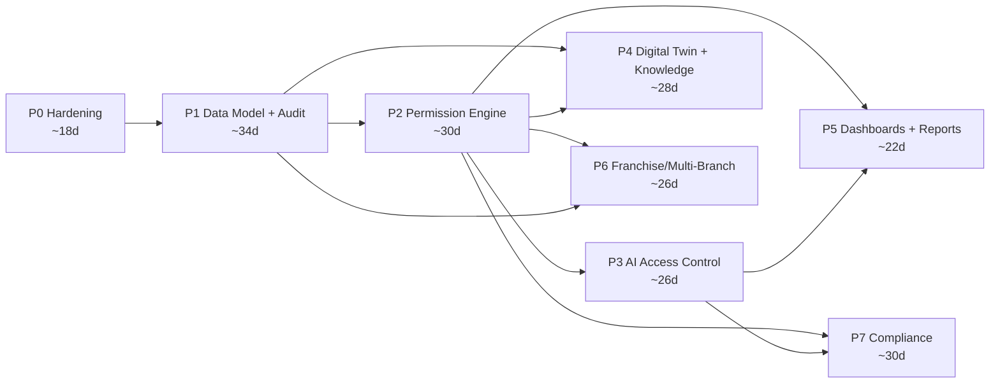
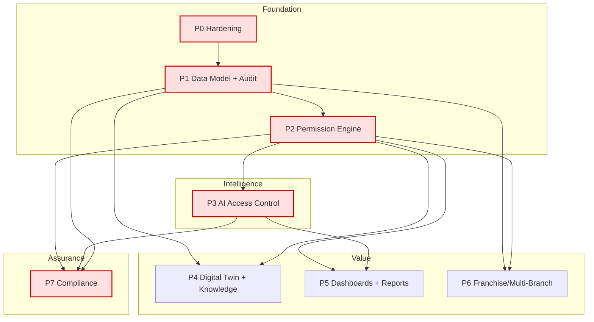
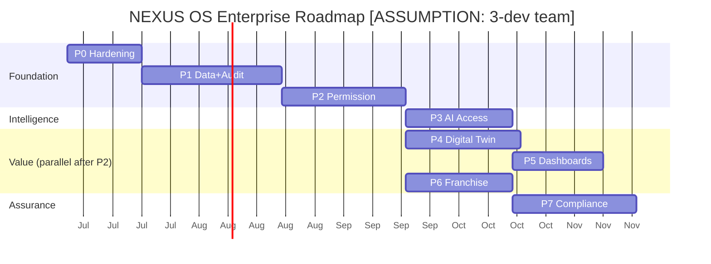

# 26 — Development Roadmap (แผนพัฒนาแบบเป็นเฟส: จาก Current-State → Enterprise Target)

> **เอกสารนี้** คือ **roadmap เชิงวิศวกรรม (engineering roadmap)** ที่นำ **NEXUS OS** จากสถานะปัจจุบัน (~55 ตาราง, audit best-effort, RBAC แบบ static map, AI ส่ง prompt ดิบออก provider) ไปสู่ **enterprise target** ที่กำหนดไว้ในเอกสาร 02–19 สำหรับ **Saduak Suay Mai PCL** (เครือคลินิกความงาม + ทันตกรรม แฟรนไชส์)
>
> **หลักการเขียน roadmap นี้:** production-ready ไม่ใช่ demo/MVP — ทุก phase มี **entry criteria, exit criteria (Definition of Done), deliverables, tables/APIs ที่ลงจอด, dependencies, effort sizing, rollback**. ทุก deliverable ติดป้าย **`EXISTS` (เสร็จแล้ว / มีในโค้ดจริง)**, **`PARTIAL` (มีบางส่วน ต้องเสริม)**, หรือ **`NEW` (migration / เขียนใหม่)** โดยอ้างอิง ground truth จาก discovery inventory และไฟล์จริงใน `backend/src/`
>
> **ข้อมูลที่ไม่ทราบจริง** (headcount, sprint velocity, วันเริ่มจริง, งบประมาณ) ติดป้าย **[ASSUMPTION]** และตั้งค่าให้สมจริงสำหรับเครือคลินิกความงาม+ทันตกรรมแฟรนไชส์ในไทยขนาดกลาง

---

## สารบัญ

- [0. สรุปผู้บริหาร (Executive Summary)](#0-สรุปผู้บริหาร)
- [1. หลักการของ Roadmap (Roadmap Principles)](#1-หลักการของ-roadmap)
- [2. Current-State Baseline (ของที่ `EXISTS` แล้ว = นับเป็น done)](#2-current-state-baseline)
- [3. Target-State (ปลายทาง) & Gap Summary](#3-target-state--gap-summary)
- [4. ภาพรวมเฟส (Phase Overview Map)](#4-ภาพรวมเฟส)
- [5. Effort Sizing Convention](#5-effort-sizing-convention)
- [6. P0 — Production Hardening (ความปลอดภัยพื้นฐาน)](#6-p0--production-hardening)
- [7. P1 — Data Model + Audit Foundation](#7-p1--data-model--audit-foundation)
- [8. P2 — Permission Engine (RBAC + ABAC + Ownership)](#8-p2--permission-engine)
- [9. P3 — AI Access Control & Redaction](#9-p3--ai-access-control--redaction)
- [10. P4 — Digital Twin + Knowledge Vault](#10-p4--digital-twin--knowledge-vault)
- [11. P5 — Dashboards & Reports](#11-p5--dashboards--reports)
- [12. P6 — Franchise / Multi-Branch Scaling](#12-p6--franchise--multi-branch)
- [13. P7 — Compliance & Continuous Assurance](#13-p7--compliance--continuous-assurance)
- [14. Dependency Graph (Mermaid)](#14-dependency-graph)
- [15. Timeline (Gantt) & Critical Path](#15-timeline--critical-path)
- [16. Cross-Phase Concerns (Testing, Migration, Rollback, Observability)](#16-cross-phase-concerns)
- [17. Effort Roll-Up & Team Shape](#17-effort-roll-up--team-shape)
- [18. Risk Register](#18-risk-register)
- [19. Release & Cutover Strategy (Railway)](#19-release--cutover-strategy)
- [20. Master Deliverable Matrix (EXISTS / PARTIAL / NEW per Phase)](#20-master-deliverable-matrix)

---

## 0. สรุปผู้บริหาร

NEXUS OS วันนี้ทำงานได้ (มี ~55 ตาราง, RBAC 13 roles, AI router หลาย provider, payroll engine, HR phase 1–6) แต่ **ยังไม่ enterprise-grade** ใน 5 มิติที่ enterprise spec บังคับ:

1. **Audit** ไม่ append-only, ไม่มี before/after, ไม่มี hash-chain, write แบบ swallow error → **ไม่เชื่อถือได้ทาง forensic**
2. **Permission** เป็น static `MODULE_ACCESS` map + department-string compare → **ไม่มี policy engine, ไม่มี RLS, tenant isolation พึ่ง predicate มือ**
3. **AI** ส่ง prompt ดิบ + full org RAG context ออก OpenAI/Anthropic/Google/Typhoon **โดยไม่ redact** → ความเสี่ยง PII/PHI leak (มี `patients` = ข้อมูลสุขภาพ)
4. **Soft-delete + versioning** = **ศูนย์** `deleted_at` ในโค้ด, delete เป็น hard CASCADE → ลบแล้วหาย กู้ไม่ได้, ไม่ตรงสเปก "every core table has deleted_at + version"
5. **Org tables** (`branches`, `org_units`, `departments`) มีเป็น data แต่ **ไม่ wire เข้า authz** → membership ยังเป็น free-text `users.department`

Roadmap แบ่งเป็น **8 เฟส (P0–P7)** เรียงตาม dependency ที่แท้จริง: **ความปลอดภัยพื้นฐานก่อน (P0)** → **รากฐาน data model + audit ที่ทุกอย่างพึ่ง (P1)** → **policy engine (P2)** → **AI gating ที่พึ่ง P2 (P3)** → ฟีเจอร์ที่สร้างมูลค่า (P4–P6) → **compliance ปิดท้าย (P7)**

**[ASSUMPTION] ประมาณการรวม:** ~**214 engineer-days** (≈ **9–11 เดือนปฏิทิน** ด้วยทีม 3 คน, หรือ ~5–6 เดือนด้วยทีม 5 คนเมื่อ phase ขนานกันได้) ดู [§17](#17-effort-roll-up--team-shape)

---

## 1. หลักการของ Roadmap

| # | หลักการ | ความหมายเชิงปฏิบัติ |
|---|---|---|
| R1 | **Security-first ordering** | P0 (hardening) มาก่อนทุกฟีเจอร์ ห้ามสร้าง surface ใหม่บนรากที่รั่ว |
| R2 | **Foundation before features** | data model (P1) + permission engine (P2) ต้องเสร็จก่อน P3–P6 เพราะทุก feature เรียกใช้ |
| R3 | **Backend-enforced เท่านั้น** | ทุก gate (RBAC/ABAC/ownership/AI) บังคับใน backend; frontend = UX hint เท่านั้น |
| R4 | **Migrations เป็น append-only versioned** | ต่อยอด `migrations.ts` (ปัจจุบัน v1–v10) ทุก migration ใหม่ = version ใหม่, idempotent, มี `down`/rollback note |
| R5 | **Expand → Backfill → Contract** | เปลี่ยน schema แบบไม่ down: เพิ่มคอลัมน์/ตารางใหม่ก่อน → backfill → ค่อยตัดของเก่า (เช่น `audit_log` → `audit_logs`) |
| R6 | **Dual-write ระหว่าง cutover** | ช่วงเปลี่ยน audit/permission เขียนทั้งของเก่า+ใหม่จน confidence ครบ แล้วค่อยตัด |
| R7 | **ทุก phase มี Definition of Done ที่วัดได้** | exit criteria เป็น checklist รันได้ (test pass, RLS เปิด, audit immutable พิสูจน์ด้วย test) |
| R8 | **No-invent rule** | ตัวเลข KPI/headcount/SLA จริงให้ business เป็นผู้ยืนยัน; ใน roadmap = [ASSUMPTION] |

---

## 2. Current-State Baseline

> นี่คือ "**สิ่งที่นับเป็น done แล้ว**" — งานที่มีในโค้ดจริง roadmap จะ **ไม่ทำซ้ำ** เพียงต่อยอด/แข็งแรงขึ้น

### 2.1 สิ่งที่ `EXISTS` (ทำงานได้ในโปรดักชัน)

| โดเมน | สถานะ | หลักฐาน (ไฟล์) |
|---|---|---|
| Dual-target DB (PG/SQLite) + `queryAll/queryOne/run` | ✅ EXISTS | `backend/src/lib/db.ts`, `db-sqlite.ts` |
| Versioned migration runner (v1–v10, `schema_migrations`) | ✅ EXISTS | `backend/src/lib/migrations.ts`, `nexus-ops-schema.ts` |
| ~55 ตาราง (core + HR phase 1–6 + ops + entity) | ✅ EXISTS | `nexus-*-schema.ts` |
| RBAC 13 roles + ~45 module map + route gating | ✅ EXISTS | `backend/src/lib/rbac.ts`, `middleware/rbac.ts` |
| `permission_groups` / `user_permission_groups` (DB layer) | ✅ EXISTS | `nexus-hr-schema.ts`, `lib/user-permissions.ts` |
| JWT auth + impersonation | ✅ EXISTS | `backend/src/middleware/auth.ts` |
| Audit table (เดี่ยว, best-effort) | ⚠️ PARTIAL | `nexus-schema.ts` `audit_log`, `lib/audit.ts` |
| AI router หลาย provider + fallback + decision rights | ⚠️ PARTIAL | `lib/ai-router.ts`, `ai-providers.ts` |
| `ai_logs` (metering ปลอม) | ⚠️ PARTIAL | `db.ts` core |
| Tier field-masking (salary T2/T3) | ⚠️ PARTIAL | `lib/encryption.ts` |
| HR/Payroll engine (period, run, payslip, salary_history) | ✅ EXISTS | `nexus-hr-schema.ts`, `lib/payroll-engine.ts` |
| Leave/OT workflow (phase 5–6, approval steps) | ✅ EXISTS | `nexus-hr-phase5/6-schema.ts`, `hr-leave-workflow.ts` |
| Org data: `departments`, `org_units` (3-level), `branches` (v8) | ⚠️ PARTIAL (data only, ไม่ wire authz) | `nexus-extended-schema.ts`, `hr-init.ts`, `migrations.ts` |
| Background workers (job queue, daily backup, SLA escalation) | ✅ EXISTS | `lib/job-queue.ts`, `backup.ts`, `sla-escalation.ts` |
| Security middleware (helmet, CORS allow-list, rate-limit in-mem) | ⚠️ PARTIAL | `backend/src/index.ts` |
| Railway deploy (2 services, Dockerfile, healthcheck) | ✅ EXISTS | `backend/railway.json`, `nexasos/railway.json` |

### 2.2 สิ่งที่ขาดทั้งหมด (`NEW` — roadmap ต้องสร้าง)

- `deleted_at`/soft-delete **ทุกตาราง** (วันนี้ = 0 คอลัมน์ในโค้ด), `version` optimistic-lock, full base-column set (`created_by/updated_by/deleted_by/is_active/security_level`)
- `audit_logs` (พหูพจน์) append-only + hash-chain; `ai_query_logs`; `login_logs`; `file_access_logs`; `permission_change_logs`; `consent_logs`
- Central **policy engine** (RBAC + ABAC + ownership) + **PostgreSQL RLS**
- AI redaction pipeline (PII/PHI mask ก่อนส่ง provider) + per-table/field AI policy + output filter
- `sub_departments` / `teams` เป็น first-class + FK membership (เลิก free-text `users.department`)
- Digital Twin (skill wallet, capacity, evaluation) เชิง enterprise; Knowledge Vault แบบ secured
- Dashboards/Reports เชิง role-scoped; Franchise multi-branch scoping ใน authz; Compliance (PDPA, retention jobs, DSR)

---

## 3. Target-State & Gap Summary

ปลายทางถูกนิยามไว้แล้วในเอกสารพี่น้อง — roadmap นี้คือ **"แผนเดินไปให้ถึง"**:

| เอกสารเป้าหมาย | สิ่งที่นิยาม | Phase ที่ทำให้เป็นจริง |
|---|---|---|
| `02-organization-tree.md` | Company→Dept→Sub-Dept→Team→Position→Employee | **P1** (tables) + **P2** (wire authz) |
| `04-position-structure.md`, `05-responsibility-matrix.md` | 13 roles ↔ position ↔ RACI | **P1**, **P2** |
| `06-workflow-matrix.md` | approval/SLA workflows | **P4** (ต่อยอด leave/OT ที่ EXISTS) |
| `07-kpi-matrix.md` | KPI ต่อ role/branch | **P4**, **P5** |
| `08-knowledge-matrix.md` | Knowledge Vault | **P4** |
| `09-data-ownership-matrix.md` | owner_id / data_ownership | **P2** |
| `10-security-matrix.md` | 4 security levels (BASIC/MEDIUM/HARD/RESTRICTED) | **P1** (column) + **P2** (enforce) |
| `11-permission-matrix.md`, `19-permission-logic.md` | RBAC+ABAC+ownership engine | **P2** |
| `12-ai-access-matrix.md` | AI per-data access + redaction | **P3** |
| `13-employee-digital-twin.md`, `14-…collection-form.md` | Digital Twin | **P4** |
| `16-er-diagram.md` | full ER (base columns ทุกตาราง) | **P1** |
| `17-audit-log-design.md` | `audit_logs` + `ai_query_logs` append-only | **P1** (audit) + **P3** (ai_query) |
| `18-api-specification.md` | API contract (envelope, versioning, idempotency) | **P0** (envelope/version) + ทุก phase |

**Gap หลัก 7 ข้อ** (จาก discovery §7) แมปกับ phase:

| Gap | Phase เจ้าภาพ |
|---|---|
| G1 Append-only audit | **P1** |
| G2 ABAC/data_ownership/RLS/policy engine | **P2** |
| G3 Missing log tables (login/file/permission/consent/ai_query) | **P1** (login/file/permission) + **P3** (ai_query) + **P7** (consent/DSR) |
| G4 AI redaction + real metering | **P3** |
| G5 Soft-delete + versioning ทุกตาราง | **P1** |
| G6 Org tables ไม่ wire authz / ไม่มี sub-dept/team | **P1** (tables) + **P2** (wire) + **P6** (branch scope) |
| G7 Rate-limiter in-mem, no CSRF/MFA/token-revoke, weak ENCRYPTION_KEY fallback | **P0** |

---

## 4. ภาพรวมเฟส

| Phase | ชื่อ | จุดประสงค์หลัก | Effort [ASSUMPTION] | ขึ้นกับ |
|---|---|---|---|---|
| **P0** | Production Hardening | ปิดช่องโหว่ security พื้นฐานก่อนต่อยอด | ~18 d | — |
| **P1** | Data Model + Audit Foundation | base columns, soft-delete, version, audit_logs append-only, org tables | ~34 d | P0 |
| **P2** | Permission Engine | policy engine RBAC+ABAC+ownership + RLS + wire org | ~30 d | P1 |
| **P3** | AI Access Control & Redaction | AI gating, redaction, ai_query_logs, real metering | ~26 d | P2 (+P1) |
| **P4** | Digital Twin + Knowledge Vault | skill wallet, capacity, evaluation, knowledge secured | ~28 d | P1, P2 |
| **P5** | Dashboards & Reports | role-scoped dashboards + report builder + export audit | ~22 d | P2, P3 |
| **P6** | Franchise / Multi-Branch | branch scoping ใน authz, franchise audit, cross-branch rollup | ~26 d | P1, P2 |
| **P7** | Compliance & Assurance | PDPA, retention, DSR, consent, SoD, continuous audit review | ~30 d | P2, P3 |

---

## 5. Effort Sizing Convention

> หน่วย = **engineer-day (1 senior backend dev เต็มวัน)** [ASSUMPTION] ครอบ implement + unit/integration test + migration + code review + doc-of-record อัปเดต **ไม่รวม** PM/QA exploratory/UAT (เผื่อ buffer 20% ใน [§17](#17-effort-roll-up--team-shape))

| T-shirt | engineer-days | ความหมาย |
|---|---|---|
| **XS** | 0.5–1 | config/flag เล็ก, เพิ่ม 1 คอลัมน์ |
| **S** | 2–3 | 1 migration + helper + test |
| **M** | 4–6 | 1 table + API + middleware + test |
| **L** | 7–10 | subsystem (เช่น policy engine core) |
| **XL** | 11–18 | cross-cutting หลายตาราง+backfill+cutover |

---

## 6. P0 — Production Hardening

> **เป้าหมาย:** ปิด **G7** + ช่อง security ที่ทำให้ "ต่อยอดไม่ได้อย่างปลอดภัย" ก่อน ทุกอย่างใน P0 เป็น **prerequisite ของทั้ง roadmap** — ห้ามสร้าง audit/AI gating บนระบบที่ token เพิกถอนไม่ได้และ secret อ่อน

**Entry:** main เขียวบน Railway, baseline tests ผ่าน
**Exit (Definition of Done):**
- [ ] `JWT_SECRET` + `ENCRYPTION_KEY` มาจาก secret จริง, **ลบ fallback hardcoded/JWT-derived** ใน `encryption.ts` (boot fail-fast ถ้าไม่ตั้งใน prod)
- [ ] Rate-limit เป็น **distributed** (กันการ scale แนวนอน defeat) — ดู M3
- [ ] Token **revocation + rotation** ใช้งานได้ (logout = เพิกถอนจริง)
- [ ] **CSRF** ป้องกัน mutating endpoints; login **lockout** หลัง N ครั้ง
- [ ] **`request_id`** ฉีดทุก request (prereq ของ audit/ai linkage ใน P1/P3)
- [ ] API **response envelope + `/api/v1` prefix** (จาก doc 18 §4) ลงจอด
- [ ] CI security gate: `npm audit`/secret-scan ใน pipeline

| M | Milestone / Deliverable | สถานะฐาน | Effort | หมายเหตุ wiring |
|---|---|---|---|---|
| P0-M1 | **Secrets hardening** — ลบ fallback chain `ENCRYPTION_KEY→JWT_SECRET→dev` ใน `encryption.ts`; fail-fast boot | PARTIAL→NEW | S | `index.ts` boot guard |
| P0-M2 | **`request_id` middleware** (UUID ต่อ request, ลง response header + `req.context`) | NEW | S | ใส่ก่อน `requestMetricsMiddleware` |
| P0-M3 | **Distributed rate-limit** — ย้าย in-mem bucket → Postgres token-bucket / Redis [ASSUMPTION: Railway Redis add-on] | PARTIAL→NEW | M | แทน `rateLimitMiddleware` ใน `index.ts` |
| P0-M4 | **Token revocation list** (`revoked_tokens` ตาราง + เช็คใน `authMiddleware`) + refresh-token rotation | NEW | M | `middleware/auth.ts` |
| P0-M5 | **Login lockout + failed-login counter** (ต่อเข้า `login_logs` ใน P1) | NEW | S | signin controller |
| P0-M6 | **CSRF protection** (double-submit token สำหรับ cookie-based; header guard สำหรับ Bearer) | NEW | S | global middleware |
| P0-M7 | **Response envelope + `/api/v1` versioning** (doc 18 §4) — `{ ok, data, error, request_id, meta }` | NEW | M | wrapper + route remount |
| P0-M8 | **CI security gate** (secret-scan, `npm audit --production`, SAST baseline) | NEW | S | GitHub Actions / pre-`railway up` |
| P0-M9 | **PG pool TLS** — แก้ `rejectUnauthorized:false` → ใช้ CA จริงของ Railway | PARTIAL→NEW | XS | `db.ts` pool config |

**Phase effort: ~18 d.** **Rollback:** ทุก item เป็น additive/flagged; envelope+versioning เปิดด้วย feature flag, เก่ายัง mount คู่ขนานช่วง grace period

> **[ASSUMPTION] MFA** — ตั้งเป็น P0-stretch (optional ในรอบแรก) เพราะต้องเลือก provider (TOTP/LINE OTP) ผูกกับ business decision; ถ้า business ยืนยันเลื่อนเป็น P7

---

## 7. P1 — Data Model + Audit Foundation

> **เป้าหมาย:** สร้าง **รากฐานข้อมูลที่ทุก phase พึ่ง** — base columns ครบทุกตาราง, soft-delete, optimistic version, 4-level `security_level`, org hierarchy เป็น first-class, และ **audit append-only + hash-chain** (ปิด **G1, G3-partial, G5, G6-tables**) นี่คือ phase ที่ **หนักและเสี่ยงที่สุด** (touch ~55 ตาราง) จึงใช้ **Expand→Backfill→Contract**

**Entry:** P0 done (`request_id` พร้อมสำหรับ audit)
**Exit (Definition of Done):**
- [ ] ทุก **core table** มี `id, company_id, created_at, updated_at, deleted_at, created_by, updated_by, deleted_by, is_active, version, security_level` (สเปก global rule)
- [ ] **ไม่มี hard delete** ในโค้ด path หลัก — แทนด้วย soft-delete; FK `ON DELETE CASCADE` ถูกทบทวน (เปลี่ยนเป็น RESTRICT/soft ตามนิยาม)
- [ ] **Optimistic lock** บังคับบน mutable entity (`version` + `WHERE version=$expected`)
- [ ] `audit_logs` (พหูพจน์) ตาม `17-audit-log-design.md`: before/after JSON, changed_fields, actor identity, ip/ua/request_id/session_id, result, **append-only (REVOKE UPDATE/DELETE + trigger)**, **hash-chain `prev_hash→row_hash`**, retention/partition
- [ ] `login_logs`, `file_access_logs`, `permission_change_logs` ลงจอด + wire จุดเกิดเหตุ
- [ ] Org tables: `sub_departments`, `teams` เป็น first-class; `org_units`/`departments`/`branches` normalize; **membership FK** (`employee.position_id`/`team_id`) แทน free-text `users.department` (เก็บ string ไว้ shadow ช่วง cutover)
- [ ] Audit immutability **พิสูจน์ด้วย test** (UPDATE/DELETE ต้อง raise; hash-chain verify ผ่าน)

| M | Milestone / Deliverable | สถานะฐาน | Effort | Tables/APIs |
|---|---|---|---|---|
| P1-M1 | **Base-column standard pack** (migration เพิ่มคอลัมน์ที่ขาดทุกตารางหลัก) | NEW | XL | ทุก core table; `migrations.ts` v11 |
| P1-M2 | **Soft-delete framework** — helper `softDelete()/restore()` + แก้ query layer ให้ default `WHERE deleted_at IS NULL`; ทบทวน CASCADE | NEW | L | `db.ts` query helpers |
| P1-M3 | **Optimistic versioning** — `version` bump + conflict 409 ใน `run()` mutate path | NEW | M | `db.ts`, controllers |
| P1-M4 | **`security_level` enum** (BASIC/MEDIUM/HARD/RESTRICTED) + default rule (Medical/Dental/Patient, Salary/Payroll/Contract/Tax, HR-investigation, AI-eval, Exec-notes = RESTRICTED) | NEW | M | CHECK constraint ทุกตาราง |
| P1-M5 | **`audit_logs` table + append-only + hash-chain** (doc 17 §3,§5,§6) | NEW | XL | `audit_logs`; new schema file |
| P1-M6 | **`writeAudit()` v2** — structured before/after, fail-loud option, dual-write `audit_log`+`audit_logs` ช่วง cutover | PARTIAL→NEW | M | `lib/audit.ts` |
| P1-M7 | **Audit wiring** — เดินสายทุก controller mutate/read-sensitive ให้เขียน audit (doc 18 §2 lifecycle) | NEW | L | ทุก controller |
| P1-M8 | **`login_logs`** (success/fail/lockout/logout, ip/ua) + wire signin/out | NEW | S | `login_logs` |
| P1-M9 | **`file_access_logs`** (view/download/upload/export ของ `user_files`) | NEW | S | `file_access_logs`; `file-storage.ts` |
| P1-M10 | **`permission_change_logs`** (role/group/grant changes) | NEW | S | wire permission controllers |
| P1-M11 | **Org normalization** — `sub_departments`, `teams` + FK chain Company→…→Position; backfill จาก `org_units`/`DEPARTMENT_DEFINITIONS` | PARTIAL→NEW | L | `sub_departments`, `teams` |
| P1-M12 | **Retention + partition policy** (audit monthly partition + retention job) | NEW | M | partition + `job_queue` task |
| P1-M13 | **Audit immutability test suite** (UPDATE/DELETE raise; chain verify) | NEW | S | tests |

**Phase effort: ~34 d (critical path).**
**Cutover (audit):** dual-write → shadow-read compare → flip read → ตัด `audit_log` (เก่า) เมื่อ N วัน clean
**Rollback:** migration v11+ มี note; soft-delete framework เปิดด้วย flag (`SOFT_DELETE_ENFORCE`); ถ้าพบ regression ปิด flag กลับ hard path ชั่วคราว (audit ยังเขียนคู่)

> **ความเสี่ยงสูงสุด:** P1-M1/M7 touch ทุกตาราง/ทุก controller — แตกเป็น sub-PR ต่อ schema-file (`nexus-hr-*`, `nexus-ops-*`, …) อย่ารวมเป็น migration เดียว

---

## 8. P2 — Permission Engine (RBAC + ABAC + Ownership)

> **เป้าหมาย:** แทน static map + department-string compare ด้วย **central policy engine** + **PostgreSQL RLS** + **data_ownership model**, wire org hierarchy (จาก P1) เข้า authz (ปิด **G2, G6-wire**) deny-by-default, backend-only ตาม `19-permission-logic.md`

**Entry:** P1 done (security_level + org FK + audit พร้อมบันทึก permission decision)
**Exit (Definition of Done):**
- [ ] **Policy engine** เดียว `authorize(actor, action, resource, context) → ALLOW/DENY+reason` เรียกจากทุก API (ไม่ scatter)
- [ ] **ABAC** ประเมิน attribute: department/sub-dept/team/position/branch/security_level/ownership
- [ ] **Data-ownership** — `owner_id`/`data_ownership` (doc 09) บังคับ "เจ้าของ + chain-of-command เท่านั้น" สำหรับ HARD/RESTRICTED
- [ ] **PostgreSQL RLS** เปิดบนตาราง tenant-scoped (`company_id` + branch) — กัน cross-tenant leak ระดับ DB (ไม่พึ่ง predicate มือ)
- [ ] **4 security levels** enforce: BASIC(ทุกคน)/MEDIUM(แผนก)/HARD(owner/manager/HR)/RESTRICTED(direct grant)
- [ ] **RESTRICTED-by-default** สำหรับ Medical/Dental/Patient, Salary/Payroll/Contract/Tax, HR-investigation, AI-eval, Exec-notes
- [ ] ทุก deny เขียน `audit_logs` (`blocked_access`/`failed_access`) พร้อม reason
- [ ] **Permission decision test matrix** (role × resource × security_level) ผ่านครบ

| M | Milestone / Deliverable | สถานะฐาน | Effort | Wiring |
|---|---|---|---|---|
| P2-M1 | **Policy engine core** `authorize()` (RBAC∧ABAC∧ownership, deny-by-default, structured reason) | NEW | L | `lib/policy/` ใหม่; ใช้ `rbac.ts` เป็น input |
| P2-M2 | **ABAC attribute resolver** (ดึง dept/sub-dept/team/position/branch/clearance ของ actor จาก org FK) | PARTIAL→NEW | M | แทน `departmentScope()` ad-hoc |
| P2-M3 | **`data_ownership` model** (`owner_id`, owner_type, grant table `resource_grants` สำหรับ RESTRICTED direct-grant) | NEW | M | doc 09 |
| P2-M4 | **Security-level enforcement** map level→required clearance/relationship | NEW | M | ผูก P1-M4 |
| P2-M5 | **PostgreSQL RLS** — `ENABLE ROW LEVEL SECURITY` + policies ต่อตาราง tenant/branch; set `app.current_company/branch/user` ต่อ connection | NEW | L | `db.ts` session GUC |
| P2-M6 | **`requireModule`/`requireRole` → delegate policy engine** (เก็บ signature เดิม, เปลี่ยนไส้ใน) | PARTIAL→NEW | M | `middleware/rbac.ts` |
| P2-M7 | **Wire org membership** — authz อ่าน position/team/branch FK (เลิกพึ่ง `users.department` string) | PARTIAL→NEW | M | ทุก scope check |
| P2-M8 | **Permission admin API** (grant/revoke + ทุกครั้งเขียน `permission_change_logs`) | PARTIAL→NEW | M | doc 11/19 |
| P2-M9 | **Decision test matrix + RLS leak tests** (cross-tenant/cross-branch ต้อง 0 rows) | NEW | M | tests |

**Phase effort: ~30 d.**
**Cutover:** policy engine รัน **shadow mode** ก่อน (log จะ allow/deny อะไร เทียบ behavior เดิม) → เปิด enforce ทีละ module → RLS เปิดทีละตาราง (เริ่มตาราง sensitive: `patients`, payroll)
**Rollback:** shadow→enforce ผ่าน flag ต่อ module; RLS เปิด/ปิดต่อตารางได้ทันที

---

## 9. P3 — AI Access Control & Redaction

> **เป้าหมาย:** ทำให้ **AI ไม่เคยเห็น/ไม่เคยเปิดเผยข้อมูลที่ user เห็นไม่ได้** (ปิด **G4, G3-ai_query**) flow ตามสเปก: query → identify user → policy check (ใช้ P2 engine) → filter allowed data → ส่งเฉพาะที่อนุญาตเข้า model → response → redaction check → audit AI never reads DB directly.

**Entry:** P2 done (ต้องมี policy engine เพราะ AI filter = เรียก `authorize()` เดียวกัน)
**Exit (Definition of Done):**
- [ ] **AI ไม่อ่าน DB ตรง** — context ทุกชิ้นผ่าน policy filter (ใช้ P2-M1) ก่อนเข้า prompt
- [ ] **Redaction pipeline** mask PII/PHI (ชื่อคนไข้, HN, เลขบัตร, salary, contract) **ก่อน** ส่ง provider (วันนี้ส่งดิบ)
- [ ] **`ai_query_logs`** (doc 17 §4): prompt, response, provider, model, tokens, latency, decision(auto/suggest/human), grounded flag, redaction status, linked `request_id`
- [ ] **Real metering** แทน `tokens=len/4`, `cost=0.5` ปลอม
- [ ] **Output filter** — สแกน response กันหลุดข้อมูลเกินสิทธิ (ตรง principle "AI must never reveal data the user cannot see")
- [ ] **Per-table/field AI policy** + consent gate (link P7 consent)
- [ ] Test: prompt ที่ขอข้อมูล RESTRICTED จาก user ที่ไม่มีสิทธิ → AI ปฏิเสธ + audit `blocked_access`

| M | Milestone / Deliverable | สถานะฐาน | Effort | Wiring |
|---|---|---|---|---|
| P3-M1 | **AI authorization gate** — `routeAI()` เรียก P2 `authorize()` ต่อ data ที่จะ inject | PARTIAL→NEW | M | `lib/ai-router.ts`, `rag-context.ts` |
| P3-M2 | **Context filter** — `buildOrgContext`/`buildRagContext` คืนเฉพาะ row/field ที่ actor เห็นได้ | PARTIAL→NEW | L | `ai-context.ts`, `rag-context.ts` |
| P3-M3 | **Redaction pipeline** (PII/PHI detect+mask ก่อน provider call) — รวม `sanitize.ts`+`encryption.ts` masking เข้า AI path | PARTIAL→NEW | L | `ai-providers.ts` pre-send hook |
| P3-M4 | **`ai_query_logs` table** + writer (prompt/response/provider/model/tokens/latency/decision/grounded/redaction) | NEW | M | doc 17 §4 |
| P3-M5 | **Real token/cost metering** ต่อ provider (จาก response usage) | PARTIAL→NEW | S | `ai-providers.ts` |
| P3-M6 | **Output redaction filter** (post-response leak scan) | NEW | M | `ai-router.ts` |
| P3-M7 | **Per-table/field AI access policy** registry (อะไร AI อ้างได้/ต้อง mask) | NEW | M | policy data |
| P3-M8 | **AI decision-rights surfacing** (auto/suggest/human ต่อ task — ต่อยอด `resolveDecisionRights`) + human-in-loop UI hook | PARTIAL→NEW | S | `ai-router.ts`, `companies.settings` |
| P3-M9 | **AI access test suite** (RESTRICTED leak = 0; redaction coverage; metering accuracy) | NEW | M | tests |

**Phase effort: ~26 d.**
**Cutover:** เปิด redaction+gate ใน **dry-run** (log สิ่งที่ "จะ" redact/block) ก่อน enforce; ตัด raw-context path เมื่อ coverage ครบ
**Rollback:** flag `AI_ENFORCE_REDACTION`/`AI_ENFORCE_AUTHZ`; ปิดได้ทันทีโดยยังเก็บ `ai_query_logs`

---

## 10. P4 — Digital Twin + Knowledge Vault

> **เป้าหมาย:** ทำให้ข้อมูลพนักงาน "มีชีวิต" — skill wallet, capacity, evaluation (doc 13/14) + **Knowledge Vault** ที่ secured ด้วย P2 engine (doc 08) ต่อยอดของที่ `EXISTS` (`skill_scores`, `skill_evidence`, `user_capacity`, `knowledge_items`, `employee_profiles`)

**Entry:** P1 (org/base cols) + P2 (security ของ HARD/RESTRICTED profile data)
**Exit (Definition of Done):**
- [ ] Employee Digital Twin ครบ field ตาม `13`/`14` (profile, skill wallet, capacity, evaluation, evidence) — ทุก field มี `security_level` ถูกต้อง (AI-eval = RESTRICTED)
- [ ] Skill scoring + evidence + monthly review (มี worker `monthly skill review` แล้ว) wire เข้า twin
- [ ] **Knowledge Vault** — `knowledge_items` secured: read ผ่าน policy engine, audit ทุก view/download, AI อ้างได้เฉพาะ allowed (ผูก P3)
- [ ] Onboarding/data-collection form (doc 14) เก็บข้อมูลเข้า twin โดยมี consent (link P7)

| M | Milestone / Deliverable | สถานะฐาน | Effort | Tables |
|---|---|---|---|---|
| P4-M1 | **Digital Twin schema completion** (เติม field doc 13/14 ลง `employee_profiles` + ตารางลูก) | PARTIAL→NEW | L | `employee_profiles`, ใหม่ |
| P4-M2 | **Skill wallet** (ต่อยอด `skill_scores`/`skill_evidence`/`skill-wallet.ts`) + scoring API | PARTIAL→NEW | M | EXISTS+extend |
| P4-M3 | **Capacity & workload** (ต่อ `user_capacity`/`task-matching.ts`) เข้า twin | PARTIAL→NEW | M | EXISTS+extend |
| P4-M4 | **Evaluation module** (AI-eval = RESTRICTED, owner/HR เท่านั้น; audit ทุกครั้ง) | NEW | M | ใหม่ |
| P4-M5 | **Knowledge Vault secured** — `knowledge_items` + access via policy + file_access_logs + AI-citation gate | PARTIAL→NEW | L | EXISTS+secure |
| P4-M6 | **Data-collection form + onboarding wire** (doc 14) + consent capture | PARTIAL→NEW | M | `onboarding_state` |
| P4-M7 | **Twin test suite** (security_level correctness, RESTRICTED eval ปิด) | NEW | S | tests |

**Phase effort: ~28 d.** ขนานกับ P5/P6 ได้หลัง P2 (ดู [§15](#15-timeline--critical-path))
**Rollback:** ฟีเจอร์ใหม่หลัง P1/P2 — additive ทั้งหมด, ปิดด้วย module flag

---

## 11. P5 — Dashboards & Reports

> **เป้าหมาย:** มอง KPI/operation ได้แบบ **role-scoped** (เห็นเฉพาะที่สิทธิอนุญาต ผ่าน P2) + report builder + **export = audited event** (ปิด gap export trail)

**Entry:** P2 (scoping) + P3 (AI-summarized insight ต้อง redacted)
**Exit (Definition of Done):**
- [ ] Dashboard ต่อ role/department/branch (doc 07 KPI) — query ทุกตัวผ่าน policy/RLS (ไม่มี dashboard ที่ bypass authz)
- [ ] Report builder (filter, aggregate) + **ทุก export/download เขียน audit** (`export` action) + apply field-masking ตาม clearance
- [ ] KPI rollup ต่อยอด `kpi_entries`/`daily_ai_tasks` (EXISTS) — branch-aware (ผูก P6)
- [ ] AI-generated insight ใน dashboard ผ่าน redaction (P3)

| M | Deliverable | สถานะฐาน | Effort |
|---|---|---|---|
| P5-M1 | **KPI dashboard API (role-scoped)** ต่อยอด `kpi_entries` | PARTIAL→NEW | M |
| P5-M2 | **Report builder + scheduled reports** (ใช้ `job_queue`) | NEW | L |
| P5-M3 | **Export-with-audit + field-mask on export** | NEW | M |
| P5-M4 | **Operational/SLA dashboard** (ต่อ `sla-escalation.ts`, work_logs) | PARTIAL→NEW | M |
| P5-M5 | **AI-insight panel** (redacted, grounded flag แสดง) | NEW | S |
| P5-M6 | Dashboard authz/export tests | NEW | S |

**Phase effort: ~22 d.**

---

## 12. P6 — Franchise / Multi-Branch

> **เป้าหมาย:** ทำให้ระบบรองรับ **หลายสาขา/แฟรนไชส์** จริง — wire `branches` (v8 EXISTS เป็น data) เข้า authz scoping, franchise audit, cross-branch rollup สำหรับ CEO/Franchise dept (ปิด **G6-branch**)

**Entry:** P1 (branch FK) + P2 (branch ใน ABAC + RLS branch policy)
**Exit (Definition of Done):**
- [ ] **Branch scoping ใน authz** — ผู้ใช้สาขา A เห็นเฉพาะข้อมูลสาขา A (ยกเว้น role ข้ามสาขา: CEO/Franchise/Finance-HQ) บังคับด้วย RLS branch policy
- [ ] **Franchise audit** (ต่อยอด `franchise_audits` EXISTS) — checklist/score/finding ต่อสาขา + audit trail
- [ ] **Cross-branch rollup** สำหรับ HQ roles (เคารพ masking)
- [ ] Branch onboarding/provisioning flow (เพิ่มสาขาใหม่ → seed positions/permissions)

| M | Deliverable | สถานะฐาน | Effort |
|---|---|---|---|
| P6-M1 | **Branch in ABAC + RLS branch policy** | PARTIAL→NEW | M |
| P6-M2 | **Cross-branch role grants** (CEO/Franchise/Finance-HQ เห็นข้ามสาขา) | NEW | M |
| P6-M3 | **Franchise audit module** (ต่อ `franchise_audits`) | PARTIAL→NEW | L |
| P6-M4 | **Branch provisioning** (เพิ่มสาขา → seed positions/permission/quota) | NEW | M |
| P6-M5 | **Cross-branch rollup reports** (ผูก P5) | NEW | M |
| P6-M6 | Branch isolation tests (สาขา A ↛ สาขา B = 0 rows) | NEW | S |

**Phase effort: ~26 d.**

---

## 13. P7 — Compliance & Continuous Assurance

> **เป้าหมาย:** ปิด compliance ของไทย/สากล — **PDPA** (ข้อมูลคนไข้ = sensitive personal data), retention enforcement, **DSR** (data subject request), consent logs, **SoD** (segregation of duties), continuous audit review (ปิด **G3-consent**)

**Entry:** P2 (policy) + P3 (AI/redaction) + P1 (audit/retention foundation)
**Exit (Definition of Done):**
- [ ] **`consent_logs`** + consent gate (เก็บ/ใช้ข้อมูลคนไข้/พนักงาน ต้องมี consent บันทึก)
- [ ] **PDPA DSR** — export/erase/rectify request flow (เคารพ soft-delete + audit + legal-hold)
- [ ] **Retention jobs** บังคับจริง (audit partition drop ตามนโยบาย, ข้อมูลหมดอายุ purge/anonymize)
- [ ] **Segregation of Duties** — กฎ conflict (เช่น คนสร้าง payroll ≠ คนอนุมัติ) บังคับใน policy engine
- [ ] **Continuous audit review** — รายงาน blocked_access/failed_access/permission-change ส่ง owner/HR; anomaly alert
- [ ] **Backup/restore drill** (มี `backup_records`/daily backup EXISTS) — ทดสอบ restore จริง + integrity (hash-chain verify)

| M | Deliverable | สถานะฐาน | Effort |
|---|---|---|---|
| P7-M1 | **`consent_logs` + consent gate** (PDPA) | NEW | M |
| P7-M2 | **DSR flow** (access/erase/rectify, legal-hold aware) | NEW | L |
| P7-M3 | **Retention enforcement jobs** (purge/anonymize/partition drop) | PARTIAL→NEW | M |
| P7-M4 | **SoD rules ใน policy engine** | NEW | M |
| P7-M5 | **Continuous audit-review reports + anomaly alerts** | NEW | M |
| P7-M6 | **Backup-restore + audit-integrity drill** (verify hash-chain) | PARTIAL→NEW | M |
| P7-M7 | **Compliance evidence pack** (control mapping → doc 10/17) | NEW | S |

**Phase effort: ~30 d.**

---

## 14. Dependency Graph

**Critical path** (สีแดง): **P0 → P1 → P2 → P3 → P7** = 18+34+30+26+30 = **138 d** ถ้าเดินเดี่ยว
**Parallelizable หลัง P2:** P4, P5, P6 รันขนานกับ P3/P7 ได้ (ทีมแยก) — ดู [§15](#15-timeline--critical-path)

---

## 15. Timeline & Critical Path

> **[ASSUMPTION]** ทีม **3 senior backend devs** (D1=foundation/security, D2=permission/AI, D3=features), เริ่ม 2026-07-01, ~21 working-day/เดือน, buffer 20%

| สถานการณ์ | ทีม | ระยะเวลาปฏิทิน [ASSUMPTION] |
|---|---|---|
| Sequential (1 dev) | 1 | ~214 d ≈ 12 เดือน |
| Balanced | 3 | ~9–11 เดือน (P4/P6 ขนาน P3; P5/P7 ขนานบางส่วน) |
| Aggressive | 5 | ~5–6 เดือน (foundation ยังเป็นคอขวด — P0→P1→P2 ขนานไม่ได้มาก) |

> **คอขวดที่แท้จริง = P0→P1→P2** (เดินขนานไม่ได้ เพราะ P2 พึ่ง security_level/org FK จาก P1, P1 พึ่ง request_id จาก P0) ลงทุนคนใน foundation คุ้มสุด

---

## 16. Cross-Phase Concerns

### 16.1 Migration discipline
- ทุก schema change = **migration version ใหม่** ต่อจาก `migrations.ts` v10 → v11, v12, … idempotent (`IF NOT EXISTS`), มี rollback note
- ตาราง sensitive (`patients`, payroll, `audit_logs`) migrate **แยก PR** + review 2 คน
- Expand→Backfill→Contract เสมอ (ไม่มี blocking ALTER บนตารางใหญ่ตอน peak)

### 16.2 Testing strategy (ต่อ phase)
- **Unit:** policy engine, redaction, audit writer
- **Integration:** ทุก API ผ่าน middleware stack จริง
- **Security regression:** cross-tenant/cross-branch leak = 0 rows; RESTRICTED leak = 0; audit immutability raise
- **Migration test:** apply v(n) บน snapshot prod-like + verify backfill

### 16.3 Observability
- `request_id` (P0) ร้อยทุก log/audit/ai_query (forensic replay)
- `request_metrics` (EXISTS) + เพิ่ม authz-decision metrics + AI redaction-coverage metric

### 16.4 Rollback ladder (ทั่วทุก phase)
1. **Feature flag off** (เร็วสุด — policy enforce, AI redaction, soft-delete enforce ล้วน flagged)
2. **Dual-write/shadow read** (audit, permission) → flip กลับ read เก่า
3. **Migration down note** (เฉพาะ schema additive ปลอดภัย; data-destructive ห้าม auto-rollback)

---

## 17. Effort Roll-Up & Team Shape

| Phase | Effort (d) | สะสม (d) |
|---|---|---|
| P0 | 18 | 18 |
| P1 | 34 | 52 |
| P2 | 30 | 82 |
| P3 | 26 | 108 |
| P4 | 28 | 136 |
| P5 | 22 | 158 |
| P6 | 26 | 184 |
| P7 | 30 | 214 |
| **รวม base** | **214** | |
| **+ buffer 20%** [ASSUMPTION] | **~257** | |

**[ASSUMPTION] Team shape:**
- **D1 — Foundation/Security/DBA:** P0, P1 (audit/schema), P7 (retention/backup)
- **D2 — Platform/Authz/AI:** P2 (policy/RLS), P3 (AI gating/redaction)
- **D3 — Product/Features:** P4 (twin/knowledge), P5 (dashboards), P6 (franchise)
- **Shared:** QA/security-review ทุก phase (gate ก่อน enforce flag เปิด), 1 PM/PO part-time

---

## 18. Risk Register

| # | Risk | Phase | ผลกระทบ | Likelihood | Mitigation |
|---|---|---|---|---|---|
| RK1 | P1 base-column migration touch ~55 ตาราง → downtime/lock | P1 | สูง | กลาง | Expand→Backfill→Contract, แตก PR ต่อ schema-file, รัน off-peak |
| RK2 | Audit cutover ทำ trail หาย/ซ้ำ | P1 | สูง | ต่ำ-กลาง | dual-write + shadow compare ก่อน flip; ไม่ตัดเก่าจน N วัน clean |
| RK3 | RLS เปิดผิด → app เห็น 0 rows ทั้งระบบ | P2 | สูง | กลาง | เปิดทีละตาราง, shadow mode, leak-test ก่อน enforce |
| RK4 | AI redaction ไม่ครบ → PHI/PII หลุดออก provider | P3 | สูงมาก (PDPA) | กลาง | dry-run log สิ่งที่จะ redact, coverage metric, output filter ชั้นสอง |
| RK5 | Rate-limit/Redis เป็น dependency ใหม่บน Railway | P0 | กลาง | ต่ำ | ถ้าไม่มี Redis ใช้ Postgres token-bucket (ไม่เพิ่ม service) |
| RK6 | Free-text `users.department` มี data สกปรก → backfill org FK ล้ม | P1 | กลาง | กลาง | reconcile report ก่อน backfill, เก็บ string เป็น shadow |
| RK7 | Scope creep ใน P4–P6 (digital twin โตไม่จบ) | P4–P6 | กลาง | สูง | freeze field set จาก doc 13/14, ส่วนเกิน = backlog |
| RK8 | Business ยังไม่ยืนยัน KPI/SLA/branch list จริง | P5/P6 | กลาง | สูง | mark [ASSUMPTION], สร้าง config-driven (เปลี่ยนได้โดยไม่ deploy) |
| RK9 | ENCRYPTION_KEY rotation ทำข้อมูล mask อ่านไม่ออก | P0 | สูง | ต่ำ | key-versioning ก่อน rotate; re-encrypt batch |

---

## 19. Release & Cutover Strategy (Railway)

> ตาม MEMORY: deploy = **`railway up` per service** (ไม่ใช่ GitHub auto-deploy) — 2 services: `nexus-api` (`backend/`), `nexus-web` (`nexasos/`)

**กฎ release ต่อ phase:**
1. **DB migration ก่อน code** — boot ของ `nexus-api` รัน `initSchema()`→`runMigrations()` อยู่แล้ว; migration ใหม่ idempotent ปลอดภัยเมื่อ deploy ใหม่
2. **Expand deploy** (เพิ่ม column/table) → ปล่อย → **backfill job** (ผ่าน `job_queue` EXISTS) → **code ใช้ของใหม่หลัง flag** → **contract deploy** (ตัดเก่า)
3. **Feature flag** เก็บใน `companies.settings` JSON (EXISTS pattern เช่น `ai_decision_rights`) — เปิด/ปิด enforce โดยไม่ redeploy
4. **Web ↔ API version**: ปล่อย API (backward-compatible) ก่อน Web เสมอ; `/api/v1` (P0) กัน breaking
5. **Healthcheck gate**: `/health` (api, 300s) / `/` (web) เขียวก่อนสลับ traffic
6. **Rollback**: `railway up` ตัวก่อนหน้า + flag off; migration additive ปลอดภัย, data-destructive ต้อง manual + backup-verified

**Production verification rule (จาก MEMORY):** ทดสอบบน **production build** จริง (`next dev` ปิด fatal render-loop) ก่อนถือว่า phase ผ่าน

---

## 20. Master Deliverable Matrix

> ภาพรวมสุดท้าย: ตาราง/API/feature → Phase → สถานะ (E=`EXISTS` done, P=`PARTIAL` extend, N=`NEW`)

| Deliverable | Type | Phase | สถานะฐาน |
|---|---|---|---|
| Secrets fail-fast / key-versioning | security | P0 | P→N |
| `request_id` middleware | infra | P0 | N |
| Distributed rate-limit | infra | P0 | P→N |
| `revoked_tokens` + refresh rotation | security | P0 | N |
| Login lockout | security | P0 | N |
| CSRF protection | security | P0 | N |
| Response envelope + `/api/v1` | api | P0 | N |
| CI security gate | infra | P0 | N |
| Base-column pack (all tables) | schema | P1 | N |
| Soft-delete framework | schema | P1 | N |
| Optimistic `version` lock | schema | P1 | N |
| `security_level` enum (4-level) | schema | P1 | N |
| `audit_logs` (append-only + hash-chain) | table | P1 | N |
| `writeAudit()` v2 (before/after) | lib | P1 | P→N |
| `login_logs` | table | P1 | N |
| `file_access_logs` | table | P1 | N |
| `permission_change_logs` | table | P1 | N |
| `sub_departments`, `teams` + org FK | table | P1 | P→N |
| Audit retention/partition | infra | P1 | N |
| Policy engine `authorize()` | lib | P2 | N |
| ABAC attribute resolver | lib | P2 | P→N |
| `data_ownership` + `resource_grants` | table | P2 | N |
| PostgreSQL RLS policies | schema | P2 | N |
| `requireRole/Module` → policy engine | middleware | P2 | P→N |
| Permission admin API + change-log wire | api | P2 | P→N |
| AI authorization gate | lib | P3 | P→N |
| AI context filter (allowed-only) | lib | P3 | P→N |
| AI redaction pipeline (PII/PHI) | lib | P3 | P→N |
| `ai_query_logs` | table | P3 | N |
| Real AI token/cost metering | lib | P3 | P→N |
| AI output leak filter | lib | P3 | N |
| Per-table/field AI policy | data | P3 | N |
| Digital Twin schema (doc 13/14) | table | P4 | P→N |
| Skill wallet / capacity / evaluation | module | P4 | P→N |
| Knowledge Vault secured | module | P4 | P→N |
| KPI dashboard (role-scoped) | api | P5 | P→N |
| Report builder + scheduled | module | P5 | N |
| Export-with-audit + mask | feature | P5 | N |
| Branch in ABAC + RLS | schema | P6 | P→N |
| Cross-branch role grants | feature | P6 | N |
| Franchise audit module | module | P6 | P→N |
| Branch provisioning | feature | P6 | N |
| `consent_logs` + gate (PDPA) | table | P7 | N |
| DSR flow (access/erase/rectify) | module | P7 | N |
| Retention enforcement jobs | infra | P7 | P→N |
| SoD rules in policy engine | lib | P7 | N |
| Continuous audit-review + anomaly | feature | P7 | N |
| Backup-restore + integrity drill | ops | P7 | P→N |

---

### ภาคผนวก — เอกสารอ้างอิงในชุดสถาปัตยกรรม

`02-organization-tree` · `04-position-structure` · `05-responsibility-matrix` · `06-workflow-matrix` · `07-kpi-matrix` · `08-knowledge-matrix` · `09-data-ownership-matrix` · `10-security-matrix` · `11-permission-matrix` · `12-ai-access-matrix` · `13-employee-digital-twin` · `14-employee-data-collection-form` · `16-er-diagram` · `17-audit-log-design` · `18-api-specification` · `19-permission-logic`

> **สถานะเอกสาร:** roadmap นี้เป็น **living document** — ตัวเลข effort/timeline เป็น [ASSUMPTION] ต้อง re-baseline ทุกสิ้น phase ด้วย velocity จริง; ตัวเลข business (KPI/SLA/branch/headcount/salary band) ต้องให้ฝ่ายธุรกิจยืนยันก่อนถือเป็น fact
