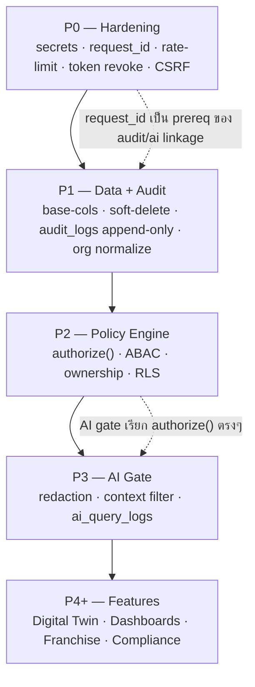

# 30 — Next Steps for Dev Team (แผนลงมือทำจริง: จาก Roadmap → โค้ดบน Railway)

> **เอกสารนี้** คือ **คู่มือลงมือทำ (developer execution guide)** ที่แปลง `26-development-roadmap.md` (P0–P7) ให้เป็น **งานย่อยที่จับต้องได้** — บอกชัดว่า **ไฟล์ไหน, ตารางอะไร (migration version เท่าไร), middleware ตัวไหนต้องเขียน, route ไหนต้อง refactor** โดยอ้างอิง **ground truth จากโค้ดจริงใน `backend/src/`** ของ NEXUS OS
>
> **กลุ่มเป้าหมาย:** ทีม dev (backend-heavy) ที่จะเริ่ม sprint แรกพรุ่งนี้ — อ่านจบแล้วต้อง "หยิบ ticket แรกขึ้นมาเขียนโค้ดได้เลย"
>
> **กฎเหล็ก (ตรงกับ global design rules):**
> - **Backend-enforced เท่านั้น** — ทุก gate (RBAC/ABAC/ownership/AI) อยู่ใน backend; frontend = UX hint
> - **Deny-by-default** — ทุก policy ถ้าไม่มี allow ชัดเจน = ปฏิเสธ
> - **Append-only audit** — ทุก action ลง `audit_logs` ใหม่ (immutable + hash-chain); ห้าม UPDATE/DELETE
> - **Expand → Backfill → Contract** — ไม่ down migration; เพิ่มของใหม่ → backfill → ตัดของเก่า
> - ทุกข้อที่ไม่ทราบจริง (headcount, sprint velocity, วันเริ่ม) ติดป้าย **[ASSUMPTION]**
>
> **สถานะป้ายกำกับ:** `EXISTS` (มีในโค้ดจริง) · `PARTIAL` (มีบางส่วน ต้องเสริม) · `NEW` (เขียนใหม่/migration)

---

## สารบัญ

- [0. หลักการลงมือ (Execution Principles)](#0-หลักการลงมือ)
- [1. ของที่มีอยู่แล้ว — อย่าเขียนซ้ำ](#1-ของที่มีอยู่แล้ว)
- [2. ลำดับงานหลัก (Master Execution Order)](#2-ลำดับงานหลัก)
- [3. งานพื้นฐานที่ "ของทุกอย่างพึ่ง" (4 building blocks)](#3-งานพื้นฐาน)
  - [3.1 `request_id` correlation middleware](#31-request_id)
  - [3.2 `requirePermission()` — policy engine middleware](#32-requirepermission)
  - [3.3 `writeAudit()` v2 — append-only + before/after + hash-chain](#33-writeaudit-v2)
  - [3.4 AI redaction + AI authorization gate](#34-ai-redaction)
- [4. Migrations ที่ต้องเขียน (v11 → v20)](#4-migrations-ที่ต้องเขียน)
- [5. Middleware ที่ต้องสร้าง/แก้](#5-middleware-ที่ต้องสร้าง)
- [6. Routes/Controllers ที่ต้อง refactor](#6-routes-ที่ต้อง-refactor)
- [7. ☑️ Checklist 2 สัปดาห์แรก (First-2-Weeks)](#7-checklist-2-สัปดาห์แรก)
- [8. นิยาม Done ต่อ ticket + วิธีทดสอบ](#8-definition-of-done)
- [9. Branch / PR / Deploy convention](#9-branch--pr--deploy)
- [10. ความเสี่ยงเฉพาะหน้า + วิธีกัน](#10-ความเสี่ยงเฉพาะหน้า)
- [11. Ticket Backlog (พร้อม assign)](#11-ticket-backlog)

---

## 0. หลักการลงมือ

| # | หลักการ | ความหมายเชิงปฏิบัติสำหรับ dev |
|---|---|---|
| E1 | **ทำตามลำดับ dependency** | P0 (hardening) → P1 (data+audit) → P2 (policy) → P3 (AI). ห้ามเริ่ม P3 ก่อน `authorize()` ของ P2 เสร็จ — AI gate เรียก `authorize()` ตรงๆ |
| E2 | **ต่อยอด ไม่ rewrite** | ใช้ของที่ `EXISTS`: `queryAll/queryOne/run` (`db.ts`), migration runner (`migrations.ts`), `rbac.ts` map, `requireRole/requireModule`. เปลี่ยน **ไส้ใน** ไม่เปลี่ยน signature |
| E3 | **Migration = append-only versioned** | migration ใหม่ทุกตัว = version ถัดไป (ปัจจุบันสูงสุด **v10**) ใน `MIGRATIONS[]`; idempotent (`IF NOT EXISTS`); มี rollback note |
| E4 | **Dual-write ช่วง cutover** | `audit_log` (เดิม) + `audit_logs` (ใหม่) เขียนคู่กันจน confidence ครบ แล้วค่อยตัด — ดู §3.3 |
| E5 | **Flag ทุกของใหม่ที่เปลี่ยนพฤติกรรม** | RLS, response envelope, AI redaction เปิดด้วย env flag (`FEATURE_*`) ให้ rollback = ปิด flag |
| E6 | **Test = ส่วนหนึ่งของ Done** | append-only พิสูจน์ด้วย test (UPDATE/DELETE ต้อง raise); RLS พิสูจน์ด้วย cross-tenant test (0 rows); ไม่มี test = ticket ยังไม่ปิด |
| E7 | **ห้าม invent ตัวเลขจริง** | KPI/headcount/salary band/SLA จริง = business ยืนยัน; ใน code/seed = `[ASSUMPTION]` หรือ config |

---

## 1. ของที่มีอยู่แล้ว — อย่าเขียนซ้ำ

> ก่อนเขียนโค้ดบรรทัดแรก ทุกคนต้องรู้ว่า **อะไรมีแล้ว** เพื่อไม่สร้างซ้ำ/แตก

| สิ่งที่มี | ไฟล์จริง | ใช้ยังไงต่อ |
|---|---|---|
| DB abstraction (PG + SQLite) `queryAll/queryOne/run/newId` | `backend/src/lib/db.ts`, `db-sqlite.ts` | **ทุก migration/feature ใหม่ผ่านชั้นนี้** — ห้ามเปิด pg pool เอง |
| Migration runner (v1–v10, `schema_migrations`) | `backend/src/lib/migrations.ts` | เพิ่ม object ใหม่ใน `MIGRATIONS[]` ตั้งแต่ **v11** |
| Schema modules (~55 tables) | `nexus-*-schema.ts` (10 ไฟล์) | สร้างไฟล์ใหม่ `nexus-audit-schema.ts`, `nexus-authz-schema.ts` ตามแพทเทิร์นเดิม |
| RBAC 13 roles + ~45 module map | `backend/src/lib/rbac.ts` | เป็น **input ของ policy engine** (P2) ไม่ทิ้ง |
| `requireRole()` / `requireModule()` | `backend/src/middleware/rbac.ts` | คงชื่อ เพิ่ม `requirePermission()` ข้างๆ แล้วค่อยให้สองตัวเดิม delegate |
| `permission_groups` / `user_permission_groups` + `userCanAccessModule()` | `nexus-hr-schema.ts`, `lib/user-permissions.ts` | เป็นชั้น DB ของ policy engine |
| JWT auth + impersonation | `backend/src/middleware/auth.ts` | เพิ่ม revocation list + `req.context.request_id` เข้าไป |
| `writeAudit()` (best-effort) | `backend/src/lib/audit.ts` | **อัปเกรดเป็น v2** (ไม่สร้างไฟล์ใหม่ — แก้ที่เดิม + dual-write) |
| AI router + fallback + decision rights | `lib/ai-router.ts`, `ai-providers.ts` | สอด redaction + `authorize()` gate + `ai_query_logs` writer |
| `sanitize.ts` (strip password_hash), `encryption.ts` (mask salary tier) | `backend/src/lib/` | **ย้ายเข้า AI path** (วันนี้ไม่ถูกเรียกใน AI) |
| Org data: `departments`, `org_units` (3-level), `branches` (v8) | `nexus-extended-schema.ts`, `hr-init.ts` | wire เข้า authz (P2) — เลิกพึ่ง `users.department` string |
| Background workers (job queue, backup, SLA) | `lib/job-queue.ts`, `backup.ts`, `sla-escalation.ts` | เพิ่ม task: retention purge, hash-chain verify, audit partition |
| Railway deploy (2 services, Dockerfile, healthcheck) | `backend/railway.json`, `nexasos/railway.json` | deploy ผ่าน `railway up` ต่อ service (ไม่ใช่ GitHub auto-deploy) |

---

## 2. ลำดับงานหลัก



**กฎเดียวที่ห้ามฝ่าฝืน:** `request_id` (P0) ต้องเสร็จก่อน `audit_logs` (P1) เพราะ audit/login/file/ai logs ทุกตารางผูกด้วย `request_id`; และ `authorize()` (P2) ต้องเสร็จก่อน AI gate (P3) เพราะ AI ใช้ตัวเดียวกันกรองข้อมูล

---

## 3. งานพื้นฐาน

> 4 ก้อนนี้คือ **"ของที่ทุกอย่างพึ่ง"** — เริ่มจาก 4 ตัวนี้ก่อนเสมอ ทำเสร็จแล้วงานที่เหลือ "เสียบเข้า" ได้

### 3.1 `request_id`

**สถานะ:** NEW · **Phase:** P0-M2 · **Effort:** S · **ไฟล์:** สร้าง `backend/src/middleware/request-context.ts`, แก้ `backend/src/index.ts`

วันนี้ไม่มี `request_id` เลย — audit เชื่อมโยงไม่ได้, debug cross-service ไม่ได้ ต้องฉีดก่อน middleware อื่นทั้งหมด

```ts
// backend/src/middleware/request-context.ts  (NEW)
import { randomUUID } from 'crypto'
import { Request, Response, NextFunction } from 'express'

declare global {
  namespace Express {
    interface Request {
      context: { requestId: string; sessionId?: string; ip: string; userAgent: string }
    }
  }
}

export function requestContext(req: Request, res: Response, next: NextFunction): void {
  const incoming = req.headers['x-request-id']
  const requestId = (typeof incoming === 'string' && incoming) || randomUUID()
  req.context = {
    requestId,
    ip: (req.headers['x-forwarded-for'] as string)?.split(',')[0]?.trim() || req.ip || 'unknown',
    userAgent: req.headers['user-agent'] || 'unknown',
  }
  res.setHeader('x-request-id', requestId)
  next()
}
```

**Wiring (`backend/src/index.ts`):** วาง `app.use(requestContext)` **ก่อน** `corsMiddleware`/`requestMetricsMiddleware` ทั้งหมด เพื่อให้ทุก request มี `req.context.requestId` พร้อมส่งให้ `writeAudit()` v2

**Done:** ทุก response มี header `x-request-id`; ค่าเดียวกันไปโผล่ใน `audit_logs.request_id`

---

### 3.2 `requirePermission()`

**สถานะ:** NEW (core), PARTIAL (delegate) · **Phase:** P2-M1/M6 · **Effort:** L · **ไฟล์:** สร้าง `backend/src/lib/policy/authorize.ts`, แก้ `backend/src/middleware/rbac.ts`

หัวใจของ P2 — policy engine เดียวที่รวม **RBAC ∧ ABAC ∧ Ownership ∧ Security-level**, deny-by-default, คืน **เหตุผลแบบ structured** (เพื่อ audit `failure_reason`)

```ts
// backend/src/lib/policy/authorize.ts  (NEW)
export type SecurityLevel = 'BASIC' | 'MEDIUM' | 'HARD' | 'RESTRICTED'
export type Action = 'view'|'search'|'create'|'update'|'delete'|'restore'|'export'|'approve'|'ai_query'

export interface AuthzInput {
  actor: { id: string; companyId: string; role: string;
           departmentId?: string; subDepartmentId?: string; teamId?: string;
           positionId?: string; branchId?: string; clearance?: SecurityLevel }
  action: Action
  resource: { table: string; id?: string; companyId: string; branchId?: string;
              ownerId?: string; securityLevel: SecurityLevel }
}
export interface AuthzResult { allow: boolean; reason: string; matchedRule?: string }

export async function authorize(input: AuthzInput): Promise<AuthzResult> {
  const { actor, action, resource } = input
  // 1) Tenant isolation — เด็ดขาด (deny ทันทีถ้าข้าม company)
  if (actor.companyId !== resource.companyId)
    return { allow: false, reason: 'cross_tenant_denied' }
  // 2) admin super-user (คงพฤติกรรมเดิมจาก rbac.ts) — ยังถูก audit เสมอ
  if (actor.role === 'admin') return { allow: true, reason: 'admin_superuser', matchedRule: 'rbac.admin' }
  // 3) Security-level gate (deny-by-default)
  const lvl = resource.securityLevel
  if (lvl === 'RESTRICTED') {
    const granted = await hasResourceGrant(actor.id, resource.table, resource.id) // resource_grants
    if (!granted && resource.ownerId !== actor.id)
      return { allow: false, reason: 'restricted_requires_direct_grant' }
  }
  if (lvl === 'HARD' && !['ceo','hr'].includes(actor.role) && resource.ownerId !== actor.id
      && !isManagerOf(actor, resource))
    return { allow: false, reason: 'hard_requires_owner_or_manager' }
  if (lvl === 'MEDIUM' && actor.departmentId !== resource['departmentId'] && resource.ownerId !== actor.id)
    return { allow: false, reason: 'medium_requires_same_department' }
  // 4) RBAC module/action check (ใช้ rbac.ts MODULE_ACCESS เป็น input)
  if (!rbacAllows(actor.role, resource.table, action))
    return { allow: false, reason: 'rbac_module_denied' }
  // 5) Ownership/ABAC fine-grain (branch scope ฯลฯ)
  if (resource.branchId && actor.branchId && resource.branchId !== actor.branchId
      && !canCrossBranch(actor.role))
    return { allow: false, reason: 'branch_scope_denied' }
  return { allow: true, reason: 'allowed', matchedRule: `${resource.table}:${action}` }
}
```

**Middleware wrapper (`backend/src/middleware/rbac.ts` — เพิ่มข้างๆ ของเดิม):**

```ts
export function requirePermission(action: Action, resolveResource: (req: Request) => Promise<AuthzInput['resource']>) {
  return async (req: Request, res: Response, next: NextFunction): Promise<void> => {
    const actor = toActor(req.user)            // map req.user → AuthzInput.actor (org FK)
    const resource = await resolveResource(req)
    const result = await authorize({ actor, action, resource })
    if (!result.allow) {
      await writeAudit({ ...auditCtx(req), action: `blocked:${action}`, resource: resource.table,
                         resourceId: resource.id, result: 'blocked', failureReason: result.reason })
      res.status(403).json({ ok: false, error: 'ไม่มีสิทธิ์เข้าถึง', reason: result.reason }); return
    }
    req.authz = result
    next()
  }
}
```

**Cutover plan:** ของเดิม `requireRole()`/`requireModule()` ยังอยู่; ค่อยๆ เปลี่ยน controller มาใช้ `requirePermission()` ทีละ domain เริ่มจาก **RESTRICTED data ก่อน** (Medical/Dental/`patients`, Salary/Payroll, HR-investigation, AI-eval). สุดท้าย `requireModule()` เปลี่ยนไส้ในให้ delegate `authorize()`

**Done:** decision test matrix ผ่าน (ดู §8); cross-tenant = 403 + audit `blocked:cross_tenant_denied`; RESTRICTED ไม่มี grant = 403

---

### 3.3 `writeAudit()` v2

**สถานะ:** PARTIAL → NEW · **Phase:** P1-M5/M6 · **Effort:** XL (table) + M (writer) · **ไฟล์:** สร้าง `backend/src/lib/nexus-audit-schema.ts`, แก้ `backend/src/lib/audit.ts`

วันนี้ `audit_log` มีแค่ `action/resource/security_tier/meta` และ **write แบบ swallow error** (ดู `audit.ts` บรรทัด 27 `catch { }`) → ไม่เชื่อถือได้ทาง forensic ต้องสร้างตารางใหม่ `audit_logs` (พหูพจน์) + hash-chain แล้ว **dual-write**

```sql
-- nexus-audit-schema.ts → migration v15  (NEW, append-only)
CREATE TABLE IF NOT EXISTS audit_logs (
  id            TEXT PRIMARY KEY,
  company_id    TEXT NOT NULL,
  request_id    TEXT,                 -- ผูกกับ §3.1
  session_id    TEXT,
  actor_id      TEXT,
  actor_role    TEXT,
  action        TEXT NOT NULL,        -- login/logout/view/search/create/update/delete/
                                      -- soft_delete/restore/upload/download/export/approve/reject/
                                      -- permission_change/role_change/ai_query/ai_response/
                                      -- failed_access/blocked_access
  target_table  TEXT,
  target_id     TEXT,
  target_security_level TEXT,         -- BASIC/MEDIUM/HARD/RESTRICTED
  before_state  JSONB,
  after_state   JSONB,
  changed_fields TEXT[],
  ip_address    TEXT,
  user_agent    TEXT,
  device        TEXT,
  endpoint      TEXT,
  http_method   TEXT,
  result        TEXT NOT NULL DEFAULT 'success',   -- success/failure/blocked
  failure_reason TEXT,
  prev_hash     TEXT,                 -- hash-chain (tamper-evidence)
  row_hash      TEXT NOT NULL,        -- sha256(prev_hash + canonical(row))
  created_at    TIMESTAMPTZ NOT NULL DEFAULT now()
);
-- Append-only enforcement (Postgres):
CREATE OR REPLACE FUNCTION audit_logs_block_mutation() RETURNS trigger AS $$
BEGIN RAISE EXCEPTION 'audit_logs is append-only'; END; $$ LANGUAGE plpgsql;
CREATE TRIGGER trg_audit_no_update BEFORE UPDATE OR DELETE ON audit_logs
  FOR EACH ROW EXECUTE FUNCTION audit_logs_block_mutation();
-- เพิกถอนสิทธิ์ UPDATE/DELETE จาก app role:
REVOKE UPDATE, DELETE ON audit_logs FROM PUBLIC;
CREATE INDEX idx_audit_logs_company_created ON audit_logs (company_id, created_at DESC);
CREATE INDEX idx_audit_logs_request ON audit_logs (request_id);
CREATE INDEX idx_audit_logs_target ON audit_logs (target_table, target_id);
```

```ts
// backend/src/lib/audit.ts  (UPGRADE in place — keep export name)
export async function writeAudit(opts: AuditInput): Promise<void> {
  const prev = await queryOne(`SELECT row_hash FROM audit_logs WHERE company_id=$1 ORDER BY created_at DESC LIMIT 1`, [opts.companyId])
  const prevHash = prev?.row_hash || 'GENESIS'
  const canonical = canonicalJson({ ...opts, prevHash })       // deterministic serialize
  const rowHash = sha256(prevHash + canonical)
  try {
    await run(`INSERT INTO audit_logs (...) VALUES (...)`, [...])   // NEW table
    await run(`INSERT INTO audit_log (...) VALUES (...)`, [...])    // OLD table — dual-write ช่วง cutover
  } catch (e) {
    // เปลี่ยนจาก swallow → fail-loud สำหรับ RESTRICTED/permission/ai actions
    if (isCriticalAction(opts.action)) throw e
    logger.error('audit_write_failed', { requestId: opts.requestId, err: e })
  }
}
```

**สำคัญ:** เลิก `catch {}` เงียบสำหรับ action สำคัญ (permission_change, role_change, RESTRICTED view/export, ai_query) — ถ้า audit เขียนไม่ได้ ต้อง **fail การ request** ไม่ใช่ปล่อยผ่าน

**3 ตาราง log พี่น้อง (P1-M8/M9/M10, แต่ละตัว Effort S):**

| ตาราง | จับอะไร | wire ที่ไฟล์ |
|---|---|---|
| `login_logs` | success/fail/lockout/logout + ip/ua | `auth.controller.ts` (signin/out), `middleware/auth.ts` |
| `file_access_logs` | view/download/upload/export ของ `user_files` | `lib/file-storage.ts`, controller ที่ serve ไฟล์ |
| `permission_change_logs` | grant/revoke role/group | controller ที่แก้ `permission_groups`/`user_permission_groups` |
| `ai_query_logs` | prompt/response/provider/model/tokens/latency/decision/grounded/redaction | `lib/ai-router.ts` (ดู §3.4) |

ทุกตารางผูกด้วย `request_id` → ติดตาม 1 request ข้ามทุก log ได้

**Done:** test suite พิสูจน์ `UPDATE/DELETE audit_logs` → raise; hash-chain verify ผ่าน (เปลี่ยน 1 row แล้ว verify ต้อง fail); 1 request เห็นได้ครบใน `audit_logs`+`login_logs`+`ai_query_logs` ด้วย `request_id` เดียว

---

### 3.4 AI redaction

**สถานะ:** PARTIAL → NEW · **Phase:** P3-M1/M2/M3/M4 · **Effort:** L · **ไฟล์:** `lib/ai-router.ts`, `lib/rag-context.ts`, `lib/ai-context.ts`, `lib/ai-providers.ts`

ปัญหาวันนี้ (จาก `ai-router.ts` ที่อ่านมา): `buildOrgContext()` ดึง org context **เต็ม** + prompt ดิบ → ส่งออก OpenAI/Anthropic/Google/Typhoon **ไม่ redact** (มี `patients` = PHI). `sanitize.ts`/`encryption.ts` **ไม่ถูกเรียกใน AI path** เลย

**Flow ที่ต้องเป็น (บังคับใน backend ทุก AI query):**

```mermaid
flowchart LR
  Q[user query] --> ID[identify user + role/dept/clearance]
  ID --> AUTH["authorize() ต่อ data ที่จะ inject (เรียก §3.2)"]
  AUTH --> FILTER[context filter: เหลือเฉพาะ row/field ที่เห็นได้]
  FILTER --> REDACT[redaction: mask PII/PHI ก่อนส่ง provider]
  REDACT --> MODEL[askWithFallback → provider]
  MODEL --> OUT[output redaction: scan leak]
  OUT --> LOG[ai_query_logs: prompt/response/provider/tokens/redaction]
```



**3 จุดแก้ใน `routeAI()` (`lib/ai-router.ts`):**

1. **ก่อน `buildOrgContext`** — เรียก `authorize({ action:'ai_query', ... })` ต่อ data scope; ส่ง `actorClearance` เข้า `buildOrgContext(companyId, role, userId, clearance)` ให้คืน **เฉพาะ row/field ที่ actor เห็นได้** (วันนี้ param มีแค่ role/userId — ต้องเพิ่ม clearance + filter จริงใน `rag-context.ts`)
2. **ก่อน `askWithFallback`** — แทรก `redactForProvider(fullPrompt)` (รวม `sanitize.ts` strip + `encryption.ts` mask + PII/PHI detector) → ส่ง prompt ที่ mask แล้วเท่านั้น
3. **หลังได้ response** — `scanOutputLeak(result.text, actorClearance)` + เขียน `ai_query_logs` (แทน `ai_logs` ที่ metering ปลอม `length/4` + `0.5 THB` hardcoded); ใช้ **token usage จริงจาก response** ของแต่ละ provider

```ts
// lib/ai-router.ts — แทรกใน routeAI() (PARTIAL → NEW)
// (1) gate
const scope = await authorize({ actor: toActor({id:options.userId, role:options.userRole, companyId:options.companyId}),
                                action: 'ai_query', resource: aiScopeResource(taskType) })
if (!scope.allow) { await writeAiQueryLog({ ...ctx, blocked: scope.reason }); throw new ForbiddenError(scope.reason) }
// (2) filtered + redacted context
const rag = await buildOrgContext(options.companyId, options.userRole, options.userId, scope) // filter by clearance
const safePrompt = redactForProvider(rag.text + prompt)
const result = await askWithFallback(safePrompt, { system: options.system, prefer: route.prefer })
// (3) output filter + real metering
const safeResponse = scanOutputLeak(result.text, options.userRole)
await writeAiQueryLog({ requestId: ctx.requestId, companyId: options.companyId, userId: options.userId,
  provider: result.provider, model: result.model, taskType, tokens: result.usage?.total_tokens,
  latencyMs: result.latency, decision: decisionRights, grounded: !!options.grounded, redacted: true })
```

**Done:** test — query ที่ผู้ใช้ระดับ staff ถามถึง RESTRICTED (เงินเดือนคนอื่น / patient record) → AI ตอบไม่ได้ + ลง `ai_query_logs` ว่า blocked; ไม่มี PII/PHI ดิบในสิ่งที่ส่งออก provider (assert ที่ pre-send hook); `ai_query_logs` มี token จริง ไม่ใช่ `length/4`

---

## 4. Migrations ที่ต้องเขียน

> ต่อจาก **v10** (สูงสุดปัจจุบันใน `MIGRATIONS[]`). ทุกตัว idempotent (`IF NOT EXISTS`), เพิ่มเป็น object ใหม่ใน `backend/src/lib/migrations.ts` (หรือ SQL ใน schema module ใหม่แล้ว reference)

| Ver | ชื่อ migration | ทำอะไร | สถานะ | Phase | Effort | หมายเหตุ |
|---|---|---|---|---|---|---|
| **v11** | `base_columns_pack_p1` | เพิ่ม `created_by/updated_by/deleted_by/is_active/version/security_level/deleted_at` ทุก core table | NEW | P1-M1 | XL | แตกเป็นหลาย sub-migration ต่อกลุ่มตารางได้ |
| **v12** | `soft_delete_indexes` | partial index `WHERE deleted_at IS NULL` + ทบทวน `ON DELETE CASCADE` → `RESTRICT` ที่ตารางอ่อนไหว | NEW | P1-M2 | L | คู่กับ helper `softDelete()` ใน `db.ts` |
| **v13** | `security_level_check` | `CHECK (security_level IN ('BASIC','MEDIUM','HARD','RESTRICTED'))` + default rule (patients/payroll/contract/tax/HR-invest/AI-eval/exec-notes = RESTRICTED) | NEW | P1-M4 | M | backfill ค่า default ต่อ table |
| **v14** | `org_normalization` | สร้าง `sub_departments`, `teams` + FK chain `company→dept→sub_dept→team→position`; backfill จาก `org_units` / `DEPARTMENT_DEFINITIONS` | PARTIAL→NEW | P1-M11 | L | เลิกพึ่ง free-text `users.department` |
| **v15** | `audit_logs_append_only` | `audit_logs` + trigger block UPDATE/DELETE + REVOKE + hash-chain cols | NEW | P1-M5 | XL | ดู §3.3 |
| **v16** | `peripheral_logs` | `login_logs`, `file_access_logs`, `permission_change_logs` | NEW | P1-M8/9/10 | M | ผูก `request_id` |
| **v17** | `revoked_tokens` | token revocation list (`jti`, `revoked_at`, `reason`) | NEW | P0-M4 | S | เช็คใน `authMiddleware` |
| **v18** | `data_ownership_grants` | `resource_grants` (RESTRICTED direct-grant) + `owner_id/owner_type` columns | NEW | P2-M3 | M | doc 09 |
| **v19** | `rls_enable` | `ENABLE ROW LEVEL SECURITY` + policy ต่อตาราง tenant/branch; ใช้ GUC `app.current_company/branch/user` | NEW | P2-M5 | L | set GUC ใน `db.ts` ต่อ connection |
| **v20** | `ai_query_logs` | prompt/response/provider/model/tokens/latency/decision/grounded/redaction; link `request_id` | NEW | P3-M4 | M | แทน metering ปลอมใน `ai_logs` |
| **v21** | `audit_retention_partition` | monthly partition `audit_logs` + retention metadata | NEW | P1-M12 | M | คู่กับ `job_queue` purge task |

**Boilerplate migration object:**

```ts
// migrations.ts — เพิ่มต่อจาก v10
{
  version: 11,
  name: 'base_columns_pack_p1',
  up: `
    ALTER TABLE patients     ADD COLUMN IF NOT EXISTS deleted_at TIMESTAMPTZ;
    ALTER TABLE patients     ADD COLUMN IF NOT EXISTS version INTEGER NOT NULL DEFAULT 1;
    ALTER TABLE patients     ADD COLUMN IF NOT EXISTS security_level TEXT NOT NULL DEFAULT 'RESTRICTED';
    ALTER TABLE patients     ADD COLUMN IF NOT EXISTS created_by TEXT;
    ALTER TABLE patients     ADD COLUMN IF NOT EXISTS updated_by TEXT;
    ALTER TABLE patients     ADD COLUMN IF NOT EXISTS deleted_by TEXT;
    ALTER TABLE patients     ADD COLUMN IF NOT EXISTS is_active INTEGER NOT NULL DEFAULT 1;
    -- ... ทำซ้ำต่อทุก core table (สร้างเป็น loop ใน TS ที่ generate SQL ก็ได้)
  `,
},
```

> **หมายเหตุ SQLite:** `db-sqlite.ts` mirror แค่ 12 core table — migration ใหม่ที่ใช้ `JSONB`/`TIMESTAMPTZ`/trigger/RLS เป็น **Postgres-only**; ครอบด้วยเช็ค dialect หรือ no-op บน SQLite (dev-only). Append-only/hash-chain/RLS **ต้องทดสอบบน Postgres** (Railway) ไม่ใช่ SQLite

---

## 5. Middleware ที่ต้องสร้าง/แก้

| Middleware | สถานะ | ไฟล์ | สิ่งที่ทำ |
|---|---|---|---|
| `requestContext` | NEW | `middleware/request-context.ts` | §3.1 — ฉีด `request_id`, ip, ua; วาง **บนสุด** ใน `index.ts` |
| `requirePermission(action, resolveResource)` | NEW | `middleware/rbac.ts` (เพิ่ม) | §3.2 — เรียก `authorize()`; deny → 403 + audit `blocked:*` |
| `requireRole` / `requireModule` | PARTIAL | `middleware/rbac.ts` | คง signature; เปลี่ยนไส้ในให้ delegate `authorize()` (P2-M6) |
| `authMiddleware` | PARTIAL | `middleware/auth.ts` | เพิ่มเช็ค `revoked_tokens` (jti); ผูก `req.context.sessionId` |
| `rateLimitMiddleware` | PARTIAL→NEW | `index.ts` / ใหม่ | ย้าย in-memory bucket → distributed (Postgres token-bucket หรือ [ASSUMPTION] Railway Redis) — กัน horizontal-scale defeat |
| `csrfGuard` | NEW | ใหม่ | double-submit token (cookie) / header guard (Bearer) บน mutating endpoints |
| `loginLockout` | NEW | wire ใน signin controller | นับ failed login → lock หลัง N ครั้ง → ลง `login_logs` |
| `responseEnvelope` | NEW | ใหม่ + remount routes | `{ ok, data, error, request_id, meta }` + `/api/v1` prefix (doc 18 §4) — เปิดด้วย flag, mount คู่ขนานช่วง grace |
| `redactForProvider` / `scanOutputLeak` | NEW | hook ใน `ai-providers.ts`/`ai-router.ts` | §3.4 — ไม่ใช่ Express middleware แต่เป็น AI-path guard บังคับ |

---

## 6. Routes/Controllers ที่ต้อง refactor

> ลำดับ refactor: **RESTRICTED data ก่อน** (เสี่ยงสุด) → MEDIUM/HARD → BASIC

| ลำดับ | Controller (ไฟล์) | เปลี่ยนอะไร | Phase |
|---|---|---|---|
| 1 | `audit-log.controller.ts` | อ่านจาก `audit_logs` (ใหม่) แทน `audit_log`; เพิ่ม filter request_id/target/result; คง gate `requireRole('admin','ceo','it','hr')` | P1 |
| 2 | `hr.controller.ts`, `self-service.controller.ts` (payroll/salary) | `requirePermission('view'/'export', RESTRICTED)`; audit ทุก view/export ของ payslip/salary | P1/P2 |
| 3 | controller ที่แตะ `patients` (medical/dental) | `requirePermission` RESTRICTED + audit view/search; ไม่ปล่อยเข้า AI context ดิบ | P1/P2/P3 |
| 4 | `ai-router.controller.ts`, `ai-command.controller.ts` | route ผ่าน `routeAI()` ที่มี redaction + `authorize()` + `ai_query_logs` (§3.4) | P3 |
| 5 | `auth.controller.ts` | signin/out → `login_logs`; lockout; revoke token ตอน logout | P0/P1 |
| 6 | `employees.controller.ts`, `departments.controller.ts` | อ่าน org membership จาก FK (`sub_departments`/`teams`/`positions`) แทน `users.department` string | P2 |
| 7 | controller ที่แก้ `permission_groups`/`user_permission_groups` | ทุก grant/revoke → `permission_change_logs` + `requirePermission('permission_change', HARD)` | P2 |
| 8 | controller ที่ serve `user_files` | `file_access_logs` ทุก view/download/upload/export | P1 |
| 9 | controller mutate ทั้งหมด | เปลี่ยน hard delete → `softDelete()`; ใส่ `version` optimistic-lock (409 on conflict) | P1 |
| 10 | ทุก route mount | ครอบ response envelope + ขึ้น `/api/v1` (flag) | P0 |

**แพทเทิร์น refactor ต่อ endpoint (ก่อน → หลัง):**

```ts
// ก่อน (เช่น payroll view)
router.get('/payslips/:id', requireRole('hr','finance','admin'), getPayslip)

// หลัง
router.get('/payslips/:id',
  requirePermission('view', async (req) => ({
    table: 'payslips', id: req.params.id, companyId: req.user.company_id,
    ownerId: await ownerOfPayslip(req.params.id), securityLevel: 'RESTRICTED',
  })),
  getPayslip)   // controller เรียก writeAudit({action:'view', before/after}) ก่อน return
```

---

## 7. Checklist 2 สัปดาห์แรก

> **[ASSUMPTION]** ทีม 3 dev (2 backend, 1 full-stack), sprint 1 สัปดาห์, วันเริ่ม = sprint ถัดไป. เป้า 2 สัปดาห์: **ปิด P0 ส่วนที่บล็อกทุกอย่าง + วาง 2 ใน 4 building blocks (`request_id`, `audit_logs`) ให้มี skeleton รันได้**

### Sprint 1 (สัปดาห์ที่ 1) — Hardening + รากฐาน audit

**Backend Dev A — Security hardening (P0)**
- [ ] **P0-M1** ลบ fallback chain `ENCRYPTION_KEY→JWT_SECRET→dev` ใน `encryption.ts`; boot fail-fast ถ้า prod ไม่มี secret (`index.ts`)
- [ ] **P0-M9** แก้ PG pool `rejectUnauthorized:false` → ใช้ CA จริงของ Railway (`db.ts`)
- [ ] **P0-M2** เขียน `requestContext` middleware (§3.1) + วางบนสุดใน `index.ts` + ทดสอบ header `x-request-id` กลับมา
- [ ] **P0-M4 (เริ่ม)** migration **v17** `revoked_tokens` + เช็คใน `authMiddleware`

**Backend Dev B — Audit foundation (P1)**
- [ ] **P1-M5** เขียน `nexus-audit-schema.ts` + migration **v15** `audit_logs` (cols + trigger append-only + REVOKE + hash-chain) — รันบน Postgres Railway
- [ ] **P1-M6** อัปเกรด `writeAudit()` v2 ใน `audit.ts` (before/after, hash-chain, **dual-write** `audit_log`+`audit_logs`, fail-loud สำหรับ critical action)
- [ ] **P1-M13 (เริ่ม)** test: `UPDATE audit_logs` → ต้อง raise; `DELETE` → ต้อง raise

**Full-stack Dev C — Org + plumbing (P1)**
- [ ] **P1-M1 (เริ่ม)** migration **v11** base-column pack สำหรับ **กลุ่มตารางอ่อนไหวก่อน** (`patients`, payroll, `users`) — `deleted_at/version/security_level/created_by/...`
- [ ] **P1-M4 (เริ่ม)** migration **v13** `security_level` CHECK + default RESTRICTED ให้ patients/payroll/contract/tax
- [ ] อัปเดต `audit-log.controller.ts` ให้ "อ่านได้" จาก `audit_logs` ใหม่ (read-path) — feature flag

### Sprint 2 (สัปดาห์ที่ 2) — ปิด P0 + wire audit + เริ่ม policy skeleton

**Backend Dev A**
- [ ] **P0-M3** distributed rate-limit (Postgres token-bucket; [ASSUMPTION] Redis add-on ถ้า business อนุมัติ) แทน in-mem ใน `index.ts`
- [ ] **P0-M5** login lockout + failed counter (signin controller) → เตรียม wire `login_logs`
- [ ] **P0-M6** CSRF guard บน mutating endpoints

**Backend Dev B**
- [ ] **P1-M8** migration **v16** `login_logs` + wire `auth.controller.ts` signin/out (success/fail/lockout/logout + ip/ua + request_id)
- [ ] **P1-M7 (เริ่ม)** เดินสาย `writeAudit()` v2 เข้า controller **RESTRICTED ก่อน**: payroll view/export, patients view/search
- [ ] **P1-M13** hash-chain verify test (แก้ 1 row แล้ว verify ต้อง fail)

**Full-stack Dev C**
- [ ] **P2-M1 (skeleton)** วางโครง `lib/policy/authorize.ts` (§3.2) — implement tenant + security-level gate + RBAC delegate ให้ `rbac.ts`; ยังไม่ wire ทุก route
- [ ] **P1-M2 (เริ่ม)** helper `softDelete()/restore()` ใน `db.ts` + แก้ query layer ให้ default `WHERE deleted_at IS NULL` สำหรับตารางที่มี v11 แล้ว
- [ ] **P0-M8** CI security gate: `npm audit --production` + secret-scan ใน pipeline ก่อน `railway up`

### Definition of Done — 2 สัปดาห์แรก
- [ ] ทุก response มี `x-request-id`; ค่าเดียวกันโผล่ใน `audit_logs.request_id` และ `login_logs`
- [ ] `audit_logs` immutable พิสูจน์ด้วย test (UPDATE/DELETE raise) + hash-chain verify ผ่าน
- [ ] payroll + patients view/export ลง audit ครบ (before/after/actor/ip/result)
- [ ] secret fallback ถูกลบ; prod boot fail ถ้าไม่มี secret จริง; PG TLS ใช้ CA จริง
- [ ] login success/fail/lockout ลง `login_logs`; token revoke ทำงาน (logout = เพิกถอนจริง)
- [ ] `authorize()` skeleton ผ่าน unit test tenant-isolation + RESTRICTED-deny
- [ ] main เขียวบน Railway ทั้ง `nexus-api` + `nexus-web` หลัง `railway up`

---

## 8. Definition of Done ต่อ ticket + วิธีทดสอบ

| ก้อนงาน | Done เมื่อ | ทดสอบยังไง |
|---|---|---|
| `request_id` | ทุก response มี header + ลงทุก log table | curl ดู header; query `audit_logs` join `login_logs` ด้วย request_id เดียว |
| `audit_logs` append-only | UPDATE/DELETE raise; chain verify ผ่าน | test: `expect(run('UPDATE audit_logs ...')).rejects`; แก้ row ใน DB ตรงๆ แล้ว verify ต้อง fail |
| `writeAudit()` v2 | critical action fail-loud; before/after ครบ | test: mock DB fail บน ai_query → request ต้อง 5xx (ไม่ silent) |
| `authorize()` | decision matrix ผ่าน; deny-by-default | matrix test: (role × security_level × ownership) ทุก cell; default = deny |
| RLS (v19) | cross-tenant/cross-branch = 0 rows | test: set GUC company B แล้ว SELECT data company A → 0 rows |
| AI redaction | RESTRICTED leak = 0; PII/PHI ไม่ออก provider | test: staff ถาม salary คนอื่น → AI ปฏิเสธ + log blocked; assert pre-send payload ไม่มี PII ดิบ |
| Soft-delete | delete = `deleted_at` set, ไม่หายจริง; restore ได้ | test: delete → row ยังอยู่ + `is_active=0`; default query ไม่เห็น; restore คืน |
| Optimistic version | concurrent update → 409 | test: 2 update ด้วย version เดิม → ตัวที่ 2 ได้ 409 |

---

## 9. Branch / PR / Deploy

**Branch convention:** `phase/Pn-Mx-short-desc` เช่น `phase/p1-m5-audit-logs-append-only`

**PR rules:**
- 1 PR = 1 milestone (Mx) หรือเล็กกว่า; แนบ migration version ที่เพิ่ม
- ทุก PR ที่แตะ schema ต้องมี migration object ใน `MIGRATIONS[]` (ห้ามแก้ DDL ใน `initSchema()` inline สำหรับของใหม่)
- ทุก PR ที่เปลี่ยน authz/audit/AI ต้องมี test (ดู §8) — ไม่มี test = ไม่ merge

**Deploy (ตรงกับ MEMORY — `railway up` ต่อ service, ไม่ใช่ GitHub auto-deploy):**
```bash
# backend (nexus-api): boot รัน initSchema() → runMigrations() อัตโนมัติ
railway up --service nexus-api
# frontend (nexus-web)
railway up --service nexus-web
```
- Migration รันอัตโนมัติตอน boot (`runMigrations()` ใน `index.ts`) — **deploy api ก่อน web เสมอ** เพื่อให้ schema พร้อม
- Feature flag (`FEATURE_RLS`, `FEATURE_AI_REDACTION`, `FEATURE_RESPONSE_ENVELOPE`) ตั้งใน Railway env — rollback = ปิด flag, ไม่ต้อง redeploy

---

## 10. ความเสี่ยงเฉพาะหน้า

| ความเสี่ยง | ผลกระทบ | วิธีกัน |
|---|---|---|
| Migration v11 (base-column ทุกตาราง) ใหญ่/ช้า/lock | deploy hang | แตกเป็น sub-migration ต่อกลุ่ม; ใช้ `ADD COLUMN ... DEFAULT` แบบ non-rewrite (PG11+); รัน off-peak |
| Append-only trigger บล็อก migration เอง | แก้ schema audit_logs ไม่ได้ภายหลัง | trigger block เฉพาะ row UPDATE/DELETE; ALTER TABLE (DDL) ยังทำได้; เปลี่ยน schema ผ่าน migration เท่านั้น |
| Dual-write audit ทำ latency เพิ่ม | ทุก write ช้าลง | dual-write ช่วง cutover เท่านั้น; ตัด `audit_log` เก่าเมื่อ confidence ครบ; พิจารณา async queue ถ้าจำเป็น |
| RLS เปิดแล้ว query เดิมพังเงียบ (0 rows) | ฟีเจอร์ดูเหมือนว่าง | เปิดด้วย flag ต่อตาราง; set GUC ให้ครบทุก connection ใน `db.ts`; leak-test ก่อนเปิด prod |
| SQLite dev ไม่รองรับ trigger/RLS/JSONB | dev กับ prod ต่างกัน | ของ enterprise-critical (audit/RLS) **ทดสอบบน Postgres Railway** เป็น gate; SQLite = สะดวก dev เร็วเท่านั้น |
| AI redaction พลาด field ใหม่ | PII/PHI leak ออก provider | redaction เป็น allow-list (ส่งเฉพาะ field ที่ whitelist) ไม่ใช่ deny-list; ทุก field ใหม่ default = masked |
| ลืม wire audit ใน controller ใหม่ | action ไม่ถูกบันทึก | lint/PR-check: controller mutate ที่ไม่มี `writeAudit` = block; ใน P2 ให้ `requirePermission` เขียน audit ให้อัตโนมัติ |

---

## 11. Ticket Backlog

> หยิบไปสร้างใน issue tracker ได้เลย — เรียงตาม dependency

```text
# P0 — Hardening (ทำก่อน)
P0-M1  Remove secret fallback chain (encryption.ts) + boot fail-fast        [S]
P0-M2  requestContext middleware (request_id/ip/ua)                          [S]  ← building block 1
P0-M9  PG pool real TLS CA (db.ts)                                           [XS]
P0-M4  revoked_tokens (v17) + check in authMiddleware                        [M]
P0-M3  Distributed rate-limit (Postgres/Redis) แทน in-mem                    [M]
P0-M5  Login lockout + failed counter                                        [S]
P0-M6  CSRF guard (mutating endpoints)                                       [S]
P0-M8  CI security gate (npm audit + secret-scan)                            [S]
P0-M7  Response envelope + /api/v1 (flag)                                    [M]

# P1 — Data + Audit
P1-M1  base_columns_pack (v11) — ทุก core table                             [XL]
P1-M2  soft-delete framework (softDelete/restore + default WHERE)            [L]
P1-M3  optimistic version (409 on conflict)                                  [M]
P1-M4  security_level CHECK (v13) + default RESTRICTED rule                  [M]
P1-M5  audit_logs append-only + hash-chain (v15)                            [XL] ← building block 3
P1-M6  writeAudit() v2 (before/after, dual-write, fail-loud)                 [M]
P1-M7  Audit wiring ทุก controller (RESTRICTED ก่อน)                         [L]
P1-M8  login_logs (v16) + wire signin/out                                    [S]
P1-M9  file_access_logs (v16) + wire user_files                              [S]
P1-M10 permission_change_logs (v16) + wire permission controllers           [S]
P1-M11 org normalization sub_departments/teams (v14) + backfill             [L]
P1-M12 audit retention + monthly partition (v21)                            [M]
P1-M13 audit immutability + chain-verify test suite                         [S]

# P2 — Policy Engine
P2-M1  authorize() core (RBAC∧ABAC∧ownership, deny-by-default)              [L]  ← building block 2
P2-M2  ABAC attribute resolver (org FK)                                      [M]
P2-M3  data_ownership + resource_grants (v18)                               [M]
P2-M4  security-level enforcement map                                        [M]
P2-M5  PostgreSQL RLS (v19) + GUC per connection                            [L]
P2-M6  requireRole/requireModule → delegate authorize()                      [M]
P2-M7  wire org membership (เลิก users.department string)                    [M]
P2-M8  permission admin API + permission_change_logs                        [M]
P2-M9  decision matrix + RLS leak tests                                      [M]

# P3 — AI Gate
P3-M1  AI authorization gate (routeAI → authorize())                         [M]  ← building block 4
P3-M2  context filter (row/field by clearance)                              [L]
P3-M3  redaction pipeline (PII/PHI mask ก่อน provider)                      [L]
P3-M4  ai_query_logs (v20) + writer                                          [M]
P3-M5  real token/cost metering                                             [S]
P3-M6  output redaction filter (leak scan)                                  [M]
P3-M7  per-table/field AI access policy registry                            [M]
P3-M8  AI decision-rights surfacing (auto/suggest/human)                    [S]
P3-M9  AI access leak test suite (RESTRICTED = 0)                           [M]
```

---

> **เริ่มที่นี่:** หยิบ **P0-M2 (`requestContext`)** + **P1-M5 (`audit_logs`)** + **P2-M1 (`authorize()` skeleton)** ขึ้นมาก่อน — สามตัวนี้คือ "ของที่ทุกอย่างพึ่ง" ส่วนที่เหลือเสียบเข้าได้ทันทีเมื่อสามตัวนี้รันได้บน Railway
